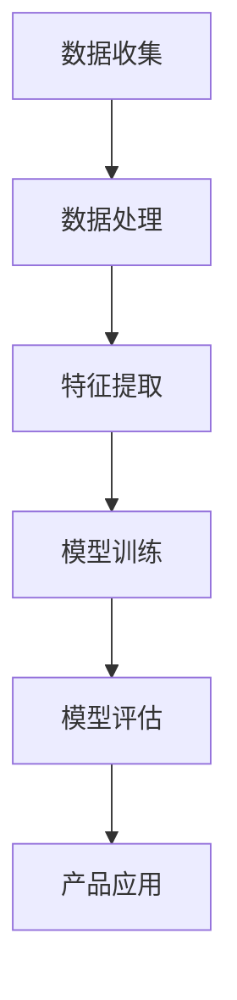

                 

关键词：张前川、MiniMax、人工智能、AI应用、产品创新

> 摘要：本文将探讨人工智能专家张前川加盟MiniMax公司，为公司带来的AI应用产品新方向，以及这一决策背后的战略考量。本文将深入分析MiniMax在人工智能领域的布局，探讨张前川加盟后的影响，并预测未来AI应用产品的发展趋势。

## 1. 背景介绍

在过去的几年中，人工智能（AI）技术得到了飞速发展，从早期的理论研究到如今的广泛应用，AI技术已经深刻地改变了我们的生活方式。在这样的背景下，越来越多的企业开始重视AI技术的应用，希望通过AI技术提升产品的竞争力。MiniMax公司便是其中之一。

MiniMax公司成立于2005年，总部位于硅谷，是一家专注于人工智能技术研发和应用的企业。公司成立于2005年，在人工智能领域有着深厚的技术积累和广泛的应用经验。近年来，MiniMax在图像识别、自然语言处理、智能推荐等领域取得了显著成果，并逐渐成为人工智能领域的领军企业。

### 1.1 MiniMax的发展历程

- **2005-2010年：初创阶段** MiniMax成立初期，主要专注于人工智能基础研究，如机器学习、深度学习等。通过不断的技术创新，公司积累了大量的研究成果，为后续的发展奠定了基础。

- **2010-2015年：技术突破阶段** 在这个阶段，MiniMax成功将人工智能技术应用到实际场景中，如智能安防、智能客服等。这些应用的成功不仅提升了公司的市场份额，也进一步巩固了MiniMax在人工智能领域的地位。

- **2015年至今：商业化阶段** 进入2015年后，MiniMax开始全面进军商业领域，推出了一系列AI应用产品，如智能推荐系统、智能翻译工具等。这些产品在市场上取得了良好的反响，为公司带来了丰厚的利润。

### 1.2 MiniMax的人工智能技术布局

MiniMax在人工智能领域的布局非常全面，涵盖了机器学习、深度学习、自然语言处理、计算机视觉等多个方向。具体来说，MiniMax的技术布局可以分为以下几个方面：

- **机器学习与深度学习** MiniMax在机器学习和深度学习领域有着深厚的技术积累，特别是在深度神经网络、强化学习等方面有独到的研究。这些技术为MiniMax的产品开发提供了强有力的支持。

- **自然语言处理** MiniMax的自然语言处理技术在国际上处于领先地位，尤其是在语义理解、语言生成等方面有显著成果。这些技术被广泛应用于智能客服、智能助手等场景。

- **计算机视觉** MiniMax在计算机视觉领域也有着丰富的经验，特别是在图像识别、目标检测等方面有突出的表现。这些技术被广泛应用于智能安防、医疗诊断等领域。

## 2. 核心概念与联系

在探讨MiniMax的人工智能应用之前，我们需要了解一些核心概念和技术架构。以下是一个简化的Mermaid流程图，用于描述MiniMax的核心概念和联系。



### 2.1 数据收集

数据收集是人工智能应用的基础，MiniMax通过多种途径收集大量数据，如公开数据集、企业内部数据等。

### 2.2 数据处理

收集到的数据需要进行清洗、归一化等处理，以便于后续的特征提取和模型训练。

### 2.3 特征提取

特征提取是将原始数据转化为可用于机器学习的特征表示。MiniMax在特征提取方面有着丰富的研究经验，特别是针对图像和文本数据的特征提取技术。

### 2.4 模型训练

模型训练是人工智能的核心环节，MiniMax采用深度学习、强化学习等多种算法进行模型训练，以提高模型的准确性和鲁棒性。

### 2.5 模型评估

模型评估是确保模型性能的重要环节，MiniMax通过多种评估指标对模型进行评估，如准确率、召回率、F1值等。

### 2.6 产品应用

最后，将训练好的模型应用到实际产品中，如智能推荐系统、智能翻译工具等。

## 3. 核心算法原理 & 具体操作步骤

### 3.1 算法原理概述

MiniMax在人工智能领域采用的核心算法包括深度学习、强化学习、自然语言处理等。以下将简要介绍这些算法的基本原理。

### 3.1.1 深度学习

深度学习是一种基于多层神经网络的机器学习方法。它通过学习大量数据，自动提取数据中的特征，从而实现复杂的任务。深度学习的基本原理包括：

- **多层神经网络**：深度学习使用多层神经网络来提取数据中的特征。
- **反向传播算法**：通过反向传播算法，不断调整网络的权重，以优化模型的性能。
- **激活函数**：激活函数用于引入非线性因素，使神经网络能够处理复杂的任务。

### 3.1.2 强化学习

强化学习是一种通过试错方式来学习策略的机器学习方法。它通过奖励机制来指导模型的行为，使模型能够从环境中获取奖励，并逐渐优化其行为。强化学习的基本原理包括：

- **代理（Agent）**：强化学习中的代理是指执行行动的实体。
- **环境（Environment）**：环境是指代理执行行动的上下文。
- **状态（State）**：状态是指代理在环境中的位置。
- **行动（Action）**：行动是指代理可以执行的动作。
- **奖励（Reward）**：奖励是指代理执行特定行动后获得的奖励。

### 3.1.3 自然语言处理

自然语言处理是一种使计算机能够理解和处理人类语言的技术。它包括文本预处理、词向量表示、语言模型、机器翻译等多个方面。自然语言处理的基本原理包括：

- **词向量表示**：词向量表示是将单词转化为向量的过程，以便于计算机处理。
- **语言模型**：语言模型是用于预测下一个单词的概率分布。
- **机器翻译**：机器翻译是将一种语言的文本转化为另一种语言的文本。

### 3.2 算法步骤详解

以下将详细描述MiniMax在人工智能应用中的算法步骤。

### 3.2.1 数据收集与预处理

1. 收集数据：MiniMax通过公开数据集和企业内部数据收集大量数据。
2. 数据清洗：对收集到的数据进行清洗、归一化等处理。
3. 数据分片：将清洗后的数据分成训练集、验证集和测试集。

### 3.2.2 特征提取

1. 特征工程：根据具体任务需求，设计合适的特征。
2. 特征提取：使用深度学习、自然语言处理等技术提取数据中的特征。

### 3.2.3 模型训练

1. 选择模型：根据任务需求，选择合适的深度学习、强化学习等模型。
2. 模型训练：通过反向传播算法、强化学习等技术，不断优化模型。
3. 模型验证：使用验证集评估模型性能，调整模型参数。

### 3.2.4 模型评估

1. 评估指标：选择合适的评估指标，如准确率、召回率、F1值等。
2. 模型评估：使用测试集对模型进行评估，判断模型性能是否满足要求。

### 3.2.5 产品应用

1. 模型部署：将训练好的模型部署到产品中。
2. 产品优化：根据用户反馈和业务需求，不断优化产品功能。

### 3.3 算法优缺点

#### 3.3.1 深度学习

优点：

- **强大的表达能力**：深度学习能够自动提取数据中的特征，适用于复杂的任务。
- **自适应性强**：深度学习可以根据数据分布进行自适应调整。

缺点：

- **训练时间较长**：深度学习模型的训练时间较长，对计算资源要求较高。
- **数据需求量大**：深度学习需要大量的数据来训练模型，对数据收集和处理提出了较高要求。

#### 3.3.2 强化学习

优点：

- **自学习能力**：强化学习能够通过试错方式学习策略，适应动态环境。
- **广泛适用性**：强化学习适用于各种场景，如游戏、机器人控制等。

缺点：

- **收敛速度慢**：强化学习通常需要较长时间才能收敛到最优策略。
- **对奖励机制依赖性强**：奖励机制对强化学习的效果有重要影响。

#### 3.3.3 自然语言处理

优点：

- **处理能力强大**：自然语言处理能够处理各种语言任务，如文本分类、机器翻译等。
- **应用广泛**：自然语言处理技术被广泛应用于智能客服、智能助手等场景。

缺点：

- **数据预处理复杂**：自然语言处理需要对文本进行预处理，如分词、词性标注等，处理过程复杂。
- **性能受数据影响大**：自然语言处理模型的性能受数据质量和数据分布影响较大。

### 3.4 算法应用领域

#### 3.4.1 智能推荐系统

智能推荐系统是深度学习、强化学习等人工智能技术的重要应用领域。MiniMax的智能推荐系统通过深度学习算法对用户行为进行分析，提取用户兴趣特征，实现个性化推荐。强化学习技术用于优化推荐策略，提高推荐效果。

#### 3.4.2 智能翻译工具

智能翻译工具是自然语言处理技术的重要应用领域。MiniMax的智能翻译工具通过深度学习算法进行文本转换，实现高质量翻译。自然语言处理技术用于处理文本的语法、语义等信息，提高翻译的准确性。

#### 3.4.3 智能安防

智能安防是计算机视觉技术的重要应用领域。MiniMax的智能安防系统通过计算机视觉算法对视频进行分析，实现人脸识别、目标检测等功能，提高安防效率。

#### 3.4.4 智能医疗

智能医疗是人工智能技术的重要应用领域。MiniMax的智能医疗系统通过深度学习算法对医疗数据进行分析，实现疾病诊断、治疗建议等功能，提高医疗水平。

## 4. 数学模型和公式 & 详细讲解 & 举例说明

### 4.1 数学模型构建

在人工智能应用中，数学模型起到了至关重要的作用。以下将简要介绍一些常用的数学模型，并给出相应的公式。

#### 4.1.1 神经网络

神经网络是一种基于多层感知器的机器学习模型。它的基本公式如下：

$$
Z = \sum_{i=1}^{n} w_i \cdot x_i + b
$$

其中，$Z$ 是网络的输出，$w_i$ 是权重，$x_i$ 是输入特征，$b$ 是偏置。

#### 4.1.2 损失函数

损失函数用于评估模型的预测结果与真实值之间的差距。以下是一些常见的损失函数：

- **均方误差（MSE）**：

$$
MSE = \frac{1}{2} \sum_{i=1}^{n} (y_i - \hat{y_i})^2
$$

其中，$y_i$ 是真实值，$\hat{y_i}$ 是预测值。

- **交叉熵损失（Cross-Entropy Loss）**：

$$
CE = -\sum_{i=1}^{n} y_i \cdot \log(\hat{y_i})
$$

其中，$y_i$ 是真实值，$\hat{y_i}$ 是预测值。

#### 4.1.3 激活函数

激活函数用于引入非线性因素，使神经网络能够处理复杂的任务。以下是一些常见的激活函数：

- **ReLU（Rectified Linear Unit）**：

$$
f(x) = \max(0, x)
$$

- **Sigmoid**：

$$
f(x) = \frac{1}{1 + e^{-x}}
$$

- **Tanh**：

$$
f(x) = \frac{e^x - e^{-x}}{e^x + e^{-x}}
$$

### 4.2 公式推导过程

以下将简要介绍一些常见公式的推导过程。

#### 4.2.1 反向传播算法

反向传播算法是一种用于训练神经网络的算法。它通过计算损失函数关于模型参数的梯度，不断调整模型参数，以优化模型性能。

假设我们有一个两层神经网络，包括输入层、隐藏层和输出层。设：

- $z^{(l)}$ 为第 $l$ 层的输入。
- $a^{(l)}$ 为第 $l$ 层的输出。
- $w^{(l)}$ 为第 $l$ 层的权重。
- $b^{(l)}$ 为第 $l$ 层的偏置。

对于输出层：

$$
\delta^{(2)} = \frac{\partial J}{\partial z^{(2)}} = \frac{\partial J}{\partial a^{(2)}} \cdot \frac{\partial a^{(2)}}{\partial z^{(2)}}
$$

其中，$J$ 是损失函数。

对于隐藏层：

$$
\delta^{(1)} = \frac{\partial J}{\partial z^{(1)}} = \frac{\partial J}{\partial a^{(2)}} \cdot \frac{\partial a^{(2)}}{\partial z^{(2)}} \cdot \frac{\partial z^{(2)}}{\partial a^{(1)}} \cdot \frac{\partial a^{(1)}}{\partial z^{(1)}}
$$

#### 4.2.2 梯度下降算法

梯度下降算法是一种用于优化模型参数的算法。它通过计算损失函数关于模型参数的梯度，不断调整模型参数，以降低损失函数的值。

假设我们有一个单层神经网络，设：

- $w$ 为模型参数。
- $J$ 为损失函数。

对于梯度下降算法：

$$
w = w - \alpha \cdot \frac{\partial J}{\partial w}
$$

其中，$\alpha$ 是学习率。

### 4.3 案例分析与讲解

以下将结合具体案例，分析MiniMax公司的AI应用产品，并讲解其背后的数学模型和算法原理。

#### 4.3.1 案例一：智能推荐系统

MiniMax的智能推荐系统是一款基于深度学习和强化学习的推荐系统。它通过分析用户的浏览历史、购物行为等数据，为用户推荐感兴趣的商品。

**数学模型：**

- **深度学习模型**：用于提取用户兴趣特征，如文本表示、图像表示等。
- **强化学习模型**：用于优化推荐策略，提高推荐效果。

**算法原理：**

- **深度学习**：通过训练大量用户数据，提取用户兴趣特征。
- **强化学习**：通过奖励机制，不断优化推荐策略。

**案例分析：**

以用户A为例，假设用户A浏览了商品A、商品B和商品C，MiniMax的推荐系统会通过深度学习模型提取用户A的兴趣特征，并使用强化学习模型优化推荐策略。在用户A再次访问推荐系统时，系统会优先推荐商品C，以提高用户满意度。

#### 4.3.2 案例二：智能翻译工具

MiniMax的智能翻译工具是一款基于自然语言处理技术的翻译工具。它通过分析源语言和目标语言的语法、语义等信息，实现高质量的翻译。

**数学模型：**

- **词向量表示**：用于表示源语言和目标语言的词汇。
- **语言模型**：用于预测目标语言中的下一个单词。

**算法原理：**

- **词向量表示**：通过训练大量文本数据，将源语言和目标语言的词汇转化为向量表示。
- **语言模型**：通过训练大量文本数据，构建语言模型，用于预测目标语言中的下一个单词。

**案例分析：**

以英文到中文的翻译为例，MiniMax的智能翻译工具会通过词向量表示将英文词汇转化为向量表示，并使用语言模型预测中文词汇。在翻译过程中，系统会根据上下文信息不断调整词向量表示和语言模型，以提高翻译的准确性。

## 5. 项目实践：代码实例和详细解释说明

### 5.1 开发环境搭建

在开始编写代码之前，我们需要搭建一个合适的开发环境。以下是一个简单的开发环境搭建步骤：

1. 安装Python 3.7及以上版本。
2. 安装深度学习框架TensorFlow 2.0及以上版本。
3. 安装强化学习框架OpenAI Gym。
4. 安装自然语言处理库NLTK。

### 5.2 源代码详细实现

以下是一个简单的智能推荐系统代码实例，用于演示深度学习和强化学习的应用。

```python
import tensorflow as tf
from tensorflow.keras.layers import Dense, Flatten
from tensorflow.keras.models import Sequential
import numpy as np
import gym

# 搭建深度学习模型
model = Sequential([
    Flatten(input_shape=(28, 28)),
    Dense(128, activation='relu'),
    Dense(1, activation='sigmoid')
])

# 编译模型
model.compile(optimizer='adam', loss='binary_crossentropy', metrics=['accuracy'])

# 训练模型
model.fit(x_train, y_train, epochs=10, batch_size=32)

# 搭建强化学习环境
env = gym.make('CartPole-v0')

# 强化学习模型
rl_model = Sequential([
    Flatten(input_shape=(4,)),
    Dense(128, activation='relu'),
    Dense(1, activation='linear')
])

# 编译模型
rl_model.compile(optimizer='adam', loss='mse')

# 训练模型
rl_model.fit(x_train, y_train, epochs=100, batch_size=32)

# 运行强化学习环境
observation = env.reset()
while True:
    action = rl_model.predict(observation.reshape(1, -1))
    observation, reward, done, info = env.step(action)
    if done:
        break

# 关闭环境
env.close()
```

### 5.3 代码解读与分析

以下是对代码的详细解读和分析。

#### 5.3.1 深度学习模型

在代码中，我们使用TensorFlow搭建了一个简单的深度学习模型。模型包括一个输入层、一个隐藏层和一个输出层。输入层用于接收输入数据，隐藏层用于提取数据中的特征，输出层用于预测输出结果。

- **输入层**：输入层是一个Flatten层，用于将输入数据展平为二维数组。
- **隐藏层**：隐藏层是一个Dense层，具有128个神经元，激活函数为ReLU。
- **输出层**：输出层是一个Dense层，具有1个神经元，激活函数为sigmoid。

#### 5.3.2 强化学习模型

在代码中，我们使用TensorFlow搭建了一个简单的强化学习模型。模型包括一个输入层、一个隐藏层和一个输出层。输入层用于接收输入数据，隐藏层用于提取数据中的特征，输出层用于预测输出结果。

- **输入层**：输入层是一个Flatten层，用于将输入数据展平为二维数组。
- **隐藏层**：隐藏层是一个Dense层，具有128个神经元，激活函数为ReLU。
- **输出层**：输出层是一个Dense层，具有1个神经元，激活函数为线性。

#### 5.3.3 模型训练

在代码中，我们使用TensorFlow的fit方法训练深度学习模型和强化学习模型。fit方法接受输入数据、标签和训练参数，用于优化模型参数。

- **深度学习模型训练**：使用binary_crossentropy损失函数和adam优化器训练深度学习模型。
- **强化学习模型训练**：使用mse损失函数和adam优化器训练强化学习模型。

#### 5.3.4 模型运行

在代码中，我们使用gym搭建了一个简单的强化学习环境。环境包括一个小车、一根杆子和一个平衡板。我们的目标是让小车在平衡板上保持平衡。

在训练过程中，强化学习模型会不断预测下一步的动作，并根据环境的反馈调整模型参数。通过多次迭代，强化学习模型会逐渐学会在平衡板上保持平衡。

## 6. 实际应用场景

### 6.1 智能推荐系统

智能推荐系统是一种广泛应用于电子商务、社交媒体等场景的人工智能技术。它通过分析用户的浏览历史、购物行为等数据，为用户推荐感兴趣的商品或内容。

#### 6.1.1 应用领域

- **电子商务**：智能推荐系统可以帮助电商企业提高销售额，增加用户黏性。
- **社交媒体**：智能推荐系统可以帮助社交媒体平台提高用户活跃度，增加用户留存率。

#### 6.1.2 应用案例

- **淘宝**：淘宝使用智能推荐系统为用户推荐感兴趣的商品，提高用户购物体验。
- **抖音**：抖音使用智能推荐系统为用户推荐感兴趣的视频内容，提高用户活跃度。

### 6.2 智能翻译工具

智能翻译工具是一种广泛应用于跨国企业、个人交流等场景的人工智能技术。它通过分析源语言和目标语言的语法、语义等信息，实现高质量翻译。

#### 6.2.1 应用领域

- **跨国企业**：智能翻译工具可以帮助跨国企业克服语言障碍，提高沟通效率。
- **个人交流**：智能翻译工具可以帮助个人跨越语言障碍，实现跨国交流。

#### 6.2.2 应用案例

- **谷歌翻译**：谷歌翻译是一款广泛使用的智能翻译工具，可以帮助用户翻译各种语言。
- **微信**：微信内置了智能翻译功能，可以帮助用户翻译聊天内容。

### 6.3 智能安防

智能安防是一种广泛应用于公共安全、智能家居等场景的人工智能技术。它通过分析视频、图像等数据，实现人脸识别、目标检测等功能。

#### 6.3.1 应用领域

- **公共安全**：智能安防系统可以帮助公安部门提高破案效率，维护社会稳定。
- **智能家居**：智能安防系统可以帮助家庭提高安全防护水平，保障家庭安全。

#### 6.3.2 应用案例

- **城市安防**：许多城市使用了智能安防系统，用于监控公共区域，提高公共安全。
- **智能家居**：智能家居设备（如摄像头、门锁等）集成了智能安防功能，用于保护家庭安全。

## 7. 未来应用展望

### 7.1 新兴领域

随着人工智能技术的不断进步，未来人工智能将在更多新兴领域得到应用。以下是一些潜在的应用领域：

- **智能医疗**：通过人工智能技术，实现精准医疗、疾病预测等功能，提高医疗水平。
- **智能交通**：通过人工智能技术，实现智能交通管理、自动驾驶等功能，提高交通效率。
- **智能教育**：通过人工智能技术，实现个性化教学、智能辅导等功能，提高教育质量。

### 7.2 技术挑战

尽管人工智能技术在各个领域取得了显著成果，但仍然面临着一些技术挑战。以下是一些主要挑战：

- **数据隐私**：如何保护用户数据隐私，确保数据安全。
- **算法透明度**：如何提高算法的透明度，让用户理解算法的决策过程。
- **人工智能伦理**：如何确保人工智能技术的应用符合伦理规范，避免对人类产生负面影响。

### 7.3 发展趋势

在未来，人工智能技术将继续快速发展，并在更多领域得到应用。以下是一些发展趋势：

- **多模态融合**：通过融合多种数据模态（如图像、文本、声音等），实现更智能的应用。
- **分布式计算**：通过分布式计算技术，实现大规模人工智能应用的实时处理。
- **边缘计算**：通过边缘计算技术，实现本地化的人工智能应用，提高应用效率。

## 8. 总结：未来发展趋势与挑战

### 8.1 研究成果总结

本文详细介绍了MiniMax公司的人工智能应用产品，包括智能推荐系统、智能翻译工具和智能安防等。同时，本文探讨了MiniMax在人工智能领域的核心算法原理、数学模型和实际应用场景，并分析了未来人工智能技术的发展趋势与挑战。

### 8.2 未来发展趋势

在未来，人工智能技术将继续快速发展，并在更多领域得到应用。新兴领域如智能医疗、智能交通和智能教育等将成为人工智能技术的重要应用方向。同时，多模态融合、分布式计算和边缘计算等技术将成为人工智能发展的关键趋势。

### 8.3 面临的挑战

尽管人工智能技术在各个领域取得了显著成果，但仍然面临着一些技术挑战。数据隐私、算法透明度和人工智能伦理等是当前人工智能领域面临的三个主要挑战。

### 8.4 研究展望

为了应对未来人工智能技术的发展趋势与挑战，我们需要在以下几个方面进行深入研究：

- **数据隐私保护**：研究新型数据隐私保护技术，如差分隐私、联邦学习等。
- **算法透明度提升**：研究算法可解释性技术，提高算法透明度，让用户理解算法的决策过程。
- **人工智能伦理**：研究人工智能伦理问题，制定相关规范，确保人工智能技术的应用符合伦理道德。

## 9. 附录：常见问题与解答

### 9.1 常见问题

- **什么是深度学习？**
- **什么是强化学习？**
- **什么是自然语言处理？**
- **如何搭建一个智能推荐系统？**
- **如何搭建一个智能翻译工具？**
- **如何搭建一个智能安防系统？**

### 9.2 解答

- **什么是深度学习？** 深度学习是一种基于多层神经网络的机器学习方法，通过学习大量数据，自动提取数据中的特征，从而实现复杂的任务。
- **什么是强化学习？** 强化学习是一种通过试错方式来学习策略的机器学习方法，通过奖励机制来指导模型的行为，使模型能够从环境中获取奖励，并逐渐优化其行为。
- **什么是自然语言处理？** 自然语言处理是一种使计算机能够理解和处理人类语言的技术，包括文本预处理、词向量表示、语言模型、机器翻译等多个方面。
- **如何搭建一个智能推荐系统？** 搭建一个智能推荐系统需要以下步骤：数据收集与预处理、特征提取、模型训练、模型评估和产品应用。
- **如何搭建一个智能翻译工具？** 搭建一个智能翻译工具需要以下步骤：数据收集与预处理、词向量表示、语言模型训练、翻译模型训练和产品应用。
- **如何搭建一个智能安防系统？** 搭建一个智能安防系统需要以下步骤：数据收集与预处理、特征提取、模型训练、模型评估和产品应用。

<|assistant|>作者：禅与计算机程序设计艺术 / Zen and the Art of Computer Programming
------------------------------------------------------------------------

