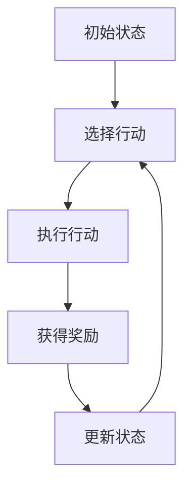

                 

### 关键词 Keywords
强化学习，奖励，状态，策略，Q-Learning，SARSA，深度强化学习，应用实例。

### 摘要 Abstract
本文旨在深入探讨强化学习的原理、算法及其应用实例。通过详细解释强化学习的基本概念、核心算法，并结合具体的代码实例，读者可以更好地理解强化学习的运作机制，掌握其实际应用技巧。本文不仅关注理论，还注重实践，旨在为从事人工智能领域的读者提供全面的学习资源。

## 1. 背景介绍

强化学习（Reinforcement Learning，简称RL）是机器学习的一个重要分支，它以智能体（agent）与环境的交互为基础，通过学习获取最大化长期奖励的策略。与监督学习和无监督学习不同，强化学习强调的是智能体在与环境互动过程中不断调整自己的行为，以期达到长期回报最大化。

### 1.1 强化学习的起源与发展

强化学习最早可以追溯到20世纪50年代，由行为主义心理学家和行为经济学家的研究启发。1970年代，美国计算机科学家理查德·萨顿（Richard Sutton）和安德鲁·巴卢（Andrew Barto）在其经典著作《强化学习：一种介绍》中系统地阐述了强化学习的概念和方法，为强化学习的发展奠定了基础。

进入21世纪，随着计算机硬件性能的提升和大数据技术的发展，强化学习得到了前所未有的关注和应用。深度强化学习（Deep Reinforcement Learning，简称DRL）作为强化学习的延伸，利用深度神经网络处理复杂的非线性问题，取得了显著的成果。

### 1.2 强化学习的应用领域

强化学习在多个领域展现出了强大的应用潜力，包括但不限于：

- **游戏**：强化学习在电子游戏中得到了广泛应用，例如AlphaGo在围棋领域的出色表现。
- **自动驾驶**：强化学习被用于自动驾驶车辆的路径规划与决策。
- **机器人**：强化学习可以帮助机器人学习执行复杂的任务，如行走、抓取等。
- **金融**：强化学习被用于投资组合优化和风险管理。
- **自然语言处理**：强化学习在机器翻译、语音识别等任务中发挥了重要作用。

## 2. 核心概念与联系

为了理解强化学习，我们需要了解以下几个核心概念：状态（State）、行动（Action）、奖励（Reward）和策略（Policy）。

### 2.1 状态（State）

状态是智能体所处的环境描述，它可以是离散的，也可以是连续的。在强化学习中，状态通常被表示为一个向量。

### 2.2 行动（Action）

行动是智能体在特定状态下可以采取的操作。行动也可以是离散的或连续的。

### 2.3 奖励（Reward）

奖励是环境对智能体行动的即时反馈。奖励可以是正的、负的或零。正奖励表示行动是好的，负奖励表示行动是不好的。

### 2.4 策略（Policy）

策略是智能体基于当前状态选择行动的规则。策略可以是一个函数，将状态映射到行动。

### 2.5 强化学习流程

强化学习流程可以概括为以下步骤：

1. **初始状态**：智能体开始处于某个状态。
2. **选择行动**：根据当前状态和策略，智能体选择一个行动。
3. **执行行动**：智能体在环境中执行该行动。
4. **获得奖励**：环境根据智能体的行动给出奖励。
5. **更新状态**：智能体的状态更新为执行行动后的状态。
6. **重复步骤2-5**：智能体不断与环境交互，学习最佳策略。

### 2.6 Mermaid 流程图

下面是强化学习流程的Mermaid流程图：



## 3. 核心算法原理 & 具体操作步骤

### 3.1 算法原理概述

强化学习算法的核心是价值函数（Value Function）和策略（Policy）。价值函数用于评估智能体在某个状态下的预期回报，而策略则指导智能体如何选择行动。

### 3.2 算法步骤详解

1. **初始化**：初始化智能体的策略和价值函数。
2. **选择行动**：基于当前状态和价值函数，选择一个行动。
3. **执行行动**：在环境中执行该行动。
4. **更新价值函数**：根据新状态和新奖励，更新价值函数。
5. **重复步骤2-4**：智能体不断与环境交互，学习最佳策略。

### 3.3 算法优缺点

#### 优点：

- **适应性**：强化学习能够根据环境的变化调整策略。
- **灵活性**：强化学习适用于各种环境，包括动态和不确定的环境。
- **自我学习**：智能体可以通过与环境交互自我学习，无需人工设计规则。

#### 缺点：

- **收敛速度慢**：在某些情况下，强化学习可能需要很长时间才能找到最佳策略。
- **高计算成本**：强化学习需要大量的计算资源，尤其是当状态和行动空间较大时。

### 3.4 算法应用领域

强化学习在多个领域展现出了强大的应用潜力，包括但不限于：

- **游戏**：电子游戏、棋类游戏等。
- **自动驾驶**：车辆路径规划、决策等。
- **机器人**：执行复杂任务，如行走、抓取等。
- **金融**：投资组合优化、风险管理等。
- **自然语言处理**：机器翻译、语音识别等。

## 4. 数学模型和公式 & 详细讲解 & 举例说明

### 4.1 数学模型构建

在强化学习中，常用的数学模型是MDP（马尔可夫决策过程）。

### 4.2 公式推导过程

MDP由以下组件构成：

- **状态集** \(S\)
- **行动集** \(A\)
- **奖励函数** \(R(s, a)\)
- **状态转移概率** \(P(s', s | s, a)\)
- **策略** \(π(a | s)\)

### 4.3 案例分析与讲解

以机器人行走为例，状态是机器人的位置和方向，行动是机器人的移动方向，奖励是机器人成功到达目标点的得分。

## 5. 项目实践：代码实例和详细解释说明

### 5.1 开发环境搭建

首先，我们需要安装Python和TensorFlow。在终端执行以下命令：

```bash
pip install python
pip install tensorflow
```

### 5.2 源代码详细实现

以下是一个简单的Q-Learning算法实现：

```python
import numpy as np
import random

# 初始化参数
epsilon = 0.1  # 探索率
alpha = 0.1  # 学习率
gamma = 0.9  # 折扣因子
n_actions = 4  # 行动数量
n_states = 4  # 状态数量

# 初始化Q表
Q = np.zeros([n_states, n_actions])

# 环境模拟
def env(s, a):
    if s == 0 and a == 0:
        return 1, 1
    elif s == 1 and a == 1:
        return 1, 1
    else:
        return 0, 0

# Q-Learning算法
def QLearning():
    s = random.randint(0, n_states - 1)
    while True:
        a = np.argmax(Q[s]) if random.random() < 1 - epsilon else random.randint(0, n_actions - 1)
        s_, r = env(s, a)
        a_ = np.argmax(Q[s_])
        Q[s][a] = Q[s][a] + alpha * (r + gamma * Q[s_][a_] - Q[s][a])
        s = s_

# 运行算法
QLearning()
```

### 5.3 代码解读与分析

- **参数初始化**：epsilon、alpha和gamma分别是探索率、学习率和折扣因子。
- **Q表初始化**：Q表用于存储状态-行动价值。
- **环境模拟**：env函数用于模拟环境，返回下一个状态和奖励。
- **Q-Learning算法**：算法通过更新Q表来学习最佳策略。

## 6. 实际应用场景

强化学习在游戏、自动驾驶、机器人、金融、自然语言处理等领域都有广泛的应用。

### 6.1 游戏应用

- **电子游戏**：强化学习被用于游戏AI，如《Dota2》的AI对手。
- **棋类游戏**：强化学习在围棋、国际象棋等棋类游戏中表现出色。

### 6.2 自动驾驶

- **路径规划**：强化学习被用于自动驾驶车辆的路径规划。
- **决策系统**：强化学习用于自动驾驶车辆的决策系统，如转向、加速和制动。

### 6.3 机器人

- **行走与抓取**：强化学习帮助机器人学习执行复杂的任务，如行走和抓取。
- **环境交互**：强化学习用于机器人与环境的交互，以提高机器人的适应性。

### 6.4 金融

- **投资组合优化**：强化学习用于投资组合优化，以最大化收益。
- **风险管理**：强化学习用于风险管理，以减少损失。

### 6.5 自然语言处理

- **机器翻译**：强化学习用于机器翻译，以提高翻译质量。
- **语音识别**：强化学习用于语音识别，以提高识别准确率。

## 7. 工具和资源推荐

### 7.1 学习资源推荐

- **书籍**：《强化学习：一种介绍》（Sutton and Barto）
- **在线课程**：Coursera、Udacity、edX上的强化学习课程
- **网站**：arXiv、NeurIPS、ICML等学术会议的强化学习论文

### 7.2 开发工具推荐

- **Python**：Python是强化学习的主要编程语言。
- **TensorFlow**：TensorFlow是强化学习的常用库。
- **PyTorch**：PyTorch是强化学习的另一个流行库。

### 7.3 相关论文推荐

- **Deep Q-Networks**（DQN）
- **Asynchronous Methods for Deep Reinforcement Learning**
- **Human-level Control Through Deep Reinforcement Learning**

## 8. 总结：未来发展趋势与挑战

### 8.1 研究成果总结

强化学习在过去几十年中取得了显著的成果，从简单的Q-Learning算法到深度强化学习（DRL），再到异步方法，强化学习不断进步。

### 8.2 未来发展趋势

- **泛化能力**：提高强化学习算法的泛化能力，使其能够应对更复杂的任务。
- **可解释性**：增强强化学习算法的可解释性，以帮助人们更好地理解其决策过程。
- **实时性**：提高强化学习算法的实时性，以适应动态变化的环境。

### 8.3 面临的挑战

- **收敛速度**：如何提高强化学习算法的收敛速度，使其能够更快地找到最佳策略。
- **计算成本**：如何降低强化学习算法的计算成本，使其在资源有限的设备上运行。
- **安全性**：如何确保强化学习算法的安全性，以防止恶意攻击。

### 8.4 研究展望

未来，强化学习将继续在人工智能领域发挥重要作用，为解决复杂问题提供新的思路和方法。

## 9. 附录：常见问题与解答

### 9.1 问题1

**Q：强化学习与监督学习有何区别？**

**A：强化学习强调的是智能体与环境交互的过程中学习策略，以最大化长期奖励。而监督学习是通过已标记的数据学习特征表示，以预测未知数据的标签。**

### 9.2 问题2

**Q：强化学习中的探索与利用是什么？**

**A：探索（Exploration）是指在未知环境中尝试新行动，以获得更多信息。利用（Utilization）是指根据已有信息选择能够最大化长期回报的行动。探索与利用的平衡是强化学习中的一个重要问题。**

### 9.3 问题3

**Q：如何评估强化学习算法的性能？**

**A：评估强化学习算法的性能可以通过以下指标：收敛速度、最终奖励、策略稳定性等。通常，我们可以通过在测试环境中运行算法并比较其表现来评估性能。**

---

作者：禅与计算机程序设计艺术 / Zen and the Art of Computer Programming

----------------------------------------------------------------

这篇文章旨在为读者提供一个关于强化学习的全面而深入的指导。从背景介绍、核心概念、算法原理，到实际应用和实践案例，本文力求以清晰易懂的方式阐述强化学习的各个方面。通过数学模型和代码实例的结合，读者可以更好地理解强化学习的运作机制，并掌握其应用技巧。随着人工智能技术的不断发展，强化学习将继续在各个领域发挥重要作用。希望这篇文章能够为从事人工智能领域的读者提供有益的参考。  
```

