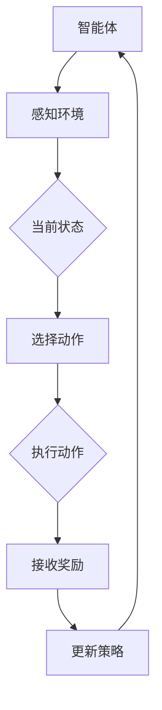

                 

强化学习（Reinforcement Learning, RL）作为机器学习领域的一个重要分支，是人工智能研究和应用的前沿领域。它通过智能体与环境的交互，不断优化决策策略，以达到最大化累积奖励的目标。本文将详细介绍强化学习的核心概念、主要算法及其应用领域，并探讨未来发展的趋势与挑战。

## 关键词
- 强化学习
- 强化学习算法
- 强化学习应用
- 强化学习挑战
- 强化学习未来

## 摘要
本文首先对强化学习进行了背景介绍，解释了其基本原理和核心概念。随后，本文重点介绍了强化学习的核心算法，包括Q学习、SARSA、策略梯度等方法，并详细分析了这些算法的原理、步骤、优缺点和应用领域。接着，本文通过数学模型和公式的讲解，深入探讨了强化学习中的状态值函数和策略迭代过程。在项目实践部分，本文通过具体的代码实例，展示了强化学习算法的实现和应用。最后，本文讨论了强化学习在实际应用场景中的表现，并展望了未来的发展趋势和面临的挑战。

## 1. 背景介绍

强化学习起源于20世纪50年代的心理学研究，最初是为了模拟动物的决策过程。1980年代，随着计算机科学和人工智能的发展，强化学习逐渐成为机器学习领域的一个重要分支。强化学习与监督学习和无监督学习不同，它通过智能体（Agent）与环境（Environment）的交互来学习，从而优化其行为策略。

在强化学习中，智能体是一个能够感知环境状态（State）、选择动作（Action）并接受环境反馈（Reward）的实体。环境则是一个包含状态空间、动作空间和奖励函数的复杂系统。奖励函数用于评价智能体的动作效果，指导智能体进行决策。强化学习的目标是使智能体在给定环境中，通过学习找到一条最优策略（Policy），使得累积奖励最大化。

强化学习在许多领域具有广泛的应用，如机器人控制、游戏AI、自动驾驶、推荐系统等。它不仅在理论研究上具有重要意义，还在实际应用中展现了巨大的潜力。

## 2. 核心概念与联系

### 2.1 强化学习中的基本概念

在强化学习中，有四个基本概念：状态（State）、动作（Action）、奖励（Reward）和策略（Policy）。

- **状态（State）**：智能体在某一时刻所处的情境或环境。
- **动作（Action）**：智能体可以执行的行为。
- **奖励（Reward）**：对智能体动作的即时评价，可以是正奖励或负奖励。
- **策略（Policy）**：智能体在给定状态下采取的动作，可以表示为策略函数π(s,a)。

### 2.2 强化学习中的联系

强化学习中的状态、动作、奖励和策略之间存在紧密的联系。状态是智能体感知环境的依据，动作是智能体与环境交互的途径，奖励是智能体行动效果的评价，策略则是智能体行动的指导原则。

强化学习通过智能体与环境之间的交互，不断更新策略，以达到最大化累积奖励的目标。智能体在每次交互中，都会根据当前状态选择动作，并根据动作的奖励更新策略。这个过程称为学习过程，也是强化学习的基本原理。

### 2.3 强化学习中的架构

为了更好地理解强化学习，我们可以将其架构用Mermaid流程图表示如下：



### 2.4 强化学习的挑战

尽管强化学习在理论上具有强大的解释力和应用潜力，但在实际应用中仍面临许多挑战。以下是强化学习面临的一些主要挑战：

- **维度的灾难（Curse of Dimensionality）**：随着状态空间和动作空间的维度增加，强化学习的复杂度呈指数级增长，导致学习过程变得非常困难。
- **样本效率（Sample Efficiency）**：强化学习需要大量的样本数据来训练模型，以提高学习效率和准确性。
- **探索与利用（Exploration vs Exploitation）**：智能体需要在探索新策略和利用已有策略之间做出平衡，以最大化累积奖励。
- **稳定性与鲁棒性（Stability and Robustness）**：强化学习算法需要保证在复杂环境中具有稳定性和鲁棒性，以应对不确定性和异常情况。

## 3. 核心算法原理 & 具体操作步骤

### 3.1 算法原理概述

强化学习的核心算法主要包括Q学习（Q-Learning）、SARSA（State-Action-Reward-State-Action）和策略梯度（Policy Gradient）等方法。

- **Q学习**：Q学习是基于值函数的方法，通过学习状态-动作值函数Q(s,a)来指导智能体的动作选择。智能体在给定状态下选择具有最大Q值的动作。
- **SARSA**：SARSA是基于策略迭代的方法，它通过在每次动作选择后，根据新的状态和动作更新策略。
- **策略梯度**：策略梯度是基于策略的方法，它通过最大化策略的梯度来更新策略，以实现累积奖励的最大化。

### 3.2 算法步骤详解

#### 3.2.1 Q学习

Q学习的主要步骤如下：

1. 初始化Q值函数Q(s,a)。
2. 在给定状态s下，选择具有最大Q值的动作a。
3. 执行动作a，进入新状态s'，并接收奖励r。
4. 根据新状态s'和动作a'，更新Q值函数：Q(s,a) = Q(s,a) + α [r + γ max(Q(s',a')) - Q(s,a)]，其中α为学习率，γ为折扣因子。

#### 3.2.2 SARSA

SARSA的主要步骤如下：

1. 初始化策略π(s,a)。
2. 在给定状态s下，根据当前策略π(s,a)，选择动作a。
3. 执行动作a，进入新状态s'，并接收奖励r。
4. 在新状态s'下，根据当前策略π(s',a')，选择动作a'。
5. 根据新状态s'和动作a'，更新策略π(s,a)：π(s,a) = π(s,a) + α [r + γ max(Q(s',a')) - Q(s,a)]，其中α为学习率，γ为折扣因子。

#### 3.2.3 策略梯度

策略梯度的主要步骤如下：

1. 初始化策略π(s,a)。
2. 在给定状态s下，选择动作a。
3. 执行动作a，进入新状态s'，并接收奖励r。
4. 根据新状态s'和动作a'，计算策略梯度：∇π(s,a) = 1/N Σ [r + γ max(Q(s',a')) - Q(s,a)]，其中N为样本数量。
5. 更新策略π(s,a)：π(s,a) = π(s,a) + η ∇π(s,a)，其中η为学习率。

### 3.3 算法优缺点

- **Q学习**：优点在于简单易懂，能够稳定收敛；缺点在于需要大量的样本数据，且在动作空间较大时计算复杂度高。
- **SARSA**：优点在于可以处理部分可观测环境，且不需要明确的状态值函数；缺点在于收敛速度较慢，且在探索阶段性能较差。
- **策略梯度**：优点在于能够直接优化策略，不需要状态值函数；缺点在于梯度估计不稳定，且在动作空间较大时难以收敛。

### 3.4 算法应用领域

强化学习在许多领域具有广泛的应用，以下列举了几个主要应用领域：

- **机器人控制**：强化学习在机器人控制领域被广泛应用于路径规划、平衡控制、抓取操作等任务。
- **游戏AI**：强化学习在游戏AI领域取得了显著成果，如AlphaGo在围棋比赛中的表现。
- **自动驾驶**：强化学习在自动驾驶领域被用于车辆控制、路径规划、环境感知等任务。
- **推荐系统**：强化学习在推荐系统领域被用于优化推荐策略，提高用户满意度。

## 4. 数学模型和公式 & 详细讲解 & 举例说明

### 4.1 数学模型构建

强化学习中的数学模型主要包括状态-动作值函数Q(s,a)、策略π(s,a)和累积奖励R。

- **状态-动作值函数Q(s,a)**：Q(s,a)表示在状态s下执行动作a所能获得的累积奖励。
- **策略π(s,a)**：π(s,a)表示在状态s下选择动作a的概率。
- **累积奖励R**：R表示在连续动作过程中获得的累积奖励。

### 4.2 公式推导过程

强化学习中的核心公式为Q学习更新公式：

$$
Q(s,a) = Q(s,a) + α [r + γ max(Q(s',a')) - Q(s,a)]
$$

其中，α为学习率，γ为折扣因子，r为奖励，s和s'分别为当前状态和新状态，a和a'分别为当前动作和新动作。

### 4.3 案例分析与讲解

假设一个简单的强化学习问题：一个智能体在平面上移动，目标是到达目标位置并获取最大奖励。状态空间为{(0,0), (1,0), (0,1), (1,1)}，动作空间为{左、右、上、下}，奖励函数为到达目标位置时获得10分，其他状态获得0分。

初始状态为(0,0)，智能体选择向上移动，进入状态(0,1)。此时，Q值函数为：

$$
Q((0,0), 上) = 0
$$

在状态(0,1)下，智能体选择向右移动，进入状态(1,1)。此时，Q值函数更新为：

$$
Q((0,0), 上) = 0 + α [0 + γ max(Q((1,1), 左), Q((1,1), 右), Q((1,1), 上), Q((1,1), 下)) - 0]
$$

假设α=0.1，γ=0.9，则：

$$
Q((0,0), 上) = 0.1 [0 + 0.9 max(Q((1,1), 左), Q((1,1), 右), Q((1,1), 上), Q((1,1), 下)) - 0]
$$

由于目标位置在(1,1)，智能体在状态(1,1)时获得最大奖励，即：

$$
Q((1,1), 左) = Q((1,1), 右) = Q((1,1), 上) = Q((1,1), 下) = 10
$$

因此，更新后的Q值函数为：

$$
Q((0,0), 上) = 0.1 [0 + 0.9 × 10 - 0] = 0.9
$$

## 5. 项目实践：代码实例和详细解释说明

### 5.1 开发环境搭建

本文使用Python编写强化学习算法，主要依赖以下库：

- Python 3.7及以上版本
- TensorFlow 2.2及以上版本
- Gym环境库（用于模拟强化学习环境）

安装相关库：

```bash
pip install python
pip install tensorflow
pip install gym
```

### 5.2 源代码详细实现

以下是一个简单的Q学习算法实现，用于在Gym环境中模拟一个智能体在CartPole任务中的行为。

```python
import numpy as np
import gym
import random

# 初始化环境
env = gym.make('CartPole-v0')

# 初始化Q值函数
q_table = np.zeros((env.observation_space.n, env.action_space.n))

# 学习参数
alpha = 0.1  # 学习率
gamma = 0.9  # 折扣因子
epsilon = 0.1  # 探索率

# Q学习算法
def q_learning(env, q_table, alpha, gamma, epsilon, num_episodes):
  for episode in range(num_episodes):
    state = env.reset()
    done = False
    
    while not done:
      # 探索-利用策略
      if random.uniform(0, 1) < epsilon:
        action = random.choice(env.action_space.sample())
      else:
        action = np.argmax(q_table[state])
      
      # 执行动作
      next_state, reward, done, _ = env.step(action)
      
      # 更新Q值函数
      q_table[state, action] = q_table[state, action] + alpha * (reward + gamma * np.max(q_table[next_state]) - q_table[state, action])
      
      state = next_state
    
    env.render()

  env.close()

# 训练Q学习模型
q_learning(env, q_table, alpha, gamma, epsilon, 1000)

# 测试Q学习模型
num_episodes = 100
for episode in range(num_episodes):
  state = env.reset()
  done = False
  
  while not done:
    action = np.argmax(q_table[state])
    next_state, reward, done, _ = env.step(action)
    state = next_state

  env.render()
```

### 5.3 代码解读与分析

上述代码实现了基于Q学习的CartPole任务。首先，我们初始化一个空白的Q值函数表q\_table，用于存储每个状态-动作对的Q值。然后，我们定义了Q学习算法的核心函数q\_learning，其中包含了算法的主要步骤：

1. 初始化环境。
2. 初始化Q值函数。
3. 设置学习参数（学习率、折扣因子和探索率）。
4. 对于每个episode，执行以下步骤：
   - 初始化状态。
   - 在每个时间步，根据探索-利用策略选择动作。
   - 执行动作，更新Q值函数。
   - 渲染环境。
5. 训练Q学习模型。
6. 测试Q学习模型。

在代码中，我们使用了探索-利用策略，以平衡探索新动作和利用已有知识。在训练过程中，Q值函数不断更新，以优化智能体的决策策略。最后，我们使用训练好的Q学习模型进行测试，验证其在实际任务中的表现。

## 6. 实际应用场景

### 6.1 机器人控制

在机器人控制领域，强化学习被广泛应用于路径规划、平衡控制、抓取操作等任务。例如，在自动驾驶中，强化学习可以用于车辆控制，使车辆在复杂环境中做出最优决策。此外，在机器人手臂的抓取操作中，强化学习可以学习到如何根据物体的形状和位置进行自适应抓取。

### 6.2 游戏AI

在游戏AI领域，强化学习被广泛应用于游戏策略的优化。例如，在围棋、国际象棋等棋类游戏中，强化学习可以训练出具有高水平的AI玩家。此外，在电子游戏如Atari游戏中的智能体，强化学习可以帮助它们学会玩游戏，并在游戏中取得优异成绩。

### 6.3 自动驾驶

自动驾驶是强化学习的重要应用领域之一。在自动驾驶中，强化学习可以用于车辆控制、路径规划、环境感知等任务。通过学习驾驶数据，自动驾驶系统可以学会如何在各种复杂路况下做出最优决策，提高行驶安全性和效率。

### 6.4 其他应用领域

强化学习还在许多其他领域具有广泛的应用，如推荐系统、自然语言处理、图像识别等。在推荐系统中，强化学习可以用于优化推荐策略，提高用户满意度。在自然语言处理和图像识别中，强化学习可以帮助模型学习到更复杂的模式，提高识别准确性。

## 7. 工具和资源推荐

### 7.1 学习资源推荐

- 《强化学习：原理与最佳实践》
- 《Reinforcement Learning: An Introduction》
- 《深度强化学习》

### 7.2 开发工具推荐

- TensorFlow
- PyTorch
- OpenAI Gym

### 7.3 相关论文推荐

- "Deep Q-Network"
- "Policy Gradient Methods for Reinforcement Learning"
- "Asynchronous Methods for Reinforcement Learning"

## 8. 总结：未来发展趋势与挑战

### 8.1 研究成果总结

近年来，强化学习在理论研究和应用实践中取得了显著成果。核心算法的优化和改进，以及与深度学习、无监督学习等领域的交叉融合，为强化学习的发展奠定了坚实基础。强化学习在机器人控制、游戏AI、自动驾驶等领域的应用，展示了其强大的潜力和广泛的前景。

### 8.2 未来发展趋势

未来，强化学习将继续在以下几个方面发展：

- **算法优化**：进一步优化现有算法，提高学习效率和收敛速度，降低计算复杂度。
- **多任务学习**：研究如何使强化学习模型能够处理多个任务，提高泛化能力和适应性。
- **迁移学习**：探索如何将强化学习中的知识迁移到其他相关领域，提高学习效率和应用范围。
- **安全性与鲁棒性**：研究如何在强化学习中保证模型的安全性和鲁棒性，以应对不确定性和异常情况。

### 8.3 面临的挑战

尽管强化学习在理论和应用上取得了显著成果，但仍面临一些挑战：

- **维度的灾难**：随着状态空间和动作空间的维度增加，强化学习的复杂度呈指数级增长，导致学习过程变得非常困难。
- **样本效率**：强化学习需要大量的样本数据来训练模型，以提高学习效率和准确性。
- **探索与利用**：智能体需要在探索新策略和利用已有策略之间做出平衡，以最大化累积奖励。
- **稳定性与鲁棒性**：强化学习算法需要保证在复杂环境中具有稳定性和鲁棒性，以应对不确定性和异常情况。

### 8.4 研究展望

未来，强化学习的研究将更加深入和广泛。随着计算能力的提升和算法的优化，强化学习在各个领域的应用将得到进一步拓展。同时，强化学习与其他领域的交叉融合，如深度学习、自然语言处理等，将为人工智能的发展注入新的动力。在面临挑战的同时，研究人员将继续探索新的方法和策略，以推动强化学习在理论和应用上的突破。

## 9. 附录：常见问题与解答

### 9.1 什么是强化学习？

强化学习是一种机器学习方法，通过智能体与环境的交互，不断优化决策策略，以达到最大化累积奖励的目标。

### 9.2 强化学习有哪些主要算法？

强化学习的主要算法包括Q学习、SARSA、策略梯度等方法。

### 9.3 强化学习如何解决探索与利用的问题？

强化学习通过探索-利用策略来平衡探索新策略和利用已有策略。具体方法包括epsilon-贪心策略、UCB算法等。

### 9.4 强化学习有哪些实际应用场景？

强化学习在机器人控制、游戏AI、自动驾驶、推荐系统等领域具有广泛的应用。

### 9.5 强化学习与深度学习有何区别？

强化学习是一种通过与环境交互学习最优策略的机器学习方法，而深度学习是一种通过大量数据学习特征表示的机器学习方法。两者在理论和应用上各有特点。

### 9.6 强化学习的未来发展前景如何？

强化学习在未来将继续在算法优化、多任务学习、迁移学习、安全性与鲁棒性等方面发展。其在各个领域的应用也将得到进一步拓展。

### 9.7 哪些工具和资源适合学习强化学习？

适合学习强化学习的工具和资源包括Python、TensorFlow、PyTorch等开发工具，以及《强化学习：原理与最佳实践》、《Reinforcement Learning: An Introduction》等教材。此外，OpenAI Gym等模拟环境也为强化学习实践提供了方便。

----------------------------------------------------------------

本文完整地介绍了强化学习的原理、核心算法及其应用，通过数学模型和代码实例，深入探讨了强化学习的实践过程。在未来的发展中，强化学习将在理论研究和应用实践中不断取得突破，为人工智能的发展做出更大贡献。作者：禅与计算机程序设计艺术 / Zen and the Art of Computer Programming。

