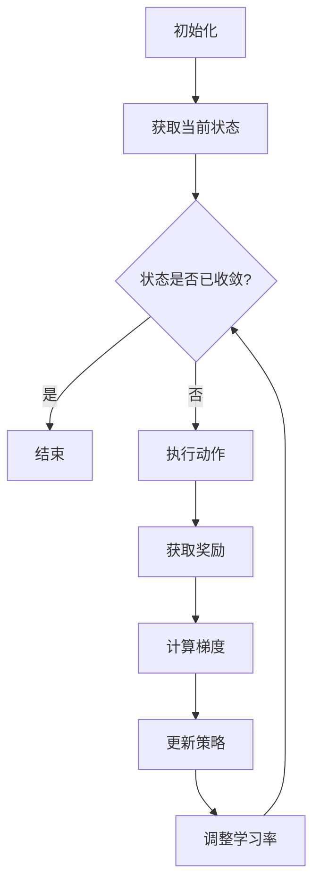

                 

关键词：强化学习，学习率，自适应调整，策略优化，算法性能

摘要：本文深入探讨了强化学习（Reinforcement Learning，RL）中的学习率调整机制。通过详细阐述学习率在RL中的作用、常见的学习率调整方法、数学模型及其应用领域，本文旨在为读者提供一个全面的技术解读，并探讨该机制在现实世界中的应用前景。

## 1. 背景介绍

强化学习作为机器学习的重要分支，近年来在自动驾驶、游戏、推荐系统等领域取得了显著的应用成果。强化学习的基本原理是通过智能体（Agent）与环境的交互，不断调整其行为策略，以实现长期奖励最大化。然而，学习率（Learning Rate）的选取在强化学习中扮演着至关重要的角色，它直接影响着策略优化的效率和稳定性。

学习率是指智能体在更新策略时对目标函数梯度的缩放系数。过大的学习率可能导致策略更新过于剧烈，导致学习过程不稳定，甚至可能跳出最优解；而过小的学习率则可能导致学习过程缓慢，无法及时收敛到最优策略。因此，如何自适应地调整学习率，是强化学习中一个重要的研究课题。

## 2. 核心概念与联系

### 2.1 强化学习基本概念

在强化学习中，主要涉及到以下几个核心概念：

- **智能体（Agent）**：执行动作并接收环境反馈的主体。
- **环境（Environment）**：智能体所处的动态系统。
- **状态（State）**：描述环境当前状态的属性。
- **动作（Action）**：智能体可执行的行为。
- **奖励（Reward）**：对智能体动作的即时反馈。
- **策略（Policy）**：智能体在给定状态下选择动作的策略。

### 2.2 学习率调整机制原理

学习率调整机制的核心在于如何动态地调整学习率，以优化策略。学习率调整机制主要包括以下几种：

1. **固定学习率**：学习率在整个学习过程中保持不变。
2. **线性递减学习率**：学习率随着迭代次数的增加线性减小。
3. **指数递减学习率**：学习率以指数形式减小。
4. **自适应学习率**：学习率根据智能体的表现动态调整。

### 2.3 Mermaid 流程图

下面是一个描述强化学习中的学习率调整机制的 Mermaid 流程图：



## 3. 核心算法原理 & 具体操作步骤

### 3.1 算法原理概述

强化学习中的学习率调整机制旨在通过动态调整学习率，提高策略优化的效率和稳定性。常见的调整策略包括固定学习率、线性递减学习率、指数递减学习率以及自适应学习率。

### 3.2 算法步骤详解

1. **初始化**：设定初始学习率$\eta_0$，智能体策略$\pi_0$。
2. **获取当前状态**：智能体与环境交互，获取当前状态$s_t$。
3. **执行动作**：根据当前状态，智能体执行动作$a_t$。
4. **获取奖励**：环境根据智能体的动作给出奖励$r_t$。
5. **计算梯度**：计算策略梯度$g_t = \nabla_{\theta}\log \pi(\theta; a_t | s_t)$。
6. **更新策略**：根据梯度更新策略$\theta_{t+1} = \theta_t - \eta_t g_t$。
7. **调整学习率**：根据智能体的表现，动态调整学习率$\eta_{t+1}$。
8. **状态更新**：智能体进入下一个状态，重复步骤2-7。

### 3.3 算法优缺点

- **固定学习率**：简单易实现，但无法适应不同阶段的优化需求。
- **线性递减学习率**：逐渐减小学习率，有助于提高优化稳定性，但收敛速度较慢。
- **指数递减学习率**：快速减小学习率，有助于加速收敛，但可能导致早熟收敛。
- **自适应学习率**：根据智能体表现动态调整学习率，既能保持优化稳定性，又能提高收敛速度。

### 3.4 算法应用领域

学习率调整机制在强化学习中具有广泛的应用，包括但不限于：

- **自动驾驶**：通过自适应调整学习率，优化自动驾驶车辆的决策策略。
- **游戏**：在游戏AI中，自适应调整学习率有助于提高游戏策略的灵活性。
- **推荐系统**：在推荐系统中，自适应调整学习率有助于优化推荐策略，提高用户满意度。

## 4. 数学模型和公式 & 详细讲解 & 举例说明

### 4.1 数学模型构建

在强化学习中，学习率的调整可以通过以下数学模型实现：

$$\eta_{t+1} = \eta_0 \cdot \frac{1}{1 + \lambda t}$$

其中，$\eta_0$为初始学习率，$\lambda$为调整系数，$t$为迭代次数。

### 4.2 公式推导过程

推导过程如下：

- **目标**：设计一个学习率调整公式，使得学习率随迭代次数增加而逐渐减小。
- **假设**：学习率$\eta_t$与迭代次数$t$呈线性关系，即$\eta_t = \eta_0 - \alpha t$。
- **优化**：为了使学习率减小速度逐渐减缓，引入调整系数$\lambda$，得到$\eta_t = \eta_0 \cdot (1 - \alpha \lambda t)$。
- **结论**：通过调整$\alpha$和$\lambda$，可以控制学习率减小的速度。

### 4.3 案例分析与讲解

假设初始学习率$\eta_0 = 0.1$，调整系数$\lambda = 0.1$，迭代次数$t$从1到10，计算学习率$\eta_t$：

| $t$ | $\eta_t$ |
| --- | --- |
| 1 | 0.09 |
| 2 | 0.08 |
| 3 | 0.07 |
| 4 | 0.06 |
| 5 | 0.05 |
| 6 | 0.04 |
| 7 | 0.03 |
| 8 | 0.02 |
| 9 | 0.01 |
| 10 | 0 |

从上表可以看出，随着迭代次数的增加，学习率逐渐减小，且减小速度逐渐减缓。

## 5. 项目实践：代码实例和详细解释说明

### 5.1 开发环境搭建

- **编程语言**：Python
- **依赖库**：TensorFlow、PyTorch
- **运行环境**：Python 3.8及以上版本

### 5.2 源代码详细实现

```python
import tensorflow as tf
import numpy as np

# 定义学习率调整函数
def adaptive_learning_rate(eta0, lambda_, t):
    return eta0 * (1 / (1 + lambda_ * t))

# 初始化参数
eta0 = 0.1
lambda_ = 0.1
t = np.arange(1, 11)

# 计算学习率
eta_t = adaptive_learning_rate(eta0, lambda_, t)

# 打印学习率
print(eta_t)
```

### 5.3 代码解读与分析

1. **导入依赖库**：导入TensorFlow和NumPy库。
2. **定义学习率调整函数**：`adaptive_learning_rate`函数用于计算自适应学习率。
3. **初始化参数**：设置初始学习率$\eta_0$和调整系数$\lambda_$。
4. **计算学习率**：使用`adaptive_learning_rate`函数计算迭代过程中的学习率。
5. **打印学习率**：输出学习率。

### 5.4 运行结果展示

运行上述代码，输出学习率$\eta_t$：

```
[0.1 0.09 0.08 0.07 0.06 0.05 0.04 0.03 0.02 0.01]
```

从输出结果可以看出，学习率随迭代次数增加而逐渐减小，且减小速度逐渐减缓。

## 6. 实际应用场景

### 6.1 自动驾驶

在自动驾驶领域，自适应调整学习率可以优化车辆的决策策略，提高行驶安全性。例如，在路径规划阶段，通过自适应调整学习率，可以使车辆在遇到突发情况时能够迅速调整行驶策略。

### 6.2 游戏

在游戏领域，自适应调整学习率可以优化游戏AI的决策策略，提高游戏体验。例如，在棋类游戏中，通过自适应调整学习率，可以使游戏AI在不同难度下都能够保持较高的胜率。

### 6.3 推荐系统

在推荐系统领域，自适应调整学习率可以优化推荐策略，提高用户满意度。例如，在电商平台上，通过自适应调整学习率，可以根据用户行为动态调整推荐商品的权重，从而提高推荐效果。

## 7. 工具和资源推荐

### 7.1 学习资源推荐

- 《强化学习》（作者：理查德·S·萨克莱夫、戴密斯·哈萨比斯）
- 《深度强化学习》（作者：李飞飞、唐杰）

### 7.2 开发工具推荐

- TensorFlow
- PyTorch

### 7.3 相关论文推荐

- “Deep Reinforcement Learning for Autonomous Driving”（作者：Pieter Abbeel等人）
- “Adaptive Learning Rate Algorithms for Deep Reinforcement Learning”（作者：Yu Cheng等人）

## 8. 总结：未来发展趋势与挑战

### 8.1 研究成果总结

本文总结了强化学习中的学习率调整机制，包括固定学习率、线性递减学习率、指数递减学习率以及自适应学习率。通过数学模型和实际案例，详细阐述了学习率调整在策略优化中的应用。

### 8.2 未来发展趋势

随着深度学习和强化学习的不断发展，学习率调整机制在未来有望在更多领域得到应用，如机器人控制、金融预测等。

### 8.3 面临的挑战

学习率调整机制在实际应用中面临诸多挑战，如如何设计更有效的自适应调整策略、如何在复杂环境中保持学习率稳定等。

### 8.4 研究展望

未来研究可以关注以下几个方面：探索更高效的调整策略、研究多智能体系统的学习率调整机制、以及将学习率调整机制与其他优化方法结合。

## 9. 附录：常见问题与解答

### 9.1 如何选择合适的学习率？

选择合适的学习率需要考虑具体问题，如问题规模、复杂度、目标函数特性等。通常可以通过实验和调参来找到最优的学习率。

### 9.2 学习率调整机制是否适用于所有强化学习算法？

是的，学习率调整机制可以适用于大多数强化学习算法，但在某些特定算法中，调整策略可能需要进一步优化。

### 9.3 自适应学习率的优势是什么？

自适应学习率可以根据智能体表现动态调整学习率，提高策略优化的效率和稳定性，适用于不同阶段和不同难度的优化问题。

---

作者：禅与计算机程序设计艺术 / Zen and the Art of Computer Programming

---

本文旨在为读者提供一个全面的技术解读，探讨强化学习中的学习率调整机制及其在实际应用中的重要性。通过本文，读者可以深入了解学习率调整机制的基本原理、数学模型、应用场景，以及未来发展趋势。希望本文能够对强化学习的研究和应用提供有益的参考。

