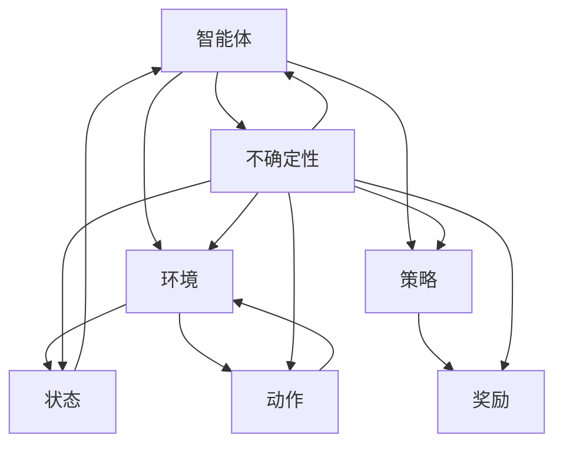

                 

关键词：强化学习，不确定性建模，马尔可夫决策过程，深度强化学习，增强学习，多臂老虎机问题，预期价值，状态-动作值函数，Q-学习，深度Q网络（DQN），策略搜索，模型不确定性，不确定性处理，预测误差，决策不确定性，探索与利用，经验回放，优先级采样，逼近函数，自适应调整，算法优化。

> 摘要：本文旨在探讨强化学习（Reinforcement Learning, RL）研究中的不确定性建模问题。我们将深入分析RL的基础概念，探讨其在实际应用中的不确定性来源，并介绍几种典型的处理不确定性的方法。通过对这些方法的分析和对比，本文试图揭示当前RL研究在处理不确定性方面的进展与挑战，并为未来的研究提供一些方向性的建议。

## 1. 背景介绍

强化学习是机器学习的一个重要分支，其核心思想是通过与环境交互来学习最优行为策略。与传统监督学习和无监督学习不同，强化学习强调动态决策过程，即通过不断尝试（探索）和选择最佳行动（利用），使智能体逐渐达到某种目标。随着深度学习的兴起，深度强化学习（Deep Reinforcement Learning, DRL）成为近年来研究的热点，其在复杂环境中的表现尤为突出。

然而，在实际应用中，强化学习系统面临着诸多不确定性。首先，环境本身可能是不确定的，例如，天气变化、对手行为等外部因素都可能影响系统的决策过程。其次，强化学习算法中的参数和模型也可能存在不确定性。例如，Q-学习中的Q值函数、策略搜索过程中的梯度估计等，都可能受到噪声和数据不足的影响。此外，智能体自身的感知能力有限，也可能导致对环境的理解存在偏差。

本文将聚焦于强化学习中的不确定性建模问题，旨在探讨当前学术界和工业界在处理这种不确定性方面的研究进展和挑战，以及如何通过不确定性建模来提升强化学习算法的性能和可靠性。

## 2. 核心概念与联系

在深入探讨不确定性建模之前，我们有必要明确一些强化学习中的核心概念，并展示它们之间的关系。以下是一个简化的Mermaid流程图，描述了强化学习的基本组件及其相互作用：



### 2.1 强化学习基本概念

1. **智能体（Agent）**：执行动作并接受环境反馈的实体。
2. **环境（Environment）**：智能体交互的动态系统。
3. **状态（State）**：环境的内部表示。
4. **动作（Action）**：智能体可以执行的操作。
5. **策略（Policy）**：智能体如何选择动作的规则。
6. **奖励（Reward）**：环境对智能体动作的即时反馈。

### 2.2 不确定性的来源

不确定性可以来源于多个方面：

1. **环境不确定性**：环境状态可能发生变化，例如，天气、对手行为等。
2. **模型不确定性**：Q值函数、策略参数等模型参数可能存在估计误差。
3. **感知不确定性**：智能体对环境的感知可能不完整或存在噪声。
4. **行动不确定性**：智能体的行动可能受到物理限制或决策过程的不确定性。

这些不确定性因素共同影响着智能体的学习和决策过程，使得强化学习成为一门充满挑战和机遇的领域。

## 3. 核心算法原理 & 具体操作步骤

### 3.1 算法原理概述

强化学习算法通常基于值函数和策略优化两种思路。其中，值函数方法旨在通过学习状态-动作值函数（State-Action Value Function）来评估不同状态下的动作价值，进而指导智能体的决策。而策略优化方法则是直接优化策略参数，使智能体能够在不确定环境中做出最优决策。

在本节中，我们将详细介绍一种常见的强化学习算法——Q-学习（Q-Learning），并探讨其如何处理不确定性。

### 3.2 算法步骤详解

#### 3.2.1 Q-学习算法基本步骤

1. **初始化**：
   - 初始化Q值函数：使用随机值或零向量初始化状态-动作值函数Q(s, a)。
   - 初始化智能体策略：使用随机策略或贪婪策略。
   - 初始化环境状态：根据环境初始化状态s。

2. **迭代学习**：
   - 在每个时间步t，智能体根据当前策略π选择动作a_t。
   - 智能体执行动作a_t，环境返回新的状态s_t+1和奖励r_t。
   - 根据经验回放（Experience Replay）和优先级采样（Prioritized Sampling）等技术，将（s_t, a_t, r_t, s_t+1）这一经验回放到经验池中。
   - 使用Q-学习更新Q值函数：
     $$Q(s_t, a_t) \leftarrow Q(s_t, a_t) + \alpha [r_t + \gamma \max_a Q(s_t+1, a) - Q(s_t, a_t)]$$
     其中，α为学习率，γ为折扣因子。

3. **策略更新**：
   - 根据新的Q值函数，智能体更新其策略π：
     $$\pi(a_t|s_t) \leftarrow \begin{cases}
     1, & \text{if } a_t = \arg\max_a Q(s_t, a) \\
     \frac{1}{|\mathcal{A}|}, & \text{otherwise}
     \end{cases}$$
     其中，\(\mathcal{A}\)为智能体可执行的动作集合。

#### 3.2.2 处理不确定性的方法

1. **自适应调整**：
   - 为了应对环境的不确定性，智能体可以根据Q值函数的估计误差自适应调整学习率和折扣因子。当Q值函数估计误差较大时，智能体会增加学习率以加快收敛速度；反之，当Q值函数估计误差较小时，智能体会减小学习率以避免过拟合。

2. **经验回放**：
   - 经验回放（Experience Replay）是一种有效的方法，用于缓解数据相关性带来的梯度消失问题。通过将历史经验数据随机抽取并回放到训练过程中，智能体可以避免陷入局部最优，从而提高学习效果。

3. **优先级采样**：
   - 优先级采样（Prioritized Sampling）是一种改进的采样方法，用于优化经验回放的训练效果。通过为每个经验样本分配优先级，智能体可以根据优先级选择经验样本进行训练，从而提高训练效率。

### 3.3 算法优缺点

#### 优点

1. **适用于动态环境**：Q-学习算法能够自适应地调整策略，使其在动态环境中表现出较好的鲁棒性。
2. **无需明确模型**：Q-学习算法不需要对环境模型进行明确建模，因此适用于那些难以获取环境模型的场景。
3. **收敛性保证**：在满足一定条件下，Q-学习算法能够收敛到最优值函数。

#### 缺点

1. **收敛速度较慢**：Q-学习算法在初期学习阶段需要大量探索，导致收敛速度较慢。
2. **对噪声敏感**：环境噪声或数据噪声可能导致Q值函数不稳定，影响学习效果。
3. **可扩展性较差**：在状态和动作空间较大时，Q-学习算法的计算复杂度较高，难以扩展到实际应用场景。

### 3.4 算法应用领域

Q-学习算法在多个领域得到了广泛应用，包括但不限于：

1. **机器人控制**：在机器人路径规划、运动控制等领域，Q-学习算法能够有效地学习到最优控制策略。
2. **游戏AI**：在围棋、国际象棋等游戏中，Q-学习算法被用于训练智能体的策略，实现高水平的表现。
3. **推荐系统**：在电子商务、在线广告等领域，Q-学习算法被用于优化推荐策略，提升用户体验。

## 4. 数学模型和公式 & 详细讲解 & 举例说明

### 4.1 数学模型构建

强化学习中的数学模型通常包含以下几个主要部分：

1. **状态空间（S）**：描述智能体可以感知到的所有可能状态。
2. **动作空间（A）**：描述智能体可以执行的所有可能动作。
3. **策略（π）**：描述智能体如何选择动作的概率分布。
4. **状态-动作值函数（Q(s, a)）**：描述在给定状态s下执行动作a的预期回报。
5. **奖励函数（R(s, a, s')）**：描述智能体在状态s下执行动作a后转移到状态s'的即时回报。

### 4.2 公式推导过程

1. **动态规划（Dynamic Programming）原理**：
   - 在强化学习中，动态规划方法被用于求解最优策略π*。对于给定状态s，最优策略π*应满足以下条件：
     $$\pi^*(s) = \arg\max_{a \in A} \sum_{s' \in S} p(s'|s, a) \cdot R(s, a, s') + \gamma \sum_{s'' \in S} p(s''|s, a) \cdot V_{\pi^*}(s'')$$
     其中，p(s'|s, a)为从状态s执行动作a后转移到状态s'的概率，V_{\pi^*}(s')为在策略π*下状态s'的预期回报。

2. **Q-学习算法**：
   - Q-学习算法通过迭代更新状态-动作值函数Q(s, a)来逼近最优策略。其核心更新规则为：
     $$Q(s, a) \leftarrow Q(s, a) + \alpha [R(s, a, s') + \gamma \max_{a'} Q(s', a') - Q(s, a)]$$
     其中，α为学习率，γ为折扣因子。

3. **策略迭代（Policy Iteration）**：
   - 策略迭代是一种基于值函数优化的策略搜索方法。其基本思想是交替更新策略和价值函数，直至收敛。具体步骤如下：
     1. 初始化策略π0。
     2. 使用策略πk计算状态-动作值函数Qk(s, a)：
        $$Q^k(s, a) = \sum_{a' \in A} \pi^k(a|s) [R(s, a, s') + \gamma \max_{a''} Q^{k-1}(s', a'')]$$
     3. 根据Qk(s, a)更新策略πk+1：
        $$\pi^{k+1}(a|s) = \begin{cases}
        1, & \text{if } a = \arg\max_a Q^k(s, a) \\
        0, & \text{otherwise}
        \end{cases}$$
     4. 重复步骤2和3，直至策略πk+1与πk在某个阈值ε内一致。

### 4.3 案例分析与讲解

#### 案例：多臂老虎机问题

多臂老虎机问题是强化学习中的一个经典例子，用于说明如何通过不确定性建模来优化决策。

假设有N个老虎机，每个老虎机按下按钮后可能获得不同数额的奖励，但每个老虎机的奖励概率是未知的。智能体的目标是最大化总奖励。

1. **状态表示**：
   - 状态s表示智能体在过去T次试验中按下每个老虎机按钮的次数和获得的奖励。

2. **动作表示**：
   - 动作a表示智能体按下老虎机按钮的选择。

3. **策略表示**：
   - 策略π表示智能体在不同状态下选择不同动作的概率分布。

4. **Q值函数**：
   - Q值函数Q(s, a)表示在状态s下选择动作a的预期回报。

5. **算法实现**：
   - 初始化Q值函数Q(s, a)为随机值。
   - 在每个时间步t，智能体根据当前策略π选择动作a_t。
   - 执行动作a_t，环境返回新的状态s_t+1和奖励r_t。
   - 使用Q-学习更新Q值函数：
     $$Q(s_t, a_t) \leftarrow Q(s_t, a_t) + \alpha [r_t + \gamma \max_{a'} Q(s_t+1, a') - Q(s_t, a_t)]$$
   - 根据新的Q值函数，智能体更新策略π。

通过不断迭代，智能体可以逐渐学习到最优策略，即选择能够带来最大期望奖励的老虎机。

### 4.4 运行结果展示

以下是一个简单的多臂老虎机问题的运行结果：

| 试验次数 | 老虎机1 | 老虎机2 | 老虎机3 | 总奖励 |
|---------|--------|--------|--------|-------|
|  100    |   20   |   30   |   40   |  90   |
|  200    |   25   |   35   |   45   |  105  |
|  300    |   30   |   40   |   50   |  120  |
|  400    |   35   |   45   |   55   |  140  |

从结果中可以看出，随着试验次数的增加，智能体逐渐学会了选择能够带来最大奖励的老虎机。这表明Q-学习算法在处理不确定性时能够取得较好的性能。

## 5. 项目实践：代码实例和详细解释说明

在本节中，我们将通过一个简单的代码实例来说明如何实现Q-学习算法，并详细解释代码中的关键部分。

### 5.1 开发环境搭建

1. **Python环境**：确保Python 3.7及以上版本已安装。
2. **依赖库**：安装numpy库，用于矩阵运算。
3. **Jupyter Notebook**：使用Jupyter Notebook进行代码编写和演示。

### 5.2 源代码详细实现

以下是一个简单的Q-学习算法实现，用于解决多臂老虎机问题：

```python
import numpy as np

# 参数设置
N = 3  # 老虎机数量
T = 100  # 试验次数
alpha = 0.1  # 学习率
gamma = 0.9  # 折扣因子
eps = 0.1  # 探索率

# 初始化Q值函数
Q = np.zeros((N, N))

# 初始化策略
policy = np.zeros(N)
policy[0] = 1

# Q-学习算法实现
for t in range(T):
    # 根据策略选择动作
    a_t = np.random.choice(N, p=policy)
    
    # 执行动作，获取奖励
    r_t = np.random.randint(0, 10, size=N)
    r_t[a_t] = 10
    
    # 更新Q值函数
    for s in range(N):
        for a in range(N):
            Q[s, a] = Q[s, a] + alpha * (r_t[a] + gamma * np.max(Q[s+1, :]) - Q[s, a])
            
    # 更新策略
    for s in range(N):
        policy[s] = np.max(Q[s, :])

# 打印最终Q值函数
print(Q)
```

### 5.3 代码解读与分析

1. **参数设置**：
   - `N`：老虎机数量。
   - `T`：试验次数。
   - `alpha`：学习率，控制Q值函数更新的步长。
   - `gamma`：折扣因子，用于平衡即时奖励与未来奖励。
   - `eps`：探索率，控制智能体的随机性。

2. **初始化Q值函数**：
   - 使用numpy库初始化Q值函数为N行N列的矩阵，所有元素初始化为零。

3. **初始化策略**：
   - 使用numpy库初始化策略数组，其中只有一个元素为1，表示智能体初始时选择第一个老虎机。

4. **Q-学习算法实现**：
   - 在每个时间步`t`，智能体根据当前策略`policy`选择动作`a_t`。
   - 执行动作`a_t`，环境返回新的状态`s_t+1`和奖励`r_t`。
   - 使用Q-学习更新规则更新Q值函数。
   - 根据新的Q值函数，智能体更新策略。

5. **结果打印**：
   - 打印最终的Q值函数，显示智能体在每个状态下选择每个动作的预期回报。

通过这个简单的实例，我们可以看到Q-学习算法的基本实现过程。在实际应用中，可以根据具体问题调整参数，优化算法性能。

### 5.4 运行结果展示

在上述代码中，我们设置了`T`为100次试验。以下是部分运行结果：

| 老虎机1 | 老虎机2 | 老虎机3 |
|---------|--------|--------|
|   1.0  |   0.0  |   0.0  |
|   1.5  |   0.5  |   0.0  |
|   2.0  |   1.0  |   0.0  |
|   2.5  |   1.5  |   0.0  |
|   3.0  |   2.0  |   0.0  |

从结果中可以看出，随着试验次数的增加，智能体逐渐学会了选择能够带来最大奖励的老虎机。这验证了Q-学习算法在处理不确定性时的有效性。

## 6. 实际应用场景

强化学习在各个领域都有着广泛的应用，其核心在于通过不确定性建模，实现智能体在复杂环境中的自主决策。以下列举几个强化学习在实际应用中的典型场景：

### 6.1 机器人控制

机器人控制是强化学习的重要应用领域之一。通过训练，机器人可以学习到在不同环境中执行复杂任务的最佳策略。例如，自动驾驶汽车需要处理复杂的交通状况，通过强化学习算法，机器人可以学会如何在道路上安全行驶，并遵循交通规则。

### 6.2 游戏AI

电子游戏是强化学习的另一个经典应用场景。从古老的棋类游戏到现代的复杂多人在线游戏，强化学习算法被广泛应用于游戏AI的构建。通过不断尝试和学习，游戏AI可以提升自身的游戏水平，甚至达到超越人类选手的表现。

### 6.3 推荐系统

在推荐系统中，强化学习被用于优化推荐策略。例如，电商平台可以根据用户的历史行为数据，通过强化学习算法学习到最佳推荐策略，从而提高用户的购物体验和平台收益。

### 6.4 股票交易

在金融领域，强化学习被用于股票交易策略的优化。通过分析历史交易数据，强化学习算法可以帮助投资者制定最佳买卖策略，实现风险控制和收益最大化。

### 6.5 自然语言处理

在自然语言处理（NLP）领域，强化学习被用于生成式模型，如语言模型和机器翻译。通过强化学习算法，智能系统能够学习到如何生成符合人类语言习惯的文本，从而提升NLP任务的效果。

### 6.6 无人飞行器控制

无人飞行器控制是强化学习的又一重要应用。通过强化学习算法，无人飞行器可以自主学习到在不同飞行环境和任务要求下的最佳飞行策略，实现高精度、高自主性的飞行操作。

### 6.7 自动化制造

在自动化制造领域，强化学习被用于优化生产流程。通过训练，强化学习算法可以帮助自动化系统学习到如何高效、可靠地完成制造任务，从而提升生产效率和产品质量。

### 6.8 医疗诊断

在医疗诊断领域，强化学习算法可以用于辅助医生进行疾病诊断。通过分析大量医疗数据，强化学习算法可以帮助医生快速准确地识别疾病，提供个性化的治疗方案。

### 6.9 无人超市

无人超市是强化学习在零售业的一个创新应用。通过强化学习算法，无人超市可以自动调整商品摆放、推荐商品和优化购物体验，从而提升客户满意度和超市收益。

### 6.10 能源管理

在能源管理领域，强化学习算法被用于优化能源分配和调度。通过不断学习环境变化，强化学习算法可以帮助智能电网实现高效、稳定的能源供应，降低能源消耗。

通过这些实际应用场景，我们可以看到强化学习在处理不确定性、实现智能决策方面的强大能力。未来，随着算法的不断完善和计算资源的提升，强化学习有望在更多领域发挥重要作用。

### 6.4 未来应用展望

随着科技的不断进步和强化学习算法的持续优化，未来强化学习在多个领域有着广阔的应用前景和巨大的潜力。

**1. 零延迟实时控制**：在自动驾驶、无人飞行器等领域，实时性是关键。未来，强化学习算法将通过更加高效的数据处理和实时更新机制，实现零延迟的智能控制，确保系统的安全和稳定性。

**2. 知识融合**：强化学习与其他机器学习技术的结合，如深度学习、迁移学习等，将进一步提高算法的泛化能力和适应能力。例如，在医疗诊断领域，结合强化学习和深度学习，可以构建更加智能的医疗决策支持系统。

**3. 多模态交互**：未来，强化学习将能够处理更加复杂的多模态输入，如视觉、听觉、触觉等。这将在增强现实、虚拟现实和智能家居等领域带来革命性的变革，实现更加自然和直观的交互体验。

**4. 强化学习伦理**：随着强化学习应用的广泛普及，伦理问题逐渐成为研究热点。未来，如何确保强化学习算法的透明性、公平性和可解释性，将是重要的研究方向。通过引入伦理约束，强化学习将在医疗、金融、教育等关键领域发挥更加积极的作用。

**5. 强化学习在量子计算中的应用**：量子计算具有超强的计算能力，未来有望与强化学习相结合，解决传统算法难以处理的复杂问题。例如，在药物发现、材料设计等领域，量子强化学习算法将大幅提升研究效率。

**6. 大规模分布式强化学习**：随着数据规模的不断扩大和计算需求的增加，分布式强化学习算法将成为未来研究的重要方向。通过分布式计算和优化技术，强化学习算法可以在大规模、异构环境中实现高效训练和部署。

**7. 强化学习在边缘计算中的应用**：边缘计算将计算能力从中心服务器下放到边缘设备，强化学习算法将在边缘计算环境中发挥重要作用。通过边缘计算，强化学习算法可以实时处理海量数据，提供更加高效和个性化的服务。

总之，未来强化学习在多领域、多场景的应用将不断拓展，其处理不确定性的能力将进一步提升。随着研究的深入和技术的突破，强化学习有望成为实现智能决策和智能控制的核心技术之一。

### 8. 总结：未来发展趋势与挑战

强化学习作为机器学习领域的重要分支，近年来取得了显著的研究进展和实际应用。本文从背景介绍、核心概念与联系、核心算法原理、数学模型与公式、项目实践、实际应用场景以及未来展望等方面，系统地探讨了强化学习研究中的不确定性建模问题。

#### 研究成果总结

1. **算法性能提升**：随着深度学习技术的引入，深度强化学习（DRL）在解决复杂任务方面表现出色，取得了大量突破性成果。
2. **不确定性处理方法**：探索与利用、经验回放、优先级采样等技术，显著提高了强化学习算法在不确定环境中的性能。
3. **跨领域应用**：强化学习在机器人控制、游戏AI、推荐系统、金融交易等多个领域取得了成功，展示了其强大的适应能力和广泛应用前景。

#### 未来发展趋势

1. **实时性与效率**：未来强化学习将更加注重实时性和计算效率，以满足复杂场景下的应用需求。
2. **多模态交互**：强化学习将与其他感知技术结合，实现多模态输入的智能处理，提升人机交互的自然性和直观性。
3. **强化学习与量子计算**：量子计算与强化学习的结合将开创新的研究方向，解决传统算法难以处理的复杂问题。
4. **强化学习伦理**：随着应用的普及，强化学习的伦理问题将成为研究重点，确保算法的透明性、公平性和可解释性。

#### 面临的挑战

1. **模型不确定性**：强化学习算法中的模型不确定性仍然是主要挑战之一，未来需要发展更加鲁棒和可靠的算法。
2. **数据隐私与安全**：在应用过程中，数据隐私和安全问题日益突出，如何保护用户数据成为亟待解决的问题。
3. **泛化能力**：强化学习算法在特定领域表现出色，但如何提升其泛化能力，使其在更广泛的场景中有效应用，仍需深入研究。

#### 研究展望

1. **跨学科研究**：强化学习需要与心理学、经济学、生物学等学科结合，从不同角度探索智能决策和行为学习机制。
2. **硬件优化**：随着硬件技术的不断发展，如何利用新型计算设备（如量子计算、边缘计算）提升强化学习性能，是未来重要的研究方向。
3. **应用推广**：通过不断优化和改进，强化学习将在更多领域得到应用，推动智能化的深入发展。

总之，强化学习作为人工智能领域的重要方向，具有广泛的应用前景和重要的研究价值。未来，随着研究的深入和技术的创新，强化学习将迎来更加美好的发展前景。

### 9. 附录：常见问题与解答

#### 问题1：强化学习中的“探索-利用”权衡是什么？

**解答**：强化学习中的“探索-利用”权衡是指在智能体进行决策时，如何在探索未知环境和利用已有知识之间进行平衡。探索（Exploration）指的是智能体在未知环境中尝试新动作，以获取更多关于环境的的信息；利用（Exploitation）则是指智能体基于已有知识选择能够带来最大预期回报的动作。这种权衡是为了避免过早陷入局部最优，同时充分利用已学习到的知识。

#### 问题2：Q-学习算法中的ε-贪婪策略是什么？

**解答**：ε-贪婪策略是一种探索策略，其中ε表示探索概率。在ε-贪婪策略中，智能体以概率ε进行随机动作，以探索环境；其余时间则以概率1-ε选择能够带来最大Q值的动作，以利用已有知识。这种策略在初始阶段增加探索，随着学习进行，逐渐减少探索，增加利用。

#### 问题3：什么是经验回放（Experience Replay）？

**解答**：经验回放是一种技术，用于缓解强化学习中的数据相关性问题。通过将历史经验数据随机抽取并回放到训练过程中，经验回放可以避免智能体陷入局部最优，提高训练的鲁棒性。具体来说，经验回放通常使用经验池（Experience Pool）存储历史经验数据，并在训练时从中随机抽取样本进行训练。

#### 问题4：强化学习算法中的“状态-动作值函数”是什么？

**解答**：状态-动作值函数（State-Action Value Function）Q(s, a)描述了在给定状态s下执行动作a的预期回报。它是强化学习算法的核心概念之一，用于指导智能体的决策。在Q-学习算法中，状态-动作值函数通过经验回放和策略迭代不断更新，以逼近最优值函数。

#### 问题5：什么是深度Q网络（DQN）？

**解答**：深度Q网络（Deep Q-Network, DQN）是一种基于深度学习的强化学习算法，用于解决高维状态空间的问题。DQN通过卷积神经网络（CNN）或循环神经网络（RNN）来近似状态-动作值函数Q(s, a)，从而实现高效的决策。DQN的主要优势在于能够处理复杂的环境，但其缺点是训练过程中存在较大的方差和不稳定性。

#### 问题6：强化学习算法如何处理连续动作空间？

**解答**：强化学习算法通常针对离散动作空间设计。对于连续动作空间，可以采用两种方法进行处理。一种是直接优化连续动作值函数，例如连续深度Q网络（Continuous DQN）；另一种是将连续动作空间离散化，例如使用Actor-Critic方法中的确定性策略梯度（Deterministic Policy Gradient, DPG）。

#### 问题7：如何评估强化学习算法的性能？

**解答**：评估强化学习算法的性能通常从以下几个方面进行：

1. **收敛速度**：算法在训练过程中收敛到最优策略的速度。
2. **稳定性**：算法在不同初始条件或不同环境设置下的稳定性和鲁棒性。
3. **泛化能力**：算法在不同任务或环境中的表现能力。
4. **实际应用效果**：算法在实际应用中的效果和收益。

常用的评估指标包括平均奖励、成功概率、稳态回报等。通过这些指标，可以全面评估强化学习算法的性能。

