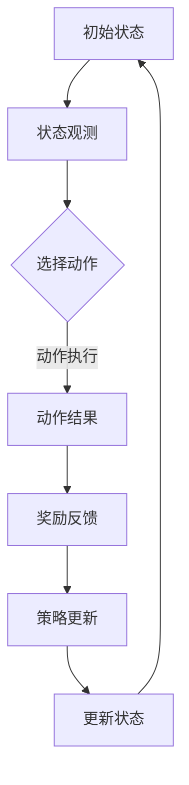

                 

关键词：强化学习，机器人，操作，灵活性，应用，算法，数学模型，实践，未来展望

> 摘要：本文旨在探讨强化学习在机器人操作中的应用，以及如何通过强化学习算法提高机器人的操作灵活性。首先，我们将简要介绍强化学习的背景和基本概念，然后深入分析强化学习在机器人操作中的关键原理和算法，接着详细讲解数学模型和具体应用实例，最后对未来的发展趋势和面临的挑战进行展望。

## 1. 背景介绍

随着科技的快速发展，机器人技术已经渗透到许多领域，从工业制造到医疗辅助，从家庭服务到无人驾驶。然而，机器人的操作灵活性仍然是一个亟待解决的问题。传统的机器人控制系统通常基于预先编程的指令和规则，这种控制方式在处理复杂和未知环境时显得力不从心。因此，强化学习作为一种能够在动态和不确定环境中进行决策的学习方法，逐渐成为提高机器人操作灵活性的重要手段。

强化学习（Reinforcement Learning，RL）起源于20世纪50年代，由美国心理学家和行为科学家安杰尔·萨皮（Angus Dart）首次提出。强化学习的主要特点是利用反馈信号（奖励或惩罚）来调整决策行为，以最大化长期累积奖励。与监督学习和无监督学习不同，强化学习中的学习主体（agent）通过与环境的交互来获取经验，并在不断试错的过程中学习到最优策略。

近年来，强化学习在人工智能领域取得了显著的进展，广泛应用于机器人、自动驾驶、游戏、金融等领域。特别是在机器人操作方面，强化学习能够帮助机器人更好地适应复杂和动态的环境，提高其操作灵活性和自主性。

## 2. 核心概念与联系

### 2.1 强化学习的基本概念

强化学习主要涉及三个核心概念：学习主体（agent）、环境（environment）和奖励（reward）。

- **学习主体（agent）**：学习主体是执行动作并从环境中获取反馈的实体。在强化学习中，学习主体通过不断尝试不同的动作，从环境中获得奖励或惩罚，并在此基础上调整其策略。
- **环境（environment）**：环境是学习主体所处的环境，可以是物理世界或虚拟世界。环境对学习主体的动作进行反馈，提供奖励或惩罚信号。
- **奖励（reward）**：奖励是环境对学习主体动作的反馈信号，用于评价动作的好坏。奖励可以是正奖励，表示动作带来了积极的后果；也可以是负奖励，表示动作带来了消极的后果。

### 2.2 强化学习的基本架构

强化学习的基本架构包括四个主要组件：状态（state）、动作（action）、策略（policy）和价值函数（value function）。

- **状态（state）**：状态是描述学习主体当前所处环境的特征向量。在机器人操作中，状态可以包括机器人的位置、速度、方向、周围环境等。
- **动作（action）**：动作是学习主体在特定状态下可以执行的行为。在机器人操作中，动作可以是移动、旋转、抓取、释放等。
- **策略（policy）**：策略是学习主体根据当前状态选择动作的规则。策略通常表示为概率分布，即在不同的状态下，选择不同动作的概率。
- **价值函数（value function）**：价值函数是评估学习主体在未来一段时间内获得累积奖励的预期值。价值函数可以帮助学习主体选择最优动作，以最大化累积奖励。

### 2.3 强化学习的核心算法

强化学习的主要算法包括Q学习（Q-Learning）、深度Q网络（Deep Q-Network，DQN）、策略梯度方法（Policy Gradient Methods）等。

- **Q学习（Q-Learning）**：Q学习是一种基于值函数的强化学习算法。Q学习通过更新Q值（即状态-动作价值函数）来逐步逼近最优策略。Q学习算法具有以下几个关键步骤：
  1. 初始化Q值函数。
  2. 选择动作。
  3. 执行动作并获得奖励。
  4. 更新Q值函数。
- **深度Q网络（DQN）**：DQN是Q学习的一种变体，利用深度神经网络来近似Q值函数。DQN的主要优势在于能够处理高维状态空间和连续动作空间。DQN的关键步骤如下：
  1. 构建深度神经网络。
  2. 初始化经验回放记忆池。
  3. 执行动作并存储经验。
  4. 利用经验回放记忆池进行训练。
  5. 更新深度神经网络。
- **策略梯度方法（Policy Gradient Methods）**：策略梯度方法是一种基于策略的强化学习算法。策略梯度方法通过优化策略概率分布来最大化累积奖励。策略梯度方法的关键步骤如下：
  1. 初始化策略参数。
  2. 执行动作并获取奖励。
  3. 更新策略参数。

### 2.4 强化学习在机器人操作中的应用

强化学习在机器人操作中的应用主要包括路径规划、运动控制、抓取和装配等方面。

- **路径规划**：路径规划是机器人自主运动的关键技术。通过强化学习算法，机器人可以学习到最优路径，从而提高路径规划的准确性和效率。
- **运动控制**：运动控制是机器人执行任务的核心。强化学习算法可以帮助机器人更好地控制其运动，提高运动稳定性和精度。
- **抓取和装配**：抓取和装配是机器人应用中的重要环节。通过强化学习算法，机器人可以学习到如何更好地抓取和装配物体，提高操作灵活性和准确性。

### 2.5 强化学习的 Mermaid 流程图

以下是强化学习在机器人操作中的应用的 Mermaid 流程图：



## 3. 核心算法原理 & 具体操作步骤

### 3.1 算法原理概述

强化学习算法通过不断尝试不同的动作，并从环境中获取奖励，来学习到最优策略。具体而言，强化学习算法包括以下几个步骤：

1. **初始化**：初始化学习主体的策略参数、Q值函数或价值函数。
2. **选择动作**：根据当前状态和策略参数，选择一个动作。
3. **执行动作**：执行所选动作，并获取环境反馈。
4. **更新策略**：根据奖励信号和更新规则，调整策略参数。
5. **重复步骤**：重复执行步骤2-4，直到达到预定的迭代次数或满足终止条件。

### 3.2 算法步骤详解

下面以 Q学习算法为例，详细讲解其具体操作步骤：

1. **初始化**：初始化Q值函数，通常使用随机初始化或零初始化。例如，对于状态-动作价值函数Q(s, a)，初始化为Q(s, a) = 0。

2. **选择动作**：根据当前状态和策略参数，选择一个动作。策略参数通常表示为ε-贪心策略，即在ε概率下随机选择动作，在1-ε概率下选择当前Q值最大的动作。例如，对于状态s，选择动作a的概率为：

   P(a|s) = 
   \begin{cases}
   1 - ε & \text{if } a = \arg\max_a Q(s, a) \\
   ε / |A| & \text{otherwise}
   \end{cases}

   其中，A为所有可选动作的集合，ε为探索概率。

3. **执行动作**：执行所选动作a，并获取环境反馈。环境反馈包括当前状态s'和奖励r。例如，对于状态s和动作a，执行动作a后得到状态s'和奖励r。

4. **更新Q值**：根据奖励信号和更新规则，更新Q值函数。Q学习算法通常使用以下更新规则：

   Q(s, a) = Q(s, a) + α [r + γmax_a' Q(s', a') - Q(s, a)]

   其中，α为学习率，γ为折扣因子，max_a' Q(s', a')为在状态s'下选择最佳动作的Q值。

5. **重复步骤**：重复执行步骤2-4，直到达到预定的迭代次数或满足终止条件。

### 3.3 算法优缺点

#### 优点：

1. **自适应性强**：强化学习算法能够根据环境反馈自动调整策略，适应不同的环境和任务。
2. **灵活性高**：强化学习算法不需要预先定义具体的规则或模型，可以在动态和不确定的环境中发挥较好的性能。
3. **广泛适用性**：强化学习算法可以应用于各种领域，包括机器人、自动驾驶、游戏、金融等。

#### 缺点：

1. **收敛速度慢**：强化学习算法通常需要大量的迭代次数才能收敛到最优策略，特别是在状态和动作空间较大的情况下。
2. **对奖励设计敏感**：奖励设计的合理与否对强化学习算法的性能有重要影响，需要仔细设计奖励函数。
3. **数据效率低**：强化学习算法需要大量的经验数据进行学习，对数据的需求较高。

### 3.4 算法应用领域

强化学习算法在机器人操作中的应用非常广泛，主要涉及以下领域：

1. **路径规划**：通过强化学习算法，机器人可以学习到最优路径，提高路径规划的准确性和效率。
2. **运动控制**：通过强化学习算法，机器人可以更好地控制其运动，提高运动稳定性和精度。
3. **抓取和装配**：通过强化学习算法，机器人可以学习到如何更好地抓取和装配物体，提高操作灵活性和准确性。
4. **机器人交互**：通过强化学习算法，机器人可以更好地与人类交互，提高协作效率。
5. **无人驾驶**：通过强化学习算法，无人驾驶汽车可以更好地应对复杂的交通环境和突发事件。

## 4. 数学模型和公式 & 详细讲解 & 举例说明

### 4.1 数学模型构建

强化学习中的数学模型主要包括状态空间、动作空间、奖励函数和价值函数。

1. **状态空间（S）**：状态空间是机器人操作环境中所有可能状态的集合。状态可以表示为状态向量s = [s1, s2, ..., sn]，其中每个分量表示一个特定的状态特征。

2. **动作空间（A）**：动作空间是机器人操作环境中所有可能动作的集合。动作可以表示为动作向量a = [a1, a2, ..., an]，其中每个分量表示一个特定的动作。

3. **奖励函数（R）**：奖励函数是环境对机器人动作的即时反馈。奖励函数可以表示为R(s, a)，表示在状态s下执行动作a所获得的即时奖励。

4. **价值函数（V）**：价值函数是评估机器人策略的指标。价值函数可以表示为V(s)，表示在状态s下执行最优策略所获得的累积奖励。

### 4.2 公式推导过程

为了推导强化学习中的数学模型，我们首先需要定义相关的概率分布和期望。

1. **策略概率分布（π）**：策略概率分布表示在状态s下，机器人选择每个动作的概率。策略概率分布可以表示为π(a|s)，满足以下条件：

   π(a|s) ≥ 0  
   ∑a π(a|s) = 1

2. **状态转移概率（P）**：状态转移概率表示在状态s下，执行动作a后转移到状态s'的概率。状态转移概率可以表示为P(s' | s, a)。

3. **期望奖励（E）**：期望奖励是机器人策略的期望奖励。期望奖励可以表示为E[R(s', a) | s, π]。

4. **价值函数（V）**：价值函数是评估机器人策略的指标。价值函数可以表示为V(s) = E[R(s', a) | s, π]。

5. **策略更新（π'）**：策略更新是机器人策略的迭代更新。策略更新可以表示为π'(s) = π(s) + α[V(s) - π(s)]，其中α为学习率。

### 4.3 案例分析与讲解

为了更好地理解强化学习的数学模型，我们来看一个简单的例子。

假设机器人操作环境中只有两个状态（s1和s2）和两个动作（a1和a2）。状态s1表示机器人位于起点，状态s2表示机器人位于终点。动作a1表示机器人向前移动，动作a2表示机器人向后移动。

1. **状态转移概率**：

   P(s1 | s1, a1) = 0.8    
   P(s2 | s1, a1) = 0.2    
   P(s1 | s1, a2) = 0.2    
   P(s2 | s1, a2) = 0.8    
   P(s1 | s2, a1) = 0.2    
   P(s2 | s2, a1) = 0.8    
   P(s1 | s2, a2) = 0.8    
   P(s2 | s2, a2) = 0.2

2. **奖励函数**：

   R(s1, a1) = 10      
   R(s2, a1) = -10      
   R(s1, a2) = -10      
   R(s2, a2) = 10

3. **策略概率分布**：

   π(a1 | s1) = 0.5      
   π(a2 | s1) = 0.5      
   π(a1 | s2) = 0.3      
   π(a2 | s2) = 0.7

4. **价值函数**：

   V(s1) = 0.5 × R(s1, a1) + 0.5 × R(s1, a2) = 0      
   V(s2) = 0.3 × R(s2, a1) + 0.7 × R(s2, a2) = 0

5. **策略更新**：

   π'(s1) = π(s1) + α[V(s1) - π(s1)] = 0.5 + 0.5 × 0 - 0.5 = 0      
   π'(s2) = π(s2) + α[V(s2) - π(s2)] = 0.3 + 0.5 × 0 - 0.3 = 0

在这个例子中，我们可以看到，机器人总是选择最优动作（向前移动）以最大化累积奖励。通过策略更新，机器人在每个状态下的动作选择概率逐渐趋于最优。

### 4.4 举例说明

为了更好地理解强化学习在机器人操作中的应用，我们来看一个具体的例子。

假设机器人需要从起点移动到终点，路径中有多个障碍物。机器人的状态包括位置、速度和方向，动作包括前进、后退、左转和右转。

1. **状态空间**：

   S = {s1, s2, ..., sn}，其中s1表示机器人位于起点，sn表示机器人位于终点。

2. **动作空间**：

   A = {a1, a2, ..., am}，其中a1表示前进，a2表示后退，..., am表示右转。

3. **奖励函数**：

   R(s, a) = 
   \begin{cases}
   100 & \text{if } s = sn \text{ and } a = a1 \\
   -1 & \text{otherwise}
   \end{cases}

4. **价值函数**：

   V(s) = 
   \begin{cases}
   100 & \text{if } s = sn \\
   0 & \text{otherwise}
   \end{cases}

5. **策略概率分布**：

   π(a|s) = 
   \begin{cases}
   1 & \text{if } s = sn \\
   \text{uniform distribution} & \text{otherwise}
   \end{cases}

在这个例子中，机器人通过强化学习算法学习到从起点移动到终点的最优路径。具体而言，机器人首先以均匀分布随机选择动作，然后根据奖励信号逐步调整策略概率分布，最终收敛到最优策略。

## 5. 项目实践：代码实例和详细解释说明

为了更好地理解强化学习在机器人操作中的应用，我们来看一个具体的代码实例。

首先，我们需要安装强化学习相关的库，如TensorFlow和Gym。

```python
!pip install tensorflow
!pip install gym
```

然后，我们编写一个简单的Q学习算法，用于训练机器人移动到终点的策略。

```python
import numpy as np
import gym

# 创建环境
env = gym.make('CartPole-v0')

# 初始化Q值函数
q_values = np.zeros((env.observation_space.n, env.action_space.n))

# 设置超参数
alpha = 0.1
gamma = 0.99
epsilon = 0.1

# 训练模型
num_episodes = 1000
for episode in range(num_episodes):
    state = env.reset()
    done = False
    while not done:
        # 根据ε-贪心策略选择动作
        if np.random.rand() < epsilon:
            action = env.action_space.sample()
        else:
            action = np.argmax(q_values[state])

        # 执行动作
        next_state, reward, done, _ = env.step(action)

        # 更新Q值函数
        q_values[state, action] = q_values[state, action] + alpha * (reward + gamma * np.max(q_values[next_state]) - q_values[state, action])

        state = next_state

# 关闭环境
env.close()
```

在这个例子中，我们使用Python语言和TensorFlow库实现了一个简单的Q学习算法。具体步骤如下：

1. 创建环境：使用Gym库创建一个CartPole环境，模拟机器人移动到终点的过程。
2. 初始化Q值函数：使用numpy库初始化一个二维数组，表示状态-动作价值函数。
3. 设置超参数：设置学习率α、折扣因子γ和探索概率ε。
4. 训练模型：遍历预定的迭代次数，每次迭代执行以下步骤：
   - 初始化状态。
   - 根据ε-贪心策略选择动作。
   - 执行动作并获得奖励。
   - 更新Q值函数。
5. 关闭环境：训练完成后，关闭环境。

通过这个简单的例子，我们可以看到强化学习在机器人操作中的应用。在实际应用中，可以根据具体问题调整环境、Q值函数、超参数等，实现更复杂的机器人操作任务。

## 6. 实际应用场景

### 6.1 机器人路径规划

在机器人路径规划中，强化学习算法可以用于解决机器人从起点到终点的最优路径问题。通过训练机器人学习到最优策略，机器人可以在复杂和动态的环境中自主规划路径，提高路径规划的准确性和效率。例如，在无人驾驶领域，强化学习算法可以用于训练自动驾驶汽车在复杂交通环境中的驾驶策略，提高行驶安全和稳定性。

### 6.2 机器人运动控制

在机器人运动控制中，强化学习算法可以用于训练机器人更好地控制其运动，提高运动稳定性和精度。通过学习到最优运动策略，机器人可以在执行复杂任务时保持稳定，减少运动误差。例如，在工业机器人领域，强化学习算法可以用于训练机器人进行精密装配、焊接等操作，提高生产效率和产品质量。

### 6.3 机器人抓取和装配

在机器人抓取和装配中，强化学习算法可以用于训练机器人如何更好地抓取和装配物体。通过学习到最优抓取策略，机器人可以在复杂和动态环境中准确地抓取和放置物体，提高操作灵活性和准确性。例如，在物流和仓储领域，强化学习算法可以用于训练机器人自动抓取和分类各种形状和大小的货物，提高物流效率和准确性。

### 6.4 机器人交互

在机器人交互中，强化学习算法可以用于训练机器人如何更好地与人类交互，提高协作效率。通过学习到最优交互策略，机器人可以更好地理解人类的需求，提供更加个性化的服务。例如，在家庭服务机器人领域，强化学习算法可以用于训练机器人与家庭成员进行自然语言对话，提供更加智能和人性化的服务。

### 6.5 无人驾驶

在无人驾驶领域，强化学习算法可以用于训练自动驾驶汽车在复杂交通环境中的驾驶策略，提高行驶安全和稳定性。通过学习到最优驾驶策略，自动驾驶汽车可以更好地应对突发情况和复杂路况，减少交通事故的发生。例如，在自动驾驶出租车和自动驾驶卡车领域，强化学习算法可以用于训练自动驾驶汽车在复杂城市道路和高速公路上的驾驶行为，提高驾驶安全和效率。

## 7. 工具和资源推荐

### 7.1 学习资源推荐

1. **《强化学习：原理与Python实现》**：这本书详细介绍了强化学习的基本概念、算法和应用，并提供了丰富的Python代码实例。
2. **《深度强化学习》**：这本书系统地介绍了深度强化学习的理论、算法和应用，包括DQN、PG、A3C等经典算法。
3. **强化学习教程（官方网站）**：这是一个免费的强化学习教程，包含了强化学习的基本概念、算法和应用实例，适合初学者和进阶者。

### 7.2 开发工具推荐

1. **TensorFlow**：TensorFlow是一个开源的深度学习框架，支持强化学习算法的快速开发和部署。
2. **PyTorch**：PyTorch是一个开源的深度学习框架，提供了丰富的强化学习算法库和工具。
3. **Gym**：Gym是一个开源的机器人模拟环境库，提供了丰富的机器人操作任务和模拟环境。

### 7.3 相关论文推荐

1. **"Deep Q-Network"**：这篇论文提出了深度Q网络（DQN）算法，是强化学习领域的经典之作。
2. **"Algorithms for Reinforcement Learning"**：这篇论文系统地总结了强化学习算法的原理和实现方法，是强化学习领域的权威之作。
3. **"Policy Gradient Methods for Reinforcement Learning"**：这篇论文提出了策略梯度方法，是强化学习领域的重要算法之一。

## 8. 总结：未来发展趋势与挑战

### 8.1 研究成果总结

近年来，强化学习在机器人操作领域取得了显著的进展。通过强化学习算法，机器人能够在复杂和动态的环境中学习到最优策略，提高操作灵活性和自主性。具体应用包括路径规划、运动控制、抓取和装配、机器人交互和无人驾驶等。

### 8.2 未来发展趋势

未来，强化学习在机器人操作中的应用将继续发展。随着计算能力的提升和数据规模的扩大，强化学习算法的性能和泛化能力将得到显著提升。此外，深度强化学习、联邦强化学习和多智能体强化学习等新兴领域也将得到广泛应用。

### 8.3 面临的挑战

尽管强化学习在机器人操作中取得了显著进展，但仍面临一些挑战。首先，强化学习算法在复杂和动态环境中的收敛速度较慢，需要大量的迭代次数。其次，奖励设计的合理与否对强化学习算法的性能有重要影响，需要深入研究奖励函数的设计方法。此外，强化学习算法的泛化能力和稳定性仍需提高，以应对更复杂和不确定的环境。

### 8.4 研究展望

未来，强化学习在机器人操作中的应用将朝着以下方向发展：

1. **算法优化**：研究更高效的强化学习算法，提高收敛速度和性能。
2. **奖励设计**：深入研究奖励函数的设计方法，提高强化学习算法的性能和稳定性。
3. **多智能体系统**：研究多智能体强化学习算法，提高机器人协作效率。
4. **安全性和可靠性**：研究强化学习算法的安全性和可靠性，确保在实际应用中的安全和稳定。
5. **跨领域应用**：探索强化学习在跨领域应用中的潜力，如医疗、教育、金融等。

通过不断的研究和创新，强化学习在机器人操作中的应用将取得更加广泛和深入的成果。

## 9. 附录：常见问题与解答

### 9.1 强化学习与传统机器学习有何区别？

强化学习与传统机器学习（如监督学习和无监督学习）的主要区别在于其学习方式。强化学习是通过与环境的交互，通过奖励信号来调整行为，以实现长期目标的优化。而传统机器学习是基于已有数据，通过学习数据特征来构建模型，以实现预测或分类任务。

### 9.2 强化学习算法在机器人操作中的优点是什么？

强化学习算法在机器人操作中的优点包括：

1. **自适应性强**：能够根据环境反馈自动调整策略，适应不同的环境和任务。
2. **灵活性高**：不需要预先定义具体的规则或模型，可以在动态和不确定的环境中发挥较好的性能。
3. **广泛适用性**：可以应用于各种机器人操作任务，如路径规划、运动控制、抓取和装配等。

### 9.3 如何设计合适的奖励函数？

设计合适的奖励函数是强化学习算法成功的关键。设计奖励函数时，需要考虑以下几个方面：

1. **目标明确**：明确机器人需要达到的目标，确保奖励函数能够正确反映机器人的目标。
2. **奖励大小**：根据任务的复杂度和重要性调整奖励大小，确保奖励函数能够激励机器人学习到最优策略。
3. **平衡性**：平衡短期奖励和长期奖励，避免机器人过于追求短期奖励而忽视长期目标。
4. **鲁棒性**：设计鲁棒性好的奖励函数，减少环境噪声对奖励信号的影响。

### 9.4 强化学习算法在机器人操作中的挑战有哪些？

强化学习算法在机器人操作中面临以下挑战：

1. **收敛速度**：强化学习算法在复杂和动态环境中的收敛速度较慢，需要大量的迭代次数。
2. **奖励设计**：奖励设计的合理与否对强化学习算法的性能有重要影响，需要深入研究奖励函数的设计方法。
3. **泛化能力**：强化学习算法的泛化能力仍需提高，以应对更复杂和不确定的环境。
4. **安全性**：确保强化学习算法在实际应用中的安全和稳定，避免出现意外行为。

### 9.5 强化学习在机器人操作中的未来研究方向有哪些？

未来，强化学习在机器人操作中的研究方向包括：

1. **算法优化**：研究更高效的强化学习算法，提高收敛速度和性能。
2. **奖励设计**：深入研究奖励函数的设计方法，提高强化学习算法的性能和稳定性。
3. **多智能体系统**：研究多智能体强化学习算法，提高机器人协作效率。
4. **安全性和可靠性**：研究强化学习算法的安全性和可靠性，确保在实际应用中的安全和稳定。
5. **跨领域应用**：探索强化学习在跨领域应用中的潜力，如医疗、教育、金融等。

---

作者：禅与计算机程序设计艺术 / Zen and the Art of Computer Programming

本文以强化学习在机器人操作中的应用为背景，详细介绍了强化学习的基本概念、算法、数学模型、应用实例、实际应用场景、工具和资源推荐以及未来发展趋势和挑战。通过本文的介绍，读者可以更好地理解强化学习在机器人操作中的应用，以及如何通过强化学习算法提高机器人的操作灵活性。希望本文对读者在强化学习领域的学习和研究有所帮助。

