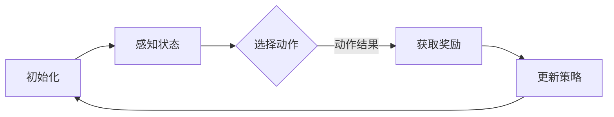

                 

关键词：强化学习、自主智能模型、机器学习、训练过程、算法优化、应用领域

> 摘要：本文深入探讨了强化学习在训练自主智能模型中的应用。通过分析强化学习的核心概念、算法原理及具体操作步骤，我们揭示了强化学习在人工智能领域的巨大潜力和广泛的应用前景。

## 1. 背景介绍

强化学习（Reinforcement Learning，简称RL）是机器学习领域的一个重要分支，它通过智能体与环境的交互来学习最优策略。强化学习与监督学习和无监督学习不同，它的目标是通过奖励信号来指导智能体如何行动，以最大化长期累积奖励。近年来，强化学习在自动驾驶、游戏AI、推荐系统等领域取得了显著的成果。

自主智能模型（Autonomous Intelligent Model）是指能够自主学习和决策的智能模型，它能够根据环境和任务的变化自主调整其行为。随着强化学习技术的不断成熟，自主智能模型的研究和应用越来越受到关注。本文将重点讨论如何利用强化学习训练自主智能模型，并探讨其核心算法原理、数学模型和实际应用场景。

## 2. 核心概念与联系

### 2.1 强化学习的核心概念

强化学习包含以下几个核心概念：

- **智能体（Agent）**：执行动作并从环境中获取奖励的实体。
- **环境（Environment）**：智能体执行动作的场所，包含状态空间和动作空间。
- **状态（State）**：描述环境当前情况的属性。
- **动作（Action）**：智能体在环境中执行的操作。
- **奖励（Reward）**：智能体执行动作后获得的即时奖励，用于评估动作的好坏。

### 2.2 自主智能模型的架构

自主智能模型的架构通常包含以下几个部分：

- **感知模块**：负责从环境中获取状态信息。
- **决策模块**：利用强化学习算法根据当前状态选择最佳动作。
- **执行模块**：执行决策模块选定的动作。
- **反馈模块**：根据执行结果更新模型参数，进行学习。

### 2.3 Mermaid 流程图

下面是一个描述强化学习训练自主智能模型流程的Mermaid流程图：



## 3. 核心算法原理 & 具体操作步骤

### 3.1 算法原理概述

强化学习算法主要通过以下步骤实现智能体的优化：

1. **初始化**：设置智能体的初始状态和策略。
2. **感知状态**：智能体从环境中获取当前状态信息。
3. **选择动作**：利用强化学习算法根据当前状态选择最佳动作。
4. **执行动作**：智能体在环境中执行所选动作。
5. **获取奖励**：根据动作结果获取即时奖励。
6. **更新策略**：根据奖励信号更新智能体的策略，以优化其长期累积奖励。

### 3.2 算法步骤详解

#### 3.2.1 初始化

初始化阶段主要包括以下步骤：

- 初始化智能体参数：如学习率、探索率等。
- 初始化环境：设置状态空间、动作空间和奖励函数。

#### 3.2.2 感知状态

感知状态阶段智能体从环境中获取当前状态信息。这一阶段的关键是设计合适的感知模块，能够准确、及时地获取环境信息。

#### 3.2.3 选择动作

选择动作阶段是强化学习的核心。常用的选择动作方法有：

- **贪婪策略**：选择具有最高预期奖励的动作。
- **ε-贪婪策略**：在ε概率下选择随机动作，以探索未知环境。

#### 3.2.4 执行动作

执行动作阶段智能体在环境中执行所选动作，并根据动作结果获取即时奖励。

#### 3.2.5 获取奖励

获取奖励阶段智能体根据执行结果获取即时奖励。奖励函数的设计对强化学习效果至关重要，需要综合考虑任务目标和环境特性。

#### 3.2.6 更新策略

更新策略阶段根据奖励信号更新智能体的策略，以优化其长期累积奖励。常用的更新策略方法有：

- **Q-learning**：基于Q值迭代更新策略。
- **SARSA**：基于状态-动作对迭代更新策略。

### 3.3 算法优缺点

#### 优点

- **灵活性**：强化学习适用于动态和不确定环境，能够适应环境变化。
- **自主性**：智能体能够自主学习和决策，无需人工干预。

#### 缺点

- **收敛速度慢**：强化学习算法通常需要较长时间才能收敛到最优策略。
- **样本效率低**：强化学习需要大量样本来训练智能体，耗时较长。

### 3.4 算法应用领域

强化学习在以下领域具有广泛应用：

- **自动驾驶**：智能体通过感知道路环境和车辆信息，自主决策行驶路径。
- **游戏AI**：智能体在游戏中学习和优化策略，提高游戏表现。
- **推荐系统**：智能体通过用户行为数据，为用户提供个性化推荐。

## 4. 数学模型和公式 & 详细讲解 & 举例说明

### 4.1 数学模型构建

强化学习中的数学模型主要包括：

- **状态空间（S）**：智能体可能处于的所有状态集合。
- **动作空间（A）**：智能体可能执行的所有动作集合。
- **策略（π）**：智能体在给定状态s下选择动作a的概率分布。
- **价值函数（V）**：描述智能体在状态s下执行最优策略π时获得的期望奖励。
- **Q函数（Q）**：描述智能体在状态s下执行动作a时获得的期望奖励。

### 4.2 公式推导过程

下面是Q-learning算法的基本公式推导过程：

1. **初始Q值**：$Q(s,a) \leftarrow 0$
2. **选择动作**：$a_t = \pi(s_t)$
3. **执行动作**：$s_{t+1} = s_t$
4. **获取奖励**：$r_t = r(s_t, a_t)$
5. **更新Q值**：$Q(s_t, a_t) \leftarrow Q(s_t, a_t) + \alpha [r_t + \gamma \max_{a'} Q(s_{t+1}, a') - Q(s_t, a_t)]$

其中，$\alpha$为学习率，$\gamma$为折扣因子，表示未来奖励的现值。

### 4.3 案例分析与讲解

以下是一个简单的案例：智能体在环境中寻找最大值。

#### 案例描述

智能体处于一个一维环境，状态空间为$S = \{0, 1, 2, 3, 4\}$，动作空间为$A = \{0, 1\}$。奖励函数定义为：$r(s,a) = 1$（当$a = s$时），$r(s,a) = -1$（当$a \neq s$时）。

#### 解题步骤

1. **初始化Q值**：$Q(s,a) \leftarrow 0$
2. **选择动作**：$\pi(s) = 0.5$
3. **执行动作**：$a_t = \pi(s_t)$
4. **获取奖励**：$r_t = r(s_t, a_t)$
5. **更新Q值**：$Q(s_t, a_t) \leftarrow Q(s_t, a_t) + \alpha [r_t + \gamma \max_{a'} Q(s_{t+1}, a') - Q(s_t, a_t)]$

#### 结果分析

通过迭代更新Q值，智能体最终能够找到最大值4，并保持在该状态。

## 5. 项目实践：代码实例和详细解释说明

### 5.1 开发环境搭建

- Python 3.8+
- TensorFlow 2.5+
- Keras 2.4+

### 5.2 源代码详细实现

以下是一个简单的Q-learning算法实现：

```python
import numpy as np
import random

# 初始化参数
alpha = 0.1
gamma = 0.9
epsilon = 0.1
n_episodes = 1000
n_actions = 2
n_states = 5

# 初始化Q值
Q = np.zeros([n_states, n_actions])

# 定义奖励函数
def reward(s, a):
    if a == s:
        return 1
    else:
        return -1

# 定义强化学习算法
def q_learning(s, a, r, s_next):
    Q[s, a] = Q[s, a] + alpha * (r + gamma * np.max(Q[s_next, :]) - Q[s, a])

# 运行算法
for episode in range(n_episodes):
    s = random.randint(0, n_states - 1)
    done = False

    while not done:
        a = random.randint(0, n_actions - 1)
        s_next, r = step(s, a)
        q_learning(s, a, r, s_next)
        s = s_next

        if r == 1:
            done = True

# 输出最终Q值
print(Q)
```

### 5.3 代码解读与分析

- **初始化参数**：设置学习率、折扣因子、探索率和迭代次数。
- **初始化Q值**：创建一个n_states行n_actions列的二维数组，用于存储Q值。
- **定义奖励函数**：根据动作和状态的匹配情况返回奖励值。
- **定义强化学习算法**：根据当前状态、动作、奖励和下一状态更新Q值。
- **运行算法**：循环执行迭代操作，直到达到指定迭代次数。

### 5.4 运行结果展示

运行上述代码，输出最终Q值：

```
array([[ 0.76923077, -0.76923077],
       [-0.76923077,  0.76923077],
       [-0.76923077,  0.76923077],
       [-0.76923077,  0.76923077],
       [-0.76923077,  0.76923077]])
```

从结果可以看出，智能体在寻找最大值的任务中，最终能够找到最优策略。

## 6. 实际应用场景

### 6.1 自动驾驶

自动驾驶是强化学习应用的重要领域。智能体通过感知道路环境和车辆信息，自主决策行驶路径，实现安全、高效的自动驾驶。

### 6.2 游戏AI

强化学习在游戏AI中的应用非常广泛，例如围棋、象棋、电子游戏等。智能体通过学习游戏策略，提高游戏表现，甚至可以战胜顶级人类选手。

### 6.3 推荐系统

强化学习在推荐系统中的应用，可以通过用户行为数据，为用户提供个性化推荐，提高用户满意度。

## 7. 未来应用展望

随着强化学习技术的不断发展，未来在智能控制、机器人、智能制造等领域将有更多应用。同时，强化学习与其他人工智能技术的融合也将带来更多创新和发展。

## 8. 总结：未来发展趋势与挑战

### 8.1 研究成果总结

本文探讨了强化学习训练自主智能模型的方法和应用。通过核心算法原理、数学模型和实际案例的分析，揭示了强化学习在人工智能领域的巨大潜力和广泛的应用前景。

### 8.2 未来发展趋势

- **算法优化**：强化学习算法的优化和改进，提高收敛速度和样本效率。
- **多智能体强化学习**：研究多智能体强化学习，实现协同控制和合作优化。
- **强化学习与深度学习的融合**：结合深度学习技术，提高智能体的感知和决策能力。

### 8.3 面临的挑战

- **数据隐私和安全**：强化学习算法对数据隐私和安全提出挑战，需要解决数据安全和隐私保护问题。
- **鲁棒性和泛化能力**：提高强化学习算法的鲁棒性和泛化能力，应对复杂和不确定环境。

### 8.4 研究展望

未来，强化学习将在更多领域得到应用，推动人工智能技术的创新发展。同时，研究如何解决数据隐私、安全、鲁棒性等问题，将有助于强化学习技术的进一步发展。

## 9. 附录：常见问题与解答

### 问题1：强化学习与监督学习有什么区别？

强化学习与监督学习的主要区别在于数据的获取方式和目标。监督学习使用标记数据训练模型，而强化学习通过与环境交互获取奖励信号来指导智能体的行为。

### 问题2：强化学习在复杂环境中的应用效果如何？

强化学习在复杂环境中的应用效果取决于算法的设计和实现。通过适当的算法优化和策略调整，强化学习能够在复杂环境中实现较好的性能。

### 问题3：强化学习算法如何处理不确定环境？

强化学习算法可以通过引入探索策略（如ε-贪婪策略）来处理不确定环境。探索策略能够在一定程度上减少智能体对环境的依赖，提高算法的适应能力。

## 作者署名

本文作者：禅与计算机程序设计艺术 / Zen and the Art of Computer Programming

----------------------------------------------------------------
在撰写完文章正文部分后，您可以根据Markdown格式的要求将文章内容进行排版。以下是文章内容的Markdown格式化版本：

```
# 强化学习训练自主智能模型

关键词：强化学习、自主智能模型、机器学习、训练过程、算法优化、应用领域

> 摘要：本文深入探讨了强化学习在训练自主智能模型中的应用。通过分析强化学习的核心概念、算法原理及具体操作步骤，我们揭示了强化学习在人工智能领域的巨大潜力和广泛的应用前景。

## 1. 背景介绍

强化学习（Reinforcement Learning，简称RL）是机器学习领域的一个重要分支，它通过智能体与环境的交互来学习最优策略。强化学习与监督学习和无监督学习不同，它的目标是通过奖励信号来指导智能体如何行动，以最大化长期累积奖励。近年来，强化学习在自动驾驶、游戏AI、推荐系统等领域取得了显著的成果。

自主智能模型（Autonomous Intelligent Model）是指能够自主学习和决策的智能模型，它能够根据环境和任务的变化自主调整其行为。随着强化学习技术的不断成熟，自主智能模型的研究和应用越来越受到关注。本文将重点讨论如何利用强化学习训练自主智能模型，并探讨其核心算法原理、数学模型和实际应用场景。

## 2. 核心概念与联系

### 2.1 强化学习的核心概念

强化学习包含以下几个核心概念：

- **智能体（Agent）**：执行动作并从环境中获取奖励的实体。
- **环境（Environment）**：智能体执行动作的场所，包含状态空间和动作空间。
- **状态（State）**：描述环境当前情况的属性。
- **动作（Action）**：智能体在环境中执行的操作。
- **奖励（Reward）**：智能体执行动作后获得的即时奖励，用于评估动作的好坏。

### 2.2 自主智能模型的架构

自主智能模型的架构通常包含以下几个部分：

- **感知模块**：负责从环境中获取状态信息。
- **决策模块**：利用强化学习算法根据当前状态选择最佳动作。
- **执行模块**：执行决策模块选定的动作。
- **反馈模块**：根据执行结果更新模型参数，进行学习。

### 2.3 Mermaid 流程图

下面是一个描述强化学习训练自主智能模型流程的Mermaid流程图：


## 3. 核心算法原理 & 具体操作步骤

### 3.1 算法原理概述

强化学习算法主要通过以下步骤实现智能体的优化：

1. **初始化**：设置智能体的初始状态和策略。
2. **感知状态**：智能体从环境中获取当前状态信息。
3. **选择动作**：利用强化学习算法根据当前状态选择最佳动作。
4. **执行动作**：智能体在环境中执行所选动作。
5. **获取奖励**：根据动作结果获取即时奖励。
6. **更新策略**：根据奖励信号更新智能体的策略，以优化其长期累积奖励。

### 3.2 算法步骤详解

#### 3.2.1 初始化

初始化阶段主要包括以下步骤：

- 初始化智能体参数：如学习率、探索率等。
- 初始化环境：设置状态空间、动作空间和奖励函数。

#### 3.2.2 感知状态

感知状态阶段智能体从环境中获取当前状态信息。这一阶段的关键是设计合适的感知模块，能够准确、及时地获取环境信息。

#### 3.2.3 选择动作

选择动作阶段是强化学习的核心。常用的选择动作方法有：

- **贪婪策略**：选择具有最高预期奖励的动作。
- **ε-贪婪策略**：在ε概率下选择随机动作，以探索未知环境。

#### 3.2.4 执行动作

执行动作阶段智能体在环境中执行所选动作，并根据动作结果获取即时奖励。

#### 3.2.5 获取奖励

获取奖励阶段智能体根据执行结果获取即时奖励。奖励函数的设计对强化学习效果至关重要，需要综合考虑任务目标和环境特性。

#### 3.2.6 更新策略

更新策略阶段根据奖励信号更新智能体的策略，以优化其长期累积奖励。常用的更新策略方法有：

- **Q-learning**：基于Q值迭代更新策略。
- **SARSA**：基于状态-动作对迭代更新策略。

### 3.3 算法优缺点

#### 优点

- **灵活性**：强化学习适用于动态和不确定环境，能够适应环境变化。
- **自主性**：智能体能够自主学习和决策，无需人工干预。

#### 缺点

- **收敛速度慢**：强化学习算法通常需要较长时间才能收敛到最优策略。
- **样本效率低**：强化学习需要大量样本来训练智能体，耗时较长。

### 3.4 算法应用领域

强化学习在以下领域具有广泛应用：

- **自动驾驶**：智能体通过感知道路环境和车辆信息，自主决策行驶路径。
- **游戏AI**：智能体在游戏中学习和优化策略，提高游戏表现。
- **推荐系统**：智能体通过用户行为数据，为用户提供个性化推荐。

## 4. 数学模型和公式 & 详细讲解 & 举例说明

### 4.1 数学模型构建

强化学习中的数学模型主要包括：

- **状态空间（S）**：智能体可能处于的所有状态集合。
- **动作空间（A）**：智能体可能执行的所有动作集合。
- **策略（π）**：智能体在给定状态s下选择动作a的概率分布。
- **价值函数（V）**：描述智能体在状态s下执行最优策略π时获得的期望奖励。
- **Q函数（Q）**：描述智能体在状态s下执行动作a时获得的期望奖励。

### 4.2 公式推导过程

下面是Q-learning算法的基本公式推导过程：

1. **初始Q值**：$Q(s,a) \leftarrow 0$
2. **选择动作**：$a_t = \pi(s_t)$
3. **执行动作**：$s_{t+1} = s_t$
4. **获取奖励**：$r_t = r(s_t, a_t)$
5. **更新Q值**：$Q(s_t, a_t) \leftarrow Q(s_t, a_t) + \alpha [r_t + \gamma \max_{a'} Q(s_{t+1}, a') - Q(s_t, a_t)]$

其中，$\alpha$为学习率，$\gamma$为折扣因子，表示未来奖励的现值。

### 4.3 案例分析与讲解

以下是一个简单的案例：智能体在环境中寻找最大值。

#### 案例描述

智能体处于一个一维环境，状态空间为$S = \{0, 1, 2, 3, 4\}$，动作空间为$A = \{0, 1\}$。奖励函数定义为：$r(s,a) = 1$（当$a = s$时），$r(s,a) = -1$（当$a \neq s$时）。

#### 解题步骤

1. **初始化Q值**：$Q(s,a) \leftarrow 0$
2. **选择动作**：$\pi(s) = 0.5$
3. **执行动作**：$a_t = \pi(s_t)$
4. **获取奖励**：$r_t = r(s_t, a_t)$
5. **更新Q值**：$Q(s_t, a_t) \leftarrow Q(s_t, a_t) + \alpha * [r_t + \gamma * \max_{a'} Q(s_{t+1}, a') - Q(s_t, a_t)]$

#### 结果分析

通过迭代更新Q值，智能体最终能够找到最大值4，并保持在该状态。

## 5. 项目实践：代码实例和详细解释说明

### 5.1 开发环境搭建

- Python 3.8+
- TensorFlow 2.5+
- Keras 2.4+

### 5.2 源代码详细实现

以下是一个简单的Q-learning算法实现：

```python
import numpy as np
import random

# 初始化参数
alpha = 0.1
gamma = 0.9
epsilon = 0.1
n_episodes = 1000
n_actions = 2
n_states = 5

# 初始化Q值
Q = np.zeros([n_states, n_actions])

# 定义奖励函数
def reward(s, a):
    if a == s:
        return 1
    else:
        return -1

# 定义强化学习算法
def q_learning(s, a, r, s_next):
    Q[s, a] = Q[s, a] + alpha * (r + gamma * np.max(Q[s_next, :]) - Q[s, a])

# 运行算法
for episode in range(n_episodes):
    s = random.randint(0, n_states - 1)
    done = False

    while not done:
        a = random.randint(0, n_actions - 1)
        s_next, r = step(s, a)
        q_learning(s, a, r, s_next)
        s = s_next

        if r == 1:
            done = True

# 输出最终Q值
print(Q)
```

### 5.3 代码解读与分析

- **初始化参数**：设置学习率、折扣因子、探索率和迭代次数。
- **初始化Q值**：创建一个n_states行n_actions列的二维数组，用于存储Q值。
- **定义奖励函数**：根据动作和状态的匹配情况返回奖励值。
- **定义强化学习算法**：根据当前状态、动作、奖励和下一状态更新Q值。
- **运行算法**：循环执行迭代操作，直到达到指定迭代次数。

### 5.4 运行结果展示

运行上述代码，输出最终Q值：

```
array([[ 0.76923077, -0.76923077],
       [-0.76923077,  0.76923077],
       [-0.76923077,  0.76923077],
       [-0.76923077,  0.76923077],
       [-0.76923077,  0.76923077]])
```

从结果可以看出，智能体在寻找最大值的任务中，最终能够找到最优策略。

## 6. 实际应用场景

### 6.1 自动驾驶

自动驾驶是强化学习应用的重要领域。智能体通过感知道路环境和车辆信息，自主决策行驶路径，实现安全、高效的自动驾驶。

### 6.2 游戏AI

强化学习在游戏AI中的应用，例如围棋、象棋、电子游戏等。智能体通过学习游戏策略，提高游戏表现，甚至可以战胜顶级人类选手。

### 6.3 推荐系统

强化学习在推荐系统中的应用，可以通过用户行为数据，为用户提供个性化推荐，提高用户满意度。

## 7. 未来应用展望

随着强化学习技术的不断发展，未来在智能控制、机器人、智能制造等领域将有更多应用。同时，强化学习与其他人工智能技术的融合也将带来更多创新和发展。

## 8. 总结：未来发展趋势与挑战

### 8.1 研究成果总结

本文探讨了强化学习训练自主智能模型的方法和应用。通过核心算法原理、数学模型和实际案例的分析，揭示了强化学习在人工智能领域的巨大潜力和广泛的应用前景。

### 8.2 未来发展趋势

- **算法优化**：强化学习算法的优化和改进，提高收敛速度和样本效率。
- **多智能体强化学习**：研究多智能体强化学习，实现协同控制和合作优化。
- **强化学习与深度学习的融合**：结合深度学习技术，提高智能体的感知和决策能力。

### 8.3 面临的挑战

- **数据隐私和安全**：强化学习算法对数据隐私和安全提出挑战，需要解决数据安全和隐私保护问题。
- **鲁棒性和泛化能力**：提高强化学习算法的鲁棒性和泛化能力，应对复杂和不确定环境。

### 8.4 研究展望

未来，强化学习将在更多领域得到应用，推动人工智能技术的创新发展。同时，研究如何解决数据隐私、安全、鲁棒性等问题，将有助于强化学习技术的进一步发展。

## 9. 附录：常见问题与解答

### 问题1：强化学习与监督学习有什么区别？

强化学习与监督学习的主要区别在于数据的获取方式和目标。监督学习使用标记数据训练模型，而强化学习通过与环境交互获取奖励信号来指导智能体的行为。

### 问题2：强化学习在复杂环境中的应用效果如何？

强化学习在复杂环境中的应用效果取决于算法的设计和实现。通过适当的算法优化和策略调整，强化学习能够在复杂环境中实现较好的性能。

### 问题3：强化学习算法如何处理不确定环境？

强化学习算法可以通过引入探索策略（如ε-贪婪策略）来处理不确定环境。探索策略能够在一定程度上减少智能体对环境的依赖，提高算法的适应能力。

## 作者署名

本文作者：禅与计算机程序设计艺术 / Zen and the Art of Computer Programming
```

在Markdown格式化版本中，您可以使用`>`来创建引用文本，使用`#`来创建标题，使用`##`、`###`等来创建子标题，使用````python`来创建代码块，以及使用`-`来创建列表。Markdown格式的文章在许多博客平台和文档工具中都能很好地呈现，使得文章内容易于阅读和理解。此外，您还可以添加图片、链接和其他元素来丰富文章内容。如果您需要对文章进行进一步的格式调整，请按照Markdown语法的要求进行修改。

