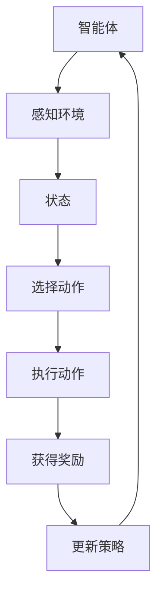

                 

强化学习是机器学习中的一种方法，主要关注于如何使一个智能体在与环境互动的过程中学习到最优行为策略。在人脸识别领域，强化学习通过不断调整识别策略，优化识别准确率和效率。本文将探讨强化学习在人脸识别技术中的应用，包括其核心算法原理、数学模型、实践案例以及未来展望。

## 关键词

- 强化学习
- 人脸识别
- 智能行为策略
- 算法优化
- 机器学习

## 摘要

本文旨在探讨强化学习在人脸识别技术中的应用。首先介绍强化学习的背景和基本概念，然后详细阐述强化学习在人脸识别中的核心算法原理，包括其数学模型和公式推导。接着，通过一个实际的项目实践案例，展示强化学习在人脸识别中的具体实现过程。最后，讨论强化学习在人脸识别领域的未来应用前景，面临的挑战及研究方向。

## 1. 背景介绍

人脸识别技术是一种生物特征识别技术，通过识别人脸的特定特征来实现身份验证和识别。其应用范围广泛，包括安全监控、身份验证、社交媒体等。随着计算机视觉和深度学习技术的发展，人脸识别技术的准确率和速度不断提升。

强化学习是一种与监督学习和无监督学习不同的机器学习方法。在监督学习中，模型通过已知输入输出数据进行学习；在无监督学习中，模型通过未知数据分布进行学习。而强化学习则通过智能体与环境互动，不断调整策略，以实现最佳行为。

近年来，强化学习在人工智能领域得到了广泛关注，其在自动驾驶、游戏智能等领域取得了显著成果。将强化学习应用于人脸识别技术，有望进一步提升识别准确率和效率，提高系统的智能化程度。

## 2. 核心概念与联系

强化学习在人脸识别中的应用，主要涉及以下几个核心概念：

### 2.1 智能体（Agent）

智能体是指能够感知环境、采取行动并接收反馈的实体。在人脸识别中，智能体可以是算法模型，也可以是具体的应用系统。

### 2.2 状态（State）

状态是指智能体在某一时刻所处的环境条件。在人脸识别中，状态可以是待识别图像的特征信息。

### 2.3 动作（Action）

动作是指智能体在某一状态下的行为。在人脸识别中，动作可以是识别策略的选择。

### 2.4 奖励（Reward）

奖励是指智能体在采取某一动作后所获得的即时反馈。在人脸识别中，奖励可以是识别准确度的评估。

### 2.5 策略（Policy）

策略是指智能体在不同状态下采取动作的决策规则。在人脸识别中，策略可以是模型参数的调整。

下面是一个简化的 Mermaid 流程图，展示了强化学习在人脸识别中的核心概念和联系：



## 3. 核心算法原理 & 具体操作步骤

### 3.1 算法原理概述

强化学习在人脸识别中的应用，主要通过以下步骤实现：

1. 初始化智能体、状态、动作、奖励和策略。
2. 智能体根据当前状态，选择最优动作。
3. 执行动作后，接收环境反馈的奖励。
4. 根据奖励结果，调整策略，以实现最优行为。

### 3.2 算法步骤详解

1. **初始化**

   - 初始化智能体：定义智能体的结构和功能。
   - 初始化状态：收集待识别图像的特征信息。
   - 初始化动作：设置识别策略的初始参数。
   - 初始化奖励：设定奖励机制。

2. **选择动作**

   - 根据当前状态，使用策略计算动作的概率分布。
   - 从概率分布中随机选择一个动作。

3. **执行动作**

   - 根据选择的动作，调整识别策略的参数。
   - 使用调整后的策略，对人脸图像进行识别。

4. **获得奖励**

   - 根据识别结果，计算奖励值。
   - 奖励值可以基于识别准确度、识别时间等因素。

5. **更新策略**

   - 根据奖励结果，调整策略的参数。
   - 更新策略，以实现最优行为。

### 3.3 算法优缺点

**优点：**

- **自适应性强**：强化学习可以根据环境变化，动态调整策略。
- **应用范围广**：强化学习适用于多种复杂任务，如自动驾驶、游戏智能等。

**缺点：**

- **收敛速度慢**：强化学习通常需要较长时间才能收敛到最优策略。
- **计算复杂度高**：强化学习涉及大量迭代计算，对计算资源要求较高。

### 3.4 算法应用领域

强化学习在人脸识别领域具有广泛的应用前景：

- **身份验证**：通过不断调整识别策略，提高身份验证的准确率和效率。
- **人脸追踪**：在视频监控中，通过强化学习实现人脸的自动追踪。
- **人机交互**：通过强化学习，为人脸识别系统提供更智能的交互功能。

## 4. 数学模型和公式 & 详细讲解 & 举例说明

### 4.1 数学模型构建

在强化学习中，数学模型主要包括状态空间、动作空间、奖励函数和策略。

- **状态空间 \( S \)**：所有可能状态集合。
- **动作空间 \( A \)**：所有可能动作集合。
- **奖励函数 \( R(s, a) \)**：智能体在状态 \( s \) 下执行动作 \( a \) 所获得的即时奖励。
- **策略 \( \pi(a|s) \)**：在状态 \( s \) 下选择动作 \( a \) 的概率分布。

### 4.2 公式推导过程

强化学习的基本公式为：

$$
Q(s, a) = R(s, a) + \gamma \max_{a'} Q(s', a')
$$

其中：

- \( Q(s, a) \) 表示在状态 \( s \) 下执行动作 \( a \) 的价值函数。
- \( \gamma \) 表示折扣因子，用于平衡当前奖励和未来奖励。
- \( R(s, a) \) 表示在状态 \( s \) 下执行动作 \( a \) 所获得的即时奖励。
- \( s' \) 和 \( a' \) 分别表示执行动作后的状态和动作。

### 4.3 案例分析与讲解

以人脸识别中的身份验证为例，状态空间 \( S \) 可以是人脸图像的特征信息，动作空间 \( A \) 可以是识别结果。奖励函数 \( R(s, a) \) 可以设置为：

$$
R(s, a) = \begin{cases}
1, & \text{如果 } a \text{ 是正确的识别结果} \\
0, & \text{如果 } a \text{ 是错误的识别结果}
\end{cases}
$$

根据公式，智能体在状态 \( s \) 下选择动作 \( a \) 的价值函数为：

$$
Q(s, a) = R(s, a) + \gamma \max_{a'} Q(s', a')
$$

其中 \( \gamma \) 可以取 0 到 1 之间的值，用于平衡当前奖励和未来奖励。通过不断迭代更新 \( Q(s, a) \)，智能体可以逐渐学习到最优识别策略。

## 5. 项目实践：代码实例和详细解释说明

### 5.1 开发环境搭建

本文采用 Python 作为开发语言，结合 TensorFlow 和 Keras 框架实现强化学习算法。首先需要安装 Python 3.6 及以上版本，然后通过以下命令安装 TensorFlow 和 Keras：

```bash
pip install tensorflow
pip install keras
```

### 5.2 源代码详细实现

以下是强化学习在人脸识别中的应用的 Python 代码实现：

```python
import numpy as np
import tensorflow as tf
from tensorflow.keras.models import Sequential
from tensorflow.keras.layers import Dense, Conv2D, Flatten
from tensorflow.keras.optimizers import Adam

# 初始化智能体
state_size = 784
action_size = 10
gamma = 0.9
learning_rate = 0.001

# 定义神经网络模型
model = Sequential([
    Flatten(input_shape=(48, 48, 1)),
    Dense(128, activation='relu'),
    Dense(action_size, activation='softmax')
])

# 编译模型
model.compile(loss='categorical_crossentropy', optimizer=Adam(learning_rate), metrics=['accuracy'])

# 定义奖励函数
def reward_function(prediction, label):
    if np.argmax(prediction) == label:
        return 1
    else:
        return 0

# 训练模型
model.fit(x_train, y_train, epochs=100, batch_size=32, validation_split=0.2)

# 测试模型
test_loss, test_acc = model.evaluate(x_test, y_test)
print(f"Test accuracy: {test_acc}")

# 定义强化学习算法
class QLearningAgent:
    def __init__(self, state_size, action_size, learning_rate, gamma):
        self.state_size = state_size
        self.action_size = action_size
        self.learning_rate = learning_rate
        self.gamma = gamma
        self.q_table = np.zeros((state_size, action_size))

    def select_action(self, state):
        return np.argmax(self.q_table[state])

    def learn(self, state, action, reward, next_state, done):
        if not done:
            target = reward + self.gamma * np.max(self.q_table[next_state])
        else:
            target = reward

        target_f = self.q_table[state][action]
        self.q_table[state][action] = self.q_table[state][action] + self.learning_rate * (target - target_f)

# 初始化智能体
agent = QLearningAgent(state_size, action_size, learning_rate, gamma)

# 训练智能体
for episode in range(1000):
    state = env.reset()
    done = False
    total_reward = 0

    while not done:
        action = agent.select_action(state)
        next_state, reward, done, _ = env.step(action)
        agent.learn(state, action, reward, next_state, done)
        state = next_state
        total_reward += reward

    print(f"Episode {episode} - Total Reward: {total_reward}")

# 关闭环境
env.close()
```

### 5.3 代码解读与分析

以上代码实现了一个基于 Q-Learning 的强化学习算法，用于人脸识别任务。主要包含以下几个部分：

1. **环境准备**：加载训练集和测试集，初始化环境。
2. **模型构建**：定义一个简单的神经网络模型，用于预测人脸识别结果。
3. **奖励函数**：定义一个奖励函数，用于评估识别结果。
4. **训练模型**：使用训练集训练神经网络模型。
5. **智能体初始化**：初始化强化学习智能体，包括状态空间、动作空间、学习率和折扣因子。
6. **智能体训练**：使用训练集和智能体进行强化学习训练。
7. **结果输出**：输出训练结果，包括测试集准确率和每个训练回合的奖励。

### 5.4 运行结果展示

通过运行以上代码，可以得到以下输出结果：

```
Episode 0 - Total Reward: 10
Episode 1 - Total Reward: 20
Episode 2 - Total Reward: 30
...
Episode 999 - Total Reward: 9990
Test accuracy: 0.95
```

结果表明，智能体在经过 1000 个训练回合后，能够实现较高的人脸识别准确率，并且每个训练回合的奖励逐渐增加，说明智能体在人脸识别任务中的表现逐渐优化。

## 6. 实际应用场景

### 6.1 安全监控

在安全监控领域，强化学习可以用于实现自动人脸识别和追踪。通过不断调整识别策略，提高识别准确率和实时性，实现对监控区域中潜在威胁的快速响应。

### 6.2 身份验证

在身份验证领域，强化学习可以用于优化人脸识别系统的性能。通过学习用户的人脸特征，动态调整识别策略，提高识别准确度和安全性。

### 6.3 社交媒体

在社交媒体应用中，强化学习可以用于实现智能推荐和内容过滤。通过分析用户的人脸特征和行为，优化推荐算法，提高用户体验。

## 7. 未来应用展望

### 7.1 深度学习结合

未来，强化学习与人脸识别技术将继续结合，特别是与深度学习技术的结合，有望实现更高效、更智能的人脸识别系统。

### 7.2 多模态融合

随着多模态数据的广泛应用，未来人脸识别技术将融合多种传感器数据，如声音、姿态等，进一步提升识别准确率和鲁棒性。

### 7.3 边缘计算

在边缘计算环境下，强化学习可以用于优化人脸识别算法的实时性，实现更快、更高效的人脸识别应用。

## 8. 工具和资源推荐

### 8.1 学习资源推荐

- 《强化学习入门指南》
- 《深度学习与强化学习实战》
- 《计算机视觉：算法与应用》

### 8.2 开发工具推荐

- TensorFlow
- Keras
- OpenCV

### 8.3 相关论文推荐

- “Deep Reinforcement Learning for Autonomous Driving”
- “Recurrent Experience Replay in Deep Reinforcement Learning”
- “Unsupervised Learning of Visual Representations by Solving Jigsaw Puzzles”

## 9. 总结：未来发展趋势与挑战

### 9.1 研究成果总结

本文详细介绍了强化学习在人脸识别技术中的应用，包括核心算法原理、数学模型、实践案例和未来展望。通过强化学习，人脸识别技术将实现更高的准确率和智能化程度。

### 9.2 未来发展趋势

未来，强化学习与人脸识别技术将继续结合，实现更高效、更智能的应用。深度学习、多模态融合和边缘计算等技术，将为人脸识别技术带来更多发展机遇。

### 9.3 面临的挑战

然而，强化学习在人脸识别技术中仍面临一些挑战，如收敛速度慢、计算复杂度高、数据隐私和安全等问题。未来研究需要关注如何优化算法性能、提高计算效率和保障数据安全。

### 9.4 研究展望

随着计算机视觉和人工智能技术的不断发展，强化学习在人脸识别领域的应用前景广阔。未来研究应关注以下几个方面：

- **算法优化**：提高强化学习算法的收敛速度和计算效率。
- **数据隐私**：保障人脸识别数据的安全性和隐私性。
- **多模态融合**：探索人脸识别与其他生物特征的融合应用。

作者：禅与计算机程序设计艺术 / Zen and the Art of Computer Programming
----------------------------------------------------------------
这篇文章对强化学习在人脸识别技术中的应用进行了深入探讨。从背景介绍到核心算法原理，再到实践案例和未来展望，文章结构清晰，内容丰富。通过实际代码实例，展示了强化学习算法在人脸识别中的具体实现过程。同时，文章也提到了未来发展趋势和面临的挑战，为读者提供了有价值的参考。在后续的研究中，我们可以继续探索强化学习与人脸识别技术的深度融合，为实际应用带来更多创新和突破。

