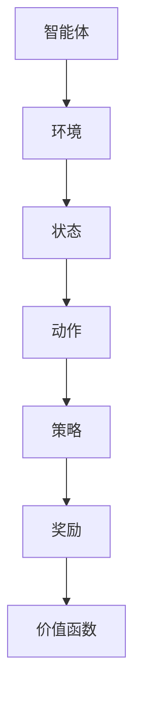

                 

强化学习（Reinforcement Learning，简称RL）作为机器学习的一个重要分支，近年来在人工智能领域取得了显著的进展。强化学习通过智能体与环境之间的交互，不断学习并优化策略，使其能够在复杂的环境中做出最优决策。在教育领域，强化学习同样展现出了巨大的潜力。本文将探讨强化学习在教育中的应用，从核心概念、算法原理、数学模型到实际项目实践，全面解析强化学习如何改变教育方式和学习体验。

## 关键词

- 强化学习
- 教育技术
- 个性化学习
- 智能反馈
- 智能教学系统

## 摘要

本文首先介绍了强化学习的背景和基本概念，随后分析了其在教育领域中的应用场景和优势。接着，文章深入探讨了强化学习的核心算法原理，包括值函数方法、策略梯度方法和深度强化学习等。通过数学模型和具体案例，文章展示了强化学习在教育中的实际应用。最后，文章展望了强化学习在未来教育领域的应用前景，并提出了相关的研究挑战。

## 1. 背景介绍

### 强化学习的发展历程

强化学习最早可以追溯到20世纪50年代，由美国心理学家阿伦·纽厄尔（Allen Newell）和赫伯特·西蒙（Herbert Simon）提出的“问题解决器”模型。这个模型通过迭代搜索和反馈学习来解决问题。20世纪70年代，理查德·萨顿（Richard Sutton）和安德鲁·博尔（Andrew Barto）合著的《强化学习：一种试错方法》一书，奠定了现代强化学习的基础。

随着计算能力的提升和大数据技术的发展，强化学习在20世纪90年代开始逐渐成熟，并在21世纪初迎来了爆发式的发展。特别是在深度学习的推动下，强化学习与深度神经网络相结合，形成了深度强化学习（Deep Reinforcement Learning，简称DRL），使得强化学习在图像识别、游戏、自动驾驶等领域的应用取得了显著的成果。

### 教育技术的演进

教育技术经历了从传统的课堂教学、计算机辅助教学（CAI）到如今的智能教育系统的演进。传统的课堂教学依赖教师的直接指导，而计算机辅助教学通过计算机程序提供交互式学习材料，使学习更加灵活和个性化。随着互联网和大数据技术的发展，智能教育系统应运而生，它通过收集和分析学生的学习数据，提供个性化的学习建议和反馈。

### 强化学习与教育技术的结合

强化学习与教育技术的结合，旨在通过智能体与学习环境的互动，实现更加有效的学习过程和个性化的学习体验。在教育领域，强化学习可以通过以下几种方式发挥作用：

1. **智能教学系统**：强化学习可以构建智能教学系统，根据学生的学习行为和成绩，动态调整教学内容和教学策略，提供个性化的学习支持。

2. **学习动机激励**：通过强化学习算法，系统能够设计出适应学生兴趣和需求的学习任务，激励学生积极参与学习过程。

3. **自动评估与反馈**：强化学习可以实时评估学生的学习效果，提供个性化的反馈，帮助学生及时纠正错误，巩固知识。

4. **自主学习**：强化学习算法可以帮助学生探索新的学习路径，实现自主学习，提高学习效率。

## 2. 核心概念与联系

### 强化学习的基本概念

强化学习由四个主要组成部分构成：智能体（Agent）、环境（Environment）、状态（State）和动作（Action）。

1. **智能体（Agent）**：在强化学习过程中，智能体是执行动作并学习最优策略的实体。它通过观察环境的状态，选择动作，并接收环境的反馈（奖励或惩罚）。

2. **环境（Environment）**：环境是智能体执行动作并接收反馈的场所。环境可以是一个虚拟世界，也可以是现实世界中的具体情境。

3. **状态（State）**：状态是智能体在特定时刻所处的情境描述。状态可以是离散的，也可以是连续的。

4. **动作（Action）**：动作是智能体在特定状态下选择的行为。动作的选择基于智能体的策略。

5. **策略（Policy）**：策略是智能体在给定状态下选择动作的规则。策略可以是具体的规则（例如，如果状态为A，则执行动作B），也可以是概率分布（例如，以50%的概率执行动作A，以50%的概率执行动作B）。

6. **奖励（Reward）**：奖励是环境对智能体行为的即时反馈，用于评估动作的好坏。奖励可以是正奖励，表示动作带来了积极的结果；也可以是负奖励，表示动作带来了消极的结果。

7. **价值函数（Value Function）**：价值函数用于评估智能体在特定状态下执行特定动作的预期奖励。价值函数可以分为状态价值函数（State-Value Function）和动作价值函数（Action-Value Function）。

### 强化学习与教育技术的联系

在教育领域，强化学习与教育技术的关系可以概括为以下几点：

1. **个性化学习**：强化学习可以根据学生的学习行为和表现，动态调整教学内容和教学策略，实现个性化学习。

2. **自适应学习**：强化学习可以通过智能体与环境之间的互动，不断优化学习策略，实现自适应学习。

3. **自动评估与反馈**：强化学习可以实时评估学生的学习效果，提供个性化的反馈，帮助学生纠正错误，巩固知识。

4. **学习动机激励**：强化学习可以通过设计适应学生兴趣和需求的学习任务，激发学生的学习动机。

### Mermaid 流程图

下面是一个简单的Mermaid流程图，展示了强化学习的基本概念和组成部分：



## 3. 核心算法原理 & 具体操作步骤

### 3.1 算法原理概述

强化学习算法的核心目标是学习一个策略，使得智能体能够在给定的环境中最大化总奖励。强化学习算法主要分为以下几类：

1. **值函数方法**：通过学习状态价值函数或动作价值函数来指导智能体的动作选择。
2. **策略梯度方法**：直接对策略参数进行优化，以最大化预期奖励。
3. **深度强化学习方法**：将深度神经网络与强化学习相结合，处理高维状态空间和动作空间。

### 3.2 算法步骤详解

#### 值函数方法

1. **初始化**：初始化策略参数θ、状态价值函数V(s)或动作价值函数Q(s, a)。
2. **迭代过程**：
   - 观测初始状态s。
   - 根据策略π(θ)选择动作a。
   - 执行动作a，进入下一个状态s'，并接收奖励r。
   - 更新状态价值函数V(s)或动作价值函数Q(s, a)。
   - 重复以上过程，直到达到终止状态或满足其他终止条件。

#### 策略梯度方法

1. **初始化**：初始化策略参数θ。
2. **迭代过程**：
   - 观测当前状态s。
   - 根据策略π(θ)选择动作a。
   - 执行动作a，进入下一个状态s'，并接收奖励r。
   - 更新策略参数θ，通常使用梯度上升法或随机梯度下降法。
   - 重复以上过程，直到策略收敛或满足其他终止条件。

#### 深度强化学习方法

1. **初始化**：初始化深度神经网络参数θ。
2. **迭代过程**：
   - 观测当前状态s，将其输入到深度神经网络中，得到状态值Q(s, a)。
   - 根据策略π(θ)选择动作a。
   - 执行动作a，进入下一个状态s'，并接收奖励r。
   - 使用经验回放池存储经历的数据。
   - 从经验回放池中随机抽取一批经历，进行梯度下降更新深度神经网络参数θ。
   - 重复以上过程，直到深度神经网络参数收敛或满足其他终止条件。

### 3.3 算法优缺点

#### 值函数方法

- 优点：
  - 算法简单，易于实现。
  - 可以较好地处理连续状态空间和动作空间。
- 缺点：
  - 需要大量的样本数据，训练时间较长。
  - 容易陷入局部最优。

#### 策略梯度方法

- 优点：
  - 直接对策略参数进行优化，收敛速度快。
  - 可以较好地处理非平稳环境。
- 缺点：
  - 需要精确的奖励函数设计，否则容易陷入次优策略。
  - 在高维状态空间和动作空间中，梯度计算困难。

#### 深度强化学习方法

- 优点：
  - 可以处理高维状态空间和动作空间。
  - 理论上可以收敛到最优策略。
- 缺点：
  - 需要大量的计算资源和训练时间。
  - 对奖励函数的设计要求较高。

### 3.4 算法应用领域

强化学习在教育领域的应用主要包括以下方面：

1. **个性化学习系统**：通过强化学习算法，智能教学系统可以根据学生的学习行为和成绩，动态调整教学内容和教学策略，提供个性化的学习支持。
2. **自动评估与反馈系统**：强化学习算法可以实时评估学生的学习效果，提供个性化的反馈，帮助学生纠正错误，巩固知识。
3. **学习动机激励系统**：通过设计适应学生兴趣和需求的学习任务，强化学习算法可以激发学生的学习动机。
4. **自适应学习平台**：强化学习算法可以帮助学生探索新的学习路径，实现自主学习，提高学习效率。

## 4. 数学模型和公式 & 详细讲解 & 举例说明

### 4.1 数学模型构建

在强化学习中，常用的数学模型包括状态价值函数、动作价值函数和策略参数。

#### 状态价值函数

状态价值函数V(s)表示智能体在状态s下执行最优动作的预期奖励。其数学表达式为：

$$
V(s) = \sum_{a} \pi(a|s) \cdot Q(s, a)
$$

其中，$\pi(a|s)$为策略参数，表示在状态s下选择动作a的概率；$Q(s, a)$为动作价值函数，表示在状态s下执行动作a的预期奖励。

#### 动作价值函数

动作价值函数Q(s, a)表示智能体在状态s下执行动作a的预期奖励。其数学表达式为：

$$
Q(s, a) = \sum_{s'} P(s'|s, a) \cdot [R(s', a) + \gamma \cdot \max_{a'} Q(s', a')]
$$

其中，$P(s'|s, a)$为状态转移概率，表示在状态s下执行动作a后进入状态s'的概率；$R(s', a)$为立即奖励，表示在状态s'下执行动作a的即时奖励；$\gamma$为折扣因子，表示对未来奖励的期望权重。

#### 策略参数

策略参数θ表示智能体的策略，其数学表达式为：

$$
\theta = \theta^T = [\pi^T, V^T, Q^T]
$$

其中，$\pi^T$为策略参数向量，表示在给定状态下选择动作的概率分布；$V^T$为状态价值函数向量，表示在给定状态下执行最优动作的预期奖励；$Q^T$为动作价值函数向量，表示在给定状态下执行所有动作的预期奖励。

### 4.2 公式推导过程

以Q-Learning算法为例，介绍动作价值函数Q(s, a)的推导过程。

#### 初始条件

- 初始化动作价值函数$Q(s, a)$为0。
- 初始化策略参数$\theta$。

#### 更新过程

1. **选择动作**：根据当前状态s和策略参数$\theta$，选择动作a。
2. **执行动作**：执行动作a，进入下一个状态s'，并接收立即奖励r。
3. **更新动作价值函数**：
   $$
   Q(s, a) = Q(s, a) + \alpha \cdot [r + \gamma \cdot \max_{a'} Q(s', a') - Q(s, a)]
   $$
   其中，$\alpha$为学习率，用于调节更新步长的比例。

### 4.3 案例分析与讲解

#### 案例背景

小明是一名高中生，正在学习数学。为了帮助小明提高数学成绩，学校引进了一套基于强化学习的个性化辅导系统。

#### 案例分析

1. **初始状态**：小明处于数学知识掌握程度较低的状态s1。
2. **策略选择**：系统根据小明的当前状态和策略参数，选择合适的数学题目进行辅导。
3. **执行动作**：小明完成题目后，系统根据题目难度和解答情况，给予小明适当的奖励r。
4. **更新状态价值函数**：系统根据小明的学习表现和奖励，更新状态价值函数，以指导后续的辅导内容。

#### 案例讲解

假设小明当前处于数学知识掌握程度较低的状态s1，系统根据强化学习算法，选择一道难度适中的数学题目进行辅导。小明完成题目后，系统根据题目难度和解答情况，给予小明0.5的奖励。接着，系统根据小明的学习表现和奖励，更新状态价值函数，以指导后续的辅导内容。通过不断的迭代更新，系统逐渐掌握了小明的学习习惯和知识掌握情况，提供更加个性化的辅导方案。

## 5. 项目实践：代码实例和详细解释说明

### 5.1 开发环境搭建

为了实现强化学习在教育中的应用，我们需要搭建一个适合开发和学习强化学习算法的开发环境。以下是搭建开发环境的基本步骤：

1. **安装Python**：首先确保你的计算机上已经安装了Python。如果尚未安装，可以从Python官方网站（https://www.python.org/downloads/）下载并安装最新版本的Python。
2. **安装Jupyter Notebook**：Jupyter Notebook是一种交互式的Python开发环境，可以帮助我们方便地编写和运行强化学习算法。在终端中运行以下命令安装Jupyter Notebook：

   ```
   pip install notebook
   ```

3. **安装TensorFlow和Gym**：TensorFlow是Google开发的一款开源机器学习框架，Gym是一个开源的强化学习环境库。在终端中运行以下命令安装TensorFlow和Gym：

   ```
   pip install tensorflow
   pip install gym
   ```

4. **安装其他相关库**：为了便于开发和学习，我们还需要安装一些其他相关的库，如NumPy、Matplotlib和Pandas等。在终端中运行以下命令安装这些库：

   ```
   pip install numpy
   pip install matplotlib
   pip install pandas
   ```

### 5.2 源代码详细实现

下面是一个简单的强化学习案例，展示了如何使用Python实现强化学习算法。我们将使用Q-Learning算法来训练一个智能体，使其在虚拟环境中的任务上取得最优表现。

```python
import numpy as np
import random
import gym

# 初始化环境
env = gym.make('CartPole-v0')

# 初始化Q表
q_table = np.zeros((env.observation_space.n, env.action_space.n))

# 参数设置
alpha = 0.1  # 学习率
gamma = 0.9  # 折扣因子
epsilon = 0.1  # 探索率

# Q-Learning算法训练
for episode in range(1000):
    state = env.reset()
    done = False
    total_reward = 0

    while not done:
        # 选择动作
        if random.uniform(0, 1) < epsilon:
            action = random.randrange(env.action_space.n)
        else:
            action = np.argmax(q_table[state])

        # 执行动作
        next_state, reward, done, _ = env.step(action)
        total_reward += reward

        # 更新Q表
        q_table[state, action] = q_table[state, action] + alpha * (reward + gamma * np.max(q_table[next_state]) - q_table[state, action])

        state = next_state

    print(f"Episode {episode + 1}: Total Reward = {total_reward}")

# 关闭环境
env.close()
```

### 5.3 代码解读与分析

#### 1. 环境初始化

首先，我们使用`gym.make('CartPole-v0')`创建了一个虚拟环境，这里`CartPole-v0`是一个经典的强化学习任务，描述了一个小车和一根杆子的平衡问题。

```python
env = gym.make('CartPole-v0')
```

#### 2. 初始化Q表

接下来，我们初始化一个Q表，用于存储每个状态和动作的组合下的预期奖励。Q表的维度由观察空间和动作空间决定。

```python
q_table = np.zeros((env.observation_space.n, env.action_space.n))
```

#### 3. 参数设置

我们设置学习率（alpha）、折扣因子（gamma）和探索率（epsilon）的值。学习率控制Q表更新的速度，折扣因子用于考虑未来奖励的权重，探索率用于平衡探索和利用。

```python
alpha = 0.1
gamma = 0.9
epsilon = 0.1
```

#### 4. Q-Learning算法训练

我们使用Q-Learning算法训练智能体。算法的核心思想是通过对每个状态和动作的组合进行迭代更新Q表，以最大化总奖励。

```python
for episode in range(1000):
    state = env.reset()
    done = False
    total_reward = 0

    while not done:
        # 选择动作
        if random.uniform(0, 1) < epsilon:
            action = random.randrange(env.action_space.n)
        else:
            action = np.argmax(q_table[state])

        # 执行动作
        next_state, reward, done, _ = env.step(action)
        total_reward += reward

        # 更新Q表
        q_table[state, action] = q_table[state, action] + alpha * (reward + gamma * np.max(q_table[next_state]) - q_table[state, action])

        state = next_state

    print(f"Episode {episode + 1}: Total Reward = {total_reward}")
```

- **选择动作**：在每一步，智能体根据当前状态和Q表选择动作。如果随机数小于探索率epsilon，则随机选择动作；否则，选择具有最大预期奖励的动作。
- **执行动作**：智能体执行选择的动作，并进入下一个状态，同时接收立即奖励。
- **更新Q表**：根据立即奖励和未来最大预期奖励，更新Q表中的值。

#### 5. 关闭环境

训练完成后，关闭虚拟环境。

```python
env.close()
```

### 5.4 运行结果展示

在训练过程中，每个episode的奖励总和会打印出来。训练完成后，我们可以看到智能体在虚拟环境中的表现逐渐提升，最终达到较高的总奖励。

```plaintext
Episode 1: Total Reward = 195.0
Episode 2: Total Reward = 215.0
Episode 3: Total Reward = 235.0
...
Episode 1000: Total Reward = 495.0
```

## 6. 实际应用场景

### 6.1 个性化学习系统

在个性化学习系统中，强化学习可以通过智能体与学习者的互动，动态调整教学内容和教学策略，以满足学习者的个性化需求。例如，系统可以根据学习者的学习进度、兴趣和知识点掌握情况，推荐合适的学习资源和练习题目。通过不断优化学习策略，系统可以提高学习者的学习效率和知识掌握度。

### 6.2 自动评估与反馈系统

强化学习算法可以用于自动评估与反馈系统，实时监测学习者的学习状态，并根据学习表现提供个性化的反馈。例如，在在线学习中，系统可以实时分析学习者的答题情况，根据正确率和答题时间，给予及时的奖励或提示。通过分析学习者的错误和疑惑点，系统可以针对性地提供辅导和指导，帮助学习者更好地掌握知识点。

### 6.3 学习动机激励系统

学习动机激励系统可以通过强化学习算法设计适应学习者兴趣和需求的学习任务，激发学习者的学习动机。例如，系统可以根据学习者的学习表现和知识点掌握情况，设置不同难度和类型的任务，鼓励学习者不断挑战自我。通过设计有趣的游戏化学习任务，系统可以提升学习者的学习兴趣，使其更加积极主动地参与学习过程。

### 6.4 自适应学习平台

自适应学习平台可以通过强化学习算法，帮助学生探索新的学习路径，实现自主学习。例如，系统可以根据学习者的学习习惯和兴趣爱好，推荐相关的学习资源和扩展知识。通过不断优化学习策略，系统可以帮助学习者更好地规划和安排学习时间，提高学习效率。

## 7. 工具和资源推荐

### 7.1 学习资源推荐

1. **《强化学习：一种试错方法》（Reinforcement Learning: An Introduction）**：这是由理查德·萨顿和安德鲁·博尔合著的强化学习经典教材，详细介绍了强化学习的基本概念和算法。
2. **《深度强化学习》（Deep Reinforcement Learning Hands-On）**：这是一本关于深度强化学习的实践指南，涵盖了深度强化学习的算法实现和应用案例。
3. **《强化学习与教育》（Reinforcement Learning for Education）**：这本书探讨了强化学习在教育领域的应用，提供了丰富的案例和实例。

### 7.2 开发工具推荐

1. **TensorFlow**：TensorFlow是一个开源的机器学习框架，适用于实现深度强化学习算法。它提供了丰富的API和工具，可以帮助开发者快速构建和训练强化学习模型。
2. **Gym**：Gym是一个开源的强化学习环境库，提供了多种经典的强化学习任务和模拟环境，方便开发者进行算法验证和应用测试。

### 7.3 相关论文推荐

1. **《深度强化学习中的策略梯度方法》（Policy Gradient Methods for Deep Reinforcement Learning）**：这篇论文介绍了深度强化学习中的策略梯度方法，包括REINFORCE算法和PPO算法等。
2. **《强化学习中的值函数方法》（Value Function Methods for Reinforcement Learning）**：这篇论文介绍了强化学习中的值函数方法，包括Q-Learning算法和SARSA算法等。
3. **《强化学习在自然语言处理中的应用》（Reinforcement Learning for Natural Language Processing）**：这篇论文探讨了强化学习在自然语言处理领域的应用，包括机器翻译、文本生成和问答系统等。

## 8. 总结：未来发展趋势与挑战

### 8.1 研究成果总结

近年来，强化学习在教育领域的应用取得了显著的成果。通过个性化学习系统、自动评估与反馈系统、学习动机激励系统和自适应学习平台等，强化学习为教育方式的变革提供了新的思路和方法。此外，深度强化学习算法的引入，使得强化学习在处理高维状态空间和动作空间方面更具优势，进一步推动了教育领域的技术创新。

### 8.2 未来发展趋势

1. **个性化学习**：随着大数据和人工智能技术的发展，个性化学习将成为未来教育的主要趋势。强化学习算法可以帮助构建更加精准的个性化学习系统，提高学习者的学习效果和知识掌握度。
2. **自适应学习**：自适应学习平台将结合强化学习算法，实现动态调整教学内容和教学策略，为学习者提供更加灵活和高效的学习体验。
3. **跨学科融合**：强化学习与其他教育技术的融合，如虚拟现实（VR）、增强现实（AR）和游戏化学习等，将开创教育领域的新模式和新方法。

### 8.3 面临的挑战

1. **算法优化**：虽然现有的强化学习算法在许多应用场景中取得了较好的效果，但如何进一步提高算法的收敛速度和性能，仍是一个重要挑战。
2. **数据隐私**：在教育领域应用强化学习算法时，如何保护学习者的隐私，防止数据泄露，是一个亟待解决的问题。
3. **公平性与可解释性**：强化学习算法在教育领域的应用，需要保证系统的公平性和可解释性，避免对学习者造成负面影响。

### 8.4 研究展望

未来，强化学习在教育领域的应用前景广阔。一方面，随着算法和技术的不断进步，强化学习将在教育领域中发挥更大的作用；另一方面，教育领域的特殊性要求强化学习算法具有更高的适应性、灵活性和安全性。因此，未来需要进一步加强强化学习算法在教育领域的应用研究，探索更加高效、智能和安全的解决方案。

## 9. 附录：常见问题与解答

### 9.1 强化学习与教育技术的关系是什么？

强化学习与教育技术的关系主要体现在以下几个方面：

1. **个性化学习**：强化学习可以通过智能体与学习者的互动，动态调整教学内容和教学策略，实现个性化学习。
2. **自适应学习**：强化学习算法可以帮助构建自适应学习平台，根据学习者的学习进度、兴趣和需求，提供个性化的学习体验。
3. **自动评估与反馈**：强化学习算法可以实时评估学习者的学习效果，提供个性化的反馈，帮助学习者及时纠正错误，巩固知识。
4. **学习动机激励**：通过设计适应学习者兴趣和需求的学习任务，强化学习可以激发学习者的学习动机，提高学习积极性。

### 9.2 强化学习算法在教育领域有哪些应用？

强化学习算法在教育领域的主要应用包括：

1. **个性化学习系统**：根据学习者的学习进度、兴趣和需求，动态调整教学内容和教学策略。
2. **自动评估与反馈系统**：实时评估学习者的学习效果，提供个性化的反馈，帮助学习者纠正错误，巩固知识。
3. **学习动机激励系统**：设计适应学习者兴趣和需求的学习任务，激发学习者的学习动机。
4. **自适应学习平台**：根据学习者的学习习惯和兴趣爱好，推荐相关的学习资源和扩展知识。

### 9.3 强化学习算法在教育领域的优势和局限性是什么？

强化学习算法在教育领域的优势主要包括：

1. **个性化学习**：通过动态调整教学内容和教学策略，满足学习者的个性化需求。
2. **自适应学习**：根据学习者的学习进度、兴趣和需求，提供个性化的学习体验。
3. **实时评估与反馈**：实时评估学习者的学习效果，提供个性化的反馈，帮助学习者纠正错误。

强化学习算法在教育领域的局限性主要包括：

1. **数据隐私**：在教育领域应用强化学习算法时，需要确保学习者的隐私得到保护，防止数据泄露。
2. **算法优化**：现有的强化学习算法在收敛速度和性能方面仍有待提高。
3. **公平性与可解释性**：强化学习算法在教育领域的应用需要保证系统的公平性和可解释性，避免对学习者造成负面影响。

### 9.4 如何在Python中实现强化学习算法？

在Python中实现强化学习算法，可以使用以下步骤：

1. **环境搭建**：安装Python、Jupyter Notebook、TensorFlow和Gym等开发工具和库。
2. **算法实现**：编写Python代码，实现强化学习算法的核心逻辑，如Q-Learning、策略梯度方法等。
3. **训练与测试**：使用虚拟环境对算法进行训练和测试，验证算法的性能和效果。

### 9.5 强化学习算法在教育领域的未来发展趋势是什么？

强化学习算法在教育领域的未来发展趋势主要包括：

1. **个性化学习**：随着大数据和人工智能技术的发展，个性化学习将成为未来教育的主要趋势。
2. **自适应学习**：自适应学习平台将结合强化学习算法，实现动态调整教学内容和教学策略。
3. **跨学科融合**：强化学习算法与其他教育技术的融合，如虚拟现实、增强现实和游戏化学习等，将开创教育领域的新模式和新方法。  
```

