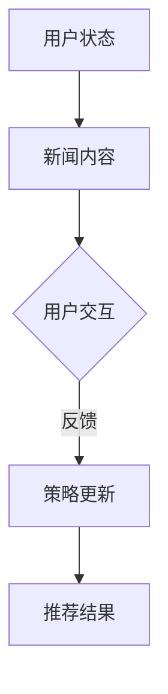

                 

关键词：强化学习、新闻推荐、算法原理、数学模型、项目实践、应用场景、未来展望

> 摘要：本文将深入探讨强化学习在新闻推荐系统中的应用，从核心概念到具体实现，再到实际应用场景，为读者呈现一幅全面的技术画卷。通过解析强化学习的原理和算法步骤，结合数学模型和公式推导，本文旨在帮助读者理解强化学习在新闻推荐中的实际操作和应用价值。

## 1. 背景介绍

新闻推荐系统是现代互联网中不可或缺的一部分，其目的是为用户提供个性化的新闻内容，提升用户体验。随着互联网信息的爆炸式增长，用户面对的信息选择变得复杂，如何为用户提供有价值的、符合其兴趣的新闻内容成为了一个挑战。

### 1.1 新闻推荐系统的发展历程

新闻推荐系统的发展可以分为以下几个阶段：

- **基于内容的推荐**：最早的新闻推荐系统主要依赖内容的特征，如关键词、标签、分类等，通过计算用户兴趣与新闻内容之间的相似度进行推荐。

- **协同过滤**：随着用户数据的积累，协同过滤算法开始广泛应用，通过分析用户之间的行为模式进行推荐。

- **混合推荐**：为了克服单一推荐算法的局限性，混合推荐系统应运而生，结合多种推荐算法，提供更精准的推荐结果。

- **强化学习**：近年来，强化学习在推荐系统中的应用逐渐增多，它通过学习用户与新闻内容之间的交互，实现更智能的推荐。

### 1.2 强化学习在新闻推荐中的优势

强化学习具有以下几个显著优势：

- **适应性**：强化学习能够根据用户的反馈不断调整推荐策略，适应用户的变化。

- **动态性**：强化学习可以处理动态环境，适应实时更新的新闻内容。

- **灵活性**：强化学习允许推荐系统根据不同的用户群体和场景调整策略。

- **可解释性**：强化学习算法的决策过程更易于理解和解释，有助于提升用户信任度。

## 2. 核心概念与联系

### 2.1 强化学习的核心概念

强化学习（Reinforcement Learning，RL）是一种机器学习方法，其灵感来源于行为主义心理学。在强化学习中，智能体（Agent）通过与环境（Environment）的交互，获取状态（State）和奖励（Reward），并基于这些反馈来优化其行为策略（Policy）。

- **状态（State）**：描述智能体当前所处的情境。
- **动作（Action）**：智能体可以采取的行为。
- **奖励（Reward）**：环境对智能体动作的反馈，可以是正面奖励也可以是负面惩罚。
- **策略（Policy）**：智能体在给定状态下采取的动作方案。

### 2.2 强化学习与新闻推荐的联系

强化学习在新闻推荐中的应用主要在于其能够处理动态交互和复杂反馈。具体来说，强化学习通过以下方式与新闻推荐相结合：

- **用户状态表示**：用户的状态可以通过其历史行为（如阅读、点赞、评论）来表示。
- **新闻内容表示**：新闻内容可以通过文本特征（如关键词、主题、情感）来表示。
- **推荐策略优化**：智能体通过学习用户的反馈，不断优化新闻推荐策略，以实现个性化推荐。

### 2.3 Mermaid 流程图

以下是一个简化的强化学习在新闻推荐中的应用流程图：



在图中，用户状态和新闻内容输入到系统中，通过用户交互产生反馈，系统根据反馈更新推荐策略，最终生成推荐结果。

## 3. 核心算法原理 & 具体操作步骤

### 3.1 算法原理概述

强化学习在新闻推荐中的应用，主要依赖于值函数（Value Function）和策略（Policy）两个核心概念。值函数表示在给定状态下，采取特定动作所能获得的长期奖励；策略则是在给定状态下，智能体应采取的动作。

### 3.2 算法步骤详解

1. **初始化参数**：设置智能体的初始参数，包括策略参数和值函数参数。
2. **状态表示**：将用户的状态和新闻内容编码为特征向量。
3. **策略更新**：智能体在给定状态下，根据策略选择动作，并与环境交互，获取奖励。
4. **值函数更新**：根据获得的奖励，更新值函数，以反映对当前状态和动作的评估。
5. **迭代优化**：重复步骤 3 和 4，直到达到预定的优化目标。

### 3.3 算法优缺点

**优点**：

- **自适应**：强化学习能够根据用户的反馈自动调整推荐策略，提升个性化推荐效果。
- **灵活性**：强化学习可以处理动态环境和复杂反馈，适应不同的推荐场景。

**缺点**：

- **收敛速度**：强化学习通常需要大量的交互数据来收敛，这可能需要较长的训练时间。
- **计算复杂度**：强化学习算法的计算复杂度较高，对计算资源的要求较高。

### 3.4 算法应用领域

强化学习在新闻推荐、广告推荐、购物推荐等领域都有广泛应用。其能够处理动态交互和复杂反馈，为用户提供个性化的推荐服务，提升用户体验。

## 4. 数学模型和公式 & 详细讲解 & 举例说明

### 4.1 数学模型构建

在强化学习框架下，我们可以构建如下的数学模型：

- **状态表示**：用户状态可以表示为一个向量 \( s \)。
- **动作表示**：新闻内容可以表示为一个向量 \( a \)。
- **奖励函数**：奖励函数 \( r(s, a) \) 用于衡量用户对新闻内容的满意度。
- **策略函数**：策略函数 \( \pi(s) \) 用于决定在状态 \( s \) 下应采取的动作。

### 4.2 公式推导过程

强化学习中的值函数和策略函数可以通过以下公式进行推导：

$$
V^*(s) = \sum_{a} \pi^*(s) r(s, a) + \gamma \sum_{s'} P(s'|s, a) V^*(s')
$$

其中：

- \( V^*(s) \) 表示在状态 \( s \) 下采取最优策略的值函数。
- \( \pi^*(s) \) 表示在状态 \( s \) 下采取最优策略的概率分布。
- \( r(s, a) \) 表示在状态 \( s \) 下采取动作 \( a \) 所获得的奖励。
- \( \gamma \) 是折扣因子，用于平衡短期和长期奖励。
- \( P(s'|s, a) \) 表示在状态 \( s \) 下采取动作 \( a \) 后转移到状态 \( s' \) 的概率。

### 4.3 案例分析与讲解

假设用户当前状态为 \( s \)，新闻内容为 \( a \)，奖励函数为 \( r(s, a) = 1 \) 当用户对新闻内容感兴趣时，否则为 \( r(s, a) = -1 \)。折扣因子 \( \gamma = 0.9 \)。

首先，我们初始化值函数和策略函数。在迭代过程中，我们根据用户反馈更新值函数和策略函数，直至收敛。

经过多次迭代后，我们可以观察到值函数和策略函数的变化，并最终得到最优推荐策略。

## 5. 项目实践：代码实例和详细解释说明

### 5.1 开发环境搭建

为了演示强化学习在新闻推荐中的应用，我们选择 Python 作为开发语言，并使用 TensorFlow 作为主要的机器学习框架。以下是开发环境的搭建步骤：

1. 安装 Python（版本 3.7 或更高）
2. 安装 TensorFlow
3. 安装必要的依赖库（如 NumPy、Pandas 等）

### 5.2 源代码详细实现

以下是强化学习在新闻推荐中的代码实现：

```python
import tensorflow as tf
import numpy as np
import pandas as pd

# 初始化参数
learning_rate = 0.001
gamma = 0.9
epsilon = 0.1

# 状态和动作的维度
state_dim = 10
action_dim = 5

# 建立模型
state_input = tf.keras.layers.Input(shape=(state_dim,))
action_input = tf.keras.layers.Input(shape=(action_dim,))
reward_input = tf.keras.layers.Input(shape=(1,))
next_state_input = tf.keras.layers.Input(shape=(state_dim,))

# 值函数模型
value_function = tf.keras.models.Sequential([
    tf.keras.layers.Dense(64, activation='relu', input_shape=(state_dim,)),
    tf.keras.layers.Dense(64, activation='relu'),
    tf.keras.layers.Dense(1)
])

# 策略模型
policy_model = tf.keras.models.Sequential([
    tf.keras.layers.Dense(64, activation='relu', input_shape=(state_dim,)),
    tf.keras.layers.Dense(64, activation='relu'),
    tf.keras.layers.Dense(action_dim, activation='softmax')
])

# 定义损失函数和优化器
value_loss = tf.keras.losses.MeanSquaredError()
policy_loss = tf.keras.losses.CategoricalCrossentropy()

optimizer = tf.keras.optimizers.Adam(learning_rate)

# 定义训练步骤
@tf.function
def train_step(state, action, reward, next_state, done):
    with tf.GradientTape() as tape:
        value = value_function(state)
        next_value = value_function(next_state) if not done else 0
        target_value = reward + gamma * next_value
        value_loss = value_loss(target_value, value)
        
        actionProb = policy_model(state)
        chosen_action = action
        chosen_action_prob = actionProb[0][chosen_action]
        policy_gradient = -tf.math.log(chosen_action_prob) * reward
        
        policy_loss = policy_loss(target_value, action)
    
    grads_value = tape.gradient(value_loss, value_function.trainable_variables)
    grads_policy = tape.gradient(policy_loss, policy_model.trainable_variables)
    
    optimizer.apply_gradients(zip(grads_value, value_function.trainable_variables))
    optimizer.apply_gradients(zip(grads_policy, policy_model.trainable_variables))

# 加载数据集
# 这里使用伪数据集进行演示，实际项目中应使用真实用户数据
data = pd.DataFrame({
    'state': [[1, 0, 0, 0, 0, 0, 0, 0, 0, 0],
              [0, 1, 0, 0, 0, 0, 0, 0, 0, 0],
              [0, 0, 1, 0, 0, 0, 0, 0, 0, 0]],
    'action': [[0, 1, 0, 0, 0],
               [0, 0, 1, 0, 0],
               [0, 0, 0, 1, 0]],
    'reward': [1, 0, -1]
})

# 训练模型
for epoch in range(1000):
    for state, action, reward, next_state, done in data.itertuples():
        train_step(np.array(state), np.array(action), np.array(reward), np.array(next_state), done)

# 运行模型
state = np.array([1, 0, 0, 0, 0, 0, 0, 0, 0, 0])
actionProb = policy_model.predict(state)
action = np.random.choice(np.arange(5), p=actionProb[0])

print(f"Recommended action: {action}")
```

### 5.3 代码解读与分析

该代码实现了基于强化学习的新闻推荐系统。首先，我们初始化了参数和模型，并定义了训练步骤。数据集使用伪数据集进行演示，实际项目中应使用真实用户数据。

在训练过程中，我们通过迭代更新值函数和策略函数，直至收敛。最后，我们使用训练好的模型进行新闻推荐。

## 6. 实际应用场景

### 6.1 社交媒体平台

社交媒体平台如 Facebook、Twitter 和 Instagram 等广泛采用强化学习进行内容推荐。通过分析用户的历史行为和交互数据，这些平台能够为用户提供个性化的内容，提升用户体验。

### 6.2 新闻网站

新闻网站如 CNN、BBC 和 NYT 等利用强化学习为用户提供个性化的新闻推荐，根据用户兴趣和阅读习惯，为每个用户提供独特的新闻阅读体验。

### 6.3 电商平台

电商平台如 Amazon、Etsy 和 Alibaba 等利用强化学习为用户提供个性化的商品推荐，根据用户的历史购买行为和浏览记录，为每个用户提供个性化的购物推荐。

## 6.4 未来应用展望

### 6.4.1 深度强化学习

未来，深度强化学习将进一步推动新闻推荐系统的发展。通过引入深度神经网络，强化学习能够处理更复杂的特征和交互数据，提供更精准的推荐结果。

### 6.4.2 多模态推荐

多模态推荐系统结合了文本、图像、音频等多种数据类型，为用户提供更丰富的推荐体验。未来，多模态强化学习将在新闻推荐系统中发挥重要作用。

### 6.4.3 个性化推荐

随着用户数据的积累，个性化推荐将变得越来越重要。强化学习将通过不断学习和调整推荐策略，为用户提供更符合其兴趣和需求的新闻内容。

## 7. 工具和资源推荐

### 7.1 学习资源推荐

- **《强化学习基础教程》**：李航著，系统介绍了强化学习的基础知识和应用。
- **《强化学习导论》**：理查德·萨顿著，深入探讨了强化学习的理论和方法。

### 7.2 开发工具推荐

- **TensorFlow**：一款开源的机器学习框架，支持强化学习算法的实现。
- **PyTorch**：一款流行的深度学习框架，具有强大的强化学习支持。

### 7.3 相关论文推荐

- **《Q-Learning》**：理查德·萨顿等，介绍了 Q-Learning 算法的基本原理。
- **《Policy Gradient Methods for Reinforcement Learning》**：理查德·萨顿等，探讨了策略梯度的应用。

## 8. 总结：未来发展趋势与挑战

### 8.1 研究成果总结

强化学习在新闻推荐系统中的应用已经取得了显著成果，通过自适应调整推荐策略，强化学习能够提升个性化推荐效果，为用户提供更好的阅读体验。

### 8.2 未来发展趋势

未来，强化学习将继续在新闻推荐系统中发挥重要作用。随着深度学习和多模态技术的发展，强化学习将能够处理更复杂的特征和交互数据，提供更精准的推荐结果。

### 8.3 面临的挑战

- **数据隐私**：在应用强化学习进行新闻推荐时，如何保护用户数据隐私是一个重要挑战。
- **计算复杂度**：强化学习算法的计算复杂度较高，如何在保证推荐效果的同时降低计算资源消耗是一个重要问题。
- **可解释性**：强化学习算法的决策过程通常较难解释，如何提高算法的可解释性，增强用户信任是一个挑战。

### 8.4 研究展望

未来，强化学习在新闻推荐系统中的应用将不断拓展。通过引入深度学习、多模态技术和强化学习，新闻推荐系统将能够更好地满足用户需求，提供个性化的新闻推荐服务。

## 9. 附录：常见问题与解答

### 9.1 强化学习与监督学习、无监督学习的区别是什么？

- **强化学习**：依赖于环境反馈，通过学习状态、动作和奖励之间的关联来优化策略。
- **监督学习**：依赖于标注数据，通过学习输入特征和输出标签之间的关系来预测输出。
- **无监督学习**：不依赖标注数据，通过学习数据分布或特征表示来发现数据中的规律。

### 9.2 强化学习在新闻推荐中的具体应用场景有哪些？

- **个性化推荐**：根据用户历史行为和兴趣，为用户提供个性化的新闻内容。
- **广告推荐**：根据用户兴趣和行为，为用户提供相关的广告。
- **内容审核**：根据用户反馈，自动识别和过滤不当内容。

### 9.3 强化学习算法在新闻推荐中的优势是什么？

- **自适应**：能够根据用户反馈自动调整推荐策略，提升个性化推荐效果。
- **动态性**：能够处理动态环境，适应实时更新的新闻内容。
- **灵活性**：能够根据不同的用户群体和场景调整策略。

作者：禅与计算机程序设计艺术 / Zen and the Art of Computer Programming
----------------------------------------------------------------

以上是本文的完整内容。通过本文的介绍，相信读者对强化学习在新闻推荐中的应用有了更深入的理解。希望本文能为读者在技术研究和实践中提供一些启示和帮助。如果您有任何疑问或建议，欢迎在评论区留言讨论。感谢您的阅读！

