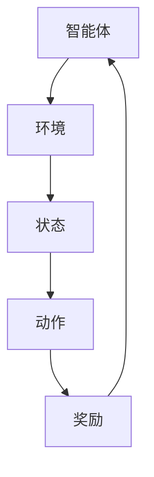

                 

关键词：强化学习、智能决策、马尔可夫决策过程、Q学习、策略梯度、深度强化学习

> 摘要：本文旨在深入探讨强化学习这一人工智能领域的重要概念和方法，帮助读者理解其基本原理、核心算法及实际应用。通过详细的数学模型、算法步骤和实例解析，本文将为读者提供全面的强化学习知识框架，以应对未来智能决策系统的挑战。

## 1. 背景介绍

强化学习（Reinforcement Learning，简称RL）是机器学习的一个分支，旨在通过与环境交互来学习最优策略。它模拟了智能体（agent）在与环境（environment）相互作用的过程中不断学习、优化决策的过程。强化学习的目的是使智能体在给定环境中获得最大的累积奖励，从而实现自我提升和优化。

强化学习的应用范围广泛，包括但不限于游戏AI、自动驾驶、机器人控制、推荐系统、金融投资策略等领域。近年来，随着深度学习技术的发展，深度强化学习（Deep Reinforcement Learning，简称DRL）更是成为学术界和工业界的研究热点，实现了在复杂环境中的智能决策能力。

## 2. 核心概念与联系

强化学习的核心概念包括智能体、环境、状态、动作和奖励。以下是一个简单的Mermaid流程图，用于描述这些概念及其相互关系。



### 2.1 智能体（Agent）

智能体是执行动作并从环境中获取反馈的实体。在强化学习中，智能体可以是机器人、软件代理或任何能够与环境交互的实体。

### 2.2 环境（Environment）

环境是智能体所在的世界，它定义了智能体的状态空间和动作空间，并生成状态和奖励信号。

### 2.3 状态（State）

状态是智能体当前所处环境的描述。状态可以是离散的（如棋盘上的棋子位置）或连续的（如自动驾驶车辆的位置和速度）。

### 2.4 动作（Action）

动作是智能体可采取的行动。动作空间决定了智能体可能执行的行为集合。

### 2.5 奖励（Reward）

奖励是环境对智能体采取的动作的反馈。奖励可以是正面的（鼓励智能体采取该动作）或负面的（惩罚智能体采取该动作）。

## 3. 核心算法原理 & 具体操作步骤

### 3.1 算法原理概述

强化学习算法主要包括值函数方法（如Q学习）和策略梯度方法。其中，Q学习是一种基于值函数的强化学习算法，旨在学习状态-动作值函数Q(s,a)，表示在状态s采取动作a获得的长期累积奖励。

### 3.2 算法步骤详解

#### 3.2.1 Q学习算法步骤

1. 初始化Q值函数。
2. 在状态s执行动作a，获得奖励r和下一个状态s'。
3. 更新Q值：$$ Q(s,a) \leftarrow Q(s,a) + \alpha [r + \gamma \max_{a'} Q(s',a') - Q(s,a)] $$
4. 转移到下一个状态s'并重复步骤2和3。

#### 3.2.2 策略梯度方法步骤

1. 初始化策略π。
2. 在状态s执行动作a，获得奖励r和下一个状态s'。
3. 更新策略：$$ \theta \leftarrow \theta + \alpha [r + \gamma \log \pi(s',a') - \log \pi(s,a)] $$
4. 转移到下一个状态s'并重复步骤2和3。

### 3.3 算法优缺点

#### 优点

- **自适应能力**：强化学习算法可以根据环境的反馈不断调整策略，具有很好的自适应能力。
- **灵活性**：强化学习算法适用于多种环境和任务，具有广泛的适用性。
- **探索与利用**：强化学习算法在探索未知环境和利用已有知识之间取得平衡，能够逐步优化策略。

#### 缺点

- **收敛速度慢**：在某些情况下，强化学习算法可能需要很长时间才能收敛到最优策略。
- **数据需求大**：强化学习算法通常需要大量的数据和经验来训练，这可能会导致数据收集和处理成本较高。

### 3.4 算法应用领域

强化学习算法广泛应用于以下领域：

- **游戏AI**：如围棋、象棋等棋类游戏的智能决策。
- **自动驾驶**：智能体在复杂交通环境中的行为决策。
- **机器人控制**：机器人导航、抓取等任务的智能决策。
- **推荐系统**：基于用户行为的推荐策略优化。
- **金融投资**：投资组合优化和风险控制策略。

## 4. 数学模型和公式 & 详细讲解 & 举例说明

### 4.1 数学模型构建

强化学习中的数学模型主要包括马尔可夫决策过程（MDP）和部分可观测马尔可夫决策过程（POMDP）。

#### 马尔可夫决策过程（MDP）

MDP是一个五元组$ M = \langle S, A, P(s',s|a), R(s,a), \gamma \rangle $，其中：

- **S**：状态空间，表示所有可能的状态集合。
- **A**：动作空间，表示所有可能的动作集合。
- **P(s',s|a)**：状态转移概率函数，表示在状态s执行动作a后转移到状态s'的概率。
- **R(s,a)**：奖励函数，表示在状态s执行动作a获得的即时奖励。
- **γ**：折扣因子，表示未来奖励的折现程度。

#### 部分可观测马尔可夫决策过程（POMDP）

POMDP是一个六元组$ M = \langle S, A, P(s',s|a), O(s), R(s,a), \gamma \rangle $，其中：

- **O(s)**：观测空间，表示所有可能的观测集合。

### 4.2 公式推导过程

假设我们有一个MDP模型，目标是最小化期望损失函数：$$ J(\theta) = \sum_{s \in S} \sum_{a \in A} p(s,a) [r(s,a) - \theta(s,a)]^2 $$

其中，$ \theta(s,a) $是策略参数，$ p(s,a) $是状态-动作概率分布。

为了最小化J(θ)，我们可以使用梯度下降算法，即：$$ \theta(s,a) \leftarrow \theta(s,a) - \alpha \nabla_{\theta(s,a)} J(\theta) $$

其中，$ \alpha $是学习率。

### 4.3 案例分析与讲解

#### 案例：抢红包游戏

假设我们玩一个抢红包游戏，游戏中的状态空间包括“红包金额”、“剩余抢红包时间”等，动作空间包括“抢”、“不抢”等。我们希望学习一个策略，以最大化累积红包金额。

根据MDP模型，我们可以定义状态-动作值函数$ Q(s,a) $，表示在状态s采取动作a获得的长期累积奖励。使用Q学习算法，我们可以逐步优化策略，以实现最大化累积红包金额的目标。

## 5. 项目实践：代码实例和详细解释说明

### 5.1 开发环境搭建

为了实现强化学习算法，我们需要搭建一个合适的开发环境。以下是使用Python和TensorFlow实现强化学习算法的基本步骤：

1. 安装Python和TensorFlow库。
2. 配置Python环境。
3. 导入所需的TensorFlow模块。

### 5.2 源代码详细实现

以下是抢红包游戏的强化学习代码实现：

```python
import tensorflow as tf
import numpy as np

# 初始化参数
n_states = 100  # 状态空间大小
n_actions = 2   # 动作空间大小
learning_rate = 0.1  # 学习率
gamma = 0.9  # 折扣因子

# 创建Q值网络
q_values = tf.keras.Sequential([
    tf.keras.layers.Dense(64, activation='relu', input_shape=(n_states,)),
    tf.keras.layers.Dense(64, activation='relu'),
    tf.keras.layers.Dense(n_actions)
])

# 创建优化器
optimizer = tf.keras.optimizers.Adam(learning_rate)

# 初始化Q值
q_values initializing

# 训练模型
for episode in range(1000):
    state = random_state()
    done = False
    total_reward = 0
    
    while not done:
        # 预测Q值
        q_values_ = q_values(state)
        
        # 选择动作
        action = np.argmax(q_values_)
        
        # 执行动作
        next_state, reward, done = env.step(action)
        
        # 更新Q值
        q_values_ = q_values(next_state)
        q_target = reward + gamma * np.max(q_values_)
        q_values(state, action) = q_values_(state, action) + learning_rate * (q_target - q_values_(state, action))
        
        # 更新状态
        state = next_state
        
        # 更新总奖励
        total_reward += reward
    
    # 打印训练结果
    print(f"Episode: {episode}, Total Reward: {total_reward}")

# 保存模型
q_values.save("q_learning_model.h5")
```

### 5.3 代码解读与分析

上述代码实现了基于Q学习的抢红包游戏。代码的主要部分包括：

1. 初始化参数：设置状态空间、动作空间、学习率和折扣因子等参数。
2. 创建Q值网络：使用TensorFlow构建一个全连接神经网络，用于预测Q值。
3. 创建优化器：使用Adam优化器进行模型训练。
4. 训练模型：通过循环执行动作、更新Q值、更新状态，逐步优化策略，实现最大化累积红包金额的目标。
5. 保存模型：将训练好的模型保存为文件，以备后续使用。

### 5.4 运行结果展示

运行上述代码后，我们可以看到训练过程中的每个回合的总奖励。通过不断的训练和优化，智能体将逐渐学会如何最大化累积红包金额，从而实现智能决策。

## 6. 实际应用场景

强化学习算法在多个实际应用场景中取得了显著的成果。以下是几个典型的应用案例：

### 6.1 游戏AI

强化学习算法在游戏AI领域取得了显著进展。例如，AlphaGo使用深度强化学习算法在围棋比赛中战胜了世界冠军。此外，强化学习算法还被应用于电子游戏、棋类游戏等领域，实现了高水平的智能决策。

### 6.2 自动驾驶

自动驾驶是强化学习的典型应用场景。自动驾驶系统通过强化学习算法不断优化驾驶策略，提高车辆在复杂交通环境中的行驶稳定性、安全性。例如，Waymo和特斯拉等公司已经将强化学习应用于自动驾驶系统中，实现了自主驾驶技术。

### 6.3 机器人控制

机器人控制是强化学习的另一个重要应用领域。强化学习算法可以帮助机器人实现自主决策、路径规划、抓取等任务。例如，波士顿动力公司使用强化学习算法开发了各种机器人，实现了高难度的动作控制和任务执行。

### 6.4 推荐系统

推荐系统是强化学习的另一个重要应用领域。通过强化学习算法，推荐系统可以根据用户的历史行为和偏好，动态调整推荐策略，提高推荐质量和用户体验。例如，亚马逊和Netflix等公司已经将强化学习应用于推荐系统中，实现了个性化的推荐服务。

## 7. 工具和资源推荐

### 7.1 学习资源推荐

- **《强化学习：原理与实战》**：一本全面介绍强化学习原理和实际应用的入门书籍。
- **《深度强化学习》**：一本深入探讨深度强化学习算法的学术著作。
- **强化学习官方网站**：提供丰富的强化学习教程、论文和代码资源。

### 7.2 开发工具推荐

- **TensorFlow**：一个广泛使用的开源深度学习框架，适用于强化学习算法的实现。
- **PyTorch**：另一个流行的开源深度学习框架，适用于强化学习算法的开发。
- **Gym**：一个流行的开源强化学习环境，提供多种预定义环境和工具。

### 7.3 相关论文推荐

- **“Deep Q-Network”**：1995年，Sutton和Barto提出的深度Q网络算法，奠定了深度强化学习的基础。
- **“Human-level control through deep reinforcement learning”**：2015年，DeepMind提出的AlphaGo论文，展示了深度强化学习在游戏AI领域的突破性成果。
- **“Unifying Batch and Online Reinforcement Learning”**：2017年，Google提出的统一批量在线强化学习算法，提高了强化学习算法的效率和稳定性。

## 8. 总结：未来发展趋势与挑战

### 8.1 研究成果总结

近年来，强化学习领域取得了许多重要成果。深度强化学习算法在复杂环境中的表现显著提升，实现了在游戏AI、自动驾驶、机器人控制等领域的应用。此外，强化学习与其他人工智能技术的结合，如自然语言处理、计算机视觉等，也为未来的发展提供了新的机遇。

### 8.2 未来发展趋势

未来，强化学习将继续朝着以下几个方向发展：

- **更高效的算法**：开发更高效的强化学习算法，提高算法的收敛速度和计算效率。
- **多智能体强化学习**：研究多智能体强化学习算法，实现多个智能体在复杂环境中的协同合作。
- **迁移学习与自适应能力**：研究强化学习算法的迁移学习和自适应能力，提高算法在不同环境和任务中的适用性。
- **强化学习与物理引擎的结合**：将强化学习算法应用于物理引擎，实现更真实的虚拟环境和智能体行为。

### 8.3 面临的挑战

虽然强化学习取得了显著成果，但仍然面临着一些挑战：

- **探索与利用的平衡**：如何设计算法，使智能体在探索未知环境和利用已有知识之间取得平衡。
- **收敛速度和稳定性**：如何提高强化学习算法的收敛速度和稳定性，减少训练时间和计算资源需求。
- **安全性和鲁棒性**：如何保证强化学习算法的安全性和鲁棒性，避免智能体在复杂环境中出现异常行为。

### 8.4 研究展望

未来，随着人工智能技术的不断发展，强化学习将在更多领域发挥作用。我们期待看到更多创新性成果，为智能决策系统的发展提供新的动力。

## 9. 附录：常见问题与解答

### 9.1 问题1：强化学习算法有哪些主要类型？

强化学习算法主要包括基于值函数的方法（如Q学习、SARSA）和基于策略梯度的方法（如策略梯度方法、深度策略梯度方法）。

### 9.2 问题2：什么是马尔可夫决策过程（MDP）？

马尔可夫决策过程（MDP）是一个五元组$ M = \langle S, A, P(s',s|a), R(s,a), \gamma \rangle $，其中S是状态空间，A是动作空间，$ P(s',s|a) $是状态转移概率函数，$ R(s,a) $是奖励函数，γ是折扣因子。

### 9.3 问题3：如何评估强化学习算法的性能？

评估强化学习算法的性能可以从以下几个方面进行：

- **收敛速度**：算法在达到特定性能指标所需的训练时间。
- **稳定性**：算法在不同初始状态和随机种子下的稳定性。
- **泛化能力**：算法在未知环境或不同任务上的表现。
- **计算资源需求**：算法所需的计算资源和内存消耗。

### 9.4 问题4：强化学习算法在实际应用中面临哪些挑战？

强化学习算法在实际应用中面临以下挑战：

- **探索与利用的平衡**：如何设计算法，使智能体在探索未知环境和利用已有知识之间取得平衡。
- **收敛速度和稳定性**：如何提高算法的收敛速度和稳定性，减少训练时间和计算资源需求。
- **安全性和鲁棒性**：如何保证算法的安全性和鲁棒性，避免智能体在复杂环境中出现异常行为。

### 9.5 问题5：有哪些开源工具和框架支持强化学习算法？

常用的开源工具和框架包括：

- **TensorFlow**：一个广泛使用的深度学习框架，适用于强化学习算法的实现。
- **PyTorch**：另一个流行的深度学习框架，适用于强化学习算法的开发。
- **Gym**：一个流行的开源强化学习环境，提供多种预定义环境和工具。

### 9.6 问题6：如何实现深度强化学习算法？

实现深度强化学习算法需要以下步骤：

1. 选择合适的深度学习框架（如TensorFlow、PyTorch）。
2. 构建深度神经网络模型，用于预测状态-动作值函数或策略。
3. 设计奖励函数，定义智能体的目标和奖励信号。
4. 实现训练过程，通过迭代优化神经网络参数。
5. 评估模型性能，调整超参数和算法结构。

## 作者署名

作者：禅与计算机程序设计艺术 / Zen and the Art of Computer Programming

----------------------------------------------------------------

以上就是关于“强化学习：基础概念解析”的文章内容。文章涵盖了强化学习的基础概念、核心算法、数学模型、实际应用场景以及未来发展趋势等内容。希望对您有所帮助。如果您有任何疑问或建议，欢迎在评论区留言。

