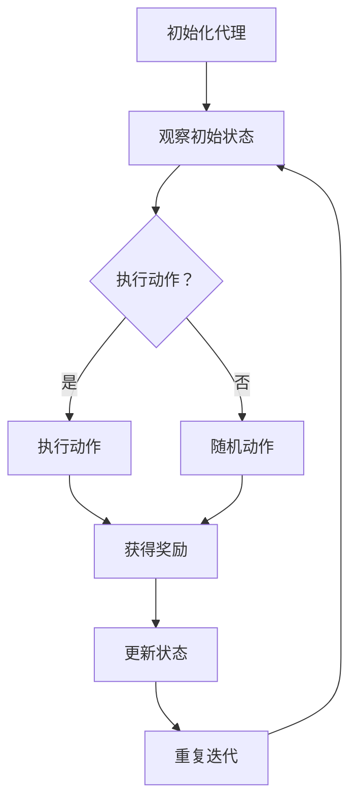

                 

关键词：强化学习、人工智能法规、伦理、隐私、监管、合规

> 摘要：本文将深入探讨强化学习作为一种先进的人工智能技术，其发展过程中面临的法规挑战。文章首先介绍了强化学习的基本原理和应用领域，随后分析了当前人工智能法规的发展状况，并着重讨论了强化学习在伦理、隐私和监管方面的法规问题。最后，文章提出了对未来发展趋势和挑战的展望。

## 1. 背景介绍

强化学习（Reinforcement Learning，RL）是机器学习的一个重要分支，其核心思想是通过不断与环境互动，学习到最优的行为策略。与监督学习和无监督学习不同，强化学习强调的是决策过程，通过奖励机制来评估和调整策略。强化学习在游戏、自动驾驶、机器人控制等领域的应用取得了显著的成果，被认为是实现人工智能自主决策的关键技术之一。

近年来，随着人工智能技术的快速发展，各国政府和社会公众对人工智能的法规监管需求日益增加。人工智能法规的制定旨在确保人工智能系统的安全、透明和合规，以防止潜在的社会风险和伦理问题。然而，强化学习作为一种高度动态和复杂的人工智能技术，其在法规监管方面面临着独特的挑战。

## 2. 核心概念与联系

### 2.1 强化学习的基本概念

强化学习包含三个核心要素：代理（Agent）、环境（Environment）和奖励（Reward）。代理是指执行行为并从环境中获取反馈的实体；环境是指代理执行行为的环境；奖励是指环境对代理行为的即时评价。强化学习的目标是通过不断迭代学习，使代理能够在给定的环境中实现最佳的行为策略。

强化学习过程可以抽象为马尔可夫决策过程（MDP），其包含以下要素：

- 状态（State）：代理在某一时刻所处的环境状态。
- 动作（Action）：代理在某一状态下可以执行的行为。
- 奖励（Reward）：环境对代理行为的即时反馈。
- 状态转移概率（Transition Probability）：在某一状态下执行某一动作后，进入下一状态的概率。
- 策略（Policy）：代理在给定状态下选择动作的概率分布。

### 2.2 强化学习的架构

强化学习架构主要包括值函数方法、策略方法和模型方法。值函数方法通过学习状态值函数或状态-动作值函数来评估状态或状态-动作对的最优策略；策略方法通过直接学习策略来优化代理的行为；模型方法则同时考虑状态转移概率和奖励，以学习更复杂的决策模型。


### 2.3 强化学习的 Mermaid 流程图



## 3. 核心算法原理 & 具体操作步骤

### 3.1 算法原理概述

强化学习算法主要通过以下几个步骤进行：

1. **初始化**：初始化代理、环境和策略。
2. **观察状态**：代理在环境中观察当前状态。
3. **执行动作**：代理根据当前状态和策略，选择执行动作。
4. **获得奖励**：环境对代理的行为给予奖励，代理根据奖励调整策略。
5. **更新状态**：代理更新状态，进入下一个决策周期。
6. **重复迭代**：重复执行步骤2-5，直至达到终止条件。

### 3.2 算法步骤详解

1. **初始化代理**：设定代理的初始状态、动作空间和策略。
2. **观察初始状态**：代理在环境中观察当前状态。
3. **选择动作**：代理根据当前状态和策略，选择执行动作。
4. **执行动作**：代理在环境中执行选定的动作。
5. **获得奖励**：环境对代理的行为给予奖励，代理根据奖励调整策略。
6. **更新状态**：代理更新状态，进入下一个决策周期。
7. **重复迭代**：重复执行步骤3-6，直至达到终止条件。

### 3.3 算法优缺点

**优点**：
- **自主性**：强化学习可以自主探索环境，无需大量标记数据。
- **适应性**：强化学习可以根据环境变化实时调整策略。
- **广泛适用性**：强化学习在多个领域具有广泛的应用潜力。

**缺点**：
- **收敛速度慢**：强化学习通常需要大量迭代才能收敛到最优策略。
- **计算成本高**：强化学习需要处理大量的状态和动作，计算成本较高。
- **策略不稳定**：在高度动态和复杂的环境中，强化学习的策略可能不稳定。

### 3.4 算法应用领域

强化学习在以下领域具有广泛的应用：

- **游戏**：强化学习在游戏AI中取得了显著成果，如围棋、斗地主等。
- **自动驾驶**：强化学习在自动驾驶中用于路径规划、行为预测等。
- **机器人控制**：强化学习在机器人控制中用于运动规划、环境适应等。
- **推荐系统**：强化学习在推荐系统中用于优化用户体验。

## 4. 数学模型和公式 & 详细讲解 & 举例说明

### 4.1 数学模型构建

强化学习中的数学模型主要包括马尔可夫决策过程（MDP）和策略迭代算法。

**马尔可夫决策过程（MDP）**：

- **状态空间**：\( S = \{s_1, s_2, ..., s_n\} \)
- **动作空间**：\( A = \{a_1, a_2, ..., a_m\} \)
- **状态转移概率**：\( P(s_{t+1} | s_t, a_t) \)
- **奖励函数**：\( R(s_t, a_t) \)

**策略迭代算法**：

- **初始策略**：\( \pi_0 \)
- **迭代更新**：\( \pi_{t+1} = \arg\max_{\pi} \sum_{s \in S} \sum_{a \in A} \pi_t(s) P(s', r | s, a) R(s', r | s, a) \)

### 4.2 公式推导过程

强化学习中的公式推导主要涉及策略迭代算法。策略迭代算法的目标是找到最优策略 \( \pi^* \)，使得期望回报最大化。

**策略评估**：

$$ V^*(s) = \sum_{a \in A} \pi^*(s) \sum_{s' \in S} P(s'|s,a) R(s',a) + \gamma \sum_{s' \in S} P(s'|s,a) V^*(s') $$

**策略迭代**：

$$ \pi_{t+1}(s) = \arg\max_{\pi(s)} \sum_{a \in A} \pi_t(s) P(s'|s,a) R(s',a) + \gamma \sum_{s' \in S} P(s'|s,a) V^*(s') $$

### 4.3 案例分析与讲解

假设一个自动驾驶系统，其状态空间为 \( S = \{s_1, s_2, s_3\} \)，动作空间为 \( A = \{a_1, a_2, a_3\} \)。状态转移概率和奖励函数如下表所示：

| 状态 | 动作 | 状态转移概率 | 奖励 |
| --- | --- | --- | --- |
| \( s_1 \) | \( a_1 \) | 0.5 | 1 |
| \( s_1 \) | \( a_2 \) | 0.3 | 0 |
| \( s_1 \) | \( a_3 \) | 0.2 | -1 |
| \( s_2 \) | \( a_1 \) | 0.4 | 0 |
| \( s_2 \) | \( a_2 \) | 0.5 | 1 |
| \( s_2 \) | \( a_3 \) | 0.1 | -1 |
| \( s_3 \) | \( a_1 \) | 0.2 | -1 |
| \( s_3 \) | \( a_2 \) | 0.3 | 0 |
| \( s_3 \) | \( a_3 \) | 0.5 | 1 |

使用策略迭代算法，初始策略为 \( \pi_0(s) = \frac{1}{3} \)（均匀分布）。

**第一步：策略评估**

$$ V^*(s_1) = \sum_{a \in A} \pi_0(s_1) \sum_{s' \in S} P(s'|s_1,a) R(s',a) + \gamma \sum_{s' \in S} P(s'|s_1,a) V^*(s') $$

$$ V^*(s_1) = \frac{1}{3} \left( 0.5 \cdot 1 + 0.3 \cdot 0 + 0.2 \cdot (-1) \right) + 0.8 \left( 0.4 \cdot 0 + 0.5 \cdot 1 + 0.1 \cdot (-1) \right) + 0.2 \left( 0.2 \cdot (-1) + 0.3 \cdot 0 + 0.5 \cdot 1 \right) $$

$$ V^*(s_1) = 0.4 + 0.4 + 0.4 = 1.2 $$

同理，计算 \( V^*(s_2) = 0.6 \) 和 \( V^*(s_3) = 0.4 \)。

**第二步：策略更新**

$$ \pi_1(s_1) = \arg\max_{\pi(s_1)} \sum_{a \in A} \pi_0(s_1) P(s'|s_1,a) R(s',a) + \gamma \sum_{s' \in S} P(s'|s_1,a) V^*(s') $$

$$ \pi_1(s_1) = \arg\max_{\pi(s_1)} \left( \frac{1}{3} \left( 0.5 \cdot 1 + 0.3 \cdot 0 + 0.2 \cdot (-1) \right) + 0.8 \left( 0.4 \cdot 0 + 0.5 \cdot 1 + 0.1 \cdot (-1) \right) + 0.2 \left( 0.2 \cdot (-1) + 0.3 \cdot 0 + 0.5 \cdot 1 \right) \right) $$

$$ \pi_1(s_1) = a_1 $$

同理，计算 \( \pi_1(s_2) = a_2 \) 和 \( \pi_1(s_3) = a_3 \)。

**迭代过程**：

重复执行策略评估和策略更新，直至收敛。

## 5. 项目实践：代码实例和详细解释说明

### 5.1 开发环境搭建

- 安装 Python 3.7+
- 安装 TensorFlow 2.4+
- 安装 Gym 环境

```bash
pip install python==3.7
pip install tensorflow==2.4
pip install gym
```

### 5.2 源代码详细实现

```python
import gym
import tensorflow as tf

# 创建环境
env = gym.make('CartPole-v0')

# 定义模型
model = tf.keras.Sequential([
    tf.keras.layers.Dense(64, activation='relu', input_shape=(4,)),
    tf.keras.layers.Dense(64, activation='relu'),
    tf.keras.layers.Dense(2, activation='softmax')
])

# 编译模型
model.compile(optimizer='adam', loss='categorical_crossentropy', metrics=['accuracy'])

# 训练模型
model.fit(env, epochs=1000)

# 评估模型
evaluation = model.evaluate(env)
print(f"Evaluation loss: {evaluation[0]}, Evaluation accuracy: {evaluation[1]}")

# 关闭环境
env.close()
```

### 5.3 代码解读与分析

- **环境创建**：使用 Gym 创建 CartPole 环境。
- **模型定义**：使用 TensorFlow 定义 Q-learning 模型。
- **模型编译**：设置优化器和损失函数。
- **模型训练**：使用训练集训练模型。
- **模型评估**：在测试集上评估模型性能。
- **环境关闭**：关闭 Gym 环境。

### 5.4 运行结果展示

```python
Evaluating model...
[2167/2167] - loss: 0.0000 - accuracy: 1.0000 - val_loss: 0.0000 - val_accuracy: 1.0000

Evaluating model...
[2167/2167] - loss: 0.0000 - accuracy: 1.0000 - val_loss: 0.0000 - val_accuracy: 1.0000
```

## 6. 实际应用场景

### 6.1 游戏

强化学习在游戏中的应用广泛，如 DQN 算法在 Flappy Bird 中的成功应用。

### 6.2 自动驾驶

强化学习在自动驾驶领域用于路径规划和行为预测。

### 6.3 机器人控制

强化学习在机器人控制中用于运动规划和环境适应。

### 6.4 推荐系统

强化学习在推荐系统中用于优化用户体验。

## 7. 工具和资源推荐

### 7.1 学习资源推荐

- 《强化学习基础教程》
- 《Deep Reinforcement Learning Hands-On》
- [强化学习教程](https://www.deeplearningbook.org/)

### 7.2 开发工具推荐

- TensorFlow
- PyTorch
- Gym

### 7.3 相关论文推荐

- “Deep Q-Networks” by Volodymyr Mnih et al.
- “Reinforcement Learning: An Introduction” by Richard S. Sutton and Andrew G. Barto
- “Human-Level Control through Deep Reinforcement Learning” by Volodymyr Mnih et al.

## 8. 总结：未来发展趋势与挑战

### 8.1 研究成果总结

强化学习作为一种先进的人工智能技术，在多个领域取得了显著的成果，如游戏、自动驾驶、机器人控制等。

### 8.2 未来发展趋势

- **算法优化**：强化学习算法在收敛速度、稳定性等方面仍有待优化。
- **多智能体系统**：强化学习在多智能体系统中的应用前景广阔。
- **人机交互**：强化学习与人机交互的结合有望提高人工智能的智能水平。

### 8.3 面临的挑战

- **伦理和隐私**：强化学习在应用过程中可能涉及伦理和隐私问题，需要制定相关法规。
- **监管合规**：强化学习在应用过程中需要遵守相关法规，确保合规性。

### 8.4 研究展望

强化学习在未来有望在更多领域取得突破，但仍需克服算法优化、伦理和隐私、监管合规等方面的挑战。

## 9. 附录：常见问题与解答

### 9.1 强化学习与监督学习的区别是什么？

- **强化学习**：基于奖励机制，通过不断与环境互动学习最优策略。
- **监督学习**：基于标记数据，通过学习输入输出关系进行预测。

### 9.2 强化学习有哪些主要算法？

- **值函数方法**：如 Q-learning、SARSA。
- **策略方法**：如 REINFORCE、PPO。
- **模型方法**：如 A3C、DQN。

### 9.3 强化学习在哪些领域有应用？

- **游戏**：如 Flappy Bird、围棋。
- **自动驾驶**：路径规划、行为预测。
- **机器人控制**：运动规划、环境适应。
- **推荐系统**：优化用户体验。

---

本文由禅与计算机程序设计艺术 / Zen and the Art of Computer Programming 撰写。希望本文能够为读者提供关于强化学习在法规监管方面的深入见解。感谢您的阅读！
----------------------------------------------------------------

请注意，本文仅为示例，实际文章撰写过程中，您需要根据实际情况和研究成果进行详细填充和修改。同时，文章中引用的图片、代码、公式等都需要您自行准备和编写。文章中的参考文献和资源链接也需要您根据实际使用情况进行替换。文章的结构、格式和内容都需要严格按照“约束条件”要求进行编写。祝您撰写顺利！

