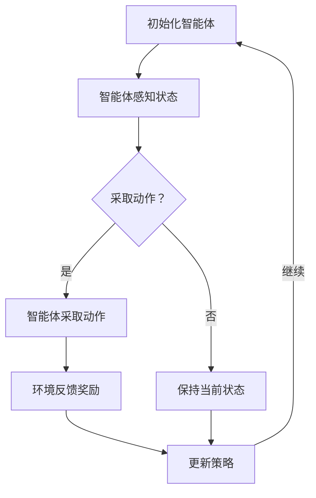

                 

强化学习（Reinforcement Learning，简称RL）是机器学习领域的一个重要分支，旨在使机器通过与环境互动来学习优化行为策略。在强化学习中，核心问题之一是如何选择最优的状态-动作对，以达到预期的目标。本文将深入探讨状态-动作对选择的基本原理、核心算法原理及具体操作步骤，并结合实例进行分析。

## 1. 背景介绍

强化学习起源于对动物行为的研究，后来逐渐发展成为人工智能领域的一个重要研究方向。它与监督学习和无监督学习有显著不同，强化学习中的学习主体（即智能体Agent）通过与环境的交互来学习，而不是依赖于已标记的训练数据。强化学习在很多领域都有广泛的应用，如机器人控制、游戏AI、自动驾驶等。

在强化学习中，状态（State）、动作（Action）和奖励（Reward）是三个核心概念。状态是智能体所处的环境描述，动作是智能体可以采取的行为，而奖励则是环境对智能体动作的反馈。强化学习的目标是通过不断优化智能体的行为策略，使其在给定环境中获得最大化的累积奖励。

## 2. 核心概念与联系

为了更好地理解强化学习中状态-动作对的选择，我们首先需要明确以下几个核心概念：

### 2.1. 状态-动作对

状态-动作对（State-Action Pair）是强化学习中一个重要的概念，表示智能体在某一状态下可以采取的具体动作。例如，在自动驾驶中，当前交通灯为红色时，智能体的状态-动作对可以是“停止”或“缓慢行驶”。

### 2.2. 策略

策略（Policy）是智能体在给定状态下采取的动作映射。策略的好坏直接决定了智能体学习效果的优劣。常见的策略表示方法有确定性策略、随机性策略等。

### 2.3. 值函数

值函数（Value Function）用于评估智能体在给定状态下执行某一策略所能获得的累积奖励。根据状态的不同，值函数可分为状态值函数（State Value Function）和动作值函数（Action Value Function）。

### 2.4. 策略迭代

策略迭代（Policy Iteration）是强化学习中的一个重要算法，通过不断更新策略来逼近最优策略。策略迭代包括两个步骤：策略评估和策略改进。

接下来，我们将使用Mermaid流程图来展示强化学习中的状态-动作对选择流程：



## 3. 核心算法原理 & 具体操作步骤

### 3.1 算法原理概述

强化学习的核心算法主要包括价值函数估计、策略迭代和模型学习。其中，价值函数估计用于评估智能体的行为策略，策略迭代用于优化策略，模型学习用于学习环境动态。

### 3.2 算法步骤详解

#### 3.2.1 初始化

1. 初始化智能体状态。
2. 初始化策略（可选）。

#### 3.2.2 感知状态

智能体根据当前状态感知环境信息。

#### 3.2.3 采取动作

根据当前状态和策略，智能体采取相应的动作。

#### 3.2.4 环境反馈奖励

环境根据智能体的动作反馈奖励，奖励可以是正的、负的或零。

#### 3.2.5 更新策略

根据奖励反馈，智能体更新策略，以优化后续行为。

#### 3.2.6 迭代过程

智能体在给定环境中不断进行感知状态、采取动作、反馈奖励和更新策略的过程，直到满足停止条件（如达到特定目标、超过最大迭代次数等）。

### 3.3 算法优缺点

#### 3.3.1 优点

- **自适应性强**：强化学习可以根据环境动态调整策略。
- **应用广泛**：强化学习在自动驾驶、游戏AI等领域有广泛的应用。
- **无需标记数据**：与监督学习相比，强化学习不需要大量标记数据。

#### 3.3.2 缺点

- **收敛速度慢**：强化学习算法往往需要大量迭代才能收敛。
- **易陷入局部最优**：在某些情况下，强化学习可能无法找到全局最优解。

### 3.4 算法应用领域

强化学习在以下领域有广泛应用：

- **自动驾驶**：强化学习用于自动驾驶车辆的控制策略。
- **游戏AI**：强化学习用于游戏角色的行为策略优化。
- **推荐系统**：强化学习用于个性化推荐系统中的用户行为预测。

## 4. 数学模型和公式 & 详细讲解 & 举例说明

### 4.1 数学模型构建

在强化学习中，我们通常用马尔可夫决策过程（Markov Decision Process，简称MDP）来描述环境和智能体的交互。一个MDP可以表示为五元组（S，A，R，P，γ），其中：

- S：状态集合，表示智能体可能处于的所有状态。
- A：动作集合，表示智能体可以采取的所有动作。
- R：奖励函数，表示环境对智能体动作的反馈。
- P：状态-动作转移概率函数，表示智能体在给定状态下采取某一动作后，转移到下一状态的概率分布。
- γ：折扣因子，表示对未来奖励的期望。

### 4.2 公式推导过程

在强化学习中，我们常用Q值函数（Q-Function）来评估状态-动作对的价值。Q值函数的定义如下：

$$
Q(s, a) = \sum_{s'} p(s'|s, a) \cdot [R(s, a, s') + \gamma \cdot \max_{a'} Q(s', a')
$$

其中，$Q(s, a)$ 表示智能体在状态 $s$ 下采取动作 $a$ 的期望累积奖励，$p(s'|s, a)$ 表示智能体在状态 $s$ 下采取动作 $a$ 后转移到状态 $s'$ 的概率，$R(s, a, s')$ 表示智能体在状态 $s$ 下采取动作 $a$ 后转移到状态 $s'$ 并获得奖励 $R$。

### 4.3 案例分析与讲解

假设有一个简单的游戏场景，智能体需要在三个连续的状态（S1、S2、S3）中采取动作，每个动作都会导致智能体获得不同的奖励。假设状态-动作转移概率和奖励函数如下：

$$
P(S1|S1, A1) = 0.8, P(S2|S1, A1) = 0.2, R(S1, A1, S1) = 1 \\
P(S1|S1, A2) = 0.1, P(S2|S1, A2) = 0.9, R(S1, A2, S2) = -1 \\
P(S1|S2, A1) = 0.3, P(S3|S2, A1) = 0.7, R(S2, A1, S3) = 2 \\
P(S1|S2, A2) = 0.7, P(S3|S2, A2) = 0.3, R(S2, A2, S3) = -2 \\
$$

我们要求智能体在给定初始状态 S1 下采取最优动作。根据Q值函数的定义，我们可以计算每个状态-动作对的Q值：

$$
Q(S1, A1) = 0.8 \cdot [1 + 0.2 \cdot \max(Q(S2, A1), Q(S2, A2))] = 0.8 \cdot [1 + 0.2 \cdot 1] = 1.16 \\
Q(S1, A2) = 0.1 \cdot [-1 + 0.9 \cdot \max(Q(S2, A1), Q(S2, A2))] = 0.1 \cdot [-1 + 0.9 \cdot (-1)] = -1.19 \\
$$

由于 $Q(S1, A1) > Q(S1, A2)$，因此智能体在初始状态 S1 下应该采取动作 A1。

## 5. 项目实践：代码实例和详细解释说明

### 5.1 开发环境搭建

在本文的实例中，我们使用 Python 语言和 TensorFlow 框架来实现强化学习算法。首先，我们需要安装相应的依赖库：

```bash
pip install tensorflow numpy matplotlib
```

### 5.2 源代码详细实现

以下是本文实例的实现代码：

```python
import numpy as np
import tensorflow as tf
import matplotlib.pyplot as plt

# 创建强化学习模型
class ReinforcementLearningModel:
    def __init__(self, state_size, action_size):
        self.state_size = state_size
        self.action_size = action_size
        self.learning_rate = 0.1
        self.gamma = 0.99
        self.model = self.build_model()

    def build_model(self):
        model = tf.keras.Sequential([
            tf.keras.layers.Dense(64, activation='relu', input_shape=(self.state_size,)),
            tf.keras.layers.Dense(64, activation='relu'),
            tf.keras.layers.Dense(self.action_size, activation='linear')
        ])
        model.compile(optimizer=tf.keras.optimizers.Adam(learning_rate=self.learning_rate),
                      loss='mse')
        return model

    def get_action(self, state, epsilon):
        if np.random.rand() <= epsilon:
            return np.random.randint(self.action_size)
        else:
            state = np.reshape(state, (1, self.state_size))
            action_values = self.model.predict(state)
            return np.argmax(action_values)

    def train(self, states, actions, rewards, next_states, dones):
        one_hot_actions = np.eye(self.action_size)[actions]
        next_states = np.reshape(next_states, (1, self.state_size))
        next_state_values = np.max(self.model.predict(next_states), axis=1)
        target_values = rewards + (1 - dones) * self.gamma * next_state_values
        target_values = target_values * one_hot_actions
        self.model.fit(states, target_values, epochs=1, verbose=0)

# 定义环境
class Environment:
    def __init__(self, state_size, action_size):
        self.state_size = state_size
        self.action_size = action_size

    def reset(self):
        return np.random.rand(self.state_size)

    def step(self, action, state):
        # 环境根据动作和当前状态生成下一状态和奖励
        # 这里使用随机数模拟环境
        next_state = np.random.rand(self.state_size)
        reward = np.random.rand()
        done = np.random.rand() < 0.1
        return next_state, reward, done

# 实例化模型和环境
state_size = 3
action_size = 2
model = ReinforcementLearningModel(state_size, action_size)
environment = Environment(state_size, action_size)

# 训练模型
epsilon = 0.1
for episode in range(1000):
    state = environment.reset()
    done = False
    total_reward = 0
    while not done:
        action = model.get_action(state, epsilon)
        next_state, reward, done = environment.step(action, state)
        model.train(np.reshape(state, (1, state_size)), action, reward, next_state, done)
        state = next_state
        total_reward += reward
    if episode % 100 == 0:
        print(f"Episode: {episode}, Total Reward: {total_reward}")

# 可视化训练结果
plt.plot(total_reward)
plt.xlabel("Episode")
plt.ylabel("Total Reward")
plt.show()
```

### 5.3 代码解读与分析

上述代码实现了一个简单的强化学习模型和环境。在代码中，我们首先定义了强化学习模型和环境类。模型类包含初始化模型、获取动作、训练模型等方法。环境类用于模拟环境，包括重置状态、执行动作、生成下一状态和奖励等操作。

在训练过程中，我们使用epsilon-greedy策略来探索和利用。在每次迭代中，智能体根据epsilon的概率随机选择动作，或者在给定策略下选择最优动作。训练过程中，我们收集状态、动作、奖励、下一状态和done标志，并使用这些数据来更新模型。

最后，我们使用matplotlib库将训练结果进行可视化，展示了总奖励随迭代次数的变化。

## 6. 实际应用场景

强化学习在多个实际应用场景中具有显著的优势和广泛的应用：

### 6.1 自动驾驶

自动驾驶是强化学习的一个典型应用场景。在自动驾驶中，智能体需要根据实时感知的环境信息，如路况、车辆位置、行人位置等，采取相应的驾驶动作，如加速、减速、转向等。强化学习可以有效地帮助自动驾驶车辆学习如何在复杂的环境中行驶，提高行驶的安全性和效率。

### 6.2 游戏AI

强化学习在游戏AI中也有广泛的应用。例如，在围棋、国际象棋等游戏中，智能体需要根据游戏状态采取相应的策略，以实现最佳的游戏结果。强化学习可以帮助游戏AI学习如何与人类玩家对抗，提高游戏体验。

### 6.3 推荐系统

在推荐系统中，强化学习可以用于优化推荐策略。通过不断学习用户的行为和偏好，智能体可以动态调整推荐策略，提高推荐系统的准确性和用户体验。

## 6.4 未来应用展望

随着计算能力和算法技术的发展，强化学习在未来将会有更广泛的应用：

### 6.4.1 自动驾驶

自动驾驶技术是强化学习的一个重要应用领域。未来，随着强化学习算法的优化和硬件性能的提升，自动驾驶车辆将能够更好地应对复杂的交通环境，提高行驶的安全性和效率。

### 6.4.2 游戏AI

随着游戏技术的发展，游戏AI的需求也在不断增长。未来，强化学习可以用于开发更智能、更具挑战性的游戏AI，提高游戏体验。

### 6.4.3 机器人控制

机器人控制是强化学习的另一个重要应用领域。未来，通过不断优化强化学习算法，机器人将能够更好地适应复杂的环境，完成更复杂的任务。

## 7. 工具和资源推荐

### 7.1 学习资源推荐

- 《强化学习：原理与Python实现》：李宏毅著，适合初学者系统学习强化学习。
- 《强化学习实践》：陈占杰等著，涵盖强化学习在多个领域的应用。
- 《深度强化学习》：刘铁岩著，深入讲解深度强化学习算法及其应用。

### 7.2 开发工具推荐

- TensorFlow：一款广泛使用的开源深度学习框架，支持强化学习算法的部署。
- PyTorch：一款流行的开源深度学习框架，易于实现和调试强化学习算法。
- OpenAI Gym：一款用于强化学习实验的开源环境库，提供多种预定义环境和工具。

### 7.3 相关论文推荐

- “Deep Q-Network” by Volodymyr Mnih et al.，提出深度Q网络算法，为深度强化学习奠定了基础。
- “Human-level control through deep reinforcement learning” by Volodymyr Mnih et al.，展示了深度强化学习在游戏控制中的成功应用。
- “Deep Reinforcement Learning for Robots” by Marc G. Bellemare et al.，讨论了深度强化学习在机器人控制中的应用挑战和解决方案。

## 8. 总结：未来发展趋势与挑战

### 8.1 研究成果总结

近年来，强化学习取得了显著的研究成果，特别是在深度强化学习领域。深度强化学习算法在多个应用场景中取得了优异的性能，展示了强大的学习能力和适应性。

### 8.2 未来发展趋势

随着计算能力和算法技术的不断提升，强化学习在未来将会有更广泛的应用。深度强化学习将继续成为研究热点，同时，强化学习与其他领域的结合也将带来新的突破。

### 8.3 面临的挑战

尽管强化学习取得了显著成果，但仍面临一些挑战。如何提高算法的收敛速度、避免陷入局部最优以及处理高维状态和动作空间等问题，仍然是未来研究的重要方向。

### 8.4 研究展望

未来，强化学习在自动驾驶、机器人控制、游戏AI等领域的应用将更加广泛。同时，随着算法技术的不断优化，强化学习将能够更好地应对复杂的环境和任务，为人工智能的发展做出更大贡献。

## 9. 附录：常见问题与解答

### 9.1 强化学习与监督学习的区别是什么？

强化学习与监督学习的主要区别在于数据来源和目标。监督学习依赖于标记数据，通过学习输入和输出之间的关系来预测新的输入；而强化学习则依赖于智能体与环境互动过程中获得的奖励，通过不断调整策略来优化累积奖励。

### 9.2 强化学习中的策略和值函数有什么区别？

策略是智能体在给定状态下采取的动作映射，用于指导智能体的行为；值函数则用于评估智能体在给定状态下执行某一策略所能获得的累积奖励。策略迭代过程中，智能体通过更新值函数来优化策略。

### 9.3 如何处理高维状态和动作空间？

在处理高维状态和动作空间时，可以采用以下方法：1）使用值函数近似方法，如Q-learning和深度Q网络；2）使用模型学习，如模型预测控制；3）采用基于模型的无模型方法，如策略梯度方法。

### 9.4 强化学习在实际应用中有什么挑战？

强化学习在实际应用中面临以下挑战：1）收敛速度慢，需要大量迭代；2）可能陷入局部最优，难以找到全局最优解；3）高维状态和动作空间处理困难；4）实际环境中的不确定性和非站态性问题。

## 参考文献

[1] Volodymyr Mnih, Koray Kavukcuoglu, David Silver, Alex Graves, Ioannis Antonoglou, Daan Wierstra, and Messara Riedmiller. "Playing Atari with Deep Reinforcement Learning." NIPS 2013.

[2] Richard S. Sutton and Andrew G. Barto. "Reinforcement Learning: An Introduction." MIT Press, 2018.

[3] David Silver, Aja Huang, Chris J. Maddison, Arthur Guez, Laurent Sifre, George van den Driessche, Tom Schaul, Ian Dowson,Neil Anderson, and Robert Nisbet. "Mastering the Game of Go with Deep Neural Networks and Tree Search." Nature 529, no. 7587 (2016): 484-489.

