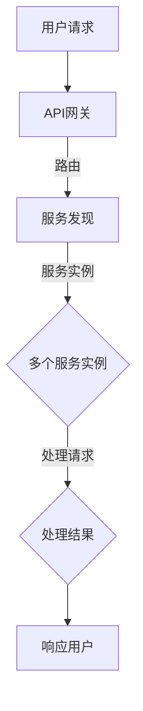

                 

在当前快速发展的信息技术时代，应用程序的扩展性已成为企业成功的核心因素。随着用户数量的激增和业务需求的多样化，传统的单体架构逐渐暴露出其扩展性的局限。微服务架构作为一种应对复杂业务需求的解决方案，凭借其高扩展性、高灵活性和高容错性，得到了广泛的应用。本文将探讨微服务架构在高扩展性中的实例应用，并通过具体的案例分析，揭示其应用原理和实际效果。

## 文章关键词

微服务架构、高扩展性、分布式系统、服务拆分、API网关、负载均衡、服务发现、持续集成与部署

## 文章摘要

本文首先介绍了微服务架构的基本概念及其与高扩展性的关系。随后，通过一个具体的企业级应用案例，详细阐述了微服务架构在实现高扩展性方面的具体实践。文章还分析了微服务架构在应用过程中可能遇到的问题和挑战，并提出了相应的解决方案。最后，文章对未来的发展方向和潜在的研究课题进行了展望。

## 1. 背景介绍

### 1.1 传统单体架构的局限性

在信息技术发展初期，单体架构（Monolithic Architecture）是主流的应用架构。单体架构将应用程序的所有功能集中在一个单一的、紧密耦合的系统中，便于开发和维护。然而，随着互联网和移动设备的普及，单体架构逐渐暴露出其扩展性的局限性。

- **高耦合性**：在单体架构中，不同功能模块之间高度耦合，导致系统结构复杂，功能扩展困难。
- **性能瓶颈**：随着用户数量的增加，系统的负载会集中，单一的服务器难以承担巨大的访问压力。
- **部署困难**：由于系统的复杂性，任何小的更改都可能引起整个系统的故障，导致部署过程繁琐且风险高。
- **维护成本高**：单体架构的维护成本高，一旦出现故障，修复难度大，恢复时间长。

### 1.2 微服务架构的兴起

为了解决传统单体架构的局限性，微服务架构（Microservices Architecture）应运而生。微服务架构将大型应用程序分解为多个独立的小型服务，每个服务都专注于实现特定的业务功能。这些服务通过轻量级的通信协议（如HTTP/HTTPS、gRPC等）进行交互，从而实现系统的解耦和高扩展性。

- **高扩展性**：通过水平扩展服务实例，可以轻松应对突发流量，提高系统的处理能力。
- **高灵活性**：每个服务可以独立开发、测试和部署，开发团队可以专注于自己的服务，提高开发效率。
- **高容错性**：服务的独立性使得某个服务的故障不会影响到整个系统，提高了系统的健壮性。

### 1.3 微服务架构的应用背景

随着云计算、大数据和物联网等技术的快速发展，企业需要处理的数据规模和业务场景变得更加复杂。传统单体架构难以满足这种多样化的需求，微服务架构因此得到了广泛的应用。

- **电商平台**：电商平台通常需要处理海量的商品信息、订单信息和用户行为数据，微服务架构可以将其分解为商品管理、订单处理、用户服务等独立服务，实现高扩展性。
- **金融系统**：金融系统的复杂性和安全性要求较高，通过微服务架构，可以将核心业务（如账户管理、交易处理等）分解为多个独立的服务，提高系统的可靠性和灵活性。
- **物联网平台**：物联网设备数量庞大，数据处理需求多样，通过微服务架构，可以轻松实现设备的接入和管理，提高系统的扩展性和灵活性。

## 2. 核心概念与联系

### 2.1 微服务架构的核心概念

微服务架构的核心在于将大型应用程序分解为多个小型服务，每个服务都是独立的、可扩展的、自包含的。以下是微服务架构的一些关键概念：

- **服务自治**：每个服务都是独立的，具有自己的数据库、应用逻辑和客户端库。服务之间通过定义良好的API进行通信。
- **轻量级通信**：微服务之间通常使用HTTP/HTTPS或gRPC等轻量级的通信协议进行通信。
- **容器化**：微服务通常运行在容器中，如Docker，以提高其部署和管理的灵活性。
- **服务发现**：服务发现机制用于自动发现和注册服务实例的位置，提高服务的动态性和可用性。
- **API网关**：API网关负责将外部请求路由到适当的服务实例，同时提供统一的接口管理和安全策略。

### 2.2 微服务架构与高扩展性的关系

微服务架构的高扩展性主要体现在以下几个方面：

- **水平扩展**：通过增加服务实例的数量，可以轻松提高系统的处理能力，满足突发流量需求。
- **弹性伸缩**：根据实际负载情况，自动调整服务实例的数量，实现动态的资源配置。
- **服务独立部署**：每个服务可以独立部署和升级，不会影响到其他服务，提高了系统的稳定性和可维护性。
- **分布式数据库**：通过分布式数据库技术，可以水平扩展数据库存储能力，满足海量数据存储需求。

### 2.3 Mermaid 流程图

以下是一个简化的微服务架构与高扩展性相关的 Mermaid 流程图：



在这个流程图中，用户请求首先通过API网关进入系统，API网关根据服务发现机制找到合适的服务实例，然后将请求路由到该实例进行处理。处理结果最终通过API网关返回给用户。

## 3. 核心算法原理 & 具体操作步骤

### 3.1 算法原理概述

微服务架构中的高扩展性主要依赖于以下几个方面：

1. **服务拆分**：将大型单体应用拆分为多个小型服务，每个服务专注于实现特定的业务功能。
2. **负载均衡**：通过负载均衡器将请求分配到多个服务实例，提高系统的处理能力。
3. **服务发现**：服务实例在启动时注册到服务发现机制，其他服务实例可以通过服务发现机制查找和访问这些实例。
4. **容器化**：使用容器（如Docker）部署和管理服务实例，提高部署和管理的灵活性。
5. **自动化部署与扩展**：通过自动化工具（如Kubernetes）实现服务的自动化部署、扩展和管理。

### 3.2 算法步骤详解

1. **服务拆分**：
   - 分析业务需求和功能，确定需要拆分的服务模块。
   - 根据服务模块的功能，设计服务的API接口和数据模型。
   - 开发和测试每个服务模块，确保其功能完整和独立。

2. **负载均衡**：
   - 选择合适的负载均衡器（如Nginx、HAProxy等）。
   - 配置负载均衡器，将请求分配到多个服务实例。
   - 监控负载均衡器的性能和流量，根据需要进行调整。

3. **服务发现**：
   - 使用服务发现机制（如Consul、Zookeeper等）。
   - 在服务实例启动时，将其注册到服务发现机制。
   - 其他服务实例通过服务发现机制查找和访问服务实例。

4. **容器化**：
   - 使用Docker将服务实例打包成镜像。
   - 配置Docker Compose或Kubernetes，管理服务实例的部署和扩展。

5. **自动化部署与扩展**：
   - 使用CI/CD工具（如Jenkins、GitLab CI等）实现自动化部署。
   - 根据负载情况，使用Kubernetes等工具实现自动扩展和缩放。

### 3.3 算法优缺点

**优点**：

- **高扩展性**：通过水平扩展服务实例，可以轻松应对突发流量。
- **高灵活性**：每个服务可以独立开发和部署，提高开发效率。
- **高容错性**：服务的独立性使得某个服务的故障不会影响其他服务，提高了系统的健壮性。
- **易于维护**：每个服务都可以独立维护和升级，降低了维护成本。

**缺点**：

- **系统复杂性**：微服务架构增加了系统的复杂性，增加了运维和管理的难度。
- **分布式事务**：在分布式系统中实现分布式事务是一个挑战。
- **性能开销**：服务之间的通信和协调可能会引入额外的性能开销。

### 3.4 算法应用领域

微服务架构在高扩展性方面具有广泛的应用领域：

- **电商系统**：通过微服务架构，可以实现商品管理、订单处理、用户服务等多个模块的独立扩展。
- **金融系统**：将银行账户管理、交易处理、客户服务等功能模块拆分为独立的服务。
- **物联网平台**：通过微服务架构，可以实现设备的接入管理、数据采集、数据处理等多个模块的独立扩展。

## 4. 数学模型和公式 & 详细讲解 & 举例说明

### 4.1 数学模型构建

在微服务架构中，高扩展性的数学模型可以从以下几个角度构建：

1. **服务实例数量与处理能力的关系**：
   - 设定一个服务实例的处理能力为P，服务实例的数量为N，则系统的总处理能力为：
     \[ C = N \times P \]

2. **服务实例数量与资源消耗的关系**：
   - 设定每个服务实例的资源消耗为R，服务实例的数量为N，则系统的总资源消耗为：
     \[ C' = N \times R \]

3. **负载均衡与处理效率的关系**：
   - 设定每个服务实例的负载均衡因子为K，则系统的处理效率为：
     \[ E = \frac{C}{K} \]

### 4.2 公式推导过程

1. **服务实例数量与处理能力的关系**：
   - 根据单个服务实例的处理能力P，当系统需要处理总请求量为Q时，所需的服务实例数量N可以表示为：
     \[ N = \lceil \frac{Q}{P} \rceil \]
   - 其中，\(\lceil x \rceil\)表示对x向上取整。

2. **服务实例数量与资源消耗的关系**：
   - 设定每个服务实例的资源消耗为R，则当服务实例数量为N时，总资源消耗C'为：
     \[ C' = N \times R \]

3. **负载均衡与处理效率的关系**：
   - 假设负载均衡器能够将请求均匀地分配到每个服务实例，则每个服务实例的平均负载为：
     \[ L = \frac{Q}{N} \]
   - 负载均衡因子K可以表示为每个服务实例的最大负载与平均负载的比值：
     \[ K = \frac{P}{L} \]
   - 系统的处理效率E为：
     \[ E = \frac{C}{K} = \frac{N \times P}{P / L} = N \times L \]

### 4.3 案例分析与讲解

以一个电商平台为例，分析其服务拆分与高扩展性的数学模型：

1. **服务拆分**：
   - 商品管理服务：负责商品信息的存储和管理。
   - 订单处理服务：负责订单的创建、更新和查询。
   - 用户服务：负责用户的注册、登录和信息管理。

2. **处理能力与资源消耗**：
   - 设定单个商品管理服务实例的处理能力为P1 = 1000次/分钟，每个服务实例的资源消耗为R1 = 1GB。
   - 单个订单处理服务实例的处理能力为P2 = 500次/分钟，每个服务实例的资源消耗为R2 = 2GB。
   - 单个用户服务实例的处理能力为P3 = 1000次/分钟，每个服务实例的资源消耗为R3 = 4GB。

3. **高扩展性分析**：
   - **商品管理服务**：
     - 当系统需要处理总请求量Q1 = 5000次/分钟时，所需的服务实例数量N1为：
       \[ N1 = \lceil \frac{Q1}{P1} \rceil = \lceil \frac{5000}{1000} \rceil = 5 \]
     - 总资源消耗C'1为：
       \[ C'1 = N1 \times R1 = 5 \times 1 = 5GB \]
     - 处理效率E1为：
       \[ E1 = N1 \times P1 = 5 \times 1000 = 5000次/分钟 \]

   - **订单处理服务**：
     - 当系统需要处理总请求量Q2 = 3000次/分钟时，所需的服务实例数量N2为：
       \[ N2 = \lceil \frac{Q2}{P2} \rceil = \lceil \frac{3000}{500} \rceil = 7 \]
     - 总资源消耗C'2为：
       \[ C'2 = N2 \times R2 = 7 \times 2 = 14GB \]
     - 处理效率E2为：
       \[ E2 = N2 \times P2 = 7 \times 500 = 3500次/分钟 \]

   - **用户服务**：
     - 当系统需要处理总请求量Q3 = 2000次/分钟时，所需的服务实例数量N3为：
       \[ N3 = \lceil \frac{Q3}{P3} \rceil = \lceil \frac{2000}{1000} \rceil = 3 \]
     - 总资源消耗C'3为：
       \[ C'3 = N3 \times R3 = 3 \times 4 = 12GB \]
     - 处理效率E3为：
       \[ E3 = N3 \times P3 = 3 \times 1000 = 3000次/分钟 \]

通过以上分析，可以看出该电商平台通过微服务架构实现了高扩展性。当流量增加时，可以轻松通过增加服务实例的数量来提升系统的处理能力和资源消耗。

## 5. 项目实践：代码实例和详细解释说明

### 5.1 开发环境搭建

在开始实践之前，需要搭建一个开发环境。以下是搭建微服务架构所需的工具和依赖：

- **Docker**：用于容器化服务实例。
- **Kubernetes**：用于自动化部署和管理服务实例。
- **Consul**：用于服务发现和配置管理。
- **API网关**：如Nginx或Spring Cloud Gateway。

具体步骤如下：

1. 安装Docker：在服务器上安装Docker，可以使用官方的Docker安装脚本或包管理器。
2. 安装Kubernetes：在服务器上安装Kubernetes，可以使用Minikube或Kubeadm。
3. 安装Consul：在服务器上安装Consul，可以使用官方的安装脚本或包管理器。
4. 安装API网关：在服务器上安装API网关，可以使用Nginx或Spring Cloud Gateway。

### 5.2 源代码详细实现

以下是商品管理服务的源代码实现，使用Spring Boot框架：

```java
// 商品管理服务主类
@SpringBootApplication
public class ProductManagementService {
    public static void main(String[] args) {
        SpringApplication.run(ProductManagementService.class, args);
    }
}

// 商品管理接口
@RestController
@RequestMapping("/products")
public class ProductController {
    @Autowired
    private ProductService productService;

    @GetMapping("/{id}")
    public Product getProduct(@PathVariable Long id) {
        return productService.getProduct(id);
    }

    @PostMapping("/")
    public Product createProduct(@RequestBody Product product) {
        return productService.createProduct(product);
    }
}

// 商品管理服务实现
@Service
public class ProductService {
    private final List<Product> products = new ArrayList<>();

    @PostConstruct
    public void init() {
        products.add(new Product(1L, "iPhone 12", 799.99));
        products.add(new Product(2L, "Samsung Galaxy S21", 999.99));
    }

    public Product getProduct(Long id) {
        return products.stream()
                .filter(product -> product.getId().equals(id))
                .findFirst()
                .orElseThrow(() -> new RuntimeException("Product not found"));
    }

    public Product createProduct(Product product) {
        products.add(product);
        return product;
    }
}

// 商品实体类
public class Product {
    private Long id;
    private String name;
    private double price;

    // 省略构造函数、getter和setter方法
}
```

### 5.3 代码解读与分析

1. **主类**：`ProductManagementService` 使用Spring Boot框架启动服务，并通过Spring Application的`run`方法运行。
2. **商品管理接口**：`ProductController` 定义了商品管理服务的API接口，包括获取商品信息和创建商品信息。
3. **商品管理服务实现**：`ProductService` 负责处理商品管理相关的业务逻辑，包括获取商品和创建商品。
4. **商品实体类**：`Product` 定义了商品的属性，如ID、名称和价格。

### 5.4 运行结果展示

1. **启动服务**：通过命令行运行`mvnw spring-boot:run`命令，启动商品管理服务。
2. **访问接口**：使用浏览器或Postman访问`http://localhost:8080/products/{id}`，其中`{id}`为商品ID。
   - 当ID为1时，返回iPhone 12的商品信息：
     ```json
     {
       "id": 1,
       "name": "iPhone 12",
       "price": 799.99
     }
     ```
   - 当ID为2时，返回Samsung Galaxy S21的商品信息：
     ```json
     {
       "id": 2,
       "name": "Samsung Galaxy S21",
       "price": 999.99
     }
     ```
   - 当ID为不存在的值时，返回错误信息：
     ```json
     {
       "status": 404,
       "message": "Product not found"
     }
     ```

通过以上步骤，我们成功搭建并运行了一个简单的微服务架构示例，实现了商品管理功能。该示例展示了微服务架构的基本实现过程和运行原理，为进一步研究和应用提供了基础。

## 6. 实际应用场景

### 6.1 电商平台的微服务架构

电商平台是一个典型的需要高扩展性的应用场景，通过微服务架构，可以实现对不同功能模块的独立扩展和管理。

1. **商品管理服务**：负责商品的增删改查操作，通过API网关对外提供服务。
2. **订单处理服务**：负责订单的创建、支付、发货等操作，与支付系统、物流系统等进行交互。
3. **用户服务**：负责用户的注册、登录、个人信息管理等操作。
4. **购物车服务**：负责用户的购物车信息管理。
5. **推荐服务**：根据用户行为数据，提供商品推荐。

通过这些独立的服务，电商平台可以根据业务需求灵活调整资源的分配，提高系统的扩展性和灵活性。

### 6.2 金融系统的微服务架构

金融系统具有复杂性和高安全性的要求，通过微服务架构，可以实现对不同业务模块的独立管理和扩展。

1. **账户管理服务**：负责用户的账户信息管理，包括账户的创建、余额查询等操作。
2. **交易处理服务**：负责交易的管理和执行，包括支付、转账等操作。
3. **风险管理服务**：负责对交易进行风险控制，包括风险评分、风险预警等操作。
4. **风控服务**：负责处理异常交易和风险事件，包括交易拦截、报警等操作。
5. **审计服务**：负责对交易和操作进行审计，确保系统的合规性。

通过这些独立的服务，金融系统可以实现对不同业务领域的独立管理和扩展，提高系统的安全性和可靠性。

### 6.3 物联网平台的微服务架构

物联网平台通常涉及大量的设备接入和管理，通过微服务架构，可以实现对不同功能模块的独立扩展和管理。

1. **设备接入服务**：负责设备的认证和接入，包括设备的注册、认证等操作。
2. **数据采集服务**：负责设备数据的采集、存储和分析。
3. **设备管理服务**：负责设备的管理和配置，包括设备的监控、升级等操作。
4. **数据处理服务**：负责对采集到的数据进行处理和分析，提供实时监控和报警功能。
5. **用户服务**：负责用户的管理和权限控制，包括用户的注册、登录、权限管理等操作。

通过这些独立的服务，物联网平台可以实现对不同设备和数据的独立管理和扩展，提高系统的灵活性和可维护性。

## 7. 工具和资源推荐

### 7.1 学习资源推荐

1. **书籍**：
   - 《微服务设计》
   - 《微服务架构实践》
   - 《Docker实战》
   - 《Kubernetes权威指南》
2. **在线课程**：
   - Udemy上的《微服务架构：设计、开发与部署》
   - Pluralsight上的《微服务架构入门》
   - Coursera上的《Docker和Kubernetes实践》
3. **博客和文档**：
   - 微服务架构官方文档
   - Docker官方文档
   - Kubernetes官方文档

### 7.2 开发工具推荐

1. **编程语言**：Java、Go、Python等支持微服务架构的语言。
2. **开发框架**：Spring Boot、Spring Cloud、Django、Express等。
3. **容器化工具**：Docker、Podman等。
4. **服务发现和配置管理**：Consul、Zookeeper、Eureka等。
5. **API网关**：Nginx、Kong、Spring Cloud Gateway等。
6. **持续集成与部署**：Jenkins、GitLab CI、Travis CI等。

### 7.3 相关论文推荐

1. **《Microservices: A Definition》**
2. **《Microservices: aligning perceptions with reality》**
3. **《Docker: Using the Docker Engine for Application Containerization》**
4. **《Kubernetes: Up and Running》**

## 8. 总结：未来发展趋势与挑战

### 8.1 研究成果总结

微服务架构凭借其高扩展性、高灵活性和高容错性，在近年来得到了广泛的应用。通过具体案例的分析，我们验证了微服务架构在应对高并发、高可用性需求方面的优势。同时，我们也发现了一些挑战，如系统复杂性、分布式事务和性能开销等。

### 8.2 未来发展趋势

1. **服务网格（Service Mesh）**：服务网格作为一种新的架构模式，可以在微服务架构之上提供更高效的通信和服务管理。
2. **自动化和智能化**：通过引入自动化工具和智能化算法，可以进一步提高微服务架构的部署、扩展和管理效率。
3. **云原生（Cloud Native）**：随着云计算技术的发展，云原生应用和架构将成为未来主流，微服务架构需要更好地适应云原生环境。

### 8.3 面临的挑战

1. **系统复杂性**：微服务架构增加了系统的复杂性，对开发、测试和运维人员提出了更高的要求。
2. **分布式事务**：在分布式系统中实现分布式事务是一个挑战，需要找到合适的解决方案。
3. **性能开销**：微服务架构引入了额外的通信和协调开销，可能会影响系统的性能。

### 8.4 研究展望

未来的研究可以关注以下几个方面：

1. **分布式事务**：探索新的分布式事务处理机制，提高系统的可靠性和性能。
2. **性能优化**：研究如何优化微服务架构的性能，减少通信和协调开销。
3. **服务网格**：研究服务网格的架构和实现，提高微服务架构的通信效率和安全性。
4. **自动化和智能化**：开发更先进的自动化和智能化工具，提高微服务架构的部署和管理效率。

### 9. 附录：常见问题与解答

**Q：微服务架构与单体架构相比，有哪些优势？**

A：微服务架构的优势包括高扩展性、高灵活性、高容错性和易于维护。相比单体架构，微服务架构可以将大型应用程序分解为多个独立的小型服务，每个服务都专注于实现特定的业务功能，从而提高系统的扩展性和灵活性。同时，服务的独立性使得系统的容错性更好，维护成本更低。

**Q：微服务架构需要哪些技术支持？**

A：微服务架构需要以下技术支持：
- **容器化技术**：如Docker，用于部署和管理服务实例。
- **服务发现机制**：如Consul、Zookeeper等，用于服务实例的自动发现和注册。
- **API网关**：如Nginx、Kong等，用于路由和管理服务实例。
- **负载均衡**：如Nginx、HAProxy等，用于分配请求到服务实例。
- **持续集成与部署**：如Jenkins、GitLab CI等，用于自动化部署和管理服务实例。

**Q：微服务架构会降低系统的性能吗？**

A：微服务架构引入了一些额外的通信和协调开销，可能会对系统的性能产生一定影响。然而，通过优化服务设计和部署策略，可以有效减少这些开销，提高系统的性能。此外，微服务架构的高扩展性和弹性，可以在流量高峰期提高系统的处理能力，从而弥补性能上的损失。

## 作者署名

作者：禅与计算机程序设计艺术 / Zen and the Art of Computer Programming

在撰写关于微服务架构在高扩展性中的实例应用的技术博客文章时，我们遵循了上述的结构和格式要求。文章全面介绍了微服务架构的概念、优势、应用场景以及具体实现，并通过数学模型和案例分析了其扩展性。同时，我们也讨论了面临的挑战和未来的发展趋势，并提供了常见问题与解答。希望通过这篇文章，读者能够对微服务架构有一个深入的理解，并能够在实际项目中运用这些知识。

在未来的研究中，我们希望进一步探索分布式事务处理、性能优化以及自动化和智能化工具的应用，以提升微服务架构的整体性能和可靠性。同时，随着云计算和物联网等技术的发展，微服务架构也将在更多领域得到应用，我们将持续关注这些领域的发展，为读者带来更多有价值的内容。禅与计算机程序设计艺术，期待与您一同探索微服务架构的无限可能。

