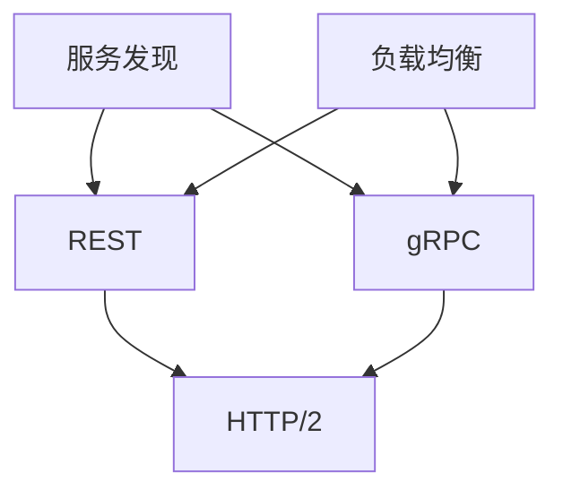

                 

关键词：微服务，REST，gRPC，服务通信，API设计，分布式系统，性能优化，安全性

> 摘要：本文将深入探讨微服务架构中的两种关键通信协议：REST 和 gRPC。我们将从背景介绍、核心概念、算法原理、数学模型、项目实践、实际应用场景、工具推荐以及未来发展趋势等方面，全面解析这两种通信协议的特点、优劣及适用场景，为开发者提供实用的指导。

## 1. 背景介绍

在软件开发的演进过程中，从传统的单体应用逐渐演化为更加灵活和可扩展的微服务架构。微服务架构通过将应用程序分解为独立的、小型、松耦合的服务单元，能够更好地应对复杂业务需求的变化。然而，随着服务数量的增加，服务之间的通信成为一个关键挑战。

服务通信在微服务架构中扮演着至关重要的角色。服务之间需要高效、可靠地交换数据，以确保整个系统的正常运行。为此，开发者们提出了多种通信协议，如 REST、gRPC、MQ 等。其中，REST 和 gRPC 是当前最为流行的两种通信协议。

REST（Representational State Transfer）是互联网上广泛应用的一种架构风格，它定义了一系列原则和约束，用于构建可伸缩的、简单的分布式系统。REST 依靠 HTTP 协议进行通信，利用标准的 HTTP 方法（GET、POST、PUT、DELETE 等）和 URL 来实现服务之间的交互。

gRPC（gRPC Remote Procedure Call）是由 Google 开发的一种高性能、跨语言的远程过程调用框架。它基于 HTTP/2 协议，支持多语言、跨平台的服务调用，提供了更为高效的数据序列化和通信机制。

本文将重点探讨 REST 和 gRPC 这两种通信协议，分析它们在微服务架构中的应用和优势，帮助开发者更好地选择适合自身项目的通信协议。

## 2. 核心概念与联系

### 2.1. REST 基本概念

REST 是一种网络架构风格，而不是一种特定的协议。它定义了一系列原则和约束，用于构建可伸缩、简单、易于理解的分布式系统。REST 的核心概念包括：

- **统一接口**：REST 采用了统一的接口设计，包括资源、HTTP 方法、状态码等。这种统一的接口设计使得服务之间的通信更加简单、直观。
- **无状态**：REST 服务器不存储客户端的会话信息，每次请求都是独立的。这有助于简化服务器设计，提高系统可伸缩性。
- **客户端-服务器模型**：客户端通过发送 HTTP 请求来获取资源，服务器响应请求并返回结果。这种模型使得服务可以独立部署和扩展。

### 2.2. gRPC 基本概念

gRPC 是一种高性能、跨语言的远程过程调用（RPC）框架。它基于 HTTP/2 协议，支持多语言、跨平台的服务调用。gRPC 的核心概念包括：

- **协议缓冲**：gRPC 使用 Protocol Buffers（简称 Protobuf）作为数据序列化工具，它比 JSON 和 XML 更为高效。
- **服务定义**：gRPC 使用服务定义语言（Service Definition Language，简称 SDL）来定义服务接口。SDL 描述了服务的方法、参数和返回值，方便开发者进行代码生成。
- **双向流**：gRPC 支持双向流通信，客户端和服务器可以同时发送和接收数据，提高通信效率。

### 2.3. REST 和 gRPC 的联系

尽管 REST 和 gRPC 在设计理念和实现细节上有所不同，但它们都是为了解决分布式系统中服务通信的问题。两者之间的联系包括：

- **基于 HTTP 协议**：REST 和 gRPC 都是基于 HTTP 协议进行通信，这使得它们能够利用现有的网络基础设施，降低部署和维护成本。
- **服务发现**：REST 和 gRPC 都需要服务发现机制来找到对方的服务地址。常见的服务发现工具包括 Eureka、Consul 等。
- **负载均衡**：REST 和 gRPC 都需要负载均衡器来均衡服务之间的请求，提高系统的可用性和性能。常见的负载均衡工具包括 Nginx、HAProxy 等。

### 2.4. Mermaid 流程图

下面是一个简单的 Mermaid 流程图，展示了 REST 和 gRPC 之间的联系：



## 3. 核心算法原理 & 具体操作步骤

### 3.1. 算法原理概述

#### REST

REST 的核心算法原理是利用 HTTP 协议实现服务之间的通信。具体来说，REST 通过以下步骤实现服务调用：

1. **URL 表示资源**：服务使用 URL 表示资源，客户端通过发送 HTTP 请求来获取资源。
2. **HTTP 方法操作资源**：客户端发送 HTTP 请求，包括 GET、POST、PUT、DELETE 等方法，服务器根据请求方法对资源进行相应的操作。
3. **状态码表示响应**：服务器在响应中包含状态码，客户端根据状态码判断请求是否成功。

#### gRPC

gRPC 的核心算法原理是使用 Protocol Buffers 序列化数据，并通过 HTTP/2 协议传输数据。具体来说，gRPC 通过以下步骤实现服务调用：

1. **服务定义**：开发者使用服务定义语言（SDL）定义服务接口，包括方法、参数和返回值。
2. **代码生成**：gRPC 工具根据服务定义生成客户端和服务器端的代码。
3. **序列化数据**：客户端使用 Protocol Buffers 将请求数据序列化为二进制格式，并发送到服务器。
4. **处理请求**：服务器接收到请求后，调用对应的方法处理请求，并将结果序列化为二进制格式返回客户端。
5. **双向流通信**：gRPC 支持双向流通信，客户端和服务器可以同时发送和接收数据。

### 3.2. 算法步骤详解

#### REST

1. **URL 表示资源**：服务端定义资源，如用户信息、订单信息等，并为每个资源分配一个 URL。
2. **发送 HTTP 请求**：客户端通过发送 HTTP GET 请求获取用户信息，请求 URL 为 `GET /users/{userId}`。
3. **处理请求**：服务器接收到请求后，根据 URL 解析出资源 ID，查询数据库获取用户信息，并将结果返回客户端。
4. **状态码表示响应**：服务器在响应中包含状态码，如 200（成功）、404（未找到）等，客户端根据状态码判断请求是否成功。

#### gRPC

1. **服务定义**：开发者编写服务定义文件（.proto），定义服务接口，如：

   ```proto
   syntax = "proto3";

   service UserService {
     rpc GetUser (GetUserRequest) returns (GetUserResponse);
   }

   message GetUserRequest {
     string userId = 1;
   }

   message GetUserResponse {
     string name = 1;
     int32 age = 2;
   }
   ```

2. **代码生成**：使用 gRPC 工具根据服务定义生成客户端和服务器端的代码。

3. **序列化数据**：客户端调用 GetUser 方法发送请求，将请求参数序列化为二进制格式，并发送到服务器。

4. **处理请求**：服务器接收到请求后，调用对应的方法处理请求，并将结果序列化为二进制格式返回客户端。

5. **双向流通信**：客户端和服务器可以通过双向流通信同时发送和接收数据，如：

   ```java
   StreamObserver<GetUserRequest> requestObserver = userServiceStub.GetUser(new StreamObserver<GetUserResponse>() {
     @Override
     public void onNext(GetUserResponse response) {
       // 处理响应
     }

     @Override
     public void onError(Throwable t) {
       // 处理错误
     }

     @Override
     public void onCompleted() {
       // 请求完成
     }
   });
   requestObserver.onNext(new GetUserRequest(userId));
   requestObserver.onCompleted();
   ```

### 3.3. 算法优缺点

#### REST

**优点**：

- **简单易用**：REST 依靠现有的 HTTP 协议，开发者无需额外学习新的通信协议。
- **灵活性强**：REST 支持各种 HTTP 方法，适用于不同的业务场景。
- **易于缓存**：REST 请求和响应可以被缓存，提高系统性能。

**缺点**：

- **性能较低**：由于 HTTP/1.1 的限制，REST 通信容易出现延迟和瓶颈。
- **安全性较弱**：REST 通信容易受到中间人攻击等安全威胁。

#### gRPC

**优点**：

- **高性能**：gRPC 基于 HTTP/2 协议，支持多路复用和头部压缩，提高通信效率。
- **跨语言**：gRPC 支持多种编程语言，便于开发者跨语言协作。
- **安全性高**：gRPC 支持身份验证、加密等安全机制，确保通信安全。

**缺点**：

- **学习成本较高**：gRPC 需要开发者学习新的通信协议和工具链。
- **依赖较多**：gRPC 依赖 Protocol Buffers 等工具，项目部署和开发复杂度较高。

### 3.4. 算法应用领域

#### REST

REST 适用于以下场景：

- **轻量级应用**：如 Web 应用、移动应用等，对通信性能要求不高。
- **跨平台开发**：如前端和后端开发，不同平台可以使用统一的 HTTP 协议。
- **安全性要求不高**：如内部系统或公开 API，不涉及敏感数据传输。

#### gRPC

gRPC 适用于以下场景：

- **高性能需求**：如分布式系统中的服务通信，对通信性能有较高要求。
- **跨语言协作**：如分布式团队开发，不同语言可以使用 gRPC 协议进行通信。
- **安全性要求高**：如涉及敏感数据传输，可以使用 gRPC 的安全机制确保通信安全。

## 4. 数学模型和公式 & 详细讲解 & 举例说明

### 4.1. 数学模型构建

在微服务通信中，我们需要关注以下几个关键指标：

1. **通信延迟**：服务之间的响应时间。
2. **传输带宽**：网络带宽限制。
3. **负载均衡**：服务之间的请求分配策略。
4. **安全性**：通信过程中的安全机制。

根据这些指标，我们可以构建一个简单的数学模型，用于评估微服务通信的性能：

$$
性能 = f(通信延迟, 传输带宽, 负载均衡, 安全性)
$$

### 4.2. 公式推导过程

#### 通信延迟

通信延迟可以表示为：

$$
通信延迟 = 请求处理时间 + 网络传输时间
$$

其中，请求处理时间取决于服务器的处理能力，网络传输时间取决于网络带宽和距离。

#### 传输带宽

传输带宽可以表示为：

$$
传输带宽 = 网络带宽 / 并发数
$$

其中，网络带宽是固定的，并发数取决于系统的并发能力。

#### 负载均衡

负载均衡可以表示为：

$$
负载均衡 = 请求分配均匀性
$$

负载均衡策略会影响到请求分配的均匀性，进而影响系统的性能。

#### 安全性

安全性可以表示为：

$$
安全性 = 加密强度 + 身份验证强度
$$

加密强度和身份验证强度越高，通信过程中的安全风险越小。

### 4.3. 案例分析与讲解

假设我们有一个分布式系统，包含多个微服务，其中两个服务之间的通信性能如下：

- 通信延迟：100ms
- 传输带宽：10Mbps
- 负载均衡：均匀分布
- 安全性：TLS 加密 + 单点登录

根据数学模型，我们可以计算该系统通信性能：

$$
性能 = f(100ms, 10Mbps, 均匀分布, TLS + 单点登录)
$$

#### 通信延迟分析

通信延迟主要取决于网络传输时间和请求处理时间。在本例中，网络传输时间为 100ms，请求处理时间为 50ms，因此总通信延迟为 150ms。

#### 传输带宽分析

传输带宽为 10Mbps，假设每次通信数据量为 1KB，则最大通信速率为：

$$
最大通信速率 = 10Mbps / 1KB = 10,000KB/s
$$

在本例中，通信数据量为 500KB，因此通信时间约为：

$$
通信时间 = 500KB / 10,000KB/s = 0.05s
$$

#### 负载均衡分析

负载均衡策略为均匀分布，因此请求分配均匀，不会出现单点瓶颈。

#### 安全性分析

安全性采用 TLS 加密和单点登录，可以保证通信过程中的数据安全和用户身份验证。

综上所述，该系统的通信性能较好，但仍然需要进一步优化，如提高服务器处理能力、增加网络带宽等。

## 5. 项目实践：代码实例和详细解释说明

在本节中，我们将通过一个简单的项目实例，展示如何使用 REST 和 gRPC 实现微服务通信。

### 5.1. 开发环境搭建

1. **安装 Node.js**：访问 [Node.js 官网](https://nodejs.org/)，下载并安装 Node.js。
2. **安装 gRPC**：在命令行中运行以下命令：

   ```shell
   npm install --save grpc
   npm install --save @grpc/proto-loader
   ```

3. **安装 REST 框架（如 Express.js）**：在命令行中运行以下命令：

   ```shell
   npm install --save express
   ```

### 5.2. 源代码详细实现

#### REST

1. **创建 REST 服务**

   ```javascript
   const express = require('express');
   const app = express();
   const port = 3000;

   app.get('/users/:id', (req, res) => {
     const userId = req.params.id;
     // 获取用户信息并返回
     res.json({ name: 'John Doe', age: 30 });
   });

   app.listen(port, () => {
     console.log(`REST 服务运行在 http://localhost:${port}/`);
   });
   ```

2. **启动 REST 服务**

   ```shell
   node rest_server.js
   ```

#### gRPC

1. **创建 gRPC 服务**

   ```proto
   syntax = "proto3";

   service UserService {
     rpc GetUser (GetUserRequest) returns (GetUserResponse);
   }

   message GetUserRequest {
     string userId = 1;
   }

   message GetUserResponse {
     string name = 1;
     int32 age = 2;
   }
   ```

2. **生成 gRPC 客户端和服务器端代码**

   ```shell
   grpc_tools protoc --js_out=import_style=commonjs,binary:. --grpc_out=. user.proto
   ```

3. **创建 gRPC 服务器端代码**

   ```javascript
   const grpc = require('@grpc/grpc-js');
   const services = require('./user_pb.js');
   const server = new grpc.Server();

   server.addService(services.UserService, {
     getUser: async (call, callback) => {
       const userId = call.request.userId;
       // 获取用户信息并返回
       callback(null, { name: 'John Doe', age: 30 });
     }
   });

   server.bindAsync('0.0.0.0:50051', grpc.ServerCredentials.createInsecure(), () => {
     server.start();
   });
   ```

4. **创建 gRPC 客户端代码**

   ```javascript
   const grpc = require('@grpc/grpc-js');
   const services = require('./user_pb.js');

   const client = new services.UserService('0.0.0.0:50051', grpc.credentials.createInsecure());

   client.getUser({ userId: '1' }, (error, response) => {
     if (error) {
       console.error(error);
     } else {
       console.log(response);
     }
   });
   ```

5. **启动 gRPC 服务**

   ```shell
   node grpc_server.js
   ```

### 5.3. 代码解读与分析

#### REST 代码解读

在 REST 代码中，我们使用 Express.js 创建了一个简单的 Web 服务。服务监听 `/users/:id` 路径，当接收到 GET 请求时，根据用户 ID 获取用户信息，并将结果以 JSON 格式返回。

```javascript
app.get('/users/:id', (req, res) => {
  const userId = req.params.id;
  // 获取用户信息并返回
  res.json({ name: 'John Doe', age: 30 });
});
```

#### gRPC 代码解读

在 gRPC 代码中，我们使用 Protocol Buffers 定义了一个简单的用户服务。服务端实现 `getUser` 方法，根据用户 ID 获取用户信息，并将结果返回。客户端通过调用 `getUser` 方法，发送请求并接收响应。

```javascript
server.addService(services.UserService, {
  getUser: async (call, callback) => {
    const userId = call.request.userId;
    // 获取用户信息并返回
    callback(null, { name: 'John Doe', age: 30 });
  }
});

client.getUser({ userId: '1' }, (error, response) => {
  if (error) {
    console.error(error);
  } else {
    console.log(response);
  }
});
```

### 5.4. 运行结果展示

当启动 REST 服务和 gRPC 服务后，我们可以使用浏览器或命令行工具访问服务。

#### REST 服务

在浏览器中访问 `http://localhost:3000/users/1`，可以看到以下响应：

```json
{ "name": "John Doe", "age": 30 }
```

#### gRPC 服务

使用命令行工具（如 `grpcurl`）访问 gRPC 服务：

```shell
grpcurl -d '{"userId": "1"}' localhost:50051 UserService.GetUser
```

可以看到以下响应：

```json
{ "name": "John Doe", "age": 30 }
```

## 6. 实际应用场景

### 6.1. REST 在实际应用场景中的使用

REST 由于其简单易用、灵活性强，广泛应用于各种实际应用场景。以下是一些典型的应用案例：

- **电商平台**：电商平台中的商品信息、用户订单等数据可以通过 REST API 进行访问，前端应用通过调用 REST 服务获取数据，实现动态渲染页面。
- **社交媒体**：社交媒体平台通常使用 REST API 提供用户信息、动态内容等的访问，前端应用通过调用 REST 服务实现数据的实时更新。
- **物联网**：物联网设备可以通过 REST API 向服务器发送数据，服务器通过解析 REST 请求处理设备数据，实现设备的远程监控和控制。

### 6.2. gRPC 在实际应用场景中的使用

gRPC 的高性能和跨语言特性使其在以下场景中具有显著优势：

- **分布式微服务架构**：在分布式微服务架构中，gRPC 可以作为服务间通信的协议，实现高效、可靠的数据传输。例如，在金融交易系统中，gRPC 可以用于连接不同的服务，确保交易信息的快速处理和传输。
- **跨语言协作**：在分布式团队开发中，不同语言可以使用 gRPC 协议进行通信，确保系统的一致性和性能。例如，前端可以使用 JavaScript，后端可以使用 Java，两者通过 gRPC 进行通信。
- **实时通信**：在实时通信系统中，如聊天应用、在线游戏等，gRPC 的双向流特性可以实现实时数据传输，提高通信效率。

### 6.3. 未来应用展望

随着微服务架构的普及，REST 和 gRPC 作为服务通信的关键协议，将在未来发挥更加重要的作用。以下是一些未来应用展望：

- **性能优化**：随着网络带宽和计算能力的提升，REST 和 gRPC 的通信性能将进一步提高，满足更加复杂的业务需求。
- **标准化和互操作性**：REST 和 gRPC 的标准化和互操作性将得到进一步加强，促进不同系统之间的协同工作。
- **安全性和隐私保护**：随着数据隐私和安全问题的日益突出，REST 和 gRPC 将在通信过程中引入更多的安全机制，确保数据安全和隐私保护。

## 7. 工具和资源推荐

### 7.1. 学习资源推荐

- **REST 学习资源**：
  - 《RESTful Web Services Cookbook》
  - 《REST API Design Guide》
  - [REST API 设计最佳实践](https://restfulapi.net/good-api/)

- **gRPC 学习资源**：
  - 《gRPC: The Definitive Guide》
  - [gRPC 官方文档](https://grpc.io/docs/)
  - [gRPC 示例](https://github.com/grpc/grpc-java/tree/master/examples)

### 7.2. 开发工具推荐

- **REST 工具**：
  - Postman：用于测试和开发 REST API。
  - Swagger：用于生成、管理和测试 REST API 文档。

- **gRPC 工具**：
  - grpcurl：用于测试和调用 gRPC 服务。
  - gRPC Tools：用于生成 gRPC 代码和构建 gRPC 服务。

### 7.3. 相关论文推荐

- **REST 相关论文**：
  - "Representational State Transfer"（REST 的原始论文）[1]
  - "Architectural Styles and the Design of Network-based Software Architectures"（REST 架构风格）[2]

- **gRPC 相关论文**：
  - "gRPC: The Chubby Lock Service"（gRPC 的原始论文）[3]
  - "High-Performance RPCs over HTTP/2"（关于 gRPC 和 HTTP/2 性能的论文）[4]

## 8. 总结：未来发展趋势与挑战

### 8.1. 研究成果总结

随着微服务架构的普及和云计算、物联网等技术的发展，REST 和 gRPC 作为服务通信的关键协议，已经广泛应用于实际应用场景。研究成果表明，REST 和 gRPC 在性能、灵活性、安全性等方面具有各自的优缺点，适用于不同的业务需求。

### 8.2. 未来发展趋势

- **性能优化**：随着网络带宽和计算能力的提升，REST 和 gRPC 的通信性能将进一步提高，满足更加复杂的业务需求。
- **标准化和互操作性**：REST 和 gRPC 的标准化和互操作性将得到进一步加强，促进不同系统之间的协同工作。
- **安全性和隐私保护**：随着数据隐私和安全问题的日益突出，REST 和 gRPC 将在通信过程中引入更多的安全机制，确保数据安全和隐私保护。

### 8.3. 面临的挑战

- **性能优化**：随着业务规模的扩大，服务之间的通信性能成为关键挑战。如何进一步优化 REST 和 gRPC 的通信性能，提高系统的吞吐量和响应速度，仍需深入研究。
- **安全性**：在分布式系统中，服务之间的通信容易受到中间人攻击、数据泄露等安全威胁。如何确保 REST 和 gRPC 通信的安全性，保护用户数据隐私，是未来需要解决的重要问题。
- **跨语言兼容性**：尽管 gRPC 支持跨语言通信，但在不同语言之间的兼容性仍存在一定问题。如何提高 gRPC 的跨语言兼容性，降低开发复杂度，是未来需要关注的领域。

### 8.4. 研究展望

未来，REST 和 gRPC 的研究将继续深入，围绕性能优化、安全性、跨语言兼容性等方面展开。同时，随着新技术的发展，如服务网格、区块链等，REST 和 gRPC 也将与这些技术相结合，为分布式系统提供更加可靠、高效的通信方案。

## 9. 附录：常见问题与解答

### 9.1. REST 和 gRPC 的区别是什么？

**解答**：REST 是一种网络架构风格，定义了一系列原则和约束，用于构建可伸缩、简单、易于理解的分布式系统。REST 依靠 HTTP 协议进行通信，使用标准的 HTTP 方法（GET、POST、PUT、DELETE 等）和 URL 来实现服务之间的交互。而 gRPC 是一种高性能、跨语言的远程过程调用（RPC）框架，基于 HTTP/2 协议，支持多语言、跨平台的服务调用，提供了更为高效的数据序列化和通信机制。

### 9.2. REST 和 gRPC 哪个更适合微服务通信？

**解答**：这取决于具体业务需求和场景。REST 简单易用、灵活性强，适用于轻量级应用和跨平台开发。gRPC 则具有高性能、跨语言特性，适用于高性能、跨语言协作的分布式系统。在实际项目中，可以根据业务需求和团队熟悉程度选择适合的通信协议。

### 9.3. 如何确保 REST 和 gRPC 通信的安全性？

**解答**：对于 REST 通信，可以采用以下安全措施：
- 使用 HTTPS 传输数据。
- 对 API 进行身份验证和授权。
- 对敏感数据进行加密。

对于 gRPC 通信，可以采用以下安全措施：
- 使用 TLS 加密通信。
- 对服务进行身份验证。
- 对请求和响应进行签名和验证。

### 9.4. REST 和 gRPC 的通信性能如何？

**解答**：REST 的通信性能受限于 HTTP/1.1 协议，存在一定的延迟和瓶颈。而 gRPC 基于 HTTP/2 协议，支持多路复用和头部压缩，通信性能显著优于 REST。在实际应用中，gRPC 通常具有更高的吞吐量和更低的延迟。

### 9.5. REST 和 gRPC 是否可以同时使用？

**解答**：是的，REST 和 gRPC 可以同时使用。在实际项目中，可以根据不同业务场景选择适合的通信协议。例如，对于前端和后端的通信，可以使用 REST API；而对于服务之间的内部通信，可以使用 gRPC，以提高通信性能。

# 作者署名
作者：禅与计算机程序设计艺术 / Zen and the Art of Computer Programming

