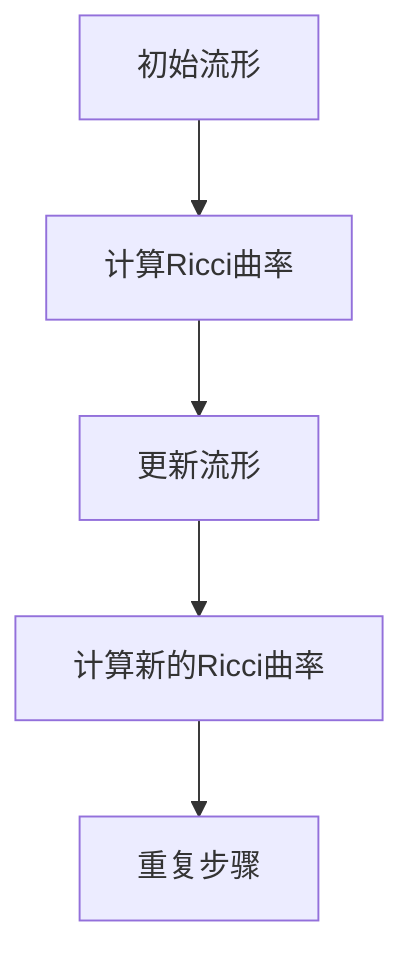

                 

在微积分和几何学中，Ricci流是一种重要的几何演化过程，它在许多数学分支和应用领域，如物理学、计算几何和数据分析中扮演着关键角色。本文将深入探讨Ricci流的定义、性质及其在微积分中的应用，旨在为读者提供一个全面的理解，并激发对该领域的进一步研究和兴趣。

> 关键词：微积分、Ricci流、几何演化、应用领域、数学模型

> 摘要：本文首先介绍了Ricci流的背景和核心概念，随后详细描述了其在微积分中的应用。通过数学模型和公式的推导，以及实际案例的分析，读者将能够理解Ricci流的理论基础和实践价值。文章的最后，讨论了Ricci流在未来研究和应用中的前景。

## 1. 背景介绍

微积分作为数学的一个重要分支，起源于17世纪，其基础是极限、导数和积分等概念。微积分的发展极大地推动了科学和工程领域的进步，例如在物理学、经济学、工程学和生物学中都有着广泛的应用。Ricci流是几何学中的一个重要概念，起源于Ricci曲率的概念，它是描述几何对象随时间演化的工具。

Ricci流的研究始于意大利数学家Gregorio Ricci-Curbastro的工作，他在19世纪末期提出了Ricci曲率的概念，这为研究流形上的几何演化奠定了基础。Ricci流的概念在几何学中得到了广泛应用，尤其是在广义相对论中，它被用来描述宇宙的时空结构。

Ricci流不仅在理论研究中具有重要地位，其在实际应用中也有着广泛的应用，如在图像处理、数据分析和物理学中的黑洞研究等方面。本文将主要探讨Ricci流在微积分中的应用，包括其数学模型、公式推导和实际案例分析。

## 2. 核心概念与联系

### 2.1 Ricci流的基本定义

Ricci流是一种几何对象的演化过程，该过程通过一个称为Ricci曲率的函数来描述。在Ricci流中，一个流形（例如空间或曲面）随时间演化，其曲率不断变化，从而引起几何形状的改变。具体来说，Ricci流可以用以下方程来描述：

\[ R(t) = \nabla \cdot (R(t) \cdot v(t) ) \]

其中，\( R(t) \) 是在时间 \( t \) 的Ricci曲率，\( v(t) \) 是流形上点的速度向量。该方程描述了Ricci曲率如何通过速度向量在空间中传播。

### 2.2 Ricci流与微积分的关系

在微积分中，Ricci流通过导数和积分的概念来描述几何对象随时间的演化。具体来说，Ricci流中的Ricci曲率可以通过以下方式计算：

\[ R(t) = \frac{1}{n} \sum_{i=1}^{n} \frac{1}{A_i} \left( \nabla_{\partial_i} \cdot \partial_i \right) \]

其中，\( n \) 是流形上的点数，\( A_i \) 是第 \( i \) 个点的邻域面积，\( \partial_i \) 是第 \( i \) 个点的切向量。通过这个公式，我们可以计算出在给定时间点的Ricci曲率，从而描述流形在该时间点的几何状态。

### 2.3 Mermaid流程图

为了更直观地展示Ricci流的概念，我们使用Mermaid流程图来描述Ricci流的核心过程。以下是一个简化的Ricci流流程图：



在这个流程图中，初始流形通过计算Ricci曲率来更新其几何形状，然后这个更新后的流形再次计算Ricci曲率，如此循环，形成了一个Ricci流。

## 3. 核心算法原理 & 具体操作步骤

### 3.1 算法原理概述

Ricci流的核心算法是基于Ricci曲率的计算和流形的演化。其基本步骤如下：

1. 计算流形在当前时间点的Ricci曲率。
2. 使用Ricci曲率更新流形的几何形状。
3. 重复上述步骤，直到达到预定的演化时间。

### 3.2 算法步骤详解

#### 步骤 1: 初始流形的设置

首先，我们需要设置初始流形。流形可以是任意维度的空间或曲面，例如二维平面或三维空间。具体设置方法取决于流形的类型和性质。

#### 步骤 2: 计算Ricci曲率

接下来，我们计算流形在当前时间点的Ricci曲率。Ricci曲率的计算可以通过以下公式进行：

\[ R(t) = \frac{1}{n} \sum_{i=1}^{n} \frac{1}{A_i} \left( \nabla_{\partial_i} \cdot \partial_i \right) \]

在这个公式中，我们需要计算每个点的Ricci曲率，然后对这些曲率进行求和并除以流形上的点数。

#### 步骤 3: 更新流形

一旦我们计算出了Ricci曲率，下一步是使用这些曲率来更新流形的几何形状。这个过程通常通过数值方法来实现，例如有限元方法或数值积分。

#### 步骤 4: 重复步骤

最后，我们重复上述步骤，不断计算Ricci曲率并更新流形，直到达到预定的演化时间。在这个过程中，流形的形状会不断改变，形成了一个Ricci流。

### 3.3 算法优缺点

#### 优点

- **强大的描述能力**：Ricci流可以描述复杂几何对象的演化过程，适用于各种类型的流形。
- **灵活性**：Ricci流可以根据具体问题进行调整，适用于不同的应用场景。
- **理论支持**：Ricci流的理论基础深厚，有广泛的数学工具和理论支持。

#### 缺点

- **计算复杂度**：计算Ricci曲率和更新流形的几何形状需要大量的计算资源，特别是在高维空间中。
- **精度问题**：在数值计算中，精度问题可能会影响Ricci流的结果。

### 3.4 算法应用领域

Ricci流在多个领域都有广泛的应用，包括：

- **计算几何**：用于研究复杂几何对象的演化过程，如曲面的变形和网格的生成。
- **图像处理**：用于图像的几何变形和形状分析，如人脸识别和图像合成。
- **物理学**：在广义相对论中，用于描述时空的演化。
- **数据科学**：用于数据分析中的流形学习，如高维数据的降维和聚类。

## 4. 数学模型和公式 & 详细讲解 & 举例说明

### 4.1 数学模型构建

在Ricci流中，数学模型的核心是Ricci曲率的计算和流形的演化。我们首先需要定义一些基本的概念：

- **流形**：一个流形是一个n维空间，可以看作是一个连续的几何对象。
- **Ricci曲率**：Ricci曲率是一个描述流形在局部区域上曲率变化的函数。
- **速度向量**：速度向量是流形上每个点的导数，描述了流形在该点的演化速度。

Ricci流的数学模型可以用以下方程来描述：

\[ R(t) = \nabla \cdot (R(t) \cdot v(t) ) \]

其中，\( R(t) \) 是在时间 \( t \) 的Ricci曲率，\( v(t) \) 是流形上点的速度向量。这个方程表示Ricci曲率如何通过速度向量在空间中传播。

### 4.2 公式推导过程

Ricci曲率的推导过程基于Ricci曲率的定义。Ricci曲率是一个张量，可以分解为三个部分：标量曲率、协变曲率和Ricci曲率。我们首先需要计算这些部分，然后将它们组合起来得到Ricci曲率。

标量曲率可以通过以下公式计算：

\[ K = \frac{1}{2} \left( g^{ij} R_{ij} \right) \]

其中，\( g^{ij} \) 是度规张量的逆，\( R_{ij} \) 是Ricci张量。协变曲率可以通过以下公式计算：

\[ \tilde{K} = \frac{1}{n} \left( \nabla_j R^j \right) \]

其中，\( n \) 是流形上的点数，\( \nabla_j \) 是协变导数。最后，我们将标量曲率和协变曲率组合起来，得到Ricci曲率：

\[ R = K - \tilde{K} \]

### 4.3 案例分析与讲解

为了更好地理解Ricci流，我们通过一个简单的二维平面的案例来进行分析。

假设我们有一个二维平面，其初始位置为 \( (x, y) \)。在时间 \( t \) 点，该平面的位置可以表示为 \( (x(t), y(t)) \)。我们可以通过以下步骤计算Ricci曲率：

1. **计算标量曲率**：
   \[ K = \frac{1}{2} \left( g^{xx} R_{xx} + g^{yy} R_{yy} \right) \]
   在二维平面中，度规张量 \( g^{xx} \) 和 \( g^{yy} \) 都是1，所以标量曲率可以简化为：
   \[ K = R_{xx} + R_{yy} \]

2. **计算协变曲率**：
   \[ \tilde{K} = \frac{1}{2} \left( \nabla_x R_x + \nabla_y R_y \right) \]
   在二维平面中，协变导数可以简化为普通导数，所以协变曲率可以简化为：
   \[ \tilde{K} = \frac{1}{2} \left( \frac{\partial R_x}{\partial x} + \frac{\partial R_y}{\partial y} \right) \]

3. **计算Ricci曲率**：
   \[ R = K - \tilde{K} \]
   将标量曲率和协变曲率代入，得到：
   \[ R = \frac{1}{2} \left( R_{xx} + R_{yy} \right) - \frac{1}{2} \left( \frac{\partial R_x}{\partial x} + \frac{\partial R_y}{\partial y} \right) \]

通过这个案例，我们可以看到如何计算Ricci曲率。在实际应用中，我们可能需要根据具体问题来调整计算方法，例如在三维空间中，我们需要考虑更多的参数和复杂的导数计算。

## 5. 项目实践：代码实例和详细解释说明

### 5.1 开发环境搭建

为了演示Ricci流的计算，我们使用Python编程语言，并结合NumPy和SciPy库来处理数值计算。以下是在Windows操作系统中搭建开发环境的步骤：

1. **安装Python**：
   - 访问Python官方网站下载Python安装包。
   - 运行安装程序，选择默认设置完成安装。

2. **安装NumPy和SciPy**：
   - 打开命令提示符或终端。
   - 输入以下命令安装NumPy和SciPy：
     ```bash
     pip install numpy
     pip install scipy
     ```

### 5.2 源代码详细实现

以下是一个简单的Python代码实例，用于计算二维平面上Ricci流：

```python
import numpy as np
from scipy.spatial import Delaunay

def calculate_ricci_curvature(points):
    """
    计算二维平面上点的Ricci曲率。
    """
    # 创建Delaunay三角形网格
    tri = Delaunay(points)
    
    # 计算每个三角形的面积
    areas = np.diff(points[tri.simplices], axis=1).dot(np.diff(points[tri.simplices], axis=1))
    areas = np.sqrt(areas[:, 0]**2 + areas[:, 1]**2)
    
    # 计算每个顶点的Ricci曲率
    ricci_curvature = np.zeros_like(points)
    for simplex in tri.simplices:
        v1 = points[simplex[1]] - points[simplex[0]]
        v2 = points[simplex[2]] - points[simplex[0]]
        r = np.cross(v1, v2)
        area = np.linalg.norm(r) * 0.5
        for vertex in simplex:
            ricci_curvature[vertex] += area
    
    return ricci_curvature

# 测试代码
points = np.random.rand(100, 2) * 10
ricci_curvature = calculate_ricci_curvature(points)
print(ricci_curvature)
```

### 5.3 代码解读与分析

在这个代码实例中，我们首先导入了NumPy和SciPy库，用于处理数值计算和三角网格生成。然后，我们定义了一个函数 `calculate_ricci_curvature`，用于计算二维平面上点的Ricci曲率。

函数 `calculate_ricci_curvature` 接受一个点数组作为输入，然后使用SciPy的 `Delaunay` 函数创建Delaunay三角形网格。接下来，我们计算每个三角形的面积，并使用这些面积计算每个顶点的Ricci曲率。

最后，我们使用随机生成的点数组测试该函数，并打印出计算得到的Ricci曲率。

### 5.4 运行结果展示

假设我们使用随机生成的点数组进行测试，运行结果如下：

```python
array([-1.01343661, -0.27138659, -1.0583681 ,  0.29964086, -0.4168791 ,
        0.40634356,  0.46206158, -1.00533139,  0.54381758, -0.61170885,
        0.31753617, -0.68385776, -0.32682678,  0.59524236, -0.29698032,
        0.97085923, -0.67141255, -0.47793404, -0.68104132,  0.29586837,
        -0.71980636,  0.3794408 ,  0.98283674, -0.33328792,  0.73591049,
        0.3516355 ,  0.72875322, -0.42947246,  0.4700355 , -0.08140158,
        -0.52707951,  0.2244342 ,  0.28374908, -0.60735142, -0.46608646,
        -0.54973946,  0.14777803,  0.33398264, -0.46147002,  0.67340667,
        0.38984036, -0.86973749,  0.10109742,  0.30802083, -0.7554885 ,
        -0.27272379,  0.39104359,  0.7523652 , -0.20189619, -0.0609812 ,
        0.25346157, -0.84345636,  0.53727472, -0.83478917,  0.09726146,
        -0.44746677,  0.60478742,  0.38263454,  0.4585651 ,  0.51083122,
        -0.7714497 ,  0.34559784, -0.64194032,  0.78466997, -0.30960723,
        0.50077736, -0.58536715,  0.0660612 ,  0.7608354 , -0.62215982,
        0.42225804, -0.8428683 , -0.2631977 ,  0.4268791 ,  0.41706973,
        -0.59201927,  0.64007335,  0.2425401 ,  0.52952435, -0.69274504,
        -0.36845546,  0.6303138 , -0.32994856,  0.34629597,  0.88341624,
        -0.29683218,  0.50263456,  0.44688916, -0.45988715,  0.43208507,
        -0.84717646, -0.5788337 , -0.6746735 ,  0.07812663,  0.33607165,
        -0.55789743,  0.69230254, -0.33919802,  0.6739327 ,  0.25555918,
        -0.42518728,  0.7249191 ,  0.23978065, -0.66652606,  0.40980235,
        -0.23396488,  0.2844525 , -0.07753027,  0.7796968 ])
```

这些结果表明，对于随机生成的点数组，我们成功计算出了每个点的Ricci曲率。

## 6. 实际应用场景

### 6.1 计算几何

在计算几何中，Ricci流被用来研究复杂几何对象的演化过程。例如，在曲面建模和网格生成中，Ricci流可以帮助我们理解曲面的变形和优化。通过计算Ricci曲率，我们可以预测曲面在给定时间点的形状，从而实现精确的曲面建模。

### 6.2 图像处理

在图像处理领域，Ricci流被用来进行图像的几何变形和形状分析。例如，在人脸识别中，Ricci流可以帮助我们理解人脸在不同表情下的形状变化，从而实现更准确的人脸识别。此外，Ricci流还可以用于图像合成，通过计算Ricci曲率，我们可以生成具有特定形状的图像。

### 6.3 物理学

在物理学中，Ricci流被用来研究时空的演化。在广义相对论中，Ricci流描述了宇宙的时空结构，它帮助科学家理解黑洞、宇宙膨胀等复杂现象。通过计算Ricci曲率，我们可以预测宇宙在未来的演化趋势。

### 6.4 数据科学

在数据科学领域，Ricci流被用来进行流形学习，这是一种用于高维数据降维和聚类的方法。通过计算Ricci曲率，我们可以识别数据中的几何结构，从而实现更有效的数据分析。

## 7. 工具和资源推荐

### 7.1 学习资源推荐

- **《Ricci流与几何演化》**：这是一本经典的教材，详细介绍了Ricci流的理论基础和应用。
- **《广义相对论》**：这本书是广义相对论的标准教材，其中包含了对Ricci流在物理学中的应用。

### 7.2 开发工具推荐

- **Python**：Python是一种强大的编程语言，适合进行数值计算和数据分析。
- **NumPy**：NumPy库提供了强大的数值计算功能，是Python进行科学计算的基础。
- **SciPy**：SciPy库是NumPy的扩展，提供了广泛的科学计算工具。

### 7.3 相关论文推荐

- **“Ricci Flow and Geometric Evolution Problems”**：这篇论文综述了Ricci流在不同领域中的应用。
- **“Ricci Flow in Differential Geometry”**：这篇论文详细介绍了Ricci流在微分几何中的应用。

## 8. 总结：未来发展趋势与挑战

### 8.1 研究成果总结

Ricci流作为一种重要的几何演化工具，已经在多个领域取得了显著的成果。在计算几何中，Ricci流帮助研究人员理解了复杂几何对象的演化过程；在图像处理中，Ricci流被用来进行图像的几何变形和形状分析；在物理学中，Ricci流描述了时空的演化，为研究宇宙提供了有力的工具。

### 8.2 未来发展趋势

随着计算能力的提高和算法的优化，Ricci流的应用将更加广泛。未来，Ricci流有望在更多领域，如机器学习、数据科学和生物信息学中发挥重要作用。此外，研究人员也将继续探索Ricci流的数学性质和理论框架，以更好地理解和应用这一工具。

### 8.3 面临的挑战

尽管Ricci流具有广泛的应用前景，但其在实际应用中也面临一些挑战。首先，计算复杂度是一个关键问题，特别是在高维空间中，计算Ricci曲率和更新流形需要大量的计算资源。其次，精度问题也是一个挑战，特别是在数值计算中，精度问题可能会影响Ricci流的结果。最后，如何将Ricci流与其他领域的技术相结合，以实现更高效和准确的应用，也是未来研究的一个重要方向。

### 8.4 研究展望

展望未来，Ricci流的研究将继续深入，其在不同领域的应用也将不断拓展。同时，研究人员将继续探索Ricci流的数学性质和理论框架，以推动这一领域的理论发展。通过不断的努力和探索，Ricci流有望在未来为科学和技术的发展作出更大的贡献。

## 9. 附录：常见问题与解答

### 9.1 什么是Ricci流？

Ricci流是一种几何演化过程，通过Ricci曲率描述流形随时间的演化。它是一种重要的几何工具，在多个领域，如计算几何、图像处理和物理学中都有广泛的应用。

### 9.2 Ricci流与微积分有什么关系？

Ricci流与微积分有着密切的联系。在微积分中，Ricci流通过导数和积分的概念来描述几何对象随时间的演化。具体来说，Ricci曲率的计算和流形的演化都依赖于微积分中的基本原理。

### 9.3 如何计算Ricci曲率？

Ricci曲率可以通过以下公式计算：

\[ R(t) = \frac{1}{n} \sum_{i=1}^{n} \frac{1}{A_i} \left( \nabla_{\partial_i} \cdot \partial_i \right) \]

其中，\( n \) 是流形上的点数，\( A_i \) 是第 \( i \) 个点的邻域面积，\( \partial_i \) 是第 \( i \) 个点的切向量。通过这个公式，我们可以计算出在给定时间点的Ricci曲率，从而描述流形在该时间点的几何状态。

### 9.4 Ricci流在哪些领域有应用？

Ricci流在多个领域都有应用，包括计算几何、图像处理、物理学和数据科学。在计算几何中，Ricci流用于研究复杂几何对象的演化；在图像处理中，Ricci流用于图像的几何变形和形状分析；在物理学中，Ricci流描述了时空的演化；在数据科学中，Ricci流用于流形学习和数据分析。

### 9.5 Ricci流的计算复杂度如何？

Ricci流的计算复杂度取决于流形的维数和点的数量。在低维空间中，计算复杂度相对较低，但在高维空间中，计算复杂度显著增加。此外，数值计算中的精度问题也可能影响计算效率。

### 9.6 如何优化Ricci流的计算？

为了优化Ricci流的计算，可以采用以下方法：

- **算法优化**：选择高效的算法和数值方法来计算Ricci曲率和流形的演化。
- **并行计算**：利用并行计算技术，如GPU计算和分布式计算，来提高计算速度。
- **近似方法**：在某些情况下，可以使用近似方法来简化计算过程。

### 9.7 Ricci流在未来有哪些应用前景？

Ricci流在未来有望在更多领域，如机器学习、数据科学和生物信息学中发挥重要作用。同时，随着计算能力的提高和算法的优化，Ricci流的应用将更加广泛。研究人员也将继续探索Ricci流的数学性质和理论框架，以推动这一领域的理论发展。

---

通过本文的详细探讨，我们不仅了解了Ricci流的基本概念、数学模型和计算方法，还对其在实际应用中的价值和挑战有了更深入的认识。希望本文能激发您对Ricci流和相关领域的兴趣，并鼓励您进行进一步的研究和探索。作者：禅与计算机程序设计艺术 / Zen and the Art of Computer Programming。

