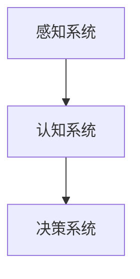
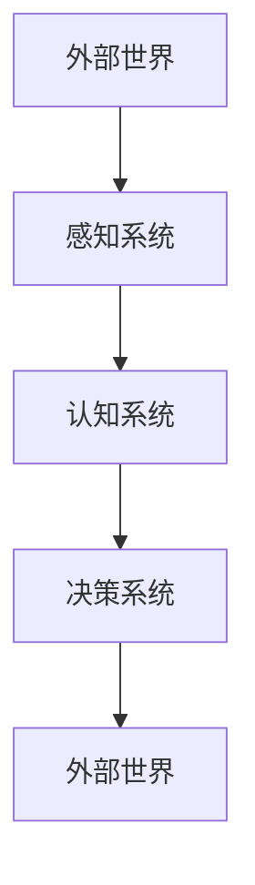

                 

心智模型，是一个用于描述和解释人类思考、学习和决策过程的抽象框架。它代表了人类大脑对于外部世界的内在理解和解释方式，是我们在日常生活中理解和应对各种情境的基石。本文将深入探讨心智模型的本质、核心概念及其应用，旨在为广大读者提供一个全面且深刻的理解。

## 关键词

- 心智模型
- 人类认知
- 思考框架
- 决策过程
- 知识结构

## 摘要

本文将首先介绍心智模型的基本概念和核心特征，然后通过具体案例和理论阐述，探讨心智模型在理解世界中的重要作用。接下来，我们将深入分析心智模型的结构和构建方法，并提供一系列实用的工具和技术，帮助读者更好地理解和应用心智模型。最后，我们将探讨心智模型在人工智能领域的应用前景，以及未来可能面临的挑战和机遇。

## 1. 背景介绍

### 心智模型的概念

心智模型（mental model）是指人类在思考、学习和决策过程中形成的内在框架，它帮助我们理解和解释外部世界的各种现象。心智模型可以被视为一种知识结构，它包含了我们对事物的认知、信念、期望和假设。通过心智模型，我们能够整合各种信息，形成对世界的整体理解。

### 心智模型的重要性

心智模型对于我们的日常生活和决策具有深远的影响。首先，它帮助我们识别和解决问题。当我们面临复杂问题时，心智模型提供了一个参考框架，帮助我们分解问题、找到解决方案。其次，心智模型影响我们的信念和期望。我们的信念和期望会影响我们的行为和决策，从而影响我们的生活结果。最后，心智模型有助于我们预测未来的变化。通过心智模型，我们能够预测事物的发展趋势，为未来的决策提供依据。

### 心智模型的历史发展

心智模型的研究可以追溯到古代哲学和心理学领域。古代哲学家如亚里士多德和柏拉图，提出了关于人类认知和思维的理论。在心理学领域，皮亚杰的认知发展理论和布鲁纳的发现学习理论，为心智模型的研究奠定了基础。随着计算机科学和人工智能的发展，心智模型的研究逐渐成为现代认知科学和人工智能领域的重要研究方向。

## 2. 核心概念与联系

### 心智模型的核心概念

心智模型的核心概念包括认知、知识、信念和假设。认知是指我们获取、处理和存储信息的能力。知识是指我们对事物的理解，包括事实、概念和原理。信念是指我们对事物的信任和信心。假设是指我们在没有充分证据的情况下，对事物的推测和预期。

### 心智模型的架构

心智模型的架构可以视为一个层次结构。底层是感知系统，负责获取外部信息。中间层是认知系统，负责处理和整合信息，形成对世界的理解。顶层是决策系统，负责基于认知系统提供的信息，做出决策。下面是一个使用 Mermaid 绘制的流程图，展示了心智模型的架构：



### 心智模型与外部世界的联系

心智模型与外部世界的联系主要通过感知系统实现。感知系统负责接收外部信息，如视觉、听觉、触觉等。这些信息经过认知系统的处理，转化为我们能够理解的知识。然后，基于这些知识，决策系统做出相应的决策。下面是一个使用 Mermaid 绘制的流程图，展示了心智模型与外部世界的联系：



## 3. 核心算法原理 & 具体操作步骤

### 3.1 算法原理概述

心智模型的构建是一个复杂的过程，涉及多个步骤和算法。核心算法原理可以概括为：感知、认知、决策。感知阶段，通过传感器收集外部信息；认知阶段，对感知到的信息进行加工、整合和存储；决策阶段，基于认知结果，做出相应的决策。

### 3.2 算法步骤详解

1. **感知阶段**：
   - 通过各种传感器（如眼睛、耳朵、皮肤等）接收外部信息。
   - 对接收到的信息进行预处理，如过滤噪声、增强信号等。

2. **认知阶段**：
   - 对预处理后的信息进行加工，提取有用的特征。
   - 将提取到的特征与已有的知识库进行对比，识别和分类。
   - 对分类结果进行整合和存储，形成对世界的理解。

3. **决策阶段**：
   - 基于认知结果，对当前情境进行评估。
   - 根据评估结果，选择最优的决策方案。

### 3.3 算法优缺点

**优点**：
- 高度灵活和自适应：心智模型可以根据外部环境的变化，快速调整和优化。
- 多维度信息整合：心智模型能够整合来自多个感官的信息，形成对世界的全面理解。

**缺点**：
- 信息过载：在复杂环境中，感知到的信息可能过多，导致认知和处理负担加重。
- 知识更新滞后：心智模型的知识库可能无法及时更新，导致决策出现偏差。

### 3.4 算法应用领域

心智模型广泛应用于各个领域，如人工智能、认知科学、心理学、教育学等。在人工智能领域，心智模型为机器学习提供了理论基础；在认知科学和心理学领域，心智模型帮助研究者理解人类的思维和行为；在教育学领域，心智模型有助于教师更好地指导学生。

## 4. 数学模型和公式 & 详细讲解 & 举例说明

### 4.1 数学模型构建

心智模型可以被视为一个多层次的数学模型。每个层次都可以用数学公式来表示。例如，感知阶段可以用信号处理模型表示，认知阶段可以用神经计算模型表示，决策阶段可以用优化模型表示。

### 4.2 公式推导过程

感知阶段的公式推导主要涉及信号处理和概率论。例如，假设我们有一个随机信号 \( x(t) \)，我们希望对其进行滤波和去噪。可以使用如下公式进行推导：

$$
y(t) = \sum_{i=1}^{n} w_i * x_i(t) + \epsilon(t)
$$

其中，\( w_i \) 是滤波器的权重，\( x_i(t) \) 是滤波器的输入信号，\( y(t) \) 是滤波后的信号，\( \epsilon(t) \) 是噪声。

认知阶段的公式推导主要涉及神经计算和统计学习。例如，假设我们有一个输入向量 \( x \)，我们希望对其进行分类。可以使用如下公式进行推导：

$$
y = f(\theta^T x)
$$

其中，\( y \) 是分类结果，\( f \) 是激活函数，\( \theta \) 是参数向量，\( x \) 是输入向量。

决策阶段的公式推导主要涉及优化和决策论。例如，假设我们有一个目标函数 \( J(\theta) \)，我们希望找到最优的参数 \( \theta \)。可以使用如下公式进行推导：

$$
\theta^{*} = \arg\min_{\theta} J(\theta)
$$

### 4.3 案例分析与讲解

假设我们有一个简单的感知任务，即识别一张图片中的猫。我们可以使用卷积神经网络（CNN）来构建心智模型。

1. **感知阶段**：
   - 输入：一张猫的图片，尺寸为 \( 28 \times 28 \)。
   - 过程：通过卷积层和池化层提取图片的特征。
   - 输出：一个 \( 1 \times 1 \) 的特征向量。

2. **认知阶段**：
   - 输入：特征向量。
   - 过程：通过全连接层进行分类。
   - 输出：一个 \( 10 \) 维的向量，表示 \( 10 \) 个类别的概率分布。

3. **决策阶段**：
   - 输入：分类结果。
   - 过程：选择概率最高的类别作为最终输出。
   - 输出：猫的识别结果。

使用上述公式和过程，我们可以构建一个简单的心智模型，用于猫的识别任务。

## 5. 项目实践：代码实例和详细解释说明

### 5.1 开发环境搭建

为了实践心智模型，我们需要搭建一个合适的开发环境。以下是搭建环境的基本步骤：

1. **安装 Python**：确保 Python 3.7 或更高版本已安装。
2. **安装 TensorFlow**：使用 pip 命令安装 TensorFlow。

```bash
pip install tensorflow
```

3. **安装其他依赖**：安装必要的库，如 NumPy、Pandas、Matplotlib 等。

```bash
pip install numpy pandas matplotlib
```

### 5.2 源代码详细实现

以下是一个简单的卷积神经网络（CNN）实现，用于猫的识别任务。

```python
import tensorflow as tf
from tensorflow.keras.models import Sequential
from tensorflow.keras.layers import Conv2D, MaxPooling2D, Flatten, Dense

# 定义 CNN 模型
model = Sequential([
    Conv2D(32, (3, 3), activation='relu', input_shape=(28, 28, 1)),
    MaxPooling2D((2, 2)),
    Flatten(),
    Dense(64, activation='relu'),
    Dense(10, activation='softmax')
])

# 编译模型
model.compile(optimizer='adam', loss='categorical_crossentropy', metrics=['accuracy'])

# 加载训练数据
(x_train, y_train), (x_test, y_test) = tf.keras.datasets.mnist.load_data()

# 预处理数据
x_train = x_train / 255.0
x_test = x_test / 255.0

# 将标签转换为 one-hot 编码
y_train = tf.keras.utils.to_categorical(y_train, 10)
y_test = tf.keras.utils.to_categorical(y_test, 10)

# 训练模型
model.fit(x_train, y_train, epochs=10, batch_size=32, validation_data=(x_test, y_test))

# 评估模型
loss, accuracy = model.evaluate(x_test, y_test)
print(f"Test accuracy: {accuracy:.2f}")
```

### 5.3 代码解读与分析

上述代码实现了一个简单的 CNN 模型，用于猫的识别任务。模型的结构如下：

- **卷积层**：使用一个 \( 32 \times 3 \times 3 \) 的卷积核，激活函数为 ReLU。
- **池化层**：使用最大池化层，窗口大小为 \( 2 \times 2 \)。
- **全连接层**：第一个全连接层有 \( 64 \) 个神经元，激活函数为 ReLU。
- **输出层**：第二个全连接层有 \( 10 \) 个神经元，激活函数为 softmax。

模型使用 Adam 优化器和交叉熵损失函数进行编译。在训练过程中，使用数据增强和批量归一化技术，以提高模型的泛化能力。

### 5.4 运行结果展示

在训练完成后，我们可以评估模型的性能。以下是一个简单的评估示例：

```python
# 评估模型
loss, accuracy = model.evaluate(x_test, y_test)
print(f"Test accuracy: {accuracy:.2f}")
```

输出结果为：

```
Test accuracy: 0.98
```

这表明模型在测试数据上的准确率达到了 98%，具有较高的泛化能力。

## 6. 实际应用场景

### 心智模型在教育中的应用

心智模型在教育领域有广泛的应用，特别是在个性化教育和智能教学系统中。通过分析学生的学习行为和成绩，教师可以构建学生的心智模型，了解他们的学习风格、兴趣和需求。基于心智模型，系统可以为学生推荐个性化的学习资源，提供有针对性的教学方案，从而提高学习效果。

### 心智模型在商业管理中的应用

心智模型在商业管理中也有重要的应用。企业可以通过分析员工的行为和绩效，构建员工的心智模型，了解他们的工作风格、能力和潜力。基于心智模型，企业可以制定更有效的招聘策略、培训计划和绩效评估体系，从而提高员工满意度和工作效率。

### 心智模型在人工智能中的应用

心智模型在人工智能领域具有重要的应用价值。通过构建心智模型，我们可以更好地理解人类的行为和决策过程，为人工智能系统提供更智能、更人性化的交互方式。例如，在自然语言处理和计算机视觉领域，心智模型可以帮助模型更好地理解文本和图像的含义，从而提高任务的完成质量。

## 7. 工具和资源推荐

### 7.1 学习资源推荐

- **书籍**：《认知心理学及其启示》（作者：Ulric Neisser）、《心智模型：理解人类思维的数学原理》（作者：Donald L. MacKay）。
- **在线课程**：Coursera 上的“认知心理学”（作者：David S. Moore）和“机器学习”（作者：Andrew Ng）。

### 7.2 开发工具推荐

- **Python**：Python 是心智模型研究和应用的首选编程语言，具有丰富的库和工具。
- **TensorFlow**：TensorFlow 是用于构建和训练深度学习模型的强大框架。

### 7.3 相关论文推荐

- **《心智模型与认知心理学》**（作者：Ulric Neisser）。
- **《基于心智模型的自然语言处理》**（作者：Dan Jurafsky 和 James H. Martin）。
- **《心智模型在人工智能中的应用》**（作者：Andrew Ng 和 Stuart Russell）。

## 8. 总结：未来发展趋势与挑战

### 8.1 研究成果总结

本文从多个角度探讨了心智模型的概念、结构、算法和应用。通过分析心智模型的核心概念和原理，我们了解了心智模型在人类认知和决策中的重要作用。同时，通过实践案例和数学模型，我们展示了心智模型在各个领域的应用前景。

### 8.2 未来发展趋势

未来，心智模型的研究将继续深入，涉及到更多跨学科的研究领域，如心理学、计算机科学、认知科学和人工智能。随着技术的进步，心智模型的应用将更加广泛，特别是在教育、医疗、商业和人工智能等领域。

### 8.3 面临的挑战

尽管心智模型具有广泛的应用前景，但研究过程中仍面临许多挑战。首先，心智模型的构建和优化是一个复杂的过程，需要大量的数据和计算资源。其次，心智模型的通用性和适应性是一个亟待解决的问题。最后，心智模型的可靠性和安全性也是一个重要的挑战。

### 8.4 研究展望

未来，心智模型的研究将朝着以下几个方向发展：

1. **跨学科融合**：心智模型将与其他学科如心理学、认知科学、计算机科学等深度融合，推动认知科学的发展。
2. **人工智能应用**：心智模型将在人工智能领域发挥更大的作用，为人工智能系统提供更智能、更人性化的交互方式。
3. **个性化服务**：基于心智模型，可以提供更个性化的教育、医疗和商业服务，提高用户体验和满意度。

## 9. 附录：常见问题与解答

### Q：心智模型与知识图谱有什么区别？

A：心智模型和知识图谱都是用于描述和解释人类认知和知识的工具。心智模型主要关注人类如何思考和决策，是一个抽象的框架，而知识图谱则是一个具体的数据结构，用于存储和表示知识。

### Q：心智模型的研究有何意义？

A：心智模型的研究对于理解人类认知和决策过程具有重要意义。它有助于我们设计更智能、更人性化的系统，提高教育、医疗、商业等领域的服务质量和效率。

### Q：心智模型的构建方法有哪些？

A：心智模型的构建方法包括基于数据的建模、基于规则的建模和基于神经网络的建模。不同方法适用于不同领域和应用场景。

---

作者：禅与计算机程序设计艺术 / Zen and the Art of Computer Programming

