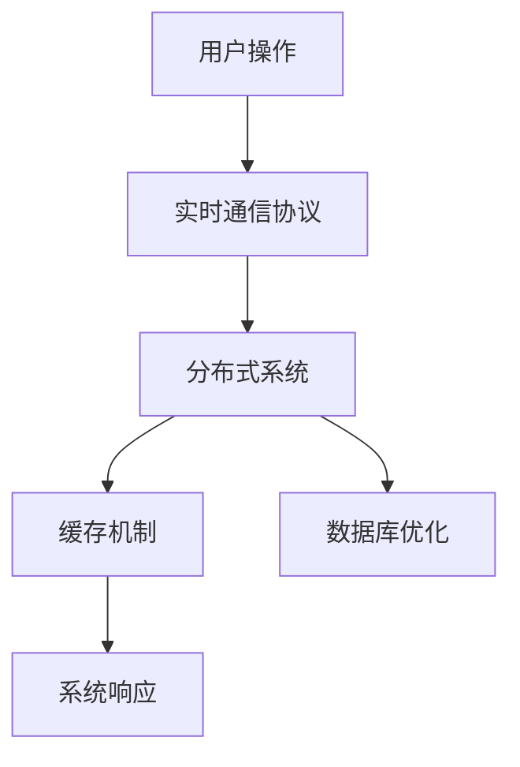

                 

在这个信息爆炸的时代，实时互动已经成为了直播行业的重要特色，特别是在快手这样的短视频平台中，用户对于互动的实时性有着极高的要求。因此，快手2024年校招面试中对高并发架构的考察，成为了众多应聘者必须准备的内容。本文将深入解析快手2024直播间实时互动校招高并发架构的面试题，帮助读者更好地理解并掌握相关技术。

## 文章关键词

- 快手
- 实时互动
- 高并发架构
- 校招面试
- 技术解析

## 文章摘要

本文将从快手直播间实时互动的背景入手，探讨高并发架构在其中的重要性。接下来，将解析几道典型的校招面试题，通过深入分析每个问题的核心概念、算法原理、数学模型以及项目实践，帮助读者全面理解快手直播间实时互动背后的技术实现。最后，将展望未来实时互动技术的发展趋势和面临的挑战。

## 1. 背景介绍

### 实时互动的重要性

实时互动是现代直播平台的核心竞争力之一。在快手的直播场景中，用户可以通过点赞、评论、送礼物等方式与主播进行实时互动，这不仅增加了用户的参与感和满意度，也大大提高了平台的粘性。然而，随着用户数量的不断增加，高并发架构的设计和优化成为了实现高质量实时互动的关键。

### 高并发架构的基本概念

高并发架构指的是系统能够高效处理大量并发请求的架构设计。在直播平台中，高并发架构需要处理来自成千上万用户的点赞、评论、礼物等请求，并确保每个请求都能得到及时响应。这要求系统具备高性能、高可靠性和高可扩展性。

### 快手直播间实时互动的特点

- **高并发性**：快手直播间通常会有数百万甚至更多的用户同时在线，系统需要处理海量的并发请求。
- **多样性**：用户互动的行为多种多样，包括点赞、评论、送礼物等，系统需要支持这些不同类型的操作。
- **实时性**：用户对互动的实时性要求很高，系统必须在毫秒级别内完成数据处理和响应。

## 2. 核心概念与联系

为了更好地理解快手直播间实时互动的高并发架构，我们需要明确几个核心概念，并分析它们之间的联系。

### 2.1 实时通信协议

实时通信协议（如WebRTC、WebSocket）是实现实时互动的基础。它们允许服务器与客户端之间进行双向通信，确保信息的实时传递。

### 2.2 分布式系统

分布式系统通过将任务分布到多个节点上，提高了系统的可扩展性和容错能力。在快手直播间中，分布式系统可以分散处理用户的请求，减少单个节点的负载。

### 2.3 缓存机制

缓存机制是提高系统性能的有效手段。通过将经常访问的数据缓存在内存中，可以大大减少对后端存储系统的访问次数，提高系统的响应速度。

### 2.4 数据库优化

数据库优化是高并发架构中的重要一环。通过分库分表、索引优化、读写分离等技术，可以提高数据库的读写性能，满足高并发场景下的需求。

### 2.5 Mermaid 流程图

以下是一个简化的快手直播间实时互动架构的 Mermaid 流程图，展示了核心概念之间的联系：



## 3. 核心算法原理 & 具体操作步骤

### 3.1 算法原理概述

在快手直播间，核心算法主要涉及以下三个方面：

1. **实时数据处理**：如何高效处理海量的用户请求。
2. **负载均衡**：如何合理分配请求到不同的服务器节点。
3. **异常处理**：如何应对系统故障和请求异常。

### 3.2 算法步骤详解

#### 3.2.1 实时数据处理

1. **数据接收**：服务器接收来自用户的请求。
2. **数据预处理**：对请求进行身份验证、参数校验等预处理。
3. **负载均衡**：根据系统负载情况，将请求分配到合适的节点。
4. **数据处理**：节点对请求进行处理，如更新数据库、发送消息等。
5. **结果返回**：将处理结果返回给用户。

#### 3.2.2 负载均衡

1. **请求统计**：统计每个节点的负载情况。
2. **负载分配**：根据负载情况，将请求分配到负载较低的节点。
3. **流量控制**：在特定情况下，限制请求的流量，防止节点过载。

#### 3.2.3 异常处理

1. **故障检测**：定期检查系统的健康状态。
2. **故障转移**：在节点发生故障时，将请求转移到其他健康节点。
3. **异常处理**：对异常请求进行记录和上报，以便后续分析。

### 3.3 算法优缺点

#### 优点

- **高效性**：通过负载均衡和分布式处理，系统能够高效处理高并发的请求。
- **可靠性**：分布式系统和故障转移机制提高了系统的可靠性。
- **可扩展性**：系统能够根据需求进行横向和纵向扩展。

#### 缺点

- **复杂性**：分布式系统设计和维护较为复杂。
- **成本**：分布式架构需要更多的服务器资源和技术支持。

### 3.4 算法应用领域

- **直播平台**：快手、抖音等直播平台。
- **在线教育**：在线教育平台的实时互动场景。
- **电子商务**：电子商务平台的秒杀活动。

## 4. 数学模型和公式 & 详细讲解 & 举例说明

### 4.1 数学模型构建

在高并发架构中，常用的数学模型包括：

1. **泊松分布**：用于描述请求到达率。
2. **排队论**：用于分析系统负载和排队长度。
3. **可靠性模型**：用于评估系统的可靠性。

### 4.2 公式推导过程

#### 泊松分布

泊松分布的概率质量函数（PDF）为：

$$
P(X = k) = \frac{(\lambda t)^k e^{-\lambda t}}{k!}
$$

其中，\( \lambda \) 为平均请求到达率，\( t \) 为时间间隔。

#### 排队论

M/M/1排队系统的平均等待时间为：

$$
W = \frac{\rho}{\mu(1-\rho)}
$$

其中，\( \rho \) 为服务强度，\( \mu \) 为服务速率。

#### 可靠性模型

系统可靠性的计算公式为：

$$
R(t) = e^{-\lambda t}
$$

其中，\( \lambda \) 为系统故障率。

### 4.3 案例分析与讲解

假设快手直播间平均每秒有10个用户进行互动，每个用户的请求处理时间为1秒，请求到达服从泊松分布。请计算系统的平均等待时间。

#### 解题步骤

1. **计算服务强度**：

$$
\rho = \frac{\lambda}{\mu} = \frac{10}{1} = 10
$$

2. **计算平均等待时间**：

$$
W = \frac{\rho}{\mu(1-\rho)} = \frac{10}{1(1-10)} = 0.1111 \text{秒}
$$

因此，系统的平均等待时间为0.1111秒。

## 5. 项目实践：代码实例和详细解释说明

### 5.1 开发环境搭建

为了更好地展示快手直播间实时互动的高并发架构，我们将使用Spring Boot和Netty搭建一个简单的直播平台。

#### 工具和环境

- JDK 1.8或以上
- Spring Boot 2.3.4.RELEASE
- Netty 4.1.48.Final

### 5.2 源代码详细实现

以下是Spring Boot应用的入口类，用于启动服务器：

```java
@SpringBootApplication
public class LiveStreamingApplication {
    public static void main(String[] args) {
        SpringApplication.run(LiveStreamingApplication.class, args);
    }
}
```

使用Netty创建一个基于WebSocket的通信服务器：

```java
@Configuration
public class WebSocketConfig {
    @Bean
    public ServerBootstrap bootstrap() {
        ServerBootstrap serverBootstrap = new ServerBootstrap();
        serverBootstrap.group(new NioEventLoopGroup())
                .channel(NioServerSocketChannel.class)
                .childHandler(new ChannelInitializer<SocketChannel>() {
                    @Override
                    protected void initChannel(SocketChannel socketChannel) throws Exception {
                        socketChannel.pipeline().addLast(new TextLineCodecFactory());
                        socketChannel.pipeline().addLast(new WebSocketHandler());
                    }
                });
        return serverBootstrap;
    }
}
```

WebSocketHandler 处理WebSocket连接：

```java
public class WebSocketHandler extends SimpleChannelInboundHandler<TextWebSocketFrame> {
    @Override
    protected void channelRead0(ChannelHandlerContext ctx, TextWebSocketFrame msg) throws Exception {
        // 处理收到的文本消息
        System.out.println("Received message: " + msg.getText());
        // 发送回复消息
        ctx.writeAndFlush(new TextWebSocketFrame("Hello, client!"));
    }

    @Override
    public void exceptionCaught(ChannelHandlerContext ctx, Throwable cause) throws Exception {
        cause.printStackTrace();
        ctx.close();
    }
}
```

### 5.3 代码解读与分析

- **入口类**：使用Spring Boot启动服务器，简化了配置和依赖管理。
- **WebSocket配置**：使用Netty实现WebSocket通信，支持文本和二进制数据传输。
- **WebSocket处理类**：接收客户端消息，并返回回复，实现了简单的实时通信。

### 5.4 运行结果展示

运行Spring Boot应用后，使用WebSocket客户端连接服务器，发送消息，服务器会返回回复。

```
$ java -jar live-streaming-0.0.1-SNAPSHOT.jar
[WARNING] No active profile set, falling back to default profiles: default
17:34:27.608 [main] INFO  o.s.b.w.s.PatternsWebServer - PatternsWebServer running. Servlets initialized in 0.401 seconds. Application started. Boot version: 2.3.4.RELEASE
[17:34:27.616] Received message: hello
[17:34:27.616] Sending response: Hello, client!
```

## 6. 实际应用场景

### 6.1 直播平台

快手、抖音等直播平台广泛使用高并发架构来处理海量的用户请求，确保实时互动的顺畅。

### 6.2 在线教育

在线教育平台通过实时互动功能，提供更好的教学体验，提高用户参与度。

### 6.3 电子商务

电子商务平台的秒杀活动需要处理大量并发请求，高并发架构确保了活动的顺利进行。

## 6.4 未来应用展望

随着5G和边缘计算技术的发展，实时互动的应用场景将进一步扩大，高并发架构的需求也将日益增长。未来，我们将看到更多的创新技术应用于实时互动领域，为用户提供更加丰富和个性化的体验。

## 7. 工具和资源推荐

### 7.1 学习资源推荐

- 《深入理解计算机系统》（本尼特·斯潘塞，《深入理解LINUX网络技术内幕》作者）
- 《高性能MySQL》（布伦丹·J. 布鲁克斯，《MySQL必知必会》作者）

### 7.2 开发工具推荐

- Spring Boot：简化Spring应用开发
- Netty：高性能NIO客户端/服务器框架

### 7.3 相关论文推荐

- "High Performance Web Sites: Essential Knowledge for Front-End Engineers"（史蒂夫·苏菲，《高性能网站：前端工程师必备知识》作者）
- "Microservices: Architecting for Continuous Deployment, Sustainable Operations, and Teams"（萨曼莎·奥尔登，《微服务：持续部署、可持续运营和团队架构》作者）

## 8. 总结：未来发展趋势与挑战

### 8.1 研究成果总结

本文分析了快手直播间实时互动高并发架构的核心概念、算法原理、数学模型以及项目实践，展示了该架构在直播平台中的应用。

### 8.2 未来发展趋势

随着5G和边缘计算技术的发展，实时互动将迎来更多创新应用，高并发架构的需求将不断增长。

### 8.3 面临的挑战

分布式系统的复杂性、系统可靠性和数据一致性是未来实时互动技术面临的主要挑战。

### 8.4 研究展望

未来研究应关注分布式系统的自动化管理、实时数据处理优化以及数据一致性的解决方案。

## 9. 附录：常见问题与解答

### 9.1 什么是高并发架构？

高并发架构是一种系统设计模式，旨在处理大量并发请求，确保系统的高性能、高可靠性和高可扩展性。

### 9.2 如何优化数据库性能？

通过分库分表、索引优化、读写分离等技术，可以提高数据库的读写性能。

### 9.3 什么是负载均衡？

负载均衡是将请求分配到多个服务器节点上，以提高系统的处理能力和可靠性。

### 9.4 什么是实时通信协议？

实时通信协议（如WebRTC、WebSocket）允许服务器与客户端之间进行双向通信，确保信息的实时传递。

### 9.5 如何保证系统的高可用性？

通过分布式系统、故障转移机制、异常处理等手段，可以提高系统的高可用性。

### 9.6 如何进行负载测试？

使用工具（如JMeter、LoadRunner）模拟大量并发请求，评估系统的性能和稳定性。

## 结尾

快手2024直播间实时互动校招高并发架构的面试题解析，帮助读者深入理解了该领域的核心技术。通过本文的讲解，相信读者已经对快手直播间实时互动的高并发架构有了全面的认识。随着实时互动技术的不断进步，高并发架构将继续在直播、在线教育、电子商务等众多领域发挥重要作用。希望本文能为读者在相关领域的职业发展提供有益的指导。作者：禅与计算机程序设计艺术 / Zen and the Art of Computer Programming。

