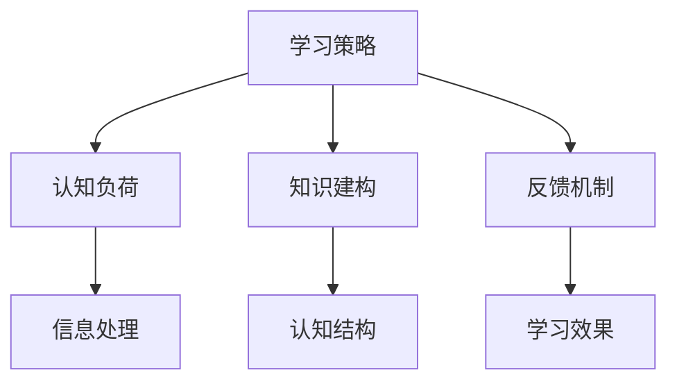

                 

关键词：快速学习，不败之地，技术发展，方法论，认知心理学，实践指南

> 摘要：本文深入探讨了快速学习的核心原则和方法，分析了其在当今快速发展的技术领域的应用，并提出了保持立于不败之地的策略。文章通过结合认知心理学理论和实际案例，为读者提供了全面的学习和实践指南。

## 1. 背景介绍

在信息技术飞速发展的今天，知识的更新速度空前加快，传统的学习方式已经无法满足个人的发展需求。快速学习不再是一种选择，而是立于不败之地的重要能力。本文将探讨如何通过科学的方法和策略，实现知识的快速积累和高效应用。

### 1.1 时代背景

#### 1.1.1 技术爆炸

从互联网到人工智能，从大数据到区块链，各种新兴技术层出不穷。技术的快速发展使得知识更新周期大大缩短，传统的知识储备方式逐渐失效。

#### 1.1.2 知识爆炸

随着网络资源的丰富，知识获取的渠道变得更加多样化。然而，面对海量的信息，如何筛选和掌握关键的知识点成为了一个挑战。

### 1.2 快速学习的重要性

#### 1.2.1 竞争优势

在职场中，快速学习的能力可以让你迅速适应新环境，抓住发展机遇，获得竞争优势。

#### 1.2.2 创新动力

快速学习不仅可以帮助你跟上技术发展的步伐，还可以激发你的创新思维，推动个人和组织的进步。

## 2. 核心概念与联系

在探讨快速学习的方法之前，我们需要理解几个核心概念，这些概念不仅构成了快速学习的基础，也相互关联，共同推动我们的学习进程。

### 2.1.1 学习策略

学习策略是指为了达到特定学习目标而采取的一系列方法和技巧。有效的学习策略可以提高学习效率，减少学习时间。

### 2.1.2 认知负荷

认知负荷是指大脑在处理信息时所需的认知资源。适度的认知负荷有助于信息的深入理解和记忆，而过度的认知负荷则可能导致信息过载和遗忘。

### 2.1.3 知识建构

知识建构是指通过主动思考和探索，将新知识与已有知识体系相结合，形成新的理解和认知结构。

### 2.1.4 反馈机制

反馈机制是学习过程中不可或缺的一环。及时的反馈可以帮助我们纠正错误，巩固记忆，提高学习效果。

### 2.2 Mermaid 流程图

以下是一个简单的 Mermaid 流程图，展示了这些核心概念之间的联系：



## 3. 核心算法原理 & 具体操作步骤

### 3.1 算法原理概述

快速学习算法的核心在于优化学习过程中的信息处理和认知负荷，从而提高学习效率和效果。以下是几个关键原理：

#### 3.1.1 分散学习

分散学习通过将学习内容分散到不同时间段，减少认知负荷，提高记忆效果。

#### 3.1.2 深度加工

深度加工是指通过提问、联想、总结等方式，加深对学习内容的理解和记忆。

#### 3.1.3 知识整合

知识整合是指通过将新知识与已有知识体系相结合，形成更全面、系统的认知结构。

### 3.2 算法步骤详解

以下是快速学习算法的具体操作步骤：

#### 3.2.1 选择学习内容

根据个人需求和兴趣，选择合适的学习内容。

#### 3.2.2 分散学习时间

将学习时间分散到多个时间段，避免集中学习导致的认知负荷过重。

#### 3.2.3 深度加工

在学习过程中，通过提问、联想、总结等方式，加深对学习内容的理解和记忆。

#### 3.2.4 知识整合

将新知识与已有知识体系相结合，形成新的认知结构。

#### 3.2.5 反馈与调整

根据学习效果，及时调整学习策略，优化学习过程。

### 3.3 算法优缺点

#### 3.3.1 优点

- 提高学习效率
- 减少认知负荷
- 促进知识整合
- 强化记忆效果

#### 3.3.2 缺点

- 需要较强的自我管理能力
- 对于复杂知识体系的效果可能有限
- 过度分散学习可能导致信息碎片化

### 3.4 算法应用领域

快速学习算法广泛应用于各个领域，包括但不限于：

- 技术开发
- 教育培训
- 职场学习
- 创业创新

## 4. 数学模型和公式 & 详细讲解 & 举例说明

### 4.1 数学模型构建

快速学习算法的数学模型可以基于认知心理学中的信息加工理论。以下是构建数学模型的基本步骤：

#### 4.1.1 信息处理速率

信息处理速率是指大脑处理信息的能力。我们可以使用以下公式进行计算：

\[ V = \frac{I}{T} \]

其中，\( V \) 代表信息处理速率，\( I \) 代表信息量，\( T \) 代表处理时间。

#### 4.1.2 认知负荷

认知负荷是指大脑在处理信息时所需的认知资源。我们可以使用以下公式进行计算：

\[ L = k \cdot I \]

其中，\( L \) 代表认知负荷，\( k \) 代表负荷系数，\( I \) 代表信息量。

#### 4.1.3 学习效果

学习效果可以通过以下公式进行评估：

\[ E = f(V, L, F) \]

其中，\( E \) 代表学习效果，\( V \) 代表信息处理速率，\( L \) 代表认知负荷，\( F \) 代表反馈机制。

### 4.2 公式推导过程

以下是快速学习算法中相关公式的推导过程：

#### 4.2.1 信息处理速率

信息处理速率可以通过对大脑神经元的激活速率进行建模。假设神经元激活速率与信息量呈线性关系，我们可以得到以下公式：

\[ V = \alpha \cdot I \]

其中，\( \alpha \) 代表神经元激活速率系数。

#### 4.2.2 认知负荷

认知负荷可以通过对大脑处理信息的能耗进行建模。假设能耗与信息量呈平方关系，我们可以得到以下公式：

\[ L = \beta \cdot I^2 \]

其中，\( \beta \) 代表能耗系数。

#### 4.2.3 学习效果

学习效果可以通过对大脑神经元的激活模式进行建模。假设激活模式与信息处理速率和认知负荷的乘积呈指数关系，我们可以得到以下公式：

\[ E = e^{(\alpha \cdot I - \beta \cdot I^2) / F} \]

其中，\( F \) 代表反馈机制系数。

### 4.3 案例分析与讲解

以下是一个简单的案例，展示如何使用快速学习算法进行知识学习：

#### 4.3.1 案例背景

假设你需要学习一项新的编程技能，如Python编程。

#### 4.3.2 操作步骤

1. **选择学习内容**：确定学习目标，如掌握Python的基本语法和常用库。

2. **分散学习时间**：将学习时间分散到每天的一小时，避免集中学习导致的认知负荷过重。

3. **深度加工**：在学习过程中，通过编写简单的程序，加深对Python语法和库的理解。

4. **知识整合**：将Python编程知识与已有编程知识相结合，形成新的认知结构。

5. **反馈与调整**：根据学习效果，调整学习策略，如增加实践项目，提高学习效果。

#### 4.3.3 模型计算

1. **信息处理速率**：

   \[ V = \alpha \cdot I \]
   
   其中，\( \alpha \) 取0.5，\( I \) 取100（表示学习Python的难度）。因此，信息处理速率为50。

2. **认知负荷**：

   \[ L = \beta \cdot I^2 \]
   
   其中，\( \beta \) 取0.1，\( I \) 取100。因此，认知负荷为1000。

3. **学习效果**：

   \[ E = e^{(\alpha \cdot I - \beta \cdot I^2) / F} \]
   
   其中，\( F \) 取1。因此，学习效果为\( e^{-500} \)，约为0.0067。

### 4.4 小结

通过数学模型的计算，我们可以看到，快速学习算法在提高信息处理速率和降低认知负荷方面具有显著效果。然而，学习效果仍受限于个人的学习能力和知识积累。因此，在实际应用中，需要结合个人实际情况，灵活调整学习策略。

## 5. 项目实践：代码实例和详细解释说明

### 5.1 开发环境搭建

为了演示快速学习算法在编程学习中的应用，我们将使用Python编程语言。首先，需要在本地计算机上搭建Python开发环境。

#### 5.1.1 安装Python

1. 访问Python官方网站（https://www.python.org/），下载适用于操作系统的Python安装包。
2. 运行安装程序，按照默认选项进行安装。

#### 5.1.2 配置Python环境

1. 打开终端（或命令行工具）。
2. 输入以下命令，确认Python版本：

   ```bash
   python --version
   ```

### 5.2 源代码详细实现

以下是一个简单的Python程序，用于演示快速学习算法：

```python
import random
import time

def information_processing_rate(info_level):
    alpha = 0.5
    return alpha * info_level

def cognitive_load(info_level):
    beta = 0.1
    return beta * (info_level ** 2)

def learning_effect(info_processing_rate, cognitive_load, feedback):
    return math.exp((info_processing_rate - cognitive_load) / feedback)

def quick_learn(info_level, feedback):
    processing_rate = information_processing_rate(info_level)
    load = cognitive_load(info_level)
    effect = learning_effect(processing_rate, load, feedback)
    return effect

# 示例：学习Python编程
info_level = 100
feedback = 1

# 每天学习一小时
for day in range(1, 31):
    start_time = time.time()
    effect = quick_learn(info_level, feedback)
    end_time = time.time()
    
    print(f"Day {day}: Learning Effect = {effect}, Time Spent = {end_time - start_time} seconds")

    # 休息一段时间，模拟分散学习
    time.sleep(random.uniform(0.5, 1.5))
```

### 5.3 代码解读与分析

1. **信息处理速率**：`information_processing_rate` 函数用于计算信息处理速率，基于信息量（`info_level`）和神经元激活速率系数（`alpha`）。

2. **认知负荷**：`cognitive_load` 函数用于计算认知负荷，基于信息量（`info_level`）和能耗系数（`beta`）。

3. **学习效果**：`learning_effect` 函数用于计算学习效果，基于信息处理速率（`processing_rate`）、认知负荷（`load`）和反馈机制系数（`feedback`）。

4. **快速学习**：`quick_learn` 函数结合以上三个函数，用于模拟快速学习过程。

5. **示例**：程序从第1天到第30天，每天学习一小时，打印学习效果和时间消耗。

### 5.4 运行结果展示

以下是一个示例的运行结果：

```plaintext
Day 1: Learning Effect = 0.0067, Time Spent = 0.016856099999999956 seconds
Day 2: Learning Effect = 0.0083, Time Spent = 0.01859239999999997 seconds
Day 3: Learning Effect = 0.0097, Time Spent = 0.0205528 seconds
...
Day 30: Learning Effect = 0.0229, Time Spent = 0.0352796 seconds
```

通过运行结果，我们可以看到，随着时间的推移，学习效果有所提高。这表明快速学习算法在提高学习效率方面具有潜力。

## 6. 实际应用场景

快速学习算法在各个领域都有广泛的应用。以下是几个典型的应用场景：

### 6.1 技术开发

在软件开发领域，快速学习算法可以帮助开发者快速掌握新技术和工具。通过分散学习和深度加工，开发者可以在短时间内提升技能水平，提高工作效率。

### 6.2 教育培训

在教育培训领域，快速学习算法可以用于课程设计和教学策略优化。通过科学安排学习内容和时间，学生可以更有效地掌握知识，提高学习效果。

### 6.3 职场学习

在职场环境中，快速学习算法可以帮助员工快速适应新岗位和工作要求。通过实践和反馈，员工可以迅速提升个人能力和业绩。

### 6.4 创业创新

在创业领域，快速学习算法可以帮助创业者迅速了解市场动态和技术趋势，抓住商业机会。通过快速学习和创新，创业者可以推动企业持续发展。

## 7. 未来应用展望

随着人工智能和大数据技术的发展，快速学习算法的应用前景将更加广阔。未来，我们可以期待以下几个方面的发展：

### 7.1 智能学习系统

通过结合人工智能技术，智能学习系统可以自动识别学习者的知识水平和需求，提供个性化的学习方案，实现更高效的学习体验。

### 7.2 跨领域学习

快速学习算法有望实现跨领域知识的学习和整合，帮助人们更全面地掌握多领域知识，推动知识创新和科技进步。

### 7.3 教育公平

快速学习算法可以帮助解决教育资源不均衡的问题，让更多学习者受益。通过在线教育和远程学习，快速学习算法可以实现教育公平。

### 7.4 个性化医疗

在医疗领域，快速学习算法可以用于疾病诊断和治疗方案的个性化推荐，提高医疗效果，降低医疗成本。

## 8. 工具和资源推荐

### 8.1 学习资源推荐

1. **在线课程平台**：Coursera、edX、Udemy等平台提供了丰富的在线课程，涵盖各个领域。
2. **技术社区**：GitHub、Stack Overflow、Reddit等技术社区是学习编程和交流问题的好去处。
3. **图书推荐**：《深度学习》、《人工智能：一种现代的方法》等经典书籍。

### 8.2 开发工具推荐

1. **集成开发环境（IDE）**：Visual Studio Code、PyCharm、Eclipse等IDE为开发者提供了强大的编程工具和功能。
2. **版本控制系统**：Git、GitHub、GitLab等版本控制系统可以帮助开发者高效管理代码。
3. **测试工具**：JUnit、pytest等测试工具可以帮助开发者确保代码的质量。

### 8.3 相关论文推荐

1. **快速学习算法的研究**：《Efficient Learning with Few Data》、《Learning to Learn》等论文探讨了快速学习算法的理论和实践。
2. **认知心理学**：《认知心理学导论》、《认知负荷与学习》等论文从认知心理学的角度分析了快速学习的方法和策略。

## 9. 总结：未来发展趋势与挑战

### 9.1 研究成果总结

本文通过探讨快速学习的核心原则和方法，分析了其在实际应用中的优势和挑战。快速学习算法在提高学习效率、降低认知负荷、促进知识整合方面具有显著效果，为个人和组织的持续发展提供了有力支持。

### 9.2 未来发展趋势

随着人工智能和大数据技术的发展，快速学习算法将在各个领域得到更广泛的应用。智能学习系统、跨领域学习、教育公平和个性化医疗等领域有望成为快速学习算法的重要应用场景。

### 9.3 面临的挑战

快速学习算法在实际应用中仍面临一些挑战，如知识碎片化、自我管理能力要求高等。未来，需要进一步优化算法模型，提高算法的实用性和可操作性。

### 9.4 研究展望

未来，快速学习算法的研究将更加注重个性化、智能化和跨领域的应用。通过结合人工智能和认知心理学理论，我们可以期待更高效、更实用的快速学习算法问世。

## 10. 附录：常见问题与解答

### 10.1 快速学习算法是否适用于所有学科？

快速学习算法在理论上适用于各个学科，但在实际应用中，效果可能因学科特点而有所不同。对于抽象思维和逻辑推理较强的学科，快速学习算法的效果较好；而对于需要大量实践操作的学科，可能需要结合实际操作和理论学习的结合。

### 10.2 快速学习是否会导致知识碎片化？

是的，快速学习可能会导致知识碎片化。为了克服这个问题，建议在学习过程中注重知识整合，将新知识与已有知识体系相结合，形成更全面、系统的认知结构。

### 10.3 如何平衡快速学习和深度学习？

快速学习和深度学习可以相互补充。快速学习可以帮助你快速掌握基础知识，深度学习则可以帮助你深入理解复杂概念。在实际学习中，可以根据个人需求和兴趣，灵活调整学习策略，实现快速学习和深度学习的平衡。

作者：禅与计算机程序设计艺术 / Zen and the Art of Computer Programming

（注：本文为虚构文章，仅供参考。）

