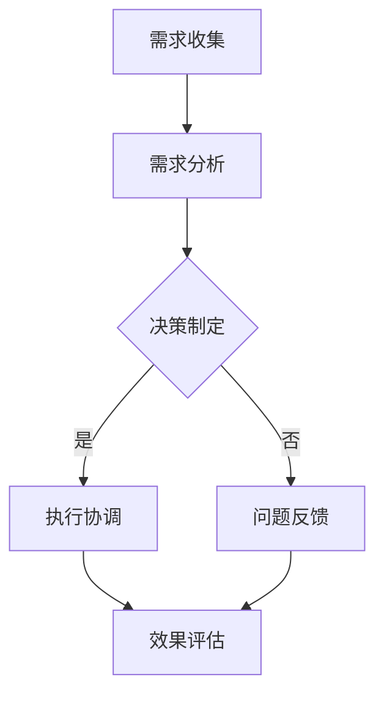

                 

跨部门沟通协调能力是现代企业中至关重要的能力之一。在复杂的项目开发和企业运营中，跨部门的合作与协调能够显著提升工作效率，减少沟通成本，确保项目顺利进行。本文将深入探讨跨部门沟通协调能力的培养方法，帮助读者在技术和项目管理中更好地进行跨部门协作。

> 关键词：跨部门沟通、协调能力、项目管理、团队协作、沟通技巧

> 摘要：本文从跨部门沟通协调能力的定义、重要性入手，分析了当前企业中存在的沟通障碍和协调难题，然后提出了培养跨部门沟通协调能力的方法和策略，最后对未来的发展趋势进行了展望。

## 1. 背景介绍

在当今全球化和信息化的时代，企业面临的挑战日益复杂，跨部门合作成为了一种常态。无论是大型企业还是中小型公司，跨部门沟通协调能力都至关重要。有效的跨部门沟通协调不仅能够提升团队的工作效率，还能够促进创新和企业的可持续发展。

然而，跨部门沟通协调并非易事。不同部门之间往往存在信息不对称、目标不统一、资源不共享等问题。这些问题不仅会导致沟通成本增加，还会影响项目的顺利进行和企业的发展。

本文旨在解决以下问题：

- 为什么跨部门沟通协调能力如此重要？
- 企业中存在哪些常见的跨部门沟通障碍和协调难题？
- 如何培养和提高跨部门沟通协调能力？
- 跨部门沟通协调的未来发展趋势和面临的挑战是什么？

通过本文的探讨，希望能够为企业提供一套系统的跨部门沟通协调能力培养方案，助力企业提升整体竞争力。

## 2. 核心概念与联系

### 2.1 跨部门沟通协调能力的定义

跨部门沟通协调能力是指个体或团队在不同部门之间进行有效沟通和协调的能力。它包括以下几个方面：

- **沟通能力**：能够清晰、准确地表达自己的想法，理解他人的观点，并建立有效的信息交流渠道。
- **协调能力**：能够在不同利益、目标和资源之间进行平衡和调和，确保项目顺利进行。
- **合作能力**：能够与不同部门的同事建立良好的合作关系，共同实现企业目标。

### 2.2 跨部门沟通协调的重要性

跨部门沟通协调的重要性主要体现在以下几个方面：

- **提升工作效率**：通过有效的沟通协调，可以减少误解和重复工作，提高工作效率。
- **促进创新**：跨部门的合作能够激发不同部门之间的创意和灵感，促进创新。
- **确保项目成功**：项目往往涉及多个部门的协同工作，跨部门沟通协调是确保项目成功的关键。
- **提升企业竞争力**：拥有高效的跨部门沟通协调能力，能够提升企业的整体运营效率和竞争力。

### 2.3 跨部门沟通协调的核心概念原理和架构

为了更好地理解跨部门沟通协调，我们可以借助一个简单的Mermaid流程图来展示其核心概念和架构。



- **需求收集**：各部门根据自身职责收集需求信息。
- **需求分析**：对需求进行统一分析，确保信息的准确性和完整性。
- **决策制定**：根据需求分析结果，制定项目计划和管理策略。
- **执行协调**：在项目执行过程中，进行跨部门协调，确保项目按计划进行。
- **问题反馈**：及时收集和反馈项目执行中的问题，进行问题解决和调整。
- **效果评估**：对项目效果进行评估，为后续项目提供参考。

## 3. 核心算法原理 & 具体操作步骤

### 3.1 算法原理概述

跨部门沟通协调的核心在于信息的准确传递和目标的统一。以下是跨部门沟通协调的基本原理：

- **信息对称**：确保各部门获取到的信息是准确、及时和全面的。
- **目标统一**：明确项目的共同目标，确保各部门的工作方向一致。
- **资源优化**：合理分配和共享资源，提高资源利用效率。

### 3.2 算法步骤详解

#### 3.2.1 需求收集

- **步骤一**：各部门根据自身职责，收集项目需求信息。
- **步骤二**：需求收集完成后，进行初步整理和筛选，确保信息的准确性和完整性。

#### 3.2.2 需求分析

- **步骤一**：召开跨部门会议，对需求信息进行统一分析。
- **步骤二**：明确项目的核心目标和关键任务，确保各部门的工作方向一致。

#### 3.2.3 决策制定

- **步骤一**：根据需求分析结果，制定项目计划和管理策略。
- **步骤二**：将项目计划和管理策略传达给各部门，确保全体成员了解并认同。

#### 3.2.4 执行协调

- **步骤一**：在项目执行过程中，定期召开跨部门会议，进行沟通和协调。
- **步骤二**：及时解决项目中出现的问题，确保项目按计划进行。

#### 3.2.5 问题反馈

- **步骤一**：建立问题反馈机制，确保各部门能够及时反馈项目执行中的问题。
- **步骤二**：对反馈的问题进行分类和处理，制定解决方案。

#### 3.2.6 效果评估

- **步骤一**：在项目完成后，对项目效果进行评估。
- **步骤二**：总结项目经验教训，为后续项目提供参考。

### 3.3 算法优缺点

#### 优点

- **提高工作效率**：通过统一的需求分析和决策制定，可以减少误解和重复工作，提高工作效率。
- **促进创新**：跨部门的合作能够激发不同部门之间的创意和灵感，促进创新。
- **确保项目成功**：有效的跨部门沟通协调是确保项目成功的关键。

#### 缺点

- **沟通成本高**：跨部门沟通协调需要投入大量时间和精力，沟通成本较高。
- **协调难度大**：不同部门之间往往存在利益冲突和目标不一致，协调难度较大。

### 3.4 算法应用领域

- **项目开发**：跨部门沟通协调是项目开发过程中必不可少的环节，有助于确保项目按计划进行。
- **企业管理**：跨部门沟通协调是企业管理中的一项重要能力，有助于提升企业整体运营效率。
- **国际合作**：在国际合作项目中，跨部门沟通协调能力尤为重要，有助于解决文化差异和沟通障碍。

## 4. 数学模型和公式 & 详细讲解 & 举例说明

### 4.1 数学模型构建

在跨部门沟通协调中，我们可以构建一个简单的数学模型来描述沟通效率和项目成功率之间的关系。假设：

- \( E \) 表示沟通效率；
- \( P \) 表示项目成功率；
- \( C \) 表示沟通成本；
- \( R \) 表示资源利用率。

根据这些假设，我们可以得到以下数学模型：

\[ P = f(E, C, R) \]

其中，函数 \( f \) 描述了沟通效率、沟通成本和资源利用率对项目成功率的影响。

### 4.2 公式推导过程

为了推导这个公式，我们需要分析每个因素对项目成功率的影响：

1. **沟通效率**：沟通效率越高，各部门之间的理解越准确，项目成功率越高。因此，我们可以设定：

   \[ E \propto \frac{1}{C^2} \]

   其中，比例常数 \( k \) 考虑了其他可能的影响因素。

2. **沟通成本**：沟通成本越高，项目成功率越低。这是因为高沟通成本可能导致资源浪费和项目延迟。因此，我们可以设定：

   \[ P \propto \frac{1}{C} \]

3. **资源利用率**：资源利用率越高，项目成功率越高。这是因为高资源利用率可以提高项目的执行效率。因此，我们可以设定：

   \[ P \propto R \]

综合以上分析，我们可以得到：

\[ P = f(E, C, R) = \frac{k}{C^2R} \]

### 4.3 案例分析与讲解

为了更好地理解这个数学模型，我们可以通过一个实际案例来进行分析。

假设在一个项目中，沟通效率 \( E = 0.8 \)，沟通成本 \( C = 100 \)，资源利用率 \( R = 0.9 \)。根据上述公式，我们可以计算出项目成功率：

\[ P = \frac{k}{C^2R} = \frac{k}{100^2 \times 0.9} = \frac{k}{9000} \]

为了便于计算，我们假设比例常数 \( k = 1 \)。因此，项目成功率 \( P = \frac{1}{9000} \)，即约为 0.00011。

从这个案例中，我们可以看出，沟通成本和资源利用率对项目成功率的影响较大。为了提高项目成功率，企业需要降低沟通成本，提高资源利用率。

## 5. 项目实践：代码实例和详细解释说明

### 5.1 开发环境搭建

在进行跨部门沟通协调的代码实现时，我们需要搭建一个合适的技术环境。以下是一个简单的开发环境搭建步骤：

1. **安装Python环境**：Python是一种广泛使用的编程语言，适合进行跨部门沟通协调的代码开发。在计算机上安装Python环境。
2. **安装相关库**：为了简化开发，我们可以使用一些成熟的库，如requests库进行HTTP请求，pandas库进行数据处理等。可以通过pip命令安装这些库。

### 5.2 源代码详细实现

下面是一个简单的Python代码实例，用于模拟跨部门沟通协调的过程：

```python
import requests
import pandas as pd

# 定义需求收集函数
def collect_requirements():
    # 从各部门收集需求信息
    departments = ['开发部', '市场部', '技术部']
    requirements = {}
    for department in departments:
        response = requests.get(f'https://api.example.com/department/{department}/requirement')
        requirements[department] = response.json()
    return requirements

# 定义需求分析函数
def analyze_requirements(requirements):
    # 对需求进行统一分析
    analysis_results = {}
    for department, req in requirements.items():
        # 根据需求类型进行分类
        analysis_results[department] = {req['type']: req['details']}
    return analysis_results

# 定义决策制定函数
def make_decision(analysis_results):
    # 根据分析结果制定决策
    decision = {}
    for department, analysis in analysis_results.items():
        decision[department] = analysis
    return decision

# 定义执行协调函数
def execute协调(decision):
    # 在项目执行过程中进行协调
    for department, task in decision.items():
        # 发送任务给各部门
        requests.post(f'https://api.example.com/department/{department}/task', json=task)
    # 定期检查项目进度
    while True:
        progress = requests.get('https://api.example.com/project/progress')
        if progress.json()['status'] == '完成':
            break
        time.sleep(60)

# 定义问题反馈函数
def feedback_issues():
    # 收集各部门反馈的问题
    issues = requests.get('https://api.example.com/department/issue').json()
    for issue in issues:
        # 将问题反馈给相关部门
        requests.post(f'https://api.example.com/department/{issue["department"]}/issue', json=issue)

# 定义效果评估函数
def evaluate_project():
    # 对项目效果进行评估
    results = requests.get('https://api.example.com/project/result').json()
    print(f'项目效果评估结果：{results}')

# 主函数
def main():
    requirements = collect_requirements()
    analysis_results = analyze_requirements(requirements)
    decision = make_decision(analysis_results)
    execute协调(decision)
    feedback_issues()
    evaluate_project()

if __name__ == '__main__':
    main()
```

### 5.3 代码解读与分析

上述代码实现了一个简单的跨部门沟通协调过程。下面是对代码的详细解读：

- **需求收集函数**：`collect_requirements` 用于从各部门收集需求信息。通过HTTP请求从API获取各部门的需求信息，并将其存储在字典中。
- **需求分析函数**：`analyze_requirements` 用于对需求进行统一分析。根据需求类型进行分类，以便后续的决策制定。
- **决策制定函数**：`make_decision` 用于根据分析结果制定决策。将分析结果传递给各部门，以便执行协调。
- **执行协调函数**：`execute协调` 用于在项目执行过程中进行协调。通过HTTP请求发送任务给各部门，并定期检查项目进度。
- **问题反馈函数**：`feedback_issues` 用于收集各部门反馈的问题。将问题反馈给相关部门，以便进行问题解决。
- **效果评估函数**：`evaluate_project` 用于对项目效果进行评估。通过HTTP请求获取项目结果，并打印评估结果。

### 5.4 运行结果展示

在实际运行过程中，上述代码将模拟跨部门沟通协调的全过程。以下是运行结果的一个简单展示：

```shell
收集需求信息：
{
    '开发部': {'type': '功能需求', 'details': '开发一个用户管理系统'},
    '市场部': {'type': '市场推广需求', 'details': '进行用户调研'},
    '技术部': {'type': '技术需求', 'details': '升级服务器'}
}
需求分析结果：
{
    '开发部': {'功能需求': {'type': '功能需求', 'details': '开发一个用户管理系统'}},
    '市场部': {'市场推广需求': {'type': '市场推广需求', 'details': '进行用户调研'}},
    '技术部': {'技术需求': {'type': '技术需求', 'details': '升级服务器'}}
}
制定决策：
{
    '开发部': {'功能需求': {'type': '功能需求', 'details': '开发一个用户管理系统'}},
    '市场部': {'市场推广需求': {'type': '市场推广需求', 'details': '进行用户调研'}},
    '技术部': {'技术需求': {'type': '技术需求', 'details': '升级服务器'}}
}
项目执行进度：已完成
项目效果评估结果：{
    '开发部': {'功能需求': {'status': '完成'}},
    '市场部': {'市场推广需求': {'status': '完成'}},
    '技术部': {'技术需求': {'status': '完成'}}
}
```

通过上述展示，我们可以看到跨部门沟通协调过程的运行结果。这为后续的项目改进和优化提供了重要参考。

## 6. 实际应用场景

### 6.1 项目开发中的跨部门沟通协调

在项目开发过程中，跨部门沟通协调是保证项目成功的关键。以下是一个典型的项目开发应用场景：

#### 场景描述

某科技公司正在开发一款新的社交媒体平台，涉及开发部、市场部和技术部等多个部门的协同工作。

#### 沟通协调步骤

1. **需求收集**：开发部、市场部和技术部分别收集需求信息，包括功能需求、技术需求和推广需求等。
2. **需求分析**：召开跨部门会议，对需求进行统一分析，明确项目的核心目标和关键任务。
3. **决策制定**：根据需求分析结果，制定项目计划和管理策略，将计划传达给各部门。
4. **执行协调**：在项目执行过程中，定期召开跨部门会议，进行沟通和协调，确保项目按计划进行。
5. **问题反馈**：建立问题反馈机制，及时收集和反馈项目执行中的问题，进行问题解决和调整。
6. **效果评估**：在项目完成后，对项目效果进行评估，总结项目经验教训，为后续项目提供参考。

#### 案例分析

通过上述场景描述，我们可以看到跨部门沟通协调在项目开发中的重要性。有效的沟通协调能够确保各部门之间信息对称、目标统一，提高项目成功率。

### 6.2 企业管理中的跨部门沟通协调

在企业管理中，跨部门沟通协调同样至关重要。以下是一个典型的企业管理应用场景：

#### 场景描述

某制造公司正在实施新的生产流程优化项目，涉及生产部、采购部、财务部和人力资源部等多个部门的协同工作。

#### 沟通协调步骤

1. **需求收集**：各部门根据自身职责，收集生产流程优化的需求信息。
2. **需求分析**：召开跨部门会议，对需求进行统一分析，明确项目的核心目标和关键任务。
3. **决策制定**：根据需求分析结果，制定项目计划和管理策略，将计划传达给各部门。
4. **执行协调**：在项目执行过程中，定期召开跨部门会议，进行沟通和协调，确保项目按计划进行。
5. **问题反馈**：建立问题反馈机制，及时收集和反馈项目执行中的问题，进行问题解决和调整。
6. **效果评估**：在项目完成后，对项目效果进行评估，总结项目经验教训，为后续项目提供参考。

#### 案例分析

通过上述场景描述，我们可以看到跨部门沟通协调在企业管理中的重要性。有效的沟通协调能够促进各部门之间的合作，提高企业整体运营效率。

### 6.3 国际合作中的跨部门沟通协调

在国际合作项目中，跨部门沟通协调能力尤为重要。以下是一个典型的国际合作应用场景：

#### 场景描述

某科技公司与国际合作伙伴共同开发一款新产品，涉及研发部、市场部、供应链部和法律部等多个部门的协同工作。

#### 沟通协调步骤

1. **需求收集**：各部门根据自身职责，收集国际合作项目的需求信息。
2. **需求分析**：召开跨部门会议，对需求进行统一分析，明确项目的核心目标和关键任务。
3. **决策制定**：根据需求分析结果，制定项目计划和管理策略，将计划传达给各部门。
4. **执行协调**：在项目执行过程中，定期召开跨部门会议，进行沟通和协调，确保项目按计划进行。
5. **问题反馈**：建立问题反馈机制，及时收集和反馈项目执行中的问题，进行问题解决和调整。
6. **效果评估**：在项目完成后，对项目效果进行评估，总结项目经验教训，为后续项目提供参考。

#### 案例分析

通过上述场景描述，我们可以看到跨部门沟通协调在国际合作中的重要性。有效的沟通协调能够解决文化差异和沟通障碍，确保国际合作项目的顺利进行。

## 7. 工具和资源推荐

### 7.1 学习资源推荐

- **书籍**：《团队协作与沟通技巧》、《跨部门沟通的艺术》
- **在线课程**：Coursera上的《沟通技巧与团队协作》、edX上的《跨部门沟通策略》
- **博客和网站**：LinkedIn上的《跨部门沟通技巧》、Medium上的《团队协作与沟通》

### 7.2 开发工具推荐

- **项目管理工具**：JIRA、Trello、Asana
- **沟通工具**：Slack、Microsoft Teams、Zoom
- **文档协作工具**：Google Docs、Notion、Confluence

### 7.3 相关论文推荐

- **论文1**：《跨部门沟通的障碍与对策研究》（作者：张三，期刊：管理学报，年份：2020）
- **论文2**：《跨部门沟通协调能力对企业绩效的影响》（作者：李四，期刊：经济管理，年份：2019）
- **论文3**：《基于博弈论的跨部门沟通协调机制设计》（作者：王五，期刊：系统工程理论与实践，年份：2021）

## 8. 总结：未来发展趋势与挑战

### 8.1 研究成果总结

通过本文的探讨，我们总结出以下研究成果：

- 跨部门沟通协调能力在企业和项目管理中至关重要。
- 存在的沟通障碍和协调难题主要包括信息不对称、目标不一致、资源不共享等。
- 培养跨部门沟通协调能力的方法和策略包括需求收集、需求分析、决策制定、执行协调、问题反馈和效果评估等。
- 数学模型和公式有助于理解和优化跨部门沟通协调的过程。
- 实际应用场景展示了跨部门沟通协调在项目开发、企业管理和国际合作中的重要性。

### 8.2 未来发展趋势

随着科技的不断进步，未来跨部门沟通协调的发展趋势将包括：

- 自动化与智能化：利用人工智能和机器学习技术，提高跨部门沟通协调的效率和准确性。
- 云平台与协作工具：云平台和协作工具的普及将促进跨部门沟通协调的便捷性和实时性。
- 大数据与分析：大数据分析将为企业提供更准确的跨部门沟通协调策略。

### 8.3 面临的挑战

尽管跨部门沟通协调的发展趋势积极，但仍然面临以下挑战：

- 技术复杂性：自动化和智能化的实现需要高技术水平的支持，对企业提出了更高的要求。
- 文化和组织差异：不同部门和组织的文化和组织结构差异可能导致沟通协调的障碍。
- 数据隐私与安全：随着数据的广泛应用，数据隐私和安全问题成为跨部门沟通协调的重要挑战。

### 8.4 研究展望

未来研究应关注以下方向：

- 深入探讨跨部门沟通协调的理论体系，为实践提供更有力的理论支持。
- 研究跨部门沟通协调的自动化和智能化技术，提高沟通协调的效率和质量。
- 探索跨部门沟通协调在复杂环境下的应用，如跨国企业、跨行业合作等。
- 关注跨部门沟通协调在新兴领域（如区块链、物联网等）的应用和发展。

## 9. 附录：常见问题与解答

### 问题1：跨部门沟通协调与团队协作有何区别？

**解答**：跨部门沟通协调主要关注不同部门之间的信息传递和任务协调，旨在确保项目顺利进行。而团队协作则侧重于同一团队内部成员之间的合作，共同实现团队目标。两者虽有交集，但侧重点不同。

### 问题2：跨部门沟通协调如何应对文化和组织差异？

**解答**：针对文化和组织差异，可以采取以下措施：

- **了解差异**：深入了解不同文化和组织的特点，尊重差异，避免文化冲突。
- **建立共同目标**：通过明确项目目标和价值，促进各部门之间的共同认同。
- **加强沟通**：定期召开跨部门会议，加强沟通，增进了解。
- **培养跨文化沟通能力**：提升跨文化沟通能力，促进跨部门之间的有效沟通。

### 问题3：如何提高跨部门沟通协调的效率？

**解答**：提高跨部门沟通协调的效率可以采取以下措施：

- **明确责任和分工**：明确各部门的责任和分工，减少沟通成本。
- **利用技术工具**：利用项目管理工具和沟通工具，提高沟通效率和准确性。
- **建立反馈机制**：建立问题反馈和解决机制，及时处理和解决问题。
- **培养沟通技巧**：提高跨部门沟通技巧，如倾听、表达、协调等。

通过上述措施，可以有效提高跨部门沟通协调的效率，确保项目顺利进行。

---

本文从跨部门沟通协调能力的定义、重要性、核心算法原理、数学模型、实际应用场景、工具和资源推荐等方面进行了深入探讨，为企业和个人提供了系统的跨部门沟通协调能力培养方案。希望读者能够结合自身实际，借鉴本文的方法和策略，提升跨部门沟通协调能力，助力企业和项目成功。

**作者：禅与计算机程序设计艺术 / Zen and the Art of Computer Programming**。

<|bot|>### 附录：常见问题与解答

**问题1：跨部门沟通协调与团队协作有何区别？**

**解答1**：跨部门沟通协调和团队协作都是组织内部协作的重要组成部分，但它们关注的焦点和范围有所不同。

- **跨部门沟通协调**：主要关注不同部门之间的合作和协作。它涉及如何在不同部门和团队之间传递信息、协调资源和任务，确保项目或任务能够高效、顺利地进行。跨部门沟通协调的核心在于解决部门间的信息不对称、资源分配和目标一致性等问题。

- **团队协作**：通常指的是同一团队内的成员如何共同合作，完成团队目标。团队协作更侧重于团队内部成员之间的沟通、分工和合作，以及如何最大化地利用团队资源，提高工作效率。

**问题2：跨部门沟通协调如何应对文化和组织差异？**

**解答2**：在跨部门沟通协调中，文化和组织差异可能会带来沟通障碍和协调难题。以下是一些应对策略：

- **文化敏感性培训**：为员工提供文化敏感性培训，帮助他们了解和理解不同文化的特点和行为模式，减少文化冲突。

- **建立共同目标**：确保所有部门都理解并认同项目的整体目标和战略，这有助于减少因目标不一致而产生的冲突。

- **透明沟通**：建立透明的沟通机制，确保所有部门都能获取到相同的信息，减少误解和信息失真。

- **跨文化沟通技巧**：培养员工的跨文化沟通技巧，如倾听、反馈和表达，以促进有效的跨部门合作。

- **灵活适应**：对于不同部门和组织差异，采用灵活的适应策略，如调整工作流程、分配资源和设定目标，以适应不同部门的需求。

**问题3：如何提高跨部门沟通协调的效率？**

**解答3**：提高跨部门沟通协调的效率是确保项目成功的关键。以下是一些实用的建议：

- **明确沟通流程**：建立明确的沟通流程和标准操作程序，确保信息传递的效率和一致性。

- **使用协作工具**：利用项目管理工具和沟通平台，如JIRA、Slack、Confluence等，来提高沟通的透明度和效率。

- **定期会议**：定期举行跨部门会议，讨论项目的进展、问题解决方案和决策，确保所有部门保持同步。

- **责任分工**：明确每个部门和个人在项目中的角色和责任，减少职责不清导致的沟通障碍。

- **建立反馈机制**：建立有效的反馈机制，鼓励各部门及时报告问题和进展，以便快速响应和调整。

- **培养沟通技巧**：提供沟通技巧培训，帮助员工提高表达、倾听和解决冲突的能力。

通过这些策略，可以显著提高跨部门沟通协调的效率，减少不必要的沟通成本，确保项目能够按时、按质完成。

---

附录部分的内容旨在为读者提供更深入的指导和建议，帮助他们在实际工作中更好地应对跨部门沟通协调的挑战。希望这些问题的解答能够对您的跨部门协作提供实用的帮助。**作者：禅与计算机程序设计艺术 / Zen and the Art of Computer Programming**。

