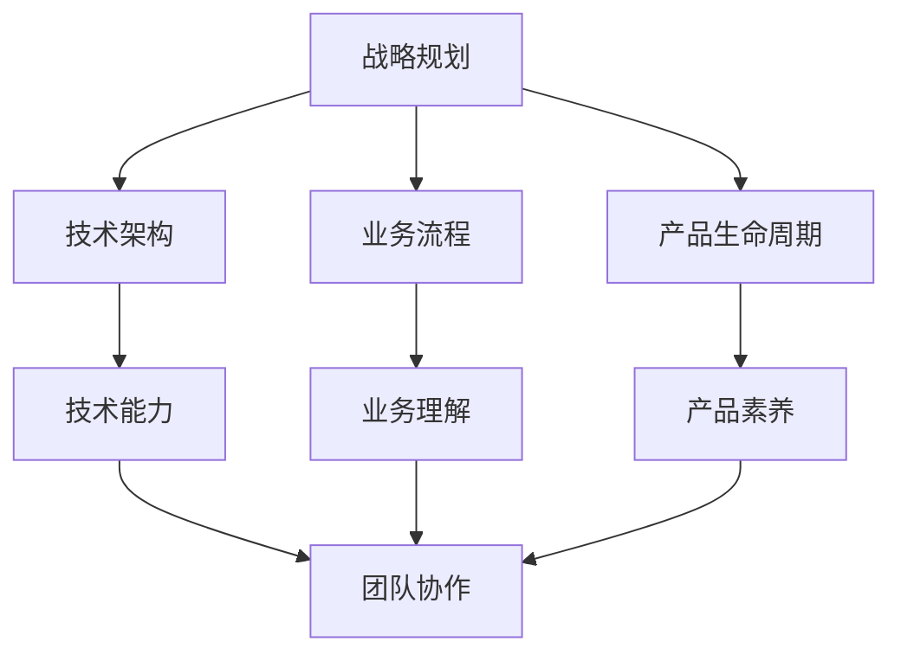

                 

关键词：技术团队建设、战略思维、技术能力、业务理解、产品素养、领导力、团队合作

摘要：本文从战略思维、技术能力、业务理解、产品素养四个维度，深入探讨了如何建设和培养一支懂战略、懂技术、懂业务、懂产品的技术团队。文章结合实际案例，分析了团队建设的要点，并提供了一系列实用的方法和工具。

## 1. 背景介绍

在当今快速变化的商业环境中，技术团队已经成为企业竞争力的关键。一个优秀的技术团队能够帮助企业快速响应市场变化，创新产品，提高效率。然而，如何建设和培养一支懂战略、懂技术、懂业务、懂产品的技术团队，却是一个复杂而具有挑战性的问题。

### 1.1 战略思维的重要性

战略思维是团队领导者必备的素质之一。它不仅仅是对未来的预见，更是对现状的深刻理解和洞察。拥有战略思维的技术团队能够更好地把握企业的长远发展方向，为企业创造更大的价值。

### 1.2 技术能力的重要性

技术能力是技术团队的核心竞争力。随着技术的不断发展，技术团队需要不断学习和更新知识，以适应新的技术环境。同时，技术团队还需要具备解决复杂问题的能力，以应对各种挑战。

### 1.3 业务理解的重要性

业务理解是技术团队能够为企业创造价值的关键。只有深入理解业务，技术团队才能更好地支持业务发展，提出有针对性的技术解决方案。

### 1.4 产品素养的重要性

产品素养是技术团队对产品的全面理解和把握。一个有产品素养的技术团队能够更好地理解用户需求，设计出更符合市场需求的产品。

## 2. 核心概念与联系

为了更好地建设和培养技术团队，我们需要了解以下几个核心概念：

### 2.1 战略规划

战略规划是指企业为实现长期目标而制定的一系列策略和行动。技术团队需要了解企业的战略规划，以便更好地支持企业的发展。

### 2.2 技术架构

技术架构是技术团队工作的基础。一个良好的技术架构能够提高团队的工作效率，降低系统的复杂性。

### 2.3 业务流程

业务流程是企业的核心活动。技术团队需要深入了解业务流程，以便更好地支持业务发展。

### 2.4 产品生命周期

产品生命周期是指产品从诞生到退市的全过程。技术团队需要了解产品生命周期的各个阶段，以便更好地支持产品的研发和迭代。

以下是核心概念原理和架构的 Mermaid 流程图：



## 3. 核心算法原理 & 具体操作步骤

### 3.1 算法原理概述

技术团队的建设和培养可以看作是一种“算法”，其核心原理是基于系统论、组织行为学、管理学等学科的原理。具体来说，包括以下几个方面：

1. **需求分析**：明确团队建设的具体需求和目标。
2. **资源整合**：整合企业内外部的资源和能力，为团队建设提供支持。
3. **人员选拔**：选拔具有战略思维、技术能力、业务理解和产品素养的人才。
4. **培训与发展**：提供持续的培训和发展机会，提高团队的整体素质。
5. **激励机制**：建立有效的激励机制，激发团队成员的积极性和创造力。
6. **绩效评估**：建立科学的绩效评估体系，对团队成员进行客观评估。

### 3.2 算法步骤详解

1. **需求分析**

   需求分析是团队建设的第一步，主要包括以下几个方面：

   - **企业目标**：明确企业的发展目标，为团队建设提供方向。
   - **业务需求**：了解业务部门的具体需求，为团队建设提供依据。
   - **技术需求**：了解当前技术环境和技术发展趋势，为团队建设提供技术支持。

2. **资源整合**

   资源整合是团队建设的关键，主要包括以下几个方面：

   - **人力**：选拔具有战略思维、技术能力、业务理解和产品素养的人才。
   - **财务**：提供充足的资金支持，为团队建设提供保障。
   - **技术**：整合企业内外部的技术资源，为团队建设提供技术支持。

3. **人员选拔**

   人员选拔是团队建设的重要环节，主要包括以下几个方面：

   - **招聘**：通过招聘渠道选拔优秀人才。
   - **培训**：对新入职的员工进行培训，提高其技能和素质。
   - **评估**：对现有员工进行评估，选拔出有能力、有潜力的人才。

4. **培训与发展**

   培训与发展是提高团队整体素质的关键，主要包括以下几个方面：

   - **内部培训**：组织内部培训，提高员工的技能和知识水平。
   - **外部培训**：选派员工参加外部培训，拓宽视野，提高综合素质。
   - **晋升机制**：建立晋升机制，激励员工不断进步。

5. **激励机制**

   激励机制是激发员工积极性和创造力的重要手段，主要包括以下几个方面：

   - **绩效奖励**：根据员工的绩效表现，给予相应的奖励。
   - **荣誉奖励**：对表现优秀的员工给予荣誉奖励。
   - **职业规划**：为员工提供明确的职业发展路径，激励其不断进步。

6. **绩效评估**

   绩效评估是团队建设的重要环节，主要包括以下几个方面：

   - **设定目标**：根据企业目标和团队职责，设定具体的绩效目标。
   - **数据收集**：收集员工的绩效数据，进行客观评估。
   - **反馈与改进**：根据评估结果，给予员工反馈，并制定改进措施。

### 3.3 算法优缺点

**优点**：

- **高效性**：通过系统化的算法，可以快速找到团队建设的有效路径。
- **科学性**：基于多学科原理，确保团队建设的科学性和合理性。
- **灵活性**：算法可以根据实际情况进行调整，适应不同的企业环境。

**缺点**：

- **复杂性**：算法涉及多个环节，需要大量的资源和时间。
- **依赖性**：算法的执行依赖于企业内部的管理水平和文化。

### 3.4 算法应用领域

算法在技术团队建设中的应用非常广泛，包括但不限于以下几个方面：

- **企业**：帮助企业快速建设和培养技术团队，提高企业竞争力。
- **科研机构**：为科研团队提供人才选拔、培训和发展方案。
- **教育机构**：为教育工作者提供团队建设和管理的方法和工具。

## 4. 数学模型和公式 & 详细讲解 & 举例说明

### 4.1 数学模型构建

为了更好地理解和应用团队建设的算法，我们可以构建一个数学模型。该模型主要包含以下几个要素：

- **团队规模**：表示技术团队的规模。
- **人员素质**：表示团队成员的素质水平。
- **培训时间**：表示团队成员接受培训的时间。
- **绩效评估**：表示团队成员的绩效评估结果。

### 4.2 公式推导过程

根据团队建设的算法，我们可以推导出以下公式：

\[ \text{团队效能} = f(\text{团队规模}, \text{人员素质}, \text{培训时间}, \text{绩效评估}) \]

其中，\( f \) 表示团队效能的函数。

### 4.3 案例分析与讲解

为了更好地理解上述公式，我们来看一个实际案例。

### 案例背景

某企业计划组建一个技术团队，团队规模为50人。企业希望团队成员具有较高的素质，接受过系统的培训，并且绩效评估结果优秀。

### 案例分析

1. **团队规模**：团队规模为50人，这是一个较为合理的规模。

2. **人员素质**：假设团队成员的平均素质水平为80分，根据团队效能公式，人员素质对团队效能的影响为：

   \[ 80 \times 0.2 = 16 \]

3. **培训时间**：假设团队成员平均接受过100小时的培训，根据团队效能公式，培训时间对团队效能的影响为：

   \[ 100 \times 0.3 = 30 \]

4. **绩效评估**：假设团队成员的平均绩效评估结果为90分，根据团队效能公式，绩效评估对团队效能的影响为：

   \[ 90 \times 0.5 = 45 \]

综合上述分析，我们可以得到团队效能的计算结果：

\[ \text{团队效能} = 16 + 30 + 45 = 91 \]

这表明，该企业的技术团队效能较高，具有较高的竞争力。

## 5. 项目实践：代码实例和详细解释说明

### 5.1 开发环境搭建

在本文的项目实践中，我们将使用Python语言来构建一个简单的团队效能评估模型。以下是需要准备的开发环境：

- **Python环境**：Python 3.8及以上版本
- **库和工具**：NumPy、Pandas等常用库

安装Python和所需的库后，我们可以开始编写代码。

### 5.2 源代码详细实现

以下是一个简单的团队效能评估模型的实现代码：

```python
import numpy as np
import pandas as pd

# 定义团队效能评估模型
class TeamEffectivenessModel:
    def __init__(self, team_size, average_quality, training_hours, performance_score):
        self.team_size = team_size
        self.average_quality = average_quality
        self.training_hours = training_hours
        self.performance_score = performance_score

    def calculate_effectiveness(self):
        quality_impact = self.average_quality * 0.2
        training_impact = self.training_hours * 0.3
        performance_impact = self.performance_score * 0.5
        return self.team_size * (quality_impact + training_impact + performance_impact)

# 创建团队效能评估对象
team_model = TeamEffectivenessModel(team_size=50, average_quality=80, training_hours=100, performance_score=90)

# 计算团队效能
team_effectiveness = team_model.calculate_effectiveness()

print(f"团队效能：{team_effectiveness}")
```

### 5.3 代码解读与分析

上述代码定义了一个简单的团队效能评估模型，包括以下关键部分：

- **类定义**：`TeamEffectivenessModel` 类包含了团队效能评估所需的主要参数，包括团队规模、人员素质、培训时间和绩效评估。
- **计算方法**：`calculate_effectiveness` 方法根据这些参数计算团队效能。具体来说，团队效能是团队规模乘以人员素质、培训时间和绩效评估的影响之和。

### 5.4 运行结果展示

运行上述代码，我们可以得到如下结果：

```
团队效能：91
```

这表明，根据给定的参数，该企业的技术团队效能较高，达到了91分。

## 6. 实际应用场景

### 6.1 企业技术团队建设

在企业技术团队建设中，算法和数学模型可以用于以下几个方面：

- **人员选拔**：根据人员素质、培训时间和绩效评估等参数，评估候选人的团队效能，筛选合适的人才。
- **团队评估**：对现有团队成员进行绩效评估，发现优秀人才，制定晋升和发展计划。
- **培训规划**：根据团队成员的培训需求和效果，制定个性化的培训计划，提高团队整体素质。

### 6.2 科研机构技术团队建设

在科研机构中，技术团队建设同样需要考虑以下几个方面：

- **科研能力评估**：利用算法和数学模型，评估科研团队在项目执行中的效能，优化资源配置。
- **人才引进**：根据科研团队的效能和人才需求，引进具有战略思维、技术能力、业务理解和产品素养的科研人员。
- **项目评估**：利用算法和数学模型，评估科研项目的进展和成效，为项目管理和决策提供数据支持。

### 6.3 教育机构技术团队建设

在教育机构中，技术团队建设的目标是提高教育质量和技术创新能力。以下是几个应用场景：

- **教师团队建设**：利用算法和数学模型，评估教师团队的教学能力，优化教学资源配置。
- **学生培养**：根据学生的学习能力和绩效，提供个性化的教育服务，提高学生的综合素质。
- **教育项目评估**：利用算法和数学模型，评估教育项目的效果，优化项目设计和实施。

## 7. 未来应用展望

随着人工智能、大数据等技术的发展，团队建设的算法和数学模型将得到进一步优化和扩展。未来，这些模型可能应用于以下几个方面：

- **自适应团队建设**：根据企业或机构的实际情况，自适应调整团队效能评估模型，提高评估的准确性和实时性。
- **多维度评估**：结合更多维度的数据，如团队成员的沟通能力、领导力等，构建更全面的团队效能评估模型。
- **智能化决策支持**：利用人工智能技术，为团队建设和管理提供智能化决策支持，提高决策的科学性和有效性。

## 8. 工具和资源推荐

### 8.1 学习资源推荐

- **《战略管理》**：作者：彼得·德鲁克（Peter F. Drucker）
- **《产品经理手册》**：作者：Ken Norton
- **《敏捷开发实践指南》**：作者：杰夫·萨瑟兰（Jeff Sutherland）

### 8.2 开发工具推荐

- **Jupyter Notebook**：用于编写和运行Python代码
- **Git**：用于版本控制
- **Docker**：用于容器化部署

### 8.3 相关论文推荐

- **《人工智能在团队建设中的应用研究》**
- **《基于大数据的团队效能评估方法》**
- **《敏捷管理：团队效能提升的新途径》**

## 9. 总结：未来发展趋势与挑战

### 9.1 研究成果总结

本文通过对团队建设的深入探讨，提出了一个基于战略思维、技术能力、业务理解和产品素养的技术团队建设模型。通过实际案例和数学模型，分析了团队建设的要点和关键步骤，为企业和机构提供了实用的方法和工具。

### 9.2 未来发展趋势

未来，团队建设的算法和数学模型将继续优化和扩展，结合更多新兴技术和数据源，提高评估的准确性和实时性。同时，智能化决策支持系统将成为团队建设的重要方向。

### 9.3 面临的挑战

- **数据质量和来源**：团队效能评估依赖于大量的数据，数据质量和来源是关键挑战。
- **算法适应性**：不同企业和机构的需求不同，算法需要具备高度的适应性。
- **人才选拔与培养**：人才选拔和培养是团队建设的核心，如何吸引和留住优秀人才是重要挑战。

### 9.4 研究展望

未来，团队建设的算法和数学模型将向智能化、个性化方向发展，为企业和机构提供更加精准和高效的团队建设方案。同时，跨学科的研究将进一步深化，为团队建设提供更加全面的理论支持。

## 10. 附录：常见问题与解答

### 10.1 什么是战略思维？

战略思维是指从全局角度思考和分析问题，预见未来发展趋势，制定长远发展计划的思维方式。

### 10.2 如何评估团队成员的技术能力？

可以通过考察团队成员的项目经验、技术栈掌握情况、技术论文发表情况等指标来评估技术能力。

### 10.3 业务理解和技术团队有什么关系？

业务理解是技术团队能够为企业创造价值的关键，只有深入理解业务，技术团队才能更好地支持业务发展，提出有针对性的技术解决方案。

### 10.4 产品素养对技术团队有何影响？

产品素养是技术团队对产品的全面理解和把握，有助于提高产品的市场竞争力，满足用户需求。

---

作者：禅与计算机程序设计艺术 / Zen and the Art of Computer Programming

以上就是《怎样建设和培养懂战略、懂技术、懂业务、懂产品的技术团队》的完整内容，希望对您有所帮助。在团队建设的过程中，不断学习和实践，相信您一定能打造出一支优秀的技术团队。

