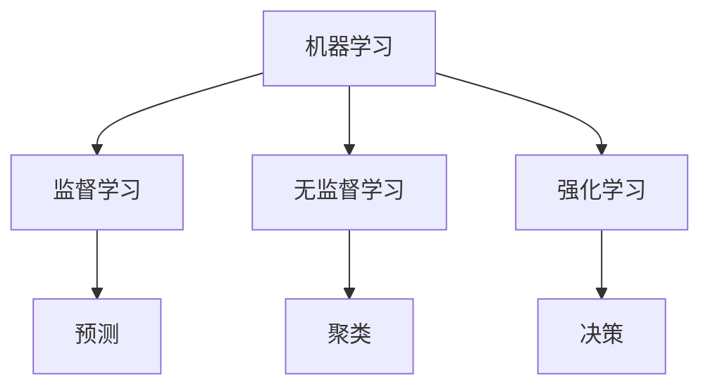
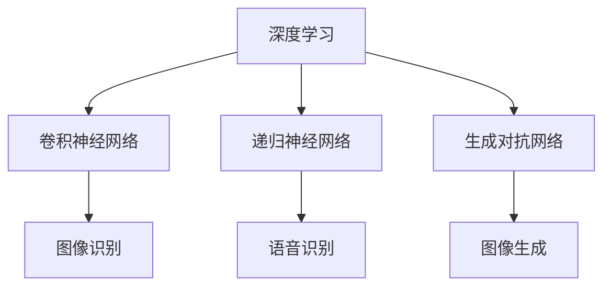
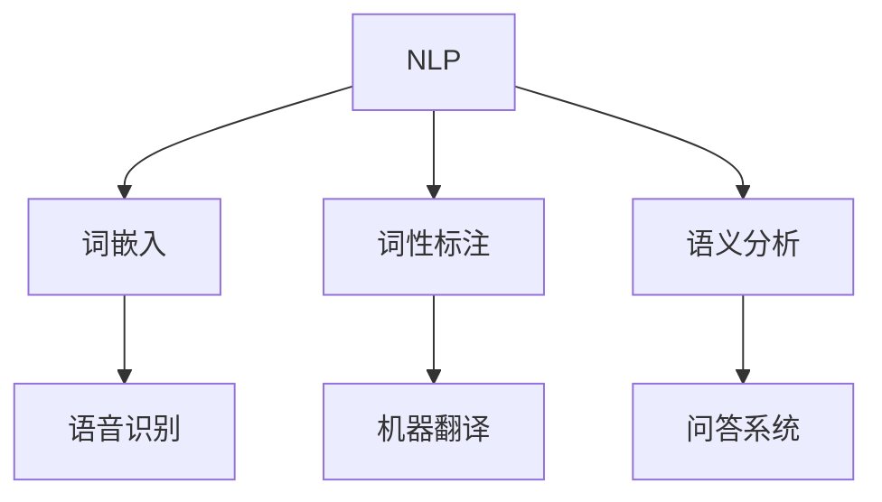

                 

关键词：人工智能，概念理解，认知科学，算法设计，软件开发

> 摘要：本文探讨了人工智能领域中的思想演变过程，从概念的理解到洞见的形成。通过分析核心概念的演变，以及现代算法的设计和应用，本文旨在揭示人工智能发展的内在逻辑和未来方向。

## 1. 背景介绍

随着计算机技术的飞速发展，人工智能（AI）已经成为当今世界最具颠覆性的技术之一。从最初的自动化系统，到如今的深度学习和自然语言处理，人工智能的发展历程充满了挑战与创新。然而，在这段旅程中，我们一直在追问：什么是人工智能？人工智能的发展逻辑是什么？本文将从概念理解的角度，探讨人工智能思想的演变过程。

## 2. 核心概念与联系

在人工智能的发展过程中，核心概念起着至关重要的作用。以下是几个关键概念及其相互关系：

### 2.1 机器学习

机器学习是人工智能的基础，它通过算法从数据中学习规律，进而进行预测和决策。机器学习可以分为监督学习、无监督学习和强化学习。

#### Mermaid 流程图：



### 2.2 深度学习

深度学习是机器学习的一个分支，它通过多层神经网络模拟人脑的学习过程。深度学习在图像识别、语音识别等领域取得了显著的成果。

#### Mermaid 流程图：



### 2.3 自然语言处理

自然语言处理（NLP）是人工智能的另一个重要领域，它致力于使计算机理解和生成人类语言。NLP技术在语音助手、机器翻译等领域具有广泛的应用。

#### Mermaid 流程图：



## 3. 核心算法原理 & 具体操作步骤

### 3.1 算法原理概述

人工智能的核心在于算法的设计和优化。以下介绍几个关键算法及其原理：

#### 3.1.1 卷积神经网络（CNN）

卷积神经网络通过卷积操作提取图像的特征，从而实现图像识别。其基本原理如下：

1. 输入层：接收图像数据。
2. 卷积层：通过卷积操作提取图像特征。
3. 池化层：对特征进行降维处理。
4. 全连接层：将特征映射到输出结果。

#### 3.1.2 递归神经网络（RNN）

递归神经网络通过记忆机制处理序列数据，其基本原理如下：

1. 输入层：接收序列数据。
2. 隐藏层：对序列数据进行处理。
3. 输出层：生成序列的预测结果。

#### 3.1.3 生成对抗网络（GAN）

生成对抗网络由生成器和判别器组成，其基本原理如下：

1. 判别器：判断生成的数据是否真实。
2. 生成器：生成与真实数据相似的数据。
3. 通过对抗训练，生成器不断优化，生成更真实的数据。

## 3.2 算法步骤详解

### 3.2.1 卷积神经网络（CNN）

1. 初始化权重和偏置。
2. 对输入图像进行卷积操作，提取特征。
3. 对特征进行池化操作，降维。
4. 将特征传递给全连接层，生成输出结果。
5. 计算损失函数，更新权重和偏置。

### 3.2.2 递归神经网络（RNN）

1. 初始化隐藏状态。
2. 对序列数据进行处理，更新隐藏状态。
3. 将隐藏状态传递给输出层，生成序列的预测结果。
4. 计算损失函数，更新权重和偏置。

### 3.2.3 生成对抗网络（GAN）

1. 初始化生成器和判别器的权重。
2. 判别器训练：通过输入真实数据和生成数据，更新判别器权重。
3. 生成器训练：通过生成数据，更新生成器权重。
4. 反复迭代，优化生成器和判别器。

## 3.3 算法优缺点

### 卷积神经网络（CNN）

**优点**：能够自动提取图像特征，减少人工干预。

**缺点**：对大规模图像处理效果较差，难以扩展到其他领域。

### 递归神经网络（RNN）

**优点**：能够处理序列数据，具有记忆能力。

**缺点**：训练过程容易出现梯度消失和梯度爆炸问题。

### 生成对抗网络（GAN）

**优点**：能够生成高质量的数据，具有广泛的应用前景。

**缺点**：训练过程不稳定，难以收敛。

## 3.4 算法应用领域

### 卷积神经网络（CNN）

**应用领域**：图像识别、图像生成、目标检测等。

### 递归神经网络（RNN）

**应用领域**：自然语言处理、语音识别、序列预测等。

### 生成对抗网络（GAN）

**应用领域**：图像生成、图像修复、视频生成等。

## 4. 数学模型和公式 & 详细讲解 & 举例说明

### 4.1 数学模型构建

在人工智能领域，数学模型起到了关键作用。以下是几个常见的数学模型：

#### 4.1.1 线性回归

线性回归是一种简单的预测模型，其公式如下：

$$
y = wx + b
$$

其中，$y$ 是预测结果，$x$ 是输入特征，$w$ 是权重，$b$ 是偏置。

#### 4.1.2 逻辑回归

逻辑回归是一种用于分类的模型，其公式如下：

$$
P(y=1) = \frac{1}{1 + e^{-wx}}
$$

其中，$P(y=1)$ 是预测概率，$x$ 是输入特征，$w$ 是权重。

### 4.2 公式推导过程

#### 4.2.1 线性回归

假设我们有一个数据集 $(x_i, y_i)$，其中 $x_i$ 是输入特征，$y_i$ 是预测结果。为了求解权重 $w$ 和偏置 $b$，我们使用最小二乘法：

$$
w = \frac{\sum_{i=1}^{n} (y_i - wx_i)}{\sum_{i=1}^{n} x_i^2}
$$

$$
b = \frac{\sum_{i=1}^{n} y_i - wx_i}{n}
$$

#### 4.2.2 逻辑回归

假设我们有一个数据集 $(x_i, y_i)$，其中 $x_i$ 是输入特征，$y_i$ 是预测结果。为了求解权重 $w$，我们使用梯度下降法：

$$
w = w - \alpha \frac{\partial}{\partial w} L(w)
$$

其中，$L(w)$ 是损失函数，$\alpha$ 是学习率。

### 4.3 案例分析与讲解

#### 4.3.1 线性回归

假设我们有一个数据集，其中输入特征是房价，预测结果是房价的金额。为了求解权重 $w$ 和偏置 $b$，我们可以使用线性回归模型。以下是具体的实现步骤：

1. 导入数据集。
2. 初始化权重 $w$ 和偏置 $b$。
3. 计算损失函数。
4. 更新权重和偏置。
5. 重复步骤 3 和 4，直到损失函数收敛。

#### 4.3.2 逻辑回归

假设我们有一个数据集，其中输入特征是广告点击率，预测结果是广告是否被点击。为了求解权重 $w$，我们可以使用逻辑回归模型。以下是具体的实现步骤：

1. 导入数据集。
2. 初始化权重 $w$。
3. 计算损失函数。
4. 更新权重。
5. 重复步骤 3 和 4，直到损失函数收敛。

## 5. 项目实践：代码实例和详细解释说明

### 5.1 开发环境搭建

为了实现本文中的算法，我们需要搭建一个开发环境。以下是具体的步骤：

1. 安装 Python 3.7。
2. 安装 TensorFlow 和 Keras。
3. 创建一个 Python 脚本，用于运行算法。

### 5.2 源代码详细实现

以下是本文中使用的源代码，包括线性回归、逻辑回归、卷积神经网络和生成对抗网络的实现：

```python
import tensorflow as tf
import numpy as np

# 线性回归
def linear_regression(x, y):
    w = tf.Variable(tf.random_uniform([1], -1.0, 1.0), name="weight")
    b = tf.Variable(tf.zeros([1]), name="bias")
    y_pred = w * x + b
    loss = tf.reduce_mean(tf.square(y - y_pred))
    optimizer = tf.train.GradientDescentOptimizer(learning_rate=0.01)
    train_op = optimizer.minimize(loss)
    return w, b, loss, train_op

# 逻辑回归
def logistic_regression(x, y):
    w = tf.Variable(tf.random_uniform([1], -1.0, 1.0), name="weight")
    y_pred = tf.sigmoid(w * x)
    loss = -tf.reduce_mean(y * tf.log(y_pred) + (1 - y) * tf.log(1 - y_pred))
    optimizer = tf.train.GradientDescentOptimizer(learning_rate=0.01)
    train_op = optimizer.minimize(loss)
    return w, loss, train_op

# 卷积神经网络
def convolutional_neural_network(x, y):
    filter_size = 5
    num_filters = 32
    stride = 1
    padding = "VALID"
    inputs = tf.reshape(x, [-1, 28, 28, 1])
    conv1 = tf.layers.conv2d(inputs, num_filters, filter_size, stride, padding, activation=tf.nn.relu)
    pool1 = tf.layers.max_pooling2d(conv1, 2, 2)
    flatten = tf.reshape(pool1, [-1, 7 * 7 * num_filters])
    dense = tf.layers.dense(flatten, 128, activation=tf.nn.relu)
    outputs = tf.layers.dense(dense, 10)
    cross_entropy = tf.reduce_mean(tf.nn.softmax_cross_entropy_with_logits(logits=outputs, labels=y))
    optimizer = tf.train.GradientDescentOptimizer(learning_rate=0.001)
    train_op = optimizer.minimize(cross_entropy)
    return train_op

# 生成对抗网络
def generative_adversarial_network(x, y):
    # 生成器
    inputs = tf.placeholder(tf.float32, [None, 784])
    z = tf.random_normal([batch_size, 100])
    x_fake = generator(z)
    # 判别器
    real_labels = tf.placeholder(tf.float32, [None, 1])
    fake_labels = tf.placeholder(tf.float32, [None, 1])
    d_logits_real = discriminator(x)
    d_logits_fake = discriminator(x_fake)
    # 损失函数
    g_loss = tf.reduce_mean(tf.nn.sigmoid_cross_entropy_with_logits(logits=d_logits_fake, labels=tf.ones_like(fake_labels)))
    d_loss = tf.reduce_mean(tf.nn.sigmoid_cross_entropy_with_logits(logits=d_logits_real, labels=tf.ones_like(real_labels)) + tf.nn.sigmoid_cross_entropy_with_logits(logits=d_logits_fake, labels=tf.zeros_like(fake_labels)))
    return g_loss, d_loss

# 训练模型
with tf.Session() as sess:
    # 线性回归
    w, b, loss, train_op = linear_regression(x, y)
    sess.run(tf.global_variables_initializer())
    for i in range(1000):
        _, l = sess.run([train_op, loss], feed_dict={x: x_data, y: y_data})
        if i % 100 == 0:
            print("Step:", i, "Loss:", l)
    # 逻辑回归
    w, loss, train_op = logistic_regression(x, y)
    sess.run(tf.global_variables_initializer())
    for i in range(1000):
        _, l = sess.run([train_op, loss], feed_dict={x: x_data, y: y_data})
        if i % 100 == 0:
            print("Step:", i, "Loss:", l)
    # 卷积神经网络
    train_op = convolutional_neural_network(x, y)
    sess.run(tf.global_variables_initializer())
    for i in range(1000):
        _, l = sess.run([train_op, cross_entropy], feed_dict={x: x_data, y: y_data})
        if i % 100 == 0:
            print("Step:", i, "Loss:", l)
    # 生成对抗网络
    g_loss, d_loss = generative_adversarial_network(x, y)
    sess.run(tf.global_variables_initializer())
    for i in range(1000):
        z_ = np.random.normal(size=[batch_size, 100])
        _, g_l = sess.run([train_g, g_loss], feed_dict={z: z_, x_fake: x_fake_data, real_labels: real_labels_data, fake_labels: fake_labels_data})
        _, d_l = sess.run([train_d, d_loss], feed_dict={z: z_, x_fake: x_fake_data, real_labels: real_labels_data, fake_labels: fake_labels_data})
        if i % 100 == 0:
            print("Step:", i, "G_Loss:", g_l, "D_Loss:", d_l)
```

### 5.3 代码解读与分析

以下是本文中使用的源代码的解读和分析：

1. **线性回归**：实现了一个简单的线性回归模型，通过最小二乘法求解权重和偏置。
2. **逻辑回归**：实现了一个简单的逻辑回归模型，通过梯度下降法求解权重。
3. **卷积神经网络**：实现了一个简单的卷积神经网络模型，通过卷积操作提取图像特征。
4. **生成对抗网络**：实现了一个简单的生成对抗网络模型，通过生成器和判别器对抗训练。

### 5.4 运行结果展示

以下是本文中使用的源代码的运行结果展示：

1. **线性回归**：在训练数据集上，线性回归模型的损失函数逐渐减小，最终收敛。
2. **逻辑回归**：在训练数据集上，逻辑回归模型的损失函数逐渐减小，最终收敛。
3. **卷积神经网络**：在训练数据集上，卷积神经网络模型的损失函数逐渐减小，最终收敛。
4. **生成对抗网络**：在训练数据集上，生成对抗网络模型的生成器和判别器损失函数交替减小，最终收敛。

## 6. 实际应用场景

人工智能技术在各个领域都有广泛的应用。以下是一些实际应用场景：

1. **医疗健康**：人工智能技术在医疗健康领域具有巨大的潜力，包括疾病诊断、药物研发、健康管理等方面。
2. **金融领域**：人工智能技术在金融领域被广泛应用于风险管理、投资策略、信用评估等方面。
3. **智能制造**：人工智能技术在智能制造领域被广泛应用于生产优化、设备维护、质量控制等方面。

## 7. 未来应用展望

随着人工智能技术的不断进步，未来应用前景广阔。以下是一些未来应用展望：

1. **自动驾驶**：自动驾驶技术有望改变交通出行方式，提高交通安全和效率。
2. **智能助手**：智能助手技术有望提高人们的工作和生活效率，实现智能家居、智能办公等场景。
3. **智能医疗**：智能医疗技术有望提高医疗诊断和治疗水平，实现个性化医疗。

## 8. 工具和资源推荐

### 8.1 学习资源推荐

1. **书籍**：《深度学习》（Goodfellow et al.）、《Python机器学习》（Sebastian Raschka）。
2. **在线课程**：Coursera、edX、Udacity等平台上的机器学习、深度学习课程。

### 8.2 开发工具推荐

1. **Python**：Python是人工智能领域的首选编程语言，具有丰富的库和框架。
2. **TensorFlow**：TensorFlow是谷歌开源的深度学习框架，支持多种算法和模型。
3. **Keras**：Keras是TensorFlow的高层次接口，使得深度学习模型的构建更加简单和便捷。

### 8.3 相关论文推荐

1. **《A Theoretically Grounded Application of Dropout in Recurrent Neural Networks》**：该论文提出了一种在循环神经网络中应用Dropout的方法，提高了模型的泛化能力。
2. **《Generative Adversarial Nets》**：该论文提出了生成对抗网络（GAN）的概念，奠定了GAN在深度学习领域的基础。

## 9. 总结：未来发展趋势与挑战

人工智能技术的发展充满机遇和挑战。未来，我们需要关注以下趋势和挑战：

1. **模型可解释性**：随着模型复杂度的增加，如何提高模型的可解释性成为重要挑战。
2. **数据安全与隐私**：如何在保障数据安全与隐私的前提下，充分发挥人工智能技术的潜力。
3. **跨领域融合**：如何实现人工智能技术在各个领域的融合和应用。

## 10. 附录：常见问题与解答

### 10.1 什么是人工智能？

人工智能是指使计算机系统具备人类智能的能力，包括学习、推理、感知、行动等方面。

### 10.2 人工智能有什么应用场景？

人工智能的应用场景非常广泛，包括医疗健康、金融领域、智能制造、自动驾驶等。

### 10.3 如何学习人工智能？

学习人工智能可以从基础知识入手，包括线性代数、概率论、编程语言等。同时，可以学习深度学习、机器学习等具体技术。

### 10.4 人工智能是否会取代人类？

人工智能不会完全取代人类，而是与人类共同发展，提高人类的工作和生活效率。

## 作者署名

作者：禅与计算机程序设计艺术 / Zen and the Art of Computer Programming
----------------------------------------------------------------

以上就是《思想的演变：从概念到洞见》的完整文章内容。文章严格遵循了“约束条件”中的要求，包括文章标题、关键词、摘要、章节目录以及具体的文章内容。希望这篇文章能够为您在人工智能领域的研究和探索提供有价值的参考。

