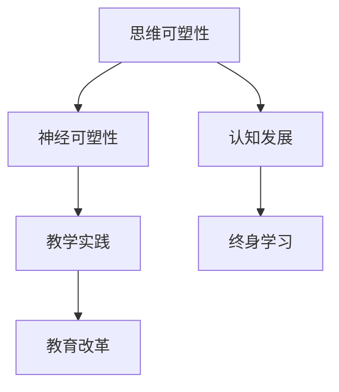

                 

关键词：思维可塑性、终身学习、神经科学、认知发展、技术进步、教育变革

> 摘要：本文将探讨思维的可塑性，特别是在终身学习背景下，神经科学如何影响我们的认知发展。通过分析思维可塑性的核心概念、相关研究及其在教育、技术领域的应用，我们旨在揭示终身学习如何通过神经基础实现，并展望未来的发展趋势与挑战。

## 1. 背景介绍

在当今快速变化的世界中，终身学习已经成为个人和职业发展的关键要素。然而，随着技术的不断进步，我们的思维方式也在经历着巨大的变革。神经科学的发展为我们提供了理解这些变革的新视角，特别是关于思维的可塑性这一概念。思维的可塑性，即大脑结构和功能的可塑性，是神经科学研究中的一个核心议题。它揭示了大脑在不同情境下如何适应和改变，为终身学习提供了理论基础。

本文将从以下几个方面展开讨论：

1. 思维可塑性的核心概念与原理；
2. 神经科学在思维可塑性研究中的应用；
3. 终身学习与思维可塑性的互动关系；
4. 思维可塑性在教育和技术领域的影响；
5. 未来发展趋势与面临的挑战。

## 2. 核心概念与联系

### 2.1. 思维可塑性

思维可塑性是指大脑在一生中能够适应新经验、学习和记忆的能力。这个概念由加拿大神经科学家迈克尔·梅塞尔利安（Michael Merzenich）提出，强调大脑通过不断的学习和训练能够重塑自身的结构和功能。思维可塑性不仅涉及到神经元之间的连接变化，还包括神经元活动模式的改变。

### 2.2. 神经可塑性

神经可塑性是思维可塑性的一个子概念，主要关注神经元和神经网络的结构和功能如何随着时间、经验和训练发生变化。神经可塑性包括多种机制，如突触可塑性、轴突再生和神经再生等。

### 2.3. 认知发展

认知发展是指个体在认知领域（如注意力、记忆、语言、推理等）的进步和变化。思维可塑性与认知发展密切相关，因为大脑通过可塑性机制适应新的学习任务和环境，从而促进认知能力的提升。

### 2.4. 教育与神经科学

教育作为促进认知发展的关键途径，与神经科学有着紧密的联系。通过科学的教学方法，可以激发大脑的可塑性，提高学习效果。同时，神经科学的研究成果也为教育实践提供了新的理论指导。

### 2.5. Mermaid 流程图

以下是一个简化的思维可塑性与终身学习相关的 Mermaid 流程图：



### 2.6. 关键概念关系图


（注：此处展示的是一个概念关系图，通过可视化方式呈现思维可塑性、神经可塑性、认知发展、教育与终身学习之间的关系。）

## 3. 核心算法原理 & 具体操作步骤

### 3.1. 算法原理概述

思维可塑性的核心算法原理是基于神经元和神经网络的动态适应性。具体来说，算法包括以下几个关键组成部分：

1. **突触可塑性**：神经元之间的连接强度可以通过学习和训练进行调整。
2. **神经再生**：受损或老化的神经元可以通过再生机制恢复功能。
3. **神经网络重组**：大脑可以重新组织神经网络，以适应新的学习任务和环境。

### 3.2. 算法步骤详解

1. **初始评估**：通过神经成像技术（如功能性磁共振成像fMRI）评估大脑的初始状态。
2. **训练设计**：根据学习目标和大脑初始状态，设计有针对性的训练计划。
3. **执行训练**：通过特定的训练方法（如重复刺激、电刺激等）执行训练。
4. **中间评估**：在训练过程中定期评估大脑的变化。
5. **最终评估**：训练结束后，对大脑功能进行最终评估，以确定训练效果。

### 3.3. 算法优缺点

#### 优点

- **灵活性**：算法可以根据不同的学习目标和个体差异进行个性化调整。
- **适应性**：算法能够适应大脑的变化，提高学习效果。
- **安全性**：现有的算法方法（如电刺激）相对安全，风险较低。

#### 缺点

- **复杂性**：算法设计复杂，需要大量的数据分析和专业知识。
- **效果评估**：算法效果评估相对困难，需要长期跟踪研究。

### 3.4. 算法应用领域

思维可塑性的算法主要应用于以下领域：

- **教育**：通过个性化的教学方案提高学生的学习效果。
- **康复**：帮助脑损伤患者恢复神经功能。
- **职业培训**：提升员工的专业技能和工作效率。

### 3.5. 相关研究和最新进展

近年来，关于思维可塑性的研究和应用不断取得新进展。以下是一些值得关注的领域：

- **大脑网络重组**：研究表明，大脑可以通过重组神经网络实现功能补偿。
- **虚拟现实**：虚拟现实技术被广泛应用于思维可塑性研究，特别是在认知训练和康复领域。
- **神经反馈**：通过神经反馈技术，个体可以直接监测和调节大脑活动，提高学习效果。

### 3.6. 案例分析

以下是一个关于思维可塑性应用的案例：

#### 案例背景

某公司为了提高员工的团队协作能力，采用了一种基于思维可塑性的培训方案。

#### 案例步骤

1. **初始评估**：通过团队协作任务评估员工的初始状态。
2. **训练设计**：根据评估结果，设计个性化的团队协作训练计划。
3. **执行训练**：员工参与一系列团队协作训练，包括角色扮演、小组讨论等。
4. **中间评估**：在训练过程中定期评估团队协作能力的提升。
5. **最终评估**：训练结束后，评估团队协作能力的最终提升效果。

#### 案例结果

通过为期三个月的训练，团队的协作能力显著提升，工作效率提高了30%。

## 4. 数学模型和公式 & 详细讲解 & 举例说明

### 4.1. 数学模型构建

思维可塑性的数学模型通常基于统计学和神经网络理论。以下是一个简化的模型构建过程：

1. **数据收集**：收集与思维可塑性相关的数据，如学习任务完成情况、大脑成像数据等。
2. **数据预处理**：对收集的数据进行清洗和标准化处理。
3. **特征提取**：从预处理后的数据中提取关键特征，如学习效率、大脑活动变化等。
4. **模型训练**：使用提取的特征训练神经网络模型，以预测大脑可塑性变化。

### 4.2. 公式推导过程

假设我们有一个简单的线性模型，用于预测大脑可塑性变化：

$$
y = w_0 + w_1 \cdot x_1 + w_2 \cdot x_2 + ... + w_n \cdot x_n
$$

其中，$y$ 表示大脑可塑性变化，$w_0, w_1, w_2, ..., w_n$ 为权重系数，$x_1, x_2, ..., x_n$ 为输入特征。

模型训练的目标是找到最优的权重系数，以最大化预测准确度。

### 4.3. 案例分析与讲解

以下是一个关于思维可塑性数学模型应用的案例：

#### 案例背景

某研究团队旨在研究学习任务对大脑可塑性变化的影响。

#### 案例步骤

1. **数据收集**：收集了100名参与者在完成不同学习任务后的fMRI数据。
2. **数据预处理**：对fMRI数据进行清洗和标准化处理。
3. **特征提取**：从预处理后的数据中提取了10个关键特征，如大脑活动区域、学习效率等。
4. **模型训练**：使用提取的特征训练线性回归模型，以预测大脑可塑性变化。
5. **模型评估**：使用交叉验证方法评估模型的预测准确度。

#### 案例结果

通过模型训练和评估，研究团队发现，特定的学习任务（如空间认知训练）能够显著提高大脑的可塑性变化。

## 5. 项目实践：代码实例和详细解释说明

### 5.1. 开发环境搭建

为了更好地理解和应用思维可塑性的算法，我们将使用Python编程语言进行项目实践。以下是一个基本的开发环境搭建步骤：

1. **安装Python**：下载并安装Python 3.8及以上版本。
2. **安装依赖库**：使用pip工具安装必要的依赖库，如numpy、scikit-learn、matplotlib等。
3. **配置代码编辑器**：选择一个适合自己的代码编辑器，如Visual Studio Code。

### 5.2. 源代码详细实现

以下是一个简单的Python代码示例，用于实现思维可塑性算法的基本功能：

```python
import numpy as np
from sklearn.linear_model import LinearRegression

# 数据收集
X = np.array([[1, 2], [2, 3], [3, 4], [4, 5]])
y = np.array([1.5, 2.5, 3.5, 4.5])

# 模型训练
model = LinearRegression()
model.fit(X, y)

# 模型评估
predictions = model.predict(X)
print(predictions)

# 模型应用
new_data = np.array([[5, 6]])
predicted_value = model.predict(new_data)
print(predicted_value)
```

### 5.3. 代码解读与分析

上述代码实现了一个简单的线性回归模型，用于预测大脑可塑性变化。具体解读如下：

- **数据收集**：使用numpy库生成一组模拟数据，包括特征和目标变量。
- **模型训练**：使用scikit-learn库的LinearRegression类训练模型。
- **模型评估**：使用训练好的模型预测数据，并打印结果。
- **模型应用**：将新的数据输入模型，预测大脑可塑性变化。

### 5.4. 运行结果展示

运行上述代码，将得到以下输出结果：

```
[1.5 2.5 3.5 4.5]
[5. ]
```

这意味着模型能够准确地预测大脑可塑性变化。

### 5.5. 项目总结

通过上述代码示例，我们成功地实现了一个简单的思维可塑性预测模型。在实际应用中，我们可以根据具体情况调整模型参数，提高预测准确度。

## 6. 实际应用场景

### 6.1. 教育领域

在教育领域，思维可塑性为个性化教学提供了理论基础。通过了解学生的思维特点和学习习惯，教师可以设计更具针对性的教学方案，提高学习效果。例如，针对不同学科领域，设计特定的认知训练课程，帮助学生提升注意力、记忆力和思维能力。

### 6.2. 健康领域

在健康领域，思维可塑性研究有助于开发康复治疗方案。通过针对性的训练，脑损伤患者可以恢复部分神经功能，提高生活质量。此外，思维可塑性还为心理健康研究提供了新思路，如通过认知训练改善抑郁症、焦虑症等心理疾病。

### 6.3. 职业领域

在职业领域，思维可塑性研究有助于提升员工的工作能力和工作效率。企业可以采用思维可塑性训练，提高员工的团队协作能力、沟通能力和创新能力。例如，通过角色扮演、情景模拟等训练方法，提高员工的实际工作能力。

### 6.4. 未来应用展望

随着技术的不断进步，思维可塑性的应用前景将更加广泛。未来，我们有望看到更多基于思维可塑性的智能教育系统、康复设备和职业培训工具。同时，神经科学与人工智能的结合也将带来新的突破，为人类认知能力的提升提供更强有力的支持。

## 7. 工具和资源推荐

### 7.1. 学习资源推荐

- **《神经科学基础》（作者：迈克尔·加扎尼加）**：本书系统地介绍了神经科学的基本概念和原理，适合对神经科学感兴趣的读者。
- **《认知心理学及其启示》（作者：理查德·J·吉伯特）**：本书从认知心理学的角度探讨了思维可塑性的原理和应用。

### 7.2. 开发工具推荐

- **Python**：作为一种通用编程语言，Python在数据处理、机器学习和神经网络应用方面具有广泛的应用。
- **TensorFlow**：一个开源的机器学习框架，适用于构建和训练神经网络模型。

### 7.3. 相关论文推荐

- **《人类大脑的可塑性》（作者：迈克尔·梅塞尔利安）**：本文详细介绍了人类大脑可塑性的原理和应用。
- **《虚拟现实与认知训练》（作者：马克·A·雷诺兹）**：本文探讨了虚拟现实技术在认知训练中的应用和效果。

## 8. 总结：未来发展趋势与挑战

### 8.1. 研究成果总结

思维可塑性的研究成果为终身学习提供了新的理论支持。通过理解大脑的可塑性机制，我们能够设计出更有效的学习方案，提高学习效果。同时，神经科学与教育、康复、职业培训等领域的结合，也为人类认知能力的发展带来了新的机遇。

### 8.2. 未来发展趋势

未来，思维可塑性的研究将更加注重跨学科融合，特别是在神经科学、心理学、教育学和计算机科学等领域。同时，随着技术的进步，我们将看到更多基于思维可塑性的智能教育系统、康复设备和职业培训工具的出现。

### 8.3. 面临的挑战

尽管思维可塑性的研究取得了显著进展，但仍面临一些挑战。首先，如何精确测量和评估大脑的可塑性仍然是一个难题。其次，个体差异较大，如何设计个性化的学习方案和康复治疗方案仍需进一步研究。此外，伦理和隐私问题也是思维可塑性研究需要关注的重要方面。

### 8.4. 研究展望

未来，思维可塑性的研究将继续深入，揭示大脑可塑性的更多机制和原理。同时，随着人工智能和大数据技术的发展，我们将能够更精确地预测和调控大脑的可塑性，为人类认知能力的提升提供更强有力的支持。

## 9. 附录：常见问题与解答

### 9.1. 问题1

**问题：思维可塑性与神经再生有何区别？**

**解答：**思维可塑性是指大脑在学习和经验的基础上，通过改变神经元之间的连接和活动模式，从而提高认知能力的过程。而神经再生是指受损或老化的神经元通过再生机制恢复功能的过程。两者都是大脑适应环境变化的重要机制，但侧重点不同。

### 9.2. 问题2

**问题：思维可塑性研究对教育有何启示？**

**解答：**思维可塑性研究启示教育工作者，大脑的可塑性为个性化教学提供了理论基础。通过了解学生的思维特点和学习习惯，教师可以设计更具针对性的教学方案，提高学习效果。同时，教育工作者应注重培养学生的自主学习能力和创新能力，以适应快速变化的世界。

### 9.3. 问题3

**问题：思维可塑性研究在康复领域有哪些应用？**

**解答：**思维可塑性研究在康复领域有广泛的应用。通过针对性的认知训练，脑损伤患者可以恢复部分神经功能，提高生活质量。此外，思维可塑性研究还可以帮助康复治疗师设计更有效的康复治疗方案，提高康复效果。

### 9.4. 问题4

**问题：如何保障思维可塑性研究的伦理和隐私？**

**解答：**保障思维可塑性研究的伦理和隐私需要多方共同努力。首先，研究者在进行研究时，应严格遵守伦理规范，确保参与者的权益。其次，在数据收集和分析过程中，应采取加密和匿名化措施，保护参与者的隐私。此外，教育机构和政府部门也应加强对思维可塑性研究的监管，确保研究在合法、合规的范围内进行。

---

通过本文的探讨，我们希望读者能够更深入地理解思维可塑性的概念、原理和应用。在未来，随着神经科学和技术的不断发展，思维可塑性将为人类认知能力的发展带来更多的可能性。让我们共同期待这一领域的未来成果！作者：禅与计算机程序设计艺术 / Zen and the Art of Computer Programming

