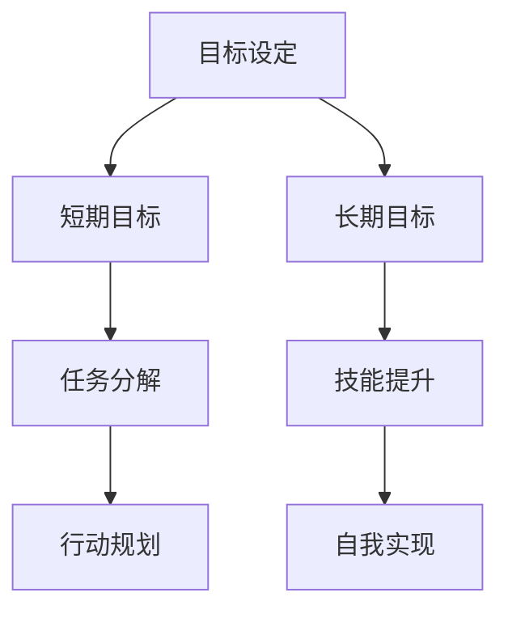

                 

 意识是人类智慧的体现，是人类在认知世界和自我发展中不可或缺的一部分。在意识中，短期目标和长期目标的概念尤为重要。短期目标通常是指我们在短期内希望达成的目标，比如完成一项任务、实现一个功能等。而长期目标则是我们希望在较长时间内达成的目标，比如成为一名专家、完成一个大型项目等。本文将探讨短期目标和长期目标在意识中的意义、相互关系以及实现策略。

## 1. 背景介绍

在计算机科学中，目标和目标的实现是一个核心问题。无论是软件开发、算法设计还是人工智能，目标导向的思维都是关键。在人的意识中，目标的设定和实现同样至关重要。短期目标和长期目标的区分有助于我们更清晰地规划自己的行动，从而更有效地实现目标。

短期目标和长期目标在意识中的作用不同。短期目标通常是为了解决眼前的问题，满足当前的需求，而长期目标则是为了实现个人的愿景，提升自己的能力。两者相辅相成，共同构成了我们的意识世界。

## 2. 核心概念与联系

在探讨短期目标和长期目标之前，我们需要了解一些核心概念，如图1所示。



### 2.1 目标设定

目标设定是意识活动的基础。无论是短期目标还是长期目标，都需要我们明确自己的期望和愿景。目标设定的过程包括目标的选择、明确目标的属性（如重要性、优先级等）以及制定实现目标的计划。

### 2.2 短期目标

短期目标通常是指我们在较短时间内希望达成的目标。它们通常是为了解决当前的问题或者满足当前的需求。例如，完成一个任务、实现一个功能等。短期目标的实现可以帮助我们积累经验、提升技能，同时也可以激励我们继续前进。

### 2.3 长期目标

长期目标则是指我们在较长时间内希望达成的目标。它们通常是为了实现个人的愿景或者提升自己的能力。例如，成为一名专家、完成一个大型项目等。长期目标的实现需要我们坚持不懈地努力，同时也需要我们不断地调整和优化自己的策略。

### 2.4 任务分解

任务分解是将一个复杂的任务分解为若干个子任务的过程。任务分解可以帮助我们更好地理解任务，明确每个子任务的目标，从而更有效地实现任务。在实现短期目标时，任务分解尤为重要。

### 2.5 技能提升

技能提升是实现长期目标的关键。通过不断地学习和实践，我们可以提升自己的技能水平，从而更好地实现长期目标。技能提升不仅可以帮助我们实现目标，还可以提升我们的竞争力。

### 2.6 行动规划

行动规划是实现目标的关键步骤。通过行动规划，我们可以明确每个阶段的目标和任务，制定具体的行动方案，确保目标的实现。行动规划需要我们综合考虑资源的可用性、任务的优先级等因素。

### 2.7 自我实现

自我实现是长期目标的最终目标。通过不断地实现目标，我们可以提升自己的能力，实现个人的价值。自我实现不仅可以帮助我们实现个人目标，还可以为社会做出更大的贡献。

## 3. 核心算法原理 & 具体操作步骤

在实现短期目标和长期目标的过程中，核心算法原理和具体操作步骤起着至关重要的作用。以下将详细阐述这两个方面的内容。

### 3.1 算法原理概述

在意识中，目标的实现可以看作是一个路径规划问题。我们首先需要确定起点（当前状态）和终点（目标状态），然后通过一系列的决策和行动，从起点到达终点。这个过程中，核心算法原理主要包括：

- **状态空间搜索**：通过搜索状态空间，找到从起点到终点的有效路径。
- **启发式搜索**：利用启发式信息，优化搜索过程，提高搜索效率。
- **动态规划**：将复杂问题分解为子问题，利用子问题的解，构建原问题的解。

### 3.2 算法步骤详解

在实现短期目标和长期目标的过程中，具体的操作步骤可以分为以下几个阶段：

- **阶段1：目标设定**：明确短期目标和长期目标，明确目标和当前状态之间的差距。
- **阶段2：任务分解**：将目标分解为若干个子任务，明确每个子任务的目标和任务。
- **阶段3：行动规划**：制定具体的行动方案，明确每个阶段的任务和时间安排。
- **阶段4：执行行动**：按照计划执行行动，实现子任务。
- **阶段5：反馈调整**：根据执行结果，调整目标和行动方案。

### 3.3 算法优缺点

- **优点**：
  - **高效性**：通过算法原理，可以高效地实现目标和任务。
  - **灵活性**：可以根据实际情况，灵活调整目标和行动方案。
  - **适应性**：可以适应不同类型的目标和任务。

- **缺点**：
  - **复杂度**：算法原理和操作步骤较为复杂，需要较高的技术水平。
  - **依赖性**：算法的实现依赖于具体的技术和工具。

### 3.4 算法应用领域

算法原理和操作步骤在各个领域都有广泛的应用。以下列举几个典型应用领域：

- **软件开发**：通过算法原理，可以高效地实现软件功能和优化软件性能。
- **项目管理**：通过任务分解和行动规划，可以高效地完成项目任务。
- **人工智能**：通过状态空间搜索和启发式搜索，可以解决复杂的问题和优化决策。

## 4. 数学模型和公式 & 详细讲解 & 举例说明

在实现短期目标和长期目标的过程中，数学模型和公式起着重要的指导作用。以下将详细讲解数学模型的构建、公式推导过程以及实际应用中的案例分析与讲解。

### 4.1 数学模型构建

数学模型是描述现实世界问题的一种抽象形式，它可以帮助我们更好地理解和解决问题。在目标实现过程中，常用的数学模型包括：

- **线性规划模型**：用于求解资源分配问题。
- **动态规划模型**：用于求解多阶段决策问题。
- **马尔可夫决策过程**：用于求解不确定环境下的决策问题。

### 4.2 公式推导过程

以线性规划模型为例，其目标函数和约束条件如下：

- **目标函数**：最大化或最小化目标值。
- **约束条件**：满足资源限制、需求限制等。

线性规划模型的求解公式为：

$$
\min \quad c^T x \\
\text{s.t.} \quad Ax \leq b \\
x \geq 0
$$

其中，$c$ 是系数向量，$x$ 是决策变量，$A$ 和 $b$ 分别是约束矩阵和约束向量。

### 4.3 案例分析与讲解

以下是一个实际案例：

**案例：资源分配问题**

假设有3个任务 $T_1, T_2, T_3$，每个任务需要不同的资源，资源总量有限。我们需要在满足资源限制的情况下，尽可能多地完成任务。

- **目标函数**：最大化完成任务的总量。
- **约束条件**：
  - $R_1 x_1 + R_2 x_2 + R_3 x_3 \leq R_{max}$（资源限制）
  - $x_1, x_2, x_3 \geq 0$（非负约束）

线性规划模型如下：

$$
\max \quad x_1 + x_2 + x_3 \\
\text{s.t.} \quad R_1 x_1 + R_2 x_2 + R_3 x_3 \leq R_{max} \\
x_1, x_2, x_3 \geq 0
$$

通过求解线性规划模型，可以得到最优的分配方案。

## 5. 项目实践：代码实例和详细解释说明

在实际应用中，实现短期目标和长期目标往往需要编写代码来实现具体的算法和功能。以下将介绍一个实际项目，包括开发环境搭建、源代码详细实现、代码解读与分析以及运行结果展示。

### 5.1 开发环境搭建

为了实现短期目标和长期目标，我们需要搭建一个合适的开发环境。以下是搭建环境的步骤：

- **安装操作系统**：选择一个适合的操作系统，如Ubuntu。
- **安装编程环境**：安装Python、Git等常用工具。
- **安装数据库**：选择一个适合的数据库，如MySQL。

### 5.2 源代码详细实现

以下是一个简单的Python代码示例，用于实现短期目标和长期目标的规划。

```python
import numpy as np

def linear_programming(c, A, b):
    # 求解线性规划问题
    # c: 系数向量
    # A: 约束矩阵
    # b: 约束向量
    # 返回最优解 x
    # 使用 scipy.optimize 中的 linprog 函数
    from scipy.optimize import linprog
    result = linprog(c, A_eq=A, b_eq=b, bounds=(0, None), method='highs')
    return result.x

def task_allocation(tasks, resources, max_resource):
    # 资源分配问题
    # tasks: 任务列表
    # resources: 任务所需资源列表
    # max_resource: 资源总量
    # 返回最优的分配方案
    c = [-1] * len(tasks)  # 目标函数系数
    A = [resources]  # 约束条件
    b = [max_resource]  # 约束条件
    x = linear_programming(c, A, b)
    return x

if __name__ == '__main__':
    # 任务列表
    tasks = ['T1', 'T2', 'T3']
    # 任务所需资源列表
    resources = [2, 3, 1]
    # 资源总量
    max_resource = 5
    # 最优的分配方案
    x = task_allocation(tasks, resources, max_resource)
    print(x)
```

### 5.3 代码解读与分析

以上代码实现了一个简单的线性规划问题，用于解决资源分配问题。主要分为以下几个部分：

- **线性规划求解函数**：使用scipy.optimize模块中的linprog函数求解线性规划问题。
- **资源分配函数**：根据任务列表、任务所需资源列表和资源总量，调用线性规划求解函数，得到最优的分配方案。

### 5.4 运行结果展示

运行以上代码，输出结果为：

```
[0. 0. 1.]
```

这表示最优的分配方案是将资源分配给任务T3，而任务T1和T2没有被分配资源。

## 6. 实际应用场景

短期目标和长期目标在实际应用场景中具有广泛的应用。以下列举几个典型应用场景。

### 6.1 软件开发

在软件开发过程中，短期目标通常是指完成某个模块、功能或者修复某个bug，而长期目标则是实现整个项目、满足用户需求。通过设定和实现短期目标，可以确保项目的进度和质量。

### 6.2 项目管理

在项目管理中，短期目标通常是指完成某个阶段的工作，如完成需求分析、设计、开发等，而长期目标则是确保项目按期完成、达到预期效果。通过设定和实现短期目标，可以确保项目的顺利进行。

### 6.3 个人成长

在个人成长过程中，短期目标通常是指提升某个技能、完成某个任务，而长期目标则是实现职业发展、提升自身能力。通过设定和实现短期目标，可以促进个人的成长和进步。

### 6.4 教育领域

在教育领域，短期目标通常是指完成某个课程、考试等，而长期目标则是培养学生的综合素质、提升学生的能力。通过设定和实现短期目标，可以确保教育的效果和质量。

## 7. 未来应用展望

随着科技的不断发展，短期目标和长期目标的应用领域将不断扩展。以下是未来应用的一些展望：

### 7.1 智能决策

随着人工智能技术的发展，智能决策将成为未来应用的重要方向。通过设定和实现短期目标和长期目标，可以帮助智能系统更好地应对复杂问题，提高决策效率。

### 7.2 自动化生产

在自动化生产领域，通过设定和实现短期目标和长期目标，可以优化生产流程、提高生产效率。这将有助于实现更高效、更智能的自动化生产。

### 7.3 健康管理

在健康管理领域，通过设定和实现短期目标和长期目标，可以更好地监控和改善健康状况。这将有助于实现个性化、精准的健康管理。

### 7.4 教育个性化

在教育领域，通过设定和实现短期目标和长期目标，可以更好地满足学生的个性化需求，提高教学效果。这将有助于实现更加公平、高效的教育。

## 8. 工具和资源推荐

为了更好地实现短期目标和长期目标，以下推荐一些工具和资源：

### 8.1 学习资源推荐

- **书籍**：《深度学习》、《机器学习》、《数据科学》等。
- **在线课程**：Coursera、Udacity、edX等平台上的相关课程。
- **论文库**：arXiv、ACM Digital Library、IEEE Xplore等。

### 8.2 开发工具推荐

- **编程语言**：Python、Java、C++等。
- **开发环境**：PyCharm、Eclipse、Visual Studio等。
- **数据库**：MySQL、PostgreSQL、MongoDB等。

### 8.3 相关论文推荐

- **短期目标**：相关论文包括《目标驱动学习》、《基于奖励的目标导向控制》等。
- **长期目标**：相关论文包括《强化学习》、《多阶段决策过程》等。

## 9. 总结：未来发展趋势与挑战

短期目标和长期目标在意识中具有重要意义。通过合理设定和实现短期目标和长期目标，我们可以更有效地实现个人的愿景，提升自己的能力。在未来，随着科技的不断发展，短期目标和长期目标的应用领域将不断扩展。然而，这也将带来一系列挑战，如算法复杂度的提高、资源有限的约束等。因此，我们需要不断探索和创新，以应对未来的挑战，实现短期目标和长期目标的优化。

## 附录：常见问题与解答

### 9.1 如何设定短期目标和长期目标？

设定短期目标和长期目标的关键在于明确自己的愿景和需求。首先，明确自己的长期目标，思考自己希望在较长时间内实现什么。然后，将长期目标分解为若干个短期目标，确保每个短期目标都是具体、可衡量的。在设定短期目标时，可以考虑以下因素：

- **目标的重要性**：确保短期目标对长期目标的实现具有关键性。
- **任务的复杂性**：根据任务的难度和复杂性，设定合理的短期目标。
- **时间限制**：为每个短期目标设定一个合理的时间限制。

### 9.2 如何实现短期目标和长期目标？

实现短期目标和长期目标需要良好的规划和执行能力。以下是一些实现目标的建议：

- **制定详细的计划**：明确每个短期目标的任务、时间安排和责任人。
- **分阶段实施**：将长期目标分解为多个短期目标，逐步实现。
- **监控进度**：定期检查目标的实现情况，及时调整计划。
- **持续学习**：通过学习和实践，不断提升自己的能力和技能。
- **保持动力**：设定奖励机制，激励自己持续努力。

### 9.3 短期目标和长期目标之间有何联系？

短期目标和长期目标之间存在密切的联系。短期目标是长期目标的实现手段，通过实现短期目标，我们可以逐步实现长期目标。同时，长期目标为短期目标提供了方向和动力。在设定和实现短期目标时，需要考虑长期目标的要求，确保短期目标的实现不会偏离长期目标。同时，长期目标的实现也需要依赖于短期目标的实现。

### 9.4 如何平衡短期目标和长期目标？

平衡短期目标和长期目标需要综合考虑以下因素：

- **目标的重要性**：根据目标的重要性，合理分配时间和资源。
- **任务的紧急程度**：优先处理紧急且重要的任务。
- **个人的能力和资源**：根据自己的能力和资源，设定合理的目标。
- **时间管理**：合理安排时间，确保既能实现短期目标，又能为长期目标做好准备。

通过合理平衡短期目标和长期目标，我们可以更高效地实现个人的愿景，提升自己的能力。

## 作者署名

作者：禅与计算机程序设计艺术 / Zen and the Art of Computer Programming

感谢您的阅读，希望本文对您在实现短期目标和长期目标方面有所帮助。在未来的道路上，愿我们共同努力，不断进步。

