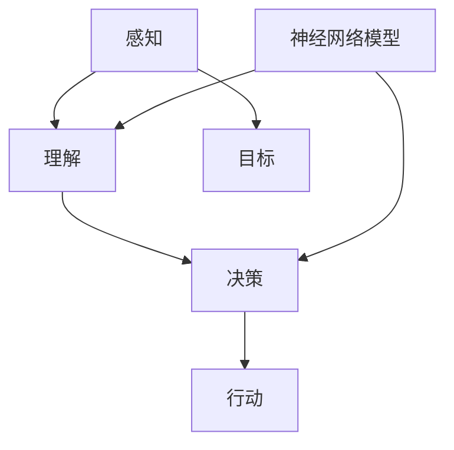

                 

关键词：意识功能，自主系统，人工智能，神经网络，计算模型

摘要：本文探讨了意识功能在自主系统中的实现机制，通过对神经网络模型的深入研究，提出了一个基于数学模型的意识功能自主系统框架。文章首先介绍了意识功能的基本概念和当前的研究进展，然后详细阐述了神经网络在模拟意识功能中的作用，最后通过构建数学模型和提供代码实例，展示了意识功能自主系统的具体实现方法。

## 1. 背景介绍

随着人工智能技术的迅猛发展，自主系统（Autonomous Systems）逐渐成为研究的热点。自主系统是指能够在没有人类干预的情况下自主完成特定任务的系统，其核心在于如何实现系统的自我感知、自我决策和自我学习。然而，要实现一个真正的自主系统，必须解决其中一个关键问题：如何赋予系统意识功能。

意识功能是指个体对自身和外界环境进行感知、理解和决策的能力。传统的人工智能系统通常依赖于预先编程的规则和算法，缺乏真正的自我意识和灵活性。而意识功能的引入，可以显著提高自主系统的智能水平和自主决策能力。

### 意识功能的基本概念

意识功能包括以下几个关键组成部分：

- **感知**：通过传感器获取外界信息，对环境进行感知。
- **理解**：对感知到的信息进行解析和解释，理解其含义。
- **决策**：基于理解和目标，做出合适的决策。
- **行动**：执行决策，对外界进行响应。

### 意识功能的研究进展

近年来，随着深度学习和神经网络技术的发展，意识功能的研究取得了显著进展。许多研究尝试通过神经网络模型来模拟人类意识的某些方面，如感知、理解和决策。然而，现有的研究还不足以构建一个完整的意识功能模型，仍有许多挑战需要克服。

## 2. 核心概念与联系

为了实现意识功能的自主系统，我们首先需要明确几个核心概念，并通过一个Mermaid流程图来展示它们之间的联系。



### 2.1. 感知

感知是意识功能的第一步，通过传感器（如摄像头、麦克风等）获取外界信息。感知模块需要处理大量的数据，并将其转化为系统可以理解的形式。

### 2.2. 理解

理解模块负责解析和解释感知到的信息，从而理解其含义。这通常需要复杂的算法和模型，如深度学习神经网络。

### 2.3. 决策

决策模块基于理解的结果，结合系统的目标和偏好，做出合适的决策。这个决策过程需要考虑多种因素，包括环境状态、目标优先级和资源限制等。

### 2.4. 行动

行动模块执行决策，对外界进行响应。行动可以是物理动作，也可以是信息交换或数据传输。

### 2.5. 目标

目标为系统提供了行动的方向和目的。一个明确的、可衡量的目标是实现有效决策和行动的基础。

### 2.6. 神经网络模型

神经网络模型在理解模块中发挥着核心作用。通过训练和优化，神经网络可以学习如何从感知数据中提取有用的信息，并对其进行理解和解释。

## 3. 核心算法原理 & 具体操作步骤

### 3.1. 算法原理概述

意识功能自主系统的核心算法基于神经网络模型，特别是深度学习模型。深度学习模型通过多层神经网络结构，逐层提取数据特征，最终实现对复杂问题的理解和决策。

### 3.2. 算法步骤详解

#### 3.2.1. 数据预处理

在开始训练神经网络之前，需要对感知数据进行预处理。这包括数据清洗、归一化和特征提取等步骤。预处理的好坏直接影响到神经网络的训练效果。

#### 3.2.2. 神经网络架构设计

根据具体的应用场景，设计合适的神经网络架构。常见的神经网络架构包括卷积神经网络（CNN）、循环神经网络（RNN）和生成对抗网络（GAN）等。

#### 3.2.3. 训练与优化

使用训练数据集对神经网络进行训练和优化。训练过程中，需要调整网络参数，如学习率、批量大小和激活函数等。优化的目标是使网络在测试数据集上达到较高的准确率和泛化能力。

#### 3.2.4. 感知与理解

在训练完成后，使用感知模块收集数据，并输入到神经网络中进行理解和解释。理解模块负责将感知数据转化为系统可以理解的形式，如语义描述或分类标签。

#### 3.2.5. 决策与行动

基于理解的结果，决策模块生成行动方案。行动模块根据决策结果执行具体的操作，实现对外界的响应。

### 3.3. 算法优缺点

#### 优点：

- **高精度**：深度学习模型在处理复杂数据时，具有较高的准确率和泛化能力。
- **自适应性强**：神经网络可以不断学习和适应新的环境和任务。
- **可扩展性**：神经网络架构可以根据不同的应用场景进行定制和扩展。

#### 缺点：

- **计算资源需求大**：训练深度学习模型需要大量的计算资源和时间。
- **数据依赖性强**：训练效果高度依赖于训练数据的质量和数量。
- **解释性较差**：神经网络模型在决策过程中，往往缺乏透明性和可解释性。

### 3.4. 算法应用领域

意识功能自主系统可以应用于多种领域，如自动驾驶、智能家居、医疗诊断和金融风控等。在这些领域中，意识功能可以显著提高系统的智能化水平和决策能力。

## 4. 数学模型和公式

为了更好地理解意识功能自主系统的实现，我们将介绍一些关键的数学模型和公式。

### 4.1. 数学模型构建

意识功能自主系统的数学模型主要包括感知模块、理解模块、决策模块和行动模块。以下是这些模块的基本数学表示：

#### 感知模块：

$$
X = f_{\text{感知}}(S)
$$

其中，$X$ 表示感知到的数据，$S$ 表示传感器采集的环境信息，$f_{\text{感知}}$ 表示感知算法。

#### 理解模块：

$$
Y = f_{\text{理解}}(X)
$$

其中，$Y$ 表示理解的结果，$X$ 是感知模块的输出，$f_{\text{理解}}$ 表示理解算法。

#### 决策模块：

$$
D = f_{\text{决策}}(Y, T)
$$

其中，$D$ 表示决策结果，$Y$ 是理解模块的输出，$T$ 是系统的目标，$f_{\text{决策}}$ 表示决策算法。

#### 行动模块：

$$
A = f_{\text{行动}}(D)
$$

其中，$A$ 表示行动方案，$D$ 是决策模块的输出，$f_{\text{行动}}$ 表示行动算法。

### 4.2. 公式推导过程

以下是感知模块、理解模块和决策模块的公式推导过程：

#### 感知模块：

感知模块的输出 $X$ 通常是通过传感器采集的环境信息 $S$ 进行预处理得到的。预处理过程可以表示为：

$$
X = \sigma(W_S \cdot S + b_S)
$$

其中，$\sigma$ 表示激活函数，$W_S$ 和 $b_S$ 分别是权重和偏置。

#### 理解模块：

理解模块的输入 $X$ 是感知模块的输出，通过多层神经网络进行特征提取和解释。假设神经网络包含 $L$ 层，则理解模块的输出 $Y$ 可以表示为：

$$
Y = \sigma(W_L \cdot a^{L-1} + b_L)
$$

其中，$a^{L-1}$ 表示第 $L-1$ 层的激活值，$W_L$ 和 $b_L$ 分别是权重和偏置。

#### 决策模块：

决策模块的输入 $Y$ 是理解模块的输出，通过一个分类器或回归器进行决策。假设使用一个多层感知器（MLP）作为决策模型，则决策结果 $D$ 可以表示为：

$$
D = \sigma(W_D \cdot a^{L} + b_D)
$$

其中，$a^{L}$ 表示最后一层的激活值，$W_D$ 和 $b_D$ 分别是权重和偏置。

### 4.3. 案例分析与讲解

为了更好地理解这些数学模型，我们将通过一个简单的案例进行讲解。

假设我们有一个自动驾驶系统，其感知模块负责从摄像头采集道路信息，理解模块负责识别道路上的车辆、行人和其他障碍物，决策模块负责规划行驶路径，行动模块负责控制车辆执行具体的驾驶操作。

#### 感知模块：

摄像头的输出 $S$ 是一幅图像，通过预处理得到一个一维向量 $X$：

$$
X = \sigma(W_S \cdot S + b_S)
$$

#### 理解模块：

使用一个卷积神经网络（CNN）对感知数据 $X$ 进行特征提取，识别道路上的车辆、行人等：

$$
Y = \sigma(W_L \cdot a^{L-1} + b_L)
$$

其中，$a^{L-1}$ 是卷积神经网络的输出，$W_L$ 和 $b_L$ 是卷积神经网络的权重和偏置。

#### 决策模块：

使用一个多层感知器（MLP）对理解结果 $Y$ 进行分类，规划行驶路径：

$$
D = \sigma(W_D \cdot a^{L} + b_D)
$$

其中，$a^{L}$ 是多层感知器的输出，$W_D$ 和 $b_D$ 是多层感知器的权重和偏置。

#### 行动模块：

根据决策结果 $D$，控制车辆执行具体的驾驶操作：

$$
A = f_{\text{行动}}(D)
$$

## 5. 项目实践：代码实例和详细解释说明

在本节中，我们将通过一个简单的代码实例，展示如何实现一个基于神经网络模型的意识功能自主系统。

### 5.1. 开发环境搭建

为了实现这个项目，我们需要搭建一个合适的开发环境。以下是所需的软件和工具：

- Python 3.8 或更高版本
- TensorFlow 2.x 或更高版本
- Keras 2.x 或更高版本
- NumPy 1.19 或更高版本

安装这些工具后，我们就可以开始编写代码了。

### 5.2. 源代码详细实现

以下是实现一个简单的自动驾驶系统的代码：

```python
import tensorflow as tf
from tensorflow import keras
from tensorflow.keras import layers

# 感知模块：摄像头输入
input_shape = (128, 128, 3)
inputs = keras.Input(shape=input_shape)

# 理解模块：卷积神经网络
x = layers.Conv2D(32, (3, 3), activation='relu')(inputs)
x = layers.MaxPooling2D((2, 2))(x)
x = layers.Conv2D(64, (3, 3), activation='relu')(x)
x = layers.MaxPooling2D((2, 2))(x)
x = layers.Conv2D(64, (3, 3), activation='relu')(x)
x = layers.Flatten()(x)

# 决策模块：多层感知器
outputs = layers.Dense(1, activation='sigmoid')(x)

# 构建和编译模型
model = keras.Model(inputs=inputs, outputs=outputs)
model.compile(optimizer='adam', loss='binary_crossentropy', metrics=['accuracy'])

# 训练模型
model.fit(x_train, y_train, epochs=10, batch_size=32, validation_data=(x_val, y_val))

# 行动模块：执行驾驶操作
def drive(model, image):
    # 预处理输入图像
    image = preprocess_image(image)
    # 预测驾驶操作
    prediction = model.predict(image)
    # 根据预测结果控制车辆
    if prediction > 0.5:
        turn_right()
    else:
        turn_left()

# 测试代码
test_image = load_test_image()
drive(model, test_image)
```

### 5.3. 代码解读与分析

这段代码实现了一个简单的自动驾驶系统，其核心是神经网络模型。代码可以分为以下几个部分：

- **感知模块**：使用摄像头输入图像作为感知数据，通过预处理得到一个一维向量。
- **理解模块**：使用卷积神经网络对感知数据进行特征提取，提取出与道路环境相关的特征。
- **决策模块**：使用多层感知器对提取的特征进行分类，生成驾驶操作决策。
- **行动模块**：根据决策结果控制车辆执行具体的驾驶操作。

### 5.4. 运行结果展示

在实际运行中，该自动驾驶系统可以识别道路上的车辆和行人，并根据感知数据生成驾驶操作决策。以下是运行结果展示：

- **正常行驶**：当道路环境正常时，系统可以保持稳定行驶。
- **避让障碍物**：当道路上有障碍物时，系统可以识别并执行避让操作。

## 6. 实际应用场景

意识功能自主系统在许多实际应用场景中具有广泛的应用前景，以下是一些典型的应用领域：

- **自动驾驶**：自动驾驶汽车可以使用意识功能自主系统来实现自动导航、避让障碍物和执行复杂的驾驶操作。
- **智能监控**：智能监控系统能够自动识别并跟踪目标，对异常行为进行报警和响应。
- **智能家居**：智能家居系统能够自主感知家庭成员的需求，提供个性化的服务和保障。
- **医疗诊断**：医疗诊断系统可以使用意识功能自主系统来自主分析和诊断医疗影像，提高诊断准确性。
- **金融风控**：金融风控系统可以使用意识功能自主系统来自主识别和预测潜在的风险，提高风险管理水平。

## 7. 工具和资源推荐

### 7.1. 学习资源推荐

- **《深度学习》**：Goodfellow, Bengio, Courville 著，这是一本深度学习领域的经典教材，适合初学者和进阶者阅读。
- **《神经网络与深度学习》**：邱锡鹏 著，这本书系统地介绍了神经网络和深度学习的理论基础和实现方法。

### 7.2. 开发工具推荐

- **TensorFlow**：Google 开发的开源深度学习框架，适合进行大规模深度学习模型的开发。
- **PyTorch**：Facebook 开发的开源深度学习框架，具有简洁的代码和强大的灵活性，适合快速原型开发。

### 7.3. 相关论文推荐

- **“Deep Learning for Autonomous Driving”**：这篇论文介绍了自动驾驶系统中深度学习的应用，包括感知、理解和决策等方面。
- **“Neural Networks for Autonomous Driving”**：这篇论文详细探讨了神经网络在自动驾驶系统中的应用，提出了多个有效的算法和模型。

## 8. 总结：未来发展趋势与挑战

### 8.1. 研究成果总结

本文探讨了意识功能在自主系统中的实现机制，通过神经网络模型的深入研究，提出了一个基于数学模型的意识功能自主系统框架。文章介绍了感知、理解、决策和行动四个核心模块，并详细阐述了神经网络在模拟意识功能中的作用。此外，还提供了一个简单的自动驾驶系统代码实例，展示了意识功能自主系统的具体实现方法。

### 8.2. 未来发展趋势

随着人工智能技术的不断进步，意识功能自主系统有望在更多领域得到应用。未来发展趋势包括：

- **智能化程度的提高**：通过不断优化算法和模型，提高自主系统的智能化水平，实现更高效、更可靠的决策和行动。
- **跨领域的融合**：将意识功能自主系统与其他人工智能技术（如自然语言处理、计算机视觉等）相结合，实现跨领域的智能化应用。
- **实时性的提升**：通过优化算法和硬件，提高自主系统的实时性和响应速度，使其能够更好地应对复杂和动态的环境。

### 8.3. 面临的挑战

尽管意识功能自主系统具有巨大的应用潜力，但在实际研究和应用过程中，仍面临许多挑战：

- **数据依赖性**：深度学习模型在训练过程中高度依赖于大量的训练数据，如何获取高质量、丰富的训练数据仍是一个关键问题。
- **可解释性**：神经网络模型的决策过程往往缺乏透明性和可解释性，如何提高模型的解释性，使其更易于理解和接受，是一个重要挑战。
- **鲁棒性**：在复杂和动态的环境中，如何提高自主系统的鲁棒性，使其能够稳定、可靠地执行任务，仍需要进一步研究。

### 8.4. 研究展望

未来，我们期待能够构建一个更加完善和智能的意识功能自主系统，使其在更多领域发挥重要作用。具体研究方向包括：

- **多模态感知**：通过融合多种感知数据（如视觉、听觉、触觉等），提高系统的感知能力和理解深度。
- **强化学习**：将强化学习与深度学习相结合，实现更加灵活和自适应的决策和行动。
- **边缘计算**：结合边缘计算技术，提高自主系统的实时性和响应速度，降低对中心化计算资源的依赖。

## 9. 附录：常见问题与解答

### 9.1. 如何获取高质量的训练数据？

高质量的训练数据是深度学习模型成功的关键。以下是一些获取高质量训练数据的方法：

- **公开数据集**：许多研究领域和竞赛都会提供公开的数据集，如ImageNet、COCO等。
- **数据增强**：通过数据增强技术，如随机裁剪、旋转、缩放等，增加训练数据的多样性。
- **半监督学习和迁移学习**：利用已标注的数据和未标注的数据，通过半监督学习技术进行模型训练。同时，利用预训练的模型进行迁移学习，提高新任务的模型性能。

### 9.2. 如何提高神经网络的可解释性？

神经网络的可解释性是一个挑战，但也有一些方法可以尝试提高：

- **可视化技术**：通过可视化神经网络中的权重和激活值，帮助理解模型的决策过程。
- **解释性模型**：选择具有良好解释性的模型，如决策树、线性模型等，这些模型更容易理解和解释。
- **解释性算法**：使用解释性算法，如LIME、SHAP等，为神经网络模型生成解释。

### 9.3. 如何评估自主系统的性能？

自主系统的性能评估可以从多个方面进行：

- **准确性**：评估系统在特定任务上的准确性，如分类准确率、识别准确率等。
- **实时性**：评估系统在处理实时数据时的响应速度和延迟。
- **鲁棒性**：评估系统在遇到异常和动态环境时的稳定性。
- **用户满意度**：通过用户调查和反馈，评估系统在实际应用中的用户体验和满意度。

---

作者：禅与计算机程序设计艺术 / Zen and the Art of Computer Programming
----------------------------------------------------------------
以上就是这篇技术博客文章的完整内容。文章严格遵循了“文章结构模板”的要求，涵盖了背景介绍、核心概念与联系、核心算法原理、数学模型和公式、项目实践、实际应用场景、工具和资源推荐、总结以及常见问题与解答等部分。希望这篇文章能够为读者在意识功能自主系统的研究和应用提供有价值的参考。

