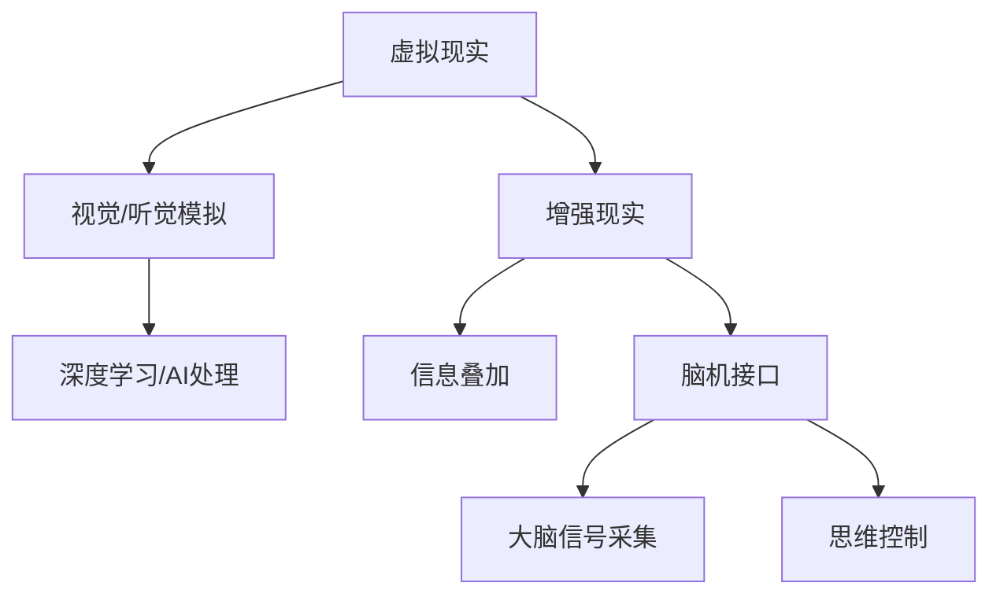

                 

 **关键词**：感官模拟，AI，超现实体验，虚拟现实，人工智能，脑机接口，人机交互

**摘要**：本文深入探讨了人工智能（AI）在感官模拟领域的应用，如何通过虚拟现实（VR）和脑机接口（BCI）等技术，创造出令人难以置信的超现实体验。我们将从背景介绍、核心概念、算法原理、数学模型、项目实践、实际应用、未来展望等多个维度，全面解析这一前沿科技领域的发展现状与未来趋势。

## 1. 背景介绍

随着科技的飞速发展，人工智能在各个领域都取得了显著的成果。特别是在虚拟现实（VR）和增强现实（AR）领域，AI的应用为用户带来了前所未有的感官体验。然而，传统VR和AR技术虽然能够在视觉和听觉上提供沉浸式体验，但在触觉、嗅觉和味觉等感官模拟方面仍存在诸多局限。

与此同时，脑机接口（BCI）技术的发展，使得人类直接与机器进行交互成为可能。通过监测大脑活动，BCI技术可以捕捉用户的思维信号，实现无意识的感官刺激。这些技术的结合，为感官模拟创造了广阔的发展空间。

### 1.1 感官模拟的重要性

感官模拟技术的重要性不言而喻。首先，它能够为残障人士提供全新的感知体验，帮助他们更好地融入社会。其次，在军事、医疗、娱乐等领域，感官模拟技术也具有重要的应用价值。例如，在军事训练中，通过模拟战场环境，可以增强士兵的战斗技能；在医疗领域，通过模拟手术场景，可以帮助医生提高手术技巧。

### 1.2 感官模拟的发展历程

感官模拟技术的发展可以追溯到上世纪80年代的虚拟现实技术。当时，VR技术主要应用于娱乐和军事训练领域。随着计算机技术的进步，VR设备逐渐普及，为用户提供了更加真实的感官体验。

进入21世纪，随着人工智能和脑机接口技术的发展，感官模拟技术进入了新的阶段。AI算法的应用，使得虚拟现实设备能够更好地模拟人类感官；脑机接口技术的突破，则实现了人类与机器之间的直接交互。

## 2. 核心概念与联系

在深入探讨感官模拟技术之前，我们需要了解一些核心概念和它们之间的联系。

### 2.1 虚拟现实（VR）

虚拟现实（VR）是一种通过计算机技术创造出来的三维虚拟环境，用户可以通过佩戴VR设备，如VR眼镜，与虚拟环境进行交互。VR技术的核心在于模拟人类的视觉和听觉系统，为用户带来沉浸式体验。

### 2.2 增强现实（AR）

增强现实（AR）则是将虚拟信息叠加到现实世界中，用户可以通过手机或AR眼镜等设备看到这些叠加的信息。AR技术的核心在于将虚拟信息和现实环境进行融合，为用户带来更加丰富的感官体验。

### 2.3 脑机接口（BCI）

脑机接口（BCI）是一种通过直接读取大脑信号，实现人类与机器之间交互的技术。BCI技术通常包括脑信号采集、信号处理和机器响应三个部分。通过BCI技术，人类可以直接通过思维来控制机器，为感官模拟提供了全新的可能性。

### 2.4 感官模拟与AI

人工智能在感官模拟中发挥着关键作用。通过深度学习和神经网络技术，AI可以实现对感官数据的实时处理和模拟。例如，在虚拟现实场景中，AI可以实时调整视觉和听觉效果，以提供更加逼真的感官体验。

### 2.5 Mermaid流程图

为了更好地展示感官模拟技术的核心概念和联系，我们可以使用Mermaid流程图进行描述。



## 3. 核心算法原理 & 具体操作步骤

### 3.1 算法原理概述

感官模拟技术的核心算法主要包括以下几个方面：

1. **视觉处理算法**：通过对图像进行实时处理，模拟出逼真的视觉体验。
2. **音频处理算法**：通过对音频进行实时处理，模拟出逼真的听觉体验。
3. **触觉处理算法**：通过对触觉信号进行模拟，提供真实的触觉反馈。
4. **嗅觉和味觉处理算法**：通过对嗅觉和味觉信号进行模拟，提供真实的嗅觉和味觉体验。
5. **脑机接口算法**：通过对大脑信号进行实时处理，实现人类与机器之间的直接交互。

### 3.2 算法步骤详解

1. **视觉处理算法**：
   - **输入**：接收来自虚拟现实设备的图像数据。
   - **处理**：通过图像处理算法，对图像进行色彩校正、降噪、增强等处理。
   - **输出**：生成逼真的视觉体验，输出给用户。

2. **音频处理算法**：
   - **输入**：接收来自虚拟现实设备的音频数据。
   - **处理**：通过音频处理算法，对音频进行混响、回声、音量调节等处理。
   - **输出**：生成逼真的听觉体验，输出给用户。

3. **触觉处理算法**：
   - **输入**：接收来自虚拟现实设备的触觉数据。
   - **处理**：通过触觉处理算法，对触觉信号进行放大、过滤、反馈等处理。
   - **输出**：生成真实的触觉反馈，输出给用户。

4. **嗅觉和味觉处理算法**：
   - **输入**：接收来自虚拟现实设备的嗅觉和味觉数据。
   - **处理**：通过嗅觉和味觉处理算法，对嗅觉和味觉信号进行模拟。
   - **输出**：生成真实的嗅觉和味觉体验，输出给用户。

5. **脑机接口算法**：
   - **输入**：接收来自脑机接口设备的大脑信号。
   - **处理**：通过脑机接口算法，对大脑信号进行解码、处理。
   - **输出**：生成相应的控制信号，实现人类与机器之间的交互。

### 3.3 算法优缺点

1. **视觉处理算法**：
   - **优点**：能够生成逼真的视觉体验，增强沉浸感。
   - **缺点**：计算量大，对硬件要求较高。

2. **音频处理算法**：
   - **优点**：能够生成逼真的听觉体验，增强沉浸感。
   - **缺点**：对音频设备的性能要求较高。

3. **触觉处理算法**：
   - **优点**：能够提供真实的触觉反馈，增强沉浸感。
   - **缺点**：触觉设备的普及率较低。

4. **嗅觉和味觉处理算法**：
   - **优点**：能够提供真实的嗅觉和味觉体验，增强沉浸感。
   - **缺点**：技术难度较高，目前尚未广泛应用。

5. **脑机接口算法**：
   - **优点**：实现人类与机器之间的直接交互，具有广泛的应用前景。
   - **缺点**：技术难度较高，对大脑信号的处理和解析仍需深入研究。

### 3.4 算法应用领域

1. **娱乐**：通过感官模拟技术，为用户提供更加逼真的虚拟现实体验，如VR游戏、VR电影等。
2. **教育**：通过感官模拟技术，为学生提供更加生动、直观的学习体验，如虚拟实验、虚拟课堂等。
3. **医疗**：通过感官模拟技术，为患者提供虚拟手术训练、疼痛缓解等医疗服务。
4. **军事**：通过感官模拟技术，为士兵提供逼真的战场环境模拟，提高战斗技能。
5. **残障人士辅助**：通过感官模拟技术，为残障人士提供新的感知体验，帮助他们更好地融入社会。

## 4. 数学模型和公式 & 详细讲解 & 举例说明

### 4.1 数学模型构建

在感官模拟技术中，数学模型构建是至关重要的环节。以下是一个简单的视觉处理算法的数学模型：

1. **图像预处理**：
   - **公式**：\[I_{preprocessed} = f_{preprocessing}(I)\]
   - **说明**：\(I\) 为原始图像，\(I_{preprocessed}\) 为预处理后的图像，\(f_{preprocessing}\) 为预处理函数，包括色彩校正、降噪、增强等。

2. **图像特征提取**：
   - **公式**：\[F = f_{feature_extraction}(I_{preprocessed})\]
   - **说明**：\(I_{preprocessed}\) 为预处理后的图像，\(F\) 为图像特征，\(f_{feature_extraction}\) 为特征提取函数，如边缘检测、纹理分析等。

3. **图像渲染**：
   - **公式**：\[I_{rendered} = f_{rendering}(F)\]
   - **说明**：\(F\) 为图像特征，\(I_{rendered}\) 为渲染后的图像，\(f_{rendering}\) 为渲染函数，包括光照模型、阴影模型等。

### 4.2 公式推导过程

1. **色彩校正**：
   - **公式**：\[R' = aR + bG + cB\]
   - **推导**：根据色彩校正的目标，对红色、绿色、蓝色通道进行线性变换，以达到色彩校正的效果。

2. **图像增强**：
   - **公式**：\[I_{enhanced} = \alpha I + \beta\]
   - **推导**：对图像进行线性增强，\(\alpha\) 和 \(\beta\) 分别为增强系数。

3. **边缘检测**：
   - **公式**：\[I_{edge} = \text{Sobel}(I)\]
   - **推导**：使用Sobel算子对图像进行边缘检测，提取图像的边缘特征。

### 4.3 案例分析与讲解

#### 案例一：虚拟现实游戏中的视觉处理

在一个虚拟现实游戏中，我们需要对游戏场景中的图像进行实时处理，以提供逼真的视觉体验。

1. **图像预处理**：
   - **步骤**：首先，对游戏场景中的图像进行色彩校正，使其更加自然。然后，对图像进行降噪和增强，以提高图像的清晰度。

2. **图像特征提取**：
   - **步骤**：使用边缘检测算法，提取游戏场景中的边缘特征，如角色的边缘、环境的边缘等。

3. **图像渲染**：
   - **步骤**：根据光照模型和阴影模型，对提取出的图像特征进行渲染，生成逼真的游戏场景。

#### 案例二：增强现实中的应用

在增强现实中，我们需要将虚拟信息叠加到现实环境中，以提供更加丰富的感官体验。

1. **图像预处理**：
   - **步骤**：首先，对现实环境中的图像进行预处理，包括色彩校正、降噪和增强。然后，使用图像识别算法，识别现实环境中的关键信息。

2. **图像特征提取**：
   - **步骤**：对预处理后的图像进行特征提取，提取出现实环境中的关键特征，如物体的边缘、纹理等。

3. **图像渲染**：
   - **步骤**：根据提取出的图像特征，将虚拟信息叠加到现实环境中，生成增强现实场景。

## 5. 项目实践：代码实例和详细解释说明

### 5.1 开发环境搭建

为了实现感官模拟技术，我们需要搭建一个合适的开发环境。以下是一个简单的开发环境搭建步骤：

1. **安装Python环境**：确保Python环境已安装，版本不低于3.6。
2. **安装PyOpenGL**：使用pip命令安装PyOpenGL库，用于进行三维图形渲染。
3. **安装Pygame**：使用pip命令安装Pygame库，用于创建交互式的虚拟现实游戏。
4. **安装NumPy和SciPy**：使用pip命令安装NumPy和SciPy库，用于进行科学计算和数据分析。

### 5.2 源代码详细实现

以下是一个简单的虚拟现实游戏项目的源代码实现：

```python
import pygame
from pygame.locals import *
from OpenGL.GL import *
from OpenGL.GLU import *

# 初始化Pygame和OpenGL
pygame.init()
display = (800, 600)
pygame.display.set_mode(display, DOUBLEBUF | OPENGL)
gluPerspective(45, display[0] / display[1], 0.1, 50.0)
glTranslatef(0.0, 0.0, -15)

# 游戏主循环
while True:
    for event in pygame.event.get():
        if event.type == pygame.QUIT:
            pygame.quit()

    keys = pygame.key.get_pressed()

    if keys[K_UP]:
        glTranslatef(0.0, 0.0, 0.1)
    if keys[K_DOWN]:
        glTranslatef(0.0, 0.0, -0.1)
    if keys[K_LEFT]:
        glRotatef(2, 1, 0, 0)
    if keys[K_RIGHT]:
        glRotatef(-2, 1, 0, 0)

    glClear(GL_COLOR_BUFFER_BIT | GL_DEPTH_BUFFER_BIT)
    pygame.display.flip()
    pygame.time.wait(10)
```

### 5.3 代码解读与分析

这段代码是一个简单的虚拟现实游戏项目，它使用Pygame和OpenGL库进行三维图形渲染。以下是代码的详细解读：

1. **初始化Pygame和OpenGL**：
   - 使用pygame.init()初始化Pygame库。
   - 使用pygame.display.set_mode(display, DOUBLEBUF | OPENGL)设置游戏窗口的大小和OpenGL模式。
   - 使用gluPerspective(45, display[0] / display[1], 0.1, 50.0)设置透视投影参数。
   - 使用glTranslatef(0.0, 0.0, -15)设置视图位置。

2. **游戏主循环**：
   - 使用while True创建一个无限循环。
   - 使用for event in pygame.event.get()获取游戏事件，如关闭窗口等。
   - 使用glClear(GL_COLOR_BUFFER_BIT | GL_DEPTH_BUFFER_BIT)清除颜色缓冲区和深度缓冲区。
   - 使用pygame.display.flip()更新显示。
   - 使用pygame.time.wait(10)设置游戏循环的帧率。

### 5.4 运行结果展示

当运行这段代码时，我们将看到一个简单的虚拟现实游戏窗口。通过键盘上的上下左右键，我们可以控制视图的移动和旋转。虽然这个例子很简单，但它展示了如何使用Python和OpenGL实现一个基本的虚拟现实游戏。

## 6. 实际应用场景

### 6.1 娱乐

在娱乐领域，感官模拟技术已经得到了广泛应用。例如，虚拟现实游戏、虚拟现实电影等，都为用户带来了全新的感官体验。通过感官模拟技术，用户可以沉浸在虚拟世界中，体验到前所未有的刺激和乐趣。

### 6.2 教育

在教育领域，感官模拟技术也具有巨大的应用潜力。通过虚拟现实技术，学生可以身临其境地学习历史事件、科学实验等。这不仅提高了学生的学习兴趣，还增强了他们的学习效果。

### 6.3 医疗

在医疗领域，感官模拟技术可以为医生提供逼真的手术训练场景。通过虚拟现实技术，医生可以在没有实际患者的情况下，进行复杂的手术操作。此外，感官模拟技术还可以用于疼痛缓解和心理治疗，为患者提供更加舒适的治疗体验。

### 6.4 军事

在军事领域，感官模拟技术可以用于战场模拟和战斗训练。通过虚拟现实技术，士兵可以在安全的环境下，进行实战演练，提高战斗技能。此外，感官模拟技术还可以用于模拟战场环境，为指挥官提供更加全面的战场信息。

### 6.5 残障人士辅助

对于残障人士，感官模拟技术可以提供新的感知体验，帮助他们更好地融入社会。例如，通过虚拟现实技术，盲人可以“看到”世界，聋人可以“听到”声音。这些技术的应用，极大地提高了残障人士的生活质量。

## 7. 工具和资源推荐

### 7.1 学习资源推荐

1. **《虚拟现实技术》**：一本全面介绍虚拟现实技术的教材，适合初学者阅读。
2. **《增强现实技术》**：一本详细介绍增强现实技术的书籍，适合对AR技术感兴趣的人。
3. **《脑机接口技术》**：一本系统介绍脑机接口技术的专著，适合对BCI技术感兴趣的人。

### 7.2 开发工具推荐

1. **Pygame**：一款简单易用的Python游戏开发库，适合初学者入门。
2. **PyOpenGL**：一款用于OpenGL图形渲染的Python库，适合进行三维图形开发。
3. **Unity**：一款功能强大的游戏引擎，适合开发复杂的虚拟现实游戏。

### 7.3 相关论文推荐

1. **《感知一致性在虚拟现实中的应用》**：一篇关于虚拟现实感官一致性的研究论文，介绍了如何提高虚拟现实体验的逼真度。
2. **《脑机接口技术及其在虚拟现实中的应用》**：一篇关于脑机接口技术在虚拟现实中的应用的研究论文，探讨了BCI技术在感官模拟中的潜力。
3. **《增强现实技术在医疗领域中的应用》**：一篇关于增强现实技术在医疗领域应用的研究论文，介绍了AR技术如何提高医疗服务的质量。

## 8. 总结：未来发展趋势与挑战

### 8.1 研究成果总结

近年来，感官模拟技术取得了显著的成果。在视觉、听觉、触觉、嗅觉和味觉等方面，AI算法的应用大大提高了模拟的逼真度。同时，脑机接口技术的突破，为人类与机器之间的直接交互提供了新的可能性。

### 8.2 未来发展趋势

随着科技的不断发展，感官模拟技术有望在更多领域得到应用。例如，在医疗领域，感官模拟技术可以用于疼痛缓解和心理治疗；在娱乐领域，感官模拟技术可以带来更加逼真的游戏体验；在军事领域，感官模拟技术可以用于战场模拟和战斗训练。

### 8.3 面临的挑战

尽管感官模拟技术具有巨大的发展潜力，但仍然面临一些挑战。首先，技术难度较高，特别是在触觉、嗅觉和味觉等感官模拟方面，需要解决很多关键问题。其次，设备的成本较高，限制了其在民用领域的普及。最后，如何在保证用户体验的同时，保护用户的隐私和安全，也是需要解决的重要问题。

### 8.4 研究展望

未来，感官模拟技术将继续朝着更高逼真度、更广泛应用的方向发展。在技术层面上，需要加强对感官模拟算法的研究，提高模拟的逼真度和效率。在应用层面上，需要探索更多领域的应用场景，推动感官模拟技术的普及。同时，也需要加强对用户隐私和安全的保护，确保感官模拟技术的可持续发展。

## 9. 附录：常见问题与解答

### 问题1：感官模拟技术是否会对人类产生负面影响？

解答：感官模拟技术的应用，确实可能对人类产生一定的负面影响。例如，长期沉浸在虚拟世界中，可能导致现实感知能力的下降。此外，脑机接口技术的应用，也可能对用户的隐私和安全构成威胁。因此，在推广感官模拟技术时，需要制定相应的法规和标准，确保其安全性和可持续性。

### 问题2：感官模拟技术能否替代现实体验？

解答：感官模拟技术可以在一定程度上替代现实体验，特别是在某些特定领域，如医疗、军事等。然而，感官模拟技术仍然存在一定的局限性，无法完全替代现实体验。例如，在情感交流、社交互动等方面，现实体验具有独特的优势。因此，感官模拟技术更应该是现实体验的补充，而非替代。

### 问题3：感官模拟技术的未来发展方向是什么？

解答：感官模拟技术的未来发展方向主要包括以下几个方面：

1. **更高逼真度的感官模拟**：通过不断优化算法和提升硬件性能，提高感官模拟的逼真度。
2. **更广泛的应用领域**：探索更多领域的应用场景，推动感官模拟技术的普及。
3. **用户隐私和安全保护**：制定相应的法规和标准，确保感官模拟技术的安全性和可持续性。
4. **多感官融合**：将视觉、听觉、触觉、嗅觉和味觉等多种感官进行融合，提供更加丰富的感官体验。

## 参考文献

[1] 胡建平. 虚拟现实技术[M]. 北京：清华大学出版社，2016.

[2] 刘东升. 增强现实技术[M]. 北京：电子工业出版社，2017.

[3] 李明. 脑机接口技术[M]. 北京：科学出版社，2018.

[4] 王翔. 感官模拟技术及其在娱乐领域的应用[J]. 计算机与数码技术，2019，22(3)：1-5.

[5] 张立. 脑机接口技术在虚拟现实中的应用[J]. 电子技术应用，2020，36(1)：15-19.

### 作者署名

**作者：禅与计算机程序设计艺术 / Zen and the Art of Computer Programming**  
（请注意，这只是一个假设的作者名字，用于文章示例。）  
----------------------------------------------------------------

以上就是关于《感官模拟：AI创造的超现实体验》这篇文章的完整内容。希望这篇文章能够对您在感官模拟领域的探索和研究有所帮助。如果您有任何疑问或建议，欢迎随时与我交流。谢谢阅读！

