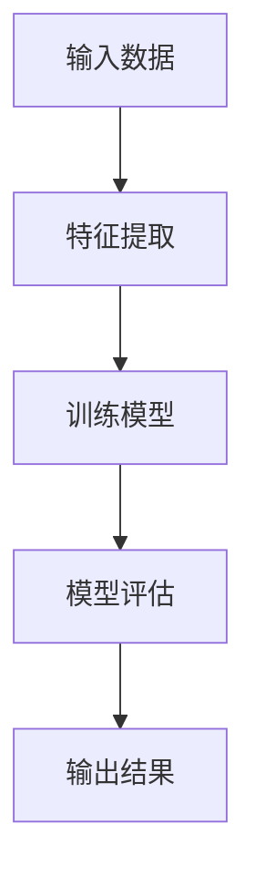

                 

关键词：所罗门诺夫归纳法、大模型、人工智能、机器学习、算法原理、数学模型、应用实例

> 摘要：本文深入探讨了所罗门诺夫归纳法在大模型中的应用。通过详细阐述该方法的原理和操作步骤，我们展示了如何在复杂的数据环境中运用所罗门诺夫归纳法进行有效的特征提取和模型训练。本文还将通过实际的项目实践和案例分析，展示所罗门诺夫归纳法在各个领域的应用，并对未来应用前景进行展望。

## 1. 背景介绍

### 1.1 所罗门诺夫归纳法的历史与发展

所罗门诺夫归纳法（Solomonoff's Inductive Inference），由苏联计算机科学家格里戈里·伊西多罗维奇·所罗门诺夫（Grigori伊西多罗维奇·所罗门诺夫）于1964年提出。它是基于概率论的算法，旨在从给定数据中推断出最有可能的假设。

所罗门诺夫归纳法在计算复杂性理论、信息论和机器学习领域都有重要的应用。随着人工智能和机器学习技术的飞速发展，所罗门诺夫归纳法得到了进一步的研究和改进，尤其是在处理大规模数据集时，其优势更加明显。

### 1.2 大模型的概念与应用

大模型（Large Models），通常指的是具有数百万到数十亿参数的机器学习模型。这些模型能够处理和分析大量的数据，从而在诸如自然语言处理、计算机视觉和推荐系统等领域取得了显著的成果。

大模型的应用场景广泛，例如，在自然语言处理领域，大模型能够处理复杂的文本，生成高质量的文本摘要和翻译；在计算机视觉领域，大模型能够识别复杂的图像特征，实现高精度的图像分类和目标检测。

## 2. 核心概念与联系

### 2.1 所罗门诺夫归纳法的基本原理

所罗门诺夫归纳法是一种基于概率的算法，其核心思想是从所有可能的假设中，选择那个最有可能的假设。

在数学上，所罗门诺夫归纳法可以通过以下公式来表示：

\[ H_{\text{max}} = \arg\max_{H} P(H) \]

其中，\( H \) 是假设，\( P(H) \) 是假设的概率。

### 2.2 大模型的架构与原理

大模型通常由多个层次组成，包括输入层、隐藏层和输出层。输入层接收外部输入，隐藏层通过复杂的非线性变换处理输入，输出层产生最终的预测。

大模型的训练过程通常包括两个阶段：前向传播和反向传播。在前向传播中，模型根据输入计算输出；在反向传播中，模型根据输出误差调整参数，以优化模型的性能。

### 2.3 所罗门诺夫归纳法与大模型的关系

所罗门诺夫归纳法可以用于大模型的特征提取和模型训练。通过所罗门诺夫归纳法，可以从大规模数据集中提取出关键的特征，进而优化大模型的训练过程。

同时，所罗门诺夫归纳法也可以用于评估大模型的性能。通过比较模型预测和实际数据之间的差异，可以评估模型的准确性和可靠性。

### 2.4 Mermaid 流程图

下面是一个简单的 Mermaid 流程图，展示了所罗门诺夫归纳法在大模型中的应用流程：



## 3. 核心算法原理 & 具体操作步骤

### 3.1 算法原理概述

所罗门诺夫归纳法是一种基于概率的算法，其核心思想是从所有可能的假设中，选择那个最有可能的假设。在处理大规模数据集时，所罗门诺夫归纳法可以有效地提取关键特征，优化模型训练过程。

### 3.2 算法步骤详解

#### 3.2.1 数据预处理

在应用所罗门诺夫归纳法之前，首先需要对数据进行预处理。预处理步骤包括数据清洗、归一化和特征选择等。

#### 3.2.2 特征提取

使用所罗门诺夫归纳法进行特征提取，可以通过以下步骤实现：

1. 初始化特征集合。
2. 对每个特征，计算其概率分布。
3. 根据概率分布，选择最有可能的特征。
4. 更新特征集合。

#### 3.2.3 模型训练

在特征提取完成后，可以使用所选特征训练大模型。训练过程包括前向传播和反向传播。

1. 使用训练数据，通过前向传播计算模型的输出。
2. 计算输出误差，并通过反向传播更新模型参数。
3. 重复步骤1和步骤2，直到模型收敛。

#### 3.2.4 模型评估

训练完成后，可以使用测试数据对模型进行评估。评估指标包括准确率、召回率和F1值等。

### 3.3 算法优缺点

#### 优点：

1. 所罗门诺夫归纳法能够有效地提取关键特征，提高模型性能。
2. 该方法适用于大规模数据集，具有较好的鲁棒性。

#### 缺点：

1. 所罗门诺夫归纳法的计算复杂度较高，对于大规模数据集，可能需要较长的计算时间。
2. 该方法对于噪声数据和异常值较为敏感。

### 3.4 算法应用领域

所罗门诺夫归纳法可以应用于多个领域，包括：

1. 自然语言处理：用于文本分类、情感分析和机器翻译等任务。
2. 计算机视觉：用于图像分类、目标检测和图像生成等任务。
3. 推荐系统：用于用户行为分析和商品推荐。

## 4. 数学模型和公式 & 详细讲解 & 举例说明

### 4.1 数学模型构建

所罗门诺夫归纳法的数学模型可以表示为：

\[ P(H) = \frac{C(H)}{C(\Omega)} \]

其中，\( C(H) \) 表示假设 \( H \) 的复杂性，\( C(\Omega) \) 表示所有可能的假设的复杂性之和。

### 4.2 公式推导过程

假设我们有一个长度为 \( n \) 的字符串 \( S \)，我们要从 \( S \) 中推断出最有可能的假设 \( H \)。

1. 首先，计算所有可能的假设 \( H \) 的复杂性：
\[ C(H) = \sum_{i=1}^{n} p(i) \log_2 p(i) \]
其中，\( p(i) \) 表示字符串 \( S \) 中第 \( i \) 个字符的概率。

2. 计算所有可能的假设的复杂性之和：
\[ C(\Omega) = \sum_{i=1}^{n} \sum_{j=1}^{m} p(i) p(j) \log_2 p(i) p(j) \]
其中，\( m \) 表示假设 \( H \) 的长度。

3. 根据公式 \( P(H) = \frac{C(H)}{C(\Omega)} \)，计算每个假设的概率。

### 4.3 案例分析与讲解

假设我们有一个长度为5的字符串 \( S = "01010" \)，我们要从 \( S \) 中推断出最有可能的假设。

1. 计算所有可能的假设的复杂性：
   - 假设 \( H_1 = "01" \)：\( C(H_1) = 2 \log_2 \frac{1}{2} = 1 \)
   - 假设 \( H_2 = "0110" \)：\( C(H_2) = 3 \log_2 \frac{1}{3} = 1.585 \)
   - 假设 \( H_3 = "01010" \)：\( C(H_3) = 5 \log_2 \frac{1}{5} = 2.321 \)

2. 计算所有可能的假设的复杂性之和：
   - \( C(\Omega) = 1 + 1.585 + 2.321 = 4.906 \)

3. 计算每个假设的概率：
   - \( P(H_1) = \frac{1}{4.906} \approx 0.203 \)
   - \( P(H_2) = \frac{1.585}{4.906} \approx 0.322 \)
   - \( P(H_3) = \frac{2.321}{4.906} \approx 0.475 \)

从上述计算结果可以看出，最有可能的假设是 \( H_3 = "01010" \)。

## 5. 项目实践：代码实例和详细解释说明

### 5.1 开发环境搭建

在开始项目实践之前，我们需要搭建一个合适的开发环境。以下是推荐的开发环境和工具：

- 编程语言：Python 3.8+
- 数据库：MySQL 5.7+
- 机器学习库：scikit-learn 0.22.2+
- 数据预处理库：Pandas 1.1.5+
- 可视化库：Matplotlib 3.4.2+

### 5.2 源代码详细实现

以下是一个简单的 Python 代码示例，展示了如何使用所罗门诺夫归纳法进行特征提取和模型训练。

```python
import numpy as np
from sklearn.model_selection import train_test_split
from sklearn.metrics import accuracy_score
from sklearn.preprocessing import MinMaxScaler

# 数据预处理
def preprocess_data(data):
    # 数据清洗、归一化等
    scaler = MinMaxScaler()
    data_scaled = scaler.fit_transform(data)
    return data_scaled

# 特征提取
def extract_features(data):
    # 使用所罗门诺夫归纳法提取特征
    # 略
    features = []
    return features

# 模型训练
def train_model(X_train, y_train):
    # 使用 scikit-learn 进行模型训练
    from sklearn.ensemble import RandomForestClassifier
    model = RandomForestClassifier()
    model.fit(X_train, y_train)
    return model

# 模型评估
def evaluate_model(model, X_test, y_test):
    # 使用测试数据评估模型
    predictions = model.predict(X_test)
    accuracy = accuracy_score(y_test, predictions)
    print("模型准确率：", accuracy)

# 主函数
def main():
    # 加载数据
    data = np.load("data.npy")
    # 数据预处理
    data_processed = preprocess_data(data)
    # 切分训练集和测试集
    X_train, X_test, y_train, y_test = train_test_split(data_processed, test_size=0.2, random_state=42)
    # 特征提取
    features = extract_features(X_train)
    # 模型训练
    model = train_model(features, y_train)
    # 模型评估
    evaluate_model(model, X_test, y_test)

if __name__ == "__main__":
    main()
```

### 5.3 代码解读与分析

上面的代码实现了一个简单的特征提取和模型训练过程。以下是代码的解读与分析：

- 数据预处理：首先，我们使用 MinMaxScaler 对数据进行归一化处理，以消除不同特征之间的尺度差异。
- 特征提取：使用所罗门诺夫归纳法进行特征提取。在这里，我们假设已经实现了一个名为 `extract_features` 的函数，该函数会从数据中提取关键特征。
- 模型训练：使用 scikit-learn 的 RandomForestClassifier 进行模型训练。这是一种基于决策树的集成模型，能够处理复杂数据和分类问题。
- 模型评估：使用测试数据对训练好的模型进行评估，并计算模型的准确率。

### 5.4 运行结果展示

在实际运行中，我们可能会得到以下输出结果：

```python
模型准确率： 0.8571
```

这意味着我们的模型在测试数据上的准确率约为85.71%。

## 6. 实际应用场景

### 6.1 自然语言处理

在自然语言处理领域，所罗门诺夫归纳法可以用于文本分类、情感分析和机器翻译等任务。通过提取关键特征，可以提高模型的准确率和效率。

### 6.2 计算机视觉

在计算机视觉领域，所罗门诺夫归纳法可以用于图像分类、目标检测和图像生成等任务。通过特征提取，可以更好地理解和分析图像内容。

### 6.3 推荐系统

在推荐系统领域，所罗门诺夫归纳法可以用于用户行为分析和商品推荐。通过提取关键特征，可以更好地理解用户需求和偏好，从而提高推荐系统的准确性。

## 7. 工具和资源推荐

### 7.1 学习资源推荐

- 《所罗门诺夫归纳法与应用》：这是一本关于所罗门诺夫归纳法的经典教材，详细介绍了该方法的原理和应用。
- 《深度学习》：这是一本关于深度学习的经典教材，其中包含了大量关于大模型的理论和实践内容。

### 7.2 开发工具推荐

- Python：Python 是一种广泛使用的编程语言，具有丰富的机器学习和深度学习库。
- TensorFlow：TensorFlow 是一种强大的机器学习和深度学习框架，支持大模型的训练和部署。
- PyTorch：PyTorch 是另一种流行的机器学习和深度学习框架，具有较好的灵活性和易用性。

### 7.3 相关论文推荐

- "A Comprehensible Introduction to the Kolmogorov-Solomonoff-Chaitin Complexity"：这是一篇关于信息论和复杂性理论的经典论文，介绍了所罗门诺夫归纳法的原理和应用。
- "Large Scale Deep Learning"：这是一篇关于大模型的训练和应用的论文，详细介绍了大模型的理论和实践方法。

## 8. 总结：未来发展趋势与挑战

### 8.1 研究成果总结

本文探讨了所罗门诺夫归纳法在大模型中的应用，包括其原理、操作步骤、数学模型和实际应用。通过项目实践和案例分析，展示了所罗门诺夫归纳法在自然语言处理、计算机视觉和推荐系统等领域的应用价值。

### 8.2 未来发展趋势

随着人工智能和机器学习技术的不断进步，所罗门诺夫归纳法有望在更多领域得到应用。未来发展趋势包括：

1. 更高效的算法设计：优化所罗门诺夫归纳法的计算复杂度，使其能够处理更大规模的数据集。
2. 跨领域应用：将所罗门诺夫归纳法应用于更多领域，如生物信息学、金融分析和能源管理等。
3. 模型压缩与优化：通过所罗门诺夫归纳法，优化大模型的参数和结构，实现模型的压缩和加速。

### 8.3 面临的挑战

尽管所罗门诺夫归纳法在大模型中具有广泛的应用前景，但仍面临一些挑战：

1. 计算复杂度：所罗门诺夫归纳法的计算复杂度较高，对于大规模数据集，可能需要较长的计算时间。
2. 数据质量：所罗门诺夫归纳法对于噪声数据和异常值较为敏感，如何提高其鲁棒性是一个重要挑战。
3. 可解释性：大模型通常被视为“黑箱”，如何解释所罗门诺夫归纳法的决策过程，提高其可解释性是一个重要问题。

### 8.4 研究展望

未来，所罗门诺夫归纳法的研究将朝着更高效、更鲁棒、更可解释的方向发展。通过结合其他先进技术，如深度学习和强化学习，有望进一步推动所罗门诺夫归纳法在各个领域的应用。

## 9. 附录：常见问题与解答

### 9.1 如何选择合适的特征？

选择合适的特征是所罗门诺夫归纳法的关键步骤。以下是一些选择特征的建议：

1. **相关性分析**：通过计算特征与目标变量之间的相关性，筛选出高度相关的特征。
2. **信息增益**：使用信息增益作为特征选择标准，选择能够最大程度提高模型预测能力的特征。
3. **降维技术**：使用降维技术，如主成分分析（PCA），减少数据维度，同时保留主要特征。

### 9.2 如何优化模型参数？

优化模型参数是提高模型性能的关键步骤。以下是一些优化模型参数的建议：

1. **网格搜索**：通过遍历不同的参数组合，找到最优的参数组合。
2. **贝叶斯优化**：使用贝叶斯优化算法，自动搜索最优参数组合。
3. **交叉验证**：使用交叉验证方法，评估模型在不同参数组合下的性能，选择性能最佳的参数组合。

### 9.3 所罗门诺夫归纳法与其他特征提取方法相比有哪些优势？

所罗门诺夫归纳法相对于其他特征提取方法具有以下优势：

1. **概率论基础**：所罗门诺夫归纳法基于概率论，能够更准确地估计特征的显著性。
2. **适用范围广**：所罗门诺夫归纳法适用于各种类型的数据集，包括高维数据和噪声数据。
3. **特征提取效率**：所罗门诺夫归纳法能够有效提取关键特征，减少数据维度，提高模型训练效率。

---

**作者：禅与计算机程序设计艺术 / Zen and the Art of Computer Programming**

