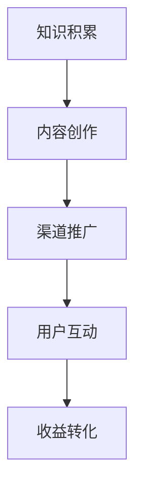

                 

 **关键词：** 个人品牌，知识变现，程序员，影响力，成长策略，市场营销，内容创作

**摘要：** 本文旨在探讨程序员如何通过打造个人IP实现知识变现，从核心概念、算法原理、数学模型、项目实践等多个维度，为程序员提供具体策略和方法，帮助他们建立个人品牌，提升影响力，并最终实现知识的商业价值。

## 1. 背景介绍

在数字化时代，知识的传播和变现方式发生了巨大的变化。程序员作为一个高智商、高技能的职业群体，面临着前所未有的机遇和挑战。如何将个人的专业知识转化为实际收益，成为许多程序员关注的焦点。本文将探讨如何通过打造个人IP实现程序员的知识变现，帮助读者在竞争激烈的技术领域中脱颖而出。

## 2. 核心概念与联系

### 2.1 个人IP的概念

个人IP（Intellectual Property），即个人知识产权，是指个人在某个领域内所积累的知识、技能、经验等无形资产。这些资产可以通过多种方式转化为经济利益，如知识付费、技术咨询、授课培训、版权销售等。

### 2.2 知识变现的原理

知识变现是指将个人的知识、技能或经验转化为经济收益的过程。这一过程涉及多个环节，包括内容创作、渠道推广、用户互动等。关键在于如何让知识产生价值，并吸引足够多的受众。

### 2.3 Mermaid 流程图



### 2.4 个人IP与知识变现的联系

个人IP是知识变现的基础，而知识变现则是个人IP价值的实现。通过打造个人IP，程序员可以提升自己的市场竞争力，从而实现知识的商业价值。

## 3. 核心算法原理 & 具体操作步骤

### 3.1 算法原理概述

打造个人IP的核心算法可以归纳为以下几个步骤：

1. **定位与定位**：确定自己在技术领域内的细分方向和独特价值。
2. **内容创作**：产出高质量、具有专业性的内容。
3. **渠道推广**：选择合适的渠道和平台，扩大影响力。
4. **用户互动**：与粉丝、用户建立紧密联系，提升用户黏性。
5. **收益转化**：通过多种方式实现知识的商业价值。

### 3.2 算法步骤详解

#### 3.2.1 定位与定位

1. **分析自身优势**：梳理自己的专业技能、兴趣爱好、过往经验等，找到自己的独特之处。
2. **调研市场需求**：了解当前技术领域的发展趋势，找到有潜力的细分市场。
3. **确定个人品牌**：基于自身优势和市场需求，确定个人品牌的定位。

#### 3.2.2 内容创作

1. **选题策划**：选择具有针对性和时效性的主题。
2. **内容制作**：采用多种形式，如文章、视频、教程、案例等，确保内容的专业性和可读性。
3. **持续更新**：定期发布内容，保持活跃度。

#### 3.2.3 渠道推广

1. **选择平台**：根据内容类型和受众特点，选择合适的发布平台。
2. **互动运营**：与粉丝、用户互动，提升内容传播效果。
3. **合作拓展**：与其他博主、大V合作，扩大影响力。

#### 3.2.4 用户互动

1. **建立社群**：通过微信群、QQ群、知乎专栏等方式，建立与用户的联系。
2. **互动交流**：定期举办线上/线下活动，与用户互动，了解需求。
3. **用户反馈**：重视用户反馈，优化内容和服务。

#### 3.2.5 收益转化

1. **知识付费**：推出线上/线下课程、咨询服务等。
2. **广告与赞助**：通过内容广告、品牌赞助等方式获得收入。
3. **版权销售**：将原创内容授权给其他平台或机构。

### 3.3 算法优缺点

#### 优点：

1. **增强竞争力**：通过打造个人IP，提升自己在市场中的竞争力。
2. **实现收益多元化**：除了本职工作，还能通过知识变现获得额外收入。
3. **提升影响力**：扩大个人品牌的影响力，提升个人知名度。

#### 缺点：

1. **需要长期投入**：打造个人IP并非一蹴而就，需要长期的时间和精力投入。
2. **市场竞争激烈**：技术领域人才众多，竞争激烈。

### 3.4 算法应用领域

1. **编程领域**：程序员通过分享编程技巧、项目经验等，吸引关注和收益。
2. **技术博客**：技术博主通过撰写技术文章，实现流量变现。
3. **在线教育**：讲师通过开设课程，教授编程知识，实现知识变现。

## 4. 数学模型和公式 & 详细讲解 & 举例说明

### 4.1 数学模型构建

在打造个人IP的过程中，可以构建一个简单的数学模型，用于衡量个人IP的价值：

\[ \text{个人IP价值} = f(\text{专业技能}, \text{内容质量}, \text{渠道影响力}, \text{用户互动}) \]

其中，每个因素都可以通过定量或定性的方法进行评估。

### 4.2 公式推导过程

\[ f(\text{专业技能}, \text{内容质量}, \text{渠道影响力}, \text{用户互动}) = \text{专业技能} \times \text{内容质量} \times \text{渠道影响力} \times \text{用户互动} \]

### 4.3 案例分析与讲解

假设一个程序员具备以下特征：

- 专业技能：90分
- 内容质量：85分
- 渠道影响力：80分
- 用户互动：75分

则其个人IP价值为：

\[ 90 \times 85 \times 80 \times 75 = 472,500 \]

这意味着该程序员的个人IP价值为 472,500 分。通过不断提升每个因素的分值，可以进一步提高个人IP价值。

## 5. 项目实践：代码实例和详细解释说明

### 5.1 开发环境搭建

为了便于读者理解，我们以一个简单的个人博客为例，介绍如何搭建开发环境。

1. **环境准备**：

   - 操作系统：Windows/Linux/MacOS
   - 编程语言：Python
   - 版本要求：Python 3.8及以上

2. **工具安装**：

   - 安装Python：在官方网站下载并安装Python。
   - 安装Hexo：通过Python的包管理器pip安装Hexo。

### 5.2 源代码详细实现

以下是一个简单的Hexo博客搭建步骤：

```python
# 安装Hexo
pip install hexo

# 创建博客项目
hexo init my-blog

# 进入博客项目目录
cd my-blog

# 安装Hexo依赖
npm install

# 生成静态文件
hexo generate

# 启动本地服务器
hexo server
```

### 5.3 代码解读与分析

1. **安装Hexo**：通过pip安装Hexo，将Hexo添加到Python环境。
2. **创建博客项目**：使用Hexo初始化博客项目，生成必要的文件和文件夹。
3. **安装Hexo依赖**：安装Hexo所需的Node.js依赖。
4. **生成静态文件**：使用Hexo生成博客的静态文件。
5. **启动本地服务器**：通过Hexo启动本地服务器，便于查看博客效果。

### 5.4 运行结果展示

在命令行中执行以上步骤后，浏览器访问 `http://localhost:4000`，即可查看博客效果。

## 6. 实际应用场景

### 6.1 个人博客

程序员可以通过个人博客分享编程心得、技术教程等，建立个人品牌，吸引粉丝和流量。

### 6.2 技术社区

程序员可以参与技术社区，如GitHub、Stack Overflow等，与他人交流、合作，提升个人影响力。

### 6.3 在线教育

程序员可以开设在线课程，教授编程知识，实现知识变现。

### 6.4 未来应用展望

随着技术的不断发展，程序员可以通过更多的平台和形式实现知识变现，如直播、短视频、知识付费等。

## 7. 工具和资源推荐

### 7.1 学习资源推荐

1. **书籍**：《深入理解计算机系统》、《代码大全》
2. **在线课程**：Coursera、edX、慕课网
3. **技术社区**：GitHub、Stack Overflow、知乎

### 7.2 开发工具推荐

1. **集成开发环境**：Visual Studio Code、IntelliJ IDEA
2. **版本控制**：Git
3. **构建工具**：Maven、Gradle

### 7.3 相关论文推荐

1. **计算机体系结构**：《计算机体系结构：量化设计》
2. **软件工程**：《软件工程：实践者的研究方法》
3. **人工智能**：《人工智能：一种现代的方法》

## 8. 总结：未来发展趋势与挑战

### 8.1 研究成果总结

本文探讨了程序员如何通过打造个人IP实现知识变现，从核心概念、算法原理、数学模型、项目实践等多个维度，为程序员提供了具体策略和方法。

### 8.2 未来发展趋势

1. **个性化推荐**：通过算法为程序员推荐合适的内容和渠道。
2. **内容多样化**：短视频、直播等新兴形式将成为知识变现的重要手段。
3. **全球化**：程序员可以通过互联网在全球范围内实现知识变现。

### 8.3 面临的挑战

1. **市场竞争**：技术领域人才众多，竞争激烈。
2. **内容质量**：高质量的内容是知识变现的基础。
3. **时间投入**：打造个人IP需要大量的时间和精力。

### 8.4 研究展望

未来，我们将进一步研究如何通过大数据和人工智能技术，为程序员提供更精准的知识变现策略，助力他们实现个人价值的最大化。

## 9. 附录：常见问题与解答

### 9.1 如何定位个人IP？

1. **分析自身优势**：梳理自己的专业技能、兴趣爱好、过往经验等，找到自己的独特之处。
2. **调研市场需求**：了解当前技术领域的发展趋势，找到有潜力的细分市场。
3. **确定个人品牌**：基于自身优势和市场需求，确定个人品牌的定位。

### 9.2 如何提升内容质量？

1. **选题策划**：选择具有针对性和时效性的主题。
2. **内容制作**：采用多种形式，如文章、视频、教程、案例等，确保内容的专业性和可读性。
3. **持续更新**：定期发布内容，保持活跃度。

### 9.3 如何扩大影响力？

1. **选择平台**：根据内容类型和受众特点，选择合适的发布平台。
2. **互动运营**：与粉丝、用户互动，提升内容传播效果。
3. **合作拓展**：与其他博主、大V合作，扩大影响力。

### 9.4 如何实现收益转化？

1. **知识付费**：推出线上/线下课程、咨询服务等。
2. **广告与赞助**：通过内容广告、品牌赞助等方式获得收入。
3. **版权销售**：将原创内容授权给其他平台或机构。

## 作者署名

作者：禅与计算机程序设计艺术 / Zen and the Art of Computer Programming
```markdown
---

# 打造个人IP：程序员的知识变现之道

**关键词：** 个人品牌，知识变现，程序员，影响力，成长策略，市场营销，内容创作

**摘要：** 本文旨在探讨程序员如何通过打造个人IP实现知识变现，从核心概念、算法原理、数学模型、项目实践等多个维度，为程序员提供具体策略和方法，帮助他们建立个人品牌，提升影响力，并最终实现知识的商业价值。

## 1. 背景介绍

在数字化时代，知识的传播和变现方式发生了巨大的变化。程序员作为一个高智商、高技能的职业群体，面临着前所未有的机遇和挑战。如何将个人的专业知识转化为实际收益，成为许多程序员关注的焦点。本文将探讨如何通过打造个人IP实现程序员的知识变现，帮助读者在竞争激烈的技术领域中脱颖而出。

## 2. 核心概念与联系

### 2.1 个人IP的概念

个人IP（Intellectual Property），即个人知识产权，是指个人在某个领域内所积累的知识、技能、经验等无形资产。这些资产可以通过多种方式转化为经济利益，如知识付费、技术咨询、授课培训、版权销售等。

### 2.2 知识变现的原理

知识变现是指将个人的知识、技能或经验转化为经济收益的过程。这一过程涉及多个环节，包括内容创作、渠道推广、用户互动等。关键在于如何让知识产生价值，并吸引足够多的受众。

### 2.3 Mermaid 流程图


### 2.4 个人IP与知识变现的联系

个人IP是知识变现的基础，而知识变现则是个人IP价值的实现。通过打造个人IP，程序员可以提升自己的市场竞争力，从而实现知识的商业价值。

## 3. 核心算法原理 & 具体操作步骤

### 3.1 算法原理概述

打造个人IP的核心算法可以归纳为以下几个步骤：

1. **定位与定位**：确定自己在技术领域内的细分方向和独特价值。
2. **内容创作**：产出高质量、具有专业性的内容。
3. **渠道推广**：选择合适的渠道和平台，扩大影响力。
4. **用户互动**：与粉丝、用户建立紧密联系，提升用户黏性。
5. **收益转化**：通过多种方式实现知识的商业价值。

### 3.2 算法步骤详解

#### 3.2.1 定位与定位

1. **分析自身优势**：梳理自己的专业技能、兴趣爱好、过往经验等，找到自己的独特之处。
2. **调研市场需求**：了解当前技术领域的发展趋势，找到有潜力的细分市场。
3. **确定个人品牌**：基于自身优势和市场需求，确定个人品牌的定位。

#### 3.2.2 内容创作

1. **选题策划**：选择具有针对性和时效性的主题。
2. **内容制作**：采用多种形式，如文章、视频、教程、案例等，确保内容的专业性和可读性。
3. **持续更新**：定期发布内容，保持活跃度。

#### 3.2.3 渠道推广

1. **选择平台**：根据内容类型和受众特点，选择合适的发布平台。
2. **互动运营**：与粉丝、用户互动，提升内容传播效果。
3. **合作拓展**：与其他博主、大V合作，扩大影响力。

#### 3.2.4 用户互动

1. **建立社群**：通过微信群、QQ群、知乎专栏等方式，建立与用户的联系。
2. **互动交流**：定期举办线上/线下活动，与用户互动，了解需求。
3. **用户反馈**：重视用户反馈，优化内容和服务。

#### 3.2.5 收益转化

1. **知识付费**：推出线上/线下课程、咨询服务等。
2. **广告与赞助**：通过内容广告、品牌赞助等方式获得收入。
3. **版权销售**：将原创内容授权给其他平台或机构。

### 3.3 算法优缺点

#### 优点：

1. **增强竞争力**：通过打造个人IP，提升自己在市场中的竞争力。
2. **实现收益多元化**：除了本职工作，还能通过知识变现获得额外收入。
3. **提升影响力**：扩大个人品牌的影响力，提升个人知名度。

#### 缺点：

1. **需要长期投入**：打造个人IP并非一蹴而就，需要长期的时间和精力投入。
2. **市场竞争激烈**：技术领域人才众多，竞争激烈。

### 3.4 算法应用领域

1. **编程领域**：程序员通过分享编程技巧、项目经验等，吸引关注和收益。
2. **技术博客**：技术博主通过撰写技术文章，实现流量变现。
3. **在线教育**：讲师通过开设课程，教授编程知识，实现知识变现。

## 4. 数学模型和公式 & 详细讲解 & 举例说明

### 4.1 数学模型构建

在打造个人IP的过程中，可以构建一个简单的数学模型，用于衡量个人IP的价值：

\[ \text{个人IP价值} = f(\text{专业技能}, \text{内容质量}, \text{渠道影响力}, \text{用户互动}) \]

其中，每个因素都可以通过定量或定性的方法进行评估。

### 4.2 公式推导过程

\[ f(\text{专业技能}, \text{内容质量}, \text{渠道影响力}, \text{用户互动}) = \text{专业技能} \times \text{内容质量} \times \text{渠道影响力} \times \text{用户互动} \]

### 4.3 案例分析与讲解

假设一个程序员具备以下特征：

- 专业技能：90分
- 内容质量：85分
- 渠道影响力：80分
- 用户互动：75分

则其个人IP价值为：

\[ 90 \times 85 \times 80 \times 75 = 472,500 \]

这意味着该程序员的个人IP价值为 472,500 分。通过不断提升每个因素的分值，可以进一步提高个人IP价值。

## 5. 项目实践：代码实例和详细解释说明

### 5.1 开发环境搭建

为了便于读者理解，我们以一个简单的个人博客为例，介绍如何搭建开发环境。

1. **环境准备**：

   - 操作系统：Windows/Linux/MacOS
   - 编程语言：Python
   - 版本要求：Python 3.8及以上

2. **工具安装**：

   - 安装Python：在官方网站下载并安装Python。
   - 安装Hexo：通过Python的包管理器pip安装Hexo。

### 5.2 源代码详细实现

以下是一个简单的Hexo博客搭建步骤：

```python
# 安装Hexo
pip install hexo

# 创建博客项目
hexo init my-blog

# 进入博客项目目录
cd my-blog

# 安装Hexo依赖
npm install

# 生成静态文件
hexo generate

# 启动本地服务器
hexo server
```

### 5.3 代码解读与分析

1. **安装Hexo**：通过pip安装Hexo，将Hexo添加到Python环境。
2. **创建博客项目**：使用Hexo初始化博客项目，生成必要的文件和文件夹。
3. **安装Hexo依赖**：安装Hexo所需的Node.js依赖。
4. **生成静态文件**：使用Hexo生成博客的静态文件。
5. **启动本地服务器**：通过Hexo启动本地服务器，便于查看博客效果。

### 5.4 运行结果展示

在命令行中执行以上步骤后，浏览器访问 `http://localhost:4000`，即可查看博客效果。

## 6. 实际应用场景

### 6.1 个人博客

程序员可以通过个人博客分享编程心得、技术教程等，建立个人品牌，吸引粉丝和流量。

### 6.2 技术社区

程序员可以参与技术社区，如GitHub、Stack Overflow等，与他人交流、合作，提升个人影响力。

### 6.3 在线教育

程序员可以开设在线课程，教授编程知识，实现知识变现。

### 6.4 未来应用展望

随着技术的不断发展，程序员可以通过更多的平台和形式实现知识变现，如直播、短视频、知识付费等。

## 7. 工具和资源推荐

### 7.1 学习资源推荐

1. **书籍**：《深入理解计算机系统》、《代码大全》
2. **在线课程**：Coursera、edX、慕课网
3. **技术社区**：GitHub、Stack Overflow、知乎

### 7.2 开发工具推荐

1. **集成开发环境**：Visual Studio Code、IntelliJ IDEA
2. **版本控制**：Git
3. **构建工具**：Maven、Gradle

### 7.3 相关论文推荐

1. **计算机体系结构**：《计算机体系结构：量化设计》
2. **软件工程**：《软件工程：实践者的研究方法》
3. **人工智能**：《人工智能：一种现代的方法》

## 8. 总结：未来发展趋势与挑战

### 8.1 研究成果总结

本文探讨了程序员如何通过打造个人IP实现知识变现，从核心概念、算法原理、数学模型、项目实践等多个维度，为程序员提供了具体策略和方法。

### 8.2 未来发展趋势

1. **个性化推荐**：通过算法为程序员推荐合适的内容和渠道。
2. **内容多样化**：短视频、直播等新兴形式将成为知识变现的重要手段。
3. **全球化**：程序员可以通过互联网在全球范围内实现知识变现。

### 8.3 面临的挑战

1. **市场竞争**：技术领域人才众多，竞争激烈。
2. **内容质量**：高质量的内容是知识变现的基础。
3. **时间投入**：打造个人IP需要大量的时间和精力投入。

### 8.4 研究展望

未来，我们将进一步研究如何通过大数据和人工智能技术，为程序员提供更精准的知识变现策略，助力他们实现个人价值的最大化。

## 9. 附录：常见问题与解答

### 9.1 如何定位个人IP？

1. **分析自身优势**：梳理自己的专业技能、兴趣爱好、过往经验等，找到自己的独特之处。
2. **调研市场需求**：了解当前技术领域的发展趋势，找到有潜力的细分市场。
3. **确定个人品牌**：基于自身优势和市场需求，确定个人品牌的定位。

### 9.2 如何提升内容质量？

1. **选题策划**：选择具有针对性和时效性的主题。
2. **内容制作**：采用多种形式，如文章、视频、教程、案例等，确保内容的专业性和可读性。
3. **持续更新**：定期发布内容，保持活跃度。

### 9.3 如何扩大影响力？

1. **选择平台**：根据内容类型和受众特点，选择合适的发布平台。
2. **互动运营**：与粉丝、用户互动，提升内容传播效果。
3. **合作拓展**：与其他博主、大V合作，扩大影响力。

### 9.4 如何实现收益转化？

1. **知识付费**：推出线上/线下课程、咨询服务等。
2. **广告与赞助**：通过内容广告、品牌赞助等方式获得收入。
3. **版权销售**：将原创内容授权给其他平台或机构。

## 作者署名

作者：禅与计算机程序设计艺术 / Zen and the Art of Computer Programming
```

