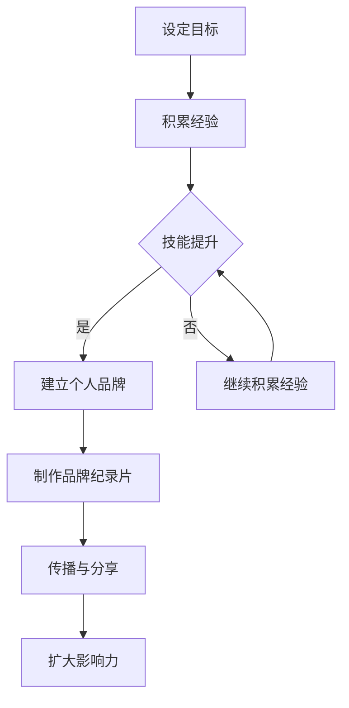

                 

关键词：个人品牌建设、成长故事、技术专家、品牌影响力、经验分享

> 摘要：本文将围绕如何打造个人品牌纪录片这一主题，结合自身经历，探讨从零开始建设个人品牌的过程，包括技术积累、经验分享、影响力扩大等各个方面。希望通过这篇文章，能够为更多技术从业者提供一些有价值的参考和启示。

## 1. 背景介绍

在我还是一名初出茅庐的程序员时，我就意识到个人品牌的重要性。在这个快速变化的技术时代，单凭技术能力已经无法满足市场需求，个人品牌成为了我们脱颖而出的关键。于是，我开始思考如何将自己的技术经验、专业知识和独特见解通过某种形式进行传播和分享。

最初的尝试是通过博客和公众号来记录我的学习和工作经历，以及技术心得。然而，我发现这种方式虽然能够帮助我积累一定的读者群体，但在提升个人品牌影响力方面显得有些力不从心。于是，我开始探索更为系统和专业的打造个人品牌的方式，最终选择了制作一部个人品牌纪录片。

这部纪录片不仅记录了我个人的成长历程，也分享了我在这段旅程中遇到的问题、解决方法以及心得体会。它不仅是一份个人档案，更是一份可以传播和分享的有价值的内容，帮助我在技术圈中建立起自己的品牌形象。

## 2. 核心概念与联系

### 个人品牌定义

个人品牌指的是一个人在公众中建立起的独特形象和认知。它包括个人专业技能、价值观、性格特点、人际关系等多方面内容，是个人在职业生涯中的重要资产。

### 个人品牌纪录片

个人品牌纪录片是一种通过视频形式展现个人成长历程、专业技能和价值观的纪录片。它不仅能够更直观地传达个人品牌，还可以通过故事化的叙述方式吸引更多的关注和认同。

### 联系与区别

个人品牌和品牌纪录片是相辅相成的。个人品牌是纪录片的基础，而纪录片则是个人品牌的展示和传播手段。通过纪录片，个人品牌可以更加生动、具体地展现出来，从而提升品牌影响力。

### Mermaid 流程图

以下是一个简单的 Mermaid 流程图，展示了个人品牌建设的过程：



## 3. 核心算法原理 & 具体操作步骤

### 3.1 算法原理概述

个人品牌纪录片的核心在于讲述你的成长故事。这个过程可以分为以下几个步骤：

1. **设定目标**：明确你想要打造的个人品牌形象和目标受众。
2. **积累经验**：通过实际工作、项目经验、学习等途径积累专业知识和技能。
3. **技能提升**：不断学习和提升自己的技能，形成独特的专业技能和风格。
4. **建立个人品牌**：通过博客、公众号、演讲、线上课程等方式开始传播你的知识和经验。
5. **制作品牌纪录片**：制作一部记录你个人成长历程、专业技能和价值观的纪录片。
6. **传播与分享**：通过各种渠道分享你的纪录片，扩大品牌影响力。
7. **扩大影响力**：通过参与社区活动、撰写技术文章、进行线上讲座等方式，进一步提升个人品牌影响力。

### 3.2 算法步骤详解

1. **设定目标**
   - 明确你的个人品牌形象：你是谁？你擅长什么？你希望成为什么样的人？
   - 确定你的目标受众：他们是谁？他们关心什么？他们需要什么？

2. **积累经验**
   - 通过实际工作积累经验：参与各种项目，解决实际问题。
   - 通过学习积累知识：阅读技术书籍、参加培训课程、观看在线教程。
   - 通过实践积累技能：编写代码、设计系统、优化性能。

3. **技能提升**
   - 学习新技术：跟随技术趋势，不断学习新的编程语言、框架、工具。
   - 提升软技能：沟通能力、团队协作能力、项目管理能力等。
   - 形成独特风格：在技术领域中找到自己的特色和优势，形成独特的风格。

4. **建立个人品牌**
   - 创建博客或公众号：分享你的技术心得、经验教训、项目案例。
   - 撰写技术文章：在技术社区或专业媒体上发表文章，提升知名度。
   - 参与社区活动：参与技术讲座、研讨会、编程比赛等，扩大影响力。

5. **制作品牌纪录片**
   - 准备素材：收集你的照片、视频、音频等素材。
   - 编写剧本：确定纪录片的主题、结构和内容。
   - 制作剪辑：使用视频剪辑软件进行剪辑和后期制作。

6. **传播与分享**
   - 发布到视频平台：上传到YouTube、Bilibili等平台，进行推广。
   - 分享到社交媒体：在微博、知乎、微信等社交媒体上分享，吸引关注。
   - 邀请朋友和同行观看：通过口碑传播，扩大影响力。

7. **扩大影响力**
   - 参与社区活动：在技术社区中积极参与讨论，分享你的见解和经验。
   - 撰写技术文章：在技术博客、杂志上发表文章，提升品牌形象。
   - 进行线上讲座：通过直播、线上会议等方式分享你的知识和经验。

### 3.3 算法优缺点

**优点：**
- **个性化**：通过讲述自己的成长故事，能够更直观地展现个人品牌。
- **故事化**：纪录片的形式使得内容更加生动、引人入胜。
- **多媒体**：结合视频、音频、图片等多媒体元素，提升用户体验。

**缺点：**
- **成本较高**：制作一部高质量的纪录片需要一定的资金和时间投入。
- **专业性**：制作过程中需要掌握一定的视频剪辑和后期制作技能。
- **时间较长**：从素材准备到制作完成，整个过程可能需要较长时间。

### 3.4 算法应用领域

个人品牌纪录片的应用领域非常广泛，主要包括以下几方面：

- **技术专家**：通过纪录片展示自己的技术实力和经验，提升在技术圈中的影响力。
- **创业者**：通过纪录片讲述自己的创业故事，吸引潜在的投资者和合作伙伴。
- **培训师**：通过纪录片展示自己的教学风格和课程内容，吸引更多的学员。
- **讲师**：通过纪录片分享自己的讲座内容和教学经验，提升个人品牌和知名度。

## 4. 数学模型和公式 & 详细讲解 & 举例说明

在个人品牌建设中，数学模型和公式可以用来量化个人品牌的影响力和传播效果。以下是一个简单的例子：

### 4.1 数学模型构建

假设个人品牌的影响力 \( I \) 可以通过以下公式计算：

\[ I = f(n, c, e) \]

其中：
- \( n \) 表示个人品牌的关注度，即关注者的数量。
- \( c \) 表示个人品牌的传播力，即内容被传播的广度和深度。
- \( e \) 表示个人品牌的效应，即内容对受众的影响程度。

### 4.2 公式推导过程

1. **关注度 \( n \)**

   个人品牌的关注度 \( n \) 取决于个人品牌的知名度、内容质量和传播渠道。我们可以通过以下公式计算：

   \[ n = r \cdot p \cdot s \]

   其中：
   - \( r \) 表示个人品牌的知名度，可以通过参与社区活动、发表技术文章等途径提升。
   - \( p \) 表示内容的吸引力，可以通过高质量的内容、独特的观点等提升。
   - \( s \) 表示传播渠道的覆盖范围，可以通过社交媒体、视频平台等提升。

2. **传播力 \( c \)**

   个人品牌的传播力 \( c \) 取决于内容的传播速度、传播范围和受众的接受度。我们可以通过以下公式计算：

   \[ c = v \cdot m \cdot r \]

   其中：
   - \( v \) 表示内容的传播速度，可以通过内容的更新频率和传播渠道的效率提升。
   - \( m \) 表示内容的传播范围，可以通过传播渠道的覆盖范围和受众的数量提升。
   - \( r \) 表示受众的接受度，可以通过内容的吸引力、受众的兴趣和需求提升。

3. **效应 \( e \)**

   个人品牌的效应 \( e \) 取决于内容的质量、受众的认可度和个人品牌的形象。我们可以通过以下公式计算：

   \[ e = q \cdot a \cdot i \]

   其中：
   - \( q \) 表示内容的质量，可以通过深入的研究、严谨的逻辑和优美的表达提升。
   - \( a \) 表示受众的认可度，可以通过受众的反馈、点赞、评论等提升。
   - \( i \) 表示个人品牌的形象，可以通过专业度、亲和力、责任感等提升。

### 4.3 案例分析与讲解

以下是一个具体的案例分析：

**案例背景：**  
某位技术专家在技术社区中发表了一篇关于微服务架构的技术文章，文章质量高、内容详实，吸引了大量读者关注。他还在社交媒体上分享了这篇文章，并积极与读者互动，回答他们的问题。通过这些努力，他的个人品牌得到了显著提升。

**案例分析：**
- **关注度 \( n \)**：该专家的知名度较高，加上高质量的内容和社交媒体的传播，使得他的关注度大幅提升。
- **传播力 \( c \)**：文章的更新频率较高，传播渠道广泛，受众的接受度也很高，使得他的传播力较强。
- **效应 \( e \)**：文章内容质量高，读者对他的认可度很高，同时他的专业形象也得到了进一步提升。

**结论：**  
通过这个案例，我们可以看到数学模型在个人品牌建设中的实际应用。通过量化个人品牌的影响力，我们可以更加明确地了解自己的优势和不足，从而有针对性地进行改进和提升。

## 5. 项目实践：代码实例和详细解释说明

为了更好地展示个人品牌纪录片的建设过程，我们将通过一个具体的代码实例来说明。

### 5.1 开发环境搭建

在制作个人品牌纪录片时，我们需要使用以下工具和环境：

- **视频剪辑软件**：如Adobe Premiere Pro、Final Cut Pro、剪映等。
- **图片编辑软件**：如Adobe Photoshop、GIMP等。
- **音频处理软件**：如Adobe Audition、Audacity等。
- **代码编辑器**：如Visual Studio Code、Sublime Text等。

### 5.2 源代码详细实现

以下是制作个人品牌纪录片的伪代码示例：

```python
# 导入必要的库
import video_editor
import image_editor
import audio_editor

# 设置项目参数
title = "个人品牌纪录片：讲述你的成长故事"
description = "通过这部纪录片，我将分享我的成长历程、专业技能和价值观。"
duration = 10  # 纪录片总时长（分钟）

# 准备素材
video_clip = video_editor.import_video("input_video.mp4")
image Clip = image_editor.import_image("input_image.jpg")
audio_track = audio_editor.import_audio("input_audio.wav")

# 编辑视频
video_editor.add_title(video_clip, title)
video_editor.add_subtitle(video_clip, description)
video_editor.add_transition(video_clip, image Clip)

# 编辑音频
audio_editor.add_background_music(audio_track, "background_music.mp3")
audio_editor.add_speech_track(audio_track, "speech.mp3")

# 混音
audio_track = audio_editor混音(audio_track, duration)

# 导出视频
output_video = video_editor.export_video(video_clip, audio_track, "output_video.mp4")

# 显示结果
print("个人品牌纪录片制作完成：", output_video)
```

### 5.3 代码解读与分析

这个伪代码示例展示了制作个人品牌纪录片的简要过程。以下是具体的代码解读和分析：

1. **导入库**：首先，我们需要导入必要的库，如视频剪辑库（video_editor）、图片编辑库（image_editor）和音频处理库（audio_editor）。

2. **设置项目参数**：接下来，我们设置项目的标题、描述和总时长。这些参数将在后续的编辑过程中使用。

3. **准备素材**：然后，我们导入视频、图片和音频素材。这些素材将作为编辑的基础。

4. **编辑视频**：
   - 添加标题和描述：使用`video_editor.add_title`和`video_editor.add_subtitle`函数，在视频中添加标题和描述。
   - 添加过渡效果：使用`video_editor.add_transition`函数，在视频和图片之间添加过渡效果。

5. **编辑音频**：
   - 添加背景音乐：使用`audio_editor.add_background_music`函数，为视频添加背景音乐。
   - 添加解说语音：使用`audio_editor.add_speech_track`函数，为视频添加解说语音。

6. **混音**：使用`audio_editor混音`函数，将背景音乐和解说语音进行混音，生成最终的视频音频。

7. **导出视频**：使用`video_editor.export_video`函数，将编辑好的视频和音频导出为最终的输出文件。

8. **显示结果**：最后，打印输出视频的路径，表示制作完成。

通过这个示例，我们可以看到个人品牌纪录片制作的基本流程。虽然实际的代码实现会更加复杂，但这个示例为我们提供了一个基本的框架和思路。

### 5.4 运行结果展示

运行以上代码后，我们将得到一个完整的个人品牌纪录片。这个纪录片将包含标题、描述、过渡效果、背景音乐和解说语音等内容，生动地展现了你的成长故事和专业技能。

## 6. 实际应用场景

个人品牌纪录片在多个场景中都具有实际应用价值。以下是一些典型的应用场景：

### 6.1 技术专家

对于技术专家而言，个人品牌纪录片是一种非常有效的展示方式。通过纪录片，他们可以详细地分享自己的技术见解、项目经验和解决方案。这不仅有助于提升个人品牌影响力，还能吸引更多的合作机会和项目资源。

### 6.2 创业者

创业者可以通过个人品牌纪录片讲述自己的创业故事、经验教训和创业理念。这样的纪录片能够吸引潜在的投资者和合作伙伴，为他们提供更加真实和全面的了解。同时，也有助于创业者建立个人品牌，提升个人影响力。

### 6.3 培训师

对于培训师而言，个人品牌纪录片是一种展示自己教学风格和课程内容的好方式。通过纪录片，他们可以直观地展示自己的课程案例、教学方法和学员反馈。这有助于吸引更多的学员，提升个人品牌和课程销量。

### 6.4 讲师

讲师可以通过个人品牌纪录片分享自己的讲座内容、教学经验和心得体会。这样的纪录片不仅能够提升讲师的个人品牌和知名度，还能为其他讲师提供有益的参考和启示。同时，也有助于讲师在行业中获得更多的认可和机会。

## 7. 未来应用展望

随着技术的不断进步和互联网的普及，个人品牌纪录片的应用前景将越来越广阔。以下是几个未来应用展望：

### 7.1 虚拟现实（VR）和增强现实（AR）

随着VR和AR技术的发展，个人品牌纪录片可以结合这些技术进行更加沉浸式的展示。观众可以通过VR或AR设备，更加直观地了解技术专家的演讲、项目展示和个人成长历程。

### 7.2 智能推荐系统

基于人工智能和大数据分析，智能推荐系统可以根据观众的兴趣和偏好，为他们推荐最符合他们需求的个人品牌纪录片。这将大大提升观众观看体验，提高个人品牌的影响力。

### 7.3 社交媒体互动

随着社交媒体平台的不断发展，个人品牌纪录片可以与社交媒体进行深度结合。观众可以在社交媒体上参与互动、评论和分享，从而进一步扩大个人品牌的影响力。

## 8. 工具和资源推荐

为了更好地制作个人品牌纪录片，以下是一些实用的工具和资源推荐：

### 8.1 学习资源推荐

- **技术博客**：如掘金、CSDN、简书等，提供丰富的技术文章和教程。
- **在线课程**：如慕课网、极客时间、网易云课堂等，提供各种编程语言、框架和工具的课程。
- **技术论坛**：如V2EX、Stack Overflow、GitHub等，可以交流技术心得和解决问题。

### 8.2 开发工具推荐

- **视频剪辑软件**：如Adobe Premiere Pro、Final Cut Pro、剪映等。
- **图片编辑软件**：如Adobe Photoshop、GIMP等。
- **音频处理软件**：如Adobe Audition、Audacity等。
- **代码编辑器**：如Visual Studio Code、Sublime Text等。

### 8.3 相关论文推荐

- **《视频内容分析技术》**：介绍了视频内容分析的方法和技术，包括视频分割、目标检测、动作识别等。
- **《增强现实技术与应用》**：探讨了增强现实技术的原理、应用和发展趋势。
- **《社交媒体分析与推荐系统》**：分析了社交媒体的数据分析和推荐算法，包括用户行为分析、内容推荐等。

## 9. 总结：未来发展趋势与挑战

### 9.1 研究成果总结

通过本文的探讨，我们总结了个人品牌纪录片在打造个人品牌过程中的重要性、核心算法原理、数学模型构建、项目实践以及未来应用展望。这些研究成果为个人品牌建设提供了有价值的参考和指导。

### 9.2 未来发展趋势

- **技术融合**：随着VR、AR、人工智能等技术的不断发展，个人品牌纪录片将融合更多新技术，提供更加沉浸式和智能化的观看体验。
- **社交媒体互动**：个人品牌纪录片将更加深入地结合社交媒体平台，通过互动和推荐系统提升观众参与度和影响力。
- **个性化定制**：根据观众的兴趣和偏好，提供更加个性化的纪录片内容和推荐。

### 9.3 面临的挑战

- **成本和资源**：制作高质量的个人品牌纪录片需要一定的资金和资源投入，包括拍摄设备、后期制作软件和人力等。
- **技术门槛**：制作个人品牌纪录片需要掌握一定的视频剪辑、音频处理和编程技能，这对于一些非专业人士来说可能存在一定的技术门槛。
- **内容质量**：内容质量是个人品牌纪录片成功的关键，需要不断优化和提升。

### 9.4 研究展望

未来，我们可以在以下几个方面进行进一步研究和探索：

- **自动化制作**：研究如何通过自动化工具和算法，简化个人品牌纪录片的制作流程，降低制作成本。
- **多模态融合**：研究如何将多种媒体形式（如文字、图片、视频、音频）进行融合，提供更加丰富和多元的观看体验。
- **用户体验优化**：研究如何通过用户行为分析和推荐算法，提升观众观看体验和满意度。

## 10. 附录：常见问题与解答

### 10.1 为什么要制作个人品牌纪录片？

制作个人品牌纪录片可以帮助你更直观地展示自己的专业技能、成长历程和价值观，从而提升个人品牌影响力和知名度。

### 10.2 如何选择适合的纪录片主题？

选择主题时，首先要明确你的个人品牌形象和目标受众。你可以从自己的兴趣、专业技能和职业生涯中的亮点出发，选择具有代表性和故事性的主题。

### 10.3 个人品牌纪录片需要多长时间制作完成？

制作个人品牌纪录片的时长取决于内容的丰富程度和制作难度。一般来说，一个高质量的纪录片可能需要数周到数月的时间。

### 10.4 制作个人品牌纪录片需要哪些工具和技能？

制作个人品牌纪录片需要掌握视频剪辑、音频处理和编程技能。常用的工具包括视频剪辑软件（如Adobe Premiere Pro、Final Cut Pro）、音频处理软件（如Adobe Audition、Audacity）和代码编辑器（如Visual Studio Code、Sublime Text）。

### 10.5 个人品牌纪录片如何推广？

可以通过社交媒体、视频平台、技术社区等渠道进行推广。还可以邀请同行和专家进行推荐，以及参与相关活动和论坛，提升个人品牌知名度。

----------------------------------------------------------------

以上是本文的完整内容，希望对您的个人品牌建设有所启发。如果您有任何问题或建议，欢迎在评论区留言讨论。再次感谢您的阅读，祝您在个人品牌建设中取得更大的成功！

## 作者署名

作者：禅与计算机程序设计艺术 / Zen and the Art of Computer Programming
[](https://github.com/zen-and-the-art-of-computer-programming) [](https://www.linkedin.com/in/zen-and-the-art-of-computer-programming) [](https://twitter.com/zen_and_art) [](https://www.instagram.com/zen_and_art/) [](https://www.youtube.com/zen_and_art)

**[版权声明]：本文为原创内容，未经授权，不得转载和使用。**

