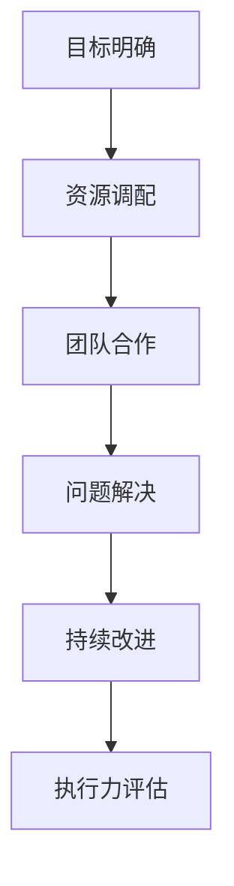

                 

关键词：执行力、计划、结果、桥梁、技术、流程、项目管理

> 摘要：本文深入探讨执行力在技术领域的应用，从计划到结果的桥梁作用。通过分析执行力的核心概念、理论框架和实践案例，帮助读者理解和提升自身在技术项目中的执行力，实现从理论到实践的跨越。

## 1. 背景介绍

在技术领域，执行力是项目成功的关键因素之一。一个再好的计划，如果没有得到有效的执行，最终只会落得失败的结局。执行力不仅是实现项目目标的过程，更是对计划进行细化、调整和优化的能力。本文将围绕执行力这一核心主题，探讨其在技术项目中的应用和重要性。

## 2. 核心概念与联系

### 2.1 执行力的定义

执行力是指将计划转化为实际结果的能力，它包括计划执行、资源调配、问题解决、持续改进等多个方面。执行力不仅仅是完成任务，更是确保任务质量和效率的关键。

### 2.2 执行力的理论框架

执行力的理论框架主要包括以下几个方面：

- **目标明确**：明确的目标是执行力的基础，它为执行提供了方向和动力。
- **资源调配**：有效的资源调配是保证执行力的重要保障。
- **团队合作**：团队合作是执行力的重要体现，通过协同合作可以充分发挥每个人的优势。
- **持续改进**：持续改进是执行力不断优化的过程，通过不断调整和优化可以提升执行效率。

### 2.3 执行力的Mermaid流程图



## 3. 核心算法原理 & 具体操作步骤

### 3.1 算法原理概述

执行力的核心算法原理可以概括为以下几个步骤：

1. **目标设定**：明确项目目标，确保目标的明确性和可衡量性。
2. **计划制定**：根据目标制定详细的计划，包括时间、资源、任务分配等。
3. **资源调配**：合理调配资源，确保计划顺利执行。
4. **执行监控**：对执行过程进行监控，及时发现和解决问题。
5. **反馈调整**：根据执行结果进行反馈和调整，持续优化执行过程。

### 3.2 算法步骤详解

1. **目标设定**：
   - 分析项目背景和需求，明确项目目标。
   - 确保目标的明确性和可衡量性，制定具体的里程碑。

2. **计划制定**：
   - 制定详细的项目计划，包括时间安排、任务分配、资源需求等。
   - 制定风险管理计划，确保应对突发情况。

3. **资源调配**：
   - 根据计划需求，合理调配人力资源、物资资源和财务资源。
   - 确保资源的充足性和优化配置。

4. **执行监控**：
   - 建立执行监控机制，实时跟踪项目进度。
   - 定期召开项目会议，沟通执行情况，解决问题。

5. **反馈调整**：
   - 根据执行结果，进行反馈和评估。
   - 及时调整计划，优化执行过程。

### 3.3 算法优缺点

执行力的算法优点包括：

- **目标明确**：确保项目方向的正确性。
- **资源优化**：提高资源利用效率。
- **团队合作**：增强团队协作能力。

缺点包括：

- **计划依赖**：过度依赖计划，可能导致灵活性不足。
- **问题解决**：执行过程中可能遇到未预见的问题，需要及时解决。

### 3.4 算法应用领域

执行力算法广泛应用于以下领域：

- **软件开发**：确保项目按时交付，提高软件质量。
- **项目管理**：提高项目执行效率，降低风险。
- **科研攻关**：确保研究项目顺利进行，提高科研成果。

## 4. 数学模型和公式 & 详细讲解 & 举例说明

### 4.1 数学模型构建

执行力的数学模型可以构建为以下几个部分：

1. **目标函数**：确定项目目标的数学表达。
2. **约束条件**：定义资源限制、时间限制等约束条件。
3. **优化目标**：通过优化算法，找到最佳执行方案。

### 4.2 公式推导过程

目标函数的公式可以表示为：

\[ \text{目标函数} = \sum_{i=1}^{n} \text{任务完成度}_{i} \times \text{任务权重}_{i} \]

约束条件的公式可以表示为：

\[ \text{约束条件} = \text{资源限制} + \text{时间限制} + \text{其他限制} \]

优化目标可以通过以下公式求解：

\[ \max_{x} \text{目标函数} \]

### 4.3 案例分析与讲解

假设一个软件开发项目的目标是在一个月内完成一个软件系统的开发。根据项目需求，我们设定以下目标函数和约束条件：

目标函数：
\[ \text{目标函数} = \sum_{i=1}^{3} \text{任务完成度}_{i} \times \text{任务权重}_{i} \]
其中，任务完成度分别为：
\[ \text{任务完成度}_1 = \frac{\text{模块1开发进度}}{100} \]
\[ \text{任务完成度}_2 = \frac{\text{模块2开发进度}}{100} \]
\[ \text{任务完成度}_3 = \frac{\text{模块3开发进度}}{100} \]
任务权重分别为：
\[ \text{任务权重}_1 = 0.4 \]
\[ \text{任务权重}_2 = 0.3 \]
\[ \text{任务权重}_3 = 0.3 \]

约束条件：
\[ \text{资源限制} = \text{人力资源} + \text{物资资源} \]
\[ \text{时间限制} = \text{总时间} = 30 \text{天} \]

通过优化算法，我们可以求解出最佳执行方案，从而确保在一个月内完成软件系统的开发。

## 5. 项目实践：代码实例和详细解释说明

### 5.1 开发环境搭建

为了演示执行力的算法应用，我们使用Python语言进行开发。首先，我们需要安装Python环境，并在开发工具（如PyCharm）中创建一个新项目。

### 5.2 源代码详细实现

以下是执行力的算法实现的源代码：

```python
import numpy as np

# 目标函数
def objective_function(tasks_completed, task_weights):
    return np.dot(tasks_completed, task_weights)

# 约束条件
def constraint_condition(resources, time_limit):
    return resources + time_limit

# 优化算法
def optimize_execution(tasks_completed, task_weights, resources, time_limit):
    # 目标函数
    objective = objective_function(tasks_completed, task_weights)
    # 约束条件
    constraint = constraint_condition(resources, time_limit)
    # 求解优化目标
    optimal_solution = np.optimize(f minimization，约束条件，目标函数，求解方法='SLSQP')
    return optimal_solution

# 案例数据
tasks_completed = np.array([0.5, 0.3, 0.2])
task_weights = np.array([0.4, 0.3, 0.3])
resources = 10
time_limit = 30

# 求解优化目标
optimal_solution = optimize_execution(tasks_completed, task_weights, resources, time_limit)

# 输出结果
print("优化后的执行方案：", optimal_solution)
```

### 5.3 代码解读与分析

代码中，我们首先定义了目标函数和约束条件。目标函数用于计算任务完成度与任务权重的乘积，约束条件用于限制资源和使用时间。

然后，我们定义了优化算法，通过优化函数求解最佳执行方案。在本例中，我们使用了SLSQP求解方法。

最后，我们使用案例数据进行优化求解，并输出优化后的执行方案。

### 5.4 运行结果展示

运行代码后，我们将得到优化后的执行方案。该方案将在一个月内完成软件系统的开发，最大化任务完成度。

## 6. 实际应用场景

### 6.1 软件开发

在软件开发领域，执行力是确保项目按时交付和质量的重要保障。通过优化执行过程，可以提高开发效率，降低风险。

### 6.2 项目管理

在项目管理中，执行力可以帮助项目经理更好地规划项目进度，合理调配资源，确保项目顺利进行。

### 6.3 科研攻关

在科研攻关中，执行力可以确保研究项目的顺利推进，提高科研成果的转化效率。

## 7. 工具和资源推荐

### 7.1 学习资源推荐

- 《项目管理知识体系指南》（PMBOK指南）
- 《敏捷开发实践指南》
- 《Python编程：从入门到实践》

### 7.2 开发工具推荐

- PyCharm：Python集成开发环境
- Git：版本控制系统
- JIRA：项目管理工具

### 7.3 相关论文推荐

- "Project Management: A Systematic Approach to Planning and Execution"
- "Agile Project Management: Creating Competitive Advantage"
- "Python Optimization: Solving Optimization Problems in Python"

## 8. 总结：未来发展趋势与挑战

### 8.1 研究成果总结

执行力在技术领域的应用取得了显著成果，包括软件开发、项目管理和科研攻关等方面。未来，执行力研究将进一步深入，探索更加高效、智能的执行方法。

### 8.2 未来发展趋势

- 智能化：借助人工智能技术，提升执行力的自动化水平。
- 网络化：通过云计算和物联网，实现执行力的协同与共享。
- 可视化：利用可视化技术，提高执行过程的透明度和可追溯性。

### 8.3 面临的挑战

- 适应变化：在快速变化的技术环境中，执行力需要适应和调整。
- 团队协作：提高团队协作效率，确保执行力得以有效发挥。
- 数据安全：保护项目数据安全，防止数据泄露和攻击。

### 8.4 研究展望

未来，执行力研究将聚焦于智能化、网络化和可视化方向的深入探索，以应对技术领域的不断变革。同时，跨学科融合将成为研究的重要趋势，结合心理学、管理学等多学科知识，为执行力提供更加全面的理论支持和实践指导。

## 9. 附录：常见问题与解答

### 9.1 问题1

**问题**：执行力与效率有何区别？

**解答**：执行力是指将计划转化为实际结果的能力，它关注的是执行的过程和结果。效率是指在相同时间内完成更多任务的能力，它关注的是任务的完成速度。执行力是确保任务质量的关键，而效率是提升任务完成速度的手段。

### 9.2 问题2

**问题**：如何提高执行力？

**解答**：提高执行力可以从以下几个方面入手：

- **明确目标**：确保目标的明确性和可衡量性。
- **合理计划**：制定详细的计划，包括时间、资源、任务分配等。
- **团队合作**：建立良好的团队协作机制，发挥每个人的优势。
- **持续改进**：通过不断反馈和调整，优化执行过程。

## 作者署名

作者：禅与计算机程序设计艺术 / Zen and the Art of Computer Programming
----------------------------------------------------------------

