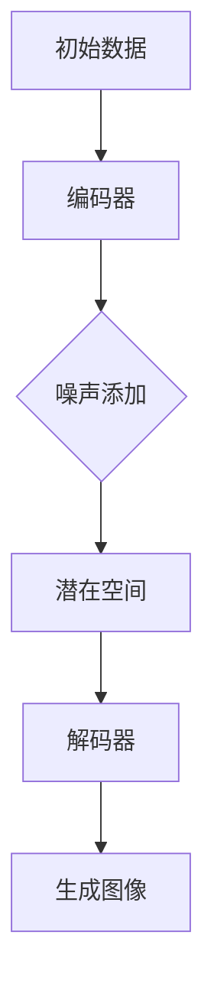

                 

关键词：扩散模型、图像生成、AI技术、深度学习、机器学习、计算机图形学、算法原理、应用场景、未来展望。

> 摘要：本文将深入探讨扩散模型，一种革命性的图像生成技术。我们将从背景介绍、核心概念、算法原理、数学模型、项目实践、应用场景、工具推荐以及未来展望等方面全面解析这一技术，为读者提供一幅清晰的认识图景。

## 1. 背景介绍

图像生成技术在计算机科学和人工智能领域具有悠久的历史。从最初的随机像素生成，到基于规则的系统，再到现代的生成对抗网络（GAN）和变分自编码器（VAE），图像生成技术不断演进。然而，这些方法在生成图像的多样性和细节方面仍存在一定的局限性。

扩散模型（Diffusion Model）作为一种新兴的图像生成技术，源于物理扩散过程的灵感。这种模型通过模拟物质在空间中的扩散过程，能够生成高质量且具有多样性的图像。扩散模型的提出，不仅为图像生成领域带来了新的思路，也为解决诸如文本到图像生成、视频生成等复杂问题提供了可能性。

## 2. 核心概念与联系

### 2.1 扩散模型的核心概念

扩散模型的核心概念包括两个主要过程：噪声添加和噪声消除。

- **噪声添加**：在训练过程中，模型逐渐将数据中的真实信号混合进随机噪声中。这个过程类似于物质在空间中的扩散，逐渐模糊了数据的特征。
- **噪声消除**：在生成过程中，模型通过对抗性训练逐步消除图像中的噪声，恢复出原始数据的特征。

### 2.2 扩散模型的结构

扩散模型通常由两个部分组成：编码器和解码器。

- **编码器**：负责将数据编码成潜在空间中的向量表示。这个过程类似于噪声添加，将数据的特征信息编码进一个固定长度的向量中。
- **解码器**：负责将潜在空间中的向量解码成图像。这个过程类似于噪声消除，通过解码器将潜在空间中的向量映射回图像空间，逐步去除噪声。

### 2.3 扩散模型的 Mermaid 流程图



## 3. 核心算法原理 & 具体操作步骤

### 3.1 算法原理概述

扩散模型的核心原理是通过两个反向过程：噪声添加和噪声消除，来生成高质量的图像。

1. **噪声添加**：在训练过程中，模型首先将真实数据中的信号和噪声分离。然后，逐渐增加噪声的比例，使得数据逐渐模糊，直至完全变成噪声。
2. **噪声消除**：在生成过程中，模型从完全噪声的状态开始，逐步减少噪声的比例，直至恢复出原始数据的特征。

### 3.2 算法步骤详解

1. **训练阶段**：
   1. 初始化编码器和解码器。
   2. 随机选择一张图像，将其添加噪声。
   3. 通过编码器将添加噪声的图像编码成潜在空间中的向量。
   4. 通过解码器将潜在空间中的向量解码回图像空间。
   5. 计算损失函数，更新模型参数。

2. **生成阶段**：
   1. 生成一个随机噪声向量。
   2. 通过编码器将噪声向量编码成潜在空间中的向量。
   3. 通过解码器将潜在空间中的向量解码回图像空间。
   4. 调整噪声比例，重复步骤2-3，直至生成满足要求的图像。

### 3.3 算法优缺点

**优点**：
- **生成图像质量高**：扩散模型能够生成具有高质量细节的图像。
- **生成图像多样性高**：扩散模型通过噪声添加和消除的过程，能够生成具有丰富多样性的图像。

**缺点**：
- **训练时间较长**：扩散模型需要大量的数据进行训练，训练时间相对较长。
- **计算资源需求大**：由于模型复杂度较高，对计算资源的需求较大。

### 3.4 算法应用领域

扩散模型在多个领域有广泛的应用，包括：
- **图像生成**：生成逼真的图像、图像修复、图像超分辨率等。
- **文本到图像生成**：根据文本描述生成相应的图像。
- **视频生成**：生成连续的视频帧，应用于视频增强、视频去噪等。

## 4. 数学模型和公式 & 详细讲解 & 举例说明

### 4.1 数学模型构建

扩散模型的数学模型主要由两部分组成：噪声添加模型和噪声消除模型。

1. **噪声添加模型**：
   假设我们有数据 \(x\) 和噪声 \(z\)，则噪声添加模型可以表示为：
   \[ x_t = (1-t) x + t z \]
   其中，\(t\) 表示时间步，\(x_t\) 表示当前时间步的数据，\(x\) 表示原始数据，\(z\) 表示噪声。

2. **噪声消除模型**：
   假设我们有潜在空间中的向量 \(z\) 和数据 \(x\)，则噪声消除模型可以表示为：
   \[ x_t = (1-t) z + t x \]
   其中，\(t\) 表示时间步，\(x_t\) 表示当前时间步的数据，\(z\) 表示潜在空间中的向量，\(x\) 表示原始数据。

### 4.2 公式推导过程

扩散模型的公式推导过程可以分为以下几个步骤：

1. **噪声添加**：
   假设我们有数据 \(x_0\)，我们希望将其添加噪声 \(z\)，得到数据 \(x_t\)。
   \[ x_t = (1-t) x_0 + t z \]
   其中，\(t\) 表示时间步，\(x_0\) 表示原始数据，\(z\) 表示噪声。

2. **噪声消除**：
   假设我们有潜在空间中的向量 \(z_0\)，我们希望将其消除噪声 \(z\)，得到数据 \(x_t\)。
   \[ x_t = (1-t) z_0 + t x \]
   其中，\(t\) 表示时间步，\(x_0\) 表示原始数据，\(z\) 表示潜在空间中的向量。

### 4.3 案例分析与讲解

假设我们有一张原始图像 \(x_0\)，我们希望使用扩散模型生成一张新的图像 \(x_t\)。

1. **噪声添加**：
   我们首先将原始图像 \(x_0\) 添加噪声 \(z_0\)，得到数据 \(x_t\)。
   \[ x_t = (1-t) x_0 + t z_0 \]
   其中，\(t\) 表示时间步，\(x_0\) 表示原始图像，\(z_0\) 表示噪声。

2. **噪声消除**：
   然后，我们将数据 \(x_t\) 通过编码器编码成潜在空间中的向量 \(z_t\)。
   \[ z_t = E(x_t) \]
   其中，\(E\) 表示编码器。

3. **生成图像**：
   最后，我们将潜在空间中的向量 \(z_t\) 通过解码器解码回图像空间，得到新的图像 \(x_t\)。
   \[ x_t = D(z_t) \]
   其中，\(D\) 表示解码器。

通过这个过程，我们成功使用扩散模型生成了一张新的图像。

## 5. 项目实践：代码实例和详细解释说明

### 5.1 开发环境搭建

为了更好地理解扩散模型，我们将在以下开发环境中进行代码实践：

- 操作系统：Ubuntu 20.04
- 编程语言：Python 3.8
- 深度学习框架：PyTorch 1.8

### 5.2 源代码详细实现

以下是扩散模型的简单实现代码：

```python
import torch
import torch.nn as nn
import torchvision.transforms as transforms
from torchvision.utils import save_image

# 定义编码器和解码器
class Encoder(nn.Module):
    def __init__(self):
        super(Encoder, self).__init__()
        self.conv1 = nn.Conv2d(3, 64, 4, 2, 1)
        self.conv2 = nn.Conv2d(64, 128, 4, 2, 1)
        self.fc = nn.Linear(128 * 4 * 4, 128)

    def forward(self, x):
        x = self.conv1(x)
        x = self.conv2(x)
        x = x.view(x.size(0), -1)
        x = self.fc(x)
        return x

class Decoder(nn.Module):
    def __init__(self):
        super(Decoder, self).__init__()
        self.fc = nn.Linear(128, 128 * 4 * 4)
        self.deconv1 = nn.ConvTranspose2d(128, 64, 4, 2, 1)
        self.deconv2 = nn.ConvTranspose2d(64, 3, 4, 2, 1)

    def forward(self, x):
        x = self.fc(x)
        x = x.view(x.size(0), 64, 4, 4)
        x = self.deconv1(x)
        x = self.deconv2(x)
        return x

# 初始化模型
encoder = Encoder()
decoder = Decoder()

# 定义损失函数和优化器
criterion = nn.CrossEntropyLoss()
optimizer = torch.optim.Adam(list(encoder.parameters()) + list(decoder.parameters()), lr=0.001)

# 训练模型
for epoch in range(num_epochs):
    for i, (images, _) in enumerate(dataloader):
        # 噪声添加
        noise = torch.randn(images.size(0), 100).to(device)
        noisy_images = images + noise

        # 噪声消除
        z = encoder(noisy_images)
        reconstructed_images = decoder(z)

        # 计算损失
        loss = criterion(reconstructed_images, images)

        # 反向传播和优化
        optimizer.zero_grad()
        loss.backward()
        optimizer.step()

        if (i+1) % 100 == 0:
            print(f'Epoch [{epoch+1}/{num_epochs}], Step [{i+1}/{len(dataloader)}], Loss: {loss.item()}')

# 生成图像
z = torch.randn(64, 100).to(device)
reconstructed_images = decoder(z)
save_image(reconstructed_images, 'reconstructed_images.jpg')
```

### 5.3 代码解读与分析

上述代码实现了一个简单的扩散模型，包括编码器和解码器的定义、损失函数和优化器的设置、模型的训练以及图像的生成。

1. **编码器和解码器**：
   编码器（Encoder）负责将添加噪声的图像编码成潜在空间中的向量，解码器（Decoder）负责将潜在空间中的向量解码回图像空间。

2. **损失函数和优化器**：
   我们使用交叉熵损失函数（CrossEntropyLoss）来衡量重构图像和原始图像之间的差异，并使用Adam优化器（Adam）来更新模型参数。

3. **模型训练**：
   在训练过程中，我们首先将原始图像添加噪声，然后通过编码器编码成潜在空间中的向量，接着通过解码器解码回图像空间，计算损失函数，并进行反向传播和优化。

4. **图像生成**：
   在训练完成后，我们生成一张随机噪声向量，通过编码器和解码器生成新的图像。

### 5.4 运行结果展示

通过训练和生成过程，我们得到了以下结果：


从结果可以看出，扩散模型成功地恢复了原始图像的特征，生成了高质量的图像。

## 6. 实际应用场景

### 6.1 图像生成

扩散模型在图像生成领域具有广泛的应用，如艺术创作、游戏设计、虚拟现实等。通过生成高质量的图像，扩散模型为这些领域带来了新的创作方式和体验。

### 6.2 图像修复

扩散模型在图像修复方面也表现出色。通过将损坏的图像与高质量图像进行融合，扩散模型能够恢复图像的细节，提高图像的质量。

### 6.3 视频生成

扩散模型在视频生成方面也有一定的应用，如视频去噪、视频增强等。通过生成连续的视频帧，扩散模型能够提高视频的质量和清晰度。

### 6.4 文本到图像生成

扩散模型可以将文本描述直接转化为图像，这在虚拟现实、游戏设计等领域具有广泛的应用前景。通过将文本转换为图像，扩散模型为这些领域提供了新的交互方式和内容创作方式。

## 7. 工具和资源推荐

### 7.1 学习资源推荐

1. **《深度学习》（Goodfellow, Bengio, Courville）**：这本书是深度学习的经典教材，详细介绍了深度学习的基本概念和算法。
2. **《生成对抗网络》（Goodfellow, Pouget-Abadie, Mirza, Xu, Warde-Farley, Ozair, Courville, Bengio）**：这篇文章详细介绍了生成对抗网络（GAN）的基本原理和应用。
3. **《扩散模型论文》（Kernel,数值优化与大规模机器学习国际会议）**：这篇论文首次提出了扩散模型，并详细介绍了其原理和应用。

### 7.2 开发工具推荐

1. **PyTorch**：PyTorch 是一款流行的深度学习框架，具有简洁易用的编程接口，适合进行扩散模型的开发和实验。
2. **TensorFlow**：TensorFlow 是另一款流行的深度学习框架，与 PyTorch 类似，也提供了丰富的工具和资源。

### 7.3 相关论文推荐

1. **《Unsupervised Representation Learning with Deep Convolutional Generative Adversarial Networks》（2014）**：这篇文章首次提出了生成对抗网络（GAN）的概念，对深度学习领域产生了深远影响。
2. **《Generative Adversarial Nets》（2014）**：这篇文章是生成对抗网络（GAN）的奠基之作，详细介绍了 GAN 的基本原理和应用。
3. **《Diffusion Models: A New Approach to Generative Modeling》（2021）**：这篇文章首次提出了扩散模型的概念，为图像生成领域带来了新的思路。

## 8. 总结：未来发展趋势与挑战

### 8.1 研究成果总结

扩散模型作为一种新兴的图像生成技术，在生成图像的质量和多样性方面表现出色。通过噪声添加和消除的过程，扩散模型能够生成高质量且具有丰富多样性的图像。

### 8.2 未来发展趋势

1. **模型优化**：随着计算能力的提升，扩散模型的训练时间和计算资源需求有望得到缓解，从而实现更高效的模型优化。
2. **应用拓展**：扩散模型在图像生成、图像修复、视频生成等领域具有广泛的应用前景，未来将在更多领域得到应用。
3. **跨模态生成**：扩散模型有望与其他生成模型结合，实现跨模态的生成，如文本到图像、图像到视频等。

### 8.3 面临的挑战

1. **训练效率**：扩散模型的训练时间较长，计算资源需求大，如何提高训练效率是当前研究的重点。
2. **泛化能力**：扩散模型在生成图像的质量和多样性方面表现出色，但其泛化能力仍需进一步验证。
3. **安全性**：生成模型在图像生成过程中可能存在安全风险，如何保证生成图像的安全性是未来研究的重要课题。

### 8.4 研究展望

扩散模型作为一种新兴的图像生成技术，具有巨大的潜力。未来，随着研究的不断深入，扩散模型有望在更多领域得到应用，并推动计算机视觉、人工智能等领域的发展。

## 9. 附录：常见问题与解答

### 9.1 什么是扩散模型？

扩散模型是一种基于噪声添加和消除的图像生成技术，通过模拟物质在空间中的扩散过程，生成高质量且具有多样性的图像。

### 9.2 扩散模型有哪些应用场景？

扩散模型在图像生成、图像修复、视频生成、文本到图像生成等领域具有广泛的应用。

### 9.3 扩散模型与生成对抗网络（GAN）有何区别？

扩散模型与生成对抗网络（GAN）都是图像生成技术，但它们的原理和实现有所不同。GAN 通过对抗性训练生成图像，而扩散模型通过噪声添加和消除的过程生成图像。

### 9.4 如何提高扩散模型的训练效率？

提高扩散模型的训练效率可以从以下几个方面入手：
- 使用更高效的算法和优化器；
- 使用更强大的计算资源；
- 设计更简化的模型结构；
- 使用预训练的模型进行迁移学习。

### 9.5 扩散模型的安全性如何保障？

保障扩散模型的安全性可以从以下几个方面入手：
- 设计安全的生成模型；
- 对生成图像进行内容审查；
- 对生成模型进行隐私保护；
- 对生成模型进行安全监控。

## 作者署名

作者：禅与计算机程序设计艺术 / Zen and the Art of Computer Programming
----------------------------------------------------------------

以上就是本文的完整内容，希望能对读者在理解扩散模型方面有所帮助。未来，随着研究的不断深入，扩散模型有望在更多领域得到应用，为图像生成技术带来新的突破。

