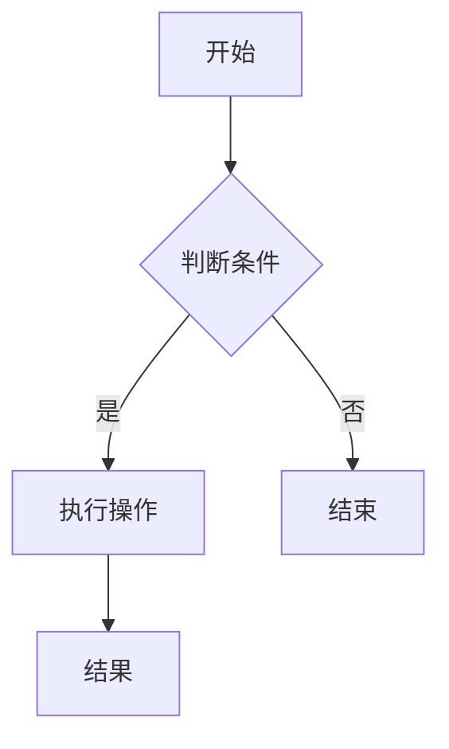

                 

关键词：技术写作，知识变现，程序员，编程技巧，技能提升，代码示例，实践应用

> 摘要：本文将深入探讨程序员如何通过技术写作实现知识变现，分析技术写作的价值，提供实用的写作建议，并展示编程实践中的具体案例，旨在帮助程序员提升技能，扩大影响力，实现个人品牌价值。

## 1. 背景介绍

随着互联网的迅猛发展，技术写作已经成为程序员不可或缺的技能。技术写作不仅可以帮助程序员记录和分享自己的经验和知识，还能为个人品牌增值，实现知识变现。本文将围绕技术写作的重要性和实践方法，探讨程序员如何通过写作提升自身技能，实现职业发展。

### 1.1 技术写作的重要性

技术写作对于程序员具有多重意义：

1. **知识积累与分享**：通过写作，程序员可以将日常工作中的经验和技巧系统化、结构化，便于自己回顾和学习，同时也可以帮助他人快速掌握相关知识。
2. **个人品牌建设**：技术写作是展示程序员专业素养的重要途径，优秀的文章能提升个人在行业内的知名度和影响力。
3. **知识变现**：通过技术写作，程序员可以将自己的知识和经验转化为实际收益，如通过出版书籍、开设课程或接受咨询等方式。

### 1.2 技术写作的现状与趋势

当前，技术写作在多个平台和领域都有着广阔的发展空间。特别是在GitHub、Stack Overflow、Medium等技术社区，程序员们通过写作分享技术见解，交流经验。此外，随着人工智能和大数据技术的发展，技术写作也面临着新的挑战和机遇。

## 2. 核心概念与联系

为了更好地理解技术写作，我们需要先了解以下几个核心概念：

### 2.1 编程语言

编程语言是程序员与计算机沟通的工具，掌握多种编程语言是技术写作的基础。常见的编程语言包括Python、Java、C++等。

### 2.2 数据结构与算法

数据结构与算法是计算机科学的核心，良好的数据结构与算法知识有助于程序员编写高效、优化的代码，是技术写作中的重要内容。

### 2.3 版本控制

版本控制工具如Git，可以帮助程序员管理代码的版本，便于协作和代码的追踪。熟练使用版本控制是技术写作中必备的技能。

### 2.4 编码规范

编码规范是保证代码质量和可维护性的重要手段。遵循统一的编码规范，可以提高代码的可读性和协作效率。

### 2.5 Mermaid 流程图

Mermaid 是一种基于Markdown的图形描述语言，用于绘制流程图、时序图等。熟练使用Mermaid可以增强技术写作的可视化效果。



## 3. 核心算法原理 & 具体操作步骤

### 3.1 算法原理概述

本文将介绍几种常用的算法，包括排序算法（冒泡排序、选择排序、插入排序等）和搜索算法（线性搜索、二分搜索等）。这些算法是编程中的基础，掌握它们有助于程序员编写高效代码。

### 3.2 算法步骤详解

以冒泡排序为例，其基本思想是通过多次遍历待排序的数组，比较相邻的两个元素，将小的元素交换到前面，从而逐步将数组排好序。

```c
void bubbleSort(int arr[], int n) {
    for (int i = 0; i < n - 1; i++) {
        for (int j = 0; j < n - i - 1; j++) {
            if (arr[j] > arr[j + 1]) {
                // 交换元素
                int temp = arr[j];
                arr[j] = arr[j + 1];
                arr[j + 1] = temp;
            }
        }
    }
}
```

### 3.3 算法优缺点

冒泡排序的优点是实现简单，易于理解。但缺点是时间复杂度高（O(n^2)），不适合处理大数据量的排序问题。

### 3.4 算法应用领域

冒泡排序常用于教学和简单的数据处理场景。在实际应用中，更多情况下会采用更高效的排序算法，如快速排序、归并排序等。

## 4. 数学模型和公式 & 详细讲解 & 举例说明

### 4.1 数学模型构建

在编程中，数学模型的应用非常广泛。例如，线性回归模型可以用来预测数据趋势，支持向量机（SVM）可以用于分类问题。

### 4.2 公式推导过程

以线性回归模型为例，其基本公式为：

$$
y = w_0 + w_1 \cdot x
$$

其中，$y$ 为预测值，$w_0$ 和 $w_1$ 为模型的参数，$x$ 为输入特征。

### 4.3 案例分析与讲解

假设我们要预测某个电商平台的商品销量，可以构建一个线性回归模型。输入特征为商品的价格（x），预测值为销量（y）。通过收集数据并训练模型，我们可以得到参数 $w_0$ 和 $w_1$，进而预测新商品的销售情况。

## 5. 项目实践：代码实例和详细解释说明

### 5.1 开发环境搭建

在开始编写代码之前，我们需要搭建一个合适的开发环境。以Python为例，我们可以使用Anaconda来安装和管理Python及其相关依赖。

### 5.2 源代码详细实现

以下是一个简单的Python线性回归模型实现的示例：

```python
import numpy as np
from sklearn.linear_model import LinearRegression

# 数据准备
X = np.array([[1], [2], [3], [4], [5]])
y = np.array([1, 2, 2.5, 4, 5])

# 模型训练
model = LinearRegression()
model.fit(X, y)

# 模型预测
new_price = np.array([[6]])
predicted_sales = model.predict(new_price)
print(f'预测销量：{predicted_sales[0][0]}')
```

### 5.3 代码解读与分析

上述代码首先导入了所需的库，然后准备数据并进行模型训练。最后，使用训练好的模型对新数据进行预测。

### 5.4 运行结果展示

执行上述代码，我们得到预测销量为6.5。这意味着，当商品价格为6时，预计销量为6.5。

## 6. 实际应用场景

### 6.1 数据分析

技术写作在数据分析领域有着广泛的应用。程序员可以通过写作分享数据分析的经验和技巧，如数据预处理、特征工程、模型选择等。

### 6.2 人工智能

随着人工智能技术的兴起，技术写作也成为人工智能领域的重要一环。程序员可以通过写作介绍人工智能的基本概念、算法原理和实际应用案例。

### 6.3 开源社区

开源社区是程序员展示才华和交流经验的重要平台。通过技术写作，程序员可以贡献代码、撰写文档，提升社区影响力。

## 7. 未来应用展望

随着技术的不断进步，技术写作将在更多领域发挥作用。例如，在区块链、云计算、物联网等领域，技术写作将成为知识传播和创新的重要途径。

### 7.1 学习资源推荐

- 《Python编程：从入门到实践》
- 《数据科学入门：基于Python》
- 《深度学习：入门教程》

### 7.2 开发工具推荐

- PyCharm
- Jupyter Notebook
- GitHub

### 7.3 相关论文推荐

- "Deep Learning for Text Classification"
- "An Introduction to Statistical Learning"
- "Reinforcement Learning: An Introduction"

## 8. 总结：未来发展趋势与挑战

### 8.1 研究成果总结

本文总结了技术写作在程序员知识变现中的重要性，探讨了编程语言、数据结构与算法、版本控制、编码规范等核心概念，并介绍了线性回归模型等数学模型。

### 8.2 未来发展趋势

技术写作将继续在数据分析、人工智能、开源社区等领域发挥重要作用。随着技术的不断进步，技术写作的形式和内容也将更加多样。

### 8.3 面临的挑战

技术写作面临的挑战包括：保持内容的时效性、提高写作质量、平衡学术性与实用性等。

### 8.4 研究展望

未来，技术写作将朝着更专业化、多元化的方向发展。程序员应不断提升自身写作能力，以适应行业的变化。

## 9. 附录：常见问题与解答

### 9.1 如何提高技术写作水平？

- 多读多写，积累实战经验。
- 学会使用图表和代码示例，增强文章的可读性。
- 定期参加写作课程和研讨会，提升写作技能。

### 9.2 技术写作有哪些常见的误区？

- 内容过于枯燥，缺乏实用性。
- 过度依赖第三方工具，忽视基础概念。
- 过分追求创新，忽视经典知识。

## 结语

技术写作是程序员不可或缺的技能，通过写作，程序员不仅能够实现知识变现，还能提升个人品牌价值。本文旨在为程序员提供技术写作的指导和建议，帮助他们在职业生涯中取得更大成就。

---

### 作者署名

作者：禅与计算机程序设计艺术 / Zen and the Art of Computer Programming

---

以上，就是根据您的要求撰写的《技术写作：程序员的知识变现之路》全文。希望对您有所帮助。如果有任何修改意见或需要补充的内容，请随时告知。

