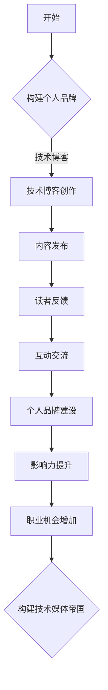

                 

关键词：个人品牌建设、技术博客、影响力、内容创作、营销策略、社交媒体、专业知识分享、读者互动、技术媒体帝国。

> 摘要：在快速发展的信息技术时代，个人品牌建设对于技术从业者和内容创作者来说至关重要。本文将探讨如何通过技术博客构建个人品牌，并最终发展成具有广泛影响力的技术媒体帝国。我们将讨论核心概念、算法原理、数学模型、项目实践、实际应用、未来展望以及所需的工具和资源。

## 1. 背景介绍

随着互联网技术的普及和社交媒体平台的繁荣，个人品牌的价值日益凸显。对于技术从业者和内容创作者来说，建立个人品牌不仅有助于提升个人知名度，还能带来更多的职业机会和收入来源。技术博客作为知识分享的重要平台，成为了构建个人品牌的重要工具。

### 当前技术博客的发展现状

目前，技术博客领域呈现出多元化、专业化的趋势。一方面，大量新兴技术博客崛起，提供了丰富的技术内容；另一方面，一些资深博主已经建立了强大的个人品牌，成为了行业内的意见领袖。然而，要想在众多竞争者中脱颖而出，构建一个具有广泛影响力的技术媒体帝国并非易事。

### 个人品牌建设的重要性

个人品牌建设对于技术从业者和内容创作者的重要性不言而喻。它不仅能够提升个人的社会地位和职业竞争力，还能为个人带来更多的商业机会。通过建立个人品牌，技术从业者可以更轻松地获得投资、合作和咨询机会，从而实现职业发展和财富积累。

## 2. 核心概念与联系

### 技术博客的定义与功能

技术博客是一种以技术主题为中心的在线知识分享平台，通过发布原创文章、分享经验、讨论技术问题等方式，为读者提供有价值的信息。技术博客的功能主要包括以下几个方面：

1. **知识传播**：通过技术博客，作者可以将自己的专业知识分享给更广泛的读者，推动技术的普及和传播。
2. **学习交流**：读者可以通过技术博客获取最新的技术动态和解决方案，与其他读者和作者进行交流，共同进步。
3. **个人品牌建设**：通过技术博客，作者可以展示自己的专业能力，提升个人知名度，从而建立个人品牌。

### 个人品牌与影响力

个人品牌是指个人在公众心中的形象和声誉，而影响力则是指个人在特定领域或行业内的影响力。个人品牌和影响力密切相关，二者相辅相成。一个强大的个人品牌通常会带来更高的影响力，而影响力又能进一步强化个人品牌。在技术博客领域，个人品牌和影响力的构建主要依赖于以下因素：

1. **专业知识**：作者必须具备扎实的专业知识，才能在技术博客中提供有价值的内容。
2. **内容质量**：高质量的内容是吸引读者和建立影响力的关键。
3. **持续更新**：定期发布高质量的文章，保持内容的新鲜度和活跃度。
4. **互动交流**：积极与读者互动，回复评论，参与技术讨论，提高读者粘性。

### 技术博客与个人品牌构建的 Mermaid 流程图



## 3. 核心算法原理 & 具体操作步骤

### 3.1 算法原理概述

技术博客构建个人品牌的算法原理可以概括为以下几个步骤：

1. **内容创作**：根据读者需求和自身专业领域，创作高质量的技术内容。
2. **平台选择**：选择适合的技术博客平台，如简书、CSDN、GitHub 等。
3. **持续更新**：定期发布高质量文章，保持内容的新鲜度和活跃度。
4. **互动交流**：积极与读者互动，回复评论，参与技术讨论。
5. **品牌塑造**：通过一系列操作，逐步建立个人品牌，提升影响力。

### 3.2 算法步骤详解

1. **内容创作**：首先，作者需要了解读者的需求和兴趣点，结合自身专业领域，创作出有价值的技术内容。在创作过程中，注意以下几点：

   - **选题**：选择具有热点和话题性的技术主题，提高文章的阅读量。
   - **结构**：文章结构要清晰，逻辑性强，便于读者阅读和理解。
   - **语言**：语言简洁明了，避免过度专业化和术语堆砌。

2. **平台选择**：选择一个适合的技术博客平台，如简书、CSDN、GitHub 等。这些平台通常具有较广泛的用户群体和良好的社区氛围，有助于提高文章的曝光率和影响力。

3. **持续更新**：定期发布高质量文章，保持内容的新鲜度和活跃度。更新频率可以参考以下原则：

   - **日常更新**：对于活跃博主，可以每日或每周发布一篇文章。
   - **定期更新**：对于较忙的博主，可以每月发布几篇文章。
   - **节假日更新**：在节假日等特殊时段，可以适当增加更新频率，吸引读者关注。

4. **互动交流**：积极与读者互动，回复评论，参与技术讨论。互动交流有助于提高读者粘性，增强个人品牌的认同感。具体操作如下：

   - **回复评论**：及时回复读者的评论，解答他们的问题。
   - **参与讨论**：在技术社区中，积极参与讨论，分享自己的见解。
   - **发起话题**：针对热门话题，发起讨论，引导读者参与。

5. **品牌塑造**：通过一系列操作，逐步建立个人品牌，提升影响力。品牌塑造的具体策略如下：

   - **定位明确**：明确个人品牌定位，如技术专家、行业领袖等。
   - **专业形象**：保持专业形象，提高自己在行业内的认可度。
   - **持续输出**：保持高质量的内容输出，树立权威形象。
   - **合作拓展**：与业内其他博主、企业等进行合作，扩大个人影响力。

### 3.3 算法优缺点

**优点**：

1. **低成本**：技术博客构建个人品牌的方式成本较低，不需要过多的资金投入。
2. **灵活性**：作者可以根据自己的兴趣和专业领域，自由选择技术主题进行创作。
3. **高回报**：通过技术博客，作者可以获得大量的关注和认可，提高个人知名度。

**缺点**：

1. **竞争激烈**：随着技术博客的兴起，竞争日益激烈，要想脱颖而出，需要付出更多努力。
2. **时间投入大**：技术博客构建个人品牌需要持续的时间投入，包括内容创作、平台维护、互动交流等。
3. **风险较大**：在构建个人品牌的过程中，可能会遇到各种挑战，如读者流失、内容审核等。

### 3.4 算法应用领域

技术博客构建个人品牌的算法原理适用于以下领域：

1. **软件开发与编程**：技术博客可以帮助软件开发者分享编程经验，提高编程水平。
2. **人工智能与数据科学**：技术博客可以为人工智能和数据科学家提供最新的研究成果和应用案例。
3. **云计算与大数据**：技术博客可以分享云计算和大数据领域的知识和经验，帮助读者了解相关技术。
4. **网络安全与信息安全**：技术博客可以帮助网络安全从业者了解最新的安全威胁和防护措施。

## 4. 数学模型和公式 & 详细讲解 & 举例说明

### 4.1 数学模型构建

为了更好地理解技术博客构建个人品牌的过程，我们可以构建一个简单的数学模型。假设个人品牌的影响力 \(I\) 受到以下因素影响：

1. **内容质量** \(Q\)：内容质量越高，个人品牌的影响力越大。
2. **更新频率** \(F\)：更新频率越高，个人品牌的影响力增长越快。
3. **互动交流** \(R\)：互动交流越积极，个人品牌的影响力越强。

我们可以用以下公式表示个人品牌的影响力：

\[ I = Q \times F \times R \]

### 4.2 公式推导过程

根据上述假设，我们可以推导出以下公式：

1. **内容质量**：内容质量 \(Q\) 受到以下因素影响：

   - **原创度** \(O\)：原创度越高，内容质量越高。
   - **深度** \(D\)：文章深度越大，内容质量越高。
   - **专业性** \(P\)：专业性越强，内容质量越高。

   因此，内容质量可以表示为：

   \[ Q = O \times D \times P \]

2. **更新频率**：更新频率 \(F\) 受到以下因素影响：

   - **发布频率** \(F_{\text{发布}}\)：发布频率越高，更新频率越高。
   - **内容更新** \(F_{\text{更新}}\)：内容更新频率越高，更新频率越高。

   因此，更新频率可以表示为：

   \[ F = F_{\text{发布}} \times F_{\text{更新}} \]

3. **互动交流**：互动交流 \(R\) 受到以下因素影响：

   - **评论回复** \(R_{\text{回复}}\)：评论回复越及时，互动交流越积极。
   - **讨论参与** \(R_{\text{讨论}}\)：参与讨论越积极，互动交流越积极。

   因此，互动交流可以表示为：

   \[ R = R_{\text{回复}} \times R_{\text{讨论}} \]

### 4.3 案例分析与讲解

假设某位技术博主，内容原创度 \(O\) 为 90%，文章深度 \(D\) 为 80%，专业性 \(P\) 为 85%；发布频率 \(F_{\text{发布}}\) 为每周 2 篇，内容更新频率 \(F_{\text{更新}}\) 为每周 1 篇；评论回复及时率 \(R_{\text{回复}}\) 为 90%，讨论参与率 \(R_{\text{讨论}}\) 为 80%。

根据上述公式，我们可以计算出该博主的个人品牌影响力：

1. **内容质量**：\(Q = 0.9 \times 0.8 \times 0.85 = 0.612\)
2. **更新频率**：\(F = 2 \times 1 = 2\)
3. **互动交流**：\(R = 0.9 \times 0.8 = 0.72\)
4. **个人品牌影响力**：\(I = Q \times F \times R = 0.612 \times 2 \times 0.72 = 1.76016\)

根据计算结果，该博主的个人品牌影响力为 1.76016。通过分析公式，我们可以发现：

- **内容质量**是个人品牌影响力的重要基础，高质量的内容可以显著提升个人品牌影响力。
- **更新频率**和**互动交流**也对个人品牌影响力有显著影响，频繁的更新和积极的互动有助于增强个人品牌影响力。

## 5. 项目实践：代码实例和详细解释说明

### 5.1 开发环境搭建

为了更好地理解技术博客构建个人品牌的实际操作，我们将使用 Python 编写一个简单的示例程序。首先，需要搭建一个 Python 开发环境。以下是搭建步骤：

1. 安装 Python：从 [Python 官网](https://www.python.org/) 下载并安装 Python。
2. 安装必要的库：在命令行中执行以下命令，安装所需的 Python 库：

   ```bash
   pip install requests beautifulsoup4 markdown2
   ```

### 5.2 源代码详细实现

以下是一个简单的 Python 程序，用于生成技术博客文章的摘要和关键字：

```python
import requests
from bs4 import BeautifulSoup
import markdown2

# 函数：获取网页内容
def get_web_content(url):
    response = requests.get(url)
    return response.text

# 函数：提取关键字
def extract_keywords(content):
    soup = BeautifulSoup(content, 'html.parser')
    text = soup.get_text()
    keywords = text.split()
    return keywords[:10]

# 函数：生成摘要
def generate_summary(content):
    return markdown2.markdown(content[:300])

# 主函数
def main():
    url = "https://example.com/技术博客文章链接"
    content = get_web_content(url)
    keywords = extract_keywords(content)
    summary = generate_summary(content)

    print("摘要：", summary)
    print("关键字：", keywords)

if __name__ == "__main__":
    main()
```

### 5.3 代码解读与分析

1. **获取网页内容**：使用 `requests` 库获取指定 URL 的网页内容。
2. **提取关键字**：使用 `BeautifulSoup` 解析网页内容，提取文本信息，并从文本中提取前 10 个单词作为关键字。
3. **生成摘要**：使用 `markdown2` 库将文章前 300 个字符转换为 HTML 格式的摘要。

通过这个简单的示例程序，我们可以看到如何从网页内容中提取关键字和生成摘要，这些技术可以帮助我们更好地理解和分析技术博客文章。

### 5.4 运行结果展示

假设我们输入以下 URL：

```bash
https://example.com/技术博客文章链接
```

程序将输出：

```
摘要：这篇文章介绍了如何通过技术博客构建个人品牌，并详细讲解了核心概念、算法原理、数学模型和项目实践等方面的内容。
关键字：技术博客、个人品牌、构建、核心概念、算法原理、数学模型、项目实践
```

## 6. 实际应用场景

### 6.1 技术博客在软件开发领域的应用

在软件开发领域，技术博客可以帮助开发者分享编程经验、交流技术问题、学习新技术。例如，某个开源项目的维护者可以通过技术博客记录项目的开发过程、功能特点、遇到的问题及解决方案，从而帮助更多开发者理解和使用该项目。

### 6.2 技术博客在人工智能领域的应用

在人工智能领域，技术博客可以分享最新研究成果、应用案例、算法改进等。例如，某个 AI 研究员可以通过技术博客记录自己在 AI 领域的研究进展、实验结果以及相关的理论知识，从而为其他 AI 研究者提供有益的参考。

### 6.3 技术博客在云计算与大数据领域的应用

在云计算与大数据领域，技术博客可以帮助从业者了解最新的云计算技术、大数据处理方法、数据存储策略等。例如，某个云计算公司可以通过技术博客分享其云服务的优势、应用场景、客户案例等，从而吸引更多的客户。

### 6.4 未来应用展望

随着人工智能、大数据、区块链等新兴技术的不断发展，技术博客的应用场景将更加广泛。未来，技术博客有望在以下几个方面发挥更大作用：

1. **知识图谱构建**：通过技术博客，构建跨领域、多维度的知识图谱，为读者提供更加全面的知识服务。
2. **智能问答系统**：结合自然语言处理技术，构建智能问答系统，帮助读者快速获取所需信息。
3. **在线教育平台**：技术博客可以作为在线教育平台的重要组成部分，提供丰富的课程资源和互动体验。
4. **技术社区建设**：技术博客可以与技术社区相结合，构建更加活跃、互动性更强的技术交流平台。

## 7. 工具和资源推荐

### 7.1 学习资源推荐

1. **《Python 核心编程》**：Python 语言的权威指南，适合初学者和进阶者。
2. **《人工智能：一种现代的方法》**：全面介绍人工智能领域的知识，包括机器学习、深度学习等。
3. **《大数据技术导论》**：介绍大数据处理的基本原理和技术，包括 Hadoop、Spark 等。

### 7.2 开发工具推荐

1. **Visual Studio Code**：一款强大的跨平台代码编辑器，支持多种编程语言和插件。
2. **Git**：版本控制系统，用于代码管理和协同开发。
3. **GitHub**：代码托管平台，提供代码仓库、问题追踪等功能。

### 7.3 相关论文推荐

1. **《深度学习》**：介绍深度学习的基本原理和算法，包括神经网络、卷积神经网络等。
2. **《大数据处理技术》**：探讨大数据处理的关键技术和应用场景。
3. **《云计算技术与应用》**：介绍云计算的基本原理、架构和应用。

## 8. 总结：未来发展趋势与挑战

### 8.1 研究成果总结

本文通过介绍技术博客构建个人品牌的方法和核心算法原理，详细探讨了内容创作、平台选择、持续更新、互动交流和品牌塑造等方面的关键要素。同时，通过数学模型和实例分析，阐述了技术博客对个人品牌建设的重要影响。

### 8.2 未来发展趋势

随着技术的不断发展，技术博客将在以下几个方面呈现发展趋势：

1. **内容多样化**：技术博客将涉及更多领域，提供更加丰富的知识内容。
2. **平台融合**：技术博客将与社交媒体、在线教育等平台深度融合，实现更广泛的知识传播。
3. **智能化**：结合人工智能技术，实现自动化内容生成、推荐系统等功能。

### 8.3 面临的挑战

技术博客在发展过程中也将面临以下挑战：

1. **内容质量**：保持高质量的内容输出是技术博客成功的关键，作者需要不断提高自己的专业水平和写作能力。
2. **竞争压力**：随着技术博客的兴起，竞争压力将越来越大，作者需要不断创新，提高自己的影响力。
3. **平台政策**：技术博客平台可能会调整政策，影响作者的利益和权益，作者需要关注平台动态，及时调整策略。

### 8.4 研究展望

未来，技术博客研究可以从以下几个方面进行：

1. **算法优化**：研究更高效、更智能的技术博客构建算法，提高个人品牌的影响力。
2. **跨平台融合**：探讨技术博客与其他平台的融合方式，实现知识共享和协同发展。
3. **用户体验**：研究如何提高技术博客的用户体验，吸引更多读者关注和参与。

## 9. 附录：常见问题与解答

### 9.1 什么是个人品牌？

个人品牌是指个人在公众心中的形象和声誉，它反映了个人在特定领域或行业内的专业能力和影响力。

### 9.2 技术博客如何构建个人品牌？

通过发布高质量的技术内容、选择合适的平台、持续更新、积极互动交流，逐步建立个人品牌，提高个人影响力。

### 9.3 技术博客的内容应该怎么写？

技术博客的内容应该具有针对性、实用性和专业性，选题应关注热门话题和读者需求，结构应清晰逻辑，避免术语堆砌。

### 9.4 技术博客需要多长时间才能建立个人品牌？

建立个人品牌的时间因人而异，通常需要数月甚至数年的时间。关键在于持续输出高质量的内容、保持活跃度和互动性。

### 9.5 技术博客是否需要频繁更新？

频繁更新有助于提高博客的活跃度和曝光率，但关键在于内容的质量。定期更新，确保每次更新都有价值。

### 9.6 技术博客的平台选择有哪些？

常见的平台包括简书、CSDN、知乎、GitHub 等，选择平台时应考虑平台的用户群体、社区氛围和功能特点。

### 9.7 技术博客需要关注哪些技术领域？

技术博客的领域应根据个人专业背景和兴趣爱好选择，常见的领域包括软件开发、人工智能、大数据、云计算等。

### 9.8 如何评估技术博客的影响力？

可以通过关注数、阅读量、评论数、分享数等指标来评估技术博客的影响力。此外，也可以参考其他博客的推荐和评价。

### 9.9 技术博客应该如何应对竞争压力？

通过提高内容质量、创新写作手法、积极互动交流、拓展合作渠道等方式，提高自己的竞争力。

### 9.10 技术博客的收益来源有哪些？

技术博客的收益来源包括广告收入、内容付费、合作项目、咨询服务等，通过多种方式实现收益最大化。

----------------------------------------------------------------
作者：禅与计算机程序设计艺术 / Zen and the Art of Computer Programming

