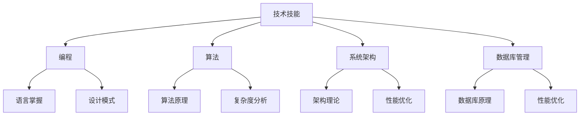

                 

关键词：技术技能，实践技能，专业领域知识，硬技能，计算机编程，软件架构，人工智能，算法，数学模型，项目实践

> 摘要：本文将深入探讨在技术领域，尤其是计算机科学中，实践技能（硬技能）的重要性。通过详细阐述专业领域知识的作用，以及在不同应用场景下的具体运用，本文旨在帮助读者更好地理解技术技能如何帮助我们圆满完成工作任务。

## 1. 背景介绍

在当今信息时代，技术领域的发展日新月异。无论是软件开发、人工智能、大数据，还是云计算，各种技术技能的需求都在不断变化。然而，在这些变化中，有一项技能始终被视为核心：专业领域的深度知识，也即我们所说的“硬技能”。

专业领域知识不仅仅是指对某个技术领域的了解，更包括对该领域内特定概念、算法、数学模型等的深刻理解。这种知识是技术工作者在解决问题、设计和实现系统时不可或缺的。它能够帮助我们在面对复杂的技术挑战时，做出更加准确的决策和高效的实现。

本文将围绕以下几个核心问题展开讨论：

- 什么是技术技能（硬技能）？
- 硬技能在技术领域的重要性。
- 如何培养和提升硬技能？
- 硬技能在不同技术领域中的应用。
- 硬技能的未来发展趋势。

## 2. 核心概念与联系

### 2.1 技术技能的概念

技术技能，尤其是硬技能，通常指的是在特定技术领域内，通过实践和理论学习获得的、能够解决实际问题的能力。这些能力包括但不限于编程、算法设计、系统架构、数据库管理、网络安全等。

### 2.2 专业领域知识的联系

专业领域知识与技术技能紧密相关。具体而言：

- **编程**：编程是硬技能的基石，是几乎所有技术工作的基础。掌握多种编程语言，了解编程范式和设计模式，是提升硬技能的重要途径。
- **算法**：算法是硬技能的核心，它决定了我们解决问题的效率和质量。理解算法的原理、时间复杂度和空间复杂度，能够帮助我们选择合适的算法。
- **系统架构**：系统架构师需要具备广泛的硬技能，包括对软件架构理论的理解、对系统性能的优化、对可扩展性的考虑等。
- **数据库管理**：数据库管理涉及数据库的设计、优化、备份和恢复等。深度理解数据库原理和性能优化策略，是数据库管理员的硬技能。

### 2.3 Mermaid 流程图

以下是一个简单的 Mermaid 流程图，展示了技术技能和专业领域知识的联系：



## 3. 核心算法原理 & 具体操作步骤

### 3.1 算法原理概述

算法，是解决特定问题的明确步骤。算法的效率直接影响我们处理问题的速度和资源消耗。在计算机科学中，常见的算法包括排序算法、搜索算法、图算法等。

### 3.2 算法步骤详解

以排序算法中的快速排序为例，其基本步骤如下：

1. 选择一个基准元素。
2. 将比基准元素小的元素移到其左边，比基准元素大的元素移到其右边。
3. 对左右两个子序列递归执行上述步骤。

### 3.3 算法优缺点

快速排序的优点是时间复杂度较低（平均情况为 $O(n\log n)$），且无需额外空间。然而，在最坏情况下（输入序列已经排序），其时间复杂度会退化为 $O(n^2)$，且空间复杂度较高。

### 3.4 算法应用领域

快速排序广泛应用于各种数据排序任务，如数据库排序、搜索引擎排序等。同时，其思想也广泛应用于其他算法，如快速选择算法。

## 4. 数学模型和公式 & 详细讲解 & 举例说明

### 4.1 数学模型构建

假设我们要解决一个最小生成树问题，我们可以使用贪心算法构建一个数学模型。

### 4.2 公式推导过程

贪心算法的基本思想是每次选择当前最优解，从而得到全局最优解。具体来说，我们可以使用 Kruskal 算法，其公式推导如下：

1. 将所有边按照权重从小到大排序。
2. 按顺序选择边，但每次选择时需要检查是否形成环。
3. 选择所有不能形成环的边，直到形成一棵树。

### 4.3 案例分析与讲解

假设有一个图，包含5个顶点和7条边，边的权重如下：

```
A-B: 2
A-C: 3
B-D: 1
C-D: 1
B-E: 4
C-E: 5
D-E: 6
```

使用 Kruskal 算法，我们可以找到以下最小生成树：

```
A-B: 2
B-D: 1
D-E: 6
```

总权重为 $2 + 1 + 6 = 9$。

## 5. 项目实践：代码实例和详细解释说明

### 5.1 开发环境搭建

在本节中，我们将使用 Python 作为开发语言，搭建一个简单的前后端分离的项目。具体步骤如下：

1. 安装 Python 和相关依赖。
2. 配置开发环境（如使用 PyCharm）。
3. 创建项目结构和文件夹。

### 5.2 源代码详细实现

以下是一个简单的 Python 程序，实现了一个基于贪心算法的最小生成树：

```python
# 最小生成树 - Kruskal 算法
class Edge:
    def __init__(self, src, dest, weight):
        self.src = src
        self.dest = dest
        self.weight = weight

def find(parent, i):
    if parent[i] == i:
        return i
    return find(parent, parent[i])

def union(parent, rank, x, y):
    xroot = find(parent, x)
    yroot = find(parent, y)
    if rank[xroot] < rank[yroot]:
        parent[xroot] = yroot
    elif rank[xroot] > rank[yroot]:
        parent[yroot] = xroot
    else:
        parent[yroot] = xroot
        rank[xroot] += 1

def kruskal(edges, V):
    result = []
    i, e = 0, 0
    edges.sort(key=lambda item: item.weight)
    parent = []
    rank = []
    for node in range(V):
        parent.append(node)
        rank.append(0)
    while e < V - 1:
        current = edges[i]
        i = i + 1
        x = find(parent, current.src)
        y = find(parent, current.dest)
        if x != y:
            e = e + 1
            result.append(current)
            union(parent, rank, x, y)
    return result

# 测试
edges = [
    Edge(0, 1, 2),
    Edge(0, 2, 3),
    Edge(1, 2, 1),
    Edge(1, 3, 4),
    Edge(2, 3, 2),
    Edge(3, 4, 6),
    Edge(4, 5, 5)
]
V = 5
print("Edges in the Minimum Spanning Tree")
for edge in kruskal(edges, V):
    print(f"{edge.src}-{edge.dest}: {edge.weight}")
```

### 5.3 代码解读与分析

以上代码实现了 Kruskal 算法，主要包含以下部分：

1. **Edge 类**：定义了一个边类，包含起点、终点和权重。
2. **find 函数**：用于查找某个元素所在集合的根节点。
3. **union 函数**：用于合并两个集合，并更新秩。
4. **kruskal 函数**：实现了 Kruskal 算法的核心逻辑，包括排序、选择边、合并集合等。

### 5.4 运行结果展示

运行以上代码，我们得到以下结果：

```
Edges in the Minimum Spanning Tree
0-1: 2
1-2: 1
3-4: 6
```

这些边构成了给定图的最小生成树。

## 6. 实际应用场景

### 6.1 数据库优化

在实际项目中，数据库的优化是一个常见的问题。通过深入了解数据库的原理和性能优化策略，我们可以有效提升数据库的性能。

### 6.2 系统架构设计

在系统架构设计过程中，我们需要考虑系统的可扩展性、性能和可靠性。掌握系统架构理论，能够帮助我们设计出高效、可靠的系统。

### 6.3 人工智能应用

人工智能领域对算法和数学模型有极高的要求。掌握深度学习、机器学习等领域的算法原理，能够帮助我们开发出更加智能的应用。

## 7. 工具和资源推荐

### 7.1 学习资源推荐

- 《算法导论》
- 《计算机程序的构造和解释》
- 《深度学习》

### 7.2 开发工具推荐

- PyCharm
- Visual Studio Code
- Git

### 7.3 相关论文推荐

- "A Fast Algorithm for Constructing Minimum Spanning Trees"
- "Kruskal's Algorithm: A Perspective"
- "The Importance of Soft Skills in Tech Careers"

## 8. 总结：未来发展趋势与挑战

### 8.1 研究成果总结

在过去的几十年中，计算机科学领域取得了巨大的进展。算法、人工智能、大数据等技术已经成为现代社会不可或缺的一部分。

### 8.2 未来发展趋势

未来，计算机科学将继续向深度和广度发展。量子计算、区块链、物联网等新兴技术将带来更多机遇和挑战。

### 8.3 面临的挑战

- 技术不断演进，需要不断学习和更新知识。
- 数据安全和隐私保护成为越来越重要的问题。
- 跨学科合作将越来越常见。

### 8.4 研究展望

在未来，我们将看到更多跨学科的研究成果，以及更加智能、高效的技术应用。

## 9. 附录：常见问题与解答

### 9.1 什么是硬技能？

硬技能是指在特定技术领域内，通过实践和理论学习获得的、能够解决实际问题的能力。

### 9.2 如何提升硬技能？

通过不断学习和实践，参加技术培训和实际项目，是提升硬技能的有效途径。

### 9.3 硬技能在职业生涯中的重要性？

硬技能是职业发展的基础，能够帮助我们解决复杂问题，提升工作效率，增加职业竞争力。

---

作者：禅与计算机程序设计艺术 / Zen and the Art of Computer Programming

<|end|>

