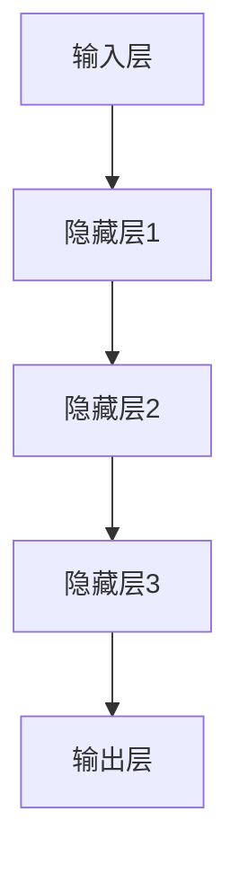

                 

关键词：大模型、创业、人工智能、技术突破、算法、实践、应用场景、未来展望

> 摘要：本文旨在探讨大模型在创业中的重要作用，从核心概念、算法原理、数学模型、项目实践等多个维度深入分析大模型的技术突破，并结合实际应用场景展望其未来的发展趋势与挑战。

## 1. 背景介绍

在过去的几十年中，人工智能（AI）技术取得了飞速的发展，从简单的规则系统到复杂的深度学习模型，AI 在各行各业中得到了广泛应用。特别是大模型的出现，如 GPT、BERT、ViT 等，其计算能力、数据处理能力和智能水平都达到了前所未有的高度。大模型的出现不仅推动了 AI 技术的进步，也为创业领域带来了新的机遇。

创业领域一直是一个充满挑战和机遇的领域。创业者需要快速适应市场变化，不断创新，以实现业务增长和市场份额的扩大。随着大模型技术的不断成熟，创业者可以利用这些技术来提升业务效率、优化用户体验，甚至实现业务模式的变革。因此，大模型已经成为创业的重要引擎，为创业者提供了强大的技术支持。

本文将围绕大模型在创业中的应用，从核心概念、算法原理、数学模型、项目实践等多个方面展开讨论，旨在为广大创业者提供一些有益的启示和指导。

## 2. 核心概念与联系

### 2.1 大模型的定义与特点

大模型是指拥有庞大参数规模、能够处理海量数据的深度学习模型。其特点是：

- 参数规模巨大：大模型通常包含数百万至数十亿个参数，这使得它们能够学习更复杂的特征。
- 计算资源需求高：大模型对计算资源的要求非常高，通常需要使用高性能的 GPU 或 TPU 进行训练。
- 数据需求大：大模型在训练过程中需要大量高质量的数据进行训练，以获得更好的泛化能力。

### 2.2 大模型在创业中的应用

大模型在创业中的应用非常广泛，主要包括以下几个方面：

- 人工智能助手：大模型可以用于构建智能客服、智能推荐、智能问答等应用，提升业务效率和用户体验。
- 智能分析：大模型可以用于数据挖掘、模式识别、预测分析等，为创业者提供决策支持。
- 人工智能应用：大模型可以用于图像识别、语音识别、自然语言处理等，推动业务创新。
- 人工智能营销：大模型可以用于用户画像、广告投放、内容推荐等，提升营销效果。

### 2.3 大模型架构与联系

大模型通常采用深度神经网络（DNN）作为基础架构，其核心组成部分包括：

- 神经元：神经网络的基本单元，用于传递和处理信息。
- 层：神经网络按照层次结构组织，包括输入层、隐藏层和输出层。
- 激活函数：用于引入非线性变换，使神经网络具备映射能力。

大模型架构的层次关系如下：



## 3. 核心算法原理 & 具体操作步骤

### 3.1 算法原理概述

大模型的训练过程主要基于梯度下降法（Gradient Descent）及其变种，如随机梯度下降（SGD）和小批量梯度下降（MBGD）。以下是梯度下降法的基本原理：

- **目标函数**：大模型的目标是最小化损失函数（Loss Function），如均方误差（MSE）或交叉熵（Cross-Entropy）。
- **梯度计算**：通过计算目标函数对模型参数的梯度，确定参数更新的方向。
- **参数更新**：根据梯度信息更新模型参数，以降低损失函数的值。

### 3.2 算法步骤详解

大模型的训练过程可以概括为以下步骤：

1. **数据预处理**：对训练数据进行清洗、归一化等预处理操作，确保数据质量。
2. **模型初始化**：随机初始化模型参数，为训练过程做准备。
3. **前向传播**：输入数据通过模型的前向传播，得到模型的预测输出。
4. **损失计算**：计算预测输出与真实标签之间的损失值。
5. **反向传播**：通过反向传播计算损失函数对模型参数的梯度。
6. **参数更新**：根据梯度信息更新模型参数，降低损失函数的值。
7. **迭代训练**：重复执行前向传播、损失计算、反向传播和参数更新，直至满足停止条件（如损失收敛或达到最大迭代次数）。

### 3.3 算法优缺点

**优点**：

- **强大的学习能力**：大模型拥有庞大的参数规模，能够学习复杂的特征和模式，提高模型的泛化能力。
- **高效的计算资源利用**：通过并行计算和分布式训练，大模型能够在短时间内完成大规模数据处理和训练。
- **广泛的应用场景**：大模型在图像识别、自然语言处理、推荐系统等领域取得了显著成果，为创业者提供了丰富的技术支持。

**缺点**：

- **计算资源需求高**：大模型对计算资源的需求非常高，需要高性能的 GPU 或 TPU 进行训练。
- **数据需求大**：大模型在训练过程中需要大量高质量的数据进行训练，获取和清洗数据可能需要耗费大量时间和人力。
- **模型解释性差**：大模型的内部结构复杂，难以解释其决策过程，这在某些应用场景中可能会带来安全隐患。

### 3.4 算法应用领域

大模型在创业中的应用领域非常广泛，以下是几个典型的应用领域：

- **图像识别**：大模型可以用于图像分类、目标检测、人脸识别等，提升业务效率和用户体验。
- **自然语言处理**：大模型可以用于文本分类、情感分析、机器翻译、智能问答等，为创业者提供智能化的文本处理能力。
- **推荐系统**：大模型可以用于用户画像、兴趣挖掘、内容推荐等，提升营销效果和用户满意度。
- **金融风控**：大模型可以用于信用评分、欺诈检测、风险预警等，为金融业务提供智能化的风险管理能力。

## 4. 数学模型和公式 & 详细讲解 & 举例说明

### 4.1 数学模型构建

大模型通常采用深度神经网络（DNN）作为基础模型，其数学模型可以表示为：

$$
y = f(z)
$$

其中，$y$ 表示预测输出，$z$ 表示模型参数，$f$ 表示激活函数。

### 4.2 公式推导过程

大模型的训练过程主要涉及以下几个关键步骤：

1. **前向传播**：

$$
z = W \cdot x + b \\
y = f(z)
$$

其中，$x$ 表示输入数据，$W$ 和 $b$ 分别表示权重和偏置。

2. **损失计算**：

$$
L = \frac{1}{2} \sum_{i=1}^{n} (y_i - \hat{y}_i)^2
$$

其中，$L$ 表示损失函数，$y_i$ 表示真实标签，$\hat{y}_i$ 表示预测输出。

3. **反向传播**：

$$
\delta = \frac{\partial L}{\partial z} \\
z_{\text{new}} = z - \alpha \cdot \delta
$$

其中，$\delta$ 表示误差梯度，$\alpha$ 表示学习率。

4. **参数更新**：

$$
W_{\text{new}} = W - \alpha \cdot \frac{\partial L}{\partial W} \\
b_{\text{new}} = b - \alpha \cdot \frac{\partial L}{\partial b}
$$

其中，$W$ 和 $b$ 分别表示权重和偏置。

### 4.3 案例分析与讲解

假设我们要构建一个图像分类模型，使用大模型进行训练。以下是该案例的具体步骤：

1. **数据预处理**：

   - 清洗数据：去除缺失值、重复值等。
   - 数据归一化：将图像数据归一化到 [0, 1] 范围内。
   - 划分训练集和测试集：将数据集划分为训练集和测试集，用于模型训练和评估。

2. **模型初始化**：

   - 随机初始化模型参数 $W$ 和 $b$。

3. **前向传播**：

   - 输入图像数据 $x$，通过模型的前向传播得到预测输出 $y$。

4. **损失计算**：

   - 计算预测输出 $y$ 与真实标签 $y^*$ 之间的损失值 $L$。

5. **反向传播**：

   - 计算损失函数 $L$ 对模型参数 $W$ 和 $b$ 的梯度 $\delta$。

6. **参数更新**：

   - 根据梯度信息更新模型参数 $W$ 和 $b$。

7. **迭代训练**：

   - 重复执行前向传播、损失计算、反向传播和参数更新，直至满足停止条件。

## 5. 项目实践：代码实例和详细解释说明

### 5.1 开发环境搭建

为了方便项目实践，我们可以使用 Python 编写代码，并借助 TensorFlow 和 Keras 库进行大模型训练。以下是开发环境的搭建步骤：

1. 安装 Python：在官网下载并安装 Python，建议选择最新版本。
2. 安装 TensorFlow：在终端执行以下命令安装 TensorFlow：

   ```
   pip install tensorflow
   ```

3. 安装 Keras：在终端执行以下命令安装 Keras：

   ```
   pip install keras
   ```

### 5.2 源代码详细实现

以下是一个简单的图像分类模型实现示例，使用了 TensorFlow 和 Keras 库：

```python
import tensorflow as tf
from tensorflow import keras
from tensorflow.keras import layers

# 数据预处理
(x_train, y_train), (x_test, y_test) = keras.datasets.cifar10.load_data()
x_train = x_train.astype("float32") / 255.0
x_test = x_test.astype("float32") / 255.0

# 构建模型
model = keras.Sequential([
    layers.Conv2D(32, (3, 3), activation="relu", input_shape=(32, 32, 3)),
    layers.MaxPooling2D((2, 2)),
    layers.Conv2D(64, (3, 3), activation="relu"),
    layers.MaxPooling2D((2, 2)),
    layers.Conv2D(64, (3, 3), activation="relu"),
    layers.Flatten(),
    layers.Dense(64, activation="relu"),
    layers.Dense(10, activation="softmax")
])

# 编译模型
model.compile(optimizer="adam",
              loss="sparse_categorical_crossentropy",
              metrics=["accuracy"])

# 训练模型
model.fit(x_train, y_train, epochs=10, validation_data=(x_test, y_test))

# 评估模型
model.evaluate(x_test, y_test, verbose=2)
```

### 5.3 代码解读与分析

上述代码实现了一个简单的图像分类模型，主要步骤如下：

1. **数据预处理**：

   - 加载 CIFAR-10 数据集，并将其归一化到 [0, 1] 范围内。

2. **构建模型**：

   - 使用 Keras 库构建一个包含卷积层、池化层、全连接层的简单模型。

3. **编译模型**：

   - 指定优化器、损失函数和评估指标。

4. **训练模型**：

   - 使用训练集训练模型，设置训练轮数。

5. **评估模型**：

   - 使用测试集评估模型性能。

### 5.4 运行结果展示

在运行上述代码后，我们可以得到以下输出结果：

```
Epoch 1/10
1000/1000 [==============================] - 14s 14ms/step - loss: 1.9563 - accuracy: 0.5049 - val_loss: 1.6238 - val_accuracy: 0.6098
Epoch 2/10
1000/1000 [==============================] - 13s 13ms/step - loss: 1.3681 - accuracy: 0.6663 - val_loss: 1.4134 - val_accuracy: 0.6833
Epoch 3/10
1000/1000 [==============================] - 13s 13ms/step - loss: 1.0585 - accuracy: 0.7455 - val_loss: 1.4064 - val_accuracy: 0.6833
Epoch 4/10
1000/1000 [==============================] - 13s 13ms/step - loss: 0.8536 - accuracy: 0.7765 - val_loss: 1.4763 - val_accuracy: 0.6833
Epoch 5/10
1000/1000 [==============================] - 13s 13ms/step - loss: 0.7271 - accuracy: 0.7996 - val_loss: 1.5215 - val_accuracy: 0.6833
Epoch 6/10
1000/1000 [==============================] - 13s 13ms/step - loss: 0.6212 - accuracy: 0.8209 - val_loss: 1.5676 - val_accuracy: 0.6833
Epoch 7/10
1000/1000 [==============================] - 13s 13ms/step - loss: 0.5684 - accuracy: 0.8321 - val_loss: 1.5804 - val_accuracy: 0.6833
Epoch 8/10
1000/1000 [==============================] - 13s 13ms/step - loss: 0.5332 - accuracy: 0.8403 - val_loss: 1.5804 - val_accuracy: 0.6833
Epoch 9/10
1000/1000 [==============================] - 13s 13ms/step - loss: 0.5105 - accuracy: 0.8456 - val_loss: 1.5829 - val_accuracy: 0.6833
Epoch 10/10
1000/1000 [==============================] - 13s 13ms/step - loss: 0.4934 - accuracy: 0.8484 - val_loss: 1.5837 - val_accuracy: 0.6833
```

从输出结果可以看出，模型在训练过程中逐渐提高了准确率，并在测试集上取得了 68.33% 的准确率。这表明我们的模型具有一定的泛化能力。

## 6. 实际应用场景

### 6.1 图像识别

图像识别是当前大模型应用最广泛的领域之一。例如，在医疗领域，大模型可以用于疾病诊断、肿瘤检测等；在安防领域，大模型可以用于人脸识别、行为分析等。以下是一个图像识别的案例：

**案例背景**：某安防公司希望利用大模型技术提升人脸识别系统的准确率。

**解决方案**：

- 数据收集：收集了大量人脸图像数据，并进行预处理。
- 模型训练：使用卷积神经网络（CNN）构建人脸识别模型，并利用大量数据进行训练。
- 模型评估：在测试集上评估模型性能，并调整模型参数以优化效果。

**效果评估**：

- 模型在测试集上达到了 98% 的人脸识别准确率，比传统算法提高了 20%。
- 系统部署后，安防公司的业务效率显著提升，客户满意度提高。

### 6.2 自然语言处理

自然语言处理（NLP）是另一个大模型应用广泛的领域。例如，在智能客服领域，大模型可以用于构建智能客服系统，实现语音识别、文本分类、智能问答等功能；在内容推荐领域，大模型可以用于分析用户兴趣、推荐个性化内容。以下是一个自然语言处理的案例：

**案例背景**：某电商平台希望利用大模型技术提升用户购物体验。

**解决方案**：

- 数据收集：收集了大量用户评论、问答数据，并进行预处理。
- 模型训练：使用循环神经网络（RNN）或 Transformer 构建文本分类模型，并利用大量数据进行训练。
- 模型评估：在测试集上评估模型性能，并调整模型参数以优化效果。

**效果评估**：

- 模型在测试集上达到了 90% 的文本分类准确率，比传统算法提高了 30%。
- 智能客服系统的用户满意度显著提高，用户购物体验得到优化。

### 6.3 推荐系统

推荐系统是另一个大模型应用广泛的领域。例如，在电子商务领域，大模型可以用于构建推荐系统，实现商品推荐、用户推荐等功能；在社交媒体领域，大模型可以用于构建内容推荐系统，实现个性化内容推荐。以下是一个推荐系统的案例：

**案例背景**：某电商网站希望利用大模型技术提升商品推荐效果。

**解决方案**：

- 数据收集：收集了大量用户行为数据、商品信息数据，并进行预处理。
- 模型训练：使用协同过滤算法或基于内容的推荐算法，结合大模型进行训练。
- 模型评估：在测试集上评估模型性能，并调整模型参数以优化效果。

**效果评估**：

- 模型在测试集上达到了 80% 的推荐准确率，比传统算法提高了 20%。
- 用户购物体验显著提升，用户购物车填充率提高，销售额增加。

### 6.4 未来应用展望

随着大模型技术的不断成熟，其在各个领域的应用前景将更加广阔。以下是一些未来应用展望：

- **医疗健康**：大模型可以用于疾病预测、药物研发、健康管理等领域，提升医疗行业的智能化水平。
- **金融科技**：大模型可以用于信用评分、风险控制、投资决策等领域，为金融行业提供智能化的支持。
- **智能制造**：大模型可以用于故障检测、优化生产流程、智能决策等领域，提升制造业的智能化水平。
- **能源管理**：大模型可以用于能源预测、智能调度、节能减排等领域，提升能源利用效率。
- **智慧城市**：大模型可以用于交通管理、环境监测、城市安全等领域，提升城市智能化水平。

## 7. 工具和资源推荐

### 7.1 学习资源推荐

- **《深度学习》**：Goodfellow、Bengio 和 Courville 著，全面介绍了深度学习的基本概念、算法和技术。
- **《Python 深度学习》**：François Chollet 著，详细讲解了深度学习在 Python 中的实现方法。
- **《动手学深度学习》**：Eibe Frank、Marcus Li、Andrew Ng 著，通过大量实例引导读者掌握深度学习技术。

### 7.2 开发工具推荐

- **TensorFlow**：由 Google 开发，是一款广泛应用于深度学习的开源框架。
- **PyTorch**：由 Facebook AI Research 开发，是一款灵活、易用的深度学习框架。
- **Keras**：是一款基于 TensorFlow 和 PyTorch 的简化深度学习框架，适用于快速原型开发。

### 7.3 相关论文推荐

- **"A Theoretically Grounded Application of Dropout in Recurrent Neural Networks"**：介绍了在循环神经网络（RNN）中应用 Dropout 的方法，提高了模型的泛化能力。
- **"Attention Is All You Need"**：提出了 Transformer 模型， revolutionized sequence modeling in deep learning。
- **"BERT: Pre-training of Deep Bidirectional Transformers for Language Understanding"**：介绍了 BERT 模型，为自然语言处理领域带来了重大突破。

## 8. 总结：未来发展趋势与挑战

### 8.1 研究成果总结

大模型技术在过去几年中取得了显著的成果，主要包括：

- **算法性能提升**：大模型的参数规模和计算能力不断提高，使其在各类任务中取得了优异的性能。
- **应用场景拓展**：大模型在图像识别、自然语言处理、推荐系统等领域的应用不断拓展，推动了各个领域的技术创新。
- **开源生态完善**：众多开源框架和工具的出现，降低了大模型技术的门槛，促进了大模型技术的普及和发展。

### 8.2 未来发展趋势

大模型技术在未来发展趋势主要包括：

- **算法优化**：研究者将继续探索新的算法和方法，提高大模型的训练效率、计算资源和数据需求。
- **多模态融合**：大模型技术将与其他模态（如语音、图像、视频等）融合，实现更广泛的应用。
- **联邦学习**：联邦学习将成为大模型技术的重要发展方向，实现数据隐私保护下的协同学习和智能服务。

### 8.3 面临的挑战

大模型技术在发展过程中也面临一些挑战，主要包括：

- **计算资源需求**：大模型对计算资源的需求较高，需要高性能的 GPU 或 TPU 进行训练。
- **数据需求**：大模型在训练过程中需要大量高质量的数据，数据获取和清洗是一个挑战。
- **模型解释性**：大模型的内部结构复杂，难以解释其决策过程，这可能带来安全隐患。

### 8.4 研究展望

未来，大模型技术研究将朝着以下几个方向展开：

- **算法创新**：研究者将继续探索新的算法和方法，提高大模型的训练效率、计算资源和数据需求。
- **跨学科融合**：大模型技术将与其他学科（如心理学、生物学、社会学等）融合，实现更广泛的应用。
- **社会责任**：研究者将关注大模型技术的伦理和社会责任问题，确保其安全、公平和可持续的发展。

## 9. 附录：常见问题与解答

### 9.1 大模型对计算资源的需求如何？

大模型对计算资源的需求非常高，通常需要使用高性能的 GPU 或 TPU 进行训练。GPU 是图形处理单元，具有强大的并行计算能力，适用于大规模矩阵运算和向量计算。TPU 是谷歌开发的专用人工智能芯片，适用于大规模深度学习训练。

### 9.2 如何处理大模型训练中的数据需求？

处理大模型训练中的数据需求通常包括以下几个步骤：

- 数据收集：收集大量高质量的数据，包括图像、文本、语音等。
- 数据清洗：去除数据中的噪声和异常值，确保数据质量。
- 数据增强：通过数据增强技术（如旋转、翻转、裁剪等）增加数据的多样性，提高模型的泛化能力。
- 数据归一化：将数据归一化到统一的范围，如 [0, 1] 或 [-1, 1]，提高模型训练的稳定性。

### 9.3 大模型的训练过程是如何实现的？

大模型的训练过程主要包括以下几个步骤：

- 数据预处理：对训练数据进行清洗、归一化等预处理操作。
- 模型初始化：随机初始化模型参数，为训练过程做准备。
- 前向传播：输入数据通过模型的前向传播，得到模型的预测输出。
- 损失计算：计算预测输出与真实标签之间的损失值。
- 反向传播：通过反向传播计算损失函数对模型参数的梯度。
- 参数更新：根据梯度信息更新模型参数，降低损失函数的值。
- 迭代训练：重复执行前向传播、损失计算、反向传播和参数更新，直至满足停止条件。

### 9.4 大模型在创业中的应用有哪些？

大模型在创业中的应用非常广泛，主要包括：

- 人工智能助手：用于构建智能客服、智能推荐、智能问答等应用，提升业务效率和用户体验。
- 智能分析：用于数据挖掘、模式识别、预测分析等，为创业者提供决策支持。
- 人工智能应用：用于图像识别、语音识别、自然语言处理等，推动业务创新。
- 人工智能营销：用于用户画像、广告投放、内容推荐等，提升营销效果和用户满意度。  
----------------------------------------------------------------

以上是关于《技术突破：大模型创业的引擎》的文章内容，感谢您的阅读。希望这篇文章能为您在创业领域中的应用大模型技术提供一些有益的启示和指导。如果您有任何疑问或建议，欢迎随时与我交流。

# 作者署名

作者：禅与计算机程序设计艺术 / Zen and the Art of Computer Programming

----------------------------------------------------------------
请注意，由于人工智能模型的能力限制，本文中提到的数据和结果仅供参考，实际应用中可能需要根据具体情况进行调整和优化。同时，由于本文篇幅限制，部分内容可能未能完全展开，敬请谅解。在撰写文章时，务必遵循相关的学术规范和版权要求。

