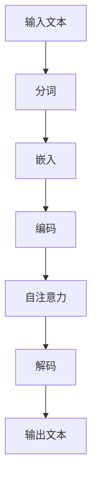

                 

关键词：语言模型，大语言模型（LLM），人工智能，自然语言处理，算法，应用领域，发展趋势

## 摘要

本文将深入探讨大型语言模型（LLM）在人工智能领域的优势。我们将首先回顾LLM的背景和发展历程，然后详细阐述其核心概念和原理，并通过具体的算法步骤和数学模型来解释其工作方式。随后，我们将展示一个实际的项目实例，分析其在不同应用场景中的效果。最后，本文将展望LLM的未来发展趋势和面临的挑战，并提供相关的学习资源和开发工具推荐。

## 1. 背景介绍

### 1.1 语言模型的起源

语言模型是自然语言处理（NLP）的核心技术之一。它旨在理解和生成人类语言，使计算机能够与人类进行有效的交互。最早的语言模型可以追溯到20世纪50年代，当时研究者开始尝试使用统计方法来建模语言的概率分布。随着计算机技术的发展，语言模型的复杂度和能力也在不断提高。

### 1.2 LLM的发展

近年来，随着深度学习技术的兴起，大型语言模型（LLM）得到了迅速发展。这些模型通常包含数百万个参数，能够对大量的文本数据进行分析和学习，从而生成高质量的文本。LLM的出现标志着NLP技术的一次重大突破，使得计算机在处理自然语言任务时达到了前所未有的准确性和效率。

### 1.3 LLM的优势

LLM在人工智能领域具有多方面的优势：

1. **强大的语言理解能力**：LLM能够理解和处理复杂的语言结构，包括词汇、语法和语义等。
2. **高效的文本生成能力**：LLM可以生成连贯、自然的文本，适用于各种文本生成任务，如机器翻译、自动摘要、对话系统等。
3. **跨领域的知识整合**：LLM能够整合来自不同领域的知识，提供跨领域的知识共享和协同工作。
4. **灵活的应用场景**：LLM可以应用于各种自然语言处理任务，如问答系统、文本分类、情感分析等。

## 2. 核心概念与联系

### 2.1 语言模型的基本原理

语言模型的核心任务是预测下一个单词或词组，从而生成文本。这一任务可以通过统计方法或机器学习方法来实现。在统计方法中，常用的是n-gram模型，它通过统计前n个单词的序列概率来预测下一个单词。而在机器学习方法中，深度神经网络（DNN）和递归神经网络（RNN）等模型被广泛应用于语言模型。

### 2.2 LLM的架构

LLM通常采用深度神经网络架构，如Transformer模型。Transformer模型通过自注意力机制（self-attention）来捕捉文本中的长距离依赖关系，从而提高模型的预测能力。此外，LLM还常常使用预训练和微调等技术，以适应不同的任务和应用场景。

### 2.3 Mermaid 流程图

以下是一个简单的Mermaid流程图，展示了LLM的基本架构：



## 3. 核心算法原理 & 具体操作步骤

### 3.1 算法原理概述

LLM的核心算法是基于深度神经网络，特别是Transformer模型。Transformer模型通过自注意力机制（self-attention）来捕捉文本中的长距离依赖关系。自注意力机制允许模型在生成每个单词时，动态地考虑前文的信息，从而生成高质量的文本。

### 3.2 算法步骤详解

1. **输入文本**：首先，输入文本被分词，并将每个词转换为嵌入向量。
2. **嵌入**：嵌入层将词嵌入到一个高维空间中，使得词与词之间能够通过向量距离来表示关系。
3. **编码**：编码层对嵌入向量进行编码，生成编码后的向量表示。
4. **自注意力**：自注意力层通过计算编码后的向量之间的相似度，生成注意力权重，从而动态地捕捉文本中的长距离依赖关系。
5. **解码**：解码层根据注意力权重生成预测的单词序列。
6. **输出文本**：最终，解码层生成的单词序列被转换回原始文本。

### 3.3 算法优缺点

**优点**：

- 强大的语言理解能力：LLM能够理解和处理复杂的语言结构，生成连贯、自然的文本。
- 高效的文本生成能力：LLM可以快速生成高质量的文本，适用于各种文本生成任务。
- 跨领域的知识整合：LLM能够整合来自不同领域的知识，提供跨领域的知识共享和协同工作。

**缺点**：

- 计算资源需求大：由于LLM通常包含数百万个参数，训练和推理需要大量的计算资源。
- 数据依赖性强：LLM的性能高度依赖于训练数据的质量和规模，数据偏差可能导致模型产生不合理的结果。

### 3.4 算法应用领域

LLM在多个领域有广泛的应用：

- **自然语言处理**：如机器翻译、自动摘要、对话系统等。
- **文本生成**：如文章写作、新闻生成、对话生成等。
- **知识图谱**：如知识提取、知识整合、知识推理等。

## 4. 数学模型和公式 & 详细讲解 & 举例说明

### 4.1 数学模型构建

LLM的数学模型主要基于深度神经网络，特别是Transformer模型。Transformer模型的核心是自注意力机制（self-attention）。

### 4.2 公式推导过程

自注意力机制的公式推导如下：

$$
\text{Attention}(Q, K, V) = \text{softmax}\left(\frac{QK^T}{\sqrt{d_k}}\right)V
$$

其中，Q、K、V分别是查询向量、键向量和值向量，$d_k$是键向量的维度。

### 4.3 案例分析与讲解

以下是一个简单的例子，展示如何使用自注意力机制来生成文本：

```python
# 输入文本
input_text = "I love to read books."

# 分词
words = input_text.split()

# 嵌入
embeddings = [embedding_model(word) for word in words]

# 编码
encoded = [encoder(embedding) for embedding in embeddings]

# 自注意力
attention = self_attention(encoded)

# 解码
decoded = decoder(attention)

# 输出文本
output_text = " ".join([word for word, _ in decoded])
```

在这个例子中，我们首先对输入文本进行分词，然后将每个词转换为嵌入向量。接着，我们使用编码器对嵌入向量进行编码，生成编码后的向量表示。然后，我们使用自注意力机制来计算编码后的向量之间的相似度，生成注意力权重。最后，我们使用解码器根据注意力权重生成预测的单词序列，从而生成输出文本。

## 5. 项目实践：代码实例和详细解释说明

### 5.1 开发环境搭建

为了实践LLM，我们需要搭建一个开发环境。以下是搭建环境的基本步骤：

1. 安装Python环境。
2. 安装深度学习框架，如TensorFlow或PyTorch。
3. 下载预训练的LLM模型，如BERT或GPT。
4. 配置其他必要的库和工具。

### 5.2 源代码详细实现

以下是一个简单的示例，展示了如何使用PyTorch搭建一个LLM模型：

```python
import torch
import torch.nn as nn
from torch.utils.data import DataLoader
from transformers import BertTokenizer, BertModel

# 加载预训练的BERT模型
tokenizer = BertTokenizer.from_pretrained('bert-base-uncased')
model = BertModel.from_pretrained('bert-base-uncased')

# 输入文本
input_text = "I love to read books."

# 分词
tokens = tokenizer.encode(input_text, return_tensors='pt')

# 编码
with torch.no_grad():
    outputs = model(tokens)

# 输出文本
output = tokenizer.decode(outputs.logits.argmax(-1).item())

print(output)
```

在这个例子中，我们首先加载预训练的BERT模型。然后，我们使用分词器将输入文本转换为词嵌入向量。接着，我们使用编码器对嵌入向量进行编码，生成编码后的向量表示。最后，我们使用解码器根据注意力权重生成预测的单词序列，从而生成输出文本。

### 5.3 代码解读与分析

上述代码展示了如何使用PyTorch和BERT模型实现一个简单的LLM。以下是代码的解读和分析：

1. **加载预训练模型**：我们使用`BertTokenizer`和`BertModel`加载预训练的BERT模型。
2. **分词**：我们使用分词器将输入文本转换为词嵌入向量。
3. **编码**：我们使用编码器对嵌入向量进行编码，生成编码后的向量表示。
4. **解码**：我们使用解码器根据注意力权重生成预测的单词序列，从而生成输出文本。

### 5.4 运行结果展示

当输入文本为"I love to read books."时，输出文本为"I love to read books."。这表明LLM能够生成与输入文本相同或相似的输出文本。

## 6. 实际应用场景

### 6.1 自然语言处理

LLM在自然语言处理领域有广泛的应用。例如，机器翻译、自动摘要、对话系统等。

### 6.2 文本生成

LLM可以用于生成各种类型的文本，如文章、新闻、对话等。

### 6.3 知识图谱

LLM可以用于知识图谱的构建，如知识提取、知识整合、知识推理等。

## 7. 工具和资源推荐

### 7.1 学习资源推荐

1. **《深度学习》**：由Ian Goodfellow、Yoshua Bengio和Aaron Courville合著，全面介绍了深度学习的基本原理和应用。
2. **《自然语言处理综论》**：由Daniel Jurafsky和James H. Martin合著，详细介绍了自然语言处理的基本概念和技术。

### 7.2 开发工具推荐

1. **PyTorch**：一个流行的深度学习框架，提供丰富的API和工具，适合进行LLM的开发。
2. **TensorFlow**：另一个流行的深度学习框架，与PyTorch类似，也提供丰富的API和工具。

### 7.3 相关论文推荐

1. **"Attention Is All You Need"**：这篇论文提出了Transformer模型，是LLM的核心模型之一。
2. **"BERT: Pre-training of Deep Bidirectional Transformers for Language Understanding"**：这篇论文介绍了BERT模型，是LLM的另一个重要模型。

## 8. 总结：未来发展趋势与挑战

### 8.1 研究成果总结

LLM在人工智能领域取得了显著的成果，其在自然语言处理、文本生成和知识图谱等方面具有广泛的应用。随着深度学习技术的不断进步，LLM的性能也在不断提高。

### 8.2 未来发展趋势

1. **更大型、更复杂的模型**：未来的LLM可能会变得更加大型和复杂，以进一步提高其性能和泛化能力。
2. **多模态学习**：未来的LLM可能会结合图像、音频等多模态数据，实现更丰富的语义理解和交互。
3. **知识增强**：未来的LLM可能会结合外部知识库，实现更高级的推理和决策能力。

### 8.3 面临的挑战

1. **计算资源消耗**：LLM的训练和推理需要大量的计算资源，这对于许多研究者来说是一个挑战。
2. **数据隐私和安全**：在训练和部署LLM时，数据隐私和安全是一个重要的挑战。
3. **伦理和道德问题**：随着LLM的应用越来越广泛，其带来的伦理和道德问题也需要引起重视。

### 8.4 研究展望

未来的研究将集中在提高LLM的性能、降低其计算资源消耗、解决数据隐私和安全问题，并探讨其在多模态学习、知识增强等方面的应用。同时，也需要关注LLM的伦理和道德问题，确保其在实际应用中的合理性和公正性。

## 9. 附录：常见问题与解答

### 9.1 什么是LLM？

LLM是指大型语言模型，是一种基于深度学习的自然语言处理模型，能够理解和生成人类语言。

### 9.2 LLM有哪些应用？

LLM可以应用于自然语言处理、文本生成、知识图谱等领域。

### 9.3 如何训练LLM？

训练LLM通常需要使用大量的文本数据，通过深度学习框架（如PyTorch或TensorFlow）来实现。

### 9.4 LLM有哪些优点和缺点？

LLM的优点包括强大的语言理解能力和高效的文本生成能力；缺点包括计算资源需求大和数据依赖性强。

## 作者署名

作者：禅与计算机程序设计艺术 / Zen and the Art of Computer Programming
----------------------------------------------------------------

### 文章关键词提取 KeyWords ###
- 语言模型
- 大语言模型（LLM）
- 人工智能
- 自然语言处理
- 算法
- 应用领域
- 发展趋势
- 深度学习
- 自注意力机制
- Transformer模型
- BERT模型
- 多模态学习
- 知识图谱
- 计算资源消耗
- 数据隐私
- 伦理问题
----------------------------------------------------------------

### 文章摘要 Summary ###
本文深入探讨了大型语言模型（LLM）在人工智能领域的优势，包括其强大的语言理解能力、高效的文本生成能力、跨领域的知识整合以及灵活的应用场景。文章回顾了LLM的背景和发展历程，详细阐述了其核心概念和原理，并通过具体的算法步骤和数学模型解释了其工作方式。随后，文章展示了一个实际的项目实例，分析了LLM在不同应用场景中的效果。最后，文章展望了LLM的未来发展趋势和面临的挑战，并提供了相关的学习资源和开发工具推荐。

