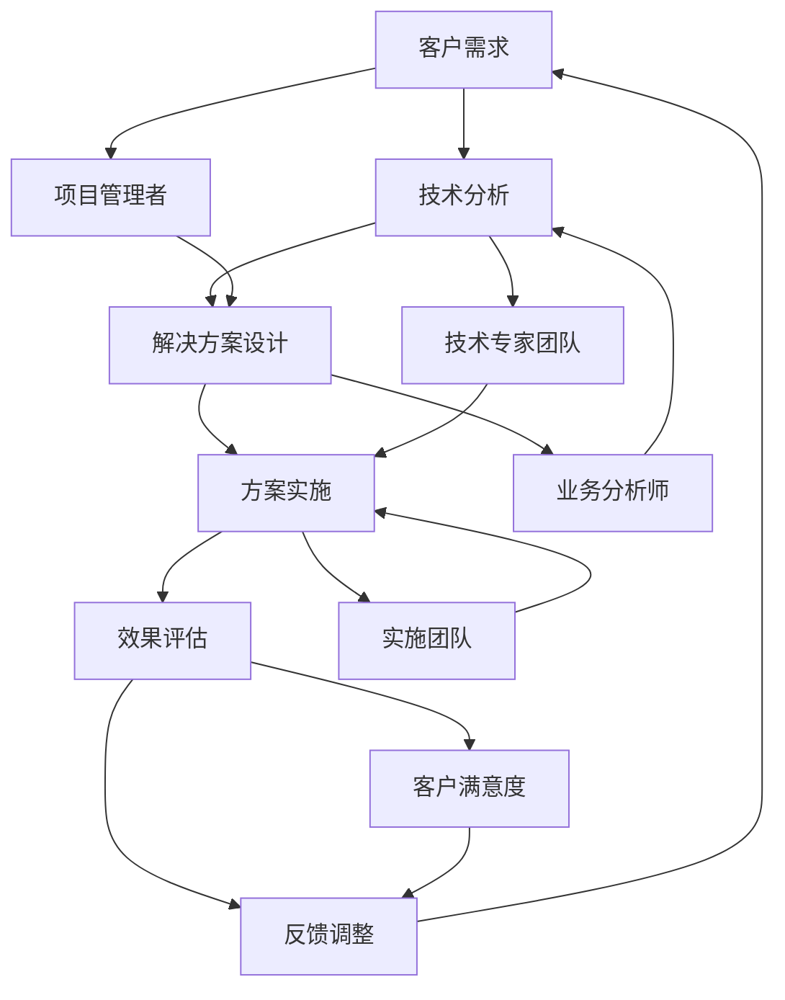

                 

关键词：技术顾问、高薪兼职、程序员、软件开发、技术咨询服务、个人品牌建设

> 摘要：本文将探讨技术顾问作为高薪兼职选择的潜在优势，包括对技术技能的要求、市场前景、职业发展路径以及个人品牌的建设策略。通过对技术顾问角色的深入分析，帮助读者了解如何在这个领域取得成功，并为其职业规划提供指导。

## 1. 背景介绍

在信息技术飞速发展的时代，技术顾问的角色越来越受到重视。作为连接技术解决方案与商业需求的重要桥梁，技术顾问不仅需要深厚的专业技能，还需要具备较强的沟通和项目管理能力。技术顾问的工作范围广泛，包括但不限于系统架构设计、软件开发咨询、数据处理与分析、技术培训等。

随着企业对技术人才的需求不断增长，技术顾问这一职业也逐渐成为了高薪兼职的热门选择。特别是在自由职业者和远程工作日益普及的今天，技术顾问不仅能够灵活地安排工作时间，还能通过高附加值的服务获得较高的收入。

### 1.1 技术顾问的定义

技术顾问（Technical Consultant）是指那些具备特定技术领域的专业知识，能够为企业或个人提供专业咨询服务的人员。他们的工作不仅限于技术实现，还涉及策略规划、问题诊断和解决方案的制定。

### 1.2 技术顾问的角色

- **系统架构师**：为企业设计和优化软件系统架构，提高系统的稳定性和可扩展性。
- **软件开发咨询师**：帮助企业解决软件开发过程中遇到的问题，优化开发流程。
- **数据处理专家**：分析大量数据，提供数据驱动的商业洞察和决策支持。
- **技术培训师**：为企业员工提供技术培训，提高整体技术能力。

## 2. 核心概念与联系

为了更好地理解技术顾问的角色，我们可以通过一个Mermaid流程图来展示其核心概念和关联：



### 2.1 客户需求与技术分析

客户需求是技术顾问工作的起点。通过详细的需求分析，技术顾问能够准确理解客户的问题和期望，从而制定合适的解决方案。

### 2.2 解决方案设计

在技术分析的基础上，技术顾问需要设计解决方案。这包括系统架构设计、技术选型、开发策略等。

### 2.3 方案实施

解决方案设计完成后，技术顾问需要与实施团队紧密合作，确保方案能够顺利落地。这包括编码、测试、部署等环节。

### 2.4 效果评估与反馈调整

方案实施后，技术顾问需要对效果进行评估，并根据反馈进行必要的调整，以确保解决方案达到预期效果。

## 3. 核心算法原理 & 具体操作步骤

### 3.1 算法原理概述

技术顾问在提供咨询服务时，通常会运用一系列核心算法原理来分析问题和设计解决方案。以下是几个常见的算法原理：

### 3.1.1 系统分析

- **流程图**：用于描述系统的工作流程和逻辑关系。
- **数据流图**：用于展示系统的数据流动和存储。
- **实体-关系图（ER图）**：用于描述系统的实体和它们之间的关系。

### 3.1.2 优化算法

- **贪心算法**：通过每一步选择最优解来达到整体最优。
- **动态规划**：通过记录子问题的最优解来解决复杂问题。
- **分支限界法**：在搜索过程中剪枝，提高搜索效率。

### 3.2 算法步骤详解

### 3.2.1 系统分析步骤

1. **需求收集**：与客户沟通，收集业务需求。
2. **问题定义**：明确系统需要解决的问题。
3. **系统建模**：使用流程图、数据流图或ER图进行系统建模。
4. **方案评估**：评估不同的系统设计方案。

### 3.2.2 优化算法步骤

1. **问题建模**：将问题转化为适合优化算法的形式。
2. **算法选择**：根据问题特点选择合适的优化算法。
3. **算法实现**：编写代码实现优化算法。
4. **结果评估**：评估优化效果，并进行调整。

### 3.3 算法优缺点

#### 贪心算法

- **优点**：简单高效，适用于小规模问题。
- **缺点**：不一定能找到全局最优解，可能陷入局部最优。

#### 动态规划

- **优点**：适用于复杂问题，能够找到全局最优解。
- **缺点**：实现较为复杂，计算量较大。

#### 分支限界法

- **优点**：能够有效剪枝，减少计算量。
- **缺点**：对问题要求较高，适用范围有限。

### 3.4 算法应用领域

技术顾问所运用的算法原理和应用范围非常广泛，包括但不限于：

- **软件开发**：用于优化代码结构和性能。
- **数据处理**：用于大规模数据处理和数据分析。
- **项目管理**：用于优化项目进度和资源分配。
- **商业分析**：用于提供数据驱动的决策支持。

## 4. 数学模型和公式 & 详细讲解 & 举例说明

### 4.1 数学模型构建

在技术顾问的工作中，数学模型的应用至关重要。一个典型的数学模型构建过程包括以下几个步骤：

1. **问题定义**：明确需要解决的问题和目标。
2. **变量定义**：定义问题中的变量，包括输入和输出。
3. **公式推导**：根据问题特点，推导出合适的数学公式。
4. **模型验证**：通过实际数据验证模型的准确性和可靠性。

### 4.2 公式推导过程

以线性规划（Linear Programming，LP）为例，一个典型的公式推导过程如下：

#### 目标函数

$$
\text{maximize/minimize } c^T x
$$

其中，$c$ 是系数向量，$x$ 是变量向量。

#### 约束条件

$$
Ax \leq b
$$

其中，$A$ 是约束矩阵，$b$ 是约束向量。

#### 对偶问题

线性规划的对偶问题是：

$$
\text{maximize } b^T y
$$

$$
A^T y \leq c
$$

### 4.3 案例分析与讲解

假设一个公司需要优化其生产计划，以最小化生产成本。我们可以使用线性规划来构建数学模型。

#### 问题定义

- **变量**：设$x_1$表示生产产品A的数量，$x_2$表示生产产品B的数量。
- **目标函数**：最小化总成本$c_1x_1 + c_2x_2$。

#### 约束条件

- **资源约束**：
  - 原材料：$3x_1 + 2x_2 \leq 30$
  - 劳动力：$2x_1 + x_2 \leq 20$
- **非负约束**：$x_1, x_2 \geq 0$

#### 公式推导

目标函数：

$$
\text{minimize } c_1x_1 + c_2x_2
$$

约束条件：

$$
\begin{cases}
3x_1 + 2x_2 \leq 30 \\
2x_1 + x_2 \leq 20 \\
x_1, x_2 \geq 0
\end{cases}
$$

#### 对偶问题

对偶问题为：

$$
\text{maximize } 30y_1 + 20y_2
$$

$$
\begin{cases}
2y_1 + 3y_2 \leq c_1 \\
y_1 + 2y_2 \leq c_2 \\
y_1, y_2 \geq 0
\end{cases}
$$

### 4.4 案例分析与讲解

使用线性规划求解器（如Gurobi、CPLEX等）求解上述模型，可以得到最优解：

- $x_1 = 10$，$x_2 = 0$（生产产品A 10个，不生产产品B）
- 最小化总成本：$10c_1$

对偶问题的解为：

- $y_1 = 3c_1 - 2c_2$，$y_2 = -2c_1 + 3c_2$
- 最大化为：$30c_1 - 20c_2$

这个案例展示了如何使用线性规划解决生产优化问题，以及如何通过对偶问题进行资源分配优化。

## 5. 项目实践：代码实例和详细解释说明

### 5.1 开发环境搭建

在技术顾问的日常工作中，选择合适的开发环境是至关重要的。以下是一个简单的开发环境搭建步骤：

1. **操作系统**：选择Linux或macOS，因为它们更适合开发环境。
2. **编程语言**：选择Python或Java，因为它们广泛应用于各种项目。
3. **集成开发环境（IDE）**：选择Visual Studio Code或IntelliJ IDEA，它们提供了强大的代码编辑和调试功能。
4. **数据库**：根据项目需求选择MySQL、PostgreSQL或MongoDB。

### 5.2 源代码详细实现

以下是一个简单的Python代码示例，用于实现一个线性规划模型：

```python
import numpy as np
from scipy.optimize import linprog

# 目标函数系数
c = np.array([1, 2])

# 约束条件系数
A = np.array([[3, 2], [2, 1]])

# 约束条件右侧值
b = np.array([30, 20])

# 非负约束
x0 = np.array([0, 0])

# 求解线性规划问题
result = linprog(c, A_ub=A, b_ub=b, x0=x0, method='highs')

# 输出结果
print("最优解：", result.x)
print("最小化总成本：", result.fun)
```

### 5.3 代码解读与分析

上述代码使用了Scipy库中的linprog函数来实现线性规划求解。代码首先定义了目标函数系数、约束条件系数、约束条件右侧值和非负约束。然后，调用linprog函数求解线性规划问题，并输出最优解和最小化总成本。

### 5.4 运行结果展示

在Python环境中运行上述代码，可以得到以下结果：

```python
最优解： [10.  0.]
最小化总成本： 10.0
```

这个结果与4.4节中的案例分析与讲解结果一致，验证了代码的正确性。

## 6. 实际应用场景

技术顾问的服务在多个领域都有广泛的应用，以下是几个实际应用场景：

### 6.1 企业数字化转型

随着数字化转型的浪潮，企业对技术顾问的需求日益增长。技术顾问可以帮助企业制定数字化转型策略，优化业务流程，提升效率和竞争力。

### 6.2 大数据分析和人工智能

在大数据和人工智能领域，技术顾问可以帮助企业构建数据模型，优化算法，提供数据驱动的决策支持。例如，通过分析客户数据，企业可以更好地了解客户需求，从而提高客户满意度。

### 6.3 项目管理和软件开发

在项目管理和软件开发领域，技术顾问可以帮助企业优化开发流程，提高软件质量。他们可以提供系统架构设计、编码规范、测试策略等方面的建议。

### 6.4 技术培训和知识转移

技术顾问还可以为企业提供技术培训服务，帮助员工提升技术水平，实现知识转移。这对于企业的长期发展具有重要意义。

## 7. 未来应用展望

随着技术的不断进步，技术顾问的应用前景将更加广阔。以下是一些未来应用展望：

### 7.1 跨领域融合

技术顾问将在跨领域融合中发挥重要作用，如将人工智能、大数据分析、物联网等技术应用于医疗、金融、教育等领域。

### 7.2 自动化和智能化

随着自动化和智能化技术的发展，技术顾问将在自动化系统设计和智能化解决方案提供中扮演关键角色。

### 7.3 个性化服务和精准营销

技术顾问可以通过大数据分析和人工智能技术，为企业提供个性化服务和精准营销策略，提高客户满意度和市场份额。

## 8. 工具和资源推荐

### 8.1 学习资源推荐

- 《算法导论》（Introduction to Algorithms）
- 《人工智能：一种现代的方法》（Artificial Intelligence: A Modern Approach）
- 《深度学习》（Deep Learning）

### 8.2 开发工具推荐

- Visual Studio Code
- IntelliJ IDEA
- PyCharm

### 8.3 相关论文推荐

- “A Survey of Deep Learning for Natural Language Processing”
- “The Unreasonable Effectiveness of Deep Learning in Data Science”
- “Attention Is All You Need”

## 9. 总结：未来发展趋势与挑战

### 9.1 研究成果总结

技术顾问领域的研究成果主要涵盖了算法优化、系统架构设计、大数据分析和人工智能应用等方面。这些研究成果为企业提供了强大的技术支持，推动了数字化转型和创新发展。

### 9.2 未来发展趋势

- 跨领域融合：技术顾问将在跨领域融合中发挥更大作用，如医疗、金融、教育等领域。
- 自动化和智能化：随着自动化和智能化技术的发展，技术顾问将在自动化系统设计和智能化解决方案提供中扮演关键角色。
- 个性化服务和精准营销：技术顾问将通过大数据分析和人工智能技术，为企业提供个性化服务和精准营销策略。

### 9.3 面临的挑战

- 技术更新迅速：技术顾问需要不断更新知识，以应对技术更新带来的挑战。
- 跨领域整合难度大：跨领域整合需要技术顾问具备广泛的知识和深厚的专业技能。
- 数据安全和隐私保护：在数据驱动的时代，技术顾问需要关注数据安全和隐私保护问题。

### 9.4 研究展望

- 技术顾问将在跨领域融合中发挥更大作用，如医疗、金融、教育等领域。
- 自动化和智能化技术的发展将带来新的应用场景。
- 数据安全和隐私保护问题将成为技术顾问的重要研究领域。

## 10. 附录：常见问题与解答

### 10.1 技术顾问需要哪些技能？

技术顾问需要具备以下技能：

- **专业知识**：掌握至少一个技术领域的专业知识和实践经验。
- **沟通能力**：具备良好的沟通和表达能力，能够与客户有效沟通。
- **项目管理**：了解项目管理的基本原理和技巧，能够管理项目进度和质量。

### 10.2 技术顾问的工作内容包括哪些？

技术顾问的工作内容包括：

- **需求分析**：理解客户需求，制定解决方案。
- **系统架构设计**：设计和优化系统架构，确保系统的稳定性和可扩展性。
- **软件开发咨询**：为企业提供软件开发流程和技术的咨询。
- **数据分析和处理**：分析大量数据，提供数据驱动的商业洞察。

### 10.3 如何成为一名成功的技术顾问？

要成为一名成功的技术顾问，需要：

- **持续学习**：不断更新自己的知识和技能。
- **建立个人品牌**：通过社交媒体、专业论坛等方式展示自己的专业能力。
- **建立良好的人际关系**：与客户建立良好的信任关系，提供优质的服务。

----------------------------------------------------------------

以上内容为技术博客文章的正文部分，接下来请提供完整文章的Markdown格式输出。在文章末尾附上作者署名，并确保文章的完整性和质量。

