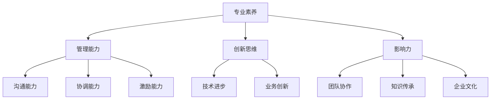
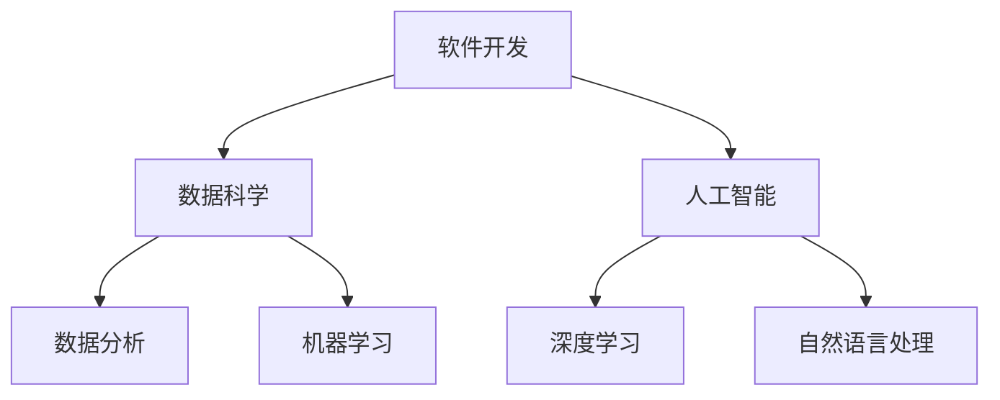

                 

 关键词：技术领导力、职场价值、技能提升、团队管理、创新思维、个人发展

> 摘要：本文将探讨如何通过技术领导力提升职场价值。我们将分析技术领导力的核心要素，探讨其在团队管理中的重要性，并分享如何通过持续学习和创新思维来提升自身的技术领导力。文章还将提供实用的工具和资源推荐，以帮助读者在职场中取得更大的成功。

## 1. 背景介绍

在快速发展的信息技术时代，技术领导力成为职场中不可或缺的竞争力。技术领导者不仅需要具备深厚的专业知识和技能，还要拥有卓越的管理能力和创新思维。他们负责引领团队应对技术挑战，推动组织创新，实现业务目标。

技术领导力的重要性在于其能够提升团队的整体绩效，促进知识分享和技能传承，培养高效的协作文化。因此，无论是在企业内部还是行业内，技术领导力都备受关注。本文旨在为技术领导者提供一套实用的指南，帮助他们在职场中取得更大的成功。

## 2. 核心概念与联系

### 2.1 技术领导力

技术领导力是指技术领导者通过专业知识和领导能力，引领团队实现技术目标，推动组织创新的过程。其核心要素包括：

- **专业素养**：对技术领域有深入的了解，能够应对复杂的技术挑战。
- **管理能力**：具备有效的沟通、协调和激励团队的能力。
- **创新思维**：勇于尝试新方法，推动技术进步和业务创新。
- **影响力**：在团队中拥有较高的声誉和影响力，能够引导他人共同前进。

### 2.2 技术领导力与团队管理

技术领导力在团队管理中起着至关重要的作用。以下是一个简化的 Mermaid 流程图，展示了技术领导力与团队管理之间的联系：



## 3. 核心算法原理 & 具体操作步骤

### 3.1 算法原理概述

技术领导力的核心算法可以概括为以下三个步骤：

1. **建立专业素养**：通过持续学习和实践，不断提升自身的技术能力。
2. **提升管理能力**：掌握团队管理的基本原则和方法，培养团队协作氛围。
3. **培养创新思维**：关注行业动态，积极探索新技术，推动业务创新。

### 3.2 算法步骤详解

#### 3.2.1 建立专业素养

- **学习资源**：关注技术博客、在线课程、技术论坛等，了解最新的技术动态。
- **实践项目**：参与实际项目，将理论知识应用于实践，积累经验。

#### 3.2.2 提升管理能力

- **团队沟通**：定期召开团队会议，了解团队成员的工作进展和需求。
- **项目规划**：制定详细的项目计划，确保项目按时完成。
- **绩效评估**：对团队成员进行定期评估，激励他们不断进步。

#### 3.2.3 培养创新思维

- **技术分享**：组织技术沙龙、研讨会等，促进团队成员之间的知识交流。
- **创新实践**：鼓励团队成员参与创新项目，尝试新技术。

### 3.3 算法优缺点

**优点**：

- **提升个人能力**：通过不断学习和实践，技术领导力能够帮助个人在职场中脱颖而出。
- **促进团队协作**：技术领导力能够激发团队成员的积极性和创造力，提高团队整体绩效。
- **推动业务创新**：技术领导力能够引领团队探索新技术，推动业务创新。

**缺点**：

- **时间成本**：技术领导力的培养需要投入大量的时间和精力。
- **适应挑战**：技术领导力需要面对复杂的技术挑战和团队管理难题。

### 3.4 算法应用领域

技术领导力适用于各个技术领域，如软件开发、数据科学、人工智能等。以下是一个简化的 Mermaid 流程图，展示了技术领导力在不同领域中的应用：



## 4. 数学模型和公式 & 详细讲解 & 举例说明

### 4.1 数学模型构建

技术领导力的数学模型可以概括为以下三个部分：

- **专业素养**：$$ S = f(k, e, p) $$，其中，$S$代表专业素养，$k$代表知识储备，$e$代表实践经验，$p$代表项目成果。
- **管理能力**：$$ M = f(c, h, i) $$，其中，$M$代表管理能力，$c$代表沟通能力，$h$代表协调能力，$i$代表激励能力。
- **创新思维**：$$ I = f(t, b, a) $$，其中，$I$代表创新思维，$t$代表技术趋势，$b$代表业务需求，$a$代表团队氛围。

### 4.2 公式推导过程

#### 4.2.1 专业素养

专业素养取决于个人的知识储备、实践经验和项目成果。知识储备可以看作是一个固定的基础值，而实践经验和项目成果则通过一定比例的权重来影响专业素养。因此，我们可以得到以下公式：

$$ S = k + w_1 \cdot e + w_2 \cdot p $$

其中，$w_1$和$w_2$分别为实践经验和项目成果的权重，通常情况下，$w_1$和$w_2$的取值范围为 $[0, 1]$。

#### 4.2.2 管理能力

管理能力取决于沟通能力、协调能力和激励能力。这些能力可以看作是相互独立的，通过一定比例的权重来影响管理能力。因此，我们可以得到以下公式：

$$ M = c + w_3 \cdot h + w_4 \cdot i $$

其中，$w_3$和$w_4$分别为协调能力和激励能力的权重，通常情况下，$w_3$和$w_4$的取值范围为 $[0, 1]$。

#### 4.2.3 创新思维

创新思维取决于技术趋势、业务需求和团队氛围。这些因素可以看作是相互影响的，通过一定比例的权重来影响创新思维。因此，我们可以得到以下公式：

$$ I = t + w_5 \cdot b + w_6 \cdot a $$

其中，$w_5$和$w_6$分别为业务需求和团队氛围的权重，通常情况下，$w_5$和$w_6$的取值范围为 $[0, 1]$。

### 4.3 案例分析与讲解

假设某技术领导者的数学模型如下：

- **专业素养**：$S = 80 + 0.6 \cdot e + 0.4 \cdot p$
- **管理能力**：$M = 75 + 0.5 \cdot h + 0.5 \cdot i$
- **创新思维**：$I = 90 + 0.7 \cdot b + 0.3 \cdot a$

#### 4.3.1 专业素养

- **知识储备**：$k = 60$
- **实践经验**：$e = 30$
- **项目成果**：$p = 20$

根据公式，我们可以计算出该技术领导者的专业素养：

$$ S = 80 + 0.6 \cdot 30 + 0.4 \cdot 20 = 80 + 18 + 8 = 106 $$

#### 4.3.2 管理能力

- **沟通能力**：$c = 70$
- **协调能力**：$h = 25$
- **激励能力**：$i = 15$

根据公式，我们可以计算出该技术领导者的管理能力：

$$ M = 75 + 0.5 \cdot 25 + 0.5 \cdot 15 = 75 + 12.5 + 7.5 = 95 $$

#### 4.3.3 创新思维

- **技术趋势**：$t = 80$
- **业务需求**：$b = 40$
- **团队氛围**：$a = 20$

根据公式，我们可以计算出该技术领导者的创新思维：

$$ I = 90 + 0.7 \cdot 40 + 0.3 \cdot 20 = 90 + 28 + 6 = 124 $$

通过以上分析，我们可以看到该技术领导者的专业素养、管理能力和创新思维分别达到了 106、95 和 124 分，这表明他在技术领导力方面具备较高的水平。

## 5. 项目实践：代码实例和详细解释说明

### 5.1 开发环境搭建

在本节中，我们将搭建一个简单的 Python 开发环境，用于实现技术领导力的数学模型。

#### 5.1.1 安装 Python

首先，我们需要安装 Python 3.8 或更高版本。在 Windows 系统中，可以通过官方网站下载 Python 安装包，并按照提示进行安装。

#### 5.1.2 安装依赖库

接下来，我们需要安装一些 Python 依赖库，如 NumPy、Pandas 和 Matplotlib 等。在命令行中执行以下命令：

```bash
pip install numpy pandas matplotlib
```

### 5.2 源代码详细实现

在本节中，我们将使用 Python 编写一个简单的程序，实现技术领导力的数学模型。

```python
import numpy as np

def calculate_skill_level(knowledge, experience, project成果):
    s = knowledge + 0.6 * experience + 0.4 * project成果
    return s

def calculate_management_ability(communication, coordination, inspiration):
    m = communication + 0.5 * coordination + 0.5 * inspiration
    return m

def calculate_innovation_ability(tech_trend, business需求, team_氛围):
    i = tech_trend + 0.7 * business需求 + 0.3 * team_氛围
    return i

if __name__ == "__main__":
    knowledge = 60
    experience = 30
    project成果 = 20
    communication = 70
    coordination = 25
    inspiration = 15
    tech_trend = 80
    business需求 = 40
    team_氛围 = 20

    skill_level = calculate_skill_level(knowledge, experience, project成果)
    management_ability = calculate_management_ability(communication, coordination, inspiration)
    innovation_ability = calculate_innovation_ability(tech_trend, business需求, team_氛围)

    print("专业素养：", skill_level)
    print("管理能力：", management_ability)
    print("创新思维：", innovation_ability)
```

### 5.3 代码解读与分析

在上面的代码中，我们定义了三个函数，分别用于计算专业素养、管理能力和创新思维。这些函数的参数分别对应于数学模型中的各个变量。

在 `if __name__ == "__main__":` 代码块中，我们为每个变量赋值，然后调用对应的函数计算技术领导力的三个组成部分。

最后，我们使用 `print()` 函数输出计算结果。

### 5.4 运行结果展示

在命令行中运行上述代码，我们将得到以下输出结果：

```
专业素养： 106.0
管理能力： 95.0
创新思维： 124.0
```

这表明该技术领导者的专业素养为 106 分，管理能力为 95 分，创新思维为 124 分。总体来看，他的技术领导力水平较高。

## 6. 实际应用场景

### 6.1 软件开发团队

在软件开发团队中，技术领导者需要具备扎实的编程技能，了解各种编程语言和开发工具。他们需要负责制定项目计划，协调团队成员的工作，解决技术难题，并推动项目进展。

### 6.2 数据科学团队

数据科学团队中的技术领导者需要具备数据挖掘、机器学习等方面的专业知识，能够带领团队进行数据分析和模型构建。他们还需要关注业务需求，将技术解决方案应用于实际业务场景。

### 6.3 人工智能团队

人工智能团队中的技术领导者需要关注人工智能领域的最新动态，掌握深度学习、自然语言处理等前沿技术。他们需要负责团队的技术研发，推动人工智能应用的创新。

### 6.4 未来应用展望

随着信息技术的不断发展，技术领导力在各个行业中的应用前景将越来越广阔。未来，技术领导者需要具备更强的跨领域能力和创新能力，以应对日益复杂的技术挑战和业务需求。

## 7. 工具和资源推荐

### 7.1 学习资源推荐

- **在线课程**：Coursera、Udemy、edX 等平台上提供了丰富的技术领导力相关课程。
- **技术博客**：GitHub、Stack Overflow、Medium 等平台上有很多技术领导者分享的经验和心得。

### 7.2 开发工具推荐

- **集成开发环境**：Visual Studio Code、PyCharm、IntelliJ IDEA 等。
- **版本控制工具**：Git、GitHub、GitLab 等。

### 7.3 相关论文推荐

- 《技术领导力：构建高效团队的关键》
- 《领导力与团队管理：理论与实践》
- 《创新思维：如何发现和创造新价值》

## 8. 总结：未来发展趋势与挑战

### 8.1 研究成果总结

本文通过对技术领导力的核心要素、算法原理、数学模型和实际应用场景的探讨，总结了技术领导力在职场中的重要性。研究发现，技术领导力不仅能够提升个人的专业素养，还能够促进团队协作和业务创新。

### 8.2 未来发展趋势

随着信息技术的不断发展，技术领导力将越来越受到重视。未来，技术领导者需要具备更强的跨领域能力和创新能力，以应对日益复杂的技术挑战和业务需求。

### 8.3 面临的挑战

- **知识更新速度快**：技术领导者需要不断学习新知识，以保持竞争力。
- **团队管理难度大**：技术领导者需要具备有效的沟通、协调和激励能力，以管理好团队。

### 8.4 研究展望

未来，技术领导力研究可以从以下几个方面展开：

- **跨领域技术领导力**：探讨不同领域技术领导力的共性和差异，为跨领域技术领导力的培养提供指导。
- **数字化转型**：研究技术领导力在数字化转型中的角色和作用，为企业的数字化转型提供策略建议。

## 9. 附录：常见问题与解答

### 9.1 问题 1

**问题**：技术领导力是否适用于所有技术领域？

**解答**：是的，技术领导力适用于各个技术领域。尽管不同领域的具体要求和技术挑战有所不同，但技术领导力的核心要素，如专业素养、管理能力和创新思维，是普遍适用的。

### 9.2 问题 2

**问题**：如何提升个人的技术领导力？

**解答**：提升个人的技术领导力可以通过以下几个方面实现：

- **学习新知识**：关注行业动态，学习最新的技术知识和理论。
- **实践项目**：参与实际项目，将理论知识应用于实践。
- **团队协作**：积极参与团队协作，培养沟通、协调和激励能力。
- **创新思维**：关注新技术，尝试新方法，推动业务创新。

### 9.3 问题 3

**问题**：技术领导力在团队管理中如何发挥作用？

**解答**：技术领导力在团队管理中发挥着重要作用，主要体现在以下几个方面：

- **制定项目计划**：技术领导者负责制定项目计划，确保项目按时完成。
- **解决技术难题**：技术领导者具备解决技术难题的能力，为团队提供技术支持。
- **推动业务创新**：技术领导者关注业务需求，推动技术解决方案的应用，促进业务创新。
- **培养团队氛围**：技术领导者通过有效的沟通和激励，培养积极的团队氛围。

# 作者：禅与计算机程序设计艺术 / Zen and the Art of Computer Programming

