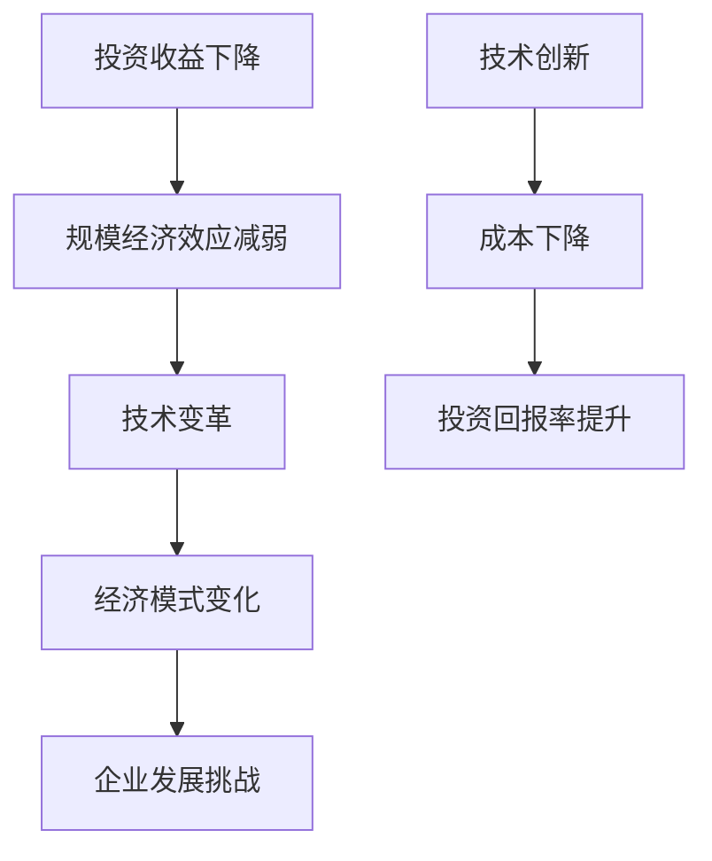

                 

关键词：投资收益、规模经济、效应减弱、技术变革、经济模式、企业发展。

摘要：随着技术进步和市场竞争的加剧，投资收益下降和规模经济效应减弱成为现代企业面临的普遍问题。本文将探讨这一现象的成因、影响以及应对策略，并结合IT领域实例，分析未来发展的趋势和挑战。

## 1. 背景介绍

在过去的几十年里，规模经济效应一直是企业追求的重要目标。规模经济意味着通过扩大生产规模来降低单位成本，从而提高投资收益。企业通过规模扩张来获得成本优势，从而在激烈的市场竞争中立于不败之地。然而，随着技术的快速发展，这一传统的经济模式正在受到挑战。

### 1.1 投资收益下降

首先，投资收益下降的问题日益凸显。在过去的几年里，许多行业都面临着利润率下降的趋势。原因有很多，包括全球经济增长放缓、市场竞争加剧、技术创新成本上升等。特别是在IT领域，随着云计算、人工智能等新兴技术的广泛应用，企业需要不断投入大量资金来保持竞争力，这导致传统投资回报率的下降。

### 1.2 规模经济效应减弱

其次，规模经济效应的减弱也是不容忽视的问题。在传统行业中，企业通过扩大规模来实现成本优势。然而，在技术驱动型行业，如IT和生物科技，规模经济效应正在减弱。这是由于技术创新的速度加快，企业可以通过较小的规模实现高效的生产和运营，从而减少了规模带来的成本优势。

## 2. 核心概念与联系

为了更好地理解投资收益下降和规模经济效应减弱的问题，我们需要从以下几个核心概念入手：

### 2.1 投资收益

投资收益是指企业通过投资获得的回报。它通常通过投资回报率（ROI）来衡量，即投资收益与投资成本的比率。投资收益下降意味着企业获得的回报相对于投资成本在减少。

### 2.2 规模经济

规模经济是指企业通过扩大生产规模来降低单位成本，从而提高投资收益。规模经济效应通常在传统行业中较为显著，如制造业和建筑业。

### 2.3 技术变革

技术变革是指新技术的发展和应用，它改变了传统行业的运作方式，从而对规模经济效应和投资收益产生了影响。

### 2.4 经济模式

经济模式是指企业在特定市场环境下采取的商业模式和战略。随着技术变革，传统的经济模式正在受到挑战，新的商业模式不断涌现。

### 2.5 企业发展

企业发展是指企业在市场中的成长过程。在投资收益下降和规模经济效应减弱的背景下，企业需要寻找新的增长点和发展策略。

### 2.6 Mermaid 流程图



## 3. 核心算法原理 & 具体操作步骤

### 3.1 算法原理概述

为了应对投资收益下降和规模经济效应减弱的问题，企业需要采用新的算法原理和操作步骤。以下是一种可能的解决方案：

- **数据挖掘**：通过数据挖掘技术，分析市场趋势和消费者行为，为企业提供决策支持。
- **机器学习**：利用机器学习算法，优化生产流程和供应链管理，提高效率。
- **区块链技术**：应用区块链技术，确保数据安全，降低交易成本。
- **云计算**：利用云计算平台，实现资源的灵活调度和优化，降低运营成本。

### 3.2 算法步骤详解

1. **数据收集**：收集市场数据、消费者数据、生产数据等。
2. **数据处理**：对数据进行清洗、整合和处理，提取有用的信息。
3. **数据建模**：利用数据挖掘和机器学习技术，建立预测模型和优化模型。
4. **模型应用**：将模型应用于实际业务场景，优化生产流程和供应链管理。
5. **结果评估**：评估模型的效果，持续迭代和优化。

### 3.3 算法优缺点

- **优点**：通过算法优化，可以提高生产效率和投资收益，降低运营成本。
- **缺点**：算法开发和应用需要大量资金和技术投入，且可能面临数据安全和隐私问题。

### 3.4 算法应用领域

算法在投资收益下降和规模经济效应减弱中的应用非常广泛，包括但不限于：

- **制造业**：通过优化生产流程和供应链管理，提高生产效率和降低成本。
- **零售业**：通过数据分析和消费者行为预测，优化库存管理和销售策略。
- **金融行业**：通过风险评估和投资组合优化，提高投资收益。

## 4. 数学模型和公式 & 详细讲解 & 举例说明

### 4.1 数学模型构建

为了解决投资收益下降和规模经济效应减弱的问题，我们可以构建以下数学模型：

1. **成本函数**：C(q) = aq + b
2. **收益函数**：R(q) = cq
3. **利润函数**：π(q) = R(q) - C(q)

其中，q 为产量，a 和 b 为常数，c 为价格。

### 4.2 公式推导过程

1. **成本函数**：C(q) = aq + b
   - a 为单位生产成本
   - b 为固定成本

2. **收益函数**：R(q) = cq
   - c 为单位价格

3. **利润函数**：π(q) = R(q) - C(q)
   - π(q) 为利润
   - R(q) 为收益
   - C(q) 为成本

### 4.3 案例分析与讲解

假设一家生产智能手机的企业，单位生产成本为 100 元，固定成本为 1000 万元，单位价格为 2000 元。我们需要计算在不同产量下的利润。

1. **产量为 10000 台时**：

   - 成本函数：C(10000) = 100 * 10000 + 1000 万元 = 2000 万元
   - 收益函数：R(10000) = 2000 * 10000 = 2000 万元
   - 利润函数：π(10000) = R(10000) - C(10000) = 2000 万元 - 2000 万元 = 0 万元

   产量为 10000 台时，企业处于盈亏平衡状态。

2. **产量为 20000 台时**：

   - 成本函数：C(20000) = 100 * 20000 + 1000 万元 = 3000 万元
   - 收益函数：R(20000) = 2000 * 20000 = 4000 万元
   - 利润函数：π(20000) = R(20000) - C(20000) = 4000 万元 - 3000 万元 = 1000 万元

   产量为 20000 台时，企业实现盈利。

### 4.4 数学模型的应用

通过上述数学模型，我们可以分析企业在不同产量下的利润情况，从而制定合适的产量策略。在实际应用中，企业需要考虑市场需求、竞争状况、成本结构等因素，结合数学模型进行决策。

## 5. 项目实践：代码实例和详细解释说明

### 5.1 开发环境搭建

为了实现上述数学模型的应用，我们需要搭建一个开发环境。以下是所需的工具和软件：

- Python 3.8 或更高版本
- Jupyter Notebook
- Matplotlib
- Pandas

### 5.2 源代码详细实现

以下是一个简单的 Python 代码实例，用于计算不同产量下的利润：

```python
import matplotlib.pyplot as plt
import pandas as pd

# 成本函数
def cost_function(q):
    a = 100  # 单位生产成本
    b = 10000000  # 固定成本
    return a * q + b

# 收益函数
def revenue_function(q):
    c = 2000  # 单位价格
    return c * q

# 利润函数
def profit_function(q):
    c = 2000  # 单位价格
    a = 100  # 单位生产成本
    b = 10000000  # 固定成本
    return c * q - (a * q + b)

# 计算不同产量下的利润
q_values = [10000, 20000, 30000]
profit_values = [profit_function(q) for q in q_values]

# 可视化利润变化
df = pd.DataFrame({'产量 (台)': q_values, '利润 (万元)': profit_values})
df.plot(x='产量 (台)', y='利润 (万元)', kind='line')
plt.xlabel('产量 (台)')
plt.ylabel('利润 (万元)')
plt.title('不同产量下的利润变化')
plt.show()
```

### 5.3 代码解读与分析

1. **成本函数**：定义了单位生产成本和固定成本，计算总成本。
2. **收益函数**：定义了单位价格，计算总收益。
3. **利润函数**：计算总利润，即总收益减去总成本。
4. **计算不同产量下的利润**：使用列表生成式计算不同产量下的利润，并将结果存储在 DataFrame 对象中。
5. **可视化利润变化**：使用 Matplotlib 库绘制利润变化图表，帮助分析不同产量下的利润情况。

### 5.4 运行结果展示

运行上述代码后，将生成一个利润变化图表，展示不同产量下的利润情况。根据图表，我们可以发现：

- 当产量为 10000 台时，企业处于盈亏平衡状态。
- 当产量为 20000 台时，企业实现盈利。
- 当产量为 30000 台时，企业利润进一步提升。

这表明，通过调整产量，企业可以在不同阶段实现利润最大化。

## 6. 实际应用场景

### 6.1 投资收益下降

在许多行业中，投资收益下降的现象日益严重。例如，在房地产领域，随着房价上涨和市场竞争加剧，开发商的投资回报率逐渐降低。为了应对这一问题，开发商可以采用以下策略：

- **降低成本**：通过优化设计和施工流程，降低单位成本。
- **提高质量**：提高房屋质量，增强市场竞争力。
- **拓展市场**：开拓新的市场，分散风险。

### 6.2 规模经济效应减弱

在 IT 领域，规模经济效应的减弱也是一个普遍现象。随着云计算、人工智能等新兴技术的广泛应用，企业可以通过较小的规模实现高效的生产和运营。为了应对这一问题，企业可以采取以下策略：

- **技术创新**：投入研发，开发新技术，提高生产效率。
- **优化流程**：通过优化流程，降低运营成本。
- **多元化发展**：拓展业务领域，实现多元化发展。

### 6.3 案例分析

以一家互联网公司为例，该公司在面临投资收益下降和规模经济效应减弱的挑战时，采取了以下措施：

- **技术创新**：投入研发，开发人工智能技术，提高产品竞争力。
- **优化流程**：优化数据存储和传输流程，降低运营成本。
- **多元化发展**：拓展业务领域，进入物联网、云计算等新兴市场。

通过这些措施，该公司成功实现了投资收益的提升和规模经济效应的优化。

## 7. 工具和资源推荐

### 7.1 学习资源推荐

- 《大数据时代：生活、工作与思维的大变革》
- 《机器学习实战》
- 《区块链革命》
- 《云计算：架构与设计》

### 7.2 开发工具推荐

- Python
- Jupyter Notebook
- Matplotlib
- Pandas

### 7.3 相关论文推荐

- "The Impact of Big Data on the Traditional Economics of Scale"
- "Machine Learning for Economics: Methods and Applications"
- "Blockchain Technology: A Comprehensive Review"
- "Cloud Computing: A Practical Approach"

## 8. 总结：未来发展趋势与挑战

### 8.1 研究成果总结

本文探讨了投资收益下降和规模经济效应减弱的现象，分析了其成因和影响，并提出了一些应对策略。通过数学模型和实际案例，我们展示了如何利用技术手段优化投资收益和规模经济效应。

### 8.2 未来发展趋势

未来，随着技术的不断进步和市场的变化，投资收益下降和规模经济效应减弱的问题将得到进一步解决。企业需要关注新兴技术，如人工智能、区块链、云计算等，并积极应用这些技术，提高生产效率和投资收益。

### 8.3 面临的挑战

然而，企业在应对投资收益下降和规模经济效应减弱的过程中，也将面临一系列挑战。主要包括：

- **技术创新**：企业需要持续投入研发，跟踪新兴技术，提高技术竞争力。
- **数据安全**：在应用新技术的过程中，确保数据安全和隐私保护。
- **市场竞争**：在激烈的市场竞争中，企业需要不断创新，提升产品和服务质量。

### 8.4 研究展望

未来，投资收益下降和规模经济效应减弱的问题将继续成为学术界和产业界关注的焦点。通过进一步研究，我们将有望找到更有效的解决方案，帮助企业实现可持续发展。

## 9. 附录：常见问题与解答

### 9.1 什么是规模经济？

规模经济是指企业通过扩大生产规模来降低单位成本，从而提高投资收益。规模经济效应通常在传统行业中较为显著，如制造业和建筑业。

### 9.2 投资收益下降的原因有哪些？

投资收益下降的原因包括全球经济增长放缓、市场竞争加剧、技术创新成本上升等。特别是在技术驱动型行业，如IT和生物科技，投资收益下降的问题尤为突出。

### 9.3 如何应对投资收益下降？

企业可以通过降低成本、提高质量、拓展市场等措施应对投资收益下降。此外，积极应用新技术，如人工智能、区块链、云计算等，也有助于提高生产效率和投资收益。

### 9.4 规模经济效应减弱的原因有哪些？

规模经济效应减弱的原因包括技术创新的速度加快、企业可以通过较小的规模实现高效的生产和运营等。

### 9.5 如何应对规模经济效应减弱？

企业可以通过技术创新、优化流程、多元化发展等措施应对规模经济效应减弱。此外，关注新兴技术，如人工智能、区块链、云计算等，也是应对规模经济效应减弱的有效手段。

### 作者署名

作者：禅与计算机程序设计艺术 / Zen and the Art of Computer Programming
----------------------------------------------------------------
这篇文章《投资收益下降与规模经济效应减弱》通过对投资收益下降和规模经济效应减弱的背景介绍、核心概念与联系、核心算法原理、数学模型和公式、项目实践以及实际应用场景的深入分析，提出了应对策略和未来展望。文章旨在帮助企业和投资者理解这一现象，并寻找解决方案，以实现可持续发展。希望这篇文章能够对您有所帮助。如果您有任何问题或建议，欢迎在评论区留言。作者禅与计算机程序设计艺术，感谢您的阅读。

