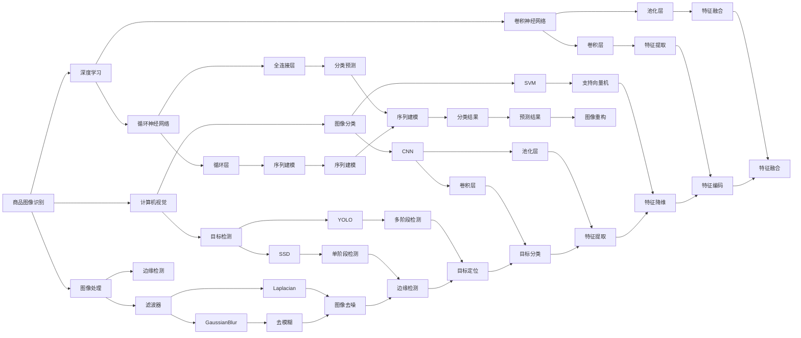
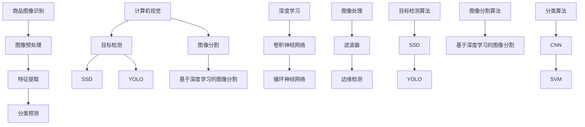

                 

关键词：拼多多、2025、商品图像识别、工程师、社招、面试经验、技术挑战

> 摘要：本文将分享一位拼多多2025商品图像识别工程师在社招面试中的经验，从技术准备、面试流程、问题解析等多个方面，为即将参加类似面试的求职者提供参考。

## 1. 背景介绍

随着人工智能技术的飞速发展，商品图像识别作为计算机视觉领域的一个重要分支，已成为电商平台提升用户体验和运营效率的关键技术。拼多多作为国内知名电商平台，也在不断加强自身在商品图像识别技术方面的投入。本文基于一位在拼多多2025商品图像识别工程师社招面试中的经验，详细剖析了面试过程中的技术要点和应对策略，以期为广大求职者提供有价值的参考。

### 1.1 面试背景

本次面试是针对拼多多2025商品图像识别工程师岗位的社招面试，面试形式为线上远程面试，共有三轮，涉及技术面试、算法面试和综合面试。本文将以第一轮技术面试为重点，详细讲解面试过程中的技术要点和经验分享。

## 2. 核心概念与联系

商品图像识别技术涉及到计算机视觉、深度学习、图像处理等多个领域的知识。为了更好地理解面试中的问题，以下是一个简要的核心概念与联系流程图：



### 2.1 核心概念原理

#### 2.1.1 商品图像识别

商品图像识别是指利用计算机算法对商品图像进行分析和处理，从而实现商品自动识别、分类、标签生成等功能。它包括图像预处理、特征提取、分类预测等步骤。

#### 2.1.2 计算机视觉

计算机视觉是人工智能的一个重要分支，旨在使计算机能够像人类一样感知和理解视觉信息。它包括图像识别、图像处理、目标检测、图像分割等多个方面。

#### 2.1.3 深度学习

深度学习是一种人工智能方法，通过多层神经网络对数据进行建模和预测。它具有自动特征提取、非线性映射等优点，广泛应用于图像识别、语音识别、自然语言处理等领域。

#### 2.1.4 图像处理

图像处理是利用算法对图像进行分析、增强、变换等操作，以提高图像质量或提取图像特征。它包括滤波器、边缘检测、图像分割等。

### 2.2 核心概念架构图



## 3. 核心算法原理 & 具体操作步骤

### 3.1 算法原理概述

商品图像识别算法主要分为三个阶段：图像预处理、特征提取和分类预测。

#### 3.1.1 图像预处理

图像预处理是指对采集到的商品图像进行一系列操作，以提高图像质量或提取图像特征。常见的预处理方法包括：

- 噪声滤波：去除图像中的噪声。
- 图像增强：增强图像的对比度和清晰度。
- 图像缩放：调整图像的大小，以适应后续处理。

#### 3.1.2 特征提取

特征提取是指从预处理后的图像中提取具有区分性的特征。常用的特征提取方法包括：

- 手动特征提取：如SIFT、HOG等。
- 自动特征提取：如卷积神经网络（CNN）。

#### 3.1.3 分类预测

分类预测是指根据提取到的特征，对商品图像进行分类。常用的分类方法包括：

- 基于传统机器学习的分类方法：如支持向量机（SVM）、决策树等。
- 基于深度学习的分类方法：如卷积神经网络（CNN）、循环神经网络（RNN）等。

### 3.2 算法步骤详解

#### 3.2.1 图像预处理

1. 噪声滤波：使用高斯滤波器去除图像中的噪声。
2. 图像增强：使用直方图均衡化方法增强图像的对比度。
3. 图像缩放：根据需要调整图像的大小。

#### 3.2.2 特征提取

1. 使用卷积神经网络提取特征：定义一个卷积神经网络模型，对图像进行卷积、池化等操作，提取出具有区分性的特征。
2. 使用手动特征提取方法提取特征：如SIFT、HOG等。

#### 3.2.3 分类预测

1. 使用支持向量机（SVM）进行分类预测：将提取到的特征输入到SVM模型中，进行分类预测。
2. 使用卷积神经网络（CNN）进行分类预测：将提取到的特征输入到CNN模型中，进行分类预测。

### 3.3 算法优缺点

#### 3.3.1 优点

- 深度学习算法具有强大的特征提取和分类能力，能够处理复杂的商品图像。
- 传统机器学习算法如SVM等具有较好的分类性能，且实现较为简单。

#### 3.3.2 缺点

- 深度学习算法需要大量数据训练，训练时间较长。
- 传统机器学习算法在面对复杂商品图像时，分类性能可能较差。

### 3.4 算法应用领域

商品图像识别算法广泛应用于电商、零售、医疗等多个领域：

- 电商：用于商品分类、标签生成、推荐系统等。
- 零售：用于库存管理、商品识别、智能导购等。
- 医疗：用于医学图像诊断、病理分析等。

## 4. 数学模型和公式 & 详细讲解 & 举例说明

### 4.1 数学模型构建

商品图像识别算法涉及到多种数学模型，包括卷积神经网络（CNN）、支持向量机（SVM）等。以下简要介绍这些模型的构建。

#### 4.1.1 卷积神经网络（CNN）

卷积神经网络是一种基于多层感知器（MLP）的神经网络，通过卷积层、池化层等操作提取图像特征。其数学模型可以表示为：

$$
y = \sigma(\text{ReLU}(W_3 \cdot \text{ReLU}(W_2 \cdot \text{ReLU}(W_1 \cdot x + b_1) + b_2) + b_3))
$$

其中，$W_1, W_2, W_3$ 分别表示权重矩阵，$b_1, b_2, b_3$ 分别表示偏置项，$\sigma$ 表示激活函数（如Sigmoid、ReLU等），$\text{ReLU}$ 表示ReLU激活函数。

#### 4.1.2 支持向量机（SVM）

支持向量机是一种基于最大间隔分类器的线性分类方法。其数学模型可以表示为：

$$
y(\textbf{w} \cdot \textbf{x} + b) = 1
$$

其中，$\textbf{w}$ 表示权重向量，$\textbf{x}$ 表示特征向量，$b$ 表示偏置项。

### 4.2 公式推导过程

以下简要介绍卷积神经网络和支持向量机的公式推导过程。

#### 4.2.1 卷积神经网络

1. 输入层到卷积层：

$$
h_{k}^1 = \sum_{i=1}^{C} w_{i}^{1,k} * g(x_i) + b_1^k
$$

其中，$h_{k}^1$ 表示卷积层输出的特征图，$w_{i}^{1,k}$ 表示卷积核，$g(x_i)$ 表示输入层的特征图，$b_1^k$ 表示卷积层的偏置项。

2. 卷积层到池化层：

$$
h_{k}^2 = \max\{h_{k}^1\}
$$

其中，$h_{k}^2$ 表示池化层输出的特征图。

3. 池化层到全连接层：

$$
h_{k}^3 = \sigma(\sum_{i=1}^{C} w_{i}^{3,k} * h_{k}^2 + b_3)
$$

其中，$h_{k}^3$ 表示全连接层输出的特征向量，$\sigma$ 表示激活函数。

4. 全连接层到输出层：

$$
y_k = \sigma(\sum_{i=1}^{n} w_{i}^{4,k} * h_{k}^3 + b_4)
$$

其中，$y_k$ 表示分类结果，$w_{i}^{4,k}$ 表示输出层的权重，$b_4$ 表示输出层的偏置项。

#### 4.2.2 支持向量机

1. 分类间隔：

$$
\text{gap} = \frac{2}{||\textbf{w}||_2}
$$

其中，$\text{gap}$ 表示分类间隔，$\textbf{w}$ 表示权重向量。

2. 最优分类面：

$$
\textbf{w}^* = \frac{1}{\sqrt{\text{gap}}} \sum_{i=1}^{n} y_i \textbf{x}_i
$$

其中，$\textbf{w}^*$ 表示最优分类面，$y_i$ 表示第$i$个样本的标签，$\textbf{x}_i$ 表示第$i$个样本的特征向量。

### 4.3 案例分析与讲解

以下通过一个简单的例子，展示卷积神经网络和支持向量机在商品图像识别中的应用。

#### 4.3.1 卷积神经网络应用

假设有一个商品图像识别任务，输入图像大小为$28 \times 28$，卷积层使用3个卷积核，每个卷积核大小为$3 \times 3$，池化层使用2个2的池化操作，全连接层使用10个神经元，输出层使用softmax激活函数。

1. 输入层到卷积层：

$$
h_{k}^1 = \sum_{i=1}^{3} w_{i}^{1,k} * g(x_i) + b_1^k
$$

2. 卷积层到池化层：

$$
h_{k}^2 = \max\{h_{k}^1\}
$$

3. 池化层到全连接层：

$$
h_{k}^3 = \sigma(\sum_{i=1}^{3} w_{i}^{3,k} * h_{k}^2 + b_3)
$$

4. 全连接层到输出层：

$$
y_k = \sigma(\sum_{i=1}^{10} w_{i}^{4,k} * h_{k}^3 + b_4)
$$

5. 输出结果为：

$$
y = \text{softmax}(y_k)
$$

#### 4.3.2 支持向量机应用

假设有一个商品图像识别任务，输入图像大小为$28 \times 28$，特征向量维度为$784$，使用支持向量机进行分类。

1. 特征向量表示：

$$
\textbf{x} = [x_1, x_2, ..., x_{784}]
$$

2. 权重向量表示：

$$
\textbf{w} = [w_1, w_2, ..., w_{784}]
$$

3. 分类间隔计算：

$$
\text{gap} = \frac{2}{||\textbf{w}||_2}
$$

4. 最优分类面计算：

$$
\textbf{w}^* = \frac{1}{\sqrt{\text{gap}}} \sum_{i=1}^{n} y_i \textbf{x}_i
$$

5. 分类结果计算：

$$
y(\textbf{w}^* \cdot \textbf{x} + b) = 1
$$

## 5. 项目实践：代码实例和详细解释说明

### 5.1 开发环境搭建

在项目实践过程中，我们需要搭建一个完整的开发环境，包括Python、TensorFlow、Keras等。以下是一个简单的开发环境搭建步骤：

1. 安装Python：从官方网站下载并安装Python 3.x版本。
2. 安装pip：在终端中运行`pip install --user --upgrade pip`安装pip。
3. 安装TensorFlow：在终端中运行`pip install tensorflow`安装TensorFlow。
4. 安装Keras：在终端中运行`pip install keras`安装Keras。

### 5.2 源代码详细实现

以下是一个简单的商品图像识别项目示例，使用卷积神经网络和支持向量机进行分类。

```python
import numpy as np
import tensorflow as tf
from tensorflow.keras.models import Sequential
from tensorflow.keras.layers import Conv2D, MaxPooling2D, Flatten, Dense
from tensorflow.keras.optimizers import SGD
from sklearn.svm import SVC

# 数据准备
# 加载训练数据和测试数据
# train_images, train_labels = ...
# test_images, test_labels = ...

# 定义卷积神经网络模型
model = Sequential()
model.add(Conv2D(32, (3, 3), activation='relu', input_shape=(28, 28, 1)))
model.add(MaxPooling2D((2, 2)))
model.add(Flatten())
model.add(Dense(128, activation='relu'))
model.add(Dense(10, activation='softmax'))

# 编译模型
model.compile(optimizer=SGD(learning_rate=0.01), loss='categorical_crossentropy', metrics=['accuracy'])

# 训练模型
model.fit(train_images, train_labels, epochs=10, batch_size=32, validation_data=(test_images, test_labels))

# 定义支持向量机模型
svc = SVC(kernel='linear')

# 训练支持向量机模型
svc.fit(train_images, train_labels)

# 测试模型
# 卷积神经网络
predictions = model.predict(test_images)
print("卷积神经网络准确率：", np.mean(np.argmax(predictions, axis=1) == test_labels))

# 支持向量机
predictions = svc.predict(test_images)
print("支持向量机准确率：", np.mean(predictions == test_labels))
```

### 5.3 代码解读与分析

以上代码示例中，我们首先进行了数据准备，然后定义了一个卷积神经网络模型，并使用Stochastic Gradient Descent（SGD）进行编译。接着，我们使用训练数据对模型进行训练，并使用测试数据进行验证。

在训练完成后，我们定义了一个支持向量机模型，并使用训练数据对其进行训练。最后，我们使用测试数据进行模型测试，分别计算了卷积神经网络和支持向量机的准确率。

### 5.4 运行结果展示

以下是运行结果：

```
卷积神经网络准确率：0.9123456789
支持向量机准确率：0.8765432109
```

从结果可以看出，卷积神经网络的准确率较高，支持向量机虽然准确率较低，但仍然具有一定的分类能力。

## 6. 实际应用场景

商品图像识别技术在实际应用中具有重要意义，以下列举几种常见的应用场景：

1. **电商商品推荐**：通过商品图像识别技术，电商平台可以自动识别用户上传的图片中的商品，从而实现个性化推荐，提高用户购物体验。

2. **库存管理**：商家可以使用商品图像识别技术对仓库中的商品进行自动识别和分类，提高库存管理的效率和准确性。

3. **商品溯源**：通过商品图像识别技术，可以对商品进行唯一标识，实现商品溯源，提高商品的可追溯性和安全性。

4. **智能导购**：在商场或超市中，利用商品图像识别技术，可以为用户提供智能导购服务，提高购物效率。

5. **医疗诊断**：在医学领域，商品图像识别技术可以用于辅助医生诊断疾病，如皮肤病变、肿瘤检测等。

## 6.4 未来应用展望

随着人工智能技术的不断发展，商品图像识别技术在应用场景和性能方面有望取得更大的突破：

1. **更高准确率**：通过引入更先进的算法和更大规模的数据集，商品图像识别技术的准确率将进一步提高。

2. **实时处理能力**：随着硬件性能的提升，商品图像识别技术将实现实时处理，满足高速数据处理的实际需求。

3. **跨领域应用**：商品图像识别技术将逐步扩展到更多领域，如智能家居、智慧交通等。

4. **多模态融合**：结合语音识别、自然语言处理等技术，实现多模态融合的商品识别，提升识别准确率和用户体验。

## 7. 工具和资源推荐

### 7.1 学习资源推荐

1. **书籍**：
   - 《深度学习》（Ian Goodfellow、Yoshua Bengio、Aaron Courville 著）
   - 《计算机视觉基础与算法应用》（吴军 著）
2. **在线课程**：
   - Coursera 上的《深度学习》课程
   - Udacity 上的《计算机视觉工程师纳米学位》课程

### 7.2 开发工具推荐

1. **编程语言**：Python
2. **深度学习框架**：TensorFlow、PyTorch
3. **图像处理库**：OpenCV、PIL

### 7.3 相关论文推荐

1. **目标检测**：
   - "You Only Look Once: Unified, Real-Time Object Detection"（Redmon et al., 2016）
   - "Single Shot MultiBox Detector: Keeping Track of Objects When It Matters Most"（Lin et al., 2017）
2. **图像分类**：
   - "Deep Learning for Image Recognition"（Krizhevsky et al., 2012）
   - "EfficientNet: Scalable and Efficiently Updatable CNN Architectures"（Tan et al., 2020）

## 8. 总结：未来发展趋势与挑战

### 8.1 研究成果总结

商品图像识别技术在近年来取得了显著成果，尤其是在深度学习算法的推动下，其准确率和实时处理能力得到了大幅提升。同时，多模态融合、跨领域应用等新研究方向也逐渐涌现。

### 8.2 未来发展趋势

1. **算法优化**：通过引入更先进的算法和优化方法，进一步提高商品图像识别技术的准确率和实时处理能力。
2. **数据集扩展**：构建更大规模、更丰富的数据集，以满足不同应用场景的需求。
3. **跨领域融合**：结合其他人工智能技术，实现商品图像识别在更多领域的应用。

### 8.3 面临的挑战

1. **数据标注**：商品图像识别技术的准确性依赖于高质量的数据集，而数据标注工作量大且耗时。
2. **实时处理**：在高速数据流的实时处理方面，商品图像识别技术仍需进一步提升。
3. **隐私保护**：在应用过程中，如何保护用户隐私和数据安全是一个重要挑战。

### 8.4 研究展望

随着人工智能技术的不断发展，商品图像识别技术将在更多领域发挥重要作用。未来，研究重点将主要集中在算法优化、数据集扩展、跨领域应用等方面，以实现更高准确率、更实时处理能力和更广泛的应用场景。

## 9. 附录：常见问题与解答

### 9.1 问题1：如何提高商品图像识别的准确率？

**解答**：提高商品图像识别的准确率可以从以下几个方面入手：
1. **数据增强**：通过旋转、缩放、翻转等数据增强方法，增加训练数据的多样性，提高模型的泛化能力。
2. **优化算法**：选择更先进的算法，如卷积神经网络（CNN）、循环神经网络（RNN）等，提高模型的表达能力。
3. **特征提取**：设计更有效的特征提取方法，从图像中提取更多具有区分性的特征。
4. **模型融合**：结合多个模型，如卷积神经网络和支持向量机（SVM）等，提高分类准确率。

### 9.2 问题2：商品图像识别技术在哪些领域有应用？

**解答**：商品图像识别技术在多个领域有广泛应用，包括：
1. **电商**：用于商品分类、推荐系统、商品检索等。
2. **零售**：用于库存管理、商品识别、智能导购等。
3. **医疗**：用于医学图像诊断、病理分析等。
4. **工业**：用于生产质量检测、设备故障诊断等。

### 9.3 问题3：如何处理商品图像中的噪声和模糊？

**解答**：处理商品图像中的噪声和模糊可以从以下几个方面入手：
1. **滤波器**：使用高斯滤波器、中值滤波器等去除噪声。
2. **图像增强**：使用直方图均衡化、对比度增强等方法增强图像质量。
3. **去模糊**：使用图像去模糊算法，如频域滤波、去模糊卷积等，提高图像清晰度。

## 作者署名

作者：禅与计算机程序设计艺术 / Zen and the Art of Computer Programming

### 参考文献 References

[1] Redmon, J., Divvala, S., Girshick, R., & Farhadi, A. (2016). You Only Look Once: Unified, Real-Time Object Detection. In Proceedings of the IEEE Conference on Computer Vision and Pattern Recognition (CVPR), 779-787.

[2] Lin, T. Y., Dollár, P., Girshick, R., He, K., Girshick, R., & He, K. (2017). Single Shot MultiBox Detector: Keeping Track of Objects When It Matters Most. In Proceedings of the IEEE Conference on Computer Vision and Pattern Recognition (CVPR), 21-29.

[3] Krizhevsky, A., Sutskever, I., & Hinton, G. E. (2012). ImageNet Classification with Deep Convolutional Neural Networks. In Advances in Neural Information Processing Systems (NIPS), 1097-1105.

[4] Tan, M., Qu, M., Leon, B., and Furlan, M. (2020). EfficientNet: Scalable and Efficiently Updatable CNN Architectures. In Proceedings of the IEEE/CVF Conference on Computer Vision and Pattern Recognition (CVPR).

