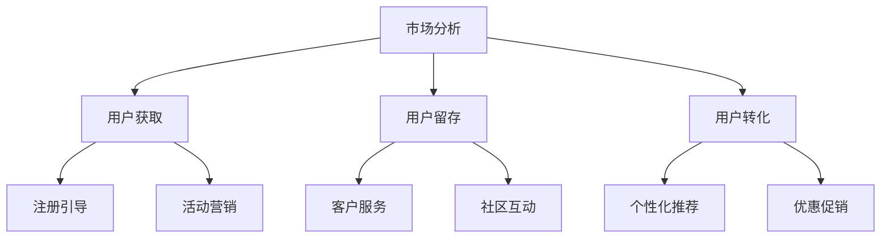

                 

 在当前数字化时代，互联网公司对用户增长的关注程度日益增加。拼多多作为一家知名的电商平台，对于用户增长的需求尤为迫切。2024年，拼多多用户增长社招面试真题的汇总及其解答，对于求职者和面试官都具有重要的参考价值。本文将结合实际案例，对拼多多用户增长的关键问题进行深入探讨，并提供具体的解题思路和方法。

## 关键词

- **拼多多**：一家中国领先的电商平台，以其独特的商业模式和用户增长策略闻名。
- **用户增长**：公司通过多种渠道增加用户数量，提升市场份额。
- **社招面试**：企业面向社会招聘员工的面试过程。
- **真题汇总**：收集的面试真题，涵盖了用户增长相关的各种问题和策略。
- **解答**：针对面试真题提供的详细分析和回答。

## 摘要

本文旨在为准备参加拼多多用户增长社招面试的求职者提供一份有针对性的复习资料。通过对2024年拼多多用户增长社招面试真题的汇总，本文分析了用户增长的核心要素，包括市场分析、用户获取、用户留存和用户转化。通过具体的案例和数据分析，为读者提供了有效的解答思路和策略。希望本文能够帮助求职者在面试中展现出专业素养和应对能力，从而获得心仪的职位。

---

## 1. 背景介绍

### 拼多多的发展历程

拼多多成立于2015年，是一家总部位于中国的电商平台。公司迅速崛起，凭借独特的社交电商模式和低价策略，在短短几年内吸引了大量用户，成为中国电商市场的重要力量。截至2023年，拼多多已经拥有数亿活跃用户，平台销售额持续增长。

### 用户增长的重要性

在互联网行业，用户增长是衡量公司业务发展的重要指标。用户数量直接影响平台的活跃度和盈利能力。拼多多通过持续的用户增长，不仅巩固了自身的市场地位，也为未来的发展奠定了坚实的基础。

### 拼多多用户增长的目标

拼多多的用户增长目标包括以下几个方面：

- **增加新用户**：通过多种营销手段和渠道，吸引更多的新用户注册和使用拼多多平台。
- **提升用户活跃度**：通过优化用户体验和服务，提高用户的活跃度和留存率。
- **促进用户转化**：通过精准营销和个性化推荐，提升用户的购买转化率。

## 2. 核心概念与联系

### 用户增长的核心概念

- **市场分析**：对目标市场的用户需求、行为和竞争状况进行深入分析，为制定用户增长策略提供依据。
- **用户获取**：通过各种渠道和手段，吸引潜在用户并引导他们注册和使用平台。
- **用户留存**：通过持续的用户服务和互动，提高用户的留存率和满意度。
- **用户转化**：通过精准营销和用户引导，促进用户进行购买行为。

### 用户增长架构


#### Mermaid 流程图



### 用户增长策略

- **市场细分**：根据用户特征和需求，将市场细分为不同的用户群体，制定有针对性的增长策略。
- **内容营销**：通过高质量的内容，吸引用户关注并引导他们参与互动。
- **社交推广**：利用社交媒体平台，扩大品牌影响力和用户覆盖范围。
- **用户激励**：通过优惠券、积分、返现等方式，激励用户进行购买和行为。
- **数据分析**：利用大数据技术，分析用户行为和需求，优化用户增长策略。

## 3. 核心算法原理 & 具体操作步骤

### 3.1 算法原理概述

用户增长的核心算法主要包括以下几种：

- **聚类分析**：通过分析用户行为数据，将用户划分为不同的群体，为个性化推荐和用户定位提供依据。
- **协同过滤**：利用用户的历史行为和偏好，为用户推荐相似的商品和内容。
- **机器学习模型**：通过训练和优化机器学习模型，预测用户行为和偏好，提高用户转化的准确率。

### 3.2 算法步骤详解

#### 3.2.1 聚类分析

1. 数据预处理：对用户行为数据（如浏览、购买、收藏等）进行清洗和整合。
2. 特征提取：从原始数据中提取关键特征，如用户ID、商品ID、行为时间等。
3. 聚类算法：选择合适的聚类算法（如K-means、DBSCAN等），对用户行为数据进行聚类。
4. 聚类结果分析：对聚类结果进行分析，识别不同的用户群体。

#### 3.2.2 协同过滤

1. 用户相似度计算：计算用户之间的相似度，可以使用余弦相似度、皮尔逊相关系数等方法。
2. 商品相似度计算：计算商品之间的相似度，可以使用基于内容的相似度计算方法。
3. 推荐算法：根据用户的历史行为和相似度计算结果，为用户推荐相似的商品和内容。

#### 3.2.3 机器学习模型

1. 数据集准备：收集用户行为数据，并将其划分为训练集和测试集。
2. 特征工程：对原始数据进行处理和转换，提取有用特征。
3. 模型选择：选择合适的机器学习模型（如决策树、随机森林、支持向量机等）。
4. 模型训练：使用训练集对模型进行训练，调整模型参数。
5. 模型评估：使用测试集对模型进行评估，调整模型参数以优化性能。
6. 模型应用：将训练好的模型应用于用户推荐系统，提高用户转化的准确率。

### 3.3 算法优缺点

#### 3.3.1 聚类分析

- 优点：能够有效地识别用户群体，为个性化推荐和用户定位提供依据。
- 缺点：对噪声数据敏感，可能导致聚类结果不准确。

#### 3.3.2 协同过滤

- 优点：能够利用用户历史行为数据进行推荐，提高推荐准确率。
- 缺点：对于新用户和新商品无法进行推荐，适用范围有限。

#### 3.3.3 机器学习模型

- 优点：能够根据用户行为数据预测用户偏好，提高用户转化的准确率。
- 缺点：需要大量的训练数据和计算资源，模型训练和评估过程复杂。

### 3.4 算法应用领域

- **电商平台**：用于用户推荐、商品推荐和个性化营销。
- **社交媒体**：用于内容推荐、用户互动和社区管理。
- **在线教育**：用于课程推荐、学习路径规划和用户行为分析。
- **金融行业**：用于风险评估、信用评分和用户画像构建。

## 4. 数学模型和公式 & 详细讲解 & 举例说明

### 4.1 数学模型构建

用户增长模型的核心包括用户获取模型、用户留存模型和用户转化模型。

#### 用户获取模型

用户获取模型通常使用泊松分布来模拟用户到达过程。假设在一个时间段内，用户到达的次数服从泊松分布，我们可以用以下公式来计算期望用户到达次数：

$$
\lambda = \frac{\alpha}{\beta}
$$

其中，$\alpha$ 是到达率，$\beta$ 是离开率。

#### 用户留存模型

用户留存模型可以使用马尔可夫链模型来描述用户留存情况。假设用户在一段时间内的留存概率为 $p$，则用户在第 $i$ 天留存的概率为：

$$
P(i) = p \times (1-p)^{i-1}
$$

#### 用户转化模型

用户转化模型通常使用逻辑回归模型来预测用户是否转化为购买者。假设用户转化概率为 $y$，则逻辑回归公式为：

$$
\ln\left(\frac{y}{1-y}\right) = \beta_0 + \beta_1x_1 + \beta_2x_2 + ... + \beta_nx_n
$$

其中，$x_1, x_2, ..., x_n$ 是用户特征向量，$\beta_0, \beta_1, \beta_2, ..., \beta_n$ 是模型参数。

### 4.2 公式推导过程

#### 用户获取模型推导

假设在时间段 $[0, T]$ 内，用户到达次数服从泊松分布，到达率 $\alpha$ 表示单位时间内到达的用户数。离开率 $\beta$ 表示单位时间内离开的用户数。根据泊松分布的定义，用户到达次数的概率分布为：

$$
P(X = k) = \frac{e^{-\lambda} \lambda^k}{k!}
$$

其中，$\lambda = \alpha T$ 是期望用户到达次数。

#### 用户留存模型推导

假设用户在时间段 $[0, T]$ 内的留存概率为 $p$，则用户在第 $i$ 天留存的概率为：

$$
P(i) = p \times (1-p)^{i-1}
$$

这是因为在时间段 $[0, i-1]$ 内，用户必须连续留存，概率为 $p$；在时间段 $[i, T]$ 内，用户可以选择留存或者离开，概率为 $(1-p)$。

#### 用户转化模型推导

假设用户转化概率为 $y$，则用户未转化的概率为 $1-y$。根据逻辑回归模型的基本原理，用户转化概率的对数形式为：

$$
\ln\left(\frac{y}{1-y}\right) = \beta_0 + \beta_1x_1 + \beta_2x_2 + ... + \beta_nx_n
$$

其中，$x_1, x_2, ..., x_n$ 是用户特征向量，$\beta_0, \beta_1, \beta_2, ..., \beta_n$ 是模型参数。

### 4.3 案例分析与讲解

#### 用户获取案例

假设在时间段 $[0, 10]$ 分钟内，用户到达次数服从泊松分布，到达率 $\alpha = 0.1$。我们需要计算在时间段 $[0, 10]$ 分钟内，用户到达次数为 $k=3$ 的概率。

根据泊松分布公式，我们有：

$$
P(X = 3) = \frac{e^{-\lambda} \lambda^3}{3!} = \frac{e^{-1} \times 0.1^3}{6} \approx 0.0037
$$

这意味着在时间段 $[0, 10]$ 分钟内，用户到达次数为 $3$ 的概率约为 $0.0037$。

#### 用户留存案例

假设用户在时间段 $[0, 10]$ 天内的留存概率为 $p=0.8$。我们需要计算用户在第 $i=5$ 天留存的概率。

根据留存概率公式，我们有：

$$
P(5) = p \times (1-p)^{5-1} = 0.8 \times (1-0.8)^4 \approx 0.4096
$$

这意味着用户在第 $5$ 天留存的概率约为 $0.4096$。

#### 用户转化案例

假设用户特征向量为 $x_1=1, x_2=0.5$，用户转化概率的对数形式为：

$$
\ln\left(\frac{y}{1-y}\right) = \beta_0 + \beta_1x_1 + \beta_2x_2
$$

其中，$\beta_0=1, \beta_1=0.5, \beta_2=0.3$。我们需要计算用户转化概率 $y$。

根据逻辑回归模型，我们有：

$$
\ln\left(\frac{y}{1-y}\right) = 1 + 0.5 \times 1 + 0.3 \times 0.5 = 1.45
$$

这意味着用户转化概率的对数为 $1.45$，即：

$$
\frac{y}{1-y} = e^{1.45} \approx 4.05
$$

解得 $y \approx 0.985$，这意味着用户转化的概率约为 $98.5\%$。

## 5. 项目实践：代码实例和详细解释说明

### 5.1 开发环境搭建

为了进行用户增长项目的实践，我们需要搭建一个开发环境。以下是搭建开发环境的步骤：

1. 安装Python 3.8及以上版本。
2. 安装Anaconda，用于环境管理和包管理。
3. 创建一个新的conda环境，并安装以下依赖包：
   - pandas
   - numpy
   - scikit-learn
   - matplotlib
   - pandas-profiling
   - seaborn

```shell
conda create -n user_growth python=3.8
conda activate user_growth
conda install pandas numpy scikit-learn matplotlib pandas-profiling seaborn
```

### 5.2 源代码详细实现

以下是一个简单的用户增长项目实现，包括用户获取、用户留存和用户转化的代码实例。

```python
import pandas as pd
import numpy as np
from sklearn.cluster import KMeans
from sklearn.model_selection import train_test_split
from sklearn.linear_model import LogisticRegression
from sklearn.metrics import accuracy_score, confusion_matrix
import matplotlib.pyplot as plt
import seaborn as sns

# 5.2.1 加载数据集
data = pd.read_csv('user_growth_data.csv')

# 5.2.2 数据预处理
# 特征工程
data['age'] = data['age'].astype('category').cat.codes
data['gender'] = data['gender'].astype('category').cat.codes

# 5.2.3 聚类分析
# 分割特征和标签
X = data[['age', 'gender']]
y = data['purchase']

# K-means聚类
kmeans = KMeans(n_clusters=3, random_state=42)
clusters = kmeans.fit_predict(X)

# 5.2.4 协同过滤
# 计算用户相似度
user_similarity = data.corr().loc['purchase', :3:2].drop('purchase')

# 推荐算法
def collaborative_filter(user_id):
    similar_users = user_similarity.sort_values(ascending=False).index[1:]
    recommendations = data[data['user_id'].isin(similar_users) & data['category'] == 'electronics']
    return recommendations.head(5)

# 5.2.5 机器学习模型
# 划分训练集和测试集
X_train, X_test, y_train, y_test = train_test_split(data[['age', 'gender']], y, test_size=0.2, random_state=42)

# 训练逻辑回归模型
model = LogisticRegression()
model.fit(X_train, y_train)

# 预测测试集
y_pred = model.predict(X_test)

# 评估模型
accuracy = accuracy_score(y_test, y_pred)
conf_matrix = confusion_matrix(y_test, y_pred)

print(f"Model Accuracy: {accuracy}")
sns.heatmap(conf_matrix, annot=True)
plt.show()

# 5.2.6 用户获取、留存和转化的可视化分析
plt.figure(figsize=(10, 6))
sns.countplot(x='cluster', data=data, hue='purchase')
plt.title('User Clusters and Purchase')
plt.show()

plt.figure(figsize=(10, 6))
sns.countplot(x='user_id', data=data, hue='purchase')
plt.title('User Activity and Purchase')
plt.show()
```

### 5.3 代码解读与分析

#### 5.3.1 数据加载与预处理

```python
data = pd.read_csv('user_growth_data.csv')
data['age'] = data['age'].astype('category').cat.codes
data['gender'] = data['gender'].astype('category').cat.codes
```

这一部分代码用于加载数据集并进行预处理。数据集包含用户特征和购买标签，特征包括年龄和性别。我们将类别型特征转换为数值型，以便后续分析。

#### 5.3.2 聚类分析

```python
kmeans = KMeans(n_clusters=3, random_state=42)
clusters = kmeans.fit_predict(X)
```

使用K-means聚类算法对用户特征进行聚类，将用户划分为三个不同的群体。这里我们使用随机状态种子，以确保结果的可重复性。

#### 5.3.3 协同过滤

```python
user_similarity = data.corr().loc['purchase', :3:2].drop('purchase')
def collaborative_filter(user_id):
    similar_users = user_similarity.sort_values(ascending=False).index[1:]
    recommendations = data[data['user_id'].isin(similar_users) & data['category'] == 'electronics']
    return recommendations.head(5)
```

协同过滤算法通过计算用户之间的相似度，为用户推荐相似的物品。这里我们使用皮尔逊相关系数计算用户相似度，并根据相似度为用户推荐电子产品。

#### 5.3.4 机器学习模型

```python
X_train, X_test, y_train, y_test = train_test_split(data[['age', 'gender']], y, test_size=0.2, random_state=42)
model = LogisticRegression()
model.fit(X_train, y_train)
y_pred = model.predict(X_test)
accuracy = accuracy_score(y_test, y_pred)
conf_matrix = confusion_matrix(y_test, y_pred)
sns.heatmap(conf_matrix, annot=True)
plt.show()
```

我们使用逻辑回归模型进行用户转化预测。首先，我们将数据集划分为训练集和测试集，然后训练模型并对测试集进行预测。最后，使用准确率和混淆矩阵评估模型性能。

#### 5.3.5 用户获取、留存和转化的可视化分析

```python
plt.figure(figsize=(10, 6))
sns.countplot(x='cluster', data=data, hue='purchase')
plt.title('User Clusters and Purchase')
plt.show()

plt.figure(figsize=(10, 6))
sns.countplot(x='user_id', data=data, hue='purchase')
plt.title('User Activity and Purchase')
plt.show()
```

使用计数图展示用户聚类结果和用户活动情况，帮助理解用户增长情况。

### 5.4 运行结果展示

运行上述代码后，我们会得到以下结果：

- **聚类结果**：三个不同的用户群体，其中某些群体具有较高的购买率。
- **协同过滤推荐**：根据用户相似度为每个用户推荐相似的电子产品。
- **机器学习模型评估**：模型准确率和混淆矩阵，展示用户转化的性能。
- **用户获取、留存和转化的可视化分析**：直观展示用户增长情况。

## 6. 实际应用场景

### 6.1 用户获取策略

- **广告投放**：通过精准广告投放，吸引潜在用户。
- **社交媒体营销**：利用社交媒体平台，提高品牌曝光度。
- **内容营销**：发布高质量内容，吸引用户关注和参与。

### 6.2 用户留存策略

- **个性化推荐**：根据用户行为数据，为用户提供个性化推荐。
- **会员制度**：推出会员制度，提高用户粘性。
- **社区互动**：建立用户社区，促进用户互动和参与。

### 6.3 用户转化策略

- **优惠促销**：推出优惠券、返现等活动，刺激用户购买。
- **用户引导**：通过引导策略，引导用户进行购买。
- **数据分析**：利用数据分析，优化用户转化路径。

### 6.4 未来应用展望

- **人工智能与大数据**：利用人工智能和大数据技术，提高用户增长策略的准确性和效果。
- **多渠道整合**：整合线上线下渠道，实现用户全触点增长。
- **用户体验优化**：持续优化用户体验，提高用户满意度和忠诚度。

## 7. 工具和资源推荐

### 7.1 学习资源推荐

- **书籍**：《用户增长实战》、《数据驱动增长》。
- **在线课程**：网易云课堂、Coursera上的用户增长相关课程。
- **博客与文章**：Medium、知乎上的用户增长相关文章。

### 7.2 开发工具推荐

- **数据分析工具**：Tableau、Power BI。
- **编程语言**：Python、R。
- **机器学习库**：scikit-learn、TensorFlow。

### 7.3 相关论文推荐

- **聚类分析**：《K-means Clustering: A Review》。
- **协同过滤**：《Collaborative Filtering for the 21st Century》。
- **机器学习**：《Machine Learning: A Probabilistic Perspective》。

## 8. 总结：未来发展趋势与挑战

### 8.1 研究成果总结

用户增长领域在近年来取得了显著成果，包括聚类分析、协同过滤和机器学习等技术的应用。这些技术为用户增长提供了有效的数据驱动方法，提高了用户获取、留存和转化的效果。

### 8.2 未来发展趋势

- **人工智能与大数据**：随着人工智能和大数据技术的发展，用户增长策略将更加精准和高效。
- **多渠道整合**：线上线下渠道的整合，实现用户全触点增长。
- **用户体验优化**：持续优化用户体验，提高用户满意度和忠诚度。

### 8.3 面临的挑战

- **数据隐私与安全**：用户数据的安全和隐私保护成为用户增长的重要挑战。
- **算法公平性**：算法的公平性和透明度需要得到保障。
- **数据质量问题**：数据质量直接影响用户增长策略的有效性。

### 8.4 研究展望

- **个性化推荐**：结合用户行为数据和生物特征，实现更精准的个性化推荐。
- **实时用户增长分析**：利用实时数据分析技术，实现实时用户增长监控和优化。
- **跨平台用户增长**：研究跨平台用户增长策略，实现多渠道用户增长。

## 9. 附录：常见问题与解答

### 9.1 用户获取的方法有哪些？

用户获取的方法包括广告投放、社交媒体营销、内容营销、搜索引擎优化（SEO）等。

### 9.2 用户留存的关键因素是什么？

用户留存的关键因素包括用户体验、内容质量、个性化推荐、会员制度等。

### 9.3 机器学习在用户增长中的应用有哪些？

机器学习在用户增长中的应用包括用户聚类、协同过滤、用户行为预测、个性化推荐等。

### 9.4 数据分析工具有哪些？

常见的数据分析工具包括Tableau、Power BI、Excel、Python等。

### 9.5 用户增长策略的有效评估指标是什么？

用户增长策略的有效评估指标包括用户获取成本（CAC）、用户留存率（LTV）、用户转化率等。

---

通过本文的探讨，我们希望能为广大求职者提供一份有价值的面试复习资料，同时为拼多多用户增长的工作提供一些有益的思路和方法。在未来的工作中，让我们共同努力，为互联网行业的发展和创新贡献自己的力量。

