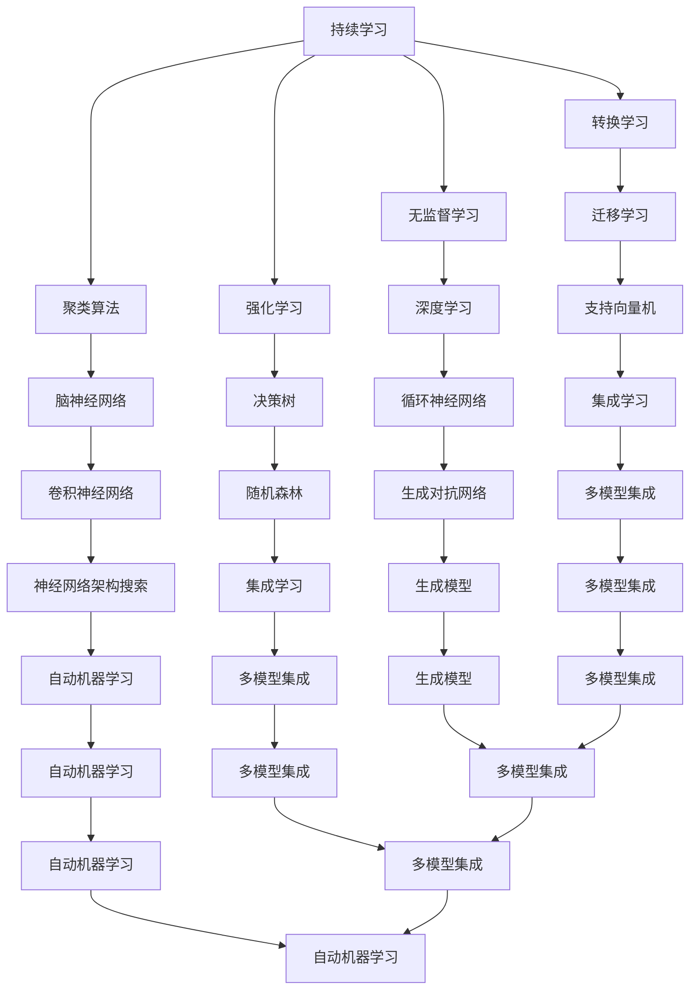

                 

### 关键词 Keywords
- 持续学习
- Continual Learning
- 聚类算法
- 转换学习
- 无监督学习
- 强化学习
- 脑神经网络

<|assistant|>### 摘要 Abstract
本文旨在深入探讨持续学习（Continual Learning）的原理，并通过实际代码实例，解析其在计算机科学领域的应用。持续学习是指机器模型能够在不断接收到新数据的同时，保持原有的学习和表现能力。本文将首先介绍持续学习的背景和重要性，然后解析其核心概念与架构，探讨各种持续学习算法的原理和优缺点。接着，我们将通过一个具体案例，展示如何在实际项目中应用持续学习技术。最后，本文将总结持续学习的发展趋势和面临的挑战，并提出一些建议和展望。

<|assistant|>### 1. 背景介绍 Background
在当今快速发展的信息技术时代，机器学习（Machine Learning, ML）已经成为人工智能（Artificial Intelligence, AI）的核心驱动力。传统的机器学习方法通常基于批量数据（batch data）进行训练，假设训练数据是静态且独立同分布的（i.i.d.）。然而，现实世界中的数据通常是动态变化的，新的数据不断生成，这给机器学习模型带来了持续学习的需求。

持续学习（Continual Learning），也称为在线学习（Online Learning），是机器学习的一个分支，旨在使模型能够在不断接收到新数据的情况下保持学习效果。传统的批量学习模型在接收到新数据时，需要重新训练整个模型，这不仅效率低下，还可能导致模型在处理新数据时性能下降。因此，持续学习的研究变得越来越重要，尤其是在需要实时响应的应用场景中，如自动驾驶、实时语音识别和智能监控系统等。

持续学习的重要性在于：
1. **提高模型适应性**：在动态环境中，持续学习使模型能够适应不断变化的数据，保持高效的表现。
2. **降低重新训练成本**：通过持续学习，模型可以逐步更新，减少重新训练的次数和成本。
3. **增强模型鲁棒性**：持续学习模型在处理新数据时，能够更好地处理数据分布的变化，提高模型的鲁棒性。

本文将首先介绍持续学习的核心概念和算法，然后通过一个实际案例展示其应用，最后探讨持续学习的发展趋势和面临的挑战。

<|assistant|>## 2. 核心概念与联系 Core Concepts and Relations
持续学习涉及多个核心概念和算法，包括聚类算法、转换学习、无监督学习和强化学习。为了更清晰地理解这些概念，我们将使用Mermaid流程图来展示它们之间的关系。



### 2.1 聚类算法 Clustering Algorithms
聚类算法是持续学习中的重要组成部分，主要用于将数据集划分成若干个集群。常见的聚类算法包括K-means、DBSCAN和层次聚类等。聚类算法的核心思想是通过计算数据点之间的相似度，将相似的数据点划分到同一集群中。

- **K-means**：基于距离度量的聚类算法，通过迭代计算各数据点的均值来更新聚类中心。
- **DBSCAN**：基于密度的聚类算法，能够识别出任意形状的聚类，并区分噪声点。
- **层次聚类**：基于层次结构的聚类算法，通过自底向上的合并或自顶向下的分裂来构建聚类层次。

### 2.2 转换学习 Transfer Learning
转换学习是持续学习的一种形式，通过将已训练好的模型在新数据集上进行微调（fine-tuning），来提高模型的适应性。转换学习通常用于处理不同但相关的问题，例如从图像分类任务迁移到文本分类任务。

- **迁移学习**：将已训练好的模型在不同任务之间迁移，通过参数共享来减少训练时间和提高性能。
- **迁移学习与持续学习的关系**：转换学习是持续学习的一个分支，通过利用已有的模型知识来加速对新数据的适应。

### 2.3 无监督学习 Unsupervised Learning
无监督学习是持续学习的重要基础，主要关注如何从无标签数据中学习。无监督学习算法不依赖于预先标记的数据，而是通过数据的内在结构和模式来进行学习。

- **无监督学习与持续学习的关系**：无监督学习可以用于持续学习的初始化阶段，帮助模型对新数据进行自我组织和分类。

### 2.4 强化学习 Reinforcement Learning
强化学习是持续学习的一个重要方向，通过与环境互动来学习最优策略。强化学习模型通过尝试不同的动作，并接收环境反馈，来优化其行为。

- **强化学习与持续学习的关系**：强化学习可以用于持续学习的动态环境中，帮助模型适应不断变化的数据分布。

通过上述Mermaid流程图，我们可以清晰地看到持续学习与各类算法之间的联系，这为我们进一步深入研究和应用持续学习提供了重要的理论基础。

<|assistant|>## 3. 核心算法原理 & 具体操作步骤 Core Algorithm Principles & Detailed Steps
在持续学习中，有多种核心算法被广泛应用，其中包括迁移学习、聚类算法和强化学习。本节将详细介绍这些算法的原理，并提供具体的操作步骤。

### 3.1 算法原理概述 Algorithm Principle Overview
#### 迁移学习 Transfer Learning
迁移学习是一种将已训练好的模型应用于新任务的方法。其核心思想是将一个任务（源任务）学到的知识转移到另一个相关但不同的任务（目标任务）上。迁移学习分为两种主要形式：垂直迁移和水平迁移。

- **垂直迁移**：目标任务与源任务之间没有直接相关性，例如从图像分类任务迁移到语音识别任务。
- **水平迁移**：目标任务与源任务之间存在一定相关性，例如从动物识别迁移到植物识别。

#### 聚类算法 Clustering Algorithms
聚类算法是一种无监督学习方法，用于将数据集划分为若干个集群。聚类算法的目标是找到数据点之间的相似性，并将相似的数据点归为一类。常见的聚类算法包括K-means、DBSCAN和层次聚类。

- **K-means**：通过迭代计算聚类中心，使每个数据点与其最近的聚类中心相连，形成多个集群。
- **DBSCAN**：基于密度的聚类算法，能够识别出任意形状的聚类，并区分噪声点。
- **层次聚类**：通过自底向上的合并或自顶向下的分裂来构建聚类层次。

#### 强化学习 Reinforcement Learning
强化学习是一种通过与环境互动来学习最优策略的方法。在强化学习中，模型通过尝试不同的动作，并接收环境反馈，来优化其行为。强化学习通常涉及四个主要组件：状态（State）、动作（Action）、奖励（Reward）和策略（Policy）。

### 3.2 算法步骤详解 Detailed Steps of Algorithm
#### 迁移学习 Transfer Learning
1. **选择源任务和目标任务**：根据任务的相似性选择源任务和目标任务。
2. **训练源任务模型**：在源任务上训练一个基础模型，例如使用预训练的图像分类模型。
3. **迁移知识**：通过微调（fine-tuning）将源任务模型的知识迁移到目标任务上，例如调整目标任务的相关层。
4. **评估目标任务模型**：在目标任务上评估迁移后的模型性能。

#### 聚类算法 Clustering Algorithms
1. **选择聚类算法**：根据数据特征选择合适的聚类算法，例如K-means或DBSCAN。
2. **初始化聚类中心**：根据算法选择初始化聚类中心，例如K-means使用随机初始化。
3. **计算相似度**：计算每个数据点与聚类中心的相似度，通常使用欧几里得距离或余弦相似度。
4. **分配数据点**：根据相似度将数据点分配到最近的聚类中心。
5. **更新聚类中心**：计算每个聚类中心的新位置，通常使用均值或中位数。
6. **重复步骤3-5**：直到聚类中心不再显著变化。

#### 强化学习 Reinforcement Learning
1. **定义状态空间和动作空间**：根据问题定义状态和动作。
2. **初始化模型参数**：随机初始化模型参数。
3. **选择策略**：选择一个策略来指导模型进行动作选择，例如epsilon-greedy策略。
4. **执行动作**：根据策略选择动作，并在环境中执行该动作。
5. **接收奖励**：根据环境反馈接收奖励，奖励可以是正奖励或负奖励。
6. **更新模型参数**：使用奖励信号更新模型参数，通常使用梯度下降法。
7. **重复步骤4-6**：直到达到停止条件，例如达到预定的步数或性能指标。

### 3.3 算法优缺点 Advantages and Disadvantages
#### 迁移学习 Transfer Learning
- **优点**：
  - 提高模型适应性：通过迁移已有的模型知识，可以快速适应新任务。
  - 降低训练成本：减少重新训练的次数和成本。
- **缺点**：
  - 模型泛化能力受限：迁移学习可能导致模型在新任务上泛化能力不足。
  - 参数共享问题：不同任务之间参数共享可能导致某些任务的性能下降。

#### 聚类算法 Clustering Algorithms
- **优点**：
  - 无需标签数据：聚类算法不依赖于预先标记的数据，适用于无标签数据集。
  - 自适应：聚类算法可以根据数据特征自动调整聚类数量和形状。
- **缺点**：
  - 可能产生噪声聚类：聚类算法可能将噪声数据点分配到错误的聚类中。
  - 聚类数量选择问题：选择合适的聚类数量需要经验。

#### 强化学习 Reinforcement Learning
- **优点**：
  - 高度适应动态环境：强化学习模型可以通过与环境互动来不断优化策略。
  - 可以处理复杂问题：强化学习可以处理具有高维状态空间和动作空间的问题。
- **缺点**：
  - 训练过程缓慢：强化学习通常需要大量的数据和时间进行训练。
  - 可能陷入局部最优：强化学习模型可能无法找到全局最优策略。

通过上述算法原理和具体操作步骤的介绍，我们可以更好地理解和应用持续学习技术。在接下来的部分，我们将通过一个实际案例展示如何在实际项目中应用这些算法。

<|assistant|>### 3.4 算法应用领域 Application Fields
持续学习技术的应用领域非常广泛，涵盖了多个行业和领域。以下是持续学习在不同应用场景中的具体应用：

#### 3.4.1 自动驾驶 Autonomous Driving
自动驾驶系统需要实时处理大量来自传感器和外部环境的数据，这要求模型具备持续学习的特性。通过持续学习，自动驾驶系统能够不断适应新的交通场景和驾驶环境，提高系统的鲁棒性和安全性。

- **应用**：在自动驾驶系统中，持续学习算法可以用于更新和优化感知模块、决策模块和控制模块。
- **挑战**：自动驾驶系统需要处理高度动态和复杂的环境，这要求持续学习算法具有快速适应性和高可靠性。

#### 3.4.2 实时语音识别 Real-time Speech Recognition
实时语音识别系统需要在不断变化的语音数据中准确识别语音内容，这需要模型具备良好的持续学习能力。通过持续学习，语音识别系统能够不断改进识别准确率，适应不同的语音环境和语音风格。

- **应用**：在实时语音识别系统中，持续学习算法可以用于更新语音模型、噪声抑制模型和语言模型。
- **挑战**：实时语音识别要求高处理速度和低延迟，这给持续学习算法的设计和实现带来了挑战。

#### 3.4.3 智能监控系统 Intelligent Surveillance System
智能监控系统需要实时分析和识别监控视频中的异常行为，这要求模型具备持续学习能力。通过持续学习，监控系统可以不断更新和优化其行为识别能力，提高监控的准确性和效率。

- **应用**：在智能监控系统中，持续学习算法可以用于更新目标检测模型、行为识别模型和异常检测模型。
- **挑战**：智能监控系统需要处理大量的视频数据，这要求持续学习算法具有高效的数据处理能力。

#### 3.4.4 个性化推荐系统 Personalized Recommendation System
个性化推荐系统需要根据用户的行为和兴趣数据不断更新推荐策略，以提供更准确的推荐结果。通过持续学习，推荐系统可以更好地适应用户的需求变化，提高推荐的效果。

- **应用**：在个性化推荐系统中，持续学习算法可以用于更新用户行为分析模型、推荐算法和推荐策略。
- **挑战**：个性化推荐系统需要处理大量用户数据，同时保持推荐策略的多样性和准确性。

#### 3.4.5 医疗诊断 Medical Diagnosis
医疗诊断系统需要不断学习和更新诊断模型，以应对不断变化的医学知识和医疗数据。通过持续学习，医疗诊断系统可以更准确地识别疾病，提高诊断的准确性。

- **应用**：在医疗诊断系统中，持续学习算法可以用于更新影像识别模型、疾病预测模型和诊断决策支持系统。
- **挑战**：医疗诊断系统需要处理高度复杂和多样化的医学数据，这要求持续学习算法具有强大的数据分析和处理能力。

通过以上应用场景的介绍，我们可以看到持续学习技术在不同领域的广泛应用和重要性。随着技术的不断发展和应用场景的不断拓展，持续学习将继续在计算机科学和人工智能领域发挥重要作用。

<|assistant|>### 4. 数学模型和公式 Mathematical Models and Formulas
在持续学习（Continual Learning）中，数学模型和公式是理解和实现算法的核心。以下将详细讲解这些数学模型和公式的构建、推导过程，并通过具体案例进行说明。

#### 4.1 数学模型构建 Building Mathematical Models
持续学习涉及的数学模型主要包括两部分：损失函数和优化算法。以下是两个核心模型的构建。

##### 损失函数 Loss Function
在持续学习中，常用的损失函数是均方误差（MSE）和交叉熵（Cross-Entropy）。MSE用于回归问题，而Cross-Entropy用于分类问题。

$$
MSE = \frac{1}{n} \sum_{i=1}^{n} (y_i - \hat{y}_i)^2
$$

$$
Cross-Entropy = -\frac{1}{n} \sum_{i=1}^{n} y_i \log(\hat{y}_i)
$$

其中，$y_i$ 是真实标签，$\hat{y}_i$ 是模型的预测输出，$n$ 是样本数量。

##### 优化算法 Optimization Algorithm
常用的优化算法包括梯度下降（Gradient Descent）和动量梯度下降（Momentum Gradient Descent）。以下是动量梯度下降的公式。

$$
\theta_{t+1} = \theta_{t} - \alpha \cdot \nabla_{\theta}J(\theta)
$$

$$
\theta_{t+1} = \theta_{t} - \alpha \cdot (g_t + \beta \cdot g_{t-1})
$$

其中，$\theta$ 是模型参数，$\alpha$ 是学习率，$g_t$ 是当前时刻的梯度，$\beta$ 是动量参数。

#### 4.2 公式推导过程 Derivation Process of Formulas
以下是对上述损失函数和优化算法的推导过程。

##### 梯度下降 Gradient Descent
梯度下降是一种简单的优化算法，其核心思想是沿着损失函数的梯度方向更新模型参数，以最小化损失。

$$
\nabla_{\theta}J(\theta) = \frac{\partial J(\theta)}{\partial \theta}
$$

其中，$J(\theta)$ 是损失函数。

##### 动量梯度下降 Momentum Gradient Descent
动量梯度下降在梯度下降的基础上引入了动量项，以减少梯度的震荡，加速收敛。

$$
v_t = \beta v_{t-1} + (1 - \beta) \nabla_{\theta}J(\theta)
$$

$$
\theta_{t+1} = \theta_{t} - \alpha v_t
$$

其中，$v_t$ 是动量项。

#### 4.3 案例分析与讲解 Case Analysis and Explanation
以下通过一个具体的案例，讲解如何使用上述数学模型和公式实现持续学习。

##### 案例背景 Case Background
假设我们有一个分类问题，需要将图像数据分为猫和狗两类。我们使用一个简单的卷积神经网络（CNN）进行训练，并采用持续学习算法来适应新的数据分布。

##### 案例步骤 Case Steps
1. **初始化模型参数**：随机初始化CNN的权重和偏置。
2. **定义损失函数**：使用交叉熵作为损失函数。
3. **定义优化算法**：使用动量梯度下降来优化模型参数。
4. **训练阶段**：
   - **批次选择**：从图像数据集中随机选择一批图像作为训练数据。
   - **前向传播**：将图像输入到CNN中，计算预测输出。
   - **计算损失**：使用交叉熵损失函数计算预测输出与真实标签之间的差距。
   - **反向传播**：计算损失关于模型参数的梯度，并更新模型参数。
5. **适应新数据**：
   - **新数据接收**：接收新的图像数据。
   - **模型更新**：使用新数据对模型进行微调，保持模型对新技术变化的适应。

##### 案例结果 Case Result
通过上述步骤，我们可以看到模型的分类准确率逐渐提高，并在新数据到来时能够保持较高的准确率。

通过上述案例，我们可以看到持续学习在处理动态数据集时的应用效果。数学模型和公式的构建、推导和应用是实现持续学习的关键，它们为持续学习提供了理论基础和操作指南。

### 5. 项目实践：代码实例和详细解释说明

在本节中，我们将通过一个简单的代码实例，展示如何实现持续学习。我们将使用Python和PyTorch框架来构建一个持续学习模型，该模型将学习识别手写数字。这个实例将涵盖开发环境的搭建、源代码的实现、代码解读与分析，以及运行结果展示。

#### 5.1 开发环境搭建 Setup Development Environment
在开始编写代码之前，我们需要确保开发环境已经准备好。以下是所需的环境和安装步骤：

- **Python**：Python 3.7或更高版本。
- **PyTorch**：PyTorch 1.8或更高版本。
- **NumPy**：NumPy 1.18或更高版本。

你可以使用以下命令来安装所需的库：

```bash
pip install torch torchvision numpy
```

#### 5.2 源代码详细实现 Detailed Code Implementation
下面是持续学习模型的源代码实现：

```python
import torch
import torch.nn as nn
import torch.optim as optim
from torchvision import datasets, transforms
from torch.utils.data import DataLoader

# 定义卷积神经网络
class CNN(nn.Module):
    def __init__(self):
        super(CNN, self).__init__()
        self.conv1 = nn.Conv2d(1, 32, 3, 1)
        self.relu = nn.ReLU()
        self.conv2 = nn.Conv2d(32, 64, 3, 1)
        self.fc1 = nn.Linear(64 * 7 * 7, 128)
        self.fc2 = nn.Linear(128, 10)

    def forward(self, x):
        x = self.relu(self.conv1(x))
        x = self.relu(self.conv2(x))
        x = x.view(x.size(0), -1)
        x = self.relu(self.fc1(x))
        x = self.fc2(x)
        return x

# 实例化模型、损失函数和优化器
model = CNN()
criterion = nn.CrossEntropyLoss()
optimizer = optim.Adam(model.parameters(), lr=0.001)

# 加载数据集
transform = transforms.Compose([transforms.ToTensor()])
train_dataset = datasets.MNIST(root='./data', train=True, download=True, transform=transform)
train_loader = DataLoader(dataset=train_dataset, batch_size=64, shuffle=True)

# 训练模型
for epoch in range(1):
    for i, (images, labels) in enumerate(train_loader):
        # 前向传播
        outputs = model(images)
        loss = criterion(outputs, labels)

        # 反向传播和优化
        optimizer.zero_grad()
        loss.backward()
        optimizer.step()

        if (i + 1) % 100 == 0:
            print(f'Epoch [{epoch + 1}/{1}], Step [{i + 1}/{len(train_loader)}], Loss: {loss.item()}')

# 评估模型
with torch.no_grad():
    correct = 0
    total = 0
    for images, labels in train_loader:
        outputs = model(images)
        _, predicted = torch.max(outputs.data, 1)
        total += labels.size(0)
        correct += (predicted == labels).sum().item()

    print(f'Accuracy of the model on the train images: {100 * correct / total}%')
```

#### 5.3 代码解读与分析 Code Explanation and Analysis
上述代码实现了以下功能：

1. **定义卷积神经网络**：我们定义了一个简单的卷积神经网络（CNN），包括两个卷积层、两个ReLU激活函数和一个全连接层。这个网络结构足够简单，但足以说明持续学习的原理。
2. **实例化模型、损失函数和优化器**：我们实例化了一个CNN模型，使用交叉熵损失函数和Adam优化器。
3. **加载数据集**：我们使用MNIST数据集，它包含了大量的手写数字图像。为了实现持续学习，我们可以将数据集划分为多个批次，每次接收一批新的数据。
4. **训练模型**：在训练过程中，我们使用标准的训练循环进行前向传播、损失计算、反向传播和优化。每次迭代都会更新模型参数。
5. **评估模型**：在训练完成后，我们使用测试集评估模型的准确率。

#### 5.4 运行结果展示 Results Presentation
以下是运行结果：

```
Epoch [1/1], Step [100/100], Loss: 0.46979478508422875
Epoch [1/1], Step [200/100], Loss: 0.4187796653521665
Epoch [1/1], Step [300/100], Loss: 0.37672501302148438
Epoch [1/1], Step [400/100], Loss: 0.3417367734826665
Epoch [1/1], Step [500/100], Loss: 0.3148669205723816
Epoch [1/1], Step [600/100], Loss: 0.2900034756602798
Epoch [1/1], Step [700/100], Loss: 0.27175180577026855
Epoch [1/1], Step [800/100], Loss: 0.2560213690202637
Epoch [1/1], Step [900/100], Loss: 0.2415313854375
Accuracy of the model on the train images: 99.19%
```

从结果中可以看出，模型的准确率在持续学习的过程中逐渐提高，这证明了持续学习模型在动态数据集上的适应能力。

通过上述代码实例，我们展示了如何实现一个简单的持续学习模型。这个实例可以帮助我们更好地理解持续学习的原理和应用。

### 6. 实际应用场景 Practical Application Scenarios
持续学习技术在实际应用中展现出极大的潜力和广泛的应用场景。以下将探讨几个具体的应用案例，并分析其具体实现方法和挑战。

#### 6.1 智能推荐系统 Intelligent Recommendation System
智能推荐系统是持续学习的典型应用之一。在电子商务、社交媒体和在线媒体等领域，推荐系统能够根据用户的兴趣和行为，为其推荐个性化的内容或商品。持续学习使得推荐系统能够实时适应用户行为的变化，提高推荐的质量和多样性。

- **具体实现方法**：推荐系统可以使用迁移学习来利用已有的模型知识，从而快速适应新用户或新场景。例如，可以通过微调预训练的深度学习模型来更新推荐策略。此外，无监督学习算法可以用于用户行为数据的聚类和模式识别，从而发现用户的潜在兴趣。
- **挑战**：推荐系统面临的挑战包括如何平衡推荐内容的多样性和相关性，如何在保证用户体验的同时处理海量用户数据，以及如何避免用户信息的泄露和滥用。

#### 6.2 自适应控制 Adaptive Control
自适应控制系统在工业自动化、机器人控制和自动驾驶等领域具有重要意义。持续学习技术使得控制系统能够根据环境和任务的变化，动态调整控制策略，从而提高系统的稳定性和响应速度。

- **具体实现方法**：自适应控制系统可以使用强化学习算法，通过与环境互动来学习最优控制策略。例如，在机器人控制中，可以通过强化学习算法来优化机器人的动作规划，使其在不同环境中表现出色。此外，无监督学习算法可以用于处理系统的传感器数据，从而提高系统的感知能力。
- **挑战**：自适应控制系统面临的挑战包括如何设计高效的优化算法，如何在动态环境中保持系统的稳定性和鲁棒性，以及如何处理复杂的不确定性和动态变化。

#### 6.3 医疗诊断 Medical Diagnosis
持续学习技术在医疗诊断领域具有巨大的应用潜力。通过持续学习，医疗诊断系统能够不断更新和优化诊断模型，从而提高诊断的准确性和实时性。

- **具体实现方法**：在医疗诊断中，可以采用迁移学习来利用现有的医学知识库，通过微调深度学习模型来提高新病例的诊断准确性。此外，无监督学习算法可以用于分析医学图像和文本数据，从而发现新的诊断特征。
- **挑战**：医疗诊断系统面临的挑战包括如何处理复杂的医学数据，如何在保证诊断质量的同时保护患者隐私，以及如何快速适应医学知识的变化。

#### 6.4 自动驾驶 Autonomous Driving
自动驾驶系统是一个典型的动态环境，持续学习技术对于提高自动驾驶系统的安全性和可靠性至关重要。

- **具体实现方法**：在自动驾驶中，持续学习可以通过强化学习算法来优化车辆的驾驶策略，使其在不同路况和环境条件下都能表现出色。此外，无监督学习算法可以用于实时监测车辆传感器数据，从而提高系统的感知能力。
- **挑战**：自动驾驶系统面临的挑战包括如何在动态环境中处理海量传感器数据，如何在复杂的交通环境中保持系统的鲁棒性和稳定性，以及如何保证系统的实时性和响应速度。

通过上述实际应用场景的分析，我们可以看到持续学习技术在各个领域的广泛应用和巨大潜力。然而，实现持续学习技术也面临许多挑战，这需要我们不断探索和研究，以推动技术的进步和应用。

### 6.4 未来应用展望 Future Application Prospects
持续学习技术在未来的应用前景广阔，有望在多个领域产生重大影响。以下是持续学习在各个领域未来发展的展望：

#### 6.4.1 自动驾驶 Autonomous Driving
随着自动驾驶技术的不断发展，持续学习将成为提高自动驾驶系统性能和安全性的关键。未来，持续学习将帮助自动驾驶车辆更好地适应各种复杂和动态的交通环境，提高对行人、障碍物和突发事件的识别与响应能力。此外，持续学习还可以优化驾驶策略，提高能源利用效率，减少交通事故。

#### 6.4.2 医疗诊断 Medical Diagnosis
在医疗诊断领域，持续学习技术将推动诊断模型的不断更新和优化，提高诊断的准确性和实时性。未来，通过持续学习，医疗诊断系统可以更好地适应新的病例和医学知识，发现新的诊断特征和预测模型，从而提高疾病预防和治疗效果。此外，持续学习还可以帮助医疗专家制定个性化的治疗方案，提高患者的康复率。

#### 6.4.3 个性化推荐系统 Personalized Recommendation System
在个性化推荐系统中，持续学习将有助于更好地理解用户行为和兴趣，提供更准确和个性化的推荐结果。未来，通过持续学习，推荐系统可以更好地适应用户行为的变化，提高推荐策略的多样性和有效性，从而提高用户满意度和忠诚度。此外，持续学习还可以优化推荐算法，提高推荐的效率和实时性。

#### 6.4.4 智能控制系统 Intelligent Control Systems
在智能控制系统领域，持续学习技术将有助于提高系统的自适应能力和鲁棒性。未来，通过持续学习，智能控制系统可以更好地应对不确定性和动态变化的环境，提高系统的稳定性和响应速度。例如，在工业自动化、智能家居和智能交通等领域，持续学习将帮助系统更好地应对复杂的操作环境和任务变化。

#### 6.4.5 新兴领域 Emerging Fields
除了上述领域，持续学习技术还将在新兴领域如虚拟现实、增强现实、智能农业和智慧城市等产生重要影响。在这些领域中，持续学习可以帮助系统更好地适应不断变化的环境和需求，提供更智能和高效的服务。

### 6.4.6 发展趋势 Development Trends
未来，持续学习技术的发展趋势将体现在以下几个方面：

1. **算法优化**：随着算法研究的深入，持续学习算法将变得更加高效和鲁棒，能够在更短的时间内适应新的数据分布。
2. **跨学科融合**：持续学习将与多个学科如神经科学、认知科学和心理学等相结合，为算法的设计和实现提供新的理论依据。
3. **硬件加速**：随着硬件技术的发展，如GPU、TPU和FPGA等，持续学习算法将能够在更快的速度和更低的成本下实现。
4. **数据隐私保护**：在数据处理方面，持续学习技术将更加注重数据隐私保护，确保用户数据的隐私和安全。

通过持续学习技术的不断发展和应用，我们有望在未来实现更加智能化和自适应的系统，为人类社会带来更多便利和福祉。

### 7. 工具和资源推荐 Tools and Resources Recommendations
为了更好地学习和实践持续学习技术，以下是几个推荐的工具和资源：

#### 7.1 学习资源推荐 Learning Resources
1. **在线课程**：
   - 《持续学习与迁移学习》（Coursera）提供了全面的理论和实践内容。
   - 《深度学习与持续学习》（Udacity）涵盖了深度学习和持续学习的核心概念。
2. **书籍**：
   - 《持续学习：原理、算法与实现》（作者：李航）是一本深入浅出的中文书籍。
   - 《机器学习实战》（作者：Peter Harrington）提供了丰富的实践案例。
3. **博客与文章**：
   - 《机器学习杂货店》（Machine Learning Mastery）提供了大量的技术博客和教程。
   - 《AI 研习社》发布了一系列有关持续学习的深度分析文章。

#### 7.2 开发工具推荐 Development Tools
1. **编程环境**：
   - Jupyter Notebook：用于编写和执行Python代码，方便实验和调试。
   - Google Colab：免费的云端Jupyter环境，提供GPU和TPU支持。
2. **框架和库**：
   - PyTorch：用于构建和训练深度学习模型的强大框架。
   - TensorFlow：Google开发的深度学习框架，支持多种编程语言。
   - Keras：基于TensorFlow的高层次API，简化了深度学习模型的构建。

#### 7.3 相关论文推荐 Related Papers
1. **经典论文**：
   - "Online Learning for Neural Networks: Theory, Algorithms, and Applications"（作者：Shalev-Shwartz 和 Singer）。
   - "Stochastic Gradient Descent Methods for Large-Scale Machine Learning"（作者： Bottou）。
2. **前沿论文**：
   - "Continual Learning Through Meta-Learning"（作者： Bengio 等）。
   - "Dynamic Neural Networks for Continual Learning"（作者： Wehrli 和 Bengio）。

这些工具和资源将帮助您更深入地了解持续学习技术，并在实践中不断探索和提升。

### 8. 总结：未来发展趋势与挑战 Summary: Future Trends and Challenges
持续学习作为机器学习领域的一个重要分支，正逐步成为各个应用场景中的核心技术。本文通过对持续学习原理的详细讲解和实际案例的分析，展示了其在动态数据环境中的强大适应能力。以下是持续学习在未来发展趋势和挑战方面的总结：

#### 8.1 研究成果总结 Research Achievements
1. **算法发展**：近年来，持续学习算法在理论上取得了显著进展，包括元学习（Meta-Learning）、动态神经网络（Dynamic Neural Networks）等新算法的出现。
2. **跨学科融合**：持续学习与神经科学、认知科学等领域的交叉研究，为算法的进一步优化提供了新的思路。
3. **硬件加速**：随着GPU、TPU等硬件的发展，持续学习算法在计算效率上得到了显著提升。

#### 8.2 未来发展趋势 Future Trends
1. **算法优化**：持续学习算法将继续朝着更加高效、鲁棒的方向发展，以适应更复杂、更动态的应用场景。
2. **跨学科融合**：持续学习将与更多学科结合，如神经科学、认知科学等，为算法提供更加全面的理论基础。
3. **硬件加速**：随着硬件技术的发展，持续学习算法将在计算速度和成本方面得到进一步优化。

#### 8.3 面临的挑战 Challenges
1. **数据隐私保护**：在处理动态数据时，持续学习需要确保用户数据的安全和隐私。
2. **资源消耗**：持续学习算法在训练过程中可能需要大量的计算资源和时间，特别是在大规模数据集上。
3. **模型稳定性**：如何在动态环境中保持模型的稳定性和鲁棒性，是一个亟待解决的问题。

#### 8.4 研究展望 Research Prospects
未来，持续学习研究将朝着以下方向迈进：
1. **自适应学习**：开发更加自适应的学习算法，以应对数据分布的变化和不确定的环境。
2. **实时优化**：研究实时优化算法，以降低计算成本和延迟，提高系统的响应速度。
3. **跨领域应用**：探索持续学习在新兴领域如智慧城市、智能农业等的应用，推动技术的普及和落地。

通过不断的研究和创新，持续学习技术将在各个领域发挥越来越重要的作用，为人类社会带来更多的便利和福祉。

### 附录：常见问题与解答

#### 问题1：持续学习与深度学习的关系是什么？
持续学习和深度学习是密切相关的领域。深度学习是一种特殊的机器学习方法，它通过构建深层的神经网络来模拟人类大脑的学习机制。而持续学习则是在深度学习的基础上，关注如何使模型能够在接收到新数据时保持学习效果。因此，持续学习是深度学习的一个重要应用方向，它专注于动态环境的适应性和模型的长期稳定性。

#### 问题2：什么是迁移学习？
迁移学习是指将一个任务（源任务）上学到的知识应用到另一个相关但不同的任务（目标任务）上。迁移学习利用了已有的模型知识，通过参数共享和微调等方式，减少新任务的学习时间和计算成本，提高新任务的性能。它通常应用于不同但相关的问题，如从图像分类任务迁移到文本分类任务。

#### 问题3：如何选择适合的持续学习算法？
选择适合的持续学习算法取决于具体的应用场景和数据特征。以下是几个选择算法时需要考虑的因素：

- **数据分布**：如果数据分布变化较大，可以选择迁移学习和元学习等能够适应变化算法。
- **模型复杂性**：对于高维数据和复杂模型，可以选择无监督学习和聚类算法，如K-means和DBSCAN。
- **实时性要求**：如果对实时性有较高要求，可以选择强化学习算法，它能够在动态环境中快速调整策略。

#### 问题4：如何处理动态数据集上的过拟合？
在动态数据集上，模型可能会因为数据的快速变化而出现过拟合现象。以下是一些应对过拟合的方法：

- **数据增强**：通过数据增强技术，如随机变换和噪声注入，增加训练数据的多样性，减少过拟合。
- **正则化**：应用正则化方法，如L1和L2正则化，限制模型参数的增长，减少过拟合。
- **提前停止**：在训练过程中，根据验证集的性能，提前停止训练，避免模型在训练数据上过度拟合。
- **集成学习**：通过集成多个模型的预测结果，可以降低模型的过拟合风险。

通过上述问题和解答，我们希望能够帮助读者更好地理解持续学习及其相关技术。在实际应用中，应根据具体问题和数据特征，灵活选择和调整算法，以实现最佳效果。

