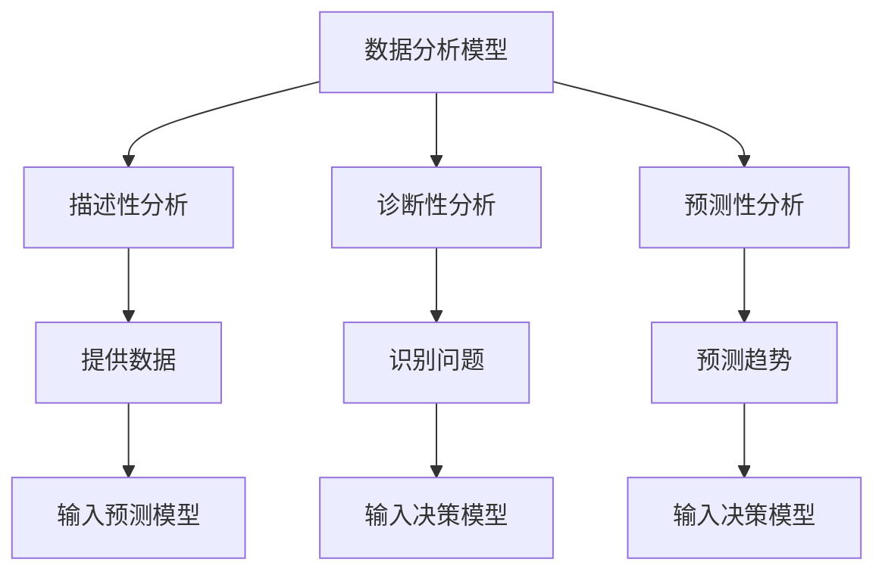

                 

关键词：多元模型、管理洞见、模型思维、技术架构、人工智能、策略规划

> 摘要：本文将深入探讨多元模型思维在管理者决策中的重要性，通过阐述其核心概念与联系，解析核心算法原理与操作步骤，构建数学模型并进行实际应用分析，旨在为管理者提供一套科学、系统、高效的决策框架，助力其在复杂环境中洞察先机。

## 1. 背景介绍

在当今快速变化和高度复杂的环境中，管理者面临着前所未有的挑战。传统的单一思维模式已不足以应对日益复杂的问题，而多元模型思维作为一种新的管理方法论，正逐渐受到重视。多元模型思维强调通过多种不同的模型和视角来理解和管理复杂系统，从而提高决策的准确性和效率。本文将围绕多元模型思维，探讨其在管理者洞见中的重要作用。

### 1.1 多元模型思维的重要性

多元模型思维在管理者决策中具有重要意义，具体体现在以下几个方面：

1. **增强洞见**：通过多种模型和视角的交叉验证，管理者能够更全面、准确地理解问题，从而做出更明智的决策。

2. **提高适应性**：多元模型思维能够帮助管理者更好地适应快速变化的环境，灵活应对各种不确定性。

3. **促进创新**：多元模型思维鼓励管理者采用不同的思维方式和创新方法，从而激发组织内部的创新活力。

4. **优化资源分配**：通过多种模型的综合分析，管理者可以更科学地分配资源，提高资源利用效率。

### 1.2 管理者面临的挑战

在复杂多变的环境中，管理者面临以下几方面的挑战：

1. **信息过载**：大量的数据和信息使得管理者难以筛选和判断，需要借助多元模型思维来提高信息处理能力。

2. **不确定性**：未来的不确定性使得管理者的决策更加困难，多元模型思维提供了一种应对不确定性的方法。

3. **快速变化**：技术的飞速发展和社会的快速变化要求管理者具备敏捷的应变能力，多元模型思维可以帮助管理者适应这种变化。

4. **创新驱动**：在竞争激烈的市场中，创新成为企业持续发展的关键，多元模型思维为管理者提供了创新的视角和方法。

## 2. 核心概念与联系

多元模型思维的核心在于理解和应用多种不同的模型，这些模型包括但不限于数据分析模型、预测模型、决策模型等。以下是对这些核心概念及其相互关系的阐述。

### 2.1 数据分析模型

数据分析模型是多元模型思维的基础，主要包括描述性分析、诊断性分析和预测性分析。描述性分析用于总结和呈现数据特征，诊断性分析用于找出数据中的问题和异常，预测性分析则用于预测未来的趋势和变化。

### 2.2 预测模型

预测模型用于基于历史数据和当前信息来预测未来的趋势。常见的预测模型包括时间序列模型、回归模型、神经网络模型等。预测模型的关键在于如何处理不确定性和噪声，以提高预测的准确性和稳定性。

### 2.3 决策模型

决策模型用于帮助管理者在多个可行方案中做出最优选择。常见的决策模型包括决策树、贝叶斯网络、模拟优化等。决策模型的关键在于如何权衡不同因素之间的利弊，以及在不确定性的情况下做出合理的决策。

### 2.4 多元模型之间的联系

多元模型之间并不是孤立的，而是相互关联、相互补充的。例如，数据分析模型可以提供预测模型的输入数据，预测模型的结果可以用于决策模型的参数调整。通过多种模型的综合应用，管理者能够获得更全面、更准确的信息，从而做出更科学的决策。

### 2.5 Mermaid 流程图

以下是多元模型思维核心概念与联系的 Mermaid 流程图：



## 3. 核心算法原理 & 具体操作步骤

### 3.1 算法原理概述

多元模型思维的核心在于算法的组合应用。以下将介绍几个关键算法及其原理：

1. **时间序列分析**：通过分析时间序列数据，识别数据的周期性、趋势性和季节性，用于预测未来的趋势。
2. **回归分析**：通过建立因变量与自变量之间的关系模型，用于预测和解释数据。
3. **神经网络**：通过模仿人脑神经元之间的连接方式，进行复杂的数据处理和预测。
4. **决策树**：通过分层决策的方式，将数据集划分成不同的子集，用于分类和回归问题。

### 3.2 算法步骤详解

1. **数据收集与预处理**：收集相关数据，包括历史数据、当前数据和外部数据。对数据进行清洗、归一化等预处理。
2. **模型选择与训练**：根据问题的特性选择合适的模型，对模型进行训练和优化。
3. **模型验证与评估**：使用验证集对模型进行评估，调整模型参数，确保模型的有效性和可靠性。
4. **模型应用与决策**：将训练好的模型应用于实际数据，进行预测和决策。

### 3.3 算法优缺点

1. **时间序列分析**：优点是能够捕捉数据的趋势和周期性，缺点是对噪声数据敏感，难以处理复杂的非线性关系。
2. **回归分析**：优点是简单易懂，能够解释变量之间的关系，缺点是容易过拟合，对异常值敏感。
3. **神经网络**：优点是能够处理复杂的非线性关系，缺点是训练过程复杂，对数据量要求较高。
4. **决策树**：优点是易于理解和解释，缺点是容易过拟合，对数据不平衡敏感。

### 3.4 算法应用领域

多元模型思维在多个领域有广泛的应用，包括：

1. **金融领域**：用于风险管理、股票市场预测等。
2. **医疗领域**：用于疾病预测、药物筛选等。
3. **电商领域**：用于客户行为分析、推荐系统等。
4. **能源领域**：用于电力需求预测、能源管理优化等。

## 4. 数学模型和公式 & 详细讲解 & 举例说明

### 4.1 数学模型构建

多元模型思维中的数学模型主要包括线性模型、非线性模型和概率模型等。以下以线性回归模型为例进行说明。

线性回归模型的基本形式为：

$$ y = \beta_0 + \beta_1x_1 + \beta_2x_2 + ... + \beta_nx_n + \epsilon $$

其中，$y$ 是因变量，$x_1, x_2, ..., x_n$ 是自变量，$\beta_0, \beta_1, ..., \beta_n$ 是模型参数，$\epsilon$ 是误差项。

### 4.2 公式推导过程

线性回归模型的推导过程主要包括以下步骤：

1. **最小二乘法**：通过最小化残差平方和来估计模型参数。
2. **正规方程**：将线性回归模型转化为正规方程，求解得到最优参数。
3. **矩阵表示**：将线性回归模型表示为矩阵形式，便于计算。

具体推导过程如下：

$$ \min \sum_{i=1}^n (y_i - (\beta_0 + \beta_1x_{i1} + \beta_2x_{i2} + ... + \beta_nx_{in}))^2 $$

对参数进行偏导并令其等于0，得到正规方程：

$$ (X^T X) \beta = X^T y $$

其中，$X$ 是自变量矩阵，$y$ 是因变量向量，$\beta$ 是模型参数向量。

### 4.3 案例分析与讲解

假设我们要预测一家电商平台的月销售额，自变量包括月均访问量、平均订单价值等。以下是具体的案例分析：

1. **数据收集与预处理**：收集过去一年的月销售额和相应的自变量数据，对数据进行清洗和归一化处理。
2. **模型选择与训练**：选择线性回归模型，使用最小二乘法进行参数估计。
3. **模型验证与评估**：使用验证集对模型进行验证，计算均方误差（MSE）等指标。
4. **模型应用与预测**：使用训练好的模型对未来的月销售额进行预测。

具体代码实现如下：

```python
import numpy as np
import pandas as pd
from sklearn.linear_model import LinearRegression
from sklearn.model_selection import train_test_split
from sklearn.metrics import mean_squared_error

# 数据收集与预处理
data = pd.read_csv('sales_data.csv')
X = data[['visits', 'avg_order_value']]
y = data['sales']

# 模型选择与训练
model = LinearRegression()
X_train, X_test, y_train, y_test = train_test_split(X, y, test_size=0.2, random_state=42)
model.fit(X_train, y_train)

# 模型验证与评估
y_pred = model.predict(X_test)
mse = mean_squared_error(y_test, y_pred)
print(f'MSE: {mse}')

# 模型应用与预测
future_data = pd.DataFrame({'visits': [15000], 'avg_order_value': [100]})
future_sales = model.predict(future_data)
print(f'Future Sales: {future_sales}')
```

## 5. 项目实践：代码实例和详细解释说明

### 5.1 开发环境搭建

在开始项目实践之前，我们需要搭建一个合适的开发环境。以下是具体的步骤：

1. 安装 Python 3.8 或更高版本。
2. 安装 Jupyter Notebook 或 PyCharm 等 Python 集成开发环境（IDE）。
3. 安装必要的 Python 库，如 NumPy、Pandas、scikit-learn 等。

### 5.2 源代码详细实现

以下是一个简单的多元模型应用示例，用于预测一家电商平台的月销售额。

```python
import numpy as np
import pandas as pd
from sklearn.linear_model import LinearRegression
from sklearn.model_selection import train_test_split
from sklearn.metrics import mean_squared_error
import matplotlib.pyplot as plt

# 数据收集与预处理
data = pd.read_csv('sales_data.csv')
X = data[['visits', 'avg_order_value']]
y = data['sales']

# 数据可视化
plt.scatter(X['visits'], y)
plt.xlabel('Visits')
plt.ylabel('Sales')
plt.show()

# 模型选择与训练
model = LinearRegression()
X_train, X_test, y_train, y_test = train_test_split(X, y, test_size=0.2, random_state=42)
model.fit(X_train, y_train)

# 模型验证与评估
y_pred = model.predict(X_test)
mse = mean_squared_error(y_test, y_pred)
print(f'MSE: {mse}')

# 模型应用与预测
future_data = pd.DataFrame({'visits': [15000], 'avg_order_value': [100]})
future_sales = model.predict(future_data)
print(f'Future Sales: {future_sales}')

# 数据可视化
plt.scatter(X_test['visits'], y_test, label='Actual')
plt.plot(X_test['visits'], y_pred, color='red', linewidth=2, label='Predicted')
plt.xlabel('Visits')
plt.ylabel('Sales')
plt.legend()
plt.show()
```

### 5.3 代码解读与分析

1. **数据收集与预处理**：使用 Pandas 读取数据，对数据进行清洗和归一化处理。
2. **数据可视化**：使用 Matplotlib 绘制散点图，帮助理解数据分布。
3. **模型选择与训练**：选择线性回归模型，使用训练集进行训练。
4. **模型验证与评估**：使用测试集对模型进行验证，计算均方误差（MSE）。
5. **模型应用与预测**：使用训练好的模型对未来的月销售额进行预测。
6. **数据可视化**：绘制预测结果，与实际数据对比，验证模型的效果。

## 6. 实际应用场景

多元模型思维在多个实际应用场景中具有重要价值。以下是一些具体的应用案例：

### 6.1 金融领域

在金融领域，多元模型思维可用于股票市场预测、风险管理、信用评分等。通过结合时间序列分析、回归分析和神经网络等模型，管理者可以更准确地预测市场趋势和风险，为投资决策提供有力支持。

### 6.2 医疗领域

在医疗领域，多元模型思维可用于疾病预测、药物筛选和个性化治疗等。通过分析患者的病史、基因数据、体检结果等，构建多元模型，可以提高疾病预测的准确性和治疗效果。

### 6.3 电商领域

在电商领域，多元模型思维可用于客户行为分析、推荐系统和广告投放等。通过分析用户的浏览历史、购买记录、社交网络等数据，构建多元模型，可以更好地理解用户需求，提高用户体验和销售额。

### 6.4 能源领域

在能源领域，多元模型思维可用于电力需求预测、能源管理优化等。通过分析历史数据、天气状况、用户行为等，构建多元模型，可以提高能源利用效率，降低能源成本。

## 7. 未来应用展望

随着技术的不断进步和大数据、人工智能等领域的快速发展，多元模型思维将在更多领域得到应用。以下是一些未来应用展望：

### 7.1 基因编辑与个性化医疗

随着基因编辑技术的成熟，多元模型思维可以用于构建个性化医疗模型，为患者提供精准的治疗方案。

### 7.2 自动驾驶与智能交通

在自动驾驶和智能交通领域，多元模型思维可以用于交通流量预测、路线规划等，提高交通效率和安全性。

### 7.3 环境保护与可持续发展

在环境保护和可持续发展领域，多元模型思维可以用于气候变化预测、能源管理优化等，推动绿色发展。

### 7.4 社会治理与公共安全

在社会治理和公共安全领域，多元模型思维可以用于风险评估、犯罪预测等，提高社会治理水平。

## 8. 工具和资源推荐

### 8.1 学习资源推荐

1. 《统计学习方法》（李航著）：介绍各种统计学习方法的原理和实现。
2. 《深度学习》（Goodfellow et al. 著）：深入讲解深度学习的基本概念和算法。
3. 《机器学习实战》（冼奎锋等著）：通过实际案例介绍机器学习的应用。

### 8.2 开发工具推荐

1. Jupyter Notebook：用于数据分析和模型实现的交互式开发环境。
2. PyCharm：功能强大的 Python 集成开发环境，适合进行模型训练和代码编写。
3. TensorFlow：开源的深度学习框架，适用于构建和训练大规模神经网络模型。

### 8.3 相关论文推荐

1. “Deep Learning for Natural Language Processing”（Merity et al., 2017）：介绍深度学习在自然语言处理中的应用。
2. “Bayesian Deep Learning”（Gal et al., 2015）：探讨深度学习中的概率模型和不确定性处理。
3. “Generative Adversarial Networks”（Goodfellow et al., 2014）：介绍生成对抗网络的基本原理和应用。

## 9. 总结：未来发展趋势与挑战

多元模型思维作为一种新兴的管理方法论，具有广阔的发展前景。未来，多元模型思维将在更多领域得到应用，成为管理者洞见的重要工具。然而，在实际应用过程中，多元模型思维也面临一些挑战：

1. **数据质量和可靠性**：多元模型的应用效果在很大程度上依赖于数据的质量和可靠性。未来需要加强对数据质量的控制和评估，以提高模型的可信度。

2. **模型解释性**：多元模型通常涉及复杂的算法和参数，导致模型解释性较差。未来需要开发可解释的多元模型，以便管理者更好地理解和应用。

3. **计算资源需求**：多元模型的应用通常需要大量的计算资源，尤其是在处理大规模数据集时。未来需要开发更高效、更优化的算法，以满足计算需求。

4. **伦理和社会责任**：多元模型思维在应用过程中可能涉及个人隐私、数据安全和伦理等问题。未来需要建立相应的伦理和社会责任框架，以确保模型的公正和透明。

总之，多元模型思维为管理者提供了强大的洞见工具，但同时也需要面对一系列挑战。通过不断探索和创新，我们可以充分发挥多元模型思维的优势，为管理者提供更加科学、系统、高效的决策支持。

## 10. 附录：常见问题与解答

### 10.1 多元模型思维与传统思维模式有何区别？

多元模型思维与传统思维模式的主要区别在于：

1. **思维角度**：多元模型思维采用多种不同的模型和视角来理解问题，而传统思维模式通常局限于单一视角。
2. **处理复杂性**：多元模型思维能够更好地处理复杂问题，通过多种模型的交叉验证和综合分析，提高决策的准确性和可靠性。
3. **应对不确定性**：多元模型思维强调在不确定性的环境中做出合理决策，而传统思维模式通常基于确定性的假设。

### 10.2 多元模型思维在哪个领域应用最为广泛？

多元模型思维在多个领域都有广泛应用，其中主要包括：

1. **金融领域**：用于股票市场预测、风险管理、信用评分等。
2. **医疗领域**：用于疾病预测、药物筛选和个性化治疗等。
3. **电商领域**：用于客户行为分析、推荐系统和广告投放等。
4. **能源领域**：用于电力需求预测、能源管理优化等。

### 10.3 多元模型思维如何应用于企业决策？

企业在应用多元模型思维进行决策时，可以遵循以下步骤：

1. **数据收集与预处理**：收集与企业决策相关的数据，对数据进行清洗和归一化处理。
2. **模型选择与训练**：根据问题特性选择合适的模型，对模型进行训练和优化。
3. **模型验证与评估**：使用验证集对模型进行评估，调整模型参数，确保模型的有效性和可靠性。
4. **模型应用与决策**：将训练好的模型应用于实际数据，进行预测和决策。
5. **持续迭代与优化**：根据实际应用效果，对模型进行持续迭代和优化，提高决策的准确性和效率。

### 10.4 多元模型思维在人工智能领域有哪些应用？

多元模型思维在人工智能领域有以下几类主要应用：

1. **机器学习**：通过结合多种机器学习算法，提高模型的准确性和泛化能力。
2. **自然语言处理**：用于文本分类、情感分析、机器翻译等任务。
3. **计算机视觉**：用于图像识别、目标检测、图像生成等任务。
4. **强化学习**：用于游戏、自动驾驶等复杂决策问题。

### 10.5 如何评估多元模型的应用效果？

评估多元模型的应用效果可以从以下几个方面进行：

1. **准确性**：评估模型预测的准确性，如准确率、召回率等指标。
2. **稳定性**：评估模型在不同数据集上的稳定性和一致性。
3. **可解释性**：评估模型的可解释性，确保管理者能够理解模型的决策过程。
4. **计算效率**：评估模型的计算效率和资源占用情况。
5. **实际应用效果**：评估模型在实际应用中的效果，如业务指标的提升等。

### 作者署名

作者：禅与计算机程序设计艺术 / Zen and the Art of Computer Programming

---

通过本文的详细探讨，我们深入了解了多元模型思维在管理者洞见中的重要作用，以及如何通过多种模型和视角来提高决策的准确性和效率。希望本文能为管理者提供有益的启示和指导，助力他们在复杂环境中洞见先机。在未来，多元模型思维将在更多领域得到应用，成为推动社会进步的重要力量。

