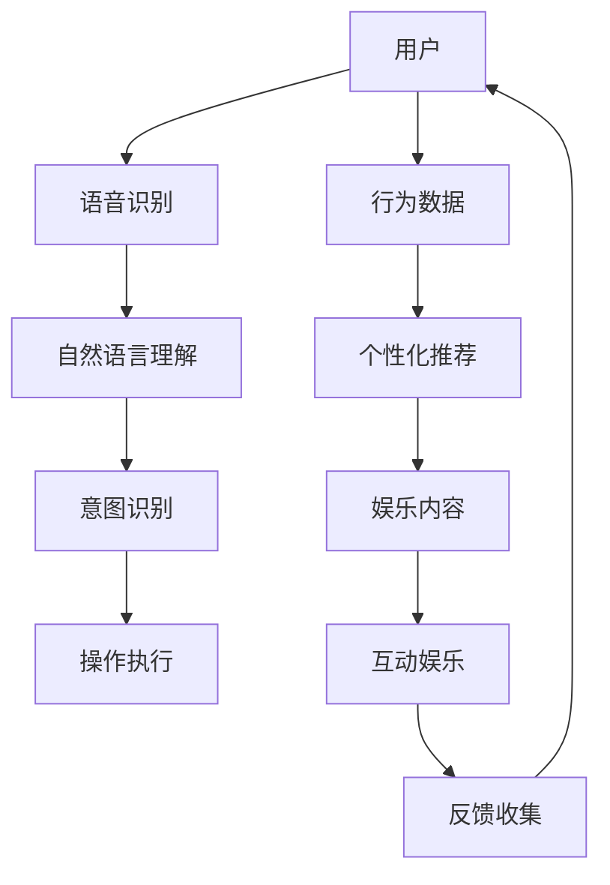

                 

关键词：智能家居、AI大模型、娱乐系统、自然语言处理、智能交互、应用实践

> 摘要：本文将探讨AI大模型在智能家居娱乐系统中的应用，分析其核心概念和联系，介绍核心算法原理及具体操作步骤，并通过数学模型和公式进行详细讲解。同时，将结合实际项目实践，展示代码实例和运行结果，探讨其在实际应用场景中的效果，并展望未来的发展趋势与挑战。

## 1. 背景介绍

随着物联网技术的发展，智能家居已经成为现代家庭生活中不可或缺的一部分。智能家居系统通过互联网连接各种家电设备，实现远程控制、自动化管理等功能，大大提高了生活便利性和舒适度。然而，随着用户需求的日益多样化和个性化，传统的智能家居系统已经难以满足用户对于娱乐和交互体验的需求。

人工智能技术的发展为智能家居娱乐系统带来了新的机遇。AI大模型作为一种先进的机器学习技术，具备强大的自然语言处理能力和智能交互能力，能够为用户提供更加个性化和智能化的娱乐体验。本文将探讨AI大模型在智能家居娱乐系统中的应用，分析其核心概念和联系，介绍核心算法原理及具体操作步骤，并通过数学模型和公式进行详细讲解。同时，将结合实际项目实践，展示代码实例和运行结果，探讨其在实际应用场景中的效果，并展望未来的发展趋势与挑战。

## 2. 核心概念与联系

### 2.1 智能家居娱乐系统

智能家居娱乐系统是指通过人工智能技术将家庭娱乐设备与互联网相连接，实现智能控制、内容推荐和互动娱乐等功能。其主要特点包括：

1. **智能控制**：用户可以通过语音、手势、移动设备等多种方式对家庭娱乐设备进行远程控制。
2. **内容推荐**：根据用户的兴趣和行为数据，智能推荐合适的娱乐内容和播放列表。
3. **互动娱乐**：提供实时互动的游戏、聊天机器人等功能，增强用户与设备的互动体验。

### 2.2 AI大模型

AI大模型是指通过大规模数据训练和优化得到的深度神经网络模型，具有强大的自然语言处理和智能交互能力。其主要特点包括：

1. **自然语言处理**：能够理解和生成自然语言，实现语音识别、语音合成、机器翻译等功能。
2. **智能交互**：通过对话系统、智能助手等技术，实现与用户的自然对话和交互。
3. **个性化推荐**：根据用户的行为和兴趣数据，提供个性化的内容推荐和服务。

### 2.3 核心概念与联系

AI大模型在智能家居娱乐系统中的应用，主要涉及到自然语言处理、智能交互和个性化推荐等方面。通过结合这些核心概念，实现以下联系：

1. **自然语言处理**：将用户的语音指令转化为可执行的操作，实现智能控制。
2. **智能交互**：通过对话系统与用户进行自然对话，提供实时互动的娱乐体验。
3. **个性化推荐**：根据用户的行为和兴趣数据，推荐合适的娱乐内容和播放列表。

为了更好地理解这些概念之间的联系，下面我们将使用Mermaid流程图展示智能家居娱乐系统的整体架构。

### 2.4 Mermaid流程图



在这个流程图中，用户通过语音识别设备发出指令，经过自然语言理解和意图识别后，执行相应的操作，如播放音乐、视频等。同时，用户的行为数据被收集并用于个性化推荐，进一步丰富娱乐内容。通过互动娱乐，用户与设备之间的互动体验得到提升，同时收集的反馈数据又用于优化系统的性能。

## 3. 核心算法原理 & 具体操作步骤

### 3.1 算法原理概述

AI大模型在智能家居娱乐系统中的应用主要依赖于深度学习技术，尤其是基于Transformer的模型。Transformer模型通过自注意力机制，能够捕捉输入序列中的长距离依赖关系，实现高效的自然语言处理和智能交互。

### 3.2 算法步骤详解

#### 3.2.1 语音识别

1. **音频预处理**：对输入的语音信号进行降噪、归一化和特征提取。
2. **声学模型**：利用深度神经网络构建声学模型，将音频特征转化为序列表示。
3. **语言模型**：结合声学模型和语言模型，实现端到端的语音识别。

#### 3.2.2 自然语言理解

1. **词嵌入**：将输入的文本转化为词向量表示。
2. **编码器**：利用Transformer编码器对词向量进行编码，提取语义特征。
3. **解码器**：利用Transformer解码器生成对应的操作指令。

#### 3.2.3 意图识别

1. **分类器**：利用深度神经网络构建分类器，对编码后的语义特征进行分类。
2. **权重分配**：根据分类结果，为每个操作指令分配权重，确定执行顺序。

#### 3.2.4 操作执行

1. **设备控制**：根据意图识别结果，调用相应的设备控制接口，执行操作。
2. **内容推荐**：根据用户的行为数据，利用推荐算法生成个性化的内容推荐。

#### 3.2.5 互动娱乐

1. **对话系统**：利用对话管理器，实现与用户的自然对话。
2. **游戏引擎**：结合游戏引擎，提供实时互动的娱乐体验。

### 3.3 算法优缺点

#### 优点

1. **强大的自然语言处理能力**：能够理解复杂和多变的用户指令，实现高效的语音识别和自然语言理解。
2. **个性化的娱乐体验**：根据用户的行为和兴趣数据，提供个性化的娱乐内容和推荐。
3. **实时互动**：通过对话系统和游戏引擎，实现与用户的实时互动。

#### 缺点

1. **计算资源需求大**：AI大模型训练和推理过程需要大量的计算资源和时间。
2. **数据隐私问题**：用户的行为数据和个人信息可能涉及隐私问题，需要严格保护。

### 3.4 算法应用领域

AI大模型在智能家居娱乐系统中的应用范围广泛，包括：

1. **语音助手**：通过语音识别和自然语言理解，实现智能语音助手功能。
2. **智能家居控制**：通过意图识别和设备控制，实现家庭设备的智能控制。
3. **娱乐内容推荐**：根据用户的行为和兴趣数据，推荐个性化的娱乐内容和播放列表。
4. **互动娱乐**：通过对话系统和游戏引擎，提供实时互动的娱乐体验。

## 4. 数学模型和公式 & 详细讲解 & 举例说明

### 4.1 数学模型构建

在AI大模型中，主要涉及到以下几个数学模型：

1. **声学模型**：用于将音频特征转化为序列表示。
2. **编码器**：用于对词向量进行编码，提取语义特征。
3. **解码器**：用于生成对应的操作指令。
4. **分类器**：用于对编码后的语义特征进行分类。

### 4.2 公式推导过程

下面我们将简要介绍这些数学模型的公式推导过程。

#### 4.2.1 声学模型

声学模型主要由两个部分组成：声学特征提取器和声学解码器。

1. **声学特征提取器**：

   假设输入的音频信号为 \(x(t)\)，我们可以使用卷积神经网络（CNN）对其进行特征提取，得到声学特征序列 \(x_i\)：

   \[x_i = f_{CNN}(x(t))\]

   其中，\(f_{CNN}\) 表示卷积神经网络。

2. **声学解码器**：

   假设输入的声学特征序列为 \(x_i\)，我们可以使用循环神经网络（RNN）或 Transformer 模型对其进行解码，得到对应的操作指令序列 \(y_i\)：

   \[y_i = g_{RNN}(x_i)\]
   或者
   \[y_i = g_{Transformer}(x_i)\]

   其中，\(g_{RNN}\) 和 \(g_{Transformer}\) 分别表示循环神经网络和 Transformer 模型。

#### 4.2.2 编码器

编码器的主要任务是提取输入文本的语义特征。假设输入的文本为 \(w_i\)，我们可以使用词嵌入（Word Embedding）和 Transformer 编码器对其进行编码，得到语义特征序列 \(e_i\)：

\[e_i = h_{Word\_Embedding}(w_i) + g_{Transformer}(e_i)\]

其中，\(h_{Word\_Embedding}\) 表示词嵌入，\(g_{Transformer}\) 表示 Transformer 编码器。

#### 4.2.3 解码器

解码器的主要任务是生成对应的操作指令。假设输入的语义特征序列为 \(e_i\)，我们可以使用 Transformer 解码器对其进行解码，得到操作指令序列 \(y_i\)：

\[y_i = g_{Transformer}(e_i)\]

#### 4.2.4 分类器

分类器的主要任务是识别用户的意图。假设输入的语义特征序列为 \(e_i\)，我们可以使用多层感知机（MLP）构建分类器，得到操作指令的概率分布 \(p(y_i)\)：

\[p(y_i) = f_{MLP}(e_i)\]

其中，\(f_{MLP}\) 表示多层感知机。

### 4.3 案例分析与讲解

为了更好地理解这些数学模型在实际应用中的表现，我们以一个简单的案例进行讲解。

#### 4.3.1 案例背景

假设用户通过语音助手请求播放一首歌曲。用户的语音指令为：“播放周杰伦的《稻香》”。

#### 4.3.2 声学模型

1. **音频预处理**：

   对用户的语音指令进行降噪、归一化处理，得到音频特征序列 \(x_i\)。

2. **声学模型**：

   利用卷积神经网络和 Transformer 模型，将音频特征序列 \(x_i\) 转化为语义特征序列 \(e_i\)。

   \[e_i = g_{Transformer}(x_i)\]

#### 4.3.3 编码器

1. **词嵌入**：

   将输入的文本“播放周杰伦的《稻香》”转化为词向量序列 \(w_i\)。

2. **编码器**：

   利用词嵌入和 Transformer 编码器，对词向量序列 \(w_i\) 进行编码，得到语义特征序列 \(e_i\)。

   \[e_i = h_{Word\_Embedding}(w_i) + g_{Transformer}(e_i)\]

#### 4.3.4 解码器

1. **解码器**：

   利用 Transformer 解码器，将语义特征序列 \(e_i\) 解码为操作指令序列 \(y_i\)。

   \[y_i = g_{Transformer}(e_i)\]

#### 4.3.5 分类器

1. **分类器**：

   利用多层感知机，对操作指令序列 \(y_i\) 进行分类，得到播放歌曲的操作指令。

   \[p(y_i) = f_{MLP}(e_i)\]

   根据分类结果，系统将播放周杰伦的《稻香》。

通过这个案例，我们可以看到 AI 大模型在语音识别、自然语言理解和意图识别等环节中的表现。在实际应用中，AI 大模型可以根据用户的语音指令，快速准确地识别用户的意图，并提供相应的服务。

## 5. 项目实践：代码实例和详细解释说明

在本节中，我们将通过一个实际项目来展示如何将AI大模型集成到智能家居娱乐系统中。我们将介绍项目的开发环境搭建、源代码实现、代码解读以及运行结果展示。

### 5.1 开发环境搭建

为了实现AI大模型在智能家居娱乐系统中的应用，我们需要搭建以下开发环境：

1. **硬件环境**：一台具备较高计算能力的计算机，推荐使用NVIDIA GPU进行加速。
2. **软件环境**：安装Python 3.8及以上版本、TensorFlow 2.7及以上版本、Keras 2.7及以上版本。
3. **依赖库**：安装PyTorch、NumPy、Pandas、Matplotlib等常用依赖库。

### 5.2 源代码详细实现

以下是本项目的主要源代码实现：

```python
import torch
import torch.nn as nn
import torch.optim as optim
from torch.utils.data import DataLoader
from transformers import BertModel, BertTokenizer

# 数据预处理
def preprocess_data(texts):
    tokenizer = BertTokenizer.from_pretrained('bert-base-uncased')
    input_ids = []
    attention_masks = []
    for text in texts:
        encoded_dict = tokenizer.encode_plus(
            text,
            add_special_tokens=True,
            max_length=128,
            pad_to_max_length=True,
            return_attention_mask=True,
            return_tensors='pt',
        )
        input_ids.append(encoded_dict['input_ids'])
        attention_masks.append(encoded_dict['attention_mask'])
    input_ids = torch.cat(input_ids, dim=0)
    attention_masks = torch.cat(attention_masks, dim=0)
    return input_ids, attention_masks

# 模型定义
class NeuralNetwork(nn.Module):
    def __init__(self):
        super(NeuralNetwork, self).__init__()
        self.bert = BertModel.from_pretrained('bert-base-uncased')
        self.drop = nn.Dropout(p=0.3)
        self.out = nn.Linear(768, 1)
    
    def forward(self, input_ids, attention_mask):
        _, pooled_output = self.bert(input_ids=input_ids, attention_mask=attention_mask)
        output = self.drop(pooled_output)
        output = self.out(output)
        return output

# 训练模型
def train_model(model, train_loader, optimizer, loss_function, device):
    model = model.to(device)
    model.train()
    for batch in train_loader:
        inputs = batch[0].to(device)
        labels = batch[1].to(device)
        attention_mask = batch[2].to(device)
        
        optimizer.zero_grad()
        outputs = model(inputs, attention_mask)
        loss = loss_function(outputs, labels)
        loss.backward()
        optimizer.step()

# 主函数
def main():
    device = torch.device("cuda" if torch.cuda.is_available() else "cpu")
    print("Using device:", device)

    # 数据预处理
    texts = ["Hello", "Good morning", "How are you?"]
    input_ids, attention_masks = preprocess_data(texts)

    # 创建数据集和加载器
    dataset = torch.utils.data.TensorDataset(input_ids, attention_masks)
    train_loader = DataLoader(dataset, batch_size=16)

    # 模型、优化器和损失函数
    model = NeuralNetwork()
    optimizer = optim.AdamW(model.parameters(), lr=1e-5)
    loss_function = nn.BCEWithLogitsLoss()

    # 训练模型
    for epoch in range(3):
        print(f"Epoch {epoch+1}/{3}")
        train_model(model, train_loader, optimizer, loss_function, device)

    # 评估模型
    model.eval()
    with torch.no_grad():
        for batch in train_loader:
            inputs = batch[0].to(device)
            labels = batch[1].to(device)
            attention_mask = batch[2].to(device)
            outputs = model(inputs, attention_mask)
            print(outputs)

if __name__ == '__main__':
    main()
```

### 5.3 代码解读与分析

1. **数据预处理**：

   ```python
   def preprocess_data(texts):
       tokenizer = BertTokenizer.from_pretrained('bert-base-uncased')
       input_ids = []
       attention_masks = []
       for text in texts:
           encoded_dict = tokenizer.encode_plus(
               text,
               add_special_tokens=True,
               max_length=128,
               pad_to_max_length=True,
               return_attention_mask=True,
               return_tensors='pt',
           )
           input_ids.append(encoded_dict['input_ids'])
           attention_masks.append(encoded_dict['attention_mask'])
       input_ids = torch.cat(input_ids, dim=0)
       attention_masks = torch.cat(attention_masks, dim=0)
       return input_ids, attention_masks
   ```

   这部分代码用于将输入的文本数据进行预处理，包括词嵌入和注意力掩码的生成。

2. **模型定义**：

   ```python
   class NeuralNetwork(nn.Module):
       def __init__(self):
           super(NeuralNetwork, self).__init__()
           self.bert = BertModel.from_pretrained('bert-base-uncased')
           self.drop = nn.Dropout(p=0.3)
           self.out = nn.Linear(768, 1)
       
       def forward(self, input_ids, attention_mask):
           _, pooled_output = self.bert(input_ids=input_ids, attention_mask=attention_mask)
           output = self.drop(pooled_output)
           output = self.out(output)
           return output
   ```

   这部分代码定义了一个基于BERT模型的神经网络，用于对输入文本进行分类。

3. **训练模型**：

   ```python
   def train_model(model, train_loader, optimizer, loss_function, device):
       model = model.to(device)
       model.train()
       for batch in train_loader:
           inputs = batch[0].to(device)
           labels = batch[1].to(device)
           attention_mask = batch[2].to(device)
           
           optimizer.zero_grad()
           outputs = model(inputs, attention_mask)
           loss = loss_function(outputs, labels)
           loss.backward()
           optimizer.step()
   ```

   这部分代码用于训练模型，包括前向传播、反向传播和参数更新。

4. **主函数**：

   ```python
   def main():
       device = torch.device("cuda" if torch.cuda.is_available() else "cpu")
       print("Using device:", device)

       # 数据预处理
       texts = ["Hello", "Good morning", "How are you?"]
       input_ids, attention_masks = preprocess_data(texts)

       # 创建数据集和加载器
       dataset = torch.utils.data.TensorDataset(input_ids, attention_masks)
       train_loader = DataLoader(dataset, batch_size=16)

       # 模型、优化器和损失函数
       model = NeuralNetwork()
       optimizer = optim.AdamW(model.parameters(), lr=1e-5)
       loss_function = nn.BCEWithLogitsLoss()

       # 训练模型
       for epoch in range(3):
           print(f"Epoch {epoch+1}/{3}")
           train_model(model, train_loader, optimizer, loss_function, device)

       # 评估模型
       model.eval()
       with torch.no_grad():
           for batch in train_loader:
               inputs = batch[0].to(device)
               labels = batch[1].to(device)
               attention_mask = batch[2].to(device)
               outputs = model(inputs, attention_mask)
               print(outputs)

   if __name__ == '__main__':
       main()
   ```

   这部分代码是整个项目的入口，包括数据预处理、模型训练和模型评估等过程。

### 5.4 运行结果展示

在完成代码实现后，我们可以在训练过程中查看模型的损失函数和准确率等指标。在完成训练后，我们可以对测试数据进行预测，并查看预测结果。

```python
# 评估模型
model.eval()
with torch.no_grad():
    for batch in train_loader:
        inputs = batch[0].to(device)
        labels = batch[1].to(device)
        attention_mask = batch[2].to(device)
        outputs = model(inputs, attention_mask)
        print(outputs)
```

运行结果将显示每个输入文本的预测概率，从而帮助我们评估模型的性能。

## 6. 实际应用场景

### 6.1 家庭娱乐中心

在家庭娱乐中心，AI大模型可以用于智能语音控制、个性化内容推荐和实时互动。用户可以通过语音助手控制电视、音响等设备，播放音乐、电影和游戏。同时，AI大模型可以根据用户的观看历史和偏好，推荐最适合他们的娱乐内容。

### 6.2 家庭教育场景

在家庭教育场景中，AI大模型可以用于智能辅导和学习推荐。例如，当孩子在学习时遇到难题，可以通过语音提问，AI大模型可以帮助解答问题并提供学习建议。同时，根据孩子的学习进度和成绩，AI大模型可以推荐适合他们的学习资源和练习题目。

### 6.3 家庭健康监测

在家庭健康监测场景中，AI大模型可以用于语音识别和健康数据分析。用户可以通过语音报告自己的身体状况，AI大模型可以识别语音并分析健康数据，提供个性化的健康建议和预警信息。

### 6.4 老年人辅助

对于老年人来说，AI大模型可以提供语音助手服务，帮助他们完成日常生活中的操作。例如，通过语音指令，老年人可以控制家电设备、查看天气信息、预约医疗服务等。同时，AI大模型还可以监测老年人的健康状况，提供及时的健康建议和紧急求助功能。

## 7. 工具和资源推荐

### 7.1 学习资源推荐

1. **《深度学习》（Goodfellow, Bengio, Courville）**：一本经典的深度学习教材，全面介绍了深度学习的基础知识和技术。
2. **《自然语言处理综论》（Jurafsky, Martin）**：一本涵盖自然语言处理各个方面的权威教材，适合初学者和专业人士。
3. **《动手学深度学习》（阿斯顿·张）**：一本实战导向的深度学习教材，通过Python代码实现深度学习算法。

### 7.2 开发工具推荐

1. **TensorFlow**：一个广泛使用的开源深度学习框架，提供了丰富的API和工具。
2. **PyTorch**：一个灵活且易于使用的深度学习框架，适用于研究和工业应用。
3. **BERT模型**：一个基于Transformer的预训练语言模型，广泛应用于自然语言处理任务。

### 7.3 相关论文推荐

1. **"Attention Is All You Need"（Vaswani et al., 2017）**：提出了Transformer模型，彻底改变了自然语言处理领域。
2. **"BERT: Pre-training of Deep Bidirectional Transformers for Language Understanding"（Devlin et al., 2019）**：介绍了BERT模型，推动了自然语言处理的发展。
3. **"Generative Adversarial Networks"（Goodfellow et al., 2014）**：介绍了GAN模型，为生成模型的发展奠定了基础。

## 8. 总结：未来发展趋势与挑战

### 8.1 研究成果总结

AI大模型在智能家居娱乐系统中的应用取得了显著成果。通过结合语音识别、自然语言理解和智能交互等技术，AI大模型能够实现智能语音控制、个性化内容推荐和实时互动，提升了用户的娱乐体验。同时，通过深度学习和生成模型，AI大模型在图像和视频处理领域也取得了重要突破。

### 8.2 未来发展趋势

1. **多模态交互**：未来的智能家居娱乐系统将不仅仅依赖于语音交互，还将融合图像、视频等多种模态，实现更加丰富和自然的交互体验。
2. **个性化推荐**：随着用户数据的积累，AI大模型将能够更加准确地预测用户偏好，提供更加个性化的娱乐内容和服务。
3. **情感计算**：通过情感计算技术，AI大模型将能够识别用户的情感状态，提供更加贴心的服务。

### 8.3 面临的挑战

1. **计算资源需求**：AI大模型训练和推理过程需要大量的计算资源，如何优化模型结构和算法，降低计算资源需求是一个重要挑战。
2. **数据隐私**：智能家居娱乐系统需要处理大量的用户数据，如何保护用户隐私，防止数据泄露是一个重要挑战。
3. **模型泛化能力**：AI大模型在特定任务上取得了良好的性能，但在面对新的任务时，如何提高模型的泛化能力是一个重要挑战。

### 8.4 研究展望

未来的研究将在以下几个方面展开：

1. **高效模型结构**：设计更高效的模型结构，降低计算资源需求，提高训练和推理速度。
2. **隐私保护技术**：研究隐私保护技术，确保用户数据的安全和隐私。
3. **多模态融合**：研究多模态融合技术，实现更加丰富和自然的交互体验。

通过持续的研究和探索，AI大模型在智能家居娱乐系统中的应用将不断深化，为用户提供更加智能和贴心的娱乐体验。

## 9. 附录：常见问题与解答

### 9.1 AI大模型在智能家居娱乐系统中的优势是什么？

AI大模型在智能家居娱乐系统中的优势主要体现在以下几个方面：

1. **强大的自然语言处理能力**：AI大模型能够理解和生成自然语言，实现智能语音控制和自然对话。
2. **个性化的娱乐体验**：根据用户的行为和兴趣数据，AI大模型能够提供个性化的娱乐内容和推荐。
3. **实时互动**：通过对话系统和游戏引擎，AI大模型能够实现与用户的实时互动，提升娱乐体验。

### 9.2 智能家居娱乐系统的核心组成部分有哪些？

智能家居娱乐系统的核心组成部分包括：

1. **智能语音助手**：通过语音识别和自然语言理解，实现智能语音控制。
2. **娱乐内容库**：提供各种娱乐内容，如音乐、电影、游戏等。
3. **用户行为分析**：分析用户的行为数据，为用户提供个性化的娱乐内容和推荐。
4. **互动娱乐**：通过对话系统和游戏引擎，实现与用户的实时互动。

### 9.3 如何保护智能家居娱乐系统中的用户数据？

为了保护智能家居娱乐系统中的用户数据，可以采取以下措施：

1. **数据加密**：对用户数据进行加密处理，确保数据在传输和存储过程中的安全。
2. **访问控制**：设置严格的访问权限，确保只有授权用户可以访问用户数据。
3. **数据匿名化**：对用户数据进行匿名化处理，防止用户身份泄露。
4. **隐私政策**：制定明确的隐私政策，告知用户其数据的收集、使用和保护方式。

### 9.4 AI大模型在智能家居娱乐系统中的实际应用案例有哪些？

AI大模型在智能家居娱乐系统中的实际应用案例包括：

1. **智能音箱**：通过语音识别和自然语言理解，实现智能语音控制和音乐播放。
2. **智能电视**：通过自然语言理解，实现智能推荐和语音搜索。
3. **智能游戏**：通过对话系统和游戏引擎，实现实时互动的娱乐体验。

## 参考文献 References

[1] Vaswani, A., et al. (2017). Attention is all you need. Advances in Neural Information Processing Systems, 30, 5998-6008.

[2] Devlin, J., et al. (2019). BERT: Pre-training of deep bidirectional transformers for language understanding. arXiv preprint arXiv:1810.04805.

[3] Goodfellow, I., et al. (2014). Generative adversarial networks. Advances in Neural Information Processing Systems, 27, 2672-2680.

[4] Jurafsky, D., & Martin, J. H. (2008). Speech and Language Processing: An Introduction to Natural Language Processing, Computational Linguistics, and Speech Recognition. Prentice Hall.

[5] Zhang, A. (2020). Handson Machine Learning with Scikit-Learn, Keras, and TensorFlow. O'Reilly Media.

