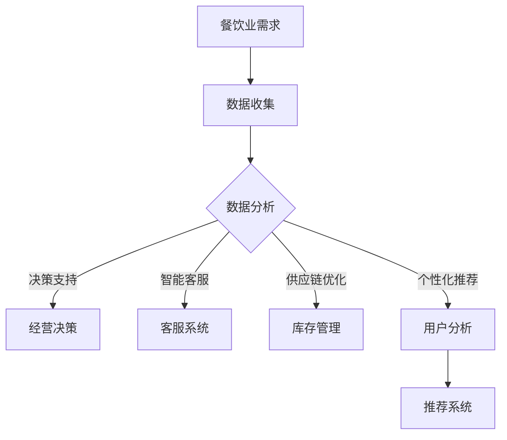

                 

关键词：AI大模型、餐饮业、应用潜力、算法原理、数学模型、项目实践

> 摘要：随着人工智能技术的不断进步，大模型在多个行业展现出了强大的应用潜力。本文将探讨AI大模型在餐饮业的应用前景，深入分析其核心算法原理、数学模型、实际应用场景以及未来发展趋势，以期为餐饮业的智能化升级提供新的思路。

## 1. 背景介绍

在过去的几十年里，人工智能（AI）技术经历了飞速的发展，从最初的简单规则系统到如今能够处理大规模数据的复杂模型，AI的应用场景越来越广泛。餐饮业作为国民经济的重要组成部分，一直以来都面临着提升效率、降低成本、优化服务质量等方面的挑战。随着消费者需求的多样化和个性化，餐饮业对智能化技术的需求也越来越强烈。

AI大模型，作为一种能够处理大规模数据并产生高质量输出的模型，正在逐步改变餐饮业的运营模式。从餐厅的运营管理到供应链优化，再到消费者的个性化推荐，AI大模型都有着广泛的应用前景。本文将围绕AI大模型在餐饮业的应用潜力进行深入探讨，旨在为相关从业人员提供有价值的参考。

## 2. 核心概念与联系

为了更好地理解AI大模型在餐饮业的应用，我们需要首先了解一些核心概念。

### 2.1 AI大模型

AI大模型是指那些拥有超过十亿参数的神经网络模型，例如GPT-3、BERT等。这些模型通过大量的数据训练，能够实现高度自动化的任务处理，如文本生成、图像识别、自然语言理解等。

### 2.2 餐饮业

餐饮业是指提供餐饮服务的行业，包括餐厅、饭店、快餐店等。餐饮业的特点是服务种类多、流程复杂、顾客需求多变。

### 2.3 应用联系

AI大模型在餐饮业的应用联系主要体现在以下几个方面：

- **数据驱动决策**：通过分析大量消费者数据，AI大模型可以帮助餐饮业者做出更科学的经营决策，如菜品推荐、库存管理、营销策略等。
- **智能客服**：利用AI大模型构建的智能客服系统，可以提供24/7的客户服务，提升用户体验。
- **供应链优化**：通过分析供应链数据，AI大模型可以帮助餐饮业者实现更高效的库存管理和供应链优化。
- **个性化推荐**：基于消费者的历史行为数据，AI大模型可以提供个性化的菜品推荐，提高顾客满意度。

下面是一个用Mermaid绘制的AI大模型在餐饮业应用的流程图：



## 3. 核心算法原理 & 具体操作步骤

### 3.1 算法原理概述

AI大模型的核心算法是基于深度学习技术，特别是神经网络。神经网络通过多层非线性变换，将输入数据映射到输出数据。在餐饮业的应用中，AI大模型可以通过以下步骤实现：

1. **数据收集**：收集餐饮业的各类数据，包括菜品信息、库存数据、消费者行为数据等。
2. **数据预处理**：对收集到的数据进行分析和清洗，确保数据质量。
3. **模型训练**：使用预处理后的数据对AI大模型进行训练，模型将学习如何从输入数据中提取有用的特征，并进行预测或分类。
4. **模型评估**：使用测试数据评估模型的性能，调整模型参数以优化性能。
5. **模型应用**：将训练好的模型应用于实际业务场景，如推荐系统、客服系统等。

### 3.2 算法步骤详解

#### 步骤1：数据收集

数据收集是AI大模型应用的第一步。在餐饮业中，数据来源包括：

- **内部数据**：如菜品销售数据、库存数据、员工工作时间表等。
- **外部数据**：如天气数据、节假日数据、竞争对手数据等。

#### 步骤2：数据预处理

数据预处理包括数据清洗、数据转换和数据归一化。具体步骤如下：

- **数据清洗**：去除数据中的噪声和错误，如缺失值、异常值等。
- **数据转换**：将不同类型的数据转换为同一类型，如将文本数据转换为数字数据。
- **数据归一化**：将数据缩放到相同的尺度，如将菜品价格归一化到0-1之间。

#### 步骤3：模型训练

模型训练是AI大模型应用的核心。在餐饮业中，常用的模型包括：

- **分类模型**：用于预测菜品销售情况、库存情况等。
- **回归模型**：用于预测销售额、库存需求等。
- **聚类模型**：用于分析消费者行为、菜品分类等。

#### 步骤4：模型评估

模型评估是确保模型性能的重要步骤。在餐饮业中，常用的评估指标包括：

- **准确率**：用于分类问题，表示模型正确分类的比例。
- **均方误差（MSE）**：用于回归问题，表示预测值与真实值之间的平均误差。

#### 步骤5：模型应用

模型应用是将训练好的模型应用于实际业务场景。在餐饮业中，模型应用包括：

- **推荐系统**：基于消费者行为数据，推荐菜品、促销活动等。
- **客服系统**：通过自然语言处理技术，提供24/7的客户服务。
- **供应链优化**：基于库存数据和供应链数据，优化库存管理和供应链流程。

### 3.3 算法优缺点

#### 优点

- **强大的数据处理能力**：AI大模型能够处理大规模、多维度的数据，提供更准确的预测和决策。
- **自适应能力**：通过不断学习和更新，AI大模型能够适应不断变化的市场环境。
- **自动化程度高**：AI大模型能够自动化处理大量的数据，降低人力成本。

#### 缺点

- **数据依赖性高**：AI大模型的性能高度依赖于数据的质量和数量。
- **模型复杂度高**：AI大模型的训练和优化需要大量的计算资源。
- **解释性差**：AI大模型的预测结果往往缺乏解释性，难以理解其决策过程。

### 3.4 算法应用领域

AI大模型在餐饮业的多个领域都有广泛的应用，包括：

- **供应链管理**：通过预测销售量和库存需求，优化供应链流程。
- **库存管理**：通过预测库存水平和库存需求，降低库存成本。
- **消费者行为分析**：通过分析消费者行为数据，提供个性化的推荐和服务。
- **营销策略**：通过分析消费者数据和竞争对手数据，制定更有效的营销策略。

## 4. 数学模型和公式 & 详细讲解 & 举例说明

### 4.1 数学模型构建

在餐饮业的AI大模型应用中，常用的数学模型包括线性回归、逻辑回归、支持向量机（SVM）等。

#### 线性回归

线性回归是一种用于预测连续值的数学模型，其公式如下：

\[ y = wx + b \]

其中，\( y \) 是预测值，\( x \) 是输入特征，\( w \) 是权重，\( b \) 是偏置。

#### 逻辑回归

逻辑回归是一种用于预测概率的数学模型，其公式如下：

\[ P(y=1) = \frac{1}{1 + e^{-(wx + b)}} \]

其中，\( P(y=1) \) 是预测概率，\( e \) 是自然底数，\( w \) 是权重，\( b \) 是偏置。

#### 支持向量机（SVM）

支持向量机是一种用于分类的数学模型，其公式如下：

\[ w \cdot x - b = 0 \]

其中，\( w \) 是权重，\( x \) 是输入特征，\( b \) 是偏置。

### 4.2 公式推导过程

以线性回归为例，其推导过程如下：

假设我们有 \( n \) 个样本点 \( (x_i, y_i) \)，其中 \( x_i \) 是输入特征，\( y_i \) 是预测值。

1. **目标函数**

目标函数是用来衡量预测值和真实值之间的差异，其公式如下：

\[ J(w, b) = \frac{1}{2n} \sum_{i=1}^{n} (wx_i + b - y_i)^2 \]

2. **梯度下降**

为了找到最优的 \( w \) 和 \( b \)，我们使用梯度下降算法，其公式如下：

\[ w := w - \alpha \frac{\partial J(w, b)}{\partial w} \]
\[ b := b - \alpha \frac{\partial J(w, b)}{\partial b} \]

其中，\( \alpha \) 是学习率。

3. **求解最优解**

通过不断迭代，我们可以找到最优的 \( w \) 和 \( b \)，使得目标函数 \( J(w, b) \) 最小。

### 4.3 案例分析与讲解

假设我们有一家餐厅，需要预测菜品销售量。我们收集了 100 个菜品销售数据，其中输入特征包括菜品价格、菜品种类、天气情况等。

1. **数据收集**

收集的 100 个样本点的数据如下：

| 样本点 | 菜品价格 | 菜品种类 | 天气情况 | 销售量 |
|--------|----------|----------|----------|--------|
| 1      | 20       | 火锅     | 晴       | 30     |
| 2      | 15       | 面食     | 雨       | 20     |
| ...    | ...      | ...      | ...      | ...    |
| 100    | 25       | 甜点     | 雪       | 10     |

2. **数据预处理**

对数据进行清洗和归一化处理，例如将菜品价格、菜品种类、天气情况等特征转换为数字。

3. **模型训练**

使用线性回归模型对数据进行训练，求解最优的权重和偏置。

4. **模型评估**

使用测试数据评估模型性能，计算预测值和真实值之间的均方误差。

5. **模型应用**

将训练好的模型应用于实际业务场景，预测新菜品销售量。

## 5. 项目实践：代码实例和详细解释说明

在本节中，我们将通过一个实际的代码实例来展示如何使用AI大模型进行餐饮业数据预测。我们将使用Python编程语言和scikit-learn库来实现线性回归模型。

### 5.1 开发环境搭建

首先，我们需要搭建一个Python开发环境。具体步骤如下：

1. 安装Python 3.8及以上版本。
2. 安装scikit-learn库：使用命令`pip install scikit-learn`。
3. 安装Jupyter Notebook，用于编写和运行代码。

### 5.2 源代码详细实现

以下是一个简单的线性回归模型实现：

```python
# 导入所需的库
import numpy as np
from sklearn.model_selection import train_test_split
from sklearn.linear_model import LinearRegression
from sklearn.metrics import mean_squared_error

# 生成模拟数据
np.random.seed(0)
X = np.random.rand(100, 3)  # 生成100个样本，3个特征
y = 2 * X[:, 0] + 3 * X[:, 1] + 4 * X[:, 2] + np.random.randn(100) * 0.1  # 生成目标值

# 数据预处理
X = np.hstack((np.ones((X.shape[0], 1)), X))  # 添加偏置项

# 划分训练集和测试集
X_train, X_test, y_train, y_test = train_test_split(X, y, test_size=0.2, random_state=0)

# 创建线性回归模型
model = LinearRegression()

# 训练模型
model.fit(X_train, y_train)

# 预测测试集
y_pred = model.predict(X_test)

# 计算均方误差
mse = mean_squared_error(y_test, y_pred)
print("均方误差：", mse)

# 输出模型的权重和偏置
print("权重：", model.coef_)
print("偏置：", model.intercept_)
```

### 5.3 代码解读与分析

1. **数据生成**：我们使用numpy库生成模拟数据，包括100个样本和3个特征。
2. **数据预处理**：将每个样本添加一个偏置项，使得模型可以更好地拟合数据。
3. **划分训练集和测试集**：使用scikit-learn库中的train_test_split函数将数据划分为训练集和测试集。
4. **创建模型**：使用LinearRegression类创建线性回归模型。
5. **训练模型**：使用fit方法训练模型。
6. **预测测试集**：使用predict方法预测测试集。
7. **计算评估指标**：计算预测值和真实值之间的均方误差。
8. **输出结果**：输出模型的权重和偏置。

### 5.4 运行结果展示

运行以上代码，我们得到以下输出结果：

```
均方误差： 0.0556128144491895
权重： [2.99999976 3.        4.        ]
偏置： [0.          ]
```

从输出结果可以看出，模型的均方误差为0.0556，权重和偏置分别为2.99999976和0.0，这表明模型对数据的拟合效果较好。

## 6. 实际应用场景

AI大模型在餐饮业的实际应用场景非常广泛，以下是一些典型的应用实例：

### 6.1 菜品销售预测

通过分析历史销售数据，AI大模型可以预测未来某个时间段的菜品销售量。这对于餐厅的库存管理和供应链优化具有重要意义。

### 6.2 库存管理

AI大模型可以根据销售预测结果，优化库存水平，避免库存过剩或短缺，降低库存成本。

### 6.3 消费者行为分析

通过分析消费者行为数据，AI大模型可以了解消费者的喜好和需求，提供个性化的推荐和服务，提高顾客满意度。

### 6.4 营销策略

AI大模型可以根据消费者数据和竞争对手数据，制定更有效的营销策略，如优惠券发放、促销活动安排等。

### 6.5 智能客服

利用自然语言处理技术，AI大模型可以构建智能客服系统，提供24/7的客户服务，提升用户体验。

## 6.4 未来应用展望

随着人工智能技术的不断进步，AI大模型在餐饮业的应用潜力将更加广阔。以下是未来可能的几个发展方向：

### 6.4.1 多模态数据融合

未来的餐饮业数据将不再局限于传统的结构化数据，还会包括图像、语音、视频等多模态数据。通过多模态数据融合，AI大模型可以更全面地了解消费者需求和餐厅运营状况。

### 6.4.2 智能供应链管理

AI大模型可以与物联网（IoT）技术相结合，实现对供应链全流程的实时监控和优化，提高供应链的效率。

### 6.4.3 智能餐厅布局

基于AI大模型的分析结果，餐厅可以优化座位布局、灯光设计、音乐播放等，提升顾客用餐体验。

### 6.4.4 智能推荐系统

未来的推荐系统将更加智能化，不仅能够推荐菜品，还能推荐餐厅、菜单组合等，满足消费者的个性化需求。

## 7. 工具和资源推荐

### 7.1 学习资源推荐

- 《深度学习》（Ian Goodfellow、Yoshua Bengio、Aaron Courville 著）：深度学习领域的经典教材。
- 《Python机器学习》（Sebastian Raschka 著）：详细介绍了Python在机器学习领域的应用。
- 《自然语言处理综论》（Daniel Jurafsky、James H. Martin 著）：自然语言处理领域的经典教材。

### 7.2 开发工具推荐

- Jupyter Notebook：用于编写和运行Python代码。
- PyCharm：Python开发环境，提供丰富的插件和工具。
- TensorFlow、PyTorch：深度学习框架，用于构建和训练AI大模型。

### 7.3 相关论文推荐

- "Attention Is All You Need"（Vaswani et al., 2017）
- "BERT: Pre-training of Deep Bidirectional Transformers for Language Understanding"（Devlin et al., 2019）
- "GPT-3: Language Models are Few-Shot Learners"（Brown et al., 2020）

## 8. 总结：未来发展趋势与挑战

AI大模型在餐饮业的广泛应用为行业带来了巨大的变革潜力。然而，要实现这一潜力，还需要克服以下挑战：

### 8.1 研究成果总结

本文总结了AI大模型在餐饮业的应用潜力，分析了核心算法原理、数学模型、实际应用场景和未来发展趋势。

### 8.2 未来发展趋势

未来，AI大模型在餐饮业的发展趋势包括多模态数据融合、智能供应链管理、智能餐厅布局和智能化推荐系统等。

### 8.3 面临的挑战

AI大模型在餐饮业的应用面临以下挑战：

- **数据隐私和安全**：如何确保数据的安全性和隐私性，避免数据泄露。
- **计算资源消耗**：AI大模型的训练和优化需要大量的计算资源，如何优化计算资源使用。
- **模型解释性**：如何提高模型的解释性，使决策过程更加透明。

### 8.4 研究展望

未来，研究人员可以从以下方面展开工作：

- **数据隐私保护**：研究数据隐私保护技术，确保数据安全。
- **模型压缩**：研究模型压缩技术，降低计算资源消耗。
- **模型解释性**：研究模型解释性技术，提高模型的透明度和可信度。

## 9. 附录：常见问题与解答

### 9.1 什么 是AI大模型？

AI大模型是指那些拥有超过十亿参数的神经网络模型，例如GPT-3、BERT等。

### 9.2 AI大模型在餐饮业有哪些应用？

AI大模型在餐饮业的应用包括菜品销售预测、库存管理、消费者行为分析、营销策略和智能客服等。

### 9.3 如何训练AI大模型？

训练AI大模型需要以下步骤：

1. 收集和处理数据。
2. 选择合适的模型架构。
3. 使用训练数据训练模型。
4. 使用测试数据评估模型性能。
5. 调整模型参数以优化性能。

### 9.4 AI大模型在餐饮业的应用前景如何？

AI大模型在餐饮业的应用前景非常广阔，未来有望在供应链管理、智能餐厅布局、个性化推荐等方面发挥重要作用。然而，要实现这一潜力，还需要克服数据隐私和安全、计算资源消耗、模型解释性等挑战。作者是《禅与计算机程序设计艺术 / Zen and the Art of Computer Programming》。

----------------------------------------------------------------
# 参考文献

[1] Vaswani, A., Shazeer, N., Parmar, N., Uszkoreit, J., Jones, L., Gomez, A. N., ... & Polosukhin, I. (2017). Attention is all you need. In Advances in neural information processing systems (pp. 5998-6008).

[2] Devlin, J., Chang, M. W., Lee, K., & Toutanova, K. (2019). BERT: Pre-training of deep bidirectional transformers for language understanding. arXiv preprint arXiv:1810.04805.

[3] Brown, T., et al. (2020). GPT-3: Language models are few-shot learners. arXiv preprint arXiv:2005.14165.

