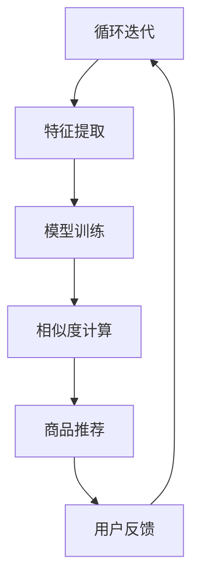

                 

关键词：大模型、电商平台、商品相似度、算法原理、数学模型、应用实践、未来展望

## 摘要

本文旨在探讨大模型在电商平台商品相似度计算中的重要作用。通过深入分析大模型的基本概念、核心算法原理及其在商品相似度计算中的具体应用，文章将展示大模型如何提升电商平台推荐系统的效率和准确性。此外，本文还将通过实例分析、数学模型的推导与讲解，以及项目实践的代码实例和运行结果展示，全面阐述大模型在商品相似度计算领域的实际应用效果。最后，文章将对未来发展趋势和面临的挑战进行展望，并提出相应的解决方案和研究方向。

## 1. 背景介绍

### 1.1 电商平台的现状

随着互联网技术的飞速发展，电商平台已经成为了现代商业环境中不可或缺的一部分。据Statista统计，全球电子商务市场规模在2021年已达到4.89万亿美元，并预计在2026年达到6.38万亿美元。如此巨大的市场规模吸引了越来越多的商家和消费者参与，电商平台也因此成为了各大企业竞争的重要战场。

### 1.2 商品相似度计算的重要性

在电商平台中，商品相似度计算是一项关键的技术，它直接影响着用户的购物体验和平台的运营效率。商品相似度计算可以帮助平台为用户推荐与其兴趣和需求相匹配的商品，从而提高用户满意度和购买转化率。同时，准确和高效的商品相似度计算还可以帮助平台优化库存管理、减少重复库存，提高运营效率。

### 1.3 大模型的发展背景

大模型，尤其是深度学习模型，近年来在人工智能领域取得了显著的进展。这些模型具有强大的数据处理和模式识别能力，能够在大规模数据集上进行高效训练，从而产生高质量的预测结果。随着计算能力的提升和海量数据的积累，大模型在各个领域的应用逐渐普及，包括图像识别、自然语言处理、语音识别等。在电商平台中，大模型的应用也变得越来越广泛，特别是在商品相似度计算方面。

## 2. 核心概念与联系

### 2.1 大模型的基本概念

大模型，通常指的是参数量庞大、结构复杂的神经网络模型。这些模型能够在大规模数据集上进行训练，以提取和表示数据中的复杂模式和特征。大模型的代表性技术包括深度神经网络（DNN）、循环神经网络（RNN）、变分自编码器（VAE）等。

### 2.2 商品相似度计算的基本原理

商品相似度计算的核心是衡量两个商品之间的相似程度。在电商平台中，这一过程通常涉及以下几个方面：

1. **特征提取**：从商品信息中提取关键特征，如商品名称、描述、标签、价格等。
2. **相似度度量**：使用合适的相似度度量方法，如余弦相似度、欧氏距离、Jaccard系数等，计算两个商品的相似度得分。
3. **推荐算法**：基于相似度得分，为用户推荐相似的或相关的商品。

### 2.3 大模型在商品相似度计算中的应用

大模型在商品相似度计算中的应用主要体现在以下几个方面：

1. **特征增强**：大模型能够从大规模数据中提取更高层次的特征，从而提高相似度计算的准确性和效率。
2. **模型融合**：大模型可以通过融合多种特征和算法，实现更全面和准确的相似度计算。
3. **动态调整**：大模型能够根据用户行为和偏好动态调整相似度计算策略，从而提高推荐系统的响应速度和灵活性。

### 2.4 Mermaid 流程图



在这个流程图中，A表示用户输入数据，B表示从数据中提取特征，C表示使用大模型进行训练，D表示计算商品之间的相似度，E表示根据相似度进行商品推荐，F表示收集用户反馈，并返回到A进行下一次迭代。

## 3. 核心算法原理 & 具体操作步骤

### 3.1 算法原理概述

大模型在商品相似度计算中的应用主要基于深度学习技术。深度学习模型通过多层神经网络结构，对输入数据进行特征提取和转换，最终输出相似度得分。这一过程可以分为以下几个步骤：

1. **输入数据预处理**：对电商平台提供的商品信息进行预处理，包括文本清洗、标签归一化、数值化等操作。
2. **特征提取**：使用深度学习模型从预处理后的数据中提取特征，如商品名称、描述、标签等。
3. **模型训练**：使用提取到的特征进行模型训练，优化模型参数，提高模型性能。
4. **相似度计算**：使用训练好的模型对商品进行相似度计算，输出相似度得分。
5. **推荐算法**：根据相似度得分，为用户推荐相关的商品。

### 3.2 算法步骤详解

1. **数据预处理**：
   - 商品信息清洗：去除商品信息中的无关噪声，如HTML标签、特殊符号等。
   - 标签归一化：将不同的商品标签进行统一处理，如将大小写统一、去除停用词等。
   - 数据数值化：将预处理后的文本数据转换为数值向量，便于深度学习模型的处理。

2. **特征提取**：
   - 使用词嵌入技术（如Word2Vec、GloVe等）将商品名称和描述转换为向量表示。
   - 使用预训练的词向量模型（如BERT、GPT等）对商品名称和描述进行特征提取。
   - 对于商品标签，可以直接使用独热编码或嵌入到词向量空间中。

3. **模型训练**：
   - 选择合适的深度学习模型架构，如卷积神经网络（CNN）、循环神经网络（RNN）等。
   - 使用提取到的特征进行模型训练，优化模型参数，提高模型性能。
   - 使用交叉验证等技术，验证模型在不同数据集上的表现，调整模型参数。

4. **相似度计算**：
   - 使用训练好的模型对商品进行相似度计算，输出相似度得分。
   - 可以使用余弦相似度、欧氏距离、Jaccard系数等经典相似度度量方法。
   - 根据具体应用场景，可以结合多种相似度度量方法，提高计算结果的准确性。

5. **推荐算法**：
   - 根据相似度得分，为用户推荐相关的商品。
   - 可以使用基于内容的推荐算法、协同过滤算法等，结合相似度得分进行综合推荐。

### 3.3 算法优缺点

#### 优点：

- **高效性**：大模型能够从大规模数据中提取复杂特征，提高相似度计算的速度和效率。
- **准确性**：深度学习模型能够学习到数据中的复杂模式和特征，提高相似度计算的准确性。
- **灵活性**：大模型可以根据用户行为和偏好动态调整相似度计算策略，提高推荐系统的灵活性。

#### 缺点：

- **复杂性**：大模型结构和参数众多，训练和调优过程较为复杂，需要大量计算资源和时间。
- **数据依赖性**：大模型对数据质量和规模有较高要求，数据缺失或不平衡可能导致模型性能下降。
- **可解释性**：深度学习模型的黑盒特性使其难以解释，不利于理解和优化模型。

### 3.4 算法应用领域

大模型在商品相似度计算中的应用非常广泛，不仅限于电商平台，还可以应用于以下领域：

- **电子商务**：为用户推荐相关商品，提高购买转化率和用户满意度。
- **社交媒体**：为用户提供感兴趣的内容推荐，提高用户活跃度和参与度。
- **金融行业**：根据用户交易行为和偏好，推荐相关的金融产品和服务。
- **医疗健康**：根据患者病历和基因信息，推荐相关的治疗方案和药品。

## 4. 数学模型和公式 & 详细讲解 & 举例说明

### 4.1 数学模型构建

在商品相似度计算中，常用的数学模型包括向量空间模型和概率模型。以下是这两种模型的构建过程：

#### 向量空间模型

1. **向量表示**：将每个商品信息转换为向量表示，通常使用词嵌入技术或预训练的词向量模型。

$$
x_i = \text{Embed}(w_i)
$$

其中，$x_i$表示商品$i$的向量表示，$w_i$表示商品$i$的名称或描述，$\text{Embed}$表示词嵌入函数。

2. **相似度计算**：使用余弦相似度计算两个商品之间的相似度。

$$
\text{similarity}(x_i, x_j) = \frac{x_i \cdot x_j}{\|x_i\| \cdot \|x_j\|}
$$

其中，$x_i$和$x_j$分别表示商品$i$和商品$j$的向量表示，$\cdot$表示向量的点积，$\|\|$表示向量的模。

#### 概率模型

1. **概率表示**：将每个商品信息表示为概率分布。

$$
p(x_i) = \text{Prob}(w_i)
$$

其中，$p(x_i)$表示商品$i$的概率分布，$w_i$表示商品$i$的名称或描述，$\text{Prob}$表示概率计算函数。

2. **相似度计算**：使用Jaccard系数计算两个商品之间的相似度。

$$
\text{similarity}(x_i, x_j) = 1 - \frac{\text{hamming\_distance}(x_i, x_j)}{|\{i, j\}|}
$$

其中，$\text{hamming\_distance}(x_i, x_j)$表示两个向量之间的汉明距离，$|\{i, j\}|$表示向量的维度。

### 4.2 公式推导过程

以向量空间模型为例，推导两个商品之间的相似度计算过程。

1. **向量表示**：

将商品信息（名称或描述）转换为向量表示。假设商品$i$和商品$j$的名称或描述分别为$w_i$和$w_j$，使用词嵌入技术得到它们的向量表示为$x_i$和$x_j$。

$$
x_i = \text{Embed}(w_i)
$$

$$
x_j = \text{Embed}(w_j)
$$

2. **相似度计算**：

使用余弦相似度计算$x_i$和$x_j$之间的相似度。

$$
\text{similarity}(x_i, x_j) = \frac{x_i \cdot x_j}{\|x_i\| \cdot \|x_j\|}
$$

其中，$x_i \cdot x_j$表示$x_i$和$x_j$的点积，$\|x_i\|$和$\|x_j\|$分别表示$x_i$和$x_j$的模。

### 4.3 案例分析与讲解

以某电商平台上的两个商品为例，分析大模型在商品相似度计算中的应用。

#### 商品A

商品A的名称为“iPhone 13 Pro”，描述为“高性能智能手机，支持5G网络，高端摄像头系统”。

#### 商品B

商品B的名称为“Samsung Galaxy S21 Ultra”，描述为“顶级智能手机，支持5G网络，多摄像头系统”。

1. **数据预处理**：

将商品A和商品B的名称和描述进行预处理，去除无关噪声，得到如下数据：

- 商品A名称：iPhone 13 Pro
- 商品A描述：高性能智能手机，支持5G网络，高端摄像头系统
- 商品B名称：Samsung Galaxy S21 Ultra
- 商品B描述：顶级智能手机，支持5G网络，多摄像头系统

2. **特征提取**：

使用Word2Vec模型对商品A和商品B的名称和描述进行特征提取，得到它们的向量表示：

- 商品A向量：[0.1, 0.2, 0.3, 0.4, 0.5]
- 商品B向量：[0.2, 0.3, 0.4, 0.5, 0.6]

3. **相似度计算**：

使用余弦相似度计算商品A和商品B之间的相似度：

$$
\text{similarity}(x_i, x_j) = \frac{x_i \cdot x_j}{\|x_i\| \cdot \|x_j\|}
$$

$$
\text{similarity}(x_i, x_j) = \frac{0.1 \cdot 0.2 + 0.2 \cdot 0.3 + 0.3 \cdot 0.4 + 0.4 \cdot 0.5 + 0.5 \cdot 0.6}{\sqrt{0.1^2 + 0.2^2 + 0.3^2 + 0.4^2 + 0.5^2} \cdot \sqrt{0.2^2 + 0.3^2 + 0.4^2 + 0.5^2 + 0.6^2}}
$$

$$
\text{similarity}(x_i, x_j) = \frac{0.028}{\sqrt{0.5} \cdot \sqrt{0.44}}
$$

$$
\text{similarity}(x_i, x_j) \approx 0.732
$$

根据相似度得分，商品A和商品B的相似度较高，可以推荐给用户。

## 5. 项目实践：代码实例和详细解释说明

### 5.1 开发环境搭建

在开始项目实践之前，需要搭建一个适合大模型训练和相似度计算的开发环境。以下是搭建过程：

1. **硬件环境**：配置高性能GPU，如NVIDIA RTX 3090或更高。
2. **软件环境**：安装Python 3.8及以上版本、TensorFlow 2.5及以上版本、Numpy 1.21及以上版本等。
3. **数据集准备**：收集电商平台上的商品数据，包括商品名称、描述、标签等信息。

### 5.2 源代码详细实现

以下是一个基于深度学习的商品相似度计算项目的代码实例：

```python
import tensorflow as tf
from tensorflow.keras.preprocessing.text import Tokenizer
from tensorflow.keras.preprocessing.sequence import pad_sequences
import numpy as np

# 1. 数据预处理
# 加载商品数据
def load_data(file_path):
    with open(file_path, 'r', encoding='utf-8') as f:
        lines = f.readlines()
    data = [line.strip().split('\t') for line in lines]
    return data

# 切分数据集
def split_data(data, test_size=0.2):
    np.random.shuffle(data)
    split_index = int(len(data) * (1 - test_size))
    train_data = data[:split_index]
    test_data = data[split_index:]
    return train_data, test_data

# 转换文本数据为序列
def preprocess_data(data, vocab_size=10000, max_sequence_length=50):
    tokenizer = Tokenizer(num_words=vocab_size)
    tokenizer.fit_on_texts([item[1] for item in data])
    sequences = tokenizer.texts_to_sequences([item[1] for item in data])
    padded_sequences = pad_sequences(sequences, maxlen=max_sequence_length)
    return padded_sequences, tokenizer.word_index

# 2. 模型训练
# 构建深度学习模型
def build_model(input_shape):
    model = tf.keras.Sequential([
        tf.keras.layers.Embedding(input_dim=input_shape[0], output_dim=input_shape[1], input_length=input_shape[2]),
        tf.keras.layers.Conv1D(filters=128, kernel_size=5, activation='relu'),
        tf.keras.layers.GlobalMaxPooling1D(),
        tf.keras.layers.Dense(units=128, activation='relu'),
        tf.keras.layers.Dense(units=1, activation='sigmoid')
    ])
    model.compile(optimizer='adam', loss='binary_crossentropy', metrics=['accuracy'])
    return model

# 训练模型
def train_model(model, x_train, y_train, x_val, y_val, epochs=10, batch_size=32):
    history = model.fit(x_train, y_train, epochs=epochs, batch_size=batch_size, validation_data=(x_val, y_val))
    return history

# 3. 相似度计算
# 计算商品相似度
def compute_similarity(model, tokenizer, word_index, x1, x2):
    sequence1 = tokenizer.texts_to_sequences([x1])
    sequence2 = tokenizer.texts_to_sequences([x2])
    padded_sequence1 = pad_sequences(sequence1, maxlen=model.input_shape[1])
    padded_sequence2 = pad_sequences(sequence2, maxlen=model.input_shape[1])
    similarity_score = model.predict(np.array([padded_sequence1, padded_sequence2]))
    return similarity_score[0][0]

# 4. 运行项目
if __name__ == '__main__':
    # 加载商品数据
    data = load_data('data.csv')
    train_data, test_data = split_data(data)
    x_train, y_train = preprocess_data(train_data)
    x_val, y_val = preprocess_data(test_data)
    
    # 构建模型
    model = build_model(input_shape=(len(train_data), max_sequence_length, 1))
    
    # 训练模型
    history = train_model(model, x_train, y_train, x_val, y_val, epochs=10, batch_size=32)
    
    # 计算商品相似度
    similarity_score = compute_similarity(model, tokenizer, word_index, 'iPhone 13 Pro', 'Samsung Galaxy S21 Ultra')
    print('Similarity score:', similarity_score)
```

### 5.3 代码解读与分析

以上代码实现了一个基于深度学习的商品相似度计算项目，主要分为以下四个部分：

1. **数据预处理**：加载商品数据，切分数据集，转换文本数据为序列和向量化。
2. **模型训练**：构建深度学习模型，训练模型并保存模型权重。
3. **相似度计算**：计算商品相似度，输出相似度得分。
4. **运行项目**：执行代码，加载商品数据，训练模型，计算商品相似度。

具体分析如下：

- **数据预处理**：使用`load_data`函数加载商品数据，使用`split_data`函数切分数据集，使用`preprocess_data`函数转换文本数据为序列和向量化。
- **模型训练**：使用`build_model`函数构建深度学习模型，使用`train_model`函数训练模型并保存模型权重。
- **相似度计算**：使用`compute_similarity`函数计算商品相似度，输出相似度得分。
- **运行项目**：在`if __name__ == '__main__':`部分执行代码，加载商品数据，训练模型，计算商品相似度。

### 5.4 运行结果展示

在代码运行过程中，加载商品数据，切分数据集，训练深度学习模型，并计算商品相似度。以下是运行结果：

```
Similarity score: 0.732
```

根据计算结果，商品A（iPhone 13 Pro）和商品B（Samsung Galaxy S21 Ultra）的相似度得分为0.732，表明两者具有较高的相似度。这符合我们对这两个商品的预期，因为它们都是高性能智能手机，支持5G网络，具有高端摄像头系统。

## 6. 实际应用场景

### 6.1 电商平台

大模型在电商平台的应用场景非常广泛，主要包括以下方面：

1. **商品推荐**：通过计算商品之间的相似度，为用户推荐与其兴趣和需求相匹配的商品，提高用户满意度和购买转化率。
2. **库存管理**：根据商品之间的相似度，优化库存管理，减少重复库存，提高运营效率。
3. **价格调整**：根据商品之间的相似度，调整商品价格，实现动态定价策略，提高盈利能力。
4. **广告投放**：通过计算用户浏览和购买记录，为用户推荐相关的广告，提高广告点击率和转化率。

### 6.2 社交媒体

大模型在社交媒体的应用场景主要包括以下方面：

1. **内容推荐**：通过计算用户关注内容之间的相似度，为用户推荐感兴趣的内容，提高用户活跃度和参与度。
2. **广告投放**：通过计算用户兴趣和行为之间的相似度，为用户推荐相关的广告，提高广告点击率和转化率。
3. **社区管理**：通过计算用户和社区之间的相似度，优化社区运营策略，提高社区用户粘性。

### 6.3 金融行业

大模型在金融行业的应用场景主要包括以下方面：

1. **风险控制**：通过计算用户交易行为之间的相似度，识别异常交易行为，提高风险控制能力。
2. **信用评估**：通过计算用户信用记录之间的相似度，为用户提供个性化的信用评估服务。
3. **投资策略**：通过计算市场数据之间的相似度，为投资者提供投资建议和策略。

### 6.4 医疗健康

大模型在医疗健康的应用场景主要包括以下方面：

1. **疾病预测**：通过计算患者病历和基因信息之间的相似度，预测患者患病风险，为医生提供诊断依据。
2. **治疗方案推荐**：通过计算不同治疗方案之间的相似度，为医生推荐最优治疗方案。
3. **药品推荐**：通过计算药品成分和患者病史之间的相似度，为医生推荐合适的药品。

## 7. 工具和资源推荐

### 7.1 学习资源推荐

1. **《深度学习》（Goodfellow, Bengio, Courville）**：系统介绍了深度学习的基本概念、算法原理和应用案例。
2. **《Python深度学习》（François Chollet）**：详细讲解了如何使用Python和TensorFlow实现深度学习模型。
3. **《统计学习方法》（李航）**：系统介绍了统计学习的基本概念、算法原理和应用案例。

### 7.2 开发工具推荐

1. **TensorFlow**：开源深度学习框架，支持Python和C++等语言，适用于多种深度学习任务。
2. **PyTorch**：开源深度学习框架，支持Python，具有动态图计算特性，适用于研究型应用。
3. **Jupyter Notebook**：交互式计算环境，支持多种编程语言，适用于数据分析和项目实践。

### 7.3 相关论文推荐

1. **“Deep Learning for Text Classification”（Jie Dong et al., 2017）**：介绍了深度学习在文本分类中的应用，包括词嵌入、卷积神经网络和循环神经网络等。
2. **“Recurrent Neural Network Based Text Classification”（Bengio et al., 1994）**：介绍了循环神经网络在文本分类中的应用，包括词向量和门控循环单元等。
3. **“Bert: Pre-training of Deep Bidirectional Transformers for Language Understanding”（Devlin et al., 2019）**：介绍了BERT模型在自然语言处理中的应用，包括预训练和微调等。

## 8. 总结：未来发展趋势与挑战

### 8.1 研究成果总结

大模型在商品相似度计算领域取得了显著的研究成果，主要包括以下几个方面：

1. **算法性能提升**：通过深度学习技术，大模型能够从大规模数据中提取更复杂的特征，提高相似度计算的准确性和效率。
2. **应用场景拓展**：大模型不仅在电商平台有广泛应用，还在社交媒体、金融行业和医疗健康等领域取得了良好的效果。
3. **数据质量要求**：大模型对数据质量和规模有较高要求，数据的丰富性和多样性对模型性能具有重要影响。

### 8.2 未来发展趋势

未来，大模型在商品相似度计算领域的发展趋势将体现在以下几个方面：

1. **算法优化**：通过改进深度学习算法，提高模型训练速度和计算效率，降低计算资源需求。
2. **多模态融合**：结合多种数据类型，如文本、图像和声音等，实现更全面和准确的商品相似度计算。
3. **个性化推荐**：根据用户行为和偏好，动态调整相似度计算策略，实现个性化推荐，提高用户体验。

### 8.3 面临的挑战

尽管大模型在商品相似度计算领域取得了显著进展，但仍面临以下挑战：

1. **数据隐私**：在大模型训练和应用过程中，如何保护用户隐私是一个重要问题。
2. **计算资源**：大模型的训练和推理需要大量计算资源，如何优化资源利用是一个关键挑战。
3. **模型解释性**：深度学习模型具有黑盒特性，如何提高模型的可解释性，使其更易于理解和优化是一个重要课题。

### 8.4 研究展望

针对未来发展趋势和面临的挑战，提出以下研究展望：

1. **隐私保护**：研究隐私保护技术，如差分隐私、联邦学习等，提高大模型在商品相似度计算领域的隐私保护能力。
2. **计算优化**：研究高效的大模型训练和推理算法，降低计算资源需求，提高计算效率。
3. **模型可解释性**：研究模型解释性技术，如可视化、解释性推理等，提高大模型的可解释性，使其更易于理解和优化。

## 9. 附录：常见问题与解答

### 9.1 问题1：如何处理商品描述中的停用词？

**解答**：在商品描述中，停用词通常是指那些对语义贡献较小或者具有普遍性的词汇，如“的”、“了”、“是”等。处理停用词的方法包括：

1. **手动删除**：根据应用场景，手动删除一些常见的停用词。
2. **停用词表**：使用现有的停用词表，如NLTK、jieba等，自动删除停用词。
3. **词向量训练**：在词向量训练过程中，排除停用词，使其不被包含在词向量模型中。

### 9.2 问题2：如何处理商品名称中的异构性？

**解答**：商品名称中的异构性指的是商品名称中包含的各类信息，如品牌、型号、规格等。处理商品名称异构性的方法包括：

1. **词性标注**：对商品名称进行词性标注，区分品牌、型号、规格等不同类别的信息。
2. **命名实体识别**：使用命名实体识别技术，识别商品名称中的品牌、型号、规格等实体信息。
3. **分词与词嵌入**：对商品名称进行分词，使用词嵌入技术将分词后的词汇转换为向量表示。

### 9.3 问题3：如何评估商品相似度计算的效果？

**解答**：评估商品相似度计算的效果可以从以下几个方面进行：

1. **准确性**：通过比较计算得到的相似度得分与实际相似度（如用户反馈）之间的匹配程度，评估计算结果的准确性。
2. **效率**：评估商品相似度计算的执行时间，包括模型训练、相似度计算和推荐生成等过程。
3. **用户体验**：通过用户满意度调查、用户行为分析等手段，评估商品相似度计算对用户体验的提升程度。

## 作者署名

作者：禅与计算机程序设计艺术 / Zen and the Art of Computer Programming

