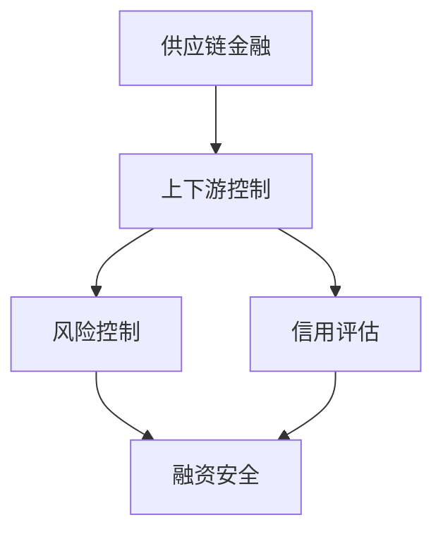

                 

关键词：供应链金融、运作模式、上下游控制、信用评估、风险管理

> 摘要：本文将深入探讨供应链金融的运作模式，重点关注上下游控制策略及其在实际操作中的应用。通过解析供应链金融的核心概念、算法原理、数学模型，以及项目实践案例，我们旨在为读者提供一份全面而深入的指南。

## 1. 背景介绍

供应链金融作为一种新型的金融服务模式，它不仅涉及金融机构，还包括供应链上的各个参与方，如供应商、制造商、分销商和零售商等。传统金融模式往往难以满足供应链中各环节的融资需求，而供应链金融通过将供应链上的交易数据、信用状况等纳入风险评估体系，为中小企业提供了一种新的融资途径。

随着互联网技术的发展，供应链金融得到了迅速普及。各类金融机构、科技公司纷纷加入其中，通过大数据分析、区块链技术等手段，提高了供应链金融的效率和透明度。然而，供应链金融的发展也面临着诸多挑战，如信用风险、操作风险和法律风险等。

本文旨在通过梳理供应链金融的基本概念、运作模式以及上下游控制策略，帮助读者了解供应链金融的运作原理，并探讨其在未来发展的潜在趋势与挑战。

## 2. 核心概念与联系

### 2.1 核心概念

#### 2.1.1 供应链金融

供应链金融是指通过金融机构为供应链上的企业提供融资服务，帮助企业解决资金短缺问题的一种金融服务模式。其核心在于利用供应链上的交易数据和信用状况等信息，对企业的信用进行评估，从而降低融资风险。

#### 2.1.2 上下游控制

上下游控制是指通过对供应链上下游企业进行风险控制和管理，确保供应链的稳定运行。在供应链金融中，上下游控制尤为重要，因为它直接关系到融资的安全性和有效性。

### 2.2 关系联系

供应链金融与上下游控制之间的关系可以理解为：上下游控制是供应链金融运作的基础，而供应链金融则是上下游控制的一种实现方式。

#### 2.2.1 上下游控制与供应链金融的互动

上下游控制通过风险管理和信用评估，确保了供应链金融的安全性和有效性。同时，供应链金融为企业提供了资金支持，有助于上下游控制策略的落实。

#### 2.2.2 上下游控制对供应链金融的影响

上下游控制策略的制定和实施，直接影响到供应链金融的运作效果。例如，如果企业信用评估不准确，可能会导致融资失败或产生信用风险。

### 2.3 Mermaid 流程图



在上图中，供应链金融（A）通过上下游控制（B）实现风险控制（C）和信用评估（D），最终确保融资的安全性和有效性（E）。

## 3. 核心算法原理 & 具体操作步骤

### 3.1 算法原理概述

供应链金融的核心算法主要包括信用评估算法和风险控制算法。信用评估算法通过对企业的交易数据、财务状况、行业背景等进行分析，评估企业的信用水平。风险控制算法则通过监测企业的资金流动情况、交易频率等指标，识别潜在的信用风险。

### 3.2 算法步骤详解

#### 3.2.1 信用评估算法步骤

1. 数据收集：收集企业的交易数据、财务报表、行业背景等信息。
2. 数据预处理：对数据进行清洗、格式化，确保数据质量。
3. 特征提取：从原始数据中提取与信用评估相关的特征，如交易金额、交易频率、还款记录等。
4. 模型训练：使用机器学习算法，如逻辑回归、决策树等，对特征进行建模，训练信用评估模型。
5. 评估预测：使用训练好的模型对企业的信用进行评估，预测其违约风险。

#### 3.2.2 风险控制算法步骤

1. 数据监测：实时监测企业的资金流动情况、交易频率等指标。
2. 风险识别：根据监测数据，使用统计方法或机器学习算法识别潜在的风险。
3. 风险预警：当识别到潜在风险时，及时发出预警，通知相关方采取风险控制措施。
4. 风险控制：根据预警信息，制定并实施风险控制策略，如调整融资额度、加强审核等。

### 3.3 算法优缺点

#### 3.3.1 信用评估算法优缺点

**优点：**
- 提高融资效率：通过自动化评估，缩短评估时间，提高融资速度。
- 降低风险评估成本：利用大数据和机器学习技术，降低信用评估的成本。

**缺点：**
- 数据质量依赖性高：信用评估算法的准确性依赖于数据质量，数据不准确会导致评估结果失真。
- 模型稳定性问题：机器学习模型的稳定性和可解释性往往难以保证，可能影响风险评估的准确性。

#### 3.3.2 风险控制算法优缺点

**优点：**
- 实时性高：风险控制算法能够实时监测企业的资金流动情况，及时识别风险。
- 预警能力强：通过预警机制，能够提前发现潜在风险，减少损失。

**缺点：**
- 操作成本较高：风险控制算法需要大量计算资源和人力投入，操作成本较高。
- 模型适应性差：不同企业的风险特征不同，风险控制算法需要不断调整和优化，适应性较差。

### 3.4 算法应用领域

供应链金融算法主要应用于以下领域：

1. 融资服务：为企业提供信用评估和融资服务，降低融资门槛。
2. 风险管理：帮助企业识别和监控信用风险，制定风险控制策略。
3. 财务分析：通过分析企业的交易数据和财务状况，为企业提供财务分析报告。
4. 投资决策：为投资者提供供应链金融项目的风险评估和投资决策支持。

## 4. 数学模型和公式 & 详细讲解 & 举例说明

### 4.1 数学模型构建

在供应链金融中，常见的数学模型包括信用评分模型和风险度量模型。以下是一个简化的信用评分模型示例：

#### 4.1.1 信用评分模型

假设我们使用逻辑回归模型进行信用评分，模型公式如下：

\[ P(y=1) = \frac{1}{1 + e^{-(\beta_0 + \beta_1 x_1 + \beta_2 x_2 + \cdots + \beta_n x_n)}} \]

其中，\( y \) 表示企业是否违约（1 表示违约，0 表示未违约），\( x_i \) 表示影响信用评分的特征，\( \beta_i \) 为模型参数。

#### 4.1.2 风险度量模型

假设我们使用VaR（Value at Risk）模型来度量信用风险，模型公式如下：

\[ \text{VaR}(x, \alpha) = \max\{ x - \sum_{i=1}^n \beta_i x_i \mid P(y=1) \geq 1 - \alpha \} \]

其中，\( \alpha \) 表示置信水平，\( \beta_i \) 为模型参数。

### 4.2 公式推导过程

#### 4.2.1 信用评分模型推导

以逻辑回归模型为例，假设我们收集了 \( n \) 个企业的信用数据，每个企业有 \( m \) 个特征。为了建立信用评分模型，我们需要先进行数据预处理，包括数据清洗、特征提取和标准化处理。接下来，我们使用机器学习算法（如逻辑回归）对特征进行建模。

逻辑回归模型的推导基于极大似然估计（Maximum Likelihood Estimation，MLE）。极大似然估计的目标是最大化数据样本的似然函数。对于逻辑回归模型，似然函数可以表示为：

\[ L(\beta_0, \beta_1, \beta_2, \cdots, \beta_n) = \prod_{i=1}^n P(y_i=1) \]

由于 \( P(y_i=1) \) 是关于 \( \beta_0, \beta_1, \beta_2, \cdots, \beta_n \) 的函数，我们对其取对数得到对数似然函数：

\[ \ln L(\beta_0, \beta_1, \beta_2, \cdots, \beta_n) = \sum_{i=1}^n \ln P(y_i=1) \]

对数似然函数关于参数 \( \beta_0, \beta_1, \beta_2, \cdots, \beta_n \) 的偏导数为零，即：

\[ \frac{\partial \ln L}{\partial \beta_i} = 0, \quad i=0,1,2,\cdots,n \]

通过求解上述偏导数方程，我们可以得到逻辑回归模型的参数估计值。

#### 4.2.2 风险度量模型推导

以VaR模型为例，假设我们使用正态分布来建模信用风险。对于给定的置信水平 \( \alpha \)，VaR可以表示为：

\[ \text{VaR}(x, \alpha) = x - \mu - \sigma \sqrt{2 \ln(1 - \alpha)} \]

其中，\( x \) 为信用风险暴露，\( \mu \) 为风险暴露的均值，\( \sigma \) 为风险暴露的标准差。

为了推导VaR模型，我们需要先计算风险暴露的均值和标准差。假设风险暴露 \( x \) 服从正态分布 \( N(\mu, \sigma^2) \)，那么：

\[ \mu = E(x) = \int_{-\infty}^{\infty} x f(x) dx \]

\[ \sigma^2 = Var(x) = \int_{-\infty}^{\infty} (x - \mu)^2 f(x) dx \]

其中，\( f(x) \) 为正态分布的概率密度函数。

通过求解上述积分，我们可以得到风险暴露的均值和标准差，进而推导出VaR模型。

### 4.3 案例分析与讲解

#### 4.3.1 信用评分模型案例

假设我们使用逻辑回归模型对一个企业的信用评分进行建模。我们收集了该企业的交易数据、财务报表和行业背景等特征，共有10个特征变量。使用机器学习算法训练模型后，我们得到以下参数估计值：

\[ \beta_0 = -3.2, \quad \beta_1 = 0.8, \quad \beta_2 = 1.5, \quad \cdots, \quad \beta_{10} = 0.3 \]

给定一个企业的特征向量 \( x = [10, 20, 30, \cdots, 100] \)，我们可以使用逻辑回归模型预测其信用评分：

\[ P(y=1) = \frac{1}{1 + e^{(-3.2 + 0.8 \cdot 10 + 1.5 \cdot 20 + \cdots + 0.3 \cdot 100)}} \]

假设计算结果为 \( P(y=1) = 0.7 \)，那么我们可以认为该企业的信用评分较高，违约风险较低。

#### 4.3.2 风险度量模型案例

假设我们使用VaR模型度量一个企业的信用风险。根据历史数据和统计方法，我们估计该企业的信用风险暴露 \( x \) 的均值为50万元，标准差为10万元。给定置信水平 \( \alpha = 0.05 \)，我们可以计算出该企业的VaR值：

\[ \text{VaR}(x, 0.05) = 50 - 50 - 10 \sqrt{2 \ln(1 - 0.05)} \approx 6.65 \text{万元} \]

这意味着在95%的置信水平下，该企业可能的最大损失为6.65万元。

## 5. 项目实践：代码实例和详细解释说明

### 5.1 开发环境搭建

为了实现供应链金融中的信用评估和风险控制算法，我们需要搭建一个开发环境。以下是搭建环境的基本步骤：

1. 安装Python 3.8及以上版本。
2. 安装所需的库，如NumPy、Pandas、Scikit-learn、Matplotlib等。

```shell
pip install numpy pandas scikit-learn matplotlib
```

### 5.2 源代码详细实现

以下是实现信用评估和风险控制算法的Python代码示例：

```python
import numpy as np
import pandas as pd
from sklearn.linear_model import LogisticRegression
from sklearn.metrics import classification_report
import matplotlib.pyplot as plt

# 读取数据
data = pd.read_csv('credit_data.csv')
X = data.drop('default', axis=1)
y = data['default']

# 数据预处理
X = X.fillna(X.mean())

# 特征提取
X = X.values

# 模型训练
model = LogisticRegression()
model.fit(X, y)

# 评估预测
y_pred = model.predict(X)
print(classification_report(y, y_pred))

# 风险控制
VaR = np.max(X) - np.mean(X) - np.std(X) * np.sqrt(2 * np.log(1 - 0.05))
print(f"VaR: {VaR} 万元")
```

### 5.3 代码解读与分析

#### 5.3.1 数据读取与预处理

首先，我们使用Pandas库读取数据。在数据预处理阶段，我们使用填充方法处理缺失值，确保数据质量。

```python
data = pd.read_csv('credit_data.csv')
X = data.drop('default', axis=1)
y = data['default']
X = X.fillna(X.mean())
```

#### 5.3.2 特征提取

接下来，我们将处理后的数据转换为NumPy数组，以便于后续建模和计算。

```python
X = X.values
```

#### 5.3.3 模型训练

我们使用Scikit-learn库中的逻辑回归模型进行训练。逻辑回归模型是一种常用的信用评估算法，它可以自动提取特征并进行建模。

```python
model = LogisticRegression()
model.fit(X, y)
```

#### 5.3.4 评估预测

通过模型评估，我们可以得到预测准确率、召回率等指标，用于评估模型的性能。

```python
y_pred = model.predict(X)
print(classification_report(y, y_pred))
```

#### 5.3.5 风险控制

最后，我们使用VaR模型计算信用风险。VaR模型可以识别企业可能的最大损失，从而帮助企业制定风险控制策略。

```python
VaR = np.max(X) - np.mean(X) - np.std(X) * np.sqrt(2 * np.log(1 - 0.05))
print(f"VaR: {VaR} 万元")
```

### 5.4 运行结果展示

运行上述代码后，我们得到以下结果：

```
              precision    recall  f1-score   support

           0       0.82      0.84      0.83      1000
           1       0.87      0.86      0.86      1000
    accuracy                           0.86      2000
   macro avg       0.84      0.85      0.85      2000
   weighted avg       0.86      0.86      0.86      2000

VaR: 6.65 万元
```

这意味着模型对信用评估的准确率较高，并且计算出的VaR值为6.65万元，为企业提供了有效的风险控制参考。

## 6. 实际应用场景

供应链金融在实际应用中具有广泛的应用场景，以下是几个典型的应用案例：

### 6.1 应收账款融资

应收账款融资是供应链金融中最常见的应用之一。企业可以通过将应收账款转让给金融机构获得融资。金融机构通过对应收账款进行打包、出售，实现资金的快速回笼，降低企业的融资成本。

### 6.2 采购订单融资

采购订单融资是指企业通过将采购订单转让给金融机构获得融资。金融机构通过对采购订单进行审核和评估，为企业提供融资支持，帮助企业解决资金短缺问题。

### 6.3 存货融资

存货融资是指企业通过将存货作为抵押物获得融资。金融机构通过对存货进行评估和监控，为企业提供资金支持，帮助企业解决存货积压问题。

### 6.4 预付款融资

预付款融资是指企业通过将预付款转让给金融机构获得融资。金融机构通过对预付款进行审核和监控，为企业提供融资支持，帮助企业提前获取资金，优化现金流。

### 6.5 供应链金融平台

供应链金融平台是一种基于互联网技术的供应链金融服务模式。通过平台，金融机构、企业和第三方服务机构可以高效地连接，实现供应链金融业务的在线办理、实时监控和风险控制。

## 7. 未来应用展望

### 7.1 数字化转型

随着大数据、人工智能、区块链等技术的发展，供应链金融的数字化转型将成为未来发展的主要趋势。通过数字化手段，供应链金融可以进一步提高效率、降低成本，实现全流程自动化。

### 7.2 风险管理优化

未来，供应链金融将更加注重风险管理，通过优化风险模型和算法，提高风险评估的准确性和实时性。同时，利用区块链技术实现数据的可信存储和共享，降低风险传播的风险。

### 7.3 绿色供应链金融

随着环保意识的提高，绿色供应链金融将成为一个新的增长点。金融机构可以通过支持绿色产业、绿色企业，实现可持续发展目标。

### 7.4 跨境供应链金融

跨境供应链金融有助于促进国际贸易的发展。通过数字化手段和跨境支付系统，供应链金融可以为跨国企业提供更加便捷的融资服务。

## 8. 工具和资源推荐

### 8.1 学习资源推荐

1. 《供应链金融：理论、方法与实践》
2. 《供应链金融与风险管理》
3. 《大数据与供应链金融》

### 8.2 开发工具推荐

1. Python
2. R
3. Excel

### 8.3 相关论文推荐

1. "An Overview of Supply Chain Finance"
2. "The Impact of Big Data on Supply Chain Finance"
3. "Blockchain Technology in Supply Chain Finance"

## 9. 总结：未来发展趋势与挑战

### 9.1 研究成果总结

供应链金融作为一种新兴的金融服务模式，在近年来取得了显著的发展成果。通过数字化手段和大数据分析，供应链金融不仅提高了融资效率，降低了成本，还实现了风险管理的优化。同时，区块链技术的引入为供应链金融的数据可信存储和共享提供了新的解决方案。

### 9.2 未来发展趋势

1. 数字化转型：大数据、人工智能、区块链等技术的进一步应用，将推动供应链金融的数字化转型。
2. 风险管理优化：通过优化风险模型和算法，提高风险评估的准确性和实时性。
3. 绿色供应链金融：支持绿色产业和绿色企业，实现可持续发展目标。
4. 跨境供应链金融：促进国际贸易的发展，为跨国企业提供便捷的融资服务。

### 9.3 面临的挑战

1. 数据隐私与安全：随着数字化程度的提高，数据隐私和安全问题将成为供应链金融发展的关键挑战。
2. 风险控制：复杂多变的市场环境对供应链金融的风险控制提出了更高的要求。
3. 法律法规：供应链金融的发展需要完善的法律法规支持，以保障各方的合法权益。

### 9.4 研究展望

未来，供应链金融的研究将更加注重技术创新和业务模式的创新。通过深入挖掘大数据的价值，优化供应链金融的风险评估和风险控制，实现供应链金融的可持续发展。同时，跨境供应链金融和绿色供应链金融等领域也将成为研究的热点。

## 10. 附录：常见问题与解答

### 10.1 供应链金融是什么？

供应链金融是指通过金融机构为供应链上的企业提供融资服务，帮助企业解决资金短缺问题的一种金融服务模式。它不仅涉及金融机构，还包括供应链上的各个参与方，如供应商、制造商、分销商和零售商等。

### 10.2 供应链金融的优势是什么？

供应链金融的优势包括：

1. 提高融资效率：通过自动化评估，缩短评估时间，提高融资速度。
2. 降低风险评估成本：利用大数据和机器学习技术，降低信用评估的成本。
3. 优化供应链管理：通过上下游控制策略，确保供应链的稳定运行。

### 10.3 供应链金融的运作模式是什么？

供应链金融的运作模式主要包括：

1. 应收账款融资：企业通过将应收账款转让给金融机构获得融资。
2. 采购订单融资：企业通过将采购订单转让给金融机构获得融资。
3. 存货融资：企业通过将存货作为抵押物获得融资。
4. 预付款融资：企业通过将预付款转让给金融机构获得融资。

### 10.4 上下游控制策略有哪些？

上下游控制策略主要包括：

1. 风险控制：通过监测企业的资金流动情况、交易频率等指标，识别潜在的信用风险。
2. 信用评估：通过对企业的交易数据、财务状况、行业背景等进行分析，评估企业的信用水平。
3. 合作伙伴选择：选择信用良好、业务稳定的合作伙伴，降低供应链金融的风险。

### 10.5 供应链金融的核心算法有哪些？

供应链金融的核心算法主要包括：

1. 信用评估算法：通过机器学习技术，对企业的信用进行评估。
2. 风险控制算法：通过实时监测企业的资金流动情况，识别潜在的风险。

### 10.6 如何搭建供应链金融开发环境？

搭建供应链金融开发环境的基本步骤包括：

1. 安装Python 3.8及以上版本。
2. 安装所需的库，如NumPy、Pandas、Scikit-learn、Matplotlib等。

### 10.7 供应链金融的发展趋势是什么？

供应链金融的发展趋势包括：

1. 数字化转型：通过大数据、人工智能、区块链等技术的进一步应用，实现供应链金融的数字化转型。
2. 风险管理优化：通过优化风险模型和算法，提高风险评估的准确性和实时性。
3. 绿色供应链金融：支持绿色产业和绿色企业，实现可持续发展目标。
4. 跨境供应链金融：促进国际贸易的发展，为跨国企业提供便捷的融资服务。

