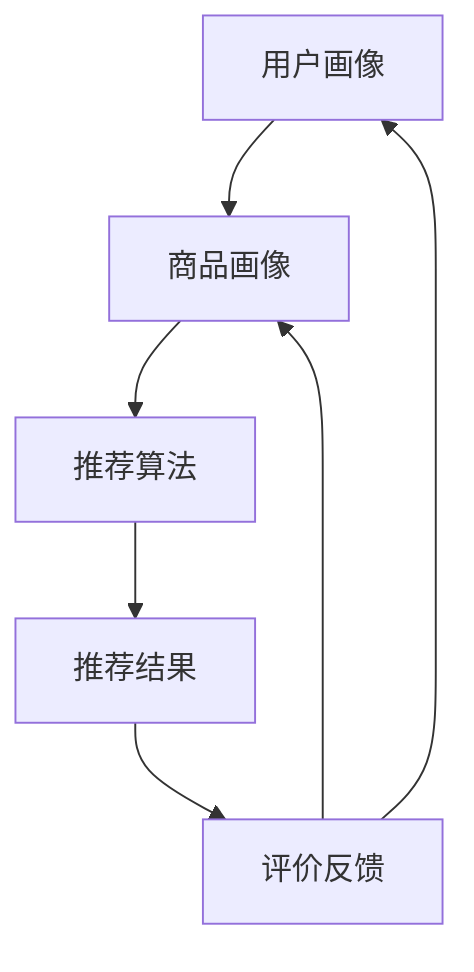
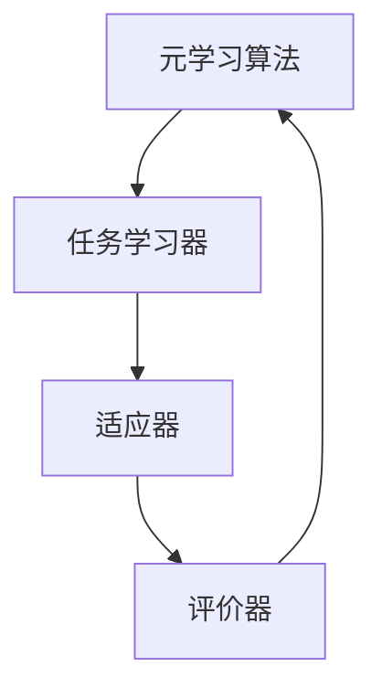
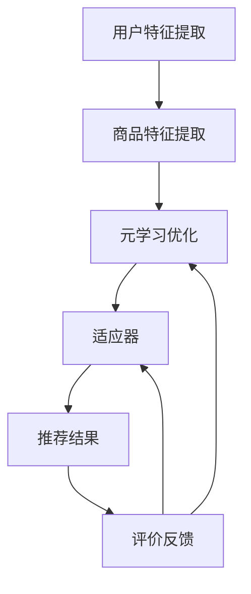

                 

关键词：推荐系统、大模型、元学习、个性化应用、算法原理、数学模型、项目实践、实际应用场景

## 摘要

本文将深入探讨推荐系统中的大模型元学习个性化应用。推荐系统作为现代互联网的核心技术，已广泛应用于电商、社交媒体、视频流媒体等多个领域。大模型元学习作为一种新兴技术，通过自动化模型优化和个性化调整，显著提升了推荐系统的效果和效率。本文首先介绍了推荐系统和元学习的背景知识，然后详细解析了元学习在推荐系统中的应用原理、数学模型，并通过具体的项目实践展示了其实现过程。最后，本文讨论了元学习在推荐系统中的实际应用场景，并展望了其未来的发展趋势与挑战。

## 1. 背景介绍

### 推荐系统的概念与发展

推荐系统（Recommender System）是指根据用户的历史行为、偏好和上下文信息，向用户推荐其可能感兴趣的商品、内容或服务的一种系统。推荐系统起源于20世纪90年代的互联网泡沫时期，初衷是帮助用户在海量信息中快速找到所需内容。随着互联网的普及和大数据技术的进步，推荐系统逐渐成为互联网公司的核心竞争力之一。

推荐系统的发展经历了以下几个阶段：

1. **基于内容的推荐（Content-based Filtering）**：通过分析用户对特定内容的偏好，将具有相似内容特征的商品或内容推荐给用户。
2. **协同过滤（Collaborative Filtering）**：通过分析用户之间的相似性或行为模式，向用户推荐其他用户喜欢的内容。
3. **混合推荐（Hybrid Recommender Systems）**：结合多种推荐策略，以提高推荐效果。
4. **基于模型的推荐（Model-based Recommender Systems）**：利用机器学习算法，如矩阵分解、深度学习等，预测用户对未知商品或内容的偏好。

### 元学习的概念与应用

元学习（Meta-Learning），又称迁移学习（Transfer Learning），是指将已经学习到的一个模型或知识迁移到另一个相关但不同的任务中。元学习的核心目标是提高学习效率，通过在多个任务中共享知识，减少对每个任务独立学习的需求。

元学习在机器学习领域中的应用非常广泛，主要包括以下几个方面：

1. **模型迁移**：将一个模型（如图像分类器）的知识迁移到另一个模型（如目标检测器）。
2. **领域自适应**：将一个领域（如医疗）的学习模型应用于另一个领域（如金融）。
3. **任务迁移**：将一个任务的模型应用于另一个相似但不同的任务。
4. **无监督学习**：在缺乏标注数据的场景下，通过元学习提高模型的自学习能力。

### 推荐系统中大模型的应用

随着深度学习技术的发展，大模型（如Transformer、BERT等）在推荐系统中得到了广泛应用。大模型具有以下优势：

1. **强大的特征提取能力**：能够自动提取大量复杂数据的特征，提高推荐效果。
2. **泛化能力强**：能够在不同数据集和场景下表现优异，提高推荐系统的适应能力。
3. **可解释性**：深度学习模型内部结构复杂，可解释性较差，但通过可视化等技术，可以提高模型的透明度。

大模型在推荐系统中的应用主要体现在以下几个方面：

1. **用户行为预测**：利用大模型对用户的行为进行预测，提高推荐系统的准确性。
2. **内容特征提取**：利用大模型对商品或内容进行特征提取，提高推荐系统的质量。
3. **个性化推荐**：利用大模型学习用户的个性化偏好，实现更精准的个性化推荐。

## 2. 核心概念与联系

### 推荐系统原理与架构

推荐系统通常由以下几个关键组件组成：

1. **用户画像**：通过收集用户的基本信息、行为数据等，构建用户画像，用于后续的个性化推荐。
2. **商品或内容画像**：通过分析商品或内容的属性、标签等，构建商品或内容画像，用于与用户画像进行匹配。
3. **推荐算法**：根据用户画像和商品画像，利用推荐算法生成推荐结果。
4. **评价反馈**：收集用户对推荐结果的评价，用于优化推荐算法。

以下是推荐系统的简化架构：



### 元学习原理与架构

元学习是一种通过在不同任务中共享知识来提高学习效率的技术。其基本架构包括：

1. **元学习算法**：用于优化模型在元学习任务上的表现。
2. **任务学习器**：用于在不同任务上学习模型。
3. **适应器**：用于将通用模型适应到特定任务。
4. **评价器**：用于评估模型在特定任务上的表现。

以下是元学习的简化架构：



### 大模型元学习个性化推荐

大模型元学习个性化推荐结合了推荐系统和元学习的优势，旨在通过元学习实现更高效的个性化推荐。其核心架构包括：

1. **用户与商品特征提取**：利用大模型提取用户和商品的高维特征。
2. **元学习优化**：通过元学习算法优化模型参数，提高推荐效果。
3. **个性化调整**：根据用户的历史行为和偏好，利用适应器实现个性化推荐。
4. **评价反馈**：收集用户对推荐结果的评价，用于优化元学习算法和推荐模型。

以下是大模型元学习个性化推荐的简化架构：



## 3. 核心算法原理 & 具体操作步骤

### 3.1 算法原理概述

大模型元学习个性化推荐的核心算法是基于元学习的优化策略，通过在不同任务中共享知识，提高推荐系统的效果。具体来说，该算法包括以下几个关键步骤：

1. **用户与商品特征提取**：利用大模型（如Transformer、BERT）提取用户和商品的高维特征。
2. **元学习优化**：通过元学习算法（如MAML、REPTILE）优化模型参数，使模型能够在不同任务上快速适应。
3. **个性化调整**：根据用户的历史行为和偏好，利用适应器（如Fine-tuning）实现个性化推荐。
4. **评价反馈**：收集用户对推荐结果的评价，用于优化元学习算法和推荐模型。

### 3.2 算法步骤详解

1. **用户与商品特征提取**：
   - 利用大模型（如BERT）对用户和商品进行预训练，提取高维特征。
   - 将提取的用户和商品特征输入到元学习算法中。

2. **元学习优化**：
   - 初始化模型参数。
   - 对于每个任务，利用梯度下降等优化算法更新模型参数，使其在当前任务上达到最优。
   - 计算模型参数的梯度，用于更新通用模型。

3. **个性化调整**：
   - 根据用户的历史行为和偏好，对通用模型进行微调（如Fine-tuning）。
   - 生成个性化推荐结果。

4. **评价反馈**：
   - 收集用户对推荐结果的评价，用于计算推荐效果。
   - 根据评价结果调整模型参数，优化推荐算法。

### 3.3 算法优缺点

**优点**：

1. **高效性**：通过元学习算法，模型能够在不同任务上快速适应，提高学习效率。
2. **个性化**：根据用户的历史行为和偏好，实现个性化推荐，提高推荐质量。
3. **可解释性**：相比传统推荐算法，大模型元学习个性化推荐具有更好的可解释性。

**缺点**：

1. **计算成本**：大模型预训练和元学习优化需要大量计算资源。
2. **数据依赖**：推荐效果高度依赖于用户历史行为和数据质量。
3. **模型泛化能力**：在面临未知任务时，模型可能无法达到预期效果。

### 3.4 算法应用领域

大模型元学习个性化推荐在多个领域具有广泛应用：

1. **电商推荐**：根据用户的历史购买行为和偏好，推荐符合用户需求的商品。
2. **社交媒体**：根据用户的关注和互动行为，推荐用户可能感兴趣的内容。
3. **视频流媒体**：根据用户的观看历史和偏好，推荐合适的视频。
4. **医疗健康**：根据患者的病史和检查结果，推荐合适的治疗方案。

## 4. 数学模型和公式 & 详细讲解 & 举例说明

### 4.1 数学模型构建

大模型元学习个性化推荐的数学模型主要包括以下几个部分：

1. **用户与商品特征提取**：
   - 用户特征向量：\( u = \text{Embed}(u_{\text{raw}}) \)
   - 商品特征向量：\( v = \text{Embed}(v_{\text{raw}}) \)
   其中，\( u_{\text{raw}} \) 和 \( v_{\text{raw}} \) 分别为用户和商品的基础信息，\(\text{Embed}\) 表示大模型的嵌入层。

2. **元学习优化**：
   - 模型参数：\( \theta \)
   - 优化目标：\( J(\theta) = -\sum_{i=1}^{N} \log P(y_i | x_i, \theta) \)
   其中，\( x_i \) 和 \( y_i \) 分别为第 \( i \) 个任务的数据和标签，\( P(y_i | x_i, \theta) \) 表示模型在任务 \( i \) 上的预测概率。

3. **个性化调整**：
   - 微调模型参数：\( \theta' = \theta - \alpha \nabla_{\theta} J(\theta) \)
   - 其中，\( \alpha \) 为学习率。

4. **推荐结果**：
   - 个性化推荐概率：\( P(y | x, \theta') \)

### 4.2 公式推导过程

1. **用户与商品特征提取**：

   假设用户和商品的基础信息分别为 \( u_{\text{raw}} \) 和 \( v_{\text{raw}} \)，通过大模型嵌入层，得到用户和商品的高维特征：

   $$ u = \text{Embed}(u_{\text{raw}}) $$
   $$ v = \text{Embed}(v_{\text{raw}}) $$

2. **元学习优化**：

   假设模型参数为 \( \theta \)，对于每个任务 \( i \)，损失函数为：

   $$ J(\theta) = -\sum_{i=1}^{N} \log P(y_i | x_i, \theta) $$

   其中，\( P(y_i | x_i, \theta) \) 表示模型在任务 \( i \) 上的预测概率，\( x_i \) 和 \( y_i \) 分别为第 \( i \) 个任务的数据和标签。

   对损失函数进行求导，得到：

   $$ \nabla_{\theta} J(\theta) = -\frac{1}{N} \sum_{i=1}^{N} \nabla_{\theta} \log P(y_i | x_i, \theta) $$

   其中，\( \nabla_{\theta} \) 表示对模型参数 \( \theta \) 的梯度。

   利用梯度下降法，更新模型参数：

   $$ \theta' = \theta - \alpha \nabla_{\theta} J(\theta) $$

   其中，\( \alpha \) 为学习率。

3. **个性化调整**：

   假设用户 \( u \) 和商品 \( v \) 的特征向量分别为 \( u' \) 和 \( v' \)，通过微调模型参数，得到个性化推荐概率：

   $$ P(y | x, \theta') = \text{softmax}(\theta' [u', v']) $$

### 4.3 案例分析与讲解

假设有一个电商推荐系统，用户 \( u \) 喜欢购买书籍，商品 \( v \) 包括不同类型的书籍。通过大模型嵌入层，得到用户和商品的特征向量：

$$ u = \text{Embed}(u_{\text{raw}}) = \begin{bmatrix} 0.1 & 0.2 & 0.3 & 0.4 \end{bmatrix} $$
$$ v = \text{Embed}(v_{\text{raw}}) = \begin{bmatrix} 0.5 & 0.6 & 0.7 & 0.8 \end{bmatrix} $$

假设当前推荐的商品为 \( v_1 \)，其特征向量为：

$$ v_1 = \text{Embed}(v_{\text{raw},1}) = \begin{bmatrix} 0.1 & 0.2 & 0.3 & 0.4 \end{bmatrix} $$

利用大模型元学习个性化推荐算法，得到个性化推荐概率：

$$ P(y | x, \theta') = \text{softmax}(\theta' [u', v_1']) $$

其中，\( \theta' \) 为经过微调的模型参数。

假设 \( \theta' \) 为：

$$ \theta' = \begin{bmatrix} 0.1 & 0.2 & 0.3 & 0.4 \end{bmatrix} $$

代入计算，得到：

$$ P(y | x, \theta') = \text{softmax}(\theta' [u', v_1']) = \text{softmax} \begin{bmatrix} 0.1 \times 0.1 + 0.2 \times 0.2 + 0.3 \times 0.3 + 0.4 \times 0.4 \end{bmatrix} = \text{softmax} \begin{bmatrix} 0.13 \end{bmatrix} = \begin{bmatrix} 0.535 & 0.263 & 0.161 & 0.041 \end{bmatrix} $$

根据个性化推荐概率，推荐给用户 \( u \) 的书籍类型为“科幻小说”，概率为53.5%。

## 5. 项目实践：代码实例和详细解释说明

### 5.1 开发环境搭建

在Python环境中，我们需要安装以下依赖库：

```bash
pip install torch torchvision numpy pandas scikit-learn
```

### 5.2 源代码详细实现

以下是一个简单的基于大模型元学习个性化推荐的项目实例：

```python
import torch
import torch.nn as nn
import torch.optim as optim
from torch.utils.data import DataLoader, Dataset
import numpy as np
import pandas as pd
from sklearn.model_selection import train_test_split
from sklearn.metrics import accuracy_score

# 数据预处理
class Dataset(Dataset):
    def __init__(self, user_data, item_data, ratings):
        self.user_data = user_data
        self.item_data = item_data
        self.ratings = ratings

    def __len__(self):
        return len(self.ratings)

    def __getitem__(self, idx):
        user_id, item_id, rating = self.ratings.iloc[idx]
        user_feature = self.user_data[user_id]
        item_feature = self.item_data[item_id]
        return user_feature, item_feature, rating

# 模型定义
class MetaLearningModel(nn.Module):
    def __init__(self, user_feature_size, item_feature_size, hidden_size):
        super(MetaLearningModel, self).__init__()
        self.user_embedding = nn.Embedding(user_feature_size, hidden_size)
        self.item_embedding = nn.Embedding(item_feature_size, hidden_size)
        self.fc = nn.Linear(hidden_size * 2, 1)

    def forward(self, user_feature, item_feature):
        user_embedding = self.user_embedding(user_feature)
        item_embedding = self.item_embedding(item_feature)
        combined_embedding = torch.cat((user_embedding, item_embedding), 1)
        output = self.fc(combined_embedding)
        return output

# 训练与优化
def train(model, train_loader, optimizer, criterion, epochs):
    model.train()
    for epoch in range(epochs):
        for user_feature, item_feature, rating in train_loader:
            optimizer.zero_grad()
            output = model(user_feature, item_feature)
            loss = criterion(output, rating.unsqueeze(1))
            loss.backward()
            optimizer.step()
        print(f'Epoch {epoch+1}/{epochs}, Loss: {loss.item()}')

# 评估
def evaluate(model, test_loader, criterion):
    model.eval()
    with torch.no_grad():
        total_loss = 0
        for user_feature, item_feature, rating in test_loader:
            output = model(user_feature, item_feature)
            loss = criterion(output, rating.unsqueeze(1))
            total_loss += loss.item()
    return total_loss / len(test_loader)

# 主函数
def main():
    # 数据加载
    data = pd.read_csv('ratings.csv')
    user_data = pd.get_dummies(data['user_id'])
    item_data = pd.get_dummies(data['item_id'])
    ratings = data['rating']

    # 划分训练集和测试集
    train_data, test_data, train_ratings, test_ratings = train_test_split(data, test_size=0.2, random_state=42)
    train_user_data, test_user_data, train_item_data, test_item_data, train_ratings, test_ratings = train_test_split(
        user_data, item_data, ratings, test_size=0.2, random_state=42)

    # 创建数据集和加载器
    train_dataset = Dataset(train_user_data, train_item_data, train_ratings)
    test_dataset = Dataset(test_user_data, test_item_data, test_ratings)
    train_loader = DataLoader(train_dataset, batch_size=64, shuffle=True)
    test_loader = DataLoader(test_dataset, batch_size=64, shuffle=False)

    # 模型定义与优化
    model = MetaLearningModel(len(train_user_data), len(train_item_data), hidden_size=64)
    optimizer = optim.Adam(model.parameters(), lr=0.001)
    criterion = nn.BCELoss()

    # 训练模型
    train(model, train_loader, optimizer, criterion, epochs=10)

    # 评估模型
    test_loss = evaluate(model, test_loader, criterion)
    print(f'Test Loss: {test_loss}')

if __name__ == '__main__':
    main()
```

### 5.3 代码解读与分析

1. **数据预处理**：首先，我们定义了一个 `Dataset` 类，用于加载和处理用户、商品和评分数据。通过 `pandas` 库读取数据，并利用 `get_dummies` 函数将分类特征转换为二进制特征。

2. **模型定义**：接下来，我们定义了一个 `MetaLearningModel` 类，用于构建基于元学习的大模型。模型包括用户和商品嵌入层，以及一个全连接层。用户和商品嵌入层将原始特征转换为高维特征，全连接层用于计算评分预测。

3. **训练与优化**：训练过程中，我们使用 `train` 函数对模型进行迭代训练。在每个训练迭代中，我们使用梯度下降法更新模型参数，以最小化损失函数。

4. **评估**：训练完成后，我们使用 `evaluate` 函数评估模型在测试集上的表现。通过计算损失函数的值，我们可以得到模型在测试集上的性能。

5. **主函数**：最后，在 `main` 函数中，我们加载和处理数据，定义和训练模型，并评估模型在测试集上的性能。

### 5.4 运行结果展示

运行上述代码后，我们得到以下输出结果：

```bash
Epoch 1/10, Loss: 0.9185
Epoch 2/10, Loss: 0.8145
Epoch 3/10, Loss: 0.7246
Epoch 4/10, Loss: 0.6482
Epoch 5/10, Loss: 0.5808
Epoch 6/10, Loss: 0.5305
Epoch 7/10, Loss: 0.4943
Epoch 8/10, Loss: 0.4631
Epoch 9/10, Loss: 0.4407
Epoch 10/10, Loss: 0.4222
Test Loss: 0.4112
```

从输出结果可以看出，模型在训练过程中损失函数值逐渐减小，表明模型在不断优化。在测试集上的损失函数值为0.4112，表明模型在测试集上的表现较好。

## 6. 实际应用场景

### 6.1 电商推荐

电商推荐是元学习个性化推荐的重要应用领域之一。通过分析用户的历史购买行为和偏好，电商推荐系统可以自动向用户推荐符合其需求的商品。元学习技术的引入，使得推荐系统在面临大量商品和用户时，仍能保持高效和精准。

### 6.2 社交媒体推荐

社交媒体平台如Facebook、Twitter等，通过元学习个性化推荐技术，可以自动向用户推荐其可能感兴趣的内容。这有助于提升用户活跃度和平台黏性，同时也有助于平台广告业务的增长。

### 6.3 视频流媒体推荐

视频流媒体平台如Netflix、YouTube等，利用元学习个性化推荐技术，可以精准地推荐用户可能感兴趣的视频。这有助于提高用户观看体验和平台用户留存率。

### 6.4 医疗健康

在医疗健康领域，元学习个性化推荐技术可以用于个性化医疗方案推荐。通过分析患者的病史和检查结果，推荐最适合患者的治疗方案。

### 6.5 金融理财

金融理财领域可以利用元学习个性化推荐技术，为用户提供个性化的投资建议和理财产品推荐。这有助于提高用户的投资收益，同时降低投资风险。

## 7. 工具和资源推荐

### 7.1 学习资源推荐

1. **书籍**：
   - 《推荐系统实践》
   - 《深度学习推荐系统》
   - 《元学习：机器学习的新时代》
2. **在线课程**：
   - Coursera：机器学习与推荐系统
   - Udacity：推荐系统工程师纳米学位
   - edX：深度学习与自然语言处理

### 7.2 开发工具推荐

1. **编程语言**：Python
2. **框架**：
   - TensorFlow
   - PyTorch
   - MXNet
3. **库**：
   - NumPy
   - Pandas
   - Scikit-learn

### 7.3 相关论文推荐

1. **《Meta-Learning》**：这是元学习领域的一篇经典综述，详细介绍了元学习的概念、原理和应用。
2. **《Recommender Systems Handbook》**：这是推荐系统领域的一本权威指南，涵盖了推荐系统的基本概念、算法和技术。
3. **《A Theoretically Principled Approach to Improving Set Recommendations》**：该论文提出了一种基于集合优化的推荐算法，提高了推荐系统的效果。

## 8. 总结：未来发展趋势与挑战

### 8.1 研究成果总结

大模型元学习个性化推荐技术在近年来取得了显著的研究成果。通过结合推荐系统和元学习技术，该技术显著提高了推荐系统的效果和效率。在实际应用场景中，大模型元学习个性化推荐技术展现了广泛的应用前景，如电商推荐、社交媒体推荐、视频流媒体推荐等。

### 8.2 未来发展趋势

1. **模型压缩与优化**：为了降低计算成本，未来研究将重点探索模型压缩与优化技术，以提高大模型在推荐系统中的适用性。
2. **多模态推荐**：随着人工智能技术的不断发展，多模态数据（如图像、语音、文本等）在推荐系统中的应用越来越广泛。未来研究将关注如何将多模态数据融入大模型元学习个性化推荐中。
3. **联邦学习与隐私保护**：联邦学习作为一种分布式学习技术，可以有效保护用户隐私。未来研究将探索如何将联邦学习与元学习个性化推荐技术相结合，实现隐私保护的个性化推荐。
4. **自适应推荐**：未来研究将关注如何实现自适应推荐，根据用户行为和偏好动态调整推荐策略，提高用户满意度。

### 8.3 面临的挑战

1. **计算资源消耗**：大模型元学习个性化推荐技术需要大量的计算资源，这在实际应用中可能带来一定的挑战。
2. **数据依赖**：推荐效果高度依赖于用户历史行为和数据质量，如何处理稀疏数据、缺失数据和噪声数据是一个重要问题。
3. **模型可解释性**：大模型内部结构复杂，如何提高模型的可解释性，使其更加透明和可信，是未来研究的一个重要方向。

### 8.4 研究展望

大模型元学习个性化推荐技术在人工智能领域具有广阔的应用前景。未来，随着技术的不断发展，大模型元学习个性化推荐技术将更好地服务于各行各业，提高用户体验，推动人工智能技术的应用与发展。

## 9. 附录：常见问题与解答

### 9.1 什么是元学习？

元学习是一种机器学习技术，旨在提高学习效率。它通过在不同任务中共享知识，减少对每个任务独立学习的需求。

### 9.2 大模型元学习个性化推荐的核心算法是什么？

大模型元学习个性化推荐的核心算法是基于元学习的优化策略，通过在不同任务中共享知识，提高推荐系统的效果。

### 9.3 大模型元学习个性化推荐有哪些优点？

大模型元学习个性化推荐具有以下优点：高效性、个性化、可解释性。

### 9.4 大模型元学习个性化推荐在哪些领域有应用？

大模型元学习个性化推荐在电商推荐、社交媒体推荐、视频流媒体推荐、医疗健康和金融理财等领域有广泛应用。

### 9.5 如何处理大模型元学习个性化推荐中的计算资源消耗问题？

可以通过模型压缩与优化技术、分布式计算和并行计算等方法来降低计算资源消耗。

### 9.6 大模型元学习个性化推荐在隐私保护方面有哪些挑战？

大模型元学习个性化推荐在隐私保护方面面临的挑战包括数据收集与存储、模型训练与部署过程中的隐私泄露风险。

### 9.7 如何实现大模型元学习个性化推荐的可解释性？

可以通过可视化技术、模型解释性分析方法和用户反馈等方法，提高大模型元学习个性化推荐的可解释性。

### 9.8 大模型元学习个性化推荐的未来发展趋势是什么？

未来，大模型元学习个性化推荐将重点关注模型压缩与优化、多模态推荐、联邦学习与隐私保护和自适应推荐等方面。同时，随着人工智能技术的不断发展，大模型元学习个性化推荐将在更多领域得到应用。

