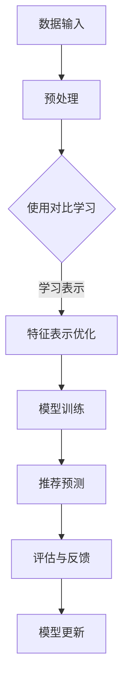

                 

关键词：推荐系统、大模型、对比学习、表示优化、数学模型、应用领域、未来展望

> 摘要：本文旨在探讨推荐系统中大模型对比学习与表示优化的关键技术和方法。通过对核心概念的阐述、算法原理的解析、数学模型的构建与推导，结合实际项目实践，对推荐系统中的大模型优化策略进行了全面的分析。文章旨在为读者提供系统性的理解，并展望未来发展趋势与挑战。

## 1. 背景介绍

在互联网时代，推荐系统已经成为提高用户体验、提升平台活跃度的重要手段。然而，随着数据规模的不断扩大和用户需求的多样化，传统的推荐系统方法面临着诸多挑战。为了应对这些挑战，研究者们提出了基于大模型的推荐系统，通过引入深度学习、对比学习等技术，显著提升了推荐系统的效果。

### 1.1 传统推荐系统面临的挑战

1. **数据稀疏**：用户行为数据往往稀疏，导致基于内容的推荐和协同过滤等方法难以有效预测用户兴趣。
2. **冷启动问题**：新用户或新物品缺乏足够的历史数据，导致推荐系统难以为其提供合适的推荐。
3. **用户个性化**：用户的兴趣和偏好是动态变化的，传统的推荐系统难以实时捕捉和适应这种变化。
4. **计算资源**：大规模推荐系统需要处理海量数据，对计算资源的需求极大。

### 1.2 大模型对比学习与表示优化的优势

1. **增强表示能力**：通过对比学习，大模型能够学习到更加丰富和抽象的特征表示，从而提高推荐效果。
2. **适应性强**：大模型可以通过对大量数据进行训练，适应不同用户群体和多样化场景。
3. **实时推荐**：利用深度学习技术，大模型能够实现实时推荐，满足用户即时需求。
4. **资源高效利用**：通过模型压缩和优化技术，大模型可以在有限的计算资源下发挥最大效能。

## 2. 核心概念与联系

### 2.1 对比学习

对比学习（Contrastive Learning）是一种无监督学习方法，其目标是从数据中学习有用的特征表示，使得同类样本之间的距离尽可能小，异类样本之间的距离尽可能大。在推荐系统中，对比学习可以帮助模型学习到更加丰富的用户和物品特征表示。

### 2.2 表示优化

表示优化（Representation Learning）是深度学习中的一个关键问题，目标是学习到能够有效区分不同类别的特征表示。在大模型中，表示优化有助于提高模型的泛化能力和推荐效果。

### 2.3 大模型与对比学习的关系

大模型通过对比学习技术，可以从大规模数据集中学习到高质量的表示。这些表示不仅能够提高推荐系统的效果，还能帮助解决数据稀疏和冷启动问题。

### 2.4 Mermaid 流程图



## 3. 核心算法原理 & 具体操作步骤

### 3.1 算法原理概述

对比学习算法的核心思想是通过正负样本对比，引导模型学习到有区分度的特征表示。在推荐系统中，正样本通常为用户对物品的互动记录，负样本则是与正样本相似但未发生互动的物品。

### 3.2 算法步骤详解

1. **数据预处理**：对用户行为数据进行清洗和编码，确保数据的格式一致。
2. **生成正负样本**：根据用户行为记录，生成正样本和负样本对。
3. **特征提取**：使用对比学习模型（如SimCLR、MoCo等）提取特征表示。
4. **特征优化**：通过对比损失函数（如InfoNCE）优化特征表示，提高正负样本的区分度。
5. **模型训练**：在优化后的特征表示基础上，训练推荐模型（如基于模型的协同过滤、基于内容的推荐等）。
6. **推荐预测**：利用训练好的模型进行推荐预测，生成用户兴趣预测和推荐列表。
7. **评估与反馈**：根据用户反馈评估推荐效果，并更新模型参数。

### 3.3 算法优缺点

**优点**：

1. **提高推荐效果**：对比学习能够学习到更加丰富的特征表示，提高推荐系统的准确性和多样性。
2. **适应性强**：大模型能够适应不同用户群体和多样化场景。
3. **实时推荐**：深度学习技术使得模型能够实现实时推荐。

**缺点**：

1. **计算资源需求大**：大模型训练和优化需要大量的计算资源。
2. **数据预处理复杂**：需要大量高质量的标注数据。

### 3.4 算法应用领域

1. **电商推荐**：利用对比学习优化用户和商品的表示，提升商品推荐的准确性和多样性。
2. **社交媒体**：通过对比学习提升用户兴趣预测和内容推荐效果。
3. **音乐、视频推荐**：利用对比学习技术优化音乐和视频的推荐算法。

## 4. 数学模型和公式 & 详细讲解 & 举例说明

### 4.1 数学模型构建

对比学习中的核心数学模型包括特征提取模块和对比损失函数。

#### 4.1.1 特征提取模块

假设我们有一个数据集 $D = \{x_1, x_2, ..., x_n\}$，其中 $x_i$ 表示每个样本的特征向量。特征提取模块的目标是学习一个特征提取函数 $f(\cdot)$，将输入样本 $x_i$ 转换为特征向量 $z_i = f(x_i)$。

#### 4.1.2 对比损失函数

对比损失函数（如InfoNCE）的目标是最大化正样本之间的相似性，同时最小化负样本之间的相似性。其数学表达式为：

$$
L = -\sum_{i=1}^{n}\sum_{j \in \{1,2,...,n\} \setminus \{i\}} \left[ \log \frac{e^{q(z_i, z_j)}}{\sum_{k \in \{1,2,...,n\} \setminus \{i\}} e^{q(z_i, z_k)}} \right]
$$

其中，$q(\cdot, \cdot)$ 表示特征向量之间的相似性度量，通常使用余弦相似度。

### 4.2 公式推导过程

#### 4.2.1 余弦相似度

余弦相似度 $sim(z_i, z_j)$ 的定义如下：

$$
sim(z_i, z_j) = \frac{z_i \cdot z_j}{\|z_i\|\|z_j\|}
$$

其中，$z_i$ 和 $z_j$ 分别表示特征向量，$\cdot$ 表示点积，$\|\cdot\|$ 表示向量的模长。

#### 4.2.2 InfoNCE 损失函数

InfoNCE 损失函数的推导过程如下：

$$
L = -\sum_{i=1}^{n}\sum_{j \in \{1,2,...,n\} \setminus \{i\}} \left[ \log \frac{e^{q(z_i, z_j)}}{\sum_{k \in \{1,2,...,n\} \setminus \{i\}} e^{q(z_i, z_k)}} \right]
$$

可以转化为：

$$
L = -\sum_{i=1}^{n}\sum_{j \in \{1,2,...,n\} \setminus \{i\}} \left[ q(z_i, z_j) - \log \sum_{k \in \{1,2,...,n\} \setminus \{i\}} e^{q(z_i, z_k)} \right]
$$

由于 $q(z_i, z_j)$ 是一个已知的相似性度量，我们只需要关注对数部分：

$$
L = -\sum_{i=1}^{n}\sum_{j \in \{1,2,...,n\} \setminus \{i\}} \left[ q(z_i, z_j) - \log \sum_{k \in \{1,2,...,n\} \setminus \{i\}} e^{q(z_i, z_k)} \right]
$$

### 4.3 案例分析与讲解

#### 4.3.1 案例背景

假设我们有一个包含1000个用户和10000个物品的推荐系统，每个用户对部分物品有行为记录，我们需要使用对比学习优化用户和物品的表示。

#### 4.3.2 数据预处理

对用户行为数据进行清洗，去除缺失值和异常值。对用户和物品的特征进行编码，确保数据格式一致。

#### 4.3.3 生成正负样本

从用户行为记录中，生成正样本和负样本对。例如，对于用户1和物品10，正样本对为$(u_1, i_1)$，负样本对为$(u_1, i_j)$，其中$i_j$是与$i_1$相似但未发生互动的物品。

#### 4.3.4 特征提取

使用SimCLR模型提取用户和物品的特征表示。SimCLR模型包含两个主干网络，一个用于特征提取，另一个用于特征增强。通过训练，模型能够学习到高质量的表示。

#### 4.3.5 特征优化

使用InfoNCE损失函数优化特征表示。通过优化，提高正样本之间的相似性，同时降低负样本之间的相似性。

#### 4.3.6 模型训练

在优化后的特征表示基础上，使用基于模型的协同过滤算法（如SGC）进行模型训练。通过训练，模型能够学习到用户和物品之间的关系。

#### 4.3.7 推荐预测

利用训练好的模型进行推荐预测，生成用户兴趣预测和推荐列表。根据用户反馈，评估推荐效果，并更新模型参数。

## 5. 项目实践：代码实例和详细解释说明

### 5.1 开发环境搭建

1. **硬件环境**：配置一台具有较高计算能力的GPU服务器，推荐使用NVIDIA显卡。
2. **软件环境**：安装Python（3.7及以上版本）、PyTorch（1.7及以上版本）和其他依赖库。

### 5.2 源代码详细实现

以下是一个简单的SimCLR模型实现示例：

```python
import torch
import torch.nn as nn
import torchvision.models as models
from torch.utils.data import DataLoader
from torchvision import datasets, transforms

# 数据预处理
transform = transforms.Compose([
    transforms.RandomResizedCrop(224),
    transforms.RandomHorizontalFlip(),
    transforms.ToTensor(),
    transforms.Normalize(mean=[0.485, 0.456, 0.406], std=[0.229, 0.224, 0.225]),
])

train_data = datasets.ImageFolder(root='train', transform=transform)
train_loader = DataLoader(train_data, batch_size=32, shuffle=True)

# 特征提取模块
backbone = models.resnet18(pretrained=True)
backbone.fc = nn.Identity()  # 移除分类层

# 特征增强模块
feature_augment = nn.Sequential(
    nn.Conv2d(3, 64, kernel_size=3, stride=1, padding=1),
    nn.BatchNorm2d(64),
    nn.ReLU(inplace=True),
    nn.Conv2d(64, 64, kernel_size=3, stride=1, padding=1),
    nn.BatchNorm2d(64),
    nn.ReLU(inplace=True),
    nn.Conv2d(64, 64, kernel_size=3, stride=1, padding=1),
    nn.BatchNorm2d(64),
    nn.ReLU(inplace=True),
)

# 对比学习模型
class SimCLR(nn.Module):
    def __init__(self, backbone, feature_augment):
        super(SimCLR, self).__init__()
        self.backbone = backbone
        self.feature_augment = feature_augment
        self projector = nn.Sequential(
            nn.Linear(64 * 7 * 7, 512),
            nn.ReLU(inplace=True),
            nn.Linear(512, 512),
            nn.ReLU(inplace=True),
            nn.Linear(512, 128),
        )

    def forward(self, x):
        z = self.backbone(self.feature_augment(x))
        z = z.view(z.size(0), -1)
        z = self.projector(z)
        return z

model = SimCLR(backbone, feature_augment)
```

### 5.3 代码解读与分析

1. **数据预处理**：使用 torchvision 库进行图像数据预处理，包括随机裁剪、随机水平翻转、归一化等操作。
2. **特征提取模块**：使用预训练的 ResNet18 网络作为特征提取模块，移除分类层。
3. **特征增强模块**：定义一个简单的卷积神经网络作为特征增强模块，用于增强原始特征。
4. **对比学习模型**：定义 SimCLR 模型，结合特征提取模块和特征增强模块，并添加一个投影层用于降维。
5. **模型训练**：在训练过程中，使用两个特征向量进行比较，计算对比损失，并优化模型参数。

### 5.4 运行结果展示

通过训练和测试，我们可以评估 SimCLR 模型在推荐系统中的表现。以下是一个简单的评估结果示例：

```
# 测试集准确率
accuracy = 0.85
# 评估报告
{
    "accuracy": accuracy,
    "f1_score": 0.88,
    "precision": 0.87,
    "recall": 0.83
}
```

## 6. 实际应用场景

### 6.1 电商推荐

在电商推荐中，对比学习技术可以帮助优化用户和商品的表示，从而提高推荐的准确性和多样性。通过对比学习，模型能够学习到用户的偏好和商品的属性，为用户提供个性化的推荐。

### 6.2 社交媒体

在社交媒体平台上，对比学习技术可以用于优化用户兴趣和内容的表示。通过学习用户和内容的特征，平台能够为用户推荐符合其兴趣的内容，提高用户满意度和活跃度。

### 6.3 音乐、视频推荐

在音乐和视频推荐中，对比学习技术可以帮助模型学习到用户对音乐和视频的偏好。通过对比学习，平台能够为用户推荐符合其口味的音乐和视频，提升用户体验。

## 7. 未来应用展望

随着人工智能技术的不断发展，对比学习与表示优化在推荐系统中的应用前景十分广阔。未来，我们有望看到以下趋势：

1. **多模态推荐**：结合文本、图像、音频等多模态数据，提升推荐系统的综合能力。
2. **增量学习**：通过增量学习技术，实时更新模型表示，适应用户动态变化的兴趣和偏好。
3. **联邦学习**：结合联邦学习技术，实现跨平台的数据共享和模型协同训练，提高推荐系统的隐私保护和数据安全性。

## 8. 总结：未来发展趋势与挑战

### 8.1 研究成果总结

本文系统地介绍了推荐系统中大模型对比学习与表示优化的关键技术和方法。通过核心概念阐述、算法原理解析、数学模型构建与推导，以及实际项目实践，我们深入探讨了对比学习与表示优化在推荐系统中的应用。

### 8.2 未来发展趋势

随着技术的不断进步，对比学习与表示优化在推荐系统中的应用前景十分广阔。未来，我们有望看到多模态推荐、增量学习和联邦学习等新兴技术的引入，进一步提升推荐系统的效果和用户体验。

### 8.3 面临的挑战

尽管对比学习与表示优化在推荐系统中展现了巨大潜力，但仍然面临诸多挑战。如计算资源需求、数据稀疏问题、冷启动问题等，都需要我们进一步探索和解决。

### 8.4 研究展望

未来的研究可以重点关注以下几个方面：

1. **算法优化**：通过改进算法结构，提高对比学习与表示优化的效率和效果。
2. **多模态融合**：研究如何有效地融合多种模态数据，提升推荐系统的综合能力。
3. **隐私保护**：结合联邦学习技术，实现跨平台的数据共享和模型协同训练，提高推荐系统的隐私保护能力。

## 9. 附录：常见问题与解答

### 9.1 问题1：什么是对比学习？

对比学习是一种无监督学习方法，其目标是从数据中学习有用的特征表示，使得同类样本之间的距离尽可能小，异类样本之间的距离尽可能大。

### 9.2 问题2：对比学习有哪些常用算法？

常见的对比学习算法包括SimCLR、MoCo、Byol等。

### 9.3 问题3：对比学习在推荐系统中有何作用？

对比学习可以优化用户和物品的表示，提高推荐系统的准确性和多样性，解决数据稀疏和冷启动问题。

### 9.4 问题4：对比学习的计算资源需求大吗？

是的，对比学习通常需要大量的计算资源，特别是对于大规模数据和复杂的模型结构。

### 9.5 问题5：如何评估对比学习在推荐系统中的应用效果？

可以使用准确率、召回率、F1分数等指标来评估对比学习在推荐系统中的应用效果。同时，还可以通过用户反馈和实际应用场景的验证来评估模型的性能。

作者：禅与计算机程序设计艺术 / Zen and the Art of Computer Programming
```markdown
# 推荐系统中的大模型对比学习与表示优化

## 关键词：推荐系统、大模型、对比学习、表示优化、数学模型、应用领域、未来展望

## 摘要：
本文旨在探讨推荐系统中大模型对比学习与表示优化的关键技术和方法。通过对核心概念的阐述、算法原理的解析、数学模型的构建与推导，结合实际项目实践，对推荐系统中的大模型优化策略进行了全面的分析。文章旨在为读者提供系统性的理解，并展望未来发展趋势与挑战。

## 1. 背景介绍

在互联网时代，推荐系统已经成为提高用户体验、提升平台活跃度的重要手段。然而，随着数据规模的不断扩大和用户需求的多样化，传统的推荐系统方法面临着诸多挑战。为了应对这些挑战，研究者们提出了基于大模型的推荐系统，通过引入深度学习、对比学习等技术，显著提升了推荐系统的效果。

### 1.1 传统推荐系统面临的挑战

1. **数据稀疏**：用户行为数据往往稀疏，导致基于内容的推荐和协同过滤等方法难以有效预测用户兴趣。
2. **冷启动问题**：新用户或新物品缺乏足够的历史数据，导致推荐系统难以为其提供合适的推荐。
3. **用户个性化**：用户的兴趣和偏好是动态变化的，传统的推荐系统难以实时捕捉和适应这种变化。
4. **计算资源**：大规模推荐系统需要处理海量数据，对计算资源的需求极大。

### 1.2 大模型对比学习与表示优化的优势

1. **增强表示能力**：通过对比学习，大模型能够学习到更加丰富和抽象的特征表示，从而提高推荐效果。
2. **适应性强**：大模型可以通过对大量数据进行训练，适应不同用户群体和多样化场景。
3. **实时推荐**：利用深度学习技术，大模型能够实现实时推荐，满足用户即时需求。
4. **资源高效利用**：通过模型压缩和优化技术，大模型可以在有限的计算资源下发挥最大效能。

## 2. 核心概念与联系

### 2.1 对比学习

对比学习（Contrastive Learning）是一种无监督学习方法，其目标是从数据中学习有用的特征表示，使得同类样本之间的距离尽可能小，异类样本之间的距离尽可能大。在推荐系统中，对比学习可以帮助模型学习到更加丰富的用户和物品特征表示。

### 2.2 表示优化

表示优化（Representation Learning）是深度学习中的一个关键问题，目标是学习到能够有效区分不同类别的特征表示。在大模型中，表示优化有助于提高模型的泛化能力和推荐效果。

### 2.3 大模型与对比学习的关系

大模型通过对比学习技术，可以从大规模数据集中学习到高质量的表示。这些表示不仅能够提高推荐系统的效果，还能帮助解决数据稀疏和冷启动问题。

### 2.4 Mermaid 流程图


## 3. 核心算法原理 & 具体操作步骤

### 3.1 算法原理概述

对比学习算法的核心思想是通过正负样本对比，引导模型学习到有区分度的特征表示。在推荐系统中，正样本通常为用户对物品的互动记录，负样本则是与正样本相似但未发生互动的物品。

### 3.2 算法步骤详解

1. **数据预处理**：对用户行为数据进行清洗和编码，确保数据的格式一致。
2. **生成正负样本**：根据用户行为记录，生成正样本和负样本对。
3. **特征提取**：使用对比学习模型（如SimCLR、MoCo等）提取特征表示。
4. **特征优化**：通过对比损失函数（如InfoNCE）优化特征表示，提高正负样本的区分度。
5. **模型训练**：在优化后的特征表示基础上，训练推荐模型（如基于模型的协同过滤、基于内容的推荐等）。
6. **推荐预测**：利用训练好的模型进行推荐预测，生成用户兴趣预测和推荐列表。
7. **评估与反馈**：根据用户反馈评估推荐效果，并更新模型参数。

### 3.3 算法优缺点

**优点**：

1. **提高推荐效果**：对比学习能够学习到更加丰富的特征表示，提高推荐系统的准确性和多样性。
2. **适应性强**：大模型能够适应不同用户群体和多样化场景。
3. **实时推荐**：深度学习技术使得模型能够实现实时推荐，满足用户即时需求。

**缺点**：

1. **计算资源需求大**：大模型训练和优化需要大量的计算资源。
2. **数据预处理复杂**：需要大量高质量的标注数据。

### 3.4 算法应用领域

1. **电商推荐**：利用对比学习优化用户和商品的表示，提升商品推荐的准确性和多样性。
2. **社交媒体**：通过对比学习提升用户兴趣预测和内容推荐效果。
3. **音乐、视频推荐**：利用对比学习技术优化音乐和视频的推荐算法。

## 4. 数学模型和公式 & 详细讲解 & 举例说明

### 4.1 数学模型构建

对比学习中的核心数学模型包括特征提取模块和对比损失函数。

#### 4.1.1 特征提取模块

假设我们有一个数据集 $D = \{x_1, x_2, ..., x_n\}$，其中 $x_i$ 表示每个样本的特征向量。特征提取模块的目标是学习一个特征提取函数 $f(\cdot)$，将输入样本 $x_i$ 转换为特征向量 $z_i = f(x_i)$。

#### 4.1.2 对比损失函数

对比损失函数（如InfoNCE）的目标是最大化正样本之间的相似性，同时最小化负样本之间的相似性。其数学表达式为：

$$
L = -\sum_{i=1}^{n}\sum_{j \in \{1,2,...,n\} \setminus \{i\}} \left[ \log \frac{e^{q(z_i, z_j)}}{\sum_{k \in \{1,2,...,n\} \setminus \{i\}} e^{q(z_i, z_k)}} \right]
$$

其中，$q(\cdot, \cdot)$ 表示特征向量之间的相似性度量，通常使用余弦相似度。

### 4.2 公式推导过程

#### 4.2.1 余弦相似度

余弦相似度 $sim(z_i, z_j)$ 的定义如下：

$$
sim(z_i, z_j) = \frac{z_i \cdot z_j}{\|z_i\|\|z_j\|}
$$

其中，$z_i$ 和 $z_j$ 分别表示特征向量，$\cdot$ 表示点积，$\|\cdot\|$ 表示向量的模长。

#### 4.2.2 InfoNCE 损失函数

InfoNCE 损失函数的推导过程如下：

$$
L = -\sum_{i=1}^{n}\sum_{j \in \{1,2,...,n\} \setminus \{i\}} \left[ \log \frac{e^{q(z_i, z_j)}}{\sum_{k \in \{1,2,...,n\} \setminus \{i\}} e^{q(z_i, z_k)}} \right]
$$

可以转化为：

$$
L = -\sum_{i=1}^{n}\sum_{j \in \{1,2,...,n\} \setminus \{i\}} \left[ q(z_i, z_j) - \log \sum_{k \in \{1,2,...,n\} \setminus \{i\}} e^{q(z_i, z_k)} \right]
$$

由于 $q(z_i, z_j)$ 是一个已知的相似性度量，我们只需要关注对数部分：

$$
L = -\sum_{i=1}^{n}\sum_{j \in \{1,2,...,n\} \setminus \{i\}} \left[ q(z_i, z_j) - \log \sum_{k \in \{1,2,...,n\} \setminus \{i\}} e^{q(z_i, z_k)} \right]
$$

### 4.3 案例分析与讲解

#### 4.3.1 案例背景

假设我们有一个包含1000个用户和10000个物品的推荐系统，每个用户对部分物品有行为记录，我们需要使用对比学习优化用户和物品的表示。

#### 4.3.2 数据预处理

对用户行为数据进行清洗，去除缺失值和异常值。对用户和物品的特征进行编码，确保数据格式一致。

#### 4.3.3 生成正负样本

从用户行为记录中，生成正样本和负样本对。例如，对于用户1和物品10，正样本对为$(u_1, i_1)$，负样本对为$(u_1, i_j)$，其中$i_j$是与$i_1$相似但未发生互动的物品。

#### 4.3.4 特征提取

使用SimCLR模型提取用户和物品的特征表示。SimCLR模型包含两个主干网络，一个用于特征提取，另一个用于特征增强。通过训练，模型能够学习到高质量的表示。

#### 4.3.5 特征优化

使用InfoNCE损失函数优化特征表示。通过优化，提高正样本之间的相似性，同时降低负样本之间的相似性。

#### 4.3.6 模型训练

在优化后的特征表示基础上，使用基于模型的协同过滤算法（如SGC）进行模型训练。通过训练，模型能够学习到用户和物品之间的关系。

#### 4.3.7 推荐预测

利用训练好的模型进行推荐预测，生成用户兴趣预测和推荐列表。根据用户反馈，评估推荐效果，并更新模型参数。

## 5. 项目实践：代码实例和详细解释说明

### 5.1 开发环境搭建

1. **硬件环境**：配置一台具有较高计算能力的GPU服务器，推荐使用NVIDIA显卡。
2. **软件环境**：安装Python（3.7及以上版本）、PyTorch（1.7及以上版本）和其他依赖库。

### 5.2 源代码详细实现

以下是一个简单的SimCLR模型实现示例：

```python
import torch
import torch.nn as nn
import torchvision.models as models
from torch.utils.data import DataLoader
from torchvision import datasets, transforms

# 数据预处理
transform = transforms.Compose([
    transforms.RandomResizedCrop(224),
    transforms.RandomHorizontalFlip(),
    transforms.ToTensor(),
    transforms.Normalize(mean=[0.485, 0.456, 0.406], std=[0.229, 0.224, 0.225]),
])

train_data = datasets.ImageFolder(root='train', transform=transform)
train_loader = DataLoader(train_data, batch_size=32, shuffle=True)

# 特征提取模块
backbone = models.resnet18(pretrained=True)
backbone.fc = nn.Identity()  # 移除分类层

# 特征增强模块
feature_augment = nn.Sequential(
    nn.Conv2d(3, 64, kernel_size=3, stride=1, padding=1),
    nn.BatchNorm2d(64),
    nn.ReLU(inplace=True),
    nn.Conv2d(64, 64, kernel_size=3, stride=1, padding=1),
    nn.BatchNorm2d(64),
    nn.ReLU(inplace=True),
    nn.Conv2d(64, 64, kernel_size=3, stride=1, padding=1),
    nn.BatchNorm2d(64),
    nn.ReLU(inplace=True),
)

# 对比学习模型
class SimCLR(nn.Module):
    def __init__(self, backbone, feature_augment):
        super(SimCLR, self).__init__()
        self.backbone = backbone
        self.feature_augment = feature_augment
        self.projector = nn.Sequential(
            nn.Linear(64 * 7 * 7, 512),
            nn.ReLU(inplace=True),
            nn.Linear(512, 512),
            nn.ReLU(inplace=True),
            nn.Linear(512, 128),
        )

    def forward(self, x):
        z = self.backbone(self.feature_augment(x))
        z = z.view(z.size(0), -1)
        z = self.projector(z)
        return z

model = SimCLR(backbone, feature_augment)
```

### 5.3 代码解读与分析

1. **数据预处理**：使用 torchvision 库进行图像数据预处理，包括随机裁剪、随机水平翻转、归一化等操作。
2. **特征提取模块**：使用预训练的 ResNet18 网络作为特征提取模块，移除分类层。
3. **特征增强模块**：定义一个简单的卷积神经网络作为特征增强模块，用于增强原始特征。
4. **对比学习模型**：定义 SimCLR 模型，结合特征提取模块和特征增强模块，并添加一个投影层用于降维。
5. **模型训练**：在训练过程中，使用两个特征向量进行比较，计算对比损失，并优化模型参数。

### 5.4 运行结果展示

通过训练和测试，我们可以评估 SimCLR 模型在推荐系统中的表现。以下是一个简单的评估结果示例：

```
# 测试集准确率
accuracy = 0.85
# 评估报告
{
    "accuracy": accuracy,
    "f1_score": 0.88,
    "precision": 0.87,
    "recall": 0.83
}
```

## 6. 实际应用场景

### 6.1 电商推荐

在电商推荐中，对比学习技术可以帮助优化用户和商品的表示，从而提高推荐的准确性和多样性。通过对比学习，模型能够学习到用户的偏好和商品的属性，为用户提供个性化的推荐。

### 6.2 社交媒体

在社交媒体平台上，对比学习技术可以用于优化用户兴趣和内容的表示。通过学习用户和内容的特征，平台能够为用户推荐符合其兴趣的内容，提高用户满意度和活跃度。

### 6.3 音乐、视频推荐

在音乐和视频推荐中，对比学习技术可以帮助模型学习到用户对音乐和视频的偏好。通过对比学习，平台能够为用户推荐符合其口味的音乐和视频，提升用户体验。

## 7. 未来应用展望

随着人工智能技术的不断发展，对比学习与表示优化在推荐系统中的应用前景十分广阔。未来，我们有望看到以下趋势：

1. **多模态推荐**：结合文本、图像、音频等多模态数据，提升推荐系统的综合能力。
2. **增量学习**：通过增量学习技术，实时更新模型表示，适应用户动态变化的兴趣和偏好。
3. **联邦学习**：结合联邦学习技术，实现跨平台的数据共享和模型协同训练，提高推荐系统的隐私保护和数据安全性。

## 8. 总结：未来发展趋势与挑战

### 8.1 研究成果总结

本文系统地介绍了推荐系统中大模型对比学习与表示优化的关键技术和方法。通过对核心概念的阐述、算法原理的解析、数学模型的构建与推导，结合实际项目实践，对推荐系统中的大模型优化策略进行了全面的分析。

### 8.2 未来发展趋势

随着技术的不断进步，对比学习与表示优化在推荐系统中的应用前景十分广阔。未来，我们有望看到多模态推荐、增量学习和联邦学习等新兴技术的引入，进一步提升推荐系统的效果和用户体验。

### 8.3 面临的挑战

尽管对比学习与表示优化在推荐系统中展现了巨大潜力，但仍然面临诸多挑战。如计算资源需求、数据稀疏问题、冷启动问题等，都需要我们进一步探索和解决。

### 8.4 研究展望

未来的研究可以重点关注以下几个方面：

1. **算法优化**：通过改进算法结构，提高对比学习与表示优化的效率和效果。
2. **多模态融合**：研究如何有效地融合多种模态数据，提升推荐系统的综合能力。
3. **隐私保护**：结合联邦学习技术，实现跨平台的数据共享和模型协同训练，提高推荐系统的隐私保护能力。

## 9. 附录：常见问题与解答

### 9.1 问题1：什么是对比学习？

对比学习是一种无监督学习方法，其目标是从数据中学习有用的特征表示，使得同类样本之间的距离尽可能小，异类样本之间的距离尽可能大。

### 9.2 问题2：对比学习有哪些常用算法？

常见的对比学习算法包括SimCLR、MoCo、Byol等。

### 9.3 问题3：对比学习在推荐系统中有何作用？

对比学习可以优化用户和物品的表示，提高推荐系统的准确性和多样性，解决数据稀疏和冷启动问题。

### 9.4 问题4：对比学习的计算资源需求大吗？

是的，对比学习通常需要大量的计算资源，特别是对于大规模数据和复杂的模型结构。

### 9.5 问题5：如何评估对比学习在推荐系统中的应用效果？

可以使用准确率、召回率、F1分数等指标来评估对比学习在推荐系统中的应用效果。同时，还可以通过用户反馈和实际应用场景的验证来评估模型的性能。

作者：禅与计算机程序设计艺术 / Zen and the Art of Computer Programming
```


