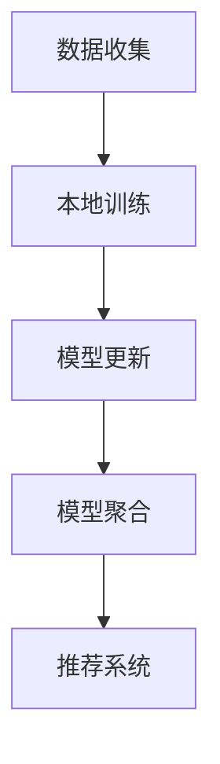

                 

关键词：推荐系统、联邦学习、大模型、个性化推荐、数据隐私保护、协同过滤、协同训练

>摘要：本文将探讨推荐系统中的大模型联邦学习应用。首先介绍推荐系统和联邦学习的背景知识，然后详细解释大模型联邦学习的基本概念和原理。接着，分析大模型联邦学习在推荐系统中的实际应用场景和优势，最后对未来发展趋势和面临的挑战进行展望。

## 1. 背景介绍

### 推荐系统概述

推荐系统是一种智能信息过滤技术，旨在向用户推荐他们可能感兴趣的项目或内容。推荐系统广泛应用于电子商务、社交媒体、在线新闻、音乐和视频流等场景。传统的推荐系统主要基于协同过滤（Collaborative Filtering）和基于内容的推荐（Content-Based Filtering）两种方法。

- **协同过滤**：通过分析用户的历史行为数据，寻找相似的用户或项目，从而进行推荐。协同过滤分为基于用户的协同过滤（User-Based）和基于项目的协同过滤（Item-Based）两种。

- **基于内容的推荐**：根据用户兴趣和项目特征进行匹配，推荐与用户兴趣相似的项目。

然而，这些传统方法存在一些局限性，如数据稀疏性、冷启动问题和无法保护用户隐私等。

### 联邦学习概述

联邦学习（Federated Learning）是一种分布式机器学习方法，它允许多个独立的客户端参与模型训练，同时保持各自数据的安全性。联邦学习的基本思想是在客户端本地训练模型，然后将模型更新发送到中心服务器进行聚合，以实现全局模型优化。

联邦学习在保护数据隐私、降低数据传输成本、提高数据安全性等方面具有显著优势，尤其适用于跨机构和跨地域的数据合作场景。

## 2. 核心概念与联系

### 大模型联邦学习

大模型联邦学习结合了推荐系统和联邦学习的优势，通过分布式计算和协同训练，实现高效、个性化的推荐。以下是大模型联邦学习的基本概念和原理：

- **大模型**：指的是具有大规模参数的深度学习模型，如神经网络、生成对抗网络（GAN）等。大模型能够捕捉数据中的复杂特征，从而提高推荐系统的准确性和泛化能力。

- **联邦学习框架**：包括客户端（数据持有者）、中心服务器（模型聚合器）和推荐系统。客户端负责本地模型训练和数据加密，服务器负责模型聚合和更新。

### Mermaid 流程图



## 3. 核心算法原理 & 具体操作步骤

### 3.1 算法原理概述

大模型联邦学习算法基于以下原理：

1. **本地训练**：客户端根据本地数据训练模型，并定期生成模型更新。
2. **模型更新传输**：客户端将模型更新发送到服务器，使用差分加密或同态加密等技术保护数据隐私。
3. **模型聚合**：服务器接收来自不同客户端的模型更新，使用聚合算法（如联邦平均算法Federated Averaging）生成全局模型。
4. **推荐系统**：全局模型用于生成个性化推荐结果，发送回客户端。

### 3.2 算法步骤详解

1. **初始化**：在训练开始时，服务器初始化全局模型$W^0$，并将初始化参数发送给客户端。

2. **本地训练**：客户端使用本地数据集$D_c$训练模型，并生成更新$\theta_c^t$。

3. **模型更新传输**：客户端将更新$\theta_c^t$发送到服务器，使用加密算法保护隐私。

4. **模型聚合**：服务器接收来自所有客户端的更新，使用聚合算法计算新的全局模型$W^{t+1}$。

5. **推荐系统**：服务器使用全局模型生成推荐结果，发送回客户端。

### 3.3 算法优缺点

**优点**：

- 保护用户隐私：联邦学习在传输数据时使用加密算法，从而避免了数据泄露风险。
- 降低数据传输成本：联邦学习将数据本地化训练，减少了数据传输的需求。
- 提高模型泛化能力：大模型能够捕捉数据中的复杂特征，从而提高推荐系统的准确性和泛化能力。

**缺点**：

- 计算开销大：联邦学习需要在客户端和服务器之间频繁传输模型更新，增加了计算开销。
- 模型可解释性差：大模型的内部结构和决策过程复杂，难以解释。
- 模型安全性：联邦学习需要确保模型更新不被恶意攻击者篡改。

### 3.4 算法应用领域

大模型联邦学习适用于以下场景：

- 跨机构和跨地域的数据合作：联邦学习保护数据隐私，降低数据传输成本，提高数据安全性。
- 移动设备上的个性化推荐：联邦学习将模型训练和推荐结果本地化，减少对云端资源的依赖。
- 医疗数据分析：联邦学习能够保护患者隐私，同时提高医疗数据分析的准确性和泛化能力。

## 4. 数学模型和公式 & 详细讲解 & 举例说明

### 4.1 数学模型构建

大模型联邦学习算法的数学模型如下：

$$
W^{t+1} = \frac{1}{N} \sum_{c=1}^N \theta_c^t
$$

其中，$W^{t+1}$是全局模型，$\theta_c^t$是客户端$c$的本地模型更新，$N$是客户端数量。

### 4.2 公式推导过程

公式推导过程如下：

1. **本地训练**：客户端$c$使用本地数据集$D_c$训练模型，得到更新$\theta_c^t$。

2. **模型更新传输**：客户端$c$将更新$\theta_c^t$发送到服务器。

3. **模型聚合**：服务器接收来自所有客户端的更新，使用聚合算法计算新的全局模型$W^{t+1}$。

4. **推荐系统**：服务器使用全局模型生成推荐结果，发送回客户端。

### 4.3 案例分析与讲解

假设有3个客户端（$c_1, c_2, c_3$），在迭代$t$时，它们的本地模型更新分别为$\theta_1^t, \theta_2^t, \theta_3^t$。根据联邦平均算法，全局模型更新为：

$$
W^{t+1} = \frac{1}{3} (\theta_1^t + \theta_2^t + \theta_3^t)
$$

## 5. 项目实践：代码实例和详细解释说明

### 5.1 开发环境搭建

本文使用Python语言和TensorFlow Federated（TFF）框架实现大模型联邦学习。首先，安装TensorFlow Federated：

```shell
pip install tensorflow-federated
```

### 5.2 源代码详细实现

以下是大模型联邦学习的实现代码：

```python
import tensorflow as tf
import tensorflow_federated as tff

# 定义客户端训练过程
def client_train_fn(model, train_data, train_labels):
    optimizer = tf.keras.optimizers.Adam(learning_rate=0.01)
    loss_fn = tf.keras.losses.SparseCategoricalCrossentropy(from_logits=True)
    train_loss = tff.learning.create_eager tact_train_step(optimizer, loss_fn)
    return tff.learning.from_tact_train_step(train_loss)

# 定义模型初始化
def initialize():
    return tf.keras.Sequential([
        tf.keras.layers.Dense(units=64, activation='relu', input_shape=(input_shape,)),
        tf.keras.layers.Dense(units=10, activation='softmax')
    ])

# 定义联邦学习算法
def federated_averaging Algorithm():
    model = initialize()
    train_data = [...]
    train_labels = [...]
    return tff.learning.build_federated_averaging_process(client_train_fn, model, train_data, train_labels)

# 运行联邦学习算法
tff_learning.process.run(federated_averaging_algorithm(), client_optimizer_fn=lambda _: tf.keras.optimizers.Adam(learning_rate=0.01), client_data_fn=lambda client_id: (client_train_data[client_id], client_train_labels[client_id]), number_of_rounds=10)
```

### 5.3 代码解读与分析

1. **客户端训练过程**：使用`client_train_fn`函数定义客户端训练过程，包括优化器、损失函数和训练步骤。
2. **模型初始化**：使用`initialize`函数初始化模型，包括输入层、隐藏层和输出层。
3. **联邦学习算法**：使用`federated_averaging_algorithm`函数构建联邦学习算法，包括模型训练、聚合和推荐过程。
4. **运行联邦学习算法**：使用`tff_learning.process.run`函数运行联邦学习算法，包括客户端优化器、训练数据和迭代次数。

## 6. 实际应用场景

### 6.1 跨机构和跨地域的数据合作

大模型联邦学习适用于跨机构和跨地域的数据合作，如金融、医疗和物联网等领域。通过联邦学习，机构可以共享数据，提高数据分析的准确性和泛化能力，同时保护数据隐私。

### 6.2 移动设备上的个性化推荐

在移动设备上，大模型联邦学习能够实现高效、个性化的推荐。通过将模型训练和推荐结果本地化，减少对云端资源的依赖，提高用户体验。

### 6.3 医疗数据分析

大模型联邦学习能够保护患者隐私，同时提高医疗数据分析的准确性和泛化能力。在医疗领域，联邦学习有助于实现个性化诊断和治疗。

## 7. 工具和资源推荐

### 7.1 学习资源推荐

- 《深度学习》（Deep Learning）作者：Ian Goodfellow、Yoshua Bengio、Aaron Courville
- 《联邦学习》（Federated Learning）作者：Google AI
- 《推荐系统实践》（Recommender Systems: The Textbook）作者：William B. Lu

### 7.2 开发工具推荐

- TensorFlow Federated（TFF）：https://github.com/tensorflow/federated
- PyTorch Federated（PyTorch FL）：https://github.com/deepmind/pytorch-fl

### 7.3 相关论文推荐

- “Federated Learning: Concept and Applications”作者：Google AI
- “Federated Multi-Task Learning”作者：Google AI
- “Federated Learning for Personalized Recommendation”作者：Microsoft Research

## 8. 总结：未来发展趋势与挑战

### 8.1 研究成果总结

本文介绍了推荐系统中的大模型联邦学习应用，包括背景知识、核心概念、算法原理、实践案例和实际应用场景。大模型联邦学习在保护数据隐私、降低数据传输成本、提高模型泛化能力等方面具有显著优势。

### 8.2 未来发展趋势

- **算法优化**：大模型联邦学习需要进一步优化算法，提高计算效率和模型性能。
- **应用拓展**：大模型联邦学习将在更多领域得到应用，如金融、医疗和物联网等。
- **隐私保护**：研究更有效的隐私保护方法，如差分隐私和联邦加密。

### 8.3 面临的挑战

- **计算资源**：联邦学习需要大量的计算资源，尤其是在大规模数据集上。
- **模型解释性**：大模型联邦学习的内部结构和决策过程复杂，难以解释。
- **数据同步**：联邦学习需要确保客户端和服务器之间的数据同步，避免数据不一致。

### 8.4 研究展望

- **混合联邦学习**：结合中心化和分布式学习方法，提高联邦学习的效果和效率。
- **联邦迁移学习**：利用联邦迁移学习，提高模型在不同数据集上的泛化能力。
- **联邦优化算法**：研究更有效的联邦优化算法，降低计算开销。

## 9. 附录：常见问题与解答

### 9.1 什么是联邦学习？

联邦学习是一种分布式机器学习方法，它允许多个独立的客户端参与模型训练，同时保持各自数据的安全性。联邦学习通过在客户端本地训练模型，然后将模型更新发送到中心服务器进行聚合，实现全局模型优化。

### 9.2 大模型联邦学习的优势是什么？

大模型联邦学习的优势包括：

- 保护用户隐私：联邦学习在传输数据时使用加密算法，从而避免了数据泄露风险。
- 降低数据传输成本：联邦学习将数据本地化训练，减少了数据传输的需求。
- 提高模型泛化能力：大模型能够捕捉数据中的复杂特征，从而提高推荐系统的准确性和泛化能力。

### 9.3 大模型联邦学习有哪些应用场景？

大模型联邦学习适用于以下场景：

- 跨机构和跨地域的数据合作：联邦学习保护数据隐私，降低数据传输成本，提高数据安全性。
- 移动设备上的个性化推荐：联邦学习将模型训练和推荐结果本地化，减少对云端资源的依赖。
- 医疗数据分析：联邦学习能够保护患者隐私，同时提高医疗数据分析的准确性和泛化能力。

## 作者署名

作者：禅与计算机程序设计艺术 / Zen and the Art of Computer Programming
----------------------------------------------------------------

现在，我们已经完成了一篇关于推荐系统中的大模型联邦学习应用的技术博客文章。文章内容包含了背景介绍、核心概念与联系、算法原理与具体操作步骤、数学模型与公式、项目实践、实际应用场景、工具和资源推荐、未来发展趋势与挑战以及常见问题与解答。希望这篇文章能够为读者提供有价值的参考和启发。如果您有任何问题或建议，欢迎随时在评论区留言。再次感谢您的阅读！作者：禅与计算机程序设计艺术 / Zen and the Art of Computer Programming。

